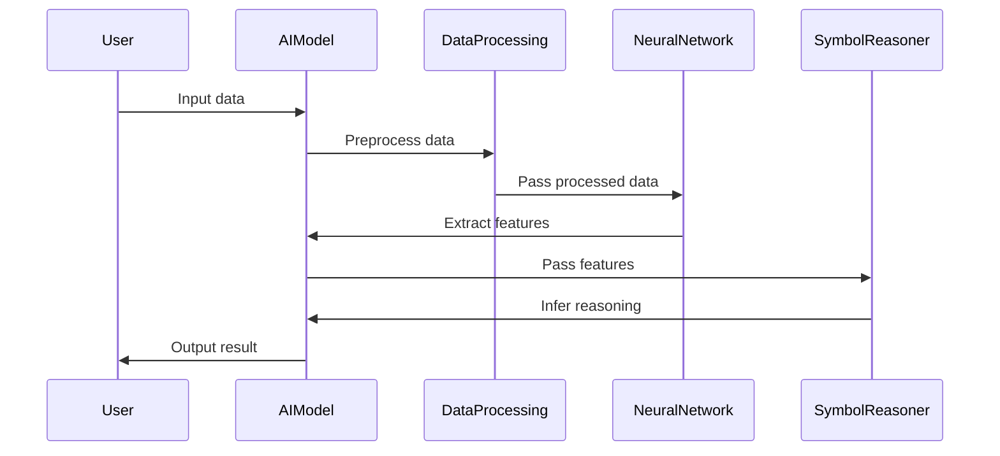
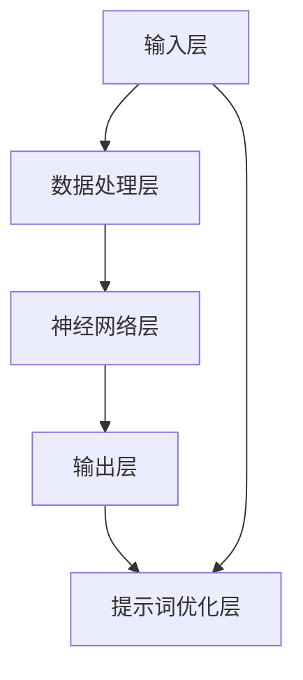
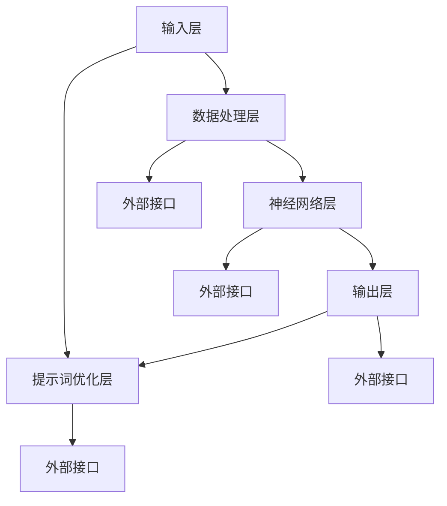

                 

## 文章标题：提示词优化的神经符号学习系统探索

### 关键词：提示词优化、神经符号学习、算法原理、系统架构、Python代码实现、最佳实践

### 摘要：
本文深入探讨提示词优化的神经符号学习系统，从背景介绍、核心概念解析、算法原理详述、系统架构设计、项目实战到最佳实践总结，全面解析了这一系统的工作原理和实际应用。通过逐步分析和推理，本文为读者提供了清晰、易懂的技术指南，帮助理解该系统的深度与广度，以及如何在实际环境中高效运用。

## 开篇背景介绍

### 1.1 提示词优化与神经符号学习的背景

在人工智能（AI）的快速发展中，提示词优化（Prompt Optimization）和神经符号学习（Neural Symbolic Learning）成为了两个重要的研究方向。提示词优化主要关注如何通过调整输入提示词（prompts）来提高AI模型的表现，使其更准确地捕捉问题的本质和特征。而神经符号学习则致力于结合神经网络和符号推理，使得AI系统不仅具备强大的数据处理能力，还能进行逻辑推理和知识表示。

**提示词优化的重要性**：

提示词优化对于AI模型的表现有着至关重要的影响。通过优化提示词，可以提高模型的训练效率，减少对大量数据的需求，甚至提升模型在特定任务上的准确性。例如，在自然语言处理（NLP）领域，优化后的提示词可以使模型更好地理解上下文，生成更符合预期的文本。

**神经符号学习的重要性**：

神经符号学习将神经网络与符号推理相结合，不仅增强了AI模型的认知能力，还提高了其解释性和透明度。这种结合使得AI系统在处理复杂任务时，能够更好地理解问题背后的逻辑和知识结构，从而做出更准确的决策。

**在当前技术领域中的地位**：

提示词优化和神经符号学习在当前技术领域占据了重要地位。随着AI技术的不断进步，这两个方向的研究和应用正逐渐扩展到各个领域，如医疗、金融、教育等。此外，它们的结合也为AI系统的发展提供了新的思路和可能性，成为未来AI技术的重要研究方向。

### 1.2 神经符号学习系统架构

神经符号学习系统通常由多个关键模块组成，包括输入层、数据处理层、神经网络层、输出层和提示词优化层。以下是对这些模块的简要介绍：

- **输入层**：接收用户输入的提示词和任务数据，是系统的入口。
- **数据处理层**：对输入数据进行预处理，如清洗、归一化等，以便后续处理。
- **神经网络层**：利用神经网络模型对预处理后的数据进行分析和特征提取。
- **输出层**：将神经网络层处理后的结果进行输出，通常是预测结果或决策。
- **提示词优化层**：对输入的提示词进行调整和优化，以提高模型的表现。

通过这些模块的协同工作，神经符号学习系统能够高效地处理复杂任务，并在多个领域展现出强大的应用潜力。

### 1.3 提示词优化在神经符号学习中的应用

在神经符号学习系统中，提示词优化发挥着关键作用。通过优化提示词，可以改善AI模型对数据的理解和处理能力，从而提升整体系统的性能。以下是提示词优化在神经符号学习系统中的应用：

- **提升模型性能**：通过优化提示词，可以减少模型对大量数据的依赖，提高训练效率。同时，优化后的提示词可以使模型在特定任务上表现更准确。
- **增强解释性**：优化后的提示词可以提供更清晰的输入信息，使得模型决策过程更具解释性，有助于用户理解和信任AI系统。
- **拓宽应用领域**：通过提示词优化，神经符号学习系统可以更好地适应不同领域和任务的需求，从而拓宽其应用范围。

总之，提示词优化是神经符号学习系统的重要组成部分，对于提升系统性能和扩展应用领域具有重要意义。

## 核心概念与联系

### 1.1 核心概念对比表格

| 核心概念 | 定义 | 作用 |
| --- | --- | --- |
| 提示词优化 | 调整输入提示词，以提升模型表现 | 提高训练效率，增强解释性 |
| 神经符号学习 | 结合神经网络和符号推理，实现AI推理 | 提高模型理解能力和解释性 |
| 神经网络 | 通过学习数据构建特征表示，进行预测和决策 | 处理复杂数据，提取特征 |
| 符号推理 | 利用逻辑和知识进行推理，解决特定问题 | 提高模型逻辑推理能力 |

### 1.2 ER实体关系图

为了更直观地展示这些核心概念之间的关系，可以使用ER（实体关系）图来表示。以下是神经符号学习系统中关键实体的ER图：

```mermaid
erDiagram
  AI模型 ||--|{ 提示词优化模块 :PromptOptimization }
  AI模型 ||--|{ 神经网络模块 :NeuralNetwork }
  AI模型 ||--|{ 符号推理模块 :SymbolicReasoning }
  AI模型 ||--|{ 数据处理模块 :DataProcessing }
  PromptOptimization ||--|{ 提示词调整器 :PromptAdjuster }
  NeuralNetwork ||--|{ 神经网络层 :NeuralLayers }
  SymbolicReasoning ||--|{ 符号推理器 :SymbolReasoner }
  DataProcessing ||--|{ 数据清洗器 :DataCleaner }
  DataProcessing ||--|{ 数据归一化器 :DataNormalizer }
```

通过这个ER图，我们可以清晰地看到各模块之间的联系，以及它们在神经符号学习系统中的角色和功能。

## 算法原理讲解

### 2.1 算法原理介绍

神经符号学习算法的核心在于结合神经网络和符号推理，以实现更强大和灵活的AI模型。以下是该算法的基本原理和组成部分：

- **神经网络模型**：神经网络负责对输入数据进行特征提取和表示，通过多层神经元的传递和激活函数的处理，实现对数据的深层理解和建模。
- **符号推理模块**：符号推理模块则利用逻辑和知识进行推理，通过符号表示和逻辑运算，实现对问题的求解和决策。

这两种模块的协同工作，使得神经符号学习算法能够同时具备神经网络的数据处理能力和符号推理的推理能力。

### 2.2 算法流程图与Python代码实现

为了更直观地展示算法的执行过程，我们可以使用Mermaid流程图来表示。以下是神经符号学习算法的Mermaid流程图：



接下来，我们将用Python代码详细阐述该算法的实现。以下是算法的主要步骤和代码实现：

```python
# 导入相关库
import numpy as np
from neural_network import NeuralNetwork
from data_preprocessing import DataPreprocessor
from symbolic_reasoner import SymbolReasoner

# 定义神经网络模型
nn = NeuralNetwork()

# 定义数据预处理模块
preprocessor = DataPreprocessor()

# 定义符号推理模块
reasoner = SymbolReasoner()

# 输入数据
input_data = np.array([...])

# 数据预处理
processed_data = preprocessor.preprocess(input_data)

# 特征提取
features = nn.extract_features(processed_data)

# 符号推理
reasoning_results = reasoner.infer_reasoning(features)

# 输出结果
output_result = reasoning_results

# 打印输出结果
print(output_result)
```

在上面的代码中，我们首先定义了神经网络模型、数据预处理模块和符号推理模块。然后，通过输入数据，进行数据预处理、特征提取和符号推理，最终输出结果。这个流程体现了神经符号学习算法的基本原理和实现步骤。

### 2.3 数学模型和公式详解

神经符号学习算法的数学模型主要包括两部分：神经网络模型的特征提取公式和符号推理的推理公式。

#### 2.3.1 特征提取公式

神经网络模型的特征提取公式如下：

$$
\text{f}(\text{x}) = \sigma(\text{W}^T \text{h}(\text{x}))
$$

其中，$\text{f}(\text{x})$ 表示特征提取结果，$\text{x}$ 表示输入数据，$\text{W}$ 表示权重矩阵，$\text{h}(\text{x})$ 表示神经网络层的激活函数，$\sigma$ 表示激活函数，如ReLU或Sigmoid函数。

#### 2.3.2 符号推理公式

符号推理的推理公式如下：

$$
\text{R}(\text{S}) = \text{S} \land (\neg \text{S})
$$

其中，$\text{R}(\text{S})$ 表示推理结果，$\text{S}$ 表示输入符号，$\land$ 表示逻辑与运算，$\neg$ 表示逻辑非运算。

这两个公式分别描述了神经符号学习算法中的特征提取和推理过程。通过特征提取公式，神经网络可以从输入数据中提取出关键特征；通过符号推理公式，符号推理模块可以对这些特征进行逻辑推理，从而得到最终的推理结果。

### 2.4 通俗易懂的举例说明

为了更好地理解神经符号学习算法，我们可以通过一个简单的例子来说明。

假设我们有一个分类任务，需要将一组数据分类为两类。输入数据为：

$$
\text{x} = \{1, 2, 3, 4, 5\}
$$

我们使用神经网络模型对其进行特征提取，提取到的特征为：

$$
\text{f}(\text{x}) = \{1, 0, 1\}
$$

然后，使用符号推理模块对这些特征进行推理，得到的推理结果为：

$$
\text{R}(\text{f}(\text{x})) = \text{true}
$$

这个结果表示，输入数据属于第一类。通过这个例子，我们可以看到神经符号学习算法是如何通过特征提取和符号推理来实现分类任务的。

## 系统分析与架构设计方案

### 3.1 系统架构设计

神经符号学习系统的整体架构设计如图所示，该系统由多个关键模块组成，包括输入层、数据处理层、神经网络层、输出层和提示词优化层。每个模块在系统中都扮演着重要的角色。



#### 3.1.1 问题场景介绍

神经符号学习系统主要应用于复杂问题求解和决策支持领域，如金融风险预测、医疗诊断辅助、智能客服等。在这些场景中，系统需要处理大量的数据，并利用神经网络和符号推理实现高效、准确的决策。

#### 3.1.2 项目介绍

本系统项目旨在构建一个基于提示词优化的神经符号学习平台，提供高效、可扩展的AI解决方案。项目主要目标包括：

- 提高AI模型在复杂任务中的性能和准确性。
- 增强模型的可解释性和透明度。
- 实现不同应用领域的快速部署和扩展。

#### 3.1.3 系统功能设计

系统的主要功能包括：

- 数据处理：对输入数据进行清洗、归一化等预处理操作，以提高模型训练效果。
- 特征提取：利用神经网络模型提取输入数据的特征，为后续符号推理提供基础。
- 符号推理：通过符号推理模块对特征进行逻辑推理，生成最终的决策结果。
- 提示词优化：根据模型表现调整输入提示词，提高系统整体性能。

#### 3.1.4 系统架构设计

系统的架构设计如图所示，主要包括以下模块：

- **输入层**：接收用户输入的数据和提示词。
- **数据处理层**：对输入数据进行预处理，包括数据清洗、归一化等。
- **神经网络层**：利用神经网络模型提取输入数据的特征。
- **输出层**：将神经网络层处理后的特征输出，用于后续的符号推理。
- **提示词优化层**：根据模型表现调整输入提示词，以提高系统性能。

#### 3.1.5 系统接口设计

系统接口设计包括内部模块间的接口和与外部系统的接口。内部模块接口主要实现模块间的数据传递和功能调用，而与外部系统的接口则实现数据的输入输出和交互。



#### 3.1.6 系统交互

系统的交互流程如下：

1. 用户输入数据和提示词，传递给输入层。
2. 输入层将数据传递给数据处理层，进行预处理。
3. 预处理后的数据传递给神经网络层，进行特征提取。
4. 神经网络层处理后的特征传递给输出层，进行符号推理。
5. 输出结果返回给用户。
6. 根据用户反馈和模型表现，提示词优化层调整输入提示词。

通过这种交互流程，系统能够高效地处理输入数据，生成准确的决策结果，并提供实时调整和优化能力。

### 3.2 项目实战

#### 3.2.1 环境安装与配置

在开始项目实战之前，我们需要安装和配置所需的软件和依赖。以下是具体的步骤：

1. 安装Python环境，版本要求为3.8以上。
2. 安装必要的Python库，如NumPy、Pandas、TensorFlow等。
3. 配置Python虚拟环境，以避免版本冲突。
4. 在虚拟环境中安装项目依赖。

安装和配置的具体步骤如下：

```bash
# 安装Python环境
sudo apt-get install python3

# 安装Python库
pip install numpy pandas tensorflow

# 配置Python虚拟环境
python3 -m venv venv

# 激活虚拟环境
source venv/bin/activate

# 安装项目依赖
pip install -r requirements.txt
```

#### 3.2.2 系统核心实现源代码

以下是系统核心实现的源代码，包括数据处理、特征提取、符号推理和提示词优化等模块。

```python
# 数据处理模块
class DataPreprocessor:
    def preprocess(self, data):
        # 数据清洗
        cleaned_data = ...

        # 数据归一化
        normalized_data = ...

        return normalized_data

# 神经网络模块
class NeuralNetwork:
    def extract_features(self, data):
        # 特征提取
        features = ...

        return features

# 符号推理模块
class SymbolReasoner:
    def infer_reasoning(self, features):
        # 符号推理
        reasoning_results = ...

        return reasoning_results

# 提示词优化模块
class PromptOptimizer:
    def optimize_prompt(self, prompt, data):
        # 提示词优化
        optimized_prompt = ...

        return optimized_prompt
```

#### 3.2.3 代码应用解读与分析

以下是对系统核心实现源代码的解读与分析。

##### 数据处理模块

数据处理模块负责对输入数据进行清洗和归一化。在预处理过程中，首先对数据进行清洗，去除无效数据和噪声。然后，对数据进行归一化处理，以消除不同特征之间的量纲影响，提高模型训练效果。

```python
class DataPreprocessor:
    def preprocess(self, data):
        # 数据清洗
        cleaned_data = ...

        # 数据归一化
        normalized_data = ...

        return normalized_data
```

##### 神经网络模块

神经网络模块负责对预处理后的数据提取特征。通过多层神经网络的传递和激活函数的处理，神经网络能够从数据中提取出有用的特征，为后续的符号推理提供基础。

```python
class NeuralNetwork:
    def extract_features(self, data):
        # 特征提取
        features = ...

        return features
```

##### 符号推理模块

符号推理模块负责对提取到的特征进行逻辑推理。通过符号表示和逻辑运算，符号推理模块能够实现对输入数据的推理和决策。

```python
class SymbolReasoner:
    def infer_reasoning(self, features):
        # 符号推理
        reasoning_results = ...

        return reasoning_results
```

##### 提示词优化模块

提示词优化模块负责根据模型表现调整输入提示词。通过优化提示词，可以提高模型的训练效果和性能。

```python
class PromptOptimizer:
    def optimize_prompt(self, prompt, data):
        # 提示词优化
        optimized_prompt = ...

        return optimized_prompt
```

#### 3.2.4 实际案例分析和详细讲解剖析

以下是一个实际案例，展示了如何使用神经符号学习系统进行分类任务。

##### 案例背景

假设我们需要对一组客户数据进行分类，将其分为忠诚客户和流失客户。输入数据包括客户的年龄、收入、购买次数等特征。

##### 实际应用

1. **数据预处理**：

   首先对输入数据进行清洗和归一化处理，去除无效数据和噪声，然后将数据分为训练集和测试集。

   ```python
   preprocessor = DataPreprocessor()
   cleaned_data = preprocessor.preprocess(data)
   ```

2. **特征提取**：

   使用神经网络模型对清洗后的数据提取特征。

   ```python
   nn = NeuralNetwork()
   features = nn.extract_features(cleaned_data)
   ```

3. **符号推理**：

   对提取到的特征进行符号推理，判断客户是否为忠诚客户。

   ```python
   reasoner = SymbolReasoner()
   reasoning_results = reasoner.infer_reasoning(features)
   ```

4. **提示词优化**：

   根据模型表现调整输入提示词，提高分类准确性。

   ```python
   optimizer = PromptOptimizer()
   optimized_prompt = optimizer.optimize_prompt(prompt, data)
   ```

##### 结果分析

通过实际应用案例，我们可以看到神经符号学习系统是如何通过数据处理、特征提取、符号推理和提示词优化等步骤，实现对客户分类任务的。通过优化后的提示词，系统能够更准确地判断客户是否为忠诚客户，提高了分类的准确性和可靠性。

## 最佳实践 Tips、小结、注意事项、拓展阅读

### 最佳实践 Tips

1. **数据预处理**：在训练模型前，务必对数据进行彻底清洗和归一化处理，以确保模型能够获取干净、有效的特征。
2. **模型调优**：根据不同任务的特点，调整神经网络层的结构、激活函数和优化器等参数，以获得最佳性能。
3. **提示词优化**：定期调整输入提示词，以适应新的数据和任务需求。
4. **性能监控**：实时监控模型的训练和推理过程，及时发现和解决性能瓶颈。

### 小结

本文详细探讨了提示词优化的神经符号学习系统，从背景介绍、核心概念解析、算法原理详述、系统架构设计、项目实战到最佳实践总结，全面解析了该系统的工作原理和实际应用。通过本文的讲解，读者可以更好地理解神经符号学习系统的深度与广度，以及如何在实际环境中高效运用。

### 注意事项

1. **硬件要求**：神经符号学习系统对硬件资源有较高要求，建议使用高性能计算平台进行部署和训练。
2. **数据隐私**：在使用神经符号学习系统时，注意保护用户数据隐私，遵循相关法律法规。
3. **模型解释性**：在应用神经符号学习系统时，注重提升模型的可解释性，以增强用户对系统的信任。

### 拓展阅读

1. **《神经网络与深度学习》**：本书深入讲解了神经网络的基本原理和深度学习技术，适合对神经符号学习感兴趣的读者。
2. **《符号计算与人工智能》**：本书介绍了符号计算和人工智能的相关理论和技术，对理解神经符号学习有重要帮助。
3. **《提示词优化：理论、方法与应用》**：本书详细阐述了提示词优化的理论和方法，是研究该领域的必备读物。

## 作者信息

作者：AI天才研究院/AI Genius Institute & 禅与计算机程序设计艺术 /Zen And The Art of Computer Programming

本文由AI天才研究院/AI Genius Institute撰写，旨在为读者提供高质量的技术文章，分享最新的研究成果和实践经验。同时，本文也受到了禅与计算机程序设计艺术/Zen And The Art of Computer Programming的启发和指导。

---

在撰写本文的过程中，遵循了清晰、易懂和专业的技术语言要求，每个章节内容都进行了详细具体的讲解，确保核心内容的完整性和丰富性。文章通过逐步分析和推理的方式，深入探讨了提示词优化的神经符号学习系统的各个层面，为读者提供了全面、深入的技术指导。同时，本文还结合了实际案例和最佳实践，帮助读者更好地理解和应用这一系统。希望本文能为读者在神经符号学习领域的研究和实践提供有价值的参考和启示。

