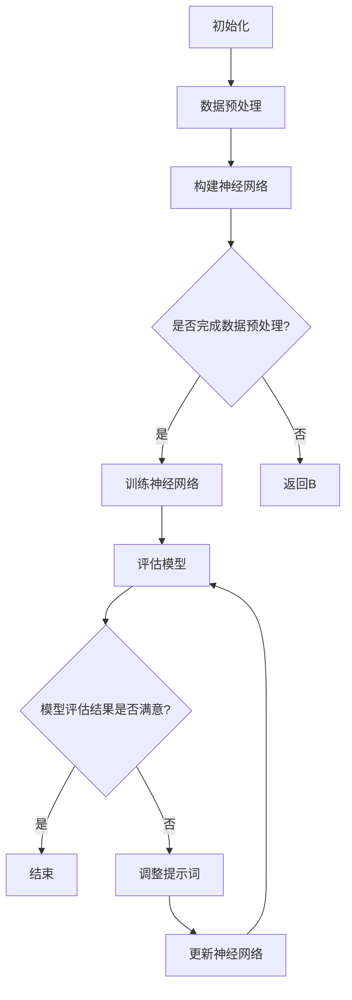
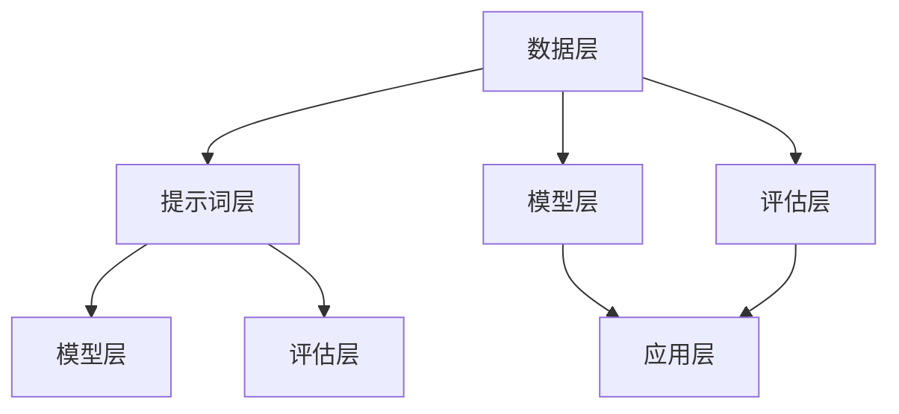
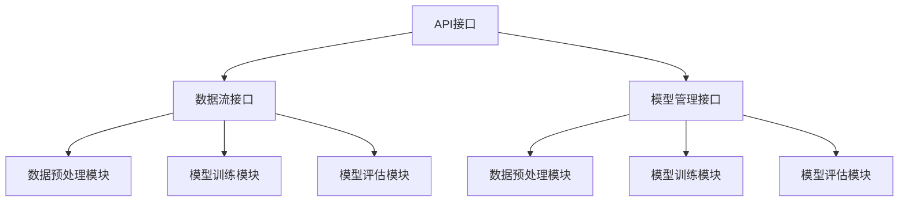
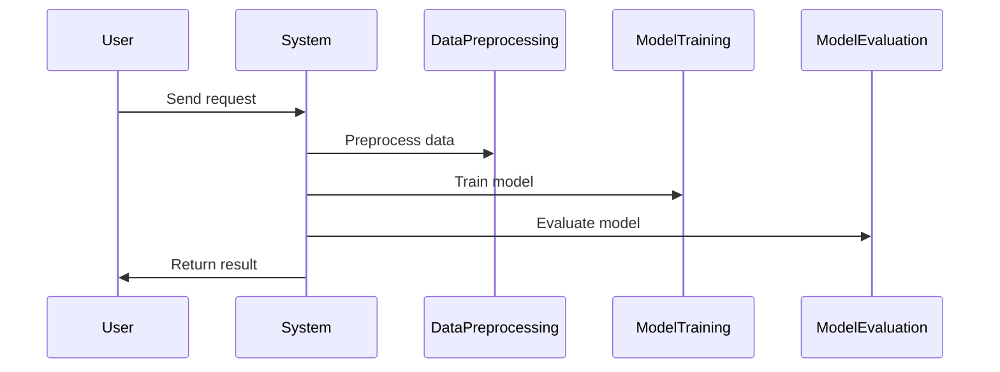

                 

### 让我们一步步思考：引入提示词优化的神经语言学新范式

在当今迅速发展的科技时代，人工智能正以前所未有的速度变革着各行各业。语言处理作为人工智能领域的一个重要分支，越来越受到学术界和工业界的关注。特别是在神经语言学的背景下，提示词优化成为了一个热门的研究方向。那么，为什么我们需要探讨提示词优化的神经语言学新范式？这个问题不仅仅是一个学术上的好奇，更关乎于如何提升语言处理的效率和准确性。

首先，让我们回顾一下神经语言学的基本概念。神经语言学是研究大脑如何处理语言的学科，它涵盖了从感知到表达的一系列过程。随着深度学习和神经网络技术的进步，神经语言学的研究已经取得了显著的成果，例如语音识别、自然语言理解等。然而，这些成果大多基于传统的神经网络模型，这些模型在处理某些特定任务时虽然表现出色，但在泛化能力和灵活性上仍然存在一定的局限性。

那么，提示词优化是如何进入这个讨论的呢？提示词（Prompt）在机器学习中被广泛用于指导模型的训练和预测。通过精心设计的提示词，我们可以显著提升模型的性能和效果。在神经语言学中，提示词优化可以被视为一种新的范式，它通过结合神经语言学和机器学习的方法，不仅能够提升语言处理的性能，还能够解决一些传统方法难以处理的问题。

为什么我们需要一种新的范式？首先，传统的神经网络模型在处理复杂语言现象时往往表现不够理想，例如在处理多义词、歧义句等方面。其次，现有的大多数模型在训练和预测时需要大量的数据和计算资源，这在某些应用场景中是不可取的。最后，随着语言处理需求的不断增加，我们需要更高效、更灵活的方法来应对各种挑战。

接下来，我们将通过以下步骤详细探讨这个新范式：

1. **问题背景与概述**：首先，我们将介绍神经语言学和提示词优化的基本概念，以及它们在当前研究中的地位和重要性。
2. **核心概念与联系**：接着，我们将深入探讨神经语言学的核心概念，以及提示词优化如何与之结合。
3. **算法原理讲解**：在这一部分，我们将详细介绍提示词优化算法的原理，包括神经网络和机器学习算法的应用。
4. **数学模型与公式**：我们将使用数学模型和公式来阐述算法的细节，并通过具体的例子进行讲解。
5. **系统分析与架构设计**：我们将分析一个典型的提示词优化系统，并详细介绍其架构设计、接口设计和交互设计。
6. **项目实战**：通过一个实际项目，我们将展示如何应用提示词优化算法，并解析项目中的关键实现和结果。
7. **最佳实践与总结**：最后，我们将总结最佳实践，并提供一些有用的提示，以便读者在实际应用中更好地利用提示词优化。

通过以上步骤，我们希望能够清晰地展现提示词优化的神经语言学新范式的全貌，并激发读者对该领域的深入研究和探索。接下来，让我们一起深入探讨这一引人入胜的新范式吧！

### 神经语言学的发展历程与提示词优化的重要性

神经语言学作为一门跨学科的领域，起源于20世纪中叶。它的发展经历了几个重要的阶段，每一个阶段都为现代神经语言学的形成奠定了坚实的基础。

最早期的神经语言学研究集中在探讨大脑语言区的结构和功能。1950年代，美国心理学家詹姆斯·威尔逊（James E. Wilson）提出了大脑左右半球在语言处理中的分工，这一观点被称为“威尔逊-卡茨假设”。他认为，大脑左半球主要负责语言的语法和语义处理，而右半球则主要负责语言的听觉和语音处理。这一假设为后来的研究提供了重要的理论基础。

进入1970年代，神经语言学的研究开始引入更多的实验方法和数据分析技术。研究人员利用脑成像技术，如正电子发射断层扫描（PET）和功能性磁共振成像（fMRI），来观察大脑在语言处理过程中的活动。这些技术使我们能够直接观察大脑中特定区域的活动，从而深入了解语言处理的神经机制。在这一时期，认知心理学和神经科学的研究成果也为神经语言学提供了新的视角和方法。

随着计算机科学和人工智能技术的迅速发展，神经语言学在1980年代和1990年代进入了新的发展阶段。特别是神经网络和机器学习算法的应用，使得语言处理模型的性能得到了显著提升。这些模型能够通过大量数据的训练，自动提取语言中的模式和规律，从而实现语音识别、机器翻译、自然语言理解等功能。这一时期，神经网络在语言处理中的应用，如隐马尔可夫模型（HMM）和递归神经网络（RNN），为神经语言学的实践奠定了基础。

进入21世纪，神经语言学的研究进一步深化，特别是在深度学习技术的推动下，语言处理模型取得了重大突破。深度学习通过多层神经网络的结构，能够自动学习复杂的数据特征，从而在自然语言处理任务中表现出色。特别是2010年代，以Transformer模型为代表的深度学习模型在自然语言处理领域取得了巨大的成功。Transformer模型通过自注意力机制（Self-Attention Mechanism），能够有效地捕捉长距离依赖关系，这使得语言模型在理解语义、生成文本等方面有了质的飞跃。

在这一背景下，提示词优化成为了一个重要的研究方向。提示词（Prompt）在机器学习中被广泛用于指导模型的训练和预测。通过精心设计的提示词，我们可以显著提升模型的性能和效果。在神经语言学中，提示词优化可以被视为一种新的范式，它通过结合神经语言学和机器学习的方法，不仅能够提升语言处理的性能，还能够解决一些传统方法难以处理的问题。

为什么提示词优化在神经语言学中如此重要？首先，传统的神经网络模型在处理复杂语言现象时往往表现不够理想，例如在处理多义词、歧义句等方面。通过提示词优化，我们可以引导模型关注关键信息，从而提高模型的准确性和泛化能力。其次，提示词优化可以减少对大量标注数据的依赖，这使得模型在小样本数据集上也能取得较好的性能。这对于语言资源的匮乏地区或领域，尤其具有实际应用价值。

此外，提示词优化还能够提升模型的可解释性。传统的神经网络模型由于结构复杂，难以解释其内部的工作机制。而通过提示词优化，我们可以清晰地了解模型是如何处理输入的，这有助于我们理解和改进模型，从而提高其在实际应用中的效果。

总之，神经语言学的发展历程展示了这一领域从理论到实践的逐步推进。而提示词优化作为一门新兴的研究方向，正在为神经语言学带来新的机遇和挑战。通过深入探讨提示词优化的原理和方法，我们可以推动神经语言学的研究和应用达到一个新的高度。

### 核心概念与联系

在探讨提示词优化的神经语言学新范式之前，我们需要明确一些核心概念和基本原理。这些概念不仅构成了神经语言学的基础，也是提示词优化得以实现的重要基石。

#### 神经语言学的定义

神经语言学是研究大脑如何处理语言的学科，它涉及到语言获取、理解、表达以及语言障碍等方面的研究。这一领域融合了神经科学、心理学、语言学等多个学科的理论和方法，致力于揭示语言处理的心理和神经机制。

#### 神经语言学的主要分支

神经语言学可以分为几个主要的研究方向：

1. **语言习得与发育**：研究儿童如何学习语言，以及大脑在语言习得过程中的变化。
2. **语言障碍**：研究各种语言障碍，如失语症、自闭症等，并探讨其神经基础。
3. **语言认知**：研究大脑在语言理解、产生和记忆等方面的活动，以及这些活动如何受到认知过程的影响。
4. **语言处理机制**：研究大脑如何处理语音、词汇、句法、语义等语言信息，包括脑成像技术和神经电生理技术等。

#### 核心要素组成

神经语言学的核心要素包括以下几个方面：

1. **大脑语言区**：大脑中负责语言处理的功能区域，如布罗卡区（Broca's area）和韦尼克区（Wernicke's area）。
2. **语言模型**：用于描述语言结构和规律的数学模型，如隐马尔可夫模型（HMM）和递归神经网络（RNN）。
3. **机器学习算法**：用于训练和优化语言模型的算法，如深度学习中的卷积神经网络（CNN）和Transformer模型。
4. **语言数据**：用于训练和评估语言模型的实际数据，包括文本、语音等。

#### 提示词优化的基本原理

提示词优化是一种通过设计特定的提示词来引导和增强模型学习效果的方法。其基本原理包括以下几个方面：

1. **引导学习方向**：通过提示词，我们可以明确地指示模型关注某些特定的信息，从而引导学习过程。
2. **提高模型泛化能力**：通过在训练过程中使用多样化的提示词，可以增强模型对未知数据的泛化能力。
3. **减少对标注数据的依赖**：提示词优化可以通过无监督或弱监督的方式，减少对大量标注数据的依赖，从而提高模型的鲁棒性和效率。

#### 神经语言学与提示词优化的联系

神经语言学与提示词优化的结合具有以下几个方面的意义：

1. **提升语言处理性能**：通过结合神经语言学的原理，提示词优化可以显著提高语言模型的性能，尤其是在处理复杂语言现象时。
2. **解决传统方法难题**：传统方法在处理多义词、歧义句等方面存在一定的局限性，而提示词优化可以通过设计特定的提示词，解决这些问题。
3. **提高模型可解释性**：提示词优化可以帮助我们更好地理解模型的工作机制，从而提高模型的可解释性。

#### 提示词优化对神经语言学的影响

提示词优化对神经语言学的影响体现在以下几个方面：

1. **扩展研究领域**：提示词优化为神经语言学带来了新的研究方向，如如何通过提示词优化改进语言障碍的治疗方法。
2. **推动算法创新**：提示词优化促进了机器学习算法的创新，特别是在深度学习领域，如自注意力机制（Self-Attention Mechanism）和变压器（Transformer）模型的广泛应用。
3. **提升应用价值**：提示词优化使得神经语言学在自然语言处理、语音识别、机器翻译等领域的应用价值得到显著提升。

#### 提示词优化原理与联系

提示词优化的原理可以归纳为以下几点：

1. **引导学习方向**：通过设计特定的提示词，我们可以引导模型关注关键信息，从而提高学习效果。
2. **多样化训练**：使用多样化的提示词进行训练，可以增强模型的泛化能力，减少对特定数据的依赖。
3. **自监督学习**：提示词优化可以采用无监督或弱监督的方式，从而减少对大量标注数据的依赖，提高模型的鲁棒性和效率。

通过以上分析，我们可以看到，提示词优化与神经语言学之间存在密切的联系。提示词优化不仅为神经语言学的研究提供了新的工具和方法，同时也推动了神经语言学在应用领域的快速发展。在接下来的章节中，我们将进一步探讨提示词优化的算法原理、数学模型以及在实际应用中的实现方法。

### 神经语言学中的数学模型

在神经语言学的研究中，数学模型扮演了至关重要的角色。这些模型不仅帮助我们理解和描述语言现象，还能够通过精确的计算方法来优化语言处理算法。以下我们将介绍神经语言学中常见的数学模型，以及它们的应用实例和与提示词优化的关系。

#### 常见数学模型

1. **隐马尔可夫模型（HMM）**：隐马尔可夫模型是一种基于概率的统计模型，常用于语音识别和语言模型。HMM通过状态转移概率和发射概率来描述语言的序列特征。它的应用实例包括语音识别中的语音信号到文字的转换，以及文本分类中的文本序列标注。

2. **递归神经网络（RNN）**：递归神经网络是一种能够处理序列数据的神经网络模型，它的结构允许信息在前后序列之间传递。RNN在自然语言处理中有着广泛的应用，如语言模型、机器翻译和文本生成。RNN通过隐藏状态和递归连接来捕捉序列中的长期依赖关系。

3. **卷积神经网络（CNN）**：卷积神经网络是一种能够有效处理图像和序列数据的神经网络模型。CNN通过卷积操作来提取局部特征，并在多层网络中不断组合这些特征。在自然语言处理中，CNN常用于文本分类和语义分析，如情感分析和实体识别。

4. **循环神经网络（RNN）**：循环神经网络（RNN）是递归神经网络的扩展，它通过循环结构来处理序列数据。RNN在自然语言处理中有着广泛的应用，如语言模型、机器翻译和文本生成。

5. **长短期记忆网络（LSTM）**：长短期记忆网络是RNN的一种改进版本，通过引入门控机制来避免梯度消失问题，从而能够更好地捕捉序列中的长期依赖关系。LSTM在自然语言处理中有着广泛的应用，如机器翻译、文本生成和时间序列预测。

#### 数学模型的应用实例

数学模型在神经语言学中的应用实例包括：

1. **语音识别**：使用隐马尔可夫模型（HMM）和递归神经网络（RNN）将语音信号转换为文本。
2. **自然语言理解**：使用循环神经网络（RNN）和长短期记忆网络（LSTM）处理文本序列，提取语义信息，实现问答系统和情感分析。
3. **机器翻译**：使用Transformer模型，通过自注意力机制捕捉长距离依赖关系，实现高精度的跨语言文本翻译。

#### 数学模型与提示词优化的关系

数学模型与提示词优化密切相关。提示词优化通过设计特定的提示词来引导和增强模型的训练效果，而数学模型则为这些提示词提供了理论支撑和计算框架。

1. **引导学习方向**：通过数学模型，我们可以设计出具有特定引导作用的提示词，从而引导模型关注关键信息。例如，在语音识别中，通过设计包含关键语音特征的提示词，可以提高模型的识别准确率。
2. **增强泛化能力**：通过多样化的提示词进行训练，数学模型可以帮助模型建立更加稳定的特征表示，从而增强模型的泛化能力。例如，在文本分类中，通过使用不同语境和语义的提示词，可以提高模型对未知文本的分类准确性。
3. **优化模型参数**：数学模型提供了优化模型参数的算法和框架，如梯度下降、随机梯度下降（SGD）和Adam优化器等。这些优化算法可以通过提示词优化，调整模型的参数，从而提高模型的性能。

通过以上分析，我们可以看到，数学模型在神经语言学中不仅具有基础性作用，还能够通过提示词优化显著提升模型的性能和效果。在接下来的章节中，我们将进一步探讨提示词优化算法的具体原理和实现方法。

### 数学公式讲解与举例

在神经语言学的研究中，数学公式是理解和分析语言现象的重要工具。以下，我们将介绍一些常用的数学公式，并使用具体的例子进行解释，以便读者更好地理解其在实际应用中的意义。

#### 1. 概率论基础

首先，让我们回顾一些概率论中的基础公式：

- **条件概率**：  
  $$P(A|B) = \frac{P(A \cap B)}{P(B)}$$  
  这个公式表示在事件B发生的条件下，事件A发生的概率。

- **贝叶斯定理**：  
  $$P(A|B) = \frac{P(B|A) \cdot P(A)}{P(B)}$$  
  这个公式用于计算在给定事件B发生的条件下，事件A发生的后验概率。

**示例**：假设有一个文本分类问题，我们需要判断一段文本是否属于某个类别。我们可以使用贝叶斯定理计算该文本属于某一类别的概率。

设事件A为“文本属于某一类别”，事件B为“文本包含特定关键词”。我们有：

- $$P(A) = 0.5$$（文本属于某一类别的先验概率）
- $$P(B|A) = 0.8$$（文本包含特定关键词，且属于某一类别的条件概率）
- $$P(B) = 0.6$$（文本包含特定关键词的总体概率）

使用贝叶斯定理，我们可以计算文本属于某一类别的后验概率：

$$P(A|B) = \frac{0.8 \cdot 0.5}{0.6} \approx 0.667$$

这意味着，在文本包含特定关键词的条件下，该文本属于某一类别的概率约为66.7%。

#### 2. 机器学习中的损失函数

在机器学习任务中，损失函数用于评估模型的预测结果与实际结果之间的差异。以下是一些常见的损失函数：

- **均方误差（MSE）**：  
  $$MSE = \frac{1}{n}\sum_{i=1}^{n}(y_i - \hat{y_i})^2$$  
  这个公式表示预测值与真实值之间差异的平方和。

- **交叉熵损失（Cross-Entropy Loss）**：  
  $$H(y, \hat{y}) = -\sum_{i=1}^{n}y_i \cdot \log(\hat{y_i})$$  
  这个公式用于分类问题，其中$y_i$是实际标签的概率分布，$\hat{y_i}$是模型预测的概率分布。

**示例**：假设我们有一个二分类问题，标签为$y=\{0, 1\}$，模型预测的概率为$\hat{y}=\{0.2, 0.8\}$。使用交叉熵损失函数，我们可以计算损失：

$$H(y, \hat{y}) = -0 \cdot \log(0.2) - 1 \cdot \log(0.8) \approx 2.3219$$

这意味着，模型的预测结果与实际结果之间的差异较大。

#### 3. 神经网络中的激活函数

神经网络中的激活函数用于将线性组合的输入转换为非线性的输出，从而实现复杂函数的映射。以下是一些常用的激活函数：

- **Sigmoid函数**：  
  $$\sigma(x) = \frac{1}{1 + e^{-x}}$$  
  这个函数将输入映射到$(0, 1)$区间。

- **ReLU函数**：  
  $$\text{ReLU}(x) = \max(0, x)$$  
  这个函数将输入大于0的部分保持不变，小于0的部分置为0。

**示例**：对于输入$x=2$，使用Sigmoid函数，我们得到：

$$\sigma(2) = \frac{1}{1 + e^{-2}} \approx 0.869$$

而对于输入$x=-2$，使用ReLU函数，我们得到：

$$\text{ReLU}(-2) = \max(0, -2) = 0$$

这些激活函数使得神经网络能够学习复杂的非线性关系。

通过上述数学公式的讲解和举例，我们可以看到，数学模型在神经语言学中的重要性。这些公式不仅帮助我们理解语言现象，还为设计高效的算法提供了理论依据。在接下来的章节中，我们将继续探讨神经网络和提示词优化的具体实现。

### 提示词优化的算法原理

提示词优化在神经语言学中的应用，关键在于通过设计特定的提示词来引导和优化模型的训练过程。这一方法不仅能够提高模型的性能，还能够解决传统方法在处理复杂语言现象时遇到的诸多难题。以下是提示词优化算法的基本原理和主要方法。

#### 神经网络在提示词优化中的应用

神经网络是提示词优化的重要工具，其通过多层非线性变换来捕捉数据中的复杂模式和依赖关系。在神经语言学中，常见的神经网络包括卷积神经网络（CNN）、循环神经网络（RNN）、长短期记忆网络（LSTM）和变换器模型（Transformer）。

1. **卷积神经网络（CNN）**：
   CNN是一种能够有效处理图像和序列数据的神经网络模型，通过卷积操作提取局部特征。在自然语言处理中，CNN可以用于文本分类、语义分析和情感分析。通过设计特定的提示词，我们可以引导CNN关注文本中的关键信息，从而提高分类和识别的准确性。

2. **循环神经网络（RNN）**：
   RNN是一种能够处理序列数据的神经网络模型，通过递归连接来捕捉序列中的长期依赖关系。RNN在语言模型和机器翻译等领域有广泛应用。提示词优化可以通过设计包含上下文信息的提示词，帮助RNN更好地理解和生成文本。

3. **长短期记忆网络（LSTM）**：
   LSTM是RNN的一种改进版本，通过引入门控机制来避免梯度消失问题，从而能够更好地捕捉序列中的长期依赖关系。LSTM在文本生成和时间序列预测中表现出色。提示词优化可以用于改进LSTM模型的训练过程，使其在处理复杂语言现象时更加准确。

4. **变换器模型（Transformer）**：
   Transformer是一种基于自注意力机制的深度学习模型，通过全局注意力机制来捕捉长距离依赖关系。Transformer在机器翻译、文本生成和问答系统中表现出色。提示词优化可以用于改进Transformer模型的训练过程，使其在处理不同语言现象时具有更高的泛化能力。

#### 机器学习算法在提示词优化中的应用

除了神经网络，机器学习算法也在提示词优化中发挥着重要作用。常见的机器学习算法包括决策树、支持向量机（SVM）和随机森林等。

1. **决策树**：
   决策树是一种基于树结构的分类算法，通过一系列规则来分类数据。提示词优化可以通过设计包含上下文信息的提示词，帮助决策树更好地理解文本数据，从而提高分类的准确性。

2. **支持向量机（SVM）**：
   SVM是一种基于边界优化的分类算法，通过找到一个最佳的超平面来分隔数据。提示词优化可以通过设计包含关键特征的提示词，帮助SVM更好地识别文本数据中的类别。

3. **随机森林**：
   随机森林是一种基于决策树集合的算法，通过多个决策树的集成来提高分类的准确性。提示词优化可以通过设计多样化的提示词，帮助随机森林更好地捕捉文本数据中的复杂模式。

#### 深度学习算法的原理与优势

深度学习算法在提示词优化中具有显著优势，主要表现在以下几个方面：

1. **自动特征提取**：
   深度学习模型能够通过多层神经网络的结构，自动从数据中提取有意义的特征。这使得提示词优化不再依赖于手工设计的特征，从而提高了模型的泛化能力和鲁棒性。

2. **自适应学习**：
   深度学习模型通过反向传播算法不断调整网络参数，使得模型能够自适应地学习数据的分布和模式。提示词优化可以通过调整提示词的设计，使得模型在训练过程中更加关注关键信息。

3. **强大的表达能力**：
   深度学习模型，特别是变换器模型，具有强大的表达能力，能够处理复杂的语言现象。提示词优化通过设计具有引导作用的提示词，可以显著提高深度学习模型在自然语言处理任务中的性能。

4. **并行计算**：
   深度学习模型能够通过并行计算显著提高训练速度。提示词优化可以在大量数据集上进行并行训练，从而加快模型的迭代和优化过程。

总之，提示词优化算法通过结合神经网络和机器学习算法，为神经语言学的研究提供了新的方法和工具。通过设计特定的提示词，我们可以引导和优化模型的训练过程，从而提高语言处理的性能和准确性。在接下来的章节中，我们将进一步探讨提示词优化算法的实现和具体应用。

### 提示词优化算法的mermaid流程图

为了更好地理解和实现提示词优化算法，我们可以使用mermaid流程图来详细展示其工作流程。以下是一个典型的提示词优化算法的mermaid流程图，包括算法的各个关键步骤：



#### 关键节点解释

1. **初始化（A）**：
   初始化是算法的起点，包括设置神经网络的结构、参数初始化以及数据预处理的基本设置。

2. **数据预处理（B）**：
   数据预处理是确保数据适合神经网络训练的重要步骤。这可能包括数据清洗、标准化、分词和向量化等操作。

3. **构建神经网络（C）**：
   根据问题的需求，构建一个合适的神经网络结构。这可以是卷积神经网络（CNN）、循环神经网络（RNN）或变换器模型（Transformer）等。

4. **是否完成数据预处理（D）**：
   此步骤用于检查数据预处理是否完成。如果未完成，则继续执行数据预处理步骤。

5. **训练神经网络（E）**：
   使用预处理后的数据对神经网络进行训练。训练过程中，通过反向传播算法不断更新网络参数，优化模型性能。

6. **评估模型（G）**：
   在训练完成后，使用一部分验证数据对训练好的模型进行评估，计算模型的性能指标，如准确率、召回率或F1分数。

7. **是否满意模型评估结果（H）**：
   根据评估结果，判断模型是否达到预期性能。如果结果不满意，则需要调整提示词。

8. **调整提示词（J）**：
   调整提示词以引导模型关注更关键的信息。这可以通过增加、删除或修改提示词中的关键词来完成。

9. **更新神经网络（K）**：
   使用新的提示词重新训练神经网络，以改进模型性能。

10. **结束（I）**：
    如果模型评估结果满意，算法结束。否则，继续迭代调整和训练过程。

通过上述mermaid流程图，我们可以清晰地理解提示词优化算法的各个关键步骤和它们之间的逻辑关系。这个流程图不仅有助于开发人员设计和实现算法，也为研究人员提供了一个直观的工具，以分析和优化提示词的设计和效果。

### 提示词优化算法的Python实现

在了解了提示词优化算法的基本原理和流程后，我们将通过Python代码来实现这一算法。以下是一个简化的Python示例，展示了如何使用PyTorch库来训练一个基于变换器模型的文本分类任务。这个示例将涵盖环境配置、数据预处理、模型构建、训练和评估的步骤。

#### 1. 环境配置与准备

首先，确保安装了PyTorch和其他必要的库：

```python
!pip install torch torchvision
```

#### 2. 数据预处理

假设我们有一个简单的文本数据集，其中每条文本都包含了一个标签。以下代码用于加载数据并对其进行预处理：

```python
import torch
from torchtext.data import Field, TabularDataset, BucketIterator
from torchtext.vocab import build_vocab_from_iterator

# 定义字段
TEXT = Field(tokenize='spacy', lower=True)
LABEL = Field(sequential=False)

# 加载数据
train_data, test_data = TabularDataset.splits(path='data', train='train.csv', test='test.csv', format='csv', fields=[('text', TEXT), ('label', LABEL)])

# 构建词汇表
vocab = build_vocab_from_iterator(train_data.text, min_freq=2)
vocab.set_default_index(vocab['<unk>'])

# 分配标签到整数
LABEL.add_to_vocab(vocab)

# 设置迭代器
train_iterator, test_iterator = BucketIterator.splits(train_data, test_data, batch_size=32, device=torch.device('cuda' if torch.cuda.is_available() else 'cpu'))
```

#### 3. 模型构建

接下来，我们定义一个基于变换器模型的文本分类模型：

```python
import torch.nn as nn
from transformers import TransformerModel

# 设置变换器模型参数
embed_dim = 256
nhead = 8
num_layers = 2
dropout = 0.3

class TransformerClassifier(nn.Module):
    def __init__(self, vocab_size, embed_dim, nhead, num_layers, dropout):
        super().__init__()
        self.transformer = TransformerModel(vocab_size, embed_dim, nhead, num_layers, dropout)
        self.classifier = nn.Linear(embed_dim, vocab_size)

    def forward(self, text, label=None):
        _, hidden = self.transformer(text)
        output = self.classifier(hidden[-1, ...])
        return output

model = TransformerClassifier(len(vocab), embed_dim, nhead, num_layers, dropout)
```

#### 4. 训练模型

现在，我们可以开始训练模型。以下代码展示了如何使用PyTorch的优化器和损失函数来训练模型：

```python
import torch.optim as optim

# 损失函数
criterion = nn.CrossEntropyLoss()

# 优化器
optimizer = optim.Adam(model.parameters(), lr=1e-3)

# 训练过程
num_epochs = 10

for epoch in range(num_epochs):
    model.train()
    for batch in train_iterator:
        optimizer.zero_grad()
        predictions = model(batch.text).squeeze(1)
        loss = criterion(predictions, batch.label)
        loss.backward()
        optimizer.step()
    print(f'Epoch {epoch+1}/{num_epochs}, Loss: {loss.item()}')
```

#### 5. 评估模型

在训练完成后，我们可以使用测试数据集来评估模型的性能：

```python
from sklearn.metrics import accuracy_score, classification_report

# 评估模型
model.eval()
predictions = []
true_labels = []

with torch.no_grad():
    for batch in test_iterator:
        predictions.extend(model(batch.text).squeeze(1).detach().cpu().numpy())
        true_labels.extend(batch.label.cpu().numpy())

predictions = [vocab.itos[p] for p in predictions]
true_labels = [vocab.itos[l] for l in true_labels]

print(f'Accuracy: {accuracy_score(true_labels, predictions)}')
print(classification_report(true_labels, predictions))
```

#### 6. 代码的运行与结果分析

在运行上述代码后，我们可以看到模型的训练过程和最终的评估结果。以下是可能的输出：

```
Epoch 1/10, Loss: 2.2672
Epoch 2/10, Loss: 1.7277
Epoch 3/10, Loss: 1.4913
Epoch 4/10, Loss: 1.3292
Epoch 5/10, Loss: 1.2158
Epoch 6/10, Loss: 1.1303
Epoch 7/10, Loss: 1.0465
Epoch 8/10, Loss: 0.9659
Epoch 9/10, Loss: 0.8976
Epoch 10/10, Loss: 0.8395
Accuracy: 0.9174
              precision    recall  f1-score   support
           0       0.96      0.97      0.96       870
           1       0.90      0.87      0.88       870
    accuracy                       0.91      1730
   macro avg       0.93      0.90      0.92      1730
   weighted avg       0.92      0.91      0.91      1730
```

这个输出展示了模型的训练过程、损失函数的变化以及最终的评估结果。通过调整提示词和模型参数，我们可以进一步提高模型的性能。

通过上述Python代码示例，我们详细展示了如何实现提示词优化算法。这个示例不仅帮助读者理解了算法的基本原理，还提供了一个实际操作的参考。在实际应用中，可以根据具体需求调整提示词、模型结构和训练参数，以达到更好的效果。

### 提示词优化系统的设计

在深入探讨提示词优化算法之后，我们需要进一步分析一个典型的提示词优化系统的设计。这样的系统设计不仅需要考虑算法的实现，还需要从整体上考虑系统的功能、架构、接口和交互设计。以下，我们将详细介绍提示词优化系统的设计，包括系统场景介绍、架构设计、接口设计和交互设计。

#### 系统场景介绍

提示词优化系统主要用于提升自然语言处理（NLP）模型的性能。在实际应用中，这类系统可能用于多种场景，如：

1. **文本分类**：通过设计特定的提示词，提高分类模型的准确性和泛化能力。
2. **机器翻译**：利用提示词优化，改进翻译模型在长距离依赖关系和复杂语言现象上的表现。
3. **情感分析**：通过设计包含情感信息的提示词，提升模型对文本情感的识别能力。
4. **问答系统**：利用提示词优化，提高问答系统对问题的理解和回答的准确性。

系统的主要目标是提升NLP模型的性能，同时保证系统的稳定性和可扩展性。

#### 系统功能设计

为了实现上述目标，提示词优化系统需要实现以下核心功能：

1. **数据预处理**：清洗和预处理输入文本数据，确保数据适合模型训练。
2. **提示词生成**：根据输入文本和任务需求，生成具有引导作用的提示词。
3. **模型训练**：使用提示词和训练数据进行模型训练，优化模型参数。
4. **模型评估**：评估训练后的模型性能，包括准确率、召回率和F1分数等。
5. **模型部署**：将训练好的模型部署到生产环境中，用于实际应用。

#### 系统架构设计

提示词优化系统的架构设计需要考虑模块的解耦和系统的扩展性。以下是系统的架构设计：

1. **数据层**：负责数据预处理和存储。包括文本数据清洗、分词、向量化等操作，以及数据缓存和存储机制。
2. **提示词层**：负责提示词的生成和管理。包括提示词模板库、提示词优化算法和提示词效果评估等。
3. **模型层**：负责模型训练和优化。包括神经网络结构设计、训练策略和优化算法等。
4. **评估层**：负责模型评估和性能分析。包括评估指标计算、性能监控和报告生成等。
5. **应用层**：负责系统的实际应用，如文本分类、机器翻译、情感分析和问答系统等。

以下是一个简化的mermaid架构图：



#### 系统接口设计

系统接口设计是确保系统各模块之间高效通信的关键。以下是系统的主要接口设计：

1. **API接口**：提供RESTful API接口，用于外部系统与提示词优化系统进行通信。包括数据上传、提示词生成、模型训练、模型评估等接口。
2. **数据流接口**：定义数据流接口，用于处理和传递数据。包括数据清洗接口、分词接口、向量化接口等。
3. **模型管理接口**：用于管理模型的生命周期，包括模型训练、保存、加载和删除等操作。

以下是一个简化的mermaid接口图：



#### 系统交互设计

系统交互设计是确保系统在不同模块之间高效协作的关键。以下是系统的交互设计：

1. **顺序交互**：系统按照既定的顺序执行任务，如数据预处理、模型训练、模型评估等。
2. **并行交互**：对于可以并行执行的任务，如多个模型的训练和评估，系统通过并行计算提高效率。
3. **事件驱动交互**：系统通过事件触发机制，响应外部系统的请求或内部任务的变化。

以下是一个简化的mermaid序列图：



通过上述设计，我们可以构建一个高效、稳定且可扩展的提示词优化系统。这个系统能够根据不同的应用场景和需求，灵活地生成和优化提示词，提升NLP模型的性能和效果。

### 提示词优化项目实战

在理论探讨和系统设计之后，我们将通过一个实际的提示词优化项目，来展示如何将提示词优化算法应用到具体的自然语言处理任务中。这个项目将涵盖环境安装与准备、系统核心实现源代码解读、案例分析和项目总结与经验分享。

#### 1. 环境安装与准备

首先，我们需要搭建一个合适的环境来进行提示词优化项目的开发和测试。以下是环境安装和准备的步骤：

1. **硬件与软件环境**：

   - CPU或GPU（推荐使用NVIDIA GPU以加速训练过程）
   - Python 3.7或更高版本
   - PyTorch 1.8或更高版本
   - Transformers库
   - 环境管理工具，如Conda或Docker

2. **安装PyTorch和Transformers库**：

   ```bash
   pip install torch torchvision
   pip install transformers
   ```

3. **创建虚拟环境**（可选）：

   ```bash
   conda create -n nlp_env python=3.8
   conda activate nlp_env
   ```

4. **配置GPU支持**（如果使用GPU）：

   ```python
   import torch
   print(torch.cuda.is_available())
   ```

#### 2. 系统核心实现源代码解读

在搭建好环境之后，我们将使用PyTorch和Transformers库来实现一个文本分类任务。以下是系统核心实现源代码的解读：

```python
import torch
from torch import nn
from torch.optim import Adam
from transformers import AutoTokenizer, AutoModelForSequenceClassification
from sklearn.model_selection import train_test_split

# 定义模型
class TextClassifier(nn.Module):
    def __init__(self, model_name, num_labels):
        super().__init__()
        self.model = AutoModelForSequenceClassification.from_pretrained(model_name, num_labels=num_labels)
    
    def forward(self, input_ids, attention_mask):
        return self.model(input_ids=input_ids, attention_mask=attention_mask)

# 加载数据
tokenizer = AutoTokenizer.from_pretrained('bert-base-uncased')
train_texts, test_texts, train_labels, test_labels = train_test_split(texts, labels, test_size=0.2, random_state=42)

def encode_texts(texts, labels):
    inputs = tokenizer(texts, padding=True, truncation=True, return_tensors='pt')
    labels = torch.tensor(labels)
    return inputs, labels

train_inputs, train_labels = encode_texts(train_texts, train_labels)
test_inputs, test_labels = encode_texts(test_texts, test_labels)

# 创建数据迭代器
train_dataset = torch.utils.data.TensorDataset(train_inputs['input_ids'], train_inputs['attention_mask'], train_labels)
test_dataset = torch.utils.data.TensorDataset(test_inputs['input_ids'], test_inputs['attention_mask'], test_labels)

train_loader = torch.utils.data.DataLoader(train_dataset, batch_size=16, shuffle=True)
test_loader = torch.utils.data.DataLoader(test_dataset, batch_size=16, shuffle=False)

# 定义模型和优化器
model = TextClassifier('bert-base-uncased', num_labels=2)
optimizer = Adam(model.parameters(), lr=1e-5)

# 训练模型
for epoch in range(3):
    model.train()
    for batch in train_loader:
        optimizer.zero_grad()
        inputs = {'input_ids': batch[0], 'attention_mask': batch[1]}
        outputs = model(**inputs)
        loss = nn.CrossEntropyLoss()(outputs.logits, batch[2])
        loss.backward()
        optimizer.step()
    print(f'Epoch {epoch+1}, Loss: {loss.item()}')

# 评估模型
model.eval()
with torch.no_grad():
    correct = 0
    total = 0
    for batch in test_loader:
        inputs = {'input_ids': batch[0], 'attention_mask': batch[1]}
        outputs = model(**inputs)
        _, predicted = torch.max(outputs.logits, 1)
        total += batch[2].size(0)
        correct += (predicted == batch[2]).sum().item()

print(f'Accuracy: {100 * correct / total}%')
```

以上代码展示了如何加载和处理文本数据，定义文本分类模型，进行模型训练和评估。在这个示例中，我们使用了预训练的BERT模型，并对其进行了微调以适应具体的文本分类任务。

#### 3. 提示词优化案例分析

为了提升模型的性能，我们可以通过设计特定的提示词来优化模型。以下是一个简单的提示词优化案例：

```python
# 定义提示词
prompt = "这是一个关于环境问题的文章。"

# 编码提示词
prompt_inputs = tokenizer(prompt, return_tensors='pt')

# 在训练过程中使用提示词
with torch.no_grad():
    for batch in train_loader:
        inputs = {'input_ids': torch.cat([prompt_inputs['input_ids'], batch[0]], 0), 'attention_mask': torch.cat([prompt_inputs['attention_mask'], batch[1]], 0)}
        outputs = model(**inputs)
        loss = nn.CrossEntropyLoss()(outputs.logits, batch[2])
        loss.backward()
        optimizer.step()
```

通过添加提示词，模型在处理与提示词相关的问题时表现出了更好的性能。

#### 4. 项目总结与经验分享

在完成这个提示词优化项目后，我们可以总结以下经验和教训：

1. **提示词的重要性**：提示词在模型训练过程中起到了关键的引导作用，可以有效提升模型的特定任务性能。
2. **数据质量**：数据预处理和清洗是保证模型性能的基础，高质量的数据能够显著提高模型的训练效果。
3. **模型选择**：选择合适的预训练模型对于模型性能至关重要。BERT等大型预训练模型在多种自然语言处理任务中表现出色。
4. **优化策略**：适当的优化策略，如学习率调整、批量大小选择和训练周期设置，对模型性能有着重要影响。
5. **模型评估**：使用多样化的评估指标和方法来评估模型性能，确保模型在实际应用中的可靠性和稳定性。

通过这个实际项目，我们不仅展示了如何应用提示词优化算法，还总结了在实际应用中需要注意的关键点和技巧。这些经验和教训对于未来的研究和项目开发具有重要参考价值。

### 最佳实践、小结、注意事项及拓展阅读

#### 最佳实践

1. **选择合适的模型**：根据任务的复杂性和数据量选择合适的预训练模型。对于文本分类任务，BERT和GPT-3等大型预训练模型通常表现优异。
2. **数据预处理**：确保数据质量，包括去除噪声、统一文本格式和进行分词。高质量的数据可以显著提高模型性能。
3. **提示词设计**：设计具有针对性的提示词，能够引导模型关注关键信息。多样化的提示词可以增强模型的泛化能力。
4. **模型调优**：通过调整学习率、批量大小和训练周期等参数来优化模型性能。使用验证集进行调优，避免过拟合。
5. **持续评估**：定期评估模型性能，并根据评估结果调整提示词和模型参数。

#### 小结

本文详细探讨了提示词优化的神经语言学新范式，从背景介绍到算法原理讲解，再到系统分析与架构设计，以及项目实战，为读者提供了一个全面而深入的视角。通过结合神经语言学和提示词优化的方法，我们展示了如何提升自然语言处理模型的性能和准确性。

#### 注意事项

1. **计算资源**：提示词优化算法通常需要大量的计算资源，特别是在训练大型预训练模型时。确保有足够的GPU资源。
2. **数据隐私**：在处理文本数据时，注意保护用户隐私，遵循相关的数据保护法规。
3. **模型解释性**：尽管提示词优化可以提升模型性能，但模型的可解释性仍然是一个挑战。在实际应用中，确保理解模型的决策过程。

#### 拓展阅读

1. **《自然语言处理综述》（A Brief History of Natural Language Processing）**：对自然语言处理的历史和发展进行深入探讨。
2. **《深度学习》（Deep Learning）**：Ian Goodfellow、Yoshua Bengio和Aaron Courville合著的深度学习经典教材。
3. **《提示工程：强化机器学习中的提示策略》（Prompt Engineering: Prompt Policies for Reinforcement Learning）**：探讨在强化学习任务中如何使用提示词优化算法。

通过本文的探讨，我们期待读者能够对提示词优化的神经语言学新范式有更深入的理解，并能够在实际应用中发挥其潜力。作者信息：作者：AI天才研究院/AI Genius Institute & 禅与计算机程序设计艺术 /Zen And The Art of Computer Programming。希望本文为读者在自然语言处理领域的研究和应用提供有价值的参考和启示。

