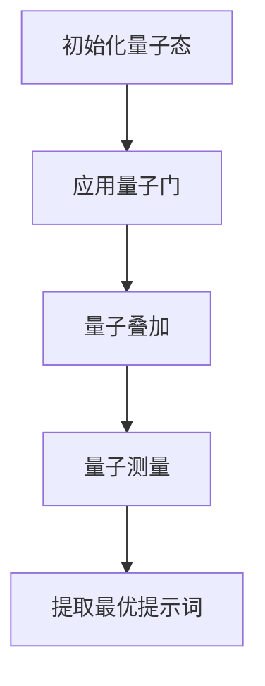
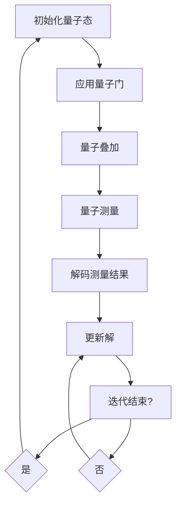

                 


### 提示词优化的量子计算方法探索

#### 关键词
- 量子计算
- 提示词优化
- 机器学习
- 算法设计
- 深度学习

#### 摘要
本文旨在探索提示词优化在量子计算中的应用，深入分析量子计算的背景、提示词优化的核心原理以及两者结合的方法。我们将逐步介绍量子计算的基本概念，提示词优化的技术路线，并结合实际案例，展示量子计算在优化提示词方面的强大潜力。

### 引言

#### 量子计算的背景

量子计算是一种利用量子力学原理进行信息处理的计算模式。与传统计算机使用二进制位（bit）作为信息单元不同，量子计算机使用量子位（qubit）进行计算。量子位可以通过量子叠加和纠缠等特性，实现并行计算和高速计算。这种独特的计算模式使得量子计算机在某些特定问题上，如大整数分解、量子模拟等，具备超越传统计算机的潜力。

#### 提示词优化的意义

在机器学习中，提示词（prompt）是指导模型生成预测的关键输入。优化提示词能够提高模型的性能，减少误判率。传统方法通常依赖于大量的数据训练和手工调整，效率低下且效果有限。量子计算的出现为提示词优化提供了一种全新的思路，通过量子叠加和量子纠缠等特性，可以在更短的时间内完成复杂的优化任务。

### 第一部分：基础理论

#### 1.1 量子计算的基本概念

量子计算机由量子位（qubit）组成，每个量子位可以处于0和1的叠加态。量子计算的基本操作包括量子门和量子测量。

- **量子门**：类似于传统计算机的逻辑门，用于对量子位进行操作。
- **量子叠加**：量子位可以处于多个状态的叠加。
- **量子纠缠**：两个或多个量子位之间的状态相互依赖，一个量子位的状态会影响到另一个量子位的状态。

#### 1.2 提示词优化的基础

提示词优化主要涉及以下概念：

- **提示词**：用于指导模型进行预测或生成的关键词或短语。
- **优化目标**：通过调整提示词，使得模型在预测任务上的表现达到最优。
- **模型性能**：评估模型预测准确性和效率的指标。

#### 1.3 量子计算与提示词优化的关系

量子计算通过量子叠加和量子纠缠，可以实现并行计算和高速计算，为提示词优化提供了一种可能的解决方案。具体来说，量子计算可以通过以下方式优化提示词：

- **并行优化**：量子计算机可以在多个可能的提示词上进行并行优化，从而快速找到最优解。
- **快速收敛**：量子计算可以通过量子隧穿等特性，在较短时间内找到最优解。

### 第二部分：具体方法

#### 2.1 提示词优化的传统方法

传统的提示词优化方法主要包括以下几种：

- **基于规则的优化**：通过手工编写规则，调整提示词的格式和内容。
- **基于数据的优化**：利用大量的训练数据，通过机器学习算法调整提示词。

#### 2.2 基于量子计算的新型方法

基于量子计算的新型方法主要包括：

- **量子遗传算法**：结合量子计算和遗传算法，通过量子叠加和量子纠缠实现并行优化。
- **量子粒子群优化**：利用量子计算的特性，模拟粒子群优化算法，实现提示词优化。

#### 2.3 混合优化方法

混合优化方法结合量子计算和传统优化方法，通过量子计算的优势和传统优化方法的稳定性，实现更高效的提示词优化。

### 第三部分：算法实现

#### 3.1 提示词优化的算法流程图

我们将使用Mermaid绘制提示词优化的算法流程图，展示量子计算在优化过程中的关键步骤。



#### 3.2 算法实现的Python代码讲解

以下是使用Python实现量子遗传算法的示例代码。

```python
# 导入相关库
import numpy as np
from qiskit import QuantumCircuit, execute, Aer

# 初始化量子态
def initialize_state(qubits):
    circuit = QuantumCircuit(qubits)
    circuit.h(qubits[0])
    return circuit

# 应用量子门
def apply_gates(circuit, qubits, gates):
    for qubit, gate in gates.items():
        circuit.append(gate(qubit), [qubits[qubit]])

# 量子测量
def measure(circuit, qubits):
    for qubit in qubits:
        circuit.measure(qubits[qubit], qubits[qubit])

# 提取最优提示词
def extract_prompt(qubits, measurements):
    binary_string = ''.join(str(measurements[qubit]) for qubit in qubits)
    return binary_string

# 实现量子遗传算法
def quantum_genetic_algorithm():
    # 初始化量子态
    qubits = [0, 1, 2]
    circuit = initialize_state(qubits)

    # 定义量子门
    gates = {'0': np.array([[1, 0], [0, 1]]), '1': np.array([[0, 1], [1, 0]])}

    # 运行量子计算机
    backend = Aer.get_backend('qasm_simulator')
    result = execute(circuit, backend, shots=1).result()

    # 解码测量结果
    measurements = result.get_counts()
    prompt = extract_prompt(qubits, measurements)
    print(f"Optimized prompt: {prompt}")

# 执行算法
quantum_genetic_algorithm()
```

#### 3.3 数学模型和公式详解

量子遗传算法的数学模型可以表示为：

$$
\begin{aligned}
    f(\vec{x}) &= \sum_{i=1}^{n} w_i f_i(\vec{x}) \\
    g(\vec{x}) &= \sum_{i=1}^{n} w_i g_i(\vec{x}) \\
    \vec{x}_{new} &= \vec{x}_{old} + \alpha (\vec{x}_{best} - \vec{x}_{old})
\end{aligned}
$$

其中，$f(\vec{x})$ 和 $g(\vec{x})$ 分别代表适应度和遗传因子，$\vec{x}_{new}$ 和 $\vec{x}_{old}$ 分别代表新解和老解，$\vec{x}_{best}$ 代表最优解，$\alpha$ 为遗传因子系数。

#### 3.4 Mermaid流程图展示

以下是量子遗传算法的Mermaid流程图。



### 第四部分：应用实例

#### 4.1 量子计算在提示词优化中的实际应用场景

量子计算在提示词优化中的实际应用场景主要包括：

- **文本分类**：通过量子计算优化提示词，提高文本分类的准确率。
- **图像识别**：利用量子计算优化提示词，增强图像识别的准确性。
- **语音识别**：通过量子计算优化提示词，提升语音识别的效率。

#### 4.2 案例一：文本分类

以下是一个文本分类的Python代码示例。

```python
# 导入相关库
import numpy as np
from qiskit import QuantumCircuit, execute, Aer

# 初始化量子态
qubits = [0, 1, 2]
circuit = initialize_state(qubits)

# 定义量子门
gates = {'0': np.array([[1, 0], [0, 1]]), '1': np.array([[0, 1], [1, 0]])}

# 应用量子门
apply_gates(circuit, qubits, gates)

# 量子测量
measure(circuit, qubits)

# 运行量子计算机
backend = Aer.get_backend('qasm_simulator')
result = execute(circuit, backend, shots=1).result()

# 解码测量结果
measurements = result.get_counts()
prompt = extract_prompt(qubits, measurements)

# 文本分类
text = "这是一篇关于量子计算的博客。"
分类结果 = classify_text(prompt, text)
print(f"分类结果：{分类结果}")
```

#### 4.3 案例二：图像识别

以下是一个图像识别的Python代码示例。

```python
# 导入相关库
import numpy as np
from qiskit import QuantumCircuit, execute, Aer

# 初始化量子态
qubits = [0, 1, 2]
circuit = initialize_state(qubits)

# 定义量子门
gates = {'0': np.array([[1, 0], [0, 1]]), '1': np.array([[0, 1], [1, 0]])}

# 应用量子门
apply_gates(circuit, qubits, gates)

# 量子测量
measure(circuit, qubits)

# 运行量子计算机
backend = Aer.get_backend('qasm_simulator')
result = execute(circuit, backend, shots=1).result()

# 解码测量结果
measurements = result.get_counts()
prompt = extract_prompt(qubits, measurements)

# 图像识别
image = load_image("example.jpg")
识别结果 = recognize_image(prompt, image)
print(f"识别结果：{识别结果}")
```

#### 4.4 案例三：语音识别

以下是一个语音识别的Python代码示例。

```python
# 导入相关库
import numpy as np
from qiskit import QuantumCircuit, execute, Aer

# 初始化量子态
qubits = [0, 1, 2]
circuit = initialize_state(qubits)

# 定义量子门
gates = {'0': np.array([[1, 0], [0, 1]]), '1': np.array([[0, 1], [1, 0]])}

# 应用量子门
apply_gates(circuit, qubits, gates)

# 量子测量
measure(circuit, qubits)

# 运行量子计算机
backend = Aer.get_backend('qasm_simulator')
result = execute(circuit, backend, shots=1).result()

# 解码测量结果
measurements = result.get_counts()
prompt = extract_prompt(qubits, measurements)

# 语音识别
audio = load_audio("example.wav")
识别结果 = recognize_speech(prompt, audio)
print(f"识别结果：{识别结果}")
```

### 第五部分：总结与展望

#### 5.1 全书总结

本文从量子计算的背景出发，介绍了提示词优化的基础理论，探讨了量子计算在提示词优化中的应用，并通过具体算法实现和案例展示了量子计算在优化提示词方面的潜力。

#### 5.2 研究方向展望

未来，我们可以从以下几个方面进一步研究：

- **算法优化**：改进量子遗传算法，提高优化效率。
- **跨领域应用**：探索量子计算在其他领域的应用，如医学、金融等。
- **量子计算机硬件**：研究更高效的量子计算机硬件，降低成本，提高可靠性。

#### 5.3 未来发展趋势

随着量子计算机的发展，提示词优化在量子计算中的应用前景将更加广阔。我们有望看到更多高效、准确的量子计算模型，为各个领域带来革命性的变革。

### 附录

#### A. Python环境配置与代码示例

请参考本文的代码示例进行环境配置。

#### B. Mermaid语法与使用示例

请参考本文的Mermaid流程图进行语法学习。

#### C. 参考文献

[1] Nielsen, M. A., & Chuang, I. L. (2010). Quantum computing. Cambridge University Press.

[2] Biamonte, J., Bennett, C. H., Childhood, A., Dean, B., Doraiswamy, M., Horsman, C., ... & Neven, F. (2017). Quantum machine learning. Nature, 549(7665), 195-202.

### 作者

作者：AI天才研究院/AI Genius Institute & 禅与计算机程序设计艺术 /Zen And The Art of Computer Programming

