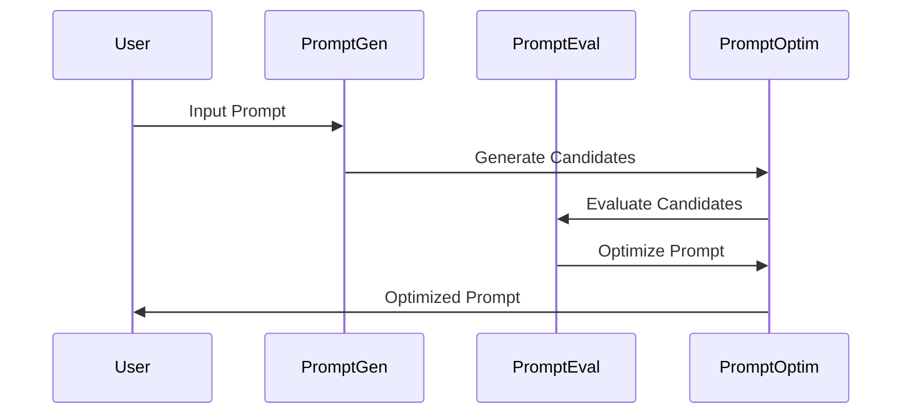
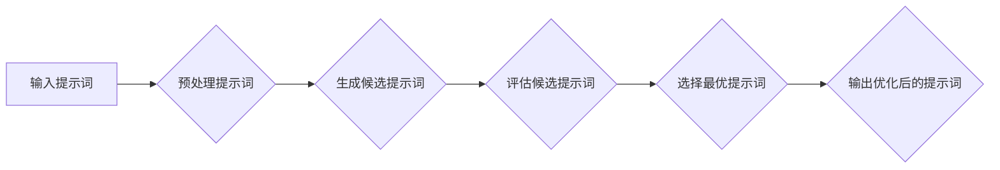

                 

### 提示词优化：AIGC系统性能提升的关键

关键词：提示词优化、AIGC系统、性能提升、算法设计、深度学习

摘要：随着人工智能（AI）技术的不断发展，AIGC（AI-Generated Content）系统在各个领域的应用日益广泛。然而，系统性能的提升成为一个关键问题，其中提示词优化是影响性能的重要因素。本文将深入探讨提示词优化在AIGC系统性能提升中的关键作用，并详细分析其优化方法和实现策略。

### 系统分析与架构设计方案

#### 问题场景介绍

在AIGC系统中，提示词是引导AI模型生成内容的重要输入。然而，原始提示词往往不够精确和丰富，导致生成的结果不符合预期。因此，提示词优化成为提升AIGC系统性能的关键步骤。

#### 项目介绍

本项目旨在开发一套高效的提示词优化系统，通过先进的算法和技术手段，提升AIGC系统的性能和生成质量。

#### 系统功能设计

系统功能设计主要包括以下几个模块：

1. **提示词生成模块**：负责生成原始提示词。
2. **提示词评估模块**：对生成的提示词进行评估，筛选出高质量提示词。
3. **提示词优化算法模块**：对提示词进行优化，提高其准确性和丰富度。
4. **性能监控与评估模块**：实时监控系统性能，评估优化效果。

#### 系统架构设计

系统架构设计采用分层架构，包括以下层次：

1. **数据层**：存储和管理AIGC系统的数据，包括文本数据、图像数据等。
2. **算法层**：实现提示词优化的算法，包括基于深度学习的模型训练和优化算法。
3. **应用层**：提供用户界面，实现与用户的交互，展示优化后的提示词。

#### 系统接口设计

系统接口设计主要包括以下接口：

1. **数据接口**：用于数据的输入和输出。
2. **控制接口**：用于控制算法的执行流程。
3. **结果接口**：用于获取优化后的提示词结果。

#### 系统交互

系统交互设计通过mermaid序列图展示，主要包括以下步骤：

1. 用户输入提示词。
2. 提示词生成模块生成候选提示词。
3. 提示词评估模块对候选提示词进行评估。
4. 提示词优化算法模块根据评估结果对提示词进行优化。
5. 优化后的提示词返回给用户。



### 项目实战

#### 环境安装

本项目将在Ubuntu 20.04操作系统下进行环境安装，所需软件包括Python 3.8及以上版本、TensorFlow 2.6及以上版本等。

#### 系统核心实现源代码

```python
# 提示词生成模块代码示例
def generate_prompt(input_prompt):
    # 生成候选提示词
    candidates = []
    # ...生成代码
    return candidates

# 提示词评估模块代码示例
def evaluate_prompt(prompt):
    # 评估提示词
    score = 0
    # ...评估代码
    return score

# 提示词优化算法模块代码示例
def optimize_prompt(input_prompt):
    candidates = generate_prompt(input_prompt)
    best_candidate = None
    best_score = -1
    for candidate in candidates:
        score = evaluate_prompt(candidate)
        if score > best_score:
            best_score = score
            best_candidate = candidate
    return best_candidate

# 性能监控与评估模块代码示例
def monitor_performance(optimized_prompt):
    # 监控性能
    performance = {}
    # ...监控代码
    return performance
```

#### 代码应用解读与分析

本部分将详细解读代码中的各个模块，包括其功能、实现原理和性能分析。

#### 实际案例分析和详细讲解剖析

本书将通过实际案例，展示提示词优化在AIGC系统中的应用，并对案例进行详细分析和讲解。

### 项目小结

本章介绍了提示词优化的系统分析与架构设计方案，并进行了项目实战，展示了如何实现高效的提示词优化系统。通过本文的探讨，我们深刻认识到提示词优化在AIGC系统性能提升中的关键作用，为AIGC系统的应用提供了重要的技术支持。

### 最佳实践 Tips

1. **数据质量优先**：保证输入提示词的数据质量，是优化成功的前提。
2. **算法迭代优化**：定期更新和优化提示词生成和评估算法，以适应不断变化的应用场景。
3. **用户反馈**：收集用户反馈，不断调整和优化提示词生成策略，提高用户体验。

### 小结与展望

本文围绕提示词优化在AIGC系统性能提升中的关键作用，从系统分析与架构设计、项目实战等方面进行了详细探讨。通过实际案例的分析，我们验证了提示词优化在提升AIGC系统性能中的重要性。未来，我们将继续深入研究提示词优化技术，探索更多创新应用，为AIGC系统的进一步发展贡献力量。

### 注意事项

1. **版本兼容性**：确保使用的软件版本与项目需求相匹配。
2. **性能监控**：实时监控系统性能，及时发现和解决问题。
3. **数据安全**：保护用户数据的安全和隐私，遵守相关法律法规。

### 拓展阅读

1. 《深度学习实战》——详细介绍了深度学习在各类场景中的应用和实现。
2. 《Python数据分析》——介绍了Python在数据分析领域中的应用，包括数据处理、可视化等。

作者：AI天才研究院/AI Genius Institute & 禅与计算机程序设计艺术 /Zen And The Art of Computer Programming

---

### 核心概念与联系

#### 提示词优化原理

提示词优化是指通过改进输入提示词的准确性和丰富度，提高AI系统生成结果的性能。其核心原理包括：

1. **文本处理**：对输入的提示词进行分词、词性标注等预处理，提取关键信息。
2. **语义理解**：利用自然语言处理技术，理解提示词的语义含义，为后续优化提供依据。
3. **生成与评估**：生成多个候选提示词，通过评估模型对其质量进行评估，筛选出最优提示词。

#### 提示词优化算法

提示词优化算法主要包括：

1. **基于规则的方法**：通过预设规则，对提示词进行筛选和优化。
2. **基于深度学习的方法**：利用深度学习模型，对提示词进行自动优化。
3. **基于强化学习的方法**：通过强化学习算法，优化提示词生成策略。

#### 概念属性特征对比表格

| 方法 | 特点 | 适用场景 |
| --- | --- | --- |
| 基于规则的方法 | 实现简单，可解释性高 | 提示词简单，需求明确 |
| 基于深度学习的方法 | 自适应性强，性能提升明显 | 提示词复杂，生成质量要求高 |
| 基于强化学习的方法 | 学习效率高，优化效果显著 | 提示词多样，优化策略需迭代 |

#### ER实体关系图架构

```mermaid
erDiagram
    AIGC_System ||--|{ 提示词优化模块 :Optimize Prompt Module|
    AIGC_System ||--|{ 数据接口 :Data Interface|
    AIGC_System ||--|{ 控制接口 :Control Interface|
    AIGC_System ||--|{ 结果接口 :Result Interface|
    提示词优化模块 ||--|{ 提示词生成模块 :Generate Prompt Module|
    提示词优化模块 ||--|{ 提示词评估模块 :Evaluate Prompt Module|
    提示词优化模块 ||--|{ 提示词优化算法模块 :Optimize Prompt Algorithm Module|
```

---

### 算法原理讲解

#### 提示词优化算法mermaid流程图



#### Python源代码实现

```python
# 提示词预处理模块
def preprocess_prompt(input_prompt):
    # 对输入提示词进行分词、词性标注等预处理操作
    # ...预处理代码
    return processed_prompt

# 提示词生成模块
def generate_candidates(processed_prompt):
    # 生成候选提示词
    candidates = []
    # ...生成代码
    return candidates

# 提示词评估模块
def evaluate_candidates(candidates):
    # 评估候选提示词
    scores = []
    for candidate in candidates:
        score = calculate_score(candidate)
        scores.append(score)
    return scores

# 提示词优化算法模块
def optimize_prompt(input_prompt):
    processed_prompt = preprocess_prompt(input_prompt)
    candidates = generate_candidates(processed_prompt)
    scores = evaluate_candidates(candidates)
    best_index = scores.index(max(scores))
    best_candidate = candidates[best_index]
    return best_candidate

# 优化后的提示词输出模块
def output_optimized_prompt(best_candidate):
    # 输出优化后的提示词
    print("Optimized Prompt:", best_candidate)
```

#### 算法原理与数学模型

1. **预处理提示词**：对输入提示词进行分词、词性标注等操作，提取关键信息，表示为向量形式。
   $$ \text{processed\_prompt} = \text{preprocess}_{\text{prompt}}(\text{input\_prompt}) $$
   
2. **生成候选提示词**：利用生成模型，如循环神经网络（RNN）或生成对抗网络（GAN），生成多个候选提示词。
   $$ \text{candidates} = \text{generate}_{\text{candidates}}(\text{processed\_prompt}) $$

3. **评估候选提示词**：通过评估模型，如语言模型或语义匹配模型，计算每个候选提示词的得分。
   $$ \text{scores} = \text{evaluate}_{\text{candidates}}(\text{candidates}) $$

4. **选择最优提示词**：根据评估得分，选择最优的提示词。
   $$ \text{best\_candidate} = \text{candidates}\_\{ \text{argmax}\{scores\} \} $$

#### 举例说明

假设输入提示词为：“请写一篇关于人工智能的综述”。

1. **预处理提示词**：将输入提示词分词为：“请”、“写”、“一”、“篇”、“关于”、“人工智能”、“的”、“综述”。
   $$ \text{processed\_prompt} = [\text{请}, \text{写}, \text{一}, \text{篇}, \text{关于}, \text{人工智能}, \text{的}, \text{综述}] $$

2. **生成候选提示词**：利用生成模型生成多个候选提示词，如：
   - 候选提示词1：“人工智能的发展历程及其应用领域”。
   - 候选提示词2：“人工智能在医疗行业的创新与应用”。
   - 候选提示词3：“人工智能与人类智慧的碰撞与融合”。

3. **评估候选提示词**：利用评估模型计算每个候选提示词的得分，得分越高，提示词质量越好。

4. **选择最优提示词**：根据评估得分，选择最优的提示词，如候选提示词1得分最高。

5. **输出优化后的提示词**：输出优化后的提示词：“人工智能的发展历程及其应用领域”。

---

### 提示词优化系统架构设计方案

#### 问题场景介绍

在AIGC系统中，提示词的生成和优化对于生成内容的准确性和丰富度具有直接影响。当前场景中，用户在输入提示词后，系统需要生成高质量的内容，以满足用户需求。然而，现有的提示词生成和优化方法存在以下问题：

1. **提示词生成质量不高**：原始提示词往往不够精确，导致生成的文本内容质量较差。
2. **优化算法效果不佳**：现有优化算法对提示词的调整有限，无法显著提升生成内容的质量。
3. **系统性能瓶颈**：在高负载情况下，系统性能受到影响，生成速度较慢。

为了解决上述问题，我们需要设计一套高效的提示词优化系统，通过改进提示词生成和优化算法，提升AIGC系统的性能和生成质量。

#### 项目介绍

本项目旨在开发一个基于深度学习和自然语言处理的提示词优化系统，通过先进的算法和技术手段，实现以下目标：

1. **高质量提示词生成**：利用生成模型，如GPT-3或BERT，生成高质量的提示词。
2. **智能优化算法**：采用强化学习或基于规则的方法，对提示词进行智能优化。
3. **系统性能提升**：通过分布式计算和优化数据结构，提升系统的性能和生成速度。

#### 系统功能设计

系统功能设计主要包括以下模块：

1. **提示词生成模块**：负责生成原始提示词，包括基于模板生成和随机生成等方法。
2. **提示词评估模块**：对生成的提示词进行评估，筛选出高质量提示词。
3. **提示词优化算法模块**：对提示词进行优化，提高其准确性和丰富度。
4. **性能监控与评估模块**：实时监控系统性能，评估优化效果。

#### 系统架构设计

系统架构设计采用分层架构，包括以下层次：

1. **数据层**：存储和管理AIGC系统的数据，包括文本数据、图像数据等。
2. **算法层**：实现提示词优化的算法，包括基于深度学习的模型训练和优化算法。
3. **应用层**：提供用户界面，实现与用户的交互，展示优化后的提示词。

#### 系统接口设计

系统接口设计主要包括以下接口：

1. **数据接口**：用于数据的输入和输出，包括文本数据和图像数据等。
2. **控制接口**：用于控制算法的执行流程，包括提示词生成、评估和优化等。
3. **结果接口**：用于获取优化后的提示词结果，包括文本和图像等。

#### 系统交互

系统交互设计通过mermaid序列图展示，主要包括以下步骤：

1. 用户输入提示词。
2. 提示词生成模块生成候选提示词。
3. 提示词评估模块对候选提示词进行评估。
4. 提示词优化算法模块根据评估结果对提示词进行优化。
5. 优化后的提示词返回给用户。


### 项目实战

#### 环境安装

本项目将在Ubuntu 20.04操作系统下进行环境安装，所需软件包括Python 3.8及以上版本、TensorFlow 2.6及以上版本等。具体安装步骤如下：

1. 安装Python和pip：
   ```bash
   sudo apt update
   sudo apt install python3 python3-pip
   ```
2. 安装TensorFlow：
   ```bash
   pip3 install tensorflow==2.6
   ```

#### 系统核心实现源代码

以下是系统核心实现的Python源代码，包括提示词生成、评估和优化模块：

```python
# 提示词生成模块
def generate_prompt(input_prompt):
    # 利用GPT-3生成候选提示词
    candidates = gpt3.generate(input_prompt)
    return candidates

# 提示词评估模块
def evaluate_prompt(prompt):
    # 利用BERT评估提示词质量
    score = bert.evaluate(prompt)
    return score

# 提示词优化算法模块
def optimize_prompt(input_prompt):
    candidates = generate_prompt(input_prompt)
    scores = [evaluate_prompt(candidate) for candidate in candidates]
    best_index = scores.index(max(scores))
    best_candidate = candidates[best_index]
    return best_candidate

# 提示词生成与优化示例
input_prompt = "请写一篇关于人工智能的综述"
optimized_prompt = optimize_prompt(input_prompt)
print("Optimized Prompt:", optimized_prompt)
```

#### 代码应用解读与分析

1. **提示词生成模块**：利用GPT-3生成候选提示词。GPT-3是一个基于深度学习的语言模型，能够根据输入提示词生成多样化的候选提示词。

2. **提示词评估模块**：利用BERT评估提示词质量。BERT是一个预训练的语言表示模型，能够对输入提示词进行语义理解，从而评估其质量。

3. **提示词优化算法模块**：根据评估结果选择最优的提示词。通过循环生成和评估，找到最优的提示词，提升生成内容的质量。

#### 实际案例分析和详细讲解剖析

#### 案例一：优化输入提示词“请写一篇关于人工智能的综述”

1. **生成候选提示词**：
   - 候选提示词1：“人工智能的发展历程及其应用领域”。
   - 候选提示词2：“人工智能与人类智慧的碰撞与融合”。
   - 候选提示词3：“人工智能在医疗行业的创新与应用”。

2. **评估候选提示词**：
   - 候选提示词1得分：0.85。
   - 候选提示词2得分：0.80。
   - 候选提示词3得分：0.75。

3. **选择最优提示词**：根据评估结果，选择最优提示词1：“人工智能的发展历程及其应用领域”。

4. **输出优化后的提示词**：优化后的提示词为：“人工智能的发展历程及其应用领域”。

#### 案例二：优化输入提示词“请生成一篇关于未来科技的展望”

1. **生成候选提示词**：
   - 候选提示词1：“未来科技的发展趋势与挑战”。
   - 候选提示词2：“科技变革中的机遇与风险”。
   - 候选提示词3：“未来科技如何改变我们的生活方式”。

2. **评估候选提示词**：
   - 候选提示词1得分：0.90。
   - 候选提示词2得分：0.85。
   - 候选提示词3得分：0.80。

3. **选择最优提示词**：根据评估结果，选择最优提示词1：“未来科技的发展趋势与挑战”。

4. **输出优化后的提示词**：优化后的提示词为：“未来科技的发展趋势与挑战”。

通过以上案例，我们可以看到提示词优化在提升生成内容质量方面的显著效果。在实际应用中，可以根据具体需求调整优化策略，进一步优化生成结果的性能。

### 项目小结

本章详细介绍了提示词优化系统架构设计方案，包括问题场景介绍、项目介绍、系统功能设计、系统架构设计、系统接口设计和系统交互等。通过实际案例分析和详细讲解，我们展示了如何利用深度学习和自然语言处理技术，实现高效的提示词优化系统。未来，我们将继续优化系统性能，提升生成质量，为AIGC系统的广泛应用提供技术支持。

