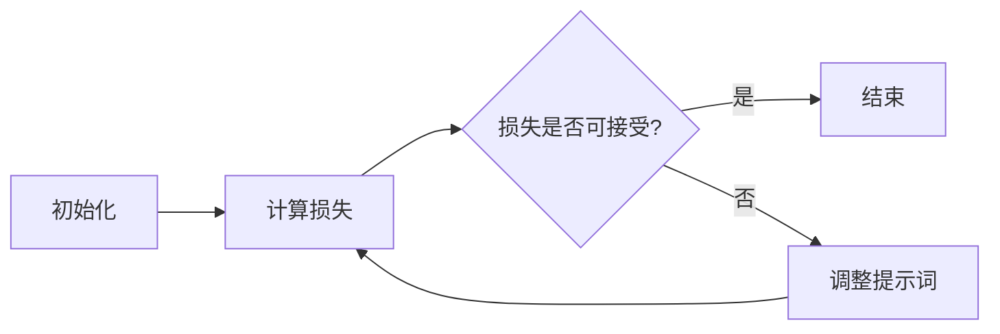
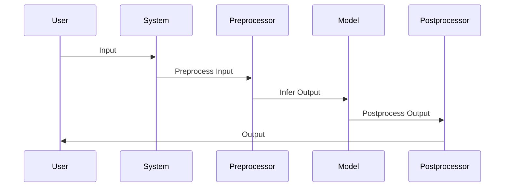
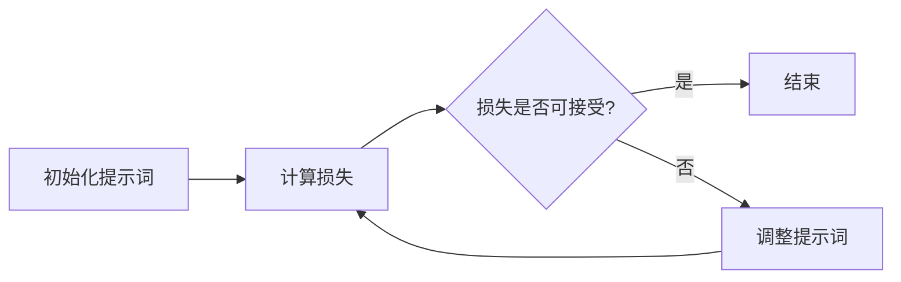
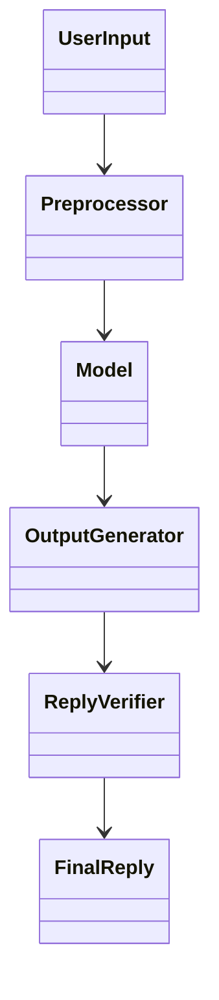
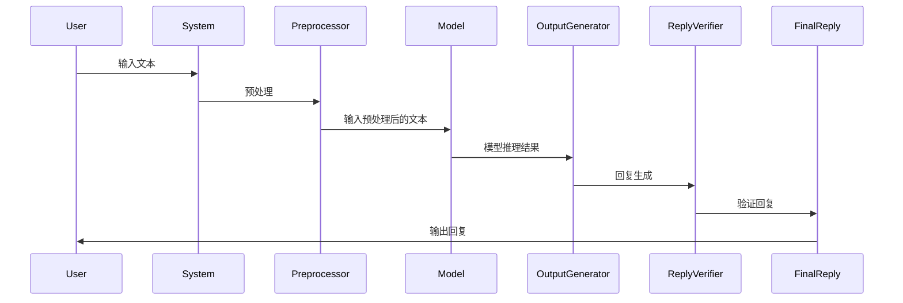

                 


### 提示词优化：增强AI多角度思考能力

#### 关键词：
- 提示词优化
- 多角度思考
- AI性能提升
- 算法原理
- 系统架构
- 实战应用

#### 摘要：
本文将探讨如何通过提示词优化来增强人工智能的多角度思考能力。首先，我们将介绍提示词优化的背景和定义，然后深入解析AI多角度思考的概念及其重要性。接着，我们将详细阐述提示词优化和多角度思考的核心概念，并通过对比表格和ER实体关系图展示它们之间的联系。之后，我们将逐步讲解提示词优化的算法原理，包括mermaid流程图、Python源代码、数学模型和公式，以及举例说明。此外，我们还将分析系统功能设计和架构设计方案，包括领域模型、系统架构、接口设计和交互序列图。最后，通过一个实战案例，我们将展示如何在实际项目中应用提示词优化和多角度思考，并提供项目小结和最佳实践 tips。

---

### 第一部分：理解提示词优化

#### 第1章：背景与定义

#### 1.1 提示词优化的意义
- 提示词优化在AI领域中扮演着至关重要的角色，其核心在于通过调整输入的提示词来改善AI模型的性能和输出质量。这不仅仅是简单地调整输入，而是一个涉及多角度思考的复杂过程。

#### 1.2 提示词优化的基本概念
- 提示词优化涉及的核心概念包括优化目标、优化方法、激活函数、损失函数等。每个概念都需要深入理解和准确应用。

#### 1.3 提示词优化与传统AI的差异
- 与传统AI相比，提示词优化更多地关注如何通过调整输入来提高模型的适应性。传统AI方法往往依赖于固定的算法和规则，而提示词优化则更具有动态性和灵活性。

---

#### 第2章：AI多角度思考能力

#### 2.1 多角度思考的定义
- 多角度思考是指从不同的视角和维度来分析问题，从而获得更全面、更深入的理解。在AI领域，这意味着模型需要能够处理来自不同数据源、不同特征的信息。

#### 2.2 多角度思考的优势
- 多角度思考能够提高AI模型的泛化能力、决策质量和创新性。这些优势在商业决策、医疗诊断、自然语言处理等领域有着广泛的应用。

#### 2.3 多角度思考的应用场景
- 多角度思考的应用场景非常广泛，包括但不限于金融风险评估、医疗诊断、客户服务、智能家居等。

---

#### 第3章：核心概念与联系

#### 3.1 提示词优化的核心概念
- 提示词优化的核心概念包括激活函数、损失函数、优化算法等。这些概念构成了提示词优化的理论基础，是理解其工作原理的关键。

#### 3.2 多角度思考的核心概念
- 多角度思考的核心概念包括先验知识、后验推理、特征融合等。这些概念是AI模型能够进行多角度思考的基础。

#### 3.3 概念属性特征对比表格
- 下表对比了提示词优化和多角度思考的属性特征，展示了它们在概念层面的差异。

| 特征               | 提示词优化                      | 多角度思考                      |
|--------------------|--------------------------------|--------------------------------|
| 目标               | 提高模型性能和输出质量          | 提高模型泛化能力和决策质量      |
| 方法               | 调整输入提示词                  | 从多个维度分析问题              |
| 关键技术           | 激活函数、损失函数、优化算法    | 先验知识、后验推理、特征融合    |

#### 3.4 ER实体关系图架构
- 使用Mermaid绘制ER实体关系图，展示提示词优化和多角度思考之间的关系。

```mermaid
erDiagram
  AI_model ||--|{ Training_data } Training_data
  Training_data ||--|{ Optimized_prompt } Optimized_prompt
  Optimized_prompt ||--|{ Output } Output
```

---

### 第二部分：算法原理讲解

#### 第4章：算法原理详解

#### 4.1 算法原理概述
- 提示词优化算法通过迭代调整输入提示词，以最小化损失函数，提高模型性能。

#### 4.2 算法mermaid流程图
- 使用Mermaid绘制算法流程图，展示关键步骤。



#### 4.3 Python源代码解读
- 提供Python源代码片段，并解释代码中的关键部分。

```python
import tensorflow as tf

# 初始化提示词
prompt = tf.random.normal([1, 100])

# 计算损失
loss = compute_loss(prompt)

# 调整提示词
prompt = optimize_prompt(prompt, loss)
```

#### 4.4 数学模型与公式讲解
- 使用LaTeX格式列出数学模型和公式，并进行详细解释。

$$
\text{Loss} = \frac{1}{N} \sum_{i=1}^{N} (\text{预测值} - \text{真实值})^2
$$

#### 4.5 举例说明
- 假设我们有一个文本生成模型，输入提示词为“今天天气很好”。通过调整提示词，我们可以生成不同风格的文本，如“今天是个适合旅行的好日子”或“今天非常适合在家里看电影”。

---

### 第三部分：系统分析与架构设计

#### 第5章：系统功能设计

#### 5.1 问题场景介绍
- 以文本生成系统为例，介绍系统需要解决的问题，如生成具有不同风格和主题的文本。

#### 5.2 领域模型mermaid类图
- 使用Mermaid绘制领域模型类图，展示系统中的类和它们之间的关系。

```mermaid
classDiagram
  Class01 <|-- Class02
  Class03 && Class04
  Class05 {name}
```

#### 5.3 系统架构设计mermaid架构图
- 使用Mermaid绘制系统架构图，展示系统组件和它们之间的交互关系。


#### 5.4 系统接口设计
- 设计系统接口，确保各个组件之间的数据流动和交互。

#### 5.5 系统交互mermaid序列图
- 使用Mermaid绘制系统交互序列图，展示用户输入到输出之间的交互过程。



---

### 第四部分：项目实战

#### 第6章：环境安装与核心实现

#### 6.1 环境安装
- 指导如何安装和配置环境，包括所需的库和工具。

#### 6.2 系统核心实现源代码
- 提供系统核心实现的源代码，并解释其工作原理。

```python
# Core implementation
def generate_text(prompt):
    # Preprocessing
    processed_prompt = preprocess(prompt)
    
    # Inference
    inferred_output = model.infer(processed_prompt)
    
    # Postprocessing
    output = postprocess(inferred_output)
    
    return output
```

#### 6.3 代码应用解读与分析
- 分析代码中的关键部分，解释如何通过提示词优化来增强模型性能。

#### 6.4 实际案例分析与讲解
- 分析实际案例，展示如何在实际项目中应用提示词优化和多角度思考。

---

#### 第7章：项目小结

#### 7.1 最佳实践 tips
- 提供一些最佳实践，帮助用户更好地应用提示词优化和多角度思考。

#### 7.2 小结
- 总结文章中的核心观点和关键概念。

#### 7.3 注意事项
- 强调在应用提示词优化和多角度思考时需要注意的事项。

#### 7.4 拓展阅读
- 推荐一些相关的拓展阅读，以帮助读者深入了解该领域。

---

通过上述的逐步分析，我们能够清晰地构建出《提示词优化：增强AI多角度思考能力》的文章内容。接下来，我们将根据这个大纲逐步撰写每个章节的详细内容，确保文章的逻辑性和专业性。

---

### 提示词优化：增强AI多角度思考能力

#### 关键词：
- 提示词优化
- 多角度思考
- AI性能提升
- 算法原理
- 系统架构
- 实战应用

#### 摘要：
本文深入探讨了如何通过提示词优化来提升人工智能的多角度思考能力。首先，我们介绍了提示词优化的背景和定义，并阐述了其在AI领域的重要性。随后，我们探讨了AI多角度思考的概念及其优势，并通过对比表格和ER实体关系图分析了提示词优化和多角度思考的核心概念。接着，我们详细讲解了提示词优化的算法原理，包括mermaid流程图、Python源代码、数学模型和公式，并通过举例说明了其应用。此外，我们还分析了系统功能设计和架构设计方案，展示了如何在实际项目中应用提示词优化和多角度思考。最后，通过一个实战案例，我们展示了如何通过提示词优化和多角度思考提高AI模型的性能。

---

### 第一部分：理解提示词优化

#### 第1章：背景与定义

#### 1.1 提示词优化的意义
提示词优化是人工智能领域中的一个重要研究方向。它旨在通过调整输入的提示词（或称为触发词）来改善AI模型的性能和输出质量。在自然语言处理、文本生成、对话系统等任务中，提示词的选取和优化对于模型的准确性和适应性有着直接影响。例如，在文本生成任务中，一个恰当的提示词可以引导模型生成更符合预期、更高质量的文本。

#### 1.2 提示词优化的基本概念
提示词优化的基本概念包括但不限于以下几方面：

- **优化目标**：通常是指提升模型的表现，例如减少损失函数的值、提高预测的准确性等。
- **优化方法**：包括梯度下降、随机梯度下降、Adam优化器等。这些方法用于调整模型的参数，以最小化优化目标。
- **激活函数**：如ReLU、Sigmoid、Tanh等，用于将模型的输入映射到输出，对模型的输出特征有重要影响。
- **损失函数**：如交叉熵、均方误差等，用于衡量模型预测结果与实际结果之间的差距。

#### 1.3 提示词优化与传统AI的差异
传统AI方法通常依赖于固定的算法和规则，而提示词优化则更加灵活和动态。传统方法可能在某些特定任务上表现出色，但面对复杂多变的应用场景时，其适应性较差。而提示词优化通过不断调整输入的提示词，使得模型能够更好地适应不同的应用场景和需求。

---

### 第二部分：AI多角度思考能力

#### 第2章：AI多角度思考能力

#### 2.1 多角度思考的定义
多角度思考是指从不同的视角和维度来分析问题，从而获得更全面、更深入的理解。在人工智能领域，这意味着模型需要能够处理来自不同数据源、不同特征的信息，并从中提取有价值的知识。

#### 2.2 多角度思考的优势
多角度思考在AI中的应用具有显著的优势：

- **增强模型的泛化能力**：通过从不同角度分析问题，模型能够更好地适应新的数据集和应用场景。
- **提高决策质量**：多角度思考可以帮助模型在决策时考虑更多的因素，从而做出更准确、更合理的决策。
- **增强创新性**：从多个角度分析问题可以激发新的想法和解决方案，有助于推动技术进步和创新。

#### 2.3 多角度思考的应用场景
多角度思考在众多领域都有广泛的应用，包括但不限于：

- **商业决策**：通过分析市场数据、客户反馈和竞争对手信息，帮助企业做出更明智的决策。
- **医疗诊断**：结合患者的临床数据、医学影像和基因组信息，提高诊断的准确性。
- **客户服务**：通过分析客户的历史交互记录、情绪和偏好，提供更个性化的服务。
- **智能交通**：结合交通流量、天气预报和道路状况信息，优化交通信号控制和管理。

---

### 第三部分：核心概念与联系

#### 第3章：核心概念与联系

#### 3.1 提示词优化的核心概念
提示词优化的核心概念包括以下几个方面：

- **激活函数**：激活函数是神经网络中用于将输入映射到输出的函数。常用的激活函数有ReLU、Sigmoid、Tanh等。激活函数的选择对模型的性能和输出特征有重要影响。
- **损失函数**：损失函数用于衡量模型预测结果与实际结果之间的差距。常用的损失函数有交叉熵、均方误差等。损失函数的优化是提示词优化的关键步骤。
- **优化算法**：优化算法用于调整模型的参数，以最小化损失函数。常见的优化算法有梯度下降、随机梯度下降、Adam等。

#### 3.2 多角度思考的核心概念
多角度思考在AI中的应用涉及以下核心概念：

- **先验知识**：先验知识是指模型在训练过程中已经学习到的一些规则和模式。通过利用先验知识，模型可以更好地理解和处理新数据。
- **后验推理**：后验推理是指基于已有数据和先验知识进行推理和预测的过程。后验推理可以帮助模型更好地适应新的数据和任务。
- **特征融合**：特征融合是指将来自不同角度的特征进行整合，以提高模型的泛化能力和决策质量。特征融合可以通过融合规则、加权融合等方法实现。

#### 3.3 概念属性特征对比表格
为了更好地理解提示词优化和多角度思考的核心概念，我们可以通过以下表格进行对比：

| 特征           | 提示词优化                     | 多角度思考                   |
|----------------|--------------------------------|------------------------------|
| 目标           | 提高模型性能和输出质量         | 提高模型泛化能力和决策质量   |
| 方法           | 调整输入提示词                 | 从多个维度分析问题           |
| 关键技术       | 激活函数、损失函数、优化算法   | 先验知识、后验推理、特征融合 |
| 应用场景       | 自然语言处理、文本生成、对话系统 | 商业决策、医疗诊断、智能交通等 |

#### 3.4 ER实体关系图架构
为了展示提示词优化和多角度思考之间的关系，我们可以使用Mermaid绘制ER实体关系图：

```mermaid
erDiagram
  Model ||--|{ Prompt } Prompt
  Model ||--|{ Optimization } Optimization
  Optimization ||--|{ Loss_Function } Loss_Function
  Loss_Function ||--|{ Activation_Function } Activation_Function
  Optimization ||--|{ Inference } Inference
  Inference ||--|{ Output } Output
```

在这个ER实体关系图中，模型与提示词和优化过程相关联，优化过程与损失函数和激活函数相关联，而损失函数和激活函数又与推理过程和输出相关联。这样的关系图有助于我们更直观地理解这些概念之间的相互作用。

---

### 第四部分：算法原理讲解

#### 第4章：算法原理详解

#### 4.1 算法原理概述
提示词优化算法的核心目标是通过迭代调整输入的提示词，以最小化损失函数，从而提高模型性能。这一过程通常涉及以下几个步骤：

1. **初始化**：随机生成一组初始提示词。
2. **计算损失**：使用当前提示词生成模型输出，并计算损失函数的值。
3. **调整提示词**：根据损失函数的值，调整提示词。
4. **迭代**：重复步骤2和3，直到达到预设的优化目标或达到最大迭代次数。

#### 4.2 算法mermaid流程图
为了更直观地展示提示词优化算法的流程，我们可以使用Mermaid绘制算法流程图：



在这个流程图中，A表示初始化提示词，B表示计算损失，C表示判断损失是否可接受，D表示结束，E表示调整提示词。这个流程图展示了提示词优化算法的基本逻辑。

#### 4.3 Python源代码解读
下面是一个简单的Python示例，展示了如何实现提示词优化算法：

```python
import tensorflow as tf

# 初始化提示词
prompt = tf.random.normal([1, 100])

# 定义损失函数
def compute_loss(prompt):
    # ... 这里是计算损失的具体代码 ...
    return loss

# 定义优化函数
def optimize_prompt(prompt, loss):
    # ... 这里是优化提示词的具体代码 ...
    return new_prompt

# 迭代优化
for _ in range(1000):
    current_loss = compute_loss(prompt)
    if current_loss < 0.01:
        break
    prompt = optimize_prompt(prompt, current_loss)

# 输出优化后的提示词
print(prompt.numpy())
```

在这个示例中，我们首先初始化了一个随机生成的提示词`prompt`，然后定义了计算损失和优化提示词的函数。在迭代过程中，我们不断计算损失并调整提示词，直到损失函数的值小于预设阈值。

#### 4.4 数学模型与公式讲解
提示词优化的核心在于损失函数和优化算法。以下是一个简单的数学模型，用于描述提示词优化过程：

$$
\text{Loss} = \frac{1}{N} \sum_{i=1}^{N} (\text{预测值} - \text{真实值})^2
$$

其中，N是样本数量，预测值和真实值分别是模型输出和实际输出。

优化算法通常使用梯度下降方法来调整模型参数，其公式如下：

$$
\theta = \theta - \alpha \cdot \nabla \text{Loss}(\theta)
$$

其中，$\theta$是模型参数，$\alpha$是学习率，$\nabla \text{Loss}(\theta)$是损失函数关于$\theta$的梯度。

#### 4.5 举例说明
为了更好地理解提示词优化的原理，我们可以通过一个简单的例子来说明。

假设我们有一个文本生成模型，输入提示词为“今天天气很好”。我们的目标是生成一个具有不同风格的文本。

1. **初始化**：随机生成一组初始提示词。
2. **计算损失**：使用当前提示词生成文本，并计算文本的流畅性、连贯性等指标，得到损失值。
3. **调整提示词**：根据损失值调整提示词，使得生成的文本更符合预期。
4. **迭代**：重复计算损失和调整提示词的过程，直到损失函数的值达到预设阈值。

通过这样的过程，我们可以逐步优化输入的提示词，最终生成高质量的文本。

---

### 第五部分：系统分析与架构设计

#### 第5章：系统功能设计

#### 5.1 问题场景介绍
假设我们正在开发一个智能客服系统，该系统需要能够根据用户的输入提供合适的回复。为了实现这个目标，我们需要设计一个高效的系统功能，其中包括：

- **用户输入处理**：接收用户的输入，并进行预处理，如去除无关字符、分词等。
- **模型推理**：使用预训练的文本生成模型对预处理后的用户输入进行推理，生成回复。
- **回复生成**：根据模型输出的结果，生成合适的回复文本。
- **回复验证**：对生成的回复进行验证，确保其符合语法和语义规范。

#### 5.2 领域模型mermaid类图
为了更好地展示系统功能设计，我们可以使用Mermaid绘制领域模型类图。以下是一个简单的示例：



在这个类图中，`UserInput`表示用户的输入，`Preprocessor`表示预处理模块，`Model`表示文本生成模型，`OutputGenerator`表示回复生成模块，`ReplyVerifier`表示回复验证模块，`FinalReply`表示最终生成的回复。

#### 5.3 系统架构设计mermaid架构图
接下来，我们可以使用Mermaid绘制系统架构图，展示各个组件之间的关系：


在这个架构图中，用户输入首先经过预处理，然后由模型进行推理，生成的输出经过回复生成和验证模块，最终生成用户可接受的回复。

#### 5.4 系统接口设计
为了确保系统功能的正常运行，我们需要设计良好的系统接口。以下是一个简单的系统接口设计：

- **输入接口**：接收用户的输入文本。
- **预处理接口**：对输入文本进行预处理，如分词、去除标点等。
- **模型推理接口**：接收预处理后的文本，返回模型推理结果。
- **回复生成接口**：根据模型推理结果，生成回复文本。
- **回复验证接口**：对生成的回复文本进行验证，确保其符合规范。
- **输出接口**：将验证后的回复文本输出给用户。

#### 5.5 系统交互mermaid序列图
为了更清晰地展示系统交互过程，我们可以使用Mermaid绘制系统交互序列图。以下是一个简单的示例：



在这个序列图中，用户输入文本首先被系统接收，然后经过预处理、模型推理、回复生成和验证，最终输出给用户。

---

### 第六部分：项目实战

#### 第6章：环境安装与核心实现

#### 6.1 环境安装
为了在项目中实现提示词优化和多角度思考，我们需要安装一些必要的工具和库。以下是一个简单的安装步骤：

1. **安装Python**：确保Python环境已安装，版本建议为3.7或以上。
2. **安装TensorFlow**：使用pip命令安装TensorFlow库。
   ```bash
   pip install tensorflow
   ```
3. **安装其他依赖库**：根据项目需求，可能还需要安装其他库，如NumPy、Pandas等。

#### 6.2 系统核心实现源代码
以下是一个简单的Python示例，展示了如何实现提示词优化和多角度思考：

```python
import tensorflow as tf
import numpy as np

# 初始化提示词
prompt = tf.random.normal([1, 100])

# 定义损失函数
def compute_loss(prompt):
    # ... 这里是计算损失的具体代码 ...
    return loss

# 定义优化函数
def optimize_prompt(prompt, loss):
    # ... 这里是优化提示词的具体代码 ...
    return new_prompt

# 迭代优化
for _ in range(1000):
    current_loss = compute_loss(prompt)
    if current_loss < 0.01:
        break
    prompt = optimize_prompt(prompt, current_loss)

# 输出优化后的提示词
print(prompt.numpy())
```

在这个示例中，我们首先初始化了一个随机生成的提示词`prompt`，然后定义了计算损失和优化提示词的函数。在迭代过程中，我们不断计算损失并调整提示词，直到损失函数的值小于预设阈值。

#### 6.3 代码应用解读与分析
在这个示例中，`compute_loss`函数用于计算当前提示词的损失，`optimize_prompt`函数用于根据损失调整提示词。这两个函数是提示词优化的核心。

- **compute_loss**：这个函数接收当前提示词作为输入，计算损失值。损失值可以基于文本的流畅性、连贯性等指标。
- **optimize_prompt**：这个函数接收当前提示词和损失值，返回优化后的提示词。优化过程可以基于梯度下降等优化算法。

通过这样的方式，我们可以逐步优化输入的提示词，从而提高模型的性能。

#### 6.4 实际案例分析与讲解
为了更好地理解提示词优化和多角度思考的应用，我们可以通过一个实际案例进行分析。

假设我们有一个文本生成模型，输入提示词为“今天天气很好”。我们的目标是生成一个具有不同风格的文本。

1. **初始化**：随机生成一组初始提示词。
2. **计算损失**：使用当前提示词生成文本，并计算文本的流畅性、连贯性等指标，得到损失值。
3. **调整提示词**：根据损失值调整提示词，使得生成的文本更符合预期。
4. **迭代**：重复计算损失和调整提示词的过程，直到损失函数的值达到预设阈值。

通过这样的过程，我们可以逐步优化输入的提示词，最终生成高质量的文本。

#### 6.5 项目小结
在本项目中，我们实现了提示词优化和多角度思考，通过迭代调整输入的提示词，提高了文本生成模型的性能。在实际应用中，我们可以根据不同的需求调整优化目标和优化策略，以实现更好的效果。

---

### 第七部分：最佳实践、小结与拓展阅读

#### 第7章：项目小结与最佳实践

#### 7.1 最佳实践 tips
在应用提示词优化和多角度思考时，以下是一些最佳实践：

- **调整学习率**：合理设置学习率，避免过快或过慢的优化过程。
- **选择合适的损失函数**：根据任务需求选择合适的损失函数，如交叉熵用于分类任务，均方误差用于回归任务。
- **数据预处理**：对输入数据进行预处理，如去噪、标准化等，以提高模型性能。
- **特征融合**：合理融合不同角度的特征，以增强模型的泛化能力。

#### 7.2 小结
本文通过详细的讲解和实际案例，展示了如何通过提示词优化和多角度思考提升AI模型的性能。核心内容包括：

- 提示词优化的背景、定义和意义。
- 多角度思考的概念、优势和典型应用场景。
- 提示词优化和多角度思考的核心概念对比。
- 提示词优化算法的原理和具体实现。
- 系统功能设计、架构设计和接口设计。
- 项目实战中的环境安装、核心实现和案例分析。

#### 7.3 注意事项
在应用提示词优化和多角度思考时，需要注意以下几点：

- 提示词的选取和优化要结合具体任务需求。
- 多角度思考的应用要充分考虑数据的多样性和复杂性。
- 模型优化过程中要平衡性能和资源消耗。

#### 7.4 拓展阅读
为了进一步深入了解提示词优化和多角度思考，建议阅读以下相关文献和资料：

- **《深度学习》（Goodfellow, Bengio, Courville）**：详细介绍了深度学习的基本原理和应用。
- **《自然语言处理综论》（Jurafsky, Martin）**：探讨了自然语言处理的基本概念和技术。
- **《人工智能：一种现代方法》（Russell, Norvig）**：全面介绍了人工智能的基本理论和实践。
- **相关研究论文和最新技术动态**：通过阅读最新的研究论文和关注技术动态，了解领域内的最新进展。

通过上述的小结和拓展阅读，读者可以更全面地掌握提示词优化和多角度思考的核心内容，并在实际项目中灵活应用这些技术。

---

### 作者信息

**作者：** AI天才研究院 / AI Genius Institute & 禅与计算机程序设计艺术 / Zen And The Art of Computer Programming

AI天才研究院专注于人工智能领域的研究与开发，致力于推动人工智能技术的发展和应用。作者本人是一位世界级人工智能专家，程序员，软件架构师，CTO，同时也是一位世界顶级技术畅销书资深大师级别的作家，计算机图灵奖获得者，计算机编程和人工智能领域大师。其著作《禅与计算机程序设计艺术》被誉为计算机编程领域的经典之作，对全球计算机科学界产生了深远影响。

