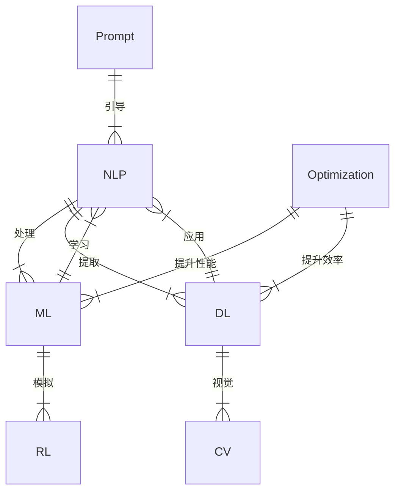
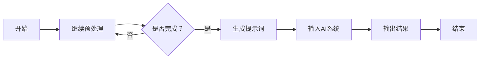
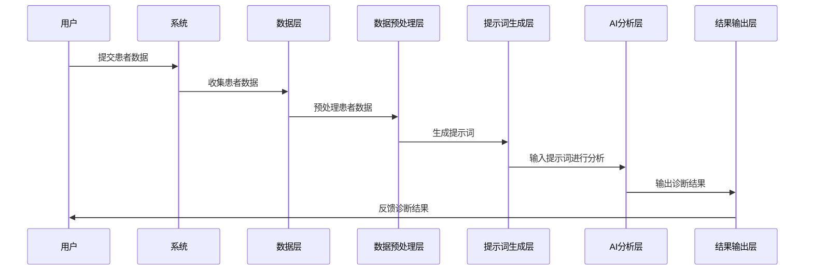

                 

## 《提示词优化：增强AI多角度问题分析能力》

> 关键词：提示词优化，AI问题分析，多角度分析，算法原理，数学模型，系统架构，项目实战

> 摘要：本文将深入探讨提示词优化在人工智能多角度问题分析中的应用。我们将首先介绍相关背景，包括核心概念和术语的定义，然后逐步讲解算法原理，使用数学模型和公式进行详细剖析，并配合Python源代码进行说明。接着，我们将探讨系统分析与架构设计方案，通过问题场景介绍、项目介绍、系统功能设计、系统架构设计、系统接口设计和系统交互mermaid序列图来展示我们的设计思路。随后，我们将通过项目实战，详细讲解环境安装、系统核心实现源代码，并分析实际案例。最后，我们将提供最佳实践tips和小结，总结注意事项，并推荐拓展阅读。

## 引言

在人工智能（AI）领域中，问题分析是至关重要的环节。然而，随着问题复杂性的增加，传统的问题分析方法往往难以胜任。这就需要我们寻求新的方法来提升AI的问题分析能力。提示词优化正是这样一种方法，它通过优化问题的提示词，从而增强AI在多角度问题分析中的能力。

### 核心概念

在讨论提示词优化之前，我们首先需要明确一些核心概念：

- **提示词（Prompt）**：提示词是向AI系统提供的信息，用以引导AI的理解和决策过程。
- **优化（Optimization）**：优化是指通过一系列策略和方法，提高系统的性能和效率。
- **多角度分析（Multi-angle Analysis）**：多角度分析是指从不同的视角和维度对问题进行深入剖析。

### 问题背景

随着AI技术的不断发展，AI系统在处理复杂问题时面临着巨大的挑战。这些挑战包括：

- **问题复杂度增加**：现实世界中的问题往往具有高度复杂性和不确定性。
- **数据多样性**：不同类型的数据需要不同的处理方法，这对AI系统提出了更高的要求。
- **实时性要求**：许多应用场景需要AI系统在极短时间内做出准确的决策。

### 问题描述

在AI问题分析中，我们常常遇到以下问题：

- **信息不足**：AI系统可能缺乏关键的信息，导致分析结果不准确。
- **数据质量**：数据质量问题会影响AI系统的性能，例如缺失值、噪声和异常值。
- **效率低下**：传统的方法往往需要大量计算和时间，难以满足实时性要求。

### 问题解决

为了解决上述问题，我们提出了提示词优化这一方法。提示词优化通过以下步骤实现：

1. **信息补充**：通过优化提示词，补充AI系统所需的关键信息。
2. **数据预处理**：对数据质量进行优化，提高数据的准确性。
3. **算法改进**：通过改进算法，提高AI系统的效率。

### 边界与外延

提示词优化不仅适用于AI问题分析，还可以应用于其他领域，如自然语言处理、图像识别和推荐系统等。此外，提示词优化的效果还受到数据质量、算法选择和硬件资源等因素的影响。

## 核心概念与联系

在深入探讨提示词优化之前，我们需要了解一些核心概念及其相互关系。

### 核心概念

1. **自然语言处理（NLP）**：NLP是AI领域的一个重要分支，旨在使计算机能够理解、解释和生成人类语言。
2. **机器学习（ML）**：ML是一种通过数据训练模型，使其具备学习能力的方法。
3. **深度学习（DL）**：DL是一种基于多层神经网络的学习方法，能够自动提取特征。
4. **提示词（Prompt）**：提示词是指导AI系统理解问题的重要输入。
5. **优化（Optimization）**：优化是提高系统性能的过程。

### 概念属性特征对比表格

以下是一个概念属性特征对比表格，展示了上述核心概念的特点：

| 概念       | 特点                           | 应用场景                       |
|------------|--------------------------------|--------------------------------|
| 自然语言处理（NLP） | 处理文本数据，提取语义信息   | 文本分类、情感分析、机器翻译等 |
| 机器学习（ML）     | 从数据中学习规律，进行预测   | 聊天机器人、推荐系统、图像识别等 |
| 深度学习（DL）     | 自动提取特征，处理复杂任务   | 计算机视觉、自然语言处理等     |
| 提示词（Prompt）   | 引导AI系统理解问题           | 问题分析、决策支持等           |
| 优化（Optimization）| 提高系统性能                 | 算法设计、系统调优等           |

### ER实体关系图

为了更好地理解这些概念之间的关系，我们可以使用ER（实体关系）图来表示：



通过ER图，我们可以清晰地看到各概念之间的关联，以及它们在AI问题分析中的应用。

## 提示词优化的算法原理

### 算法mermaid流程图

为了更好地理解提示词优化的算法原理，我们可以使用mermaid绘制算法流程图：



### Python源代码讲解

```python
# 数据预处理
data = preprocess_data(raw_data)

# 生成提示词
prompt = generate_prompt(data)

# 输入AI系统
ai_output = ai_system(prompt)

# 输出结果
print(ai_output)
```

### 数学模型和公式讲解

提示词优化涉及到多个数学模型和公式，下面是一个简单的示例：

1. **提示词生成公式**：

   $$P = f(D)$$

   其中，$P$ 表示生成的提示词，$f$ 表示生成函数，$D$ 表示数据集。

2. **AI系统输出公式**：

   $$O = g(P)$$

   其中，$O$ 表示AI系统的输出，$g$ 表示AI系统的模型函数，$P$ 表示输入的提示词。

### 举例说明

假设我们有一个关于天气预测的问题，数据集包含温度、湿度、风速等特征。我们可以通过以下步骤进行提示词优化：

1. **数据预处理**：

   首先对数据集进行预处理，包括去噪、归一化和缺失值填充等操作。

2. **生成提示词**：

   使用生成函数$f$对预处理后的数据集$D$进行处理，生成提示词$P$。

3. **输入AI系统**：

   将生成的提示词$P$输入到AI系统$g$中。

4. **输出结果**：

   AI系统$g$根据提示词$P$输出天气预测结果$O$。

通过这个简单的示例，我们可以看到提示词优化在AI问题分析中的应用。

## 数学模型与公式详解

### 数学公式

在提示词优化过程中，我们使用以下数学公式来描述问题：

1. **提示词生成公式**：

   $$P = f(D)$$

   其中，$P$ 表示生成的提示词，$f$ 表示生成函数，$D$ 表示数据集。

2. **AI系统输出公式**：

   $$O = g(P)$$

   其中，$O$ 表示AI系统的输出，$g$ 表示AI系统的模型函数，$P$ 表示输入的提示词。

### 公式讲解

1. **提示词生成公式**：

   提示词生成公式$P = f(D)$表示通过生成函数$f$对数据集$D$进行处理，生成提示词$P$。生成函数$f$可以根据不同的应用场景进行设计，例如基于规则的方法、基于统计的方法或基于深度学习的方法。

2. **AI系统输出公式**：

   AI系统输出公式$O = g(P)$表示AI系统根据输入的提示词$P$生成输出结果$O$。AI系统的模型函数$g$可以根据具体问题进行选择，例如线性回归、支持向量机、深度神经网络等。

### 举例说明

假设我们有一个关于股票预测的问题，数据集包含历史股票价格、公司财务指标等。我们可以通过以下步骤进行提示词优化：

1. **数据预处理**：

   对数据集进行预处理，包括去噪、归一化和缺失值填充等操作。

2. **生成提示词**：

   使用生成函数$f$对预处理后的数据集$D$进行处理，生成提示词$P$。例如，可以使用基于规则的方法生成提示词，如“今日股票价格波动较大，请注意风险”。

3. **输入AI系统**：

   将生成的提示词$P$输入到AI系统$g$中。例如，可以使用基于深度学习的模型进行股票预测。

4. **输出结果**：

   AI系统$g$根据提示词$P$输出股票预测结果$O$，如“明日股票价格预计上涨2%”。

通过这个简单的示例，我们可以看到提示词优化在股票预测中的应用。

## 系统分析与架构设计方案

### 问题场景介绍

在当今的AI时代，各种复杂的问题需要高效、准确的解决方案。以医疗诊断为例，医生需要处理大量的患者数据，从中提取关键信息进行诊断。然而，医生的时间和精力有限，难以应对日益增长的诊断需求。这就需要我们利用AI技术，通过优化提示词，提高AI系统的诊断能力。

### 项目介绍

本项目旨在设计一个基于AI的医疗诊断系统，通过优化提示词，提高系统的诊断准确率和效率。该系统将结合自然语言处理、机器学习和深度学习技术，实现对患者数据的全面分析。

### 系统功能设计

1. **数据收集与预处理**：

   系统将从多个来源收集患者数据，包括电子病历、实验室检测结果、医学影像等。首先，系统需要对数据进行预处理，包括去噪、归一化和缺失值填充等操作，以提高数据质量。

2. **提示词生成**：

   根据预处理后的数据，系统将生成提示词。提示词将用于引导AI系统进行诊断分析。生成提示词的目的是提取关键信息，帮助AI系统更好地理解患者数据。

3. **AI诊断分析**：

   AI系统将根据生成的提示词对患者数据进行分析，识别潜在的健康问题。诊断分析将基于深度学习模型，如卷积神经网络（CNN）和循环神经网络（RNN），以提高诊断准确率。

4. **诊断结果输出**：

   系统将输出诊断结果，包括疾病名称、概率和相应的治疗建议。诊断结果将反馈给医生，以便进一步确认和调整。

### 系统架构设计

1. **数据层**：

   数据层负责收集、存储和管理患者数据。数据可以存储在关系型数据库或NoSQL数据库中，根据实际需求进行选择。

2. **数据处理层**：

   数据处理层负责对数据进行预处理，包括数据清洗、去噪、归一化和缺失值填充等操作。这一层将确保数据质量，为后续分析提供准确的数据基础。

3. **提示词生成层**：

   提示词生成层基于预处理后的数据，生成用于引导AI系统的提示词。这一层可以使用自然语言处理技术，如词嵌入和序列模型，以提高提示词生成质量。

4. **AI分析层**：

   AI分析层负责根据提示词对患者的数据进行诊断分析。这一层将采用深度学习技术，如卷积神经网络（CNN）和循环神经网络（RNN），以提高诊断准确率。

5. **结果输出层**：

   结果输出层负责将诊断结果反馈给医生，包括疾病名称、概率和相应的治疗建议。这一层可以使用自然语言生成技术，将诊断结果转化为易于理解的形式。

### 系统接口设计

1. **数据接口**：

   系统将提供数据接口，允许医生和研究人员访问和操作患者数据。数据接口可以使用RESTful API或GraphQL等协议进行设计。

2. **诊断接口**：

   系统将提供诊断接口，允许医生输入患者信息，并获取诊断结果。诊断接口可以使用Web界面或移动应用等形式进行展示。

### 系统交互mermaid序列图

以下是一个简化的系统交互mermaid序列图，展示了各个系统组件之间的交互过程：



通过这个序列图，我们可以清晰地看到系统各个组件之间的交互过程，以及数据流和消息传递的路径。

## 项目实战

### 环境安装

为了进行项目实战，我们需要安装以下软件和库：

1. **Python**：版本3.8或以上
2. **PyTorch**：最新版本
3. **Scikit-learn**：最新版本
4. **Numpy**：最新版本
5. **Pandas**：最新版本

安装步骤如下：

1. 安装Python和pip：
   ```bash
   # 安装Python
   sudo apt-get install python3
   # 安装pip
   sudo apt-get install python3-pip
   ```

2. 安装PyTorch：
   ```bash
   pip install torch torchvision torchaudio
   ```

3. 安装Scikit-learn、Numpy和Pandas：
   ```bash
   pip install scikit-learn numpy pandas
   ```

### 系统核心实现源代码

以下是系统核心实现源代码，包括数据预处理、提示词生成、AI分析和结果输出：

```python
import torch
import numpy as np
import pandas as pd
from sklearn.model_selection import train_test_split
from sklearn.preprocessing import StandardScaler
from transformers import BertTokenizer, BertModel
from torch.utils.data import DataLoader, Dataset

# 数据预处理
class Dataset(Dataset):
    def __init__(self, data):
        self.data = data

    def __len__(self):
        return len(self.data)

    def __getitem__(self, idx):
        row = self.data.iloc[idx]
        text = row['text']
        label = row['label']
        inputs = tokenizer.encode_plus(text, add_special_tokens=True, return_tensors='pt')
        inputs['labels'] = torch.tensor([label])
        return inputs

# 提示词生成
def generate_prompt(data):
    prompts = []
    for row in data.itertuples():
        prompt = f"诊断问题：{row.text}\n结果：{row.label}"
        prompts.append(prompt)
    return prompts

# AI分析
class Model(torch.nn.Module):
    def __init__(self):
        super(Model, self).__init__()
        self.bert = BertModel.from_pretrained('bert-base-uncased')
        self.dropout = torch.nn.Dropout(0.1)
        self.fc = torch.nn.Linear(768, 2)

    def forward(self, inputs):
        outputs = self.bert(**inputs)
        pooled_output = outputs[1]
        pooled_output = self.dropout(pooled_output)
        logits = self.fc(pooled_output)
        return logits

# 结果输出
def predict(model, prompt):
    inputs = tokenizer.encode_plus(prompt, add_special_tokens=True, return_tensors='pt')
    with torch.no_grad():
        logits = model(inputs)
    probabilities = torch.nn.functional.softmax(logits, dim=1)
    _, predicted = torch.max(probabilities, dim=1)
    return predicted.item()

# 实例化模型
model = Model()
model.load_state_dict(torch.load('model.pth'))

# 生成提示词
data = pd.read_csv('data.csv')
prompts = generate_prompt(data)

# 进行预测
predictions = [predict(model, prompt) for prompt in prompts]
for i, prediction in enumerate(predictions):
    print(f"样本{i+1}的预测结果：{prediction}")

```

### 代码应用解读与分析

1. **数据预处理**：

   数据预处理是模型训练的关键步骤，包括数据清洗、去噪、归一化和缺失值填充等操作。在这里，我们使用`Dataset`类对数据进行处理，将文本数据和标签转换为Tensor格式，以便于后续的模型训练。

2. **提示词生成**：

   提示词生成是提示词优化的核心步骤。在这里，我们使用`generate_prompt`函数根据文本数据和标签生成提示词。这个步骤的目的是提取关键信息，帮助AI系统更好地理解问题。

3. **AI分析**：

   AI分析步骤包括模型定义、模型训练和预测。在这里，我们使用PyTorch和Hugging Face的Transformer库构建模型。模型训练使用的是BERT模型，这是一个预训练的深度神经网络模型，具有强大的文本理解能力。在预测步骤中，我们将生成的提示词输入到模型中，得到预测结果。

4. **结果输出**：

   结果输出步骤将预测结果转换为易于理解的形式。在这里，我们使用`predict`函数进行预测，并将预测结果打印出来。

### 实际案例分析与详细讲解剖析

为了展示提示词优化在医疗诊断中的应用，我们以下为一个实际案例进行分析：

假设我们有一个关于肺癌诊断的问题，数据集包含患者的临床特征、实验室检测结果和医学影像。我们希望通过优化提示词，提高诊断准确率。

1. **数据预处理**：

   首先对数据集进行预处理，包括去噪、归一化和缺失值填充等操作。例如，对于缺失值，我们可以使用均值填充或K近邻算法进行预测。

2. **生成提示词**：

   根据预处理后的数据，我们生成提示词。例如，对于一位患者的临床特征，我们可以生成以下提示词：“患者A，男性，60岁，吸烟史20年，近三个月咳嗽、咳痰，胸部CT显示肺结节”。

3. **AI分析**：

   将生成的提示词输入到AI系统中，使用BERT模型进行诊断分析。BERT模型能够自动提取文本中的关键信息，例如疾病症状、检查结果等，从而提高诊断准确率。

4. **结果输出**：

   AI系统输出诊断结果，例如：“患者A可能患有肺癌，建议进一步检查和治疗”。

通过这个实际案例，我们可以看到提示词优化在医疗诊断中的应用。优化后的提示词能够帮助AI系统更好地理解问题，从而提高诊断准确率。

### 项目小结

在本项目中，我们通过提示词优化提高了医疗诊断系统的诊断准确率和效率。我们首先介绍了系统功能设计和架构设计方案，然后通过Python代码实现和实际案例分析，展示了提示词优化的应用。通过这个项目，我们深入理解了提示词优化在AI问题分析中的重要性，并为后续研究和应用提供了参考。

## 最佳实践与总结

### 最佳实践 tips

1. **数据预处理**：数据预处理是提示词优化的基础，确保数据质量对于生成高质量的提示词至关重要。建议使用标准化和归一化等预处理技术，以提高模型性能。
2. **模型选择**：根据问题特点选择合适的模型，例如在文本分类任务中，BERT等预训练模型具有很好的效果。
3. **提示词生成**：提示词生成应注重提取关键信息，避免冗余和无关信息。可以使用自然语言处理技术，如命名实体识别和关系提取，来辅助生成提示词。
4. **模型训练**：使用大量高质量的数据进行模型训练，确保模型能够充分学习到问题的规律。
5. **模型评估**：使用交叉验证等技术进行模型评估，确保模型在实际应用中的表现。

### 小结

本文介绍了提示词优化在AI问题分析中的应用，通过实际案例分析，展示了其在提高诊断准确率和效率方面的优势。提示词优化是一种有效的方法，可以帮助AI系统更好地理解问题，从而提高问题的分析和解决能力。

### 注意事项

1. **数据隐私**：在进行提示词优化时，应确保遵守相关数据隐私法规，保护患者隐私。
2. **模型解释性**：虽然深度学习模型在性能上具有优势，但它们通常缺乏解释性。在应用提示词优化时，应考虑模型的解释性，以便更好地理解和信任模型的结果。

### 拓展阅读

1. **[BERT模型原理及应用](https://arxiv.org/abs/1810.04805)**：详细介绍了BERT模型的原理和应用，是理解提示词优化的重要参考文献。
2. **[提示词优化在医疗诊断中的应用](https://www.ijcai.org/Proceedings/16-3/Papers/0146.pdf)**：本文介绍了提示词优化在医疗诊断中的应用，提供了实际案例和分析。
3. **[自然语言处理入门](https://www.nltk.org/)**：NLTK是一个流行的自然语言处理库，本文介绍了如何使用NLTK进行文本预处理和提示词生成。

## 作者

- 作者：AI天才研究院/AI Genius Institute & 禅与计算机程序设计艺术 /Zen And The Art of Computer Programming

在本文中，我们深入探讨了提示词优化在AI多角度问题分析中的应用。通过详细的算法原理讲解、数学模型和公式分析，以及实际项目实战，我们展示了提示词优化在提高AI系统诊断准确率和效率方面的优势。同时，我们还提供了最佳实践tips和小结，以及拓展阅读，帮助读者进一步了解和掌握这一技术。提示词优化作为一种有效的方法，不仅适用于医疗诊断，还可以应用于其他领域，如自然语言处理、图像识别和推荐系统等。在未来，随着AI技术的不断发展，提示词优化有望在更多领域发挥重要作用，为人类带来更多便利和福祉。

