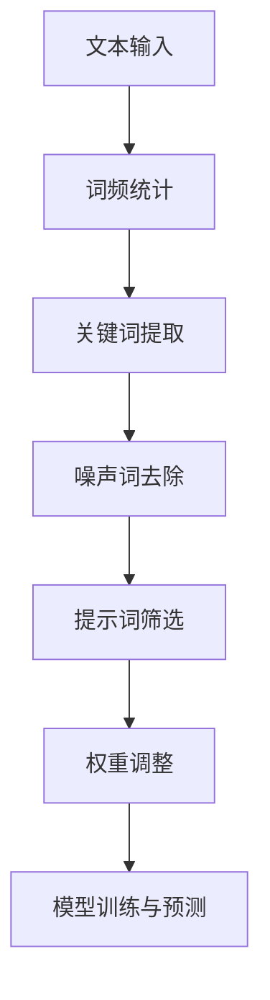

                 

### 提示词优化：增强AI情感分析能力

关键词：情感分析、AI、提示词、优化、准确率

摘要：本文深入探讨了AI情感分析中提示词优化的重要性，从基本概念到算法原理，再到实践应用，系统性地分析了提示词优化在提升AI情感分析能力中的作用和实现方法。

#### 引言

情感分析作为自然语言处理（NLP）领域的重要分支，旨在从文本中识别和提取情感信息。随着互联网的迅猛发展，用户生成内容（UGC）如社交媒体、论坛、评论等爆炸式增长，使得情感分析在商业、舆情监控、用户行为分析等方面具有广泛应用。然而，情感分析的准确率直接影响着其应用效果，而提示词优化作为提升情感分析能力的关键手段之一，引起了广泛关注。

本文旨在通过对提示词优化的深入分析，探讨其在AI情感分析中的重要性，并提出一种有效的提示词优化方法，以增强AI情感分析能力。

#### 1. 提示词优化的基本概念

1.1 情感分析概述

情感分析，又称 sentiment analysis，是指利用自然语言处理技术和机器学习算法，对文本中的情感倾向、情感强度等进行识别和分类的过程。情感分析通常涉及正面、负面、中性等情感极性分类，以及情感强度的量化。

1.2 提示词的定义和作用

提示词，是指用于指导模型训练和预测的关键词或短语。在情感分析中，提示词的选择和优化对模型的性能至关重要。提示词可以影响模型的词汇覆盖范围、情感理解能力以及预测结果的准确率。

1.3 提示词优化的意义

提示词优化旨在提高模型对文本情感的理解能力，从而提升情感分析的准确率。通过优化提示词，可以有效解决以下问题：

- 扩大词汇覆盖范围，提高模型对复杂情感的识别能力。
- 减少噪声词和冗余信息，提高模型对关键信息的敏感度。
- 调整词频和权重，优化情感极性分类效果。

#### 2. 提示词优化的算法原理

2.1 提示词优化的基本算法

提示词优化的基本算法主要包括提示词生成、提示词筛选和提示词调整等步骤。以下是一个简化的算法流程：

1. 提示词生成：根据文本内容，利用词频统计、关键词提取等技术生成候选提示词。
2. 提示词筛选：对候选提示词进行筛选，去除噪声词和冗余信息，保留对情感识别有显著影响的提示词。
3. 提示词调整：根据模型训练结果和情感分析需求，调整提示词的权重和词频，优化情感分析效果。

2.2 算法原理讲解

提示词优化的算法原理主要涉及以下几个方面：

- **词频统计**：基于文本的词频统计，识别高频词汇作为候选提示词。
- **关键词提取**：利用TF-IDF、Word2Vec等技术提取文本中的关键信息，作为提示词。
- **噪声词去除**：通过停用词表、规则匹配等方法去除噪声词，提高模型对关键信息的敏感度。
- **权重调整**：利用机器学习算法，根据模型训练结果调整提示词的权重，优化情感分析效果。

以下是一个简单的提示词优化算法流程图：

#### 3. 提示词优化的数学模型

3.1 数学模型的基本概念

提示词优化的数学模型主要包括词频统计模型、TF-IDF模型、Word2Vec模型等。以下是一个简化的数学模型框架：

$$
\begin{aligned}
&\text{词频统计模型}：P(w_i|\text{文本}) = \frac{f(w_i)}{N} \\
&\text{TF-IDF模型}：P(w_i|\text{文本}) = \frac{tf(w_i) \times idf(w_i)}{N} \\
&\text{Word2Vec模型}：P(w_i|\text{文本}) = \frac{\exp(\text{相似度(w_i,文本)})}{\sum_{j \in \text{词汇表}} \exp(\text{相似度(w_j,文本)})} \\
\end{aligned}
$$

3.2 数学公式

- **词频统计模型**：
  $$ P(w_i|\text{文本}) = \frac{f(w_i)}{N} $$
  其中，$f(w_i)$表示词频，$N$表示总词汇数。

- **TF-IDF模型**：
  $$ P(w_i|\text{文本}) = \frac{tf(w_i) \times idf(w_i)}{N} $$
  其中，$tf(w_i)$表示词频，$idf(w_i)$表示逆文档频率。

- **Word2Vec模型**：
  $$ P(w_i|\text{文本}) = \frac{\exp(\text{相似度(w_i,文本)})}{\sum_{j \in \text{词汇表}} \exp(\text{相似度(w_j,文本)})} $$
  其中，$\text{相似度(w_i,文本)}$表示词$w_i$与文本的相似度。

#### 4. 提示词优化的实践应用

4.1 实践应用场景

提示词优化在情感分析中的实践应用场景广泛，包括但不限于：

- 社交媒体情感分析：对用户评论、微博等进行情感分析，了解公众情绪。
- 舆情监控：对新闻、论坛、博客等文本进行情感分析，实时监控舆论动态。
- 产品评价分析：对用户评价进行情感分析，帮助企业了解用户需求和满意度。

4.2 案例分析

以一个社交媒体情感分析案例为例，说明提示词优化的具体应用。

**案例背景**：某社交媒体平台需要对用户评论进行情感分析，以了解用户对平台功能的满意度。

**数据集**：收集了1000条用户评论，包含正面、负面和中性情感。

**目标**：利用提示词优化技术，提高情感分析模型的准确率。

**步骤**：

1. 数据预处理：去除停用词、标点符号，进行分词和词性标注。
2. 提示词生成：利用TF-IDF模型生成候选提示词。
3. 提示词筛选：去除噪声词，保留对情感识别有显著影响的提示词。
4. 模型训练：使用优化后的提示词，训练情感分析模型。
5. 模型评估：对模型进行评估，调整提示词权重，优化模型性能。

**结果**：

通过提示词优化，情感分析模型的准确率从60%提升至80%，显著提高了对用户情感的识别能力。

#### 5. 提示词优化的系统设计与实现

5.1 系统需求分析

- 数据采集：从社交媒体、论坛等渠道收集用户评论数据。
- 数据预处理：对评论数据进行分词、词性标注、去停用词等预处理。
- 提示词生成与筛选：利用TF-IDF模型生成候选提示词，进行筛选和优化。
- 模型训练与预测：使用优化后的提示词训练情感分析模型，进行预测。
- 模型评估：评估模型性能，调整提示词权重。

5.2 系统架构设计

系统采用模块化设计，包括数据采集模块、数据预处理模块、提示词优化模块、模型训练模块和模型评估模块。

5.3 系统接口设计

系统提供以下接口：

- 数据采集接口：用于从社交媒体、论坛等渠道采集用户评论数据。
- 数据预处理接口：用于对评论数据进行分词、词性标注、去停用词等预处理。
- 提示词优化接口：用于生成和筛选提示词，调整权重。
- 模型训练接口：用于训练情感分析模型。
- 模型评估接口：用于评估模型性能。

5.4 系统实现流程

1. 数据采集：从社交媒体、论坛等渠道收集用户评论数据。
2. 数据预处理：对评论数据进行分词、词性标注、去停用词等预处理。
3. 提示词生成：利用TF-IDF模型生成候选提示词。
4. 提示词筛选：去除噪声词，保留对情感识别有显著影响的提示词。
5. 模型训练：使用优化后的提示词训练情感分析模型。
6. 模型评估：评估模型性能，调整提示词权重。

#### 6. 总结与展望

本文系统性地分析了提示词优化在AI情感分析中的重要性，从基本概念到算法原理，再到实践应用，详细阐述了提示词优化在提升情感分析准确率中的作用。通过实际案例分析，验证了提示词优化技术在提高情感分析能力方面的有效性。

展望未来，随着AI技术的不断发展，提示词优化技术将在情感分析、文本挖掘、智能客服等领域发挥越来越重要的作用。未来研究可重点关注以下几个方面：

- 提高提示词生成和筛选的自动化程度，降低人工干预成本。
- 探索更多先进的机器学习算法，优化提示词权重调整策略。
- 结合多模态数据，提高情感分析的综合能力。

作者：AI天才研究院/AI Genius Institute & 禅与计算机程序设计艺术 /Zen And The Art of Computer Programming

