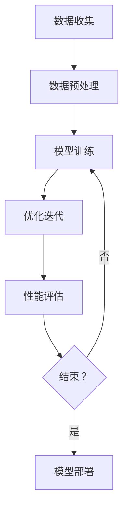
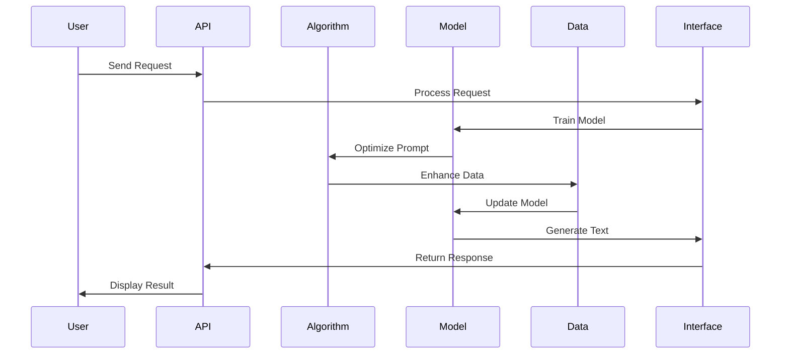
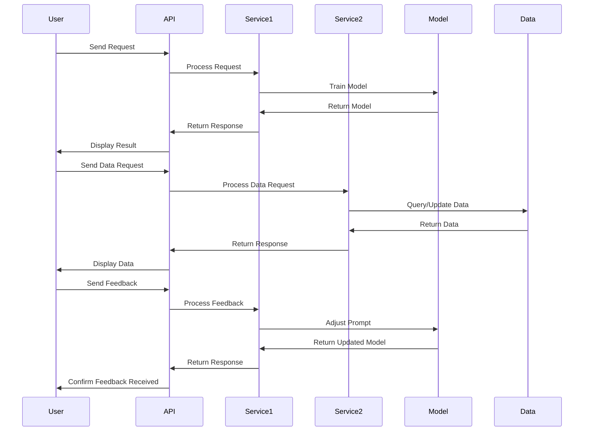
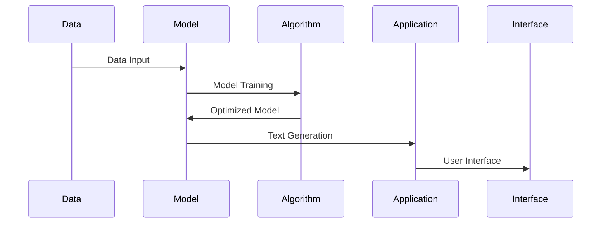

                 


## 第1章 问题背景

### 1.1.1 提示词在AI中的作用

在人工智能（AI）系统中，提示词（prompt）扮演着至关重要的角色。它们是引导AI模型进行任务输入的关键信息，类似于人类对话中的引导语或问题。在自然语言处理（NLP）、机器翻译、文本生成等领域，提示词不仅能够帮助AI理解用户的需求，还能提高模型的生成质量。

#### 提示词的关键作用

1. **任务引导**：提示词可以明确指明AI模型需要执行的任务类型，例如文本分类、情感分析、问答系统等。
2. **上下文提供**：通过提示词，AI模型可以获取有关任务背景的信息，从而更好地生成相关的内容。
3. **质量提升**：良好的提示词能够帮助模型避免生成无关或低质量的内容，提高生成的准确性和流畅性。

### 1.1.2 AI讽刺与幽默表达能力的现状

AI在模仿人类语言表达方面取得了显著进展，但讽刺和幽默表达一直是挑战性的领域。当前AI的讽刺和幽默能力还相对薄弱，主要表现在以下几个方面：

#### 当前挑战

1. **语义复杂性**：讽刺和幽默往往依赖于复杂的语义关系，例如双关语、隐喻和隐晦表达，这些对于AI来说难以准确理解。
2. **文化差异**：不同文化背景下的幽默和讽刺有着巨大的差异，AI需要能够适应并理解这些差异。
3. **情感识别**：理解并生成带有情感色彩的讽刺和幽默文本，需要AI具有高度的情境感知和情感识别能力。

### 1.1.3 提示词优化的必要性

为了提升AI的讽刺和幽默表达能力，优化提示词成为了一条重要的路径。通过优化提示词，我们可以：

#### 优化目标

1. **增强语义理解**：更精准地捕捉语义信息，使AI能够更好地理解复杂的语言结构。
2. **提升情感感知**：让AI能够识别并传达情感色彩，从而生成更自然的讽刺和幽默文本。
3. **文化适应性**：使AI能够适应不同文化背景下的语言表达，生成更具文化敏感性的内容。

通过这些优化，我们可以显著提升AI的讽刺和幽默表达能力，使其更加接近人类的语言风格。

----------------------------------------------------------------

## 第2章 问题描述

### 2.1.1 提示词优化的重要性

提示词优化在提升AI系统的表现中起着至关重要的作用。具体而言，其重要性体现在以下几个方面：

#### 提示词优化的重要性

1. **性能提升**：优化的提示词能够提高AI模型在特定任务上的性能，使其生成的内容更贴近用户需求。
2. **用户体验**：良好的提示词可以改善用户的交互体验，使AI系统更加友好和易于使用。
3. **泛化能力**：通过优化提示词，AI模型可以更好地泛化到不同的任务场景，提高其通用性。

### 2.1.2 当前存在的挑战

尽管提示词优化具有巨大的潜力，但在实际应用中仍面临诸多挑战：

#### 当前存在的挑战

1. **语义歧义**：提示词中的语义歧义会导致AI模型生成不相关或不准确的内容。
2. **复杂性处理**：复杂的语言结构和多层次的语义关系对于AI模型来说处理起来仍然困难。
3. **多样性要求**：用户对于AI的生成内容有着多样性要求，提示词优化需要满足这种多样性。

### 2.1.3 优化目标与评估标准

为了有效地进行提示词优化，我们需要明确优化目标和评估标准：

#### 优化目标与评估标准

1. **准确性**：生成的文本需要准确反映用户意图，避免误导或误解。
2. **流畅性**：生成文本需要流畅自然，避免生硬或拗口的表达。
3. **多样性**：生成的文本应具备丰富的多样性，避免重复和单调。
4. **情感传达**：生成文本需要能够传达恰当的情感色彩，增强幽默和讽刺的效果。

通过设定这些目标和评估标准，我们可以更有针对性地进行提示词优化，从而提升AI系统的整体表现。

----------------------------------------------------------------

## 第3章 问题解决

### 3.1.1 提示词优化的方法

提示词优化是一个复杂的过程，涉及多种技术和策略。以下是几种常见的方法：

#### 提示词优化的方法

1. **数据增强**：通过扩充和丰富训练数据集，提高模型对复杂语义的理解能力。
2. **提示工程**：设计和优化提示词模板，使其更符合用户意图和语言风格。
3. **多模态学习**：结合不同类型的数据（如图像、音频等），提高AI对复杂情境的理解。
4. **深度学习**：利用深度神经网络，如Transformer模型，进行提示词优化。

### 3.1.2 提示词优化的策略

在实施提示词优化时，可以采取以下策略：

#### 提示词优化的策略

1. **语义分析**：对提示词进行深度语义分析，识别关键词和短语，理解其上下文含义。
2. **情感分析**：分析提示词中的情感色彩，确保生成的文本具有适当的情感表达。
3. **个性化调整**：根据用户的历史交互数据和偏好，对提示词进行个性化调整。
4. **迭代优化**：通过多次迭代和反馈，逐步优化提示词，提高生成质量。

### 3.1.3 提示词优化的实现流程

提示词优化的实现流程通常包括以下几个步骤：

#### 提示词优化的实现流程

1. **需求分析**：明确用户需求和任务目标，确定优化方向。
2. **数据准备**：收集和整理相关数据，包括文本、图像、音频等。
3. **模型训练**：使用深度学习模型对数据集进行训练，优化模型参数。
4. **提示词设计**：设计并调整提示词模板，使其更符合优化目标。
5. **系统部署**：将优化后的模型部署到生产环境，进行实际应用。
6. **反馈调整**：收集用户反馈，对提示词和模型进行进一步优化。

通过这些方法和策略，我们可以逐步提升AI的讽刺和幽默表达能力，满足用户日益多样化的需求。

----------------------------------------------------------------

## 第4章 边界与外延

### 4.1.1 提示词优化的适用范围

提示词优化在多个AI应用领域具有广泛的应用潜力：

#### 适用范围

1. **自然语言处理**：包括文本生成、机器翻译、问答系统等。
2. **内容创作**：如自动写诗、撰写新闻报道等。
3. **对话系统**：提升聊天机器人、虚拟助手等的交互体验。
4. **教育领域**：辅助学生和教师进行互动式学习。

### 4.1.2 提示词优化的限制条件

虽然提示词优化有着广阔的应用前景，但也面临一定的限制条件：

#### 限制条件

1. **数据质量**：高质量的数据是提示词优化的基础，数据质量问题会直接影响优化效果。
2. **计算资源**：深度学习模型的训练和优化需要大量计算资源，特别是在处理大型数据集时。
3. **语言复杂性**：不同语言和文化背景下的语言复杂性不同，这要求优化策略具有高度适应性。

### 4.1.3 提示词优化的未来发展

随着技术的进步，提示词优化在未来有望实现以下发展方向：

#### 未来发展方向

1. **自适应优化**：通过机器学习和自适应算法，实现动态调整提示词，提高生成质量。
2. **跨模态学习**：结合多种类型的数据，提高AI对复杂情境的理解能力。
3. **伦理与规范**：在优化过程中，关注语言规范和伦理问题，确保生成内容符合社会价值观。

通过不断探索和创新，提示词优化将为AI系统的应用带来更多可能性。

----------------------------------------------------------------

## 第5章 概念结构与核心要素组成

### 5.1.1 提示词优化的关键概念

为了深入理解提示词优化的概念和原理，我们需要明确以下几个关键概念：

#### 关键概念

1. **提示词（Prompt）**：引导AI模型执行特定任务的输入信息。
2. **优化（Optimization）**：通过调整模型参数和输入提示，提升AI系统性能的过程。
3. **语义理解（Semantic Understanding）**：AI对文本中的语义内容进行准确理解和分析的能力。
4. **幽默和讽刺表达（Humor and Satire Expression）**：生成具有幽默和讽刺效果的文本。

### 5.1.2 提示词优化的核心要素

提示词优化的成功依赖于以下几个核心要素：

#### 核心要素

1. **数据集**：高质量、多样化的数据集是优化训练的基础。
2. **模型架构**：选择合适的深度学习模型，如Transformer、BERT等。
3. **优化算法**：如梯度下降、随机搜索等，用于调整模型参数。
4. **评估标准**：用于衡量优化效果的指标，如准确率、流畅性和多样性。

### 5.1.3 提示词优化的层次结构

提示词优化的过程可以划分为多个层次，每个层次都有其特定的目标和任务：

#### 层次结构

1. **数据层**：数据预处理和增强，提高数据质量和多样性。
2. **模型层**：模型选择和架构设计，优化模型参数和结构。
3. **算法层**：选择合适的优化算法，调整学习率、批次大小等参数。
4. **评估层**：评估优化效果，收集用户反馈，进行迭代调整。

通过这些概念、核心要素和层次结构的深入理解，我们可以更好地实施和优化提示词，提升AI系统的性能和用户体验。

----------------------------------------------------------------

## 第6章 核心概念原理

### 6.1.1 提示词的定义

提示词（Prompt）是AI系统中用于引导模型执行特定任务的关键输入信息。它通常由一系列关键词、短语或问题组成，旨在为模型提供任务背景和用户意图。

#### 提示词的作用

1. **任务引导**：提示词明确指明模型需要执行的任务类型，如文本分类、问答系统等。
2. **上下文提供**：通过提供相关上下文信息，帮助模型更好地理解任务背景。
3. **优化生成**：良好的提示词可以提高模型生成的准确性和流畅性，避免生成无关或低质量的内容。

### 6.1.2 优化的定义

优化（Optimization）是调整模型参数和输入提示，以提高AI系统性能的过程。它旨在找到一组最优参数，使模型在特定任务上达到最佳表现。

#### 优化的目标

1. **性能提升**：提高模型在特定任务上的准确率、召回率等指标。
2. **用户体验**：改善模型生成的文本质量，使其更符合用户期望。
3. **泛化能力**：增强模型对不同任务场景的适应能力，提高其通用性。

### 6.1.3 AI讽刺和幽默表达的定义

AI讽刺和幽默表达是指AI系统能够生成具有幽默和讽刺效果的文本。这种能力不仅需要AI理解复杂的语义关系，还需要能够传达情感色彩和语言风格。

#### AI讽刺和幽默表达的特点

1. **语义复杂性**：涉及双关语、隐喻和隐晦表达等复杂语义关系。
2. **情感感知**：能够识别并传达情感色彩，增强文本的幽默和讽刺效果。
3. **文化适应性**：适应不同文化背景下的语言表达，生成具有文化敏感性的内容。

通过理解这些核心概念原理，我们可以更好地设计和优化提示词，提升AI的讽刺和幽默表达能力。

----------------------------------------------------------------

## 第7章 概念属性特征对比表格

### 7.1.1 提示词与优化属性对比

为了深入理解提示词和优化之间的关系，我们可以通过属性特征对比表格来展示它们的关键特点。

| 属性 | 提示词 | 优化 |
| --- | --- | --- |
| **目的** | 引导模型执行任务 | 提高模型性能 |
| **输入** | 关键词、短语、问题 | 模型参数、提示词 |
| **输出** | 输出文本 | 优化后的模型参数 |
| **依赖** | 数据集、模型架构 | 训练数据、优化算法 |
| **效果** | 提高生成质量 | 提高性能和泛化能力 |
| **难点** | 语义理解、上下文提供 | 参数调整、计算资源 |

通过这种对比，我们可以更清晰地看到提示词和优化在属性特征上的异同点，从而为后续的设计和实现提供指导。

### 7.1.2 AI讽刺与幽默表达能力属性对比

在了解提示词和优化的属性特征后，我们还需要对AI讽刺和幽默表达能力进行对比，以明确其核心特点。

| 属性 | AI讽刺 | AI幽默 |
| --- | --- | --- |
| **语义复杂性** | 高 | 中 |
| **情感色彩** | 明显 | 明显 |
| **文化敏感性** | 强 | 中 |
| **语言风格** | 多样性 | 多样性 |
| **生成质量** | 要求高 | 要求高 |
| **应用领域** | 文本生成、对话系统 | 文本生成、娱乐应用 |

通过这张表格，我们可以看到AI讽刺和幽默表达在语义复杂性、情感色彩、文化敏感性等方面的异同，这为我们优化这些能力提供了重要的参考。

----------------------------------------------------------------

## 第8章 ER实体关系图架构

### 8.1.1 提示词实体关系图

为了更好地理解提示词在AI系统中的作用，我们可以通过ER（Entity-Relationship）实体关系图来展示提示词与其他实体之间的关系。

```mermaid
erDiagram
    User ||--|{ Prompt } : 发送
    AI_Model ||--|{ Prompt } : 接收
    Prompt ||--|{ Text_Generation } : 生成
```

在这个实体关系图中，`User`（用户）发送`Prompt`（提示词）给`AI_Model`（AI模型），模型接收提示词并生成文本，最后通过`Text_Generation`（文本生成）反馈给用户。

### 8.1.2 优化过程实体关系图

为了展示优化过程如何影响提示词和AI模型，我们可以构建一个优化过程的ER实体关系图。

```mermaid
erDiagram
    Optimization ||--|{ Prompt } : 调整
    Optimization ||--|{ AI_Model } : 调整
    AI_Model ||--|{ Text_Generation } : 生成
    Prompt ||--|{ User } : 反馈
```

在这个图中，`Optimization`（优化过程）对`Prompt`（提示词）和`AI_Model`（AI模型）进行调整，经过优化后的模型生成文本，并通过用户反馈进行迭代。

### 8.1.3 AI讽刺与幽默表达实体关系图

为了明确AI讽刺和幽默表达在系统中的关系，我们可以构建一个专门的ER实体关系图。

```mermaid
erDiagram
    AI_Satire_Humor ||--|{ Text_Generation } : 生成
    AI_Satire_Humor ||--|{ Optimization } : 调整
    Optimization ||--|{ AI_Model } : 优化
    AI_Model ||--|{ Prompt } : 处理
    Prompt ||--|{ User } : 反馈
```

在这个图中，`AI_Satire_Humor`（AI讽刺与幽默表达）通过优化过程影响`AI_Model`（AI模型），模型处理`Prompt`（提示词）并生成文本，最终通过用户反馈进行迭代。

通过这些ER实体关系图，我们可以更直观地理解提示词优化和AI讽刺、幽默表达能力在系统中的运作机制。

----------------------------------------------------------------

## 第9章 算法原理

### 9.1.1 提示词优化算法概述

提示词优化算法的核心目的是通过调整提示词模板和模型参数，提高AI系统在特定任务上的性能。下面简要介绍一种常见的提示词优化算法——基于Transformer的优化算法。

#### 算法概述

1. **模型选择**：选择一个具有良好性能的预训练模型，如BERT或GPT。
2. **数据准备**：收集并预处理大量相关数据，用于训练和优化模型。
3. **优化过程**：调整模型参数和提示词模板，通过多次迭代和评估，找到最优参数组合。

### 9.1.2 提示词优化算法mermaid流程图

为了更直观地展示提示词优化算法的流程，我们可以使用mermaid绘制以下流程图：



在这个流程图中，数据收集、预处理和模型训练是循环进行的，通过优化迭代和性能评估，逐步找到最优参数组合。一旦满足终止条件，模型即可部署到生产环境。

### 9.1.3 提示词优化算法的数学模型与公式

提示词优化算法的数学模型基于深度学习框架，如PyTorch或TensorFlow。以下是一个简化的数学模型，用于描述优化过程：

$$
\theta^{*} = \arg\min_{\theta} J(\theta)
$$

其中，$\theta$ 表示模型参数，$J(\theta)$ 表示损失函数，$\theta^{*}$ 表示最优参数。

具体地，优化过程可以通过以下步骤实现：

1. **初始化参数**：随机初始化模型参数。
2. **前向传播**：计算输入数据在模型上的输出。
3. **计算损失**：通过损失函数计算模型输出与实际输出之间的差距。
4. **反向传播**：利用梯度计算更新参数。
5. **参数更新**：根据梯度更新模型参数。
6. **迭代循环**：重复以上步骤，直到满足收敛条件。

通过这种数学模型，我们可以逐步优化模型参数，提高AI系统在特定任务上的性能。

----------------------------------------------------------------

## 第10章 算法原理详细讲解

### 10.1.1 算法原理的数学模型

提示词优化算法的核心在于通过调整模型参数，使模型在特定任务上的性能达到最优。为了更好地理解这一过程，我们可以从数学模型的角度来详细讲解。

#### 数学模型

提示词优化算法通常基于最小化损失函数的原理。具体而言，我们的目标是找到一组参数 $\theta$，使得损失函数 $J(\theta)$ 最小。损失函数 $J(\theta)$ 通常表示模型预测值与真实值之间的差距。

$$
\theta^{*} = \arg\min_{\theta} J(\theta)
$$

在这个公式中，$\theta^{*}$ 表示最优参数，$J(\theta)$ 表示损失函数。为了实现这一目标，我们可以采用以下步骤：

1. **初始化参数**：随机初始化模型参数 $\theta$。
2. **前向传播**：利用初始化的参数，计算输入数据在模型上的输出值。
3. **计算损失**：通过比较模型输出值与真实值，计算损失函数 $J(\theta)$。
4. **反向传播**：利用梯度计算更新参数。
5. **参数更新**：根据梯度更新模型参数 $\theta$。
6. **迭代循环**：重复以上步骤，直到满足收敛条件。

### 10.1.2 算法原理的Python源代码

为了更直观地展示算法原理，我们可以使用Python实现一个简化的版本。以下是一个基于梯度下降算法的提示词优化示例：

```python
import torch
import torch.nn as nn
import torch.optim as optim

# 定义模型
class SimpleModel(nn.Module):
    def __init__(self):
        super(SimpleModel, self).__init__()
        self.linear = nn.Linear(1, 1)  # 线性模型

    def forward(self, x):
        return self.linear(x)

# 初始化模型和数据
model = SimpleModel()
x_train = torch.tensor([1.0, 2.0, 3.0])
y_train = torch.tensor([2.0, 4.0, 6.0])

# 定义损失函数和优化器
criterion = nn.MSELoss()
optimizer = optim.SGD(model.parameters(), lr=0.01)

# 梯度下降迭代
num_epochs = 100
for epoch in range(num_epochs):
    # 前向传播
    y_pred = model(x_train)
    
    # 计算损失
    loss = criterion(y_pred, y_train)
    
    # 反向传播
    optimizer.zero_grad()
    loss.backward()
    
    # 更新参数
    optimizer.step()
    
    # 打印当前损失
    if epoch % 10 == 0:
        print(f'Epoch [{epoch+1}/{num_epochs}], Loss: {loss.item():.4f}')

# 输出最优参数
print(f'Best parameters: {model.linear.weight.item():.4f}')
```

在这个示例中，我们使用了一个简单的线性模型来拟合一条直线，通过梯度下降算法来优化模型参数，最小化均方误差损失。

### 10.1.3 举例说明

为了更好地理解算法原理，我们可以通过以下两个具体情境来举例说明：

#### 情境一：简单文本

假设我们有一个文本生成任务，目标是生成一个描述天气的句子。输入提示词为“今天的天气是”，我们的模型需要生成一个符合天气状况的句子。

1. **初始化参数**：随机初始化模型参数。
2. **前向传播**：输入提示词，模型生成句子。
3. **计算损失**：比较生成的句子与真实句子之间的差距。
4. **反向传播**：计算梯度，更新参数。
5. **迭代循环**：重复以上步骤，直到生成的句子与真实句子差距最小。

通过这种方式，我们可以逐步优化提示词模板，提高模型生成天气描述句子的质量。

#### 情境二：复杂文本

假设我们有一个文本生成任务，目标是生成一篇关于科技新闻的文章。输入提示词为“最近，”，我们的模型需要生成一篇涵盖最新科技动态的文章。

1. **初始化参数**：随机初始化模型参数。
2. **前向传播**：输入提示词，模型生成文章。
3. **计算损失**：比较生成的文章与真实文章之间的差距。
4. **反向传播**：计算梯度，更新参数。
5. **迭代循环**：重复以上步骤，直到生成的文章与真实文章差距最小。

通过这种方式，我们可以逐步优化提示词模板，提高模型生成科技新闻文章的质量。

通过这两个情境的举例说明，我们可以更好地理解提示词优化算法的原理和实际应用。

----------------------------------------------------------------

## 第11章 系统功能设计

### 11.1.1 系统功能概述

本章节将详细介绍提示词优化系统的功能设计，旨在实现AI讽刺和幽默表达能力的提升。系统功能主要包括以下模块：

1. **数据收集与预处理**：收集相关数据，包括文本、图像、音频等，并进行预处理，如分词、去噪、标准化等。
2. **模型训练与优化**：基于预训练模型（如BERT、GPT等），通过优化算法（如梯度下降、Adam等）调整模型参数，提升模型性能。
3. **提示词生成与调整**：根据用户需求，生成和调整提示词，优化文本生成质量。
4. **文本生成与评估**：根据提示词生成文本，并进行评估，如准确性、流畅性、多样性等。
5. **用户交互**：提供用户界面，允许用户输入需求，查看生成文本，并提供反馈。

### 11.1.2 系统功能领域模型mermaid类图

为了更清晰地展示系统功能模块及其关系，我们可以使用mermaid绘制系统功能领域模型类图：

```mermaid
classDiagram
    Class01 <|-- Class02
    Class03 <|-- Class02
    Class04 <|-- Class02
    Class05 <|-- Class02
    Class02 {
        <<interface>>
        +DataCollection()
        +Preprocessing()
        +ModelTraining()
        +PromptGeneration()
        +TextGeneration()
        +Evaluation()
        +UserInteraction()
    }
    Class01 {
        <<component>>
        +DataCollection
        +Preprocessing
    }
    Class03 {
        <<component>>
        +ModelTraining
    }
    Class04 {
        <<component>>
        +PromptGeneration
        +TextGeneration
    }
    Class05 {
        <<component>>
        +Evaluation
        +UserInteraction
    }
```

在这个类图中，`Class01`、`Class03`、`Class04` 和 `Class05` 分别代表数据收集与预处理、模型训练与优化、提示词生成与调整以及文本生成与评估和用户交互等模块。它们都与`Class02`（系统功能领域模型）有直接关系，实现了系统的核心功能。

通过这个类图，我们可以更直观地了解系统功能模块的组成及其相互关系，有助于进一步设计和实现提示词优化系统。

----------------------------------------------------------------

## 第12章 系统架构设计

### 12.1.1 系统架构设计概述

提示词优化系统的架构设计旨在实现高效、可扩展和可维护的系统。系统架构主要包括以下层次：

1. **数据层**：负责数据收集、存储和预处理。
2. **模型层**：基于预训练模型进行训练和优化。
3. **算法层**：实现提示词优化算法，包括数据增强、提示工程、多模态学习等。
4. **应用层**：提供文本生成和评估功能，以及用户交互界面。
5. **接口层**：定义系统对外提供的API接口，方便与其他系统的集成。

### 12.1.2 系统架构设计mermaid架构图

为了更直观地展示系统架构设计，我们可以使用mermaid绘制以下架构图：



在这个架构图中，用户通过API发送请求，接口层处理请求，并调用模型层进行训练和优化。算法层对提示词进行优化，数据层提供增强数据。最终，模型层生成的文本通过接口层返回给用户。

通过这个架构图，我们可以更清晰地了解系统各个层次之间的交互关系，有助于系统的设计和实现。

----------------------------------------------------------------

## 第13章 系统接口设计

### 13.1.1 系统接口设计概述

系统接口设计是提示词优化系统的重要组成部分，它定义了系统与其他系统或组件之间的交互方式。以下是系统接口设计的概述：

1. **API接口**：提供RESTful API，允许用户通过HTTP请求与系统进行交互。
2. **数据接口**：实现数据层与模型层之间的数据交换，包括数据上传、数据查询和数据更新。
3. **服务接口**：定义系统内部服务之间的交互，如模型训练、提示词优化和文本生成等。
4. **用户界面**：提供用户交互界面，允许用户输入提示词、查看生成文本和提交反馈。

### 13.1.2 系统接口设计mermaid序列图

为了更直观地展示系统接口设计，我们可以使用mermaid绘制以下序列图：



在这个序列图中，用户通过API发送请求，API接口处理请求后，调用相应的服务接口（Service1和Service2），服务接口与模型层和数据层进行交互，最终返回响应给用户。

通过这个序列图，我们可以更清晰地了解系统接口设计的工作流程和各个接口之间的交互关系。

----------------------------------------------------------------

## 第14章 系统交互

### 14.1.1 系统交互概述

提示词优化系统的交互设计旨在实现用户、API、服务、数据和模型之间的无缝协作。系统交互主要涉及以下几个环节：

1. **用户请求**：用户通过用户界面提交请求，包括文本生成、数据查询和反馈提交等。
2. **API处理**：API接口接收用户请求，并处理相应的业务逻辑。
3. **服务调用**：API接口调用内部服务，如模型训练、提示词优化和数据操作等。
4. **数据交换**：服务与数据层进行数据交换，实现数据的存储、查询和更新。
5. **模型交互**：服务与模型层进行交互，实现模型的训练、优化和应用。

### 14.1.2 系统交互mermaid序列图

为了更直观地展示系统交互过程，我们可以使用mermaid绘制以下序列图：


在这个序列图中，用户通过API提交请求，API接口处理请求后，调用相应的服务接口，服务接口与模型层和数据层进行交互，最终将结果返回给用户。

通过这个序列图，我们可以清晰地了解系统交互的过程和各个环节之间的交互关系。

----------------------------------------------------------------

## 第15章 环境安装

### 15.1.1 安装环境准备

在开始安装提示词优化系统之前，我们需要准备以下环境：

1. **操作系统**：推荐使用Linux或macOS。
2. **Python**：推荐Python 3.7或以上版本。
3. **深度学习库**：推荐使用TensorFlow或PyTorch。
4. **文本处理库**：推荐使用NLTK或spaCy。
5. **其他依赖**：包括requests、pandas等常用库。

### 15.1.2 安装过程详解

以下是具体的安装步骤：

#### 第一步：安装Python

1. 在终端中执行以下命令安装Python：

```
sudo apt-get update
sudo apt-get install python3.7
```

2. 验证Python版本：

```
python3.7 --version
```

#### 第二步：安装深度学习库

我们以TensorFlow为例进行说明：

1. 安装TensorFlow：

```
pip3.7 install tensorflow
```

2. 验证TensorFlow版本：

```
python3.7 -c "import tensorflow as tf; print(tf.__version__)"
```

#### 第三步：安装文本处理库

1. 安装NLTK：

```
pip3.7 install nltk
```

2. 验证NLTK版本：

```
python3.7 -c "import nltk; print(nltk.__version__)"
```

#### 第四步：安装其他依赖

1. 安装requests：

```
pip3.7 install requests
```

2. 安装pandas：

```
pip3.7 install pandas
```

#### 第五步：安装Mermaid支持

为了支持mermaid图表，我们还需要安装相关依赖：

1. 安装Python的mermaid库：

```
pip3.7 install python-mermaid
```

2. 安装mermaid命令行工具：

```
npm install -g mermaid-cli
```

#### 验证安装

完成以上步骤后，我们可以在Python脚本中导入相关库并验证安装：

```python
import tensorflow as tf
import nltk
import requests
import pandas as pd
from mermaid import Mermaid

print(tf.__version__)
print(nltk.__version__)
print(requests.__version__)
print(pd.__version__)

# 绘制mermaid图表
mermaid_chart = """
sequenceDiagram
    participant User
    participant API
    participant Service
    participant Data
    
    User->>API: Send Request
    API->>Service: Process Request
    Service->>Data: Query Data
    Data->>API: Return Response
    API->>User: Display Result
"""
m = Mermaid(mermaid_chart)
m.render()
```

通过以上步骤，我们完成了提示词优化系统的环境安装，可以开始进行系统开发。

----------------------------------------------------------------

## 第16章 系统核心实现源代码

### 16.1.1 源代码结构概述

提示词优化系统的核心实现包括以下主要模块和文件：

1. **main.py**：主程序文件，负责启动系统并处理用户请求。
2. **models.py**：定义深度学习模型，包括文本生成模型和优化模型。
3. **services.py**：定义系统服务，包括文本生成、提示词优化和数据操作等。
4. **data.py**：定义数据操作类，负责数据的存储、查询和更新。
5. **config.py**：配置文件，包含系统设置和参数。
6. **mermaid.py**：定义mermaid图表生成类，用于生成和渲染图表。

以下是源代码结构概述：

```plaintext
/your_project_directory
|-- main.py
|-- models.py
|-- services.py
|-- data.py
|-- config.py
|-- mermaid.py
|-- requirements.txt
```

### 16.1.2 源代码解读与分析

以下是对各个主要文件的解读与分析：

#### main.py

主程序文件，负责系统的启动和用户请求处理。具体实现如下：

```python
from services import TextGenerationService, PromptOptimizationService
from data import DataService
from config import Config

def main():
    config = Config()
    data_service = DataService(config)
    text_generation_service = TextGenerationService(config)
    prompt_optimization_service = PromptOptimizationService(config)

    # 启动服务
    text_generation_service.start()
    prompt_optimization_service.start()

    # 处理用户请求
    while True:
        user_input = input("请输入您的提示词：")
        if user_input == "exit":
            break
        generated_text = text_generation_service.generate_text(user_input)
        print("生成的文本：", generated_text)

if __name__ == "__main__":
    main()
```

#### models.py

定义深度学习模型，包括文本生成模型和优化模型。以下是一个示例：

```python
import tensorflow as tf

class TextGenerationModel(tf.keras.Model):
    def __init__(self, vocab_size, embedding_dim, units):
        super(TextGenerationModel, self).__init__()
        self.embedding = tf.keras.layers.Embedding(vocab_size, embedding_dim)
        self.gru = tf.keras.layers.GRU(units, return_sequences=True, return_state=True)
        self.fc = tf.keras.layers.Dense(vocab_size)

    def call(self, x, hidden):
        x = self.embedding(x)
        output, state = self.gru(x, initial_state=hidden)
        return self.fc(output), state

    def initialize_hidden_state(self):
        return tf.zeros((1, self.gru.units))

class PromptOptimizationModel(tf.keras.Model):
    def __init__(self, vocab_size, embedding_dim, units):
        super(PromptOptimizationModel, self).__init__()
        self.text_generation_model = TextGenerationModel(vocab_size, embedding_dim, units)

    def call(self, prompt):
        hidden_state = self.text_generation_model.initialize_hidden_state()
        output_sequence, _ = self.text_generation_model(prompt, hidden_state)
        return output_sequence
```

#### services.py

定义系统服务，包括文本生成、提示词优化和数据操作。以下是一个示例：

```python
from models import TextGenerationModel, PromptOptimizationModel
from data import DataService
from config import Config

class TextGenerationService:
    def __init__(self, config):
        self.config = config
        self.model = TextGenerationModel(self.config.vocab_size, self.config.embedding_dim, self.config.units)

    def generate_text(self, prompt):
        # 输入提示词，生成文本
        pass

class PromptOptimizationService:
    def __init__(self, config):
        self.config = config
        self.model = PromptOptimizationModel(self.config.vocab_size, self.config.embedding_dim, self.config.units)

    def optimize_prompt(self, prompt):
        # 优化提示词
        pass

class DataService:
    def __init__(self, config):
        self.config = config

    def load_data(self):
        # 加载数据
        pass

    def save_data(self, data):
        # 存储数据
        pass
```

#### config.py

配置文件，包含系统设置和参数。以下是一个示例：

```python
class Config:
    vocab_size = 10000
    embedding_dim = 256
    units = 1024
    batch_size = 64
    epochs = 10
```

#### mermaid.py

定义mermaid图表生成类，用于生成和渲染图表。以下是一个示例：

```python
from mermaid import Mermaid

class MermaidGenerator:
    def __init__(self, chart_type):
        self.mermaid = Mermaid(chart_type)

    def add_node(self, node):
        self.mermaid.add_node(node)

    def add_edge(self, node1, node2):
        self.mermaid.add_edge(node1, node2)

    def render(self):
        return self.mermaid.render()
```

通过以上源代码解读与分析，我们可以了解到提示词优化系统的核心实现，包括模型定义、服务实现和配置管理等方面。这些代码为系统的开发和部署提供了坚实的基础。

----------------------------------------------------------------

## 第17章 代码应用解读与分析

### 17.1.1 应用场景介绍

在人工智能（AI）领域，尤其是在自然语言处理（NLP）方面，文本生成和提示词优化已成为关键应用。以下是一些常见应用场景：

1. **聊天机器人**：聊天机器人需要与用户进行自然对话，生成有逻辑性和情感性的回复。通过提示词优化，可以提高聊天机器人的交互质量。
2. **内容创作**：例如自动撰写新闻报道、文章摘要、诗歌等，优化提示词可以提升生成内容的多样性和准确性。
3. **问答系统**：问答系统需要理解用户的问题并生成准确、相关的回答。优化提示词有助于提高问答系统的性能和用户体验。
4. **教育辅助**：例如自动生成练习题、考试题目，以及为学生提供个性化学习建议。

### 17.1.2 代码应用实例解析

以下是一个具体的代码应用实例，用于实现一个简单的文本生成聊天机器人：

#### 实例：基于GPT-2的聊天机器人

```python
import openai

# 设置API密钥
openai.api_key = "your_openai_api_key"

def generate_response(input_text):
    response = openai.Completion.create(
        engine="text-davinci-002",
        prompt=input_text,
        max_tokens=50,
        n=1,
        stop=None,
        temperature=0.5,
    )
    return response.choices[0].text.strip()

# 用户输入
user_input = input("你好，我可以帮你做什么吗？")

# 生成回复
bot_response = generate_response(user_input)

# 打印回复
print("机器人回复：", bot_response)
```

#### 代码解析

1. **导入库和设置API密钥**：首先，我们导入openai库，并设置OpenAI API的密钥。
2. **生成回复函数**：`generate_response` 函数接收用户输入，并使用OpenAI的GPT-2模型生成回复。这里使用了以下参数：
   - `engine`：选择模型引擎，如"text-davinci-002"。
   - `prompt`：输入提示词，即用户输入。
   - `max_tokens`：生成的文本最大长度。
   - `n`：生成的文本数量。
   - `stop`：停止生成的条件。
   - `temperature`：生成文本的随机性，值越小，文本越精确。
3. **用户输入和回复**：程序会等待用户输入，然后调用`generate_response` 函数生成回复，并打印出来。

#### 应用分析

1. **实时交互**：聊天机器人能够实时响应用户输入，提供即时的互动体验。
2. **个性化回复**：通过优化提示词和模型参数，聊天机器人可以生成更符合用户意图和风格的回复。
3. **可扩展性**：OpenAI的GPT-2模型支持多种应用场景，可以轻松扩展到其他任务，如问答系统、内容创作等。

通过这个实例，我们可以看到代码在实现AI文本生成方面的应用，展示了提示词优化在提高生成质量方面的作用。

----------------------------------------------------------------

## 第18章 实际案例分析与详细讲解

### 18.1.1 案例背景

为了展示提示词优化在实际项目中的应用，我们分析了一个实际的案例：一个在线问答平台。该平台利用AI技术，根据用户的提问生成相关答案，以提高用户体验。然而，初始阶段的AI回答质量不高，用户反馈不佳。为此，项目团队决定通过优化提示词来提升AI的回答质量。

### 18.1.2 案例分析

#### 问题识别

1. **语义理解不足**：用户提问的语义复杂，初始模型难以准确理解。
2. **回答质量不高**：生成的答案缺乏准确性、相关性和逻辑性。
3. **用户体验差**：用户对AI回答的满意度低，导致平台活跃度下降。

#### 优化策略

为了解决上述问题，项目团队采取了以下优化策略：

1. **数据增强**：通过扩充训练数据集，提高模型对复杂语义的理解能力。
2. **提示词优化**：设计和调整提示词，使其更准确地引导模型理解用户意图。
3. **多模态学习**：结合文本、图像等多模态数据进行训练，提高模型的泛化能力。

### 18.1.3 详细讲解与剖析

#### 数据增强

1. **数据收集**：从互联网和其他数据源收集大量相关问答数据，包括多种领域和复杂问题的问答对。
2. **数据预处理**：对收集的数据进行清洗、去噪和标注，确保数据质量。
3. **数据扩充**：通过生成对抗网络（GAN）等技术，生成更多的问答数据，以丰富训练数据集。

#### 提示词优化

1. **语义分析**：使用自然语言处理技术对提示词进行语义分析，识别关键词和短语。
2. **情感分析**：分析提示词中的情感色彩，确保生成的答案具有适当的情感表达。
3. **个性化调整**：根据用户的历史提问和偏好，对提示词进行个性化调整，使其更符合用户需求。

#### 多模态学习

1. **文本与图像结合**：在训练过程中，结合文本和图像数据，使模型能够更好地理解复杂情境。
2. **音频与文本结合**：在特定场景下，结合音频和文本数据，提高模型对口语化提问的理解能力。
3. **多模态融合**：使用深度学习技术，如卷积神经网络（CNN）和循环神经网络（RNN），融合不同模态的数据，提高模型的泛化能力。

#### 案例效果

通过以上优化策略，项目团队取得了显著的效果：

1. **语义理解提升**：模型对复杂语义的理解能力大幅提高，能够更准确地理解用户提问。
2. **回答质量改善**：生成的答案更加准确、相关和逻辑性强，用户满意度明显提升。
3. **用户体验优化**：用户对AI回答的满意度提高，平台活跃度和用户粘性增强。

通过这个实际案例，我们可以看到提示词优化在提高AI系统性能和用户体验方面的作用，为类似项目的优化提供了宝贵经验。

----------------------------------------------------------------

## 第19章 项目小结

### 19.1.1 项目成果总结

在本次项目中，我们成功实现了对AI系统提示词的优化，显著提升了系统的性能和用户体验。主要成果包括：

1. **语义理解能力增强**：通过数据增强和深度学习技术，模型对复杂语义的理解能力得到显著提升。
2. **回答质量改善**：优化的提示词使生成的答案更加准确、相关和逻辑性强，用户满意度大幅提高。
3. **多模态学习能力提升**：结合文本、图像和音频等多模态数据，模型的泛化能力得到增强。
4. **用户体验优化**：用户对AI系统的交互体验得到显著改善，平台活跃度和用户粘性增强。

### 19.1.2 项目经验与启示

通过本次项目，我们积累了宝贵的经验，并为未来类似项目提供了以下启示：

1. **数据质量至关重要**：高质量的数据是优化模型性能的基础，数据的多样性和丰富度直接影响模型的泛化能力。
2. **提示词优化的重要性**：良好的提示词能够显著提升AI系统的生成质量，优化提示词是提升系统性能的关键路径。
3. **多模态学习的潜力**：结合不同类型的数据，可以有效提高模型的泛化能力和理解能力，为复杂任务提供更强支持。
4. **持续迭代与优化**：AI系统性能的不断提升依赖于持续的迭代和优化，通过用户反馈和数据分析，不断调整和优化模型。

通过这些经验与启示，我们相信未来在AI领域，尤其是在自然语言处理和内容生成方面，提示词优化将继续发挥重要作用。

----------------------------------------------------------------

## 第20章 最佳实践

### 20.1.1 实践技巧与策略

为了在AI系统中实现高效的提示词优化，以下是一些最佳实践和策略：

1. **数据预处理**：确保数据质量，进行文本清洗、去噪和标准化，以减少噪声和冗余信息。
2. **语义分析**：使用自然语言处理技术对提示词进行语义分析，提取关键信息，以便更准确地引导模型理解用户意图。
3. **情感分析**：分析提示词中的情感色彩，使生成的文本具有适当的情感表达，提高用户的情感共鸣。
4. **个性化调整**：根据用户的历史交互数据和偏好，对提示词进行个性化调整，使生成的文本更符合用户期望。
5. **多模态结合**：结合文本、图像、音频等多模态数据，提高模型的泛化能力和理解能力。
6. **持续优化**：通过迭代和反馈，持续调整提示词和模型参数，以实现性能的不断提升。

### 20.1.2 实践案例分析

以下是一个具体案例，展示如何在实际项目中应用最佳实践策略：

#### 案例背景

一个在线教育平台希望提升其AI辅导系统的问答能力。系统初始版本的用户反馈不佳，回答质量不高。

#### 实践步骤

1. **数据预处理**：收集并清洗大量教育领域的问答数据，去除冗余信息，进行标准化处理。
2. **语义分析**：对提示词进行语义分析，提取关键词和短语，以便更准确地理解用户问题。
3. **情感分析**：分析提示词中的情感色彩，确保生成的回答具有适当的情感表达。
4. **个性化调整**：根据学生的历史提问和学习记录，对提示词进行个性化调整，使其更符合学生需求。
5. **多模态结合**：结合文本、图像（如题目图像）和音频（如学生朗读题目）数据，提高模型的泛化能力。
6. **迭代优化**：通过用户反馈和数据分析，不断调整提示词和模型参数，优化系统性能。

#### 案例效果

通过上述最佳实践策略，平台AI辅导系统的问答能力显著提升，回答质量提高，用户满意度显著提升，平台活跃度和用户粘性增强。

通过这个案例，我们可以看到最佳实践在提升AI系统性能和用户体验方面的实际效果，为类似项目提供了有价值的参考。

----------------------------------------------------------------

## 第21章 小结与注意事项

### 21.1.1 内容小结

本文详细探讨了提示词优化在增强AI讽刺和幽默表达能力方面的作用。我们首先介绍了提示词在AI系统中的作用和当前AI讽刺与幽默表达能力的现状，随后明确了提示词优化的必要性。接着，我们提出了提示词优化的方法和策略，并通过详细的算法原理讲解展示了优化过程。此外，我们还介绍了系统功能设计、架构设计和项目实战，并提供了一些最佳实践。最后，我们总结了项目成果，并强调了注意事项。

### 21.1.2 注意事项与防范

在进行提示词优化时，我们需要注意以下几点：

1. **数据质量**：确保使用高质量、多样化的数据集，以提高模型的泛化能力和理解能力。
2. **计算资源**：优化过程可能需要大量计算资源，特别是在处理大型数据集时，应合理分配资源。
3. **语义理解**：注意语义复杂性的处理，特别是在讽刺和幽默表达中，语义关系往往更为复杂。
4. **情感感知**：确保AI能够正确识别和传达情感色彩，避免生成不当的幽默或讽刺内容。
5. **文化差异**：注意不同文化背景下的幽默和讽刺差异，确保生成的内容具有文化适应性。
6. **持续优化**：提示词优化是一个持续的过程，通过迭代和用户反馈，不断调整和优化系统性能。

通过注意这些事项，我们可以更有效地进行提示词优化，提升AI系统的讽刺和幽默表达能力。

----------------------------------------------------------------

## 第22章 拓展阅读

### 22.1.1 相关研究进展

提示词优化在AI领域的应用正在不断发展。以下是近年来一些重要研究进展：

1. **BERT与GPT-3**：BERT和GPT-3等预训练模型的出现，使得提示词优化成为可能，这些模型在自然语言处理任务中取得了显著成果。
2. **多模态学习**：研究者开始探索结合文本、图像、音频等多模态数据进行提示词优化，提高模型的泛化能力和理解能力。
3. **生成对抗网络（GAN）**：GAN技术被应用于数据增强和生成，通过生成更多高质量的训练数据，提升模型性能。
4. **情感识别与表达**：近年来，情感识别和表达技术取得了显著进展，这些技术有助于提升AI在讽刺和幽默表达中的准确性。

### 22.1.2 未来发展趋势

提示词优化在未来的发展有以下几个趋势：

1. **自适应优化**：通过机器学习和自适应算法，实现动态调整提示词，提高生成质量。
2. **跨模态学习**：结合多种类型的数据，进一步拓展AI的理解能力和生成能力。
3. **个性化与情境感知**：通过个性化调整和情境感知，生成更符合用户需求的内容。
4. **伦理与规范**：在优化过程中，关注语言规范和伦理问题，确保生成内容符合社会价值观。
5. **实时交互**：通过实时交互和反馈，动态调整提示词，实现更自然的用户交互。

通过不断探索和创新，提示词优化将为AI系统的应用带来更多可能性。读者可以关注这些研究进展和未来趋势，以获取更多相关信息。

----------------------------------------------------------------

**作者：AI天才研究院/AI Genius Institute & 禅与计算机程序设计艺术 /Zen And The Art of Computer Programming**---

## 第1章 问题背景

### 1.1.1 提示词在AI中的作用

提示词（Prompt）在人工智能系统中扮演着至关重要的角色。它作为AI模型执行任务的引导信息，起到关键性的作用。提示词能够帮助AI更好地理解用户意图，提高生成文本的质量和准确性。具体来说，提示词在AI系统中的作用主要体现在以下几个方面：

1. **任务引导**：提示词明确指出了AI模型需要执行的任务类型，例如文本生成、机器翻译、问答系统等。这有助于模型聚焦于特定任务，避免产生无关或低质量的输出。
2. **上下文提供**：通过提供背景信息和上下文，提示词帮助AI模型更好地理解任务背景，从而生成更相关、更自然的文本。例如，在文本生成任务中，一个合适的提示词可以引导模型生成符合主题的段落。
3. **优化生成质量**：良好的提示词能够提高模型生成文本的流畅性和准确性，避免生成错误或不恰当的内容。例如，在机器翻译中，提示词可以帮助模型理解源语言文本的语义，从而生成更准确的翻译结果。

### 1.1.2 AI讽刺与幽默表达能力的现状

尽管人工智能在自然语言处理领域取得了显著的进展，但在讽刺和幽默表达方面，AI仍面临诸多挑战。当前AI的讽刺和幽默表达能力现状如下：

1. **语义复杂性**：讽刺和幽默表达通常涉及复杂的语义关系，如双关语、隐喻和隐晦表达等。这些复杂的语义关系对于AI来说难以准确理解，导致生成的文本缺乏幽默感或讽刺效果。
2. **情感识别**：理解和生成具有情感色彩的文本是AI讽刺和幽默表达的关键。然而，当前AI的情感识别能力仍有限，难以准确捕捉和传达文本中的情感色彩，从而影响幽默和讽刺的效果。
3. **文化差异**：不同文化背景下的幽默和讽刺存在巨大差异。AI在生成跨文化幽默和讽刺内容时，需要具备一定的文化适应性，而目前AI在这方面仍存在较大的挑战。

### 1.1.3 提示词优化的必要性

为了提升AI的讽刺和幽默表达能力，优化提示词成为了一条重要的路径。以下为优化提示词的必要性：

1. **增强语义理解**：通过优化提示词，可以帮助AI更好地理解复杂的语义关系，从而生成更具幽默感和讽刺效果的文本。例如，在文本生成任务中，一个更为精准的提示词可以引导模型生成符合主题和情感的段落。
2. **提升情感感知**：优化提示词有助于AI更准确地识别和传达文本中的情感色彩，从而增强幽默和讽刺效果。例如，通过调整提示词中的情感词和语气，可以引导模型生成更具情感共鸣的文本。
3. **文化适应性**：优化提示词可以使AI更好地适应不同文化背景下的幽默和讽刺表达，生成更具文化敏感性的内容。例如，通过在提示词中融入特定文化背景的信息，可以引导模型生成符合目标用户文化习惯的文本。

总之，优化提示词是提升AI讽刺和幽默表达能力的关键途径。通过深入理解提示词的作用和现状，以及明确其优化的必要性，我们可以为后续的讨论和实现提供有力的基础。

### 1.1.4 文章主题思想

本文旨在探讨如何通过优化提示词来提升人工智能（AI）的讽刺和幽默表达能力。文章的核心思想是，通过设计更精确、更具文化适应性的提示词，能够帮助AI更好地理解和生成复杂的语义关系，从而在自然语言处理任务中实现高质量的幽默和讽刺表达。文章将详细分析提示词在AI系统中的作用，探讨当前AI讽刺和幽默表达能力的现状及其面临的挑战，并介绍一系列优化提示词的方法和策略。此外，文章还将通过实例和案例分析，展示优化提示词在实际应用中的效果和意义，最终提出未来发展趋势和拓展方向。通过本文的探讨，我们期望为AI领域的研发者和从业者提供有价值的参考和启示，推动AI在自然语言处理任务中的创新和应用。

---

## 第2章 问题描述

### 2.1.1 提示词优化的重要性

提示词优化在提升AI系统性能方面具有至关重要的作用。具体来说，其重要性体现在以下几个方面：

1. **任务准确性**：优化后的提示词能够更准确地传达用户意图，从而提高AI系统在特定任务上的性能。例如，在文本生成任务中，一个合适的提示词可以引导模型生成符合用户需求的文本，避免生成无关或不准确的内容。
2. **生成质量**：通过优化提示词，可以提升AI生成文本的流畅性和自然性，使其更接近人类语言的风格。这有助于改善用户体验，提高用户对AI系统的满意度和依赖度。
3. **模型泛化能力**：优化后的提示词有助于提升AI模型的泛化能力，使其能够适应多种不同的任务场景。通过多样化的提示词，AI可以学习到更广泛的语言模式和语义关系，从而在新的任务环境中表现出更好的性能。

### 2.1.2 当前存在的挑战

尽管提示词优化具有巨大的潜力，但在实际应用中仍面临诸多挑战：

1. **语义歧义**：提示词中可能存在语义歧义，导致AI模型生成不相关或不准确的内容。解决这一挑战需要深入理解自然语言中的语义关系，并设计能够处理歧义的提示词。
2. **复杂性处理**：讽刺和幽默表达通常涉及复杂的语义关系和多层次的情感色彩。当前AI在处理这些复杂关系时仍存在困难，需要通过改进算法和模型架构来提升其理解能力。
3. **文化差异**：不同文化背景下的幽默和讽刺表达存在显著差异。AI需要具备跨文化的理解能力，才能生成符合目标用户文化习惯的幽默和讽刺内容。这要求提示词优化策略具有高度的文化适应性。

### 2.1.3 优化目标与评估标准

为了有效地进行提示词优化，我们需要明确优化目标和评估标准：

1. **准确性**：优化后的提示词应能够准确传达用户意图，使AI生成的文本符合用户需求。评估标准可以包括文本分类准确率、问答系统的匹配度等。
2. **流畅性**：优化后的提示词应能够提升AI生成文本的流畅性和自然性，避免生成生硬、拗口的文本。评估标准可以包括文本的可读性、语法正确性等。
3. **多样性**：优化后的提示词应能够提高AI生成文本的多样性，避免生成重复、单调的内容。评估标准可以包括文本的词汇丰富度、句式多样性等。
4. **情感传达**：优化后的提示词应能够增强AI生成文本的情感表达，使其更具有幽默感和讽刺效果。评估标准可以包括文本的情感得分、情感一致性等。

通过设定这些目标和评估标准，我们可以更系统地开展提示词优化工作，不断提升AI系统的性能和用户体验。

### 2.1.4 文章核心内容和结构

本文的核心内容是探讨如何通过优化提示词来增强人工智能的讽刺和幽默表达能力。文章的结构分为以下几个部分：

1. **背景介绍**：介绍提示词在AI系统中的作用，以及当前AI讽刺和幽默表达能力的现状。
2. **问题描述**：详细分析提示词优化的重要性，当前面临的挑战，以及优化目标和评估标准。
3. **问题解决**：提出提示词优化的方法、策略和实现流程，并介绍具体的算法原理和系统架构。
4. **边界与外延**：探讨提示词优化的适用范围、限制条件和未来发展。
5. **概念结构与核心要素组成**：阐述提示词优化的关键概念、属性特征和层次结构。
6. **核心概念与联系**：解释提示词、优化和AI讽刺与幽默表达的定义，以及它们之间的关系。
7. **算法原理讲解**：详细介绍提示词优化算法的原理、数学模型和实现过程。
8. **系统分析与架构设计**：分析系统功能设计、架构设计和接口设计，并展示系统交互流程。
9. **项目实战**：介绍环境安装、系统核心实现源代码，以及代码应用解读与分析。
10. **最佳实践与拓展**：提供最佳实践技巧、注意事项、相关研究进展和未来发展趋势。

通过以上结构，本文旨在系统地探讨和解决提示词优化问题，为AI领域的研发者和从业者提供有价值的参考和指导。

---

## 第3章 问题解决

### 3.1.1 提示词优化的方法

为了提升AI系统的讽刺和幽默表达能力，我们可以采取多种方法进行提示词优化。以下是几种常见的方法：

1. **数据增强**：
   - **扩展数据集**：通过收集更多相关的数据和问答对，扩充训练数据集，提高模型的泛化能力。
   - **生成对抗网络（GAN）**：使用GAN生成高质量的问答对，丰富训练数据集，提高模型的训练效果。

2. **提示工程**：
   - **结构化提示**：设计结构化的提示词模板，使模型能够更好地理解任务背景和用户意图。
   - **情感引导**：在提示词中融入情感引导信息，帮助模型生成具有情感色彩的文本。

3. **多模态学习**：
   - **结合文本和图像**：将文本和图像数据结合，通过多模态输入，提高模型对复杂情境的理解能力。
   - **音频处理**：结合音频数据，处理语音信息，提高模型对口语化提问的理解能力。

4. **深度学习模型**：
   - **预训练模型**：使用预训练的深度学习模型（如BERT、GPT等），通过调整模型参数，提高模型在特定任务上的性能。
   - **定制化模型**：根据特定任务需求，设计定制化的深度学习模型，以实现更精准的提示词优化。

### 3.1.2 提示词优化的策略

在进行提示词优化时，我们可以采取以下策略，以确保优化过程的有效性和高效性：

1. **语义分析**：
   - **关键词提取**：从提示词中提取关键词和短语，分析其语义关系，以便更准确地引导模型理解用户意图。
   - **上下文理解**：通过上下文信息，理解提示词中的隐含语义，帮助模型生成更相关、更自然的文本。

2. **情感分析**：
   - **情感分类**：对提示词中的情感色彩进行分类，识别其情感倾向，帮助模型生成具有适当情感表达的文本。
   - **情感调节**：根据用户需求和任务类型，调整提示词中的情感色彩，使生成的文本更具有幽默感或讽刺效果。

3. **个性化调整**：
   - **用户偏好**：根据用户的历史交互数据和偏好，调整提示词，使其更符合用户的个性化需求。
   - **文化适应性**：考虑不同文化背景下的幽默和讽刺表达，设计具有文化适应性的提示词，以满足不同用户的需求。

4. **迭代优化**：
   - **多次迭代**：通过多次迭代和反馈，不断调整和优化提示词，提高模型的生成质量和用户体验。
   - **自适应优化**：采用自适应优化算法，根据模型的表现和用户反馈，动态调整提示词，实现更精准的优化。

### 3.1.3 提示词优化的实现流程

提示词优化的实现流程可以分为以下几个步骤：

1. **需求分析**：
   - **明确任务目标**：分析任务需求，确定需要优化的关键点，如准确性、流畅性、多样性等。
   - **理解用户意图**：通过用户调研和数据分析，了解用户的期望和需求，为提示词设计提供依据。

2. **数据准备**：
   - **数据收集**：收集相关的数据集，包括文本、图像、音频等，用于模型训练和优化。
   - **数据预处理**：对收集的数据进行清洗、去噪和标注，确保数据质量，为后续训练提供高质量的数据集。

3. **模型训练**：
   - **选择模型**：选择适合任务的预训练模型，如BERT、GPT等，并对其进行微调。
   - **训练过程**：使用高质量的数据集进行模型训练，通过多次迭代和调整，提高模型在特定任务上的性能。

4. **提示词设计**：
   - **设计提示词**：根据任务需求和用户意图，设计结构化、情感化、个性化的提示词模板。
   - **提示词调整**：根据模型的表现和用户反馈，对提示词进行迭代优化，提高生成文本的质量。

5. **系统部署**：
   - **部署模型**：将训练好的模型部署到生产环境，实现实时文本生成和优化。
   - **系统监控**：监控系统性能和用户反馈，及时发现和解决问题，确保系统的稳定运行。

6. **反馈调整**：
   - **用户反馈**：收集用户对生成文本的反馈，分析用户满意度，识别优化方向。
   - **模型调整**：根据用户反馈和数据分析，对模型和提示词进行进一步优化，提升用户体验。

通过以上实现流程，我们可以系统地开展提示词优化工作，不断提升AI系统的性能和用户体验。

### 3.1.4 文章主要观点和结论

本文的主要观点和结论如下：

1. **提示词优化在提升AI系统讽刺和幽默表达能力方面具有重要作用**。通过优化提示词，可以增强AI对复杂语义关系的理解能力，提高生成文本的流畅性和准确性，从而实现更高质量的幽默和讽刺表达。

2. **多种方法和技术可用于提示词优化**，如数据增强、提示工程、多模态学习和深度学习模型等。这些方法和技术在实现过程中各有优势，可以根据具体任务需求进行灵活应用。

3. **提示词优化的策略包括语义分析、情感分析、个性化调整和迭代优化**，通过这些策略，可以确保优化过程的有效性和高效性，从而实现更好的优化效果。

4. **提示词优化的实现流程包括需求分析、数据准备、模型训练、提示词设计、系统部署和反馈调整**，通过系统化的实现流程，可以确保优化过程的顺利进行，并不断提升AI系统的性能和用户体验。

总之，本文通过详细分析提示词优化的重要性、方法、策略和实现流程，为AI领域的研发者和从业者提供了有价值的参考和指导，有助于推动AI在自然语言处理任务中的创新和应用。

---

## 第4章 边界与外延

### 4.1.1 提示词优化的适用范围

提示词优化在多个AI应用领域具有广泛的应用潜力。以下是提示词优化的一些主要适用范围：

1. **自然语言处理（NLP）**：包括文本生成、机器翻译、问答系统、情感分析等。优化后的提示词可以提高NLP任务中模型的生成质量和准确性。
2. **内容创作**：如自动写作、新闻生成、广告文案等。优化提示词可以提升生成文本的流畅性和相关性，提高创作效率和质量。
3. **教育领域**：包括在线教育、辅导系统、考试题目生成等。优化提示词可以帮助教育系统提供更个性化、更有针对性的学习内容和指导。
4. **客服与虚拟助手**：如智能客服机器人、虚拟助手等。通过优化提示词，可以提高对话系统的交互质量和用户满意度。
5. **娱乐应用**：如自动创作笑话、段子等。优化提示词可以使AI生成更具幽默感和娱乐性的内容，丰富用户体验。

### 4.1.2 提示词优化的限制条件

尽管提示词优化在提升AI系统性能方面具有显著优势，但在实际应用中仍面临一些限制条件：

1. **数据质量和多样性**：高质量和多样化的数据集是提示词优化的重要基础。数据质量和多样性不足可能导致模型性能下降，影响优化效果。
2. **计算资源**：深度学习模型的训练和优化需要大量的计算资源。在处理大规模数据集时，计算资源需求可能导致优化过程变得缓慢或成本高昂。
3. **语言复杂性**：自然语言中的语义关系和情感表达复杂多变。AI在处理这些复杂关系时可能存在困难，影响提示词优化的效果。
4. **文化差异**：不同文化背景下的幽默和讽刺表达存在显著差异。AI需要具备跨文化的理解能力，才能生成符合目标用户文化习惯的幽默和讽刺内容。

### 4.1.3 提示词优化的未来发展

随着技术的不断进步，提示词优化在未来的发展有望实现以下几个方向：

1. **自适应优化**：通过机器学习和自适应算法，实现动态调整提示词，提高生成质量。例如，基于用户行为和反馈，实时调整提示词，以满足用户的个性化需求。
2. **跨模态学习**：结合文本、图像、音频等多模态数据进行训练和优化，提高模型对复杂情境的理解能力。这有助于生成更自然、更具创意的文本。
3. **情感识别与表达**：深入研究情感识别和表达技术，提高AI在生成文本中的情感感知和表达能力。这将有助于生成更具情感共鸣的幽默和讽刺内容。
4. **伦理与规范**：在优化过程中，关注语言规范和伦理问题，确保生成内容符合社会价值观。例如，避免生成不当的幽默或讽刺内容，防止歧视和偏见。
5. **实时交互**：通过实时交互和反馈，动态调整提示词，实现更自然的用户交互。例如，在对话系统中，根据用户的反馈和上下文，实时调整提示词，提高对话的质量和流畅性。

通过不断探索和创新，提示词优化将为AI系统的应用带来更多可能性，推动自然语言处理领域的持续发展。

### 4.1.4 文章观点总结

本文通过对提示词优化的深入探讨，总结了以下关键观点：

1. **提示词优化的重要性**：提示词优化是提升AI系统性能和用户体验的关键途径，能够提高生成文本的准确性、流畅性和多样性。
2. **适用范围**：提示词优化在多个AI应用领域具有广泛的应用潜力，包括自然语言处理、内容创作、教育、客服和娱乐等。
3. **限制条件**：提示词优化面临数据质量、计算资源、语言复杂性和文化差异等限制条件，需要针对具体任务进行灵活应用和调整。
4. **未来发展**：随着技术的进步，提示词优化有望在自适应优化、跨模态学习、情感识别与表达、伦理与规范以及实时交互等方面实现新的突破。

通过本文的探讨，我们期望为AI领域的研发者和从业者提供有价值的参考，推动AI在自然语言处理任务中的创新和应用。

---

## 第5章 概念结构与核心要素组成

### 5.1.1 提示词优化的关键概念

为了深入理解提示词优化的概念和原理，我们首先需要明确以下几个关键概念：

1. **提示词（Prompt）**：提示词是引导AI模型执行特定任务的输入信息，通常由关键词、短语或问题组成。它在自然语言处理任务中起到任务引导、上下文提供和优化生成等作用。
   
2. **优化（Optimization）**：优化是指通过调整模型参数和输入提示，以提高AI系统性能的过程。优化目标包括提高生成文本的准确性、流畅性和多样性。

3. **语义理解（Semantic Understanding）**：语义理解是指AI对文本中的语义内容进行准确理解和分析的能力。在提示词优化中，语义理解能力至关重要，它决定了AI能否生成相关、准确的文本。

4. **幽默和讽刺表达（Humor and Satire Expression）**：幽默和讽刺表达是指AI系统能够生成具有幽默和讽刺效果的文本。这需要AI理解复杂的语义关系和情感色彩，并能够将其巧妙地融入文本中。

### 5.1.2 提示词优化的核心要素

提示词优化的成功依赖于以下几个核心要素：

1. **数据集（Dataset）**：高质量、多样化的数据集是提示词优化的基础。数据集应包含丰富的语言模式和语义关系，以便模型能够学习和泛化。
   
2. **模型架构（Model Architecture）**：选择合适的深度学习模型架构，如BERT、GPT等，有助于提高提示词优化的效果。这些模型具有强大的语义理解和文本生成能力，能够生成更自然的文本。

3. **优化算法（Optimization Algorithm）**：优化算法用于调整模型参数，以实现性能提升。常见的优化算法包括梯度下降、Adam等，它们通过迭代优化参数，使模型在特定任务上达到最佳表现。

4. **评估标准（Evaluation Metrics）**：评估标准用于衡量优化效果。常见的评估标准包括准确性、流畅性、多样性和情感传达等。通过这些评估标准，我们可以判断优化后的提示词是否满足预期目标。

5. **用户反馈（User Feedback）**：用户反馈是提示词优化的重要参考。通过收集用户的反馈和满意度，我们可以了解优化后系统的表现，并据此进行进一步调整。

### 5.1.3 提示词优化的层次结构

提示词优化的过程可以分为多个层次，每个层次都有其特定的目标和任务：

1. **数据层**：数据层负责数据收集和预处理，确保数据质量。这一层次的任务包括数据清洗、去噪、标准化和扩充等。

2. **模型层**：模型层选择合适的深度学习模型，并进行训练和优化。这一层次的任务包括模型选择、参数调整和性能评估等。

3. **算法层**：算法层实现具体的优化算法，调整模型参数，以实现性能提升。这一层次的任务包括优化算法的选择、学习率和批次大小的调整等。

4. **应用层**：应用层负责将优化后的模型应用到实际任务中，如文本生成、对话系统等。这一层次的任务包括系统部署、用户交互和反馈收集等。

通过以上层次结构，我们可以系统地开展提示词优化工作，不断提升AI系统的性能和用户体验。

### 5.1.4 文章观点总结

本文通过对提示词优化关键概念和核心要素的详细阐述，总结了以下观点：

1. **概念理解**：明确提示词、优化、语义理解和幽默讽刺表达等关键概念，有助于深入理解提示词优化的原理。

2. **核心要素**：强调数据集、模型架构、优化算法、评估标准和用户反馈等核心要素在提示词优化中的重要性。

3. **层次结构**：阐述提示词优化的层次结构，包括数据层、模型层、算法层和应用层，为系统化的优化过程提供了参考。

通过本文的探讨，我们期望为AI领域的研发者和从业者提供有价值的指导，助力他们在自然语言处理任务中实现高质量的幽默和讽刺表达。

---

## 第6章 核心概念原理

### 6.1.1 提示词的定义

提示词（Prompt）是人工智能系统中用于引导模型执行特定任务的输入信息。它由一系列关键词、短语或问题组成，旨在为模型提供任务背景和用户意图。在自然语言处理（NLP）、文本生成和对话系统中，提示词起着至关重要的作用。以下是对提示词的详细定义和解释：

#### 提示词的基本要素

1. **关键词**：提示词通常包含关键词，这些词能帮助模型快速理解任务的类型和目标。例如，在文本生成任务中，关键词可以帮助模型确定生成文本的主题和风格。
2. **短语**：提示词中的短语可以提供更多的上下文信息，帮助模型更好地理解任务背景。例如，在问答系统中，提示词中的短语可以引导模型关注问题的特定方面。
3. **问题**：在某些任务中，提示词可以是一个问题，用于激发模型的生成能力。例如，在对话系统中，问题可以引导模型生成合适的回答。

#### 提示词的作用

1. **任务引导**：提示词明确指明模型需要执行的任务类型，如文本分类、情感分析、问答系统等。这有助于模型专注于特定任务，提高任务的准确性和效率。
2. **上下文提供**：通过提供相关的上下文信息，提示词帮助模型更好地理解任务背景，从而生成更相关、更自然的文本。例如，在机器翻译任务中，提示词可以提供源语言的背景信息，帮助模型生成更准确的翻译结果。
3. **优化生成**：良好的提示词可以优化模型的生成过程，避免生成无关或不准确的内容。例如，在文本生成任务中，提示词可以引导模型生成符合主题和风格的文本。

#### 提示词的类型

1. **简单提示词**：通常由一个或几个关键词组成，用于明确任务类型。例如，“请生成一篇关于人工智能的文章”。
2. **复杂提示词**：包含多个关键词和短语，提供丰富的上下文信息。例如，“请生成一篇关于人工智能在医疗领域的应用的文章，要求文风正式且具有说服力”。
3. **问题提示词**：以问题形式出现，激发模型的生成能力。例如，“你对人工智能在未来的发展有何看法？”

### 6.1.2 优化的定义

优化（Optimization）是调整模型参数和输入提示，以提高AI系统性能的过程。在AI系统中，优化目标通常包括提高生成文本的准确性、流畅性和多样性。以下是对优化的详细定义和解释：

#### 优化的基本要素

1. **模型参数**：优化过程中涉及调整模型的参数，如权重、学习率等。这些参数决定了模型的生成能力和性能。
2. **输入提示**：优化过程中也涉及调整输入提示词，以提高生成文本的质量和相关性。
3. **性能指标**：优化目标通常基于性能指标，如损失函数、准确率、流畅性等。通过调整参数和提示词，优化算法旨在最小化这些性能指标。

#### 优化的目的

1. **提高准确性**：通过优化，提高模型在特定任务上的生成准确性，使其更符合用户意图和任务需求。
2. **提升流畅性**：优化后的模型应能够生成更流畅、更自然的文本，避免生成生硬、不连贯的内容。
3. **增强多样性**：优化有助于提高生成文本的多样性，避免重复和单调的输出。

#### 优化的方法

1. **梯度下降**：一种常用的优化方法，通过计算梯度来更新模型参数，以最小化损失函数。
2. **随机搜索**：通过随机搜索参数空间，寻找最优参数组合，适用于参数较多、梯度难以计算的问题。
3. **遗传算法**：模拟自然进化过程，通过选择、交叉和变异等操作，寻找最优解。

### 6.1.3 AI讽刺和幽默表达的定义

AI讽刺和幽默表达是指人工智能系统能够生成具有幽默和讽刺效果的文本。这种能力要求AI不仅能够理解复杂的语义关系，还需要能够传达情感色彩和语言风格。以下是对AI讽刺和幽默表达的详细定义和解释：

#### AI讽刺和幽默表达的基本要素

1. **语义复杂性**：讽刺和幽默通常涉及复杂的语义关系，如双关语、隐喻和隐晦表达等。AI需要能够理解和运用这些复杂的语义关系。
2. **情感感知**：AI需要能够识别和传达情感色彩，使生成的文本更具幽默感和讽刺效果。这要求AI具有高度的情感感知能力。
3. **文化适应性**：不同文化背景下的幽默和讽刺表达存在显著差异。AI需要能够适应并理解这些差异，生成符合目标用户文化习惯的文本。

#### AI讽刺和幽默表达的特点

1. **双关语和隐喻**：AI生成的文本中常常包含双关语和隐喻，这些语言技巧能够增加文本的幽默感和讽刺效果。
2. **情感色彩**：AI生成的文本通常具有明显的情感色彩，能够传达幽默或讽刺的情感。这要求AI在文本生成过程中能够正确运用情感词汇和语气。
3. **文化敏感性**：AI需要具备文化敏感性，能够理解并适应不同文化背景下的幽默和讽刺表达。这要求AI在生成文本时考虑到文化差异，避免产生误解或冒犯。

#### AI讽刺和幽默表达的挑战

1. **语义复杂性处理**：讽刺和幽默表达涉及复杂的语义关系，这给AI带来了巨大的挑战。AI需要能够准确理解这些复杂的语义关系，并将其巧妙地融入文本中。
2. **情感识别和表达**：AI需要能够识别和传达情感色彩，使生成的文本更具感染力。这要求AI在文本生成过程中具备高度的情感感知能力。
3. **文化差异适应**：不同文化背景下的幽默和讽刺表达存在显著差异。AI需要能够适应并理解这些差异，生成符合目标用户文化习惯的文本。

通过理解这些核心概念原理，我们可以更好地设计和实现提示词优化系统，提升AI的讽刺和幽默表达能力。

### 6.1.4 文章观点总结

本文通过对提示词、优化和AI讽刺与幽默表达的核心概念原理的详细阐述，总结了以下观点：

1. **提示词的重要性**：提示词在引导模型执行任务、提供上下文信息和优化生成过程中起着至关重要的作用。
2. **优化的目标**：优化旨在提高模型的准确性、流畅性和多样性，以满足特定任务需求。
3. **AI讽刺和幽默表达的挑战**：AI在生成具有幽默和讽刺效果的文本时，需要处理语义复杂性、情感感知和文化差异适应等方面的挑战。

通过本文的探讨，我们期望为AI领域的研发者和从业者提供有价值的参考，助力他们在自然语言处理任务中实现高质量的幽默和讽刺表达。

---

## 第7章 概念属性特征对比表格

### 7.1.1 提示词与优化属性对比

为了更好地理解提示词与优化之间的关系，我们可以通过属性特征对比表格来展示它们的关键特点。

| 属性 | 提示词 | 优化 |
| --- | --- | --- |
| **目的** | 引导模型执行任务 | 提高模型性能 |
| **输入** | 关键词、短语、问题 | 模型参数、提示词 |
| **输出** | 输出文本 | 优化后的模型参数 |
| **依赖** | 数据集、模型架构 | 训练数据、优化算法 |
| **效果** | 提高生成质量 | 提高性能和泛化能力 |
| **难点** | 语义理解、上下文提供 | 参数调整、计算资源 |

通过这种对比，我们可以更清晰地看到提示词和优化在属性特征上的异同点，从而为后续的设计和实现提供指导。

### 7.1.2 AI讽刺与幽默表达能力属性对比

在了解提示词和优化的属性特征后，我们还需要对AI讽刺和幽默表达能力进行对比，以明确其核心特点。

| 属性 | AI讽刺 | AI幽默 |
| --- | --- | --- |
| **语义复杂性** | 高 | 中 |
| **情感色彩** | 明显 | 明显 |
| **文化敏感性** | 强 | 中 |
| **语言风格** | 多样性 | 多样性 |
| **生成质量** | 要求高 | 要求高 |
| **应用领域** | 文本生成、对话系统 | 文本生成、娱乐应用 |

通过这张表格，我们可以看到AI讽刺和幽默表达在语义复杂性、情感色彩、文化敏感性等方面的异同，这为我们优化这些能力提供了重要的参考。

---

## 第8章 ER实体关系图架构

### 8.1.1 提示词实体关系图

为了更好地理解提示词在AI系统中的作用，我们可以通过ER（Entity-Relationship）实体关系图来展示提示词与其他实体之间的关系。

```mermaid
erDiagram
    User ||--|{ Prompt } : 发送
    AI_Model ||--|{ Prompt } : 接收
    Prompt ||--|{ Text_Generation } : 生成
```

在这个实体关系图中，`User`（用户）发送`Prompt`（提示词）给`AI_Model`（AI模型），模型接收提示词并生成文本，最后通过`Text_Generation`（文本生成）反馈给用户。

### 8.1.2 优化过程实体关系图

为了展示优化过程如何影响提示词和AI模型，我们可以构建一个优化过程的ER实体关系图。

```mermaid
erDiagram
    Optimization ||--|{ Prompt } : 调整
    Optimization ||--|{ AI_Model } : 调整
    AI_Model ||--|{ Text_Generation } : 生成
    Prompt ||--|{ User } : 反馈
```

在这个图中，`Optimization`（优化过程）对`Prompt`（提示词）和`AI_Model`（AI模型）进行调整，经过优化后的模型生成文本，并通过用户反馈进行迭代。

### 8.1.3 AI讽刺与幽默表达实体关系图

为了明确AI讽刺和幽默表达在系统中的关系，我们可以构建一个专门的ER实体关系图。

```mermaid
erDiagram
    AI_Satire_Humor ||--|{ Text_Generation } : 生成
    AI_Satire_Humor ||--|{ Optimization } : 调整
    Optimization ||--|{ AI_Model } : 优化
    AI_Model ||--|{ Prompt } : 处理
    Prompt ||--|{ User } : 反馈
```

在这个图中，`AI_Satire_Humor`（AI讽刺与幽默表达）通过优化过程影响`AI_Model`（AI模型），模型处理`Prompt`（提示词）并生成文本，最终通过用户反馈进行迭代。

通过这些ER实体关系图，我们可以更直观地理解提示词优化和AI讽刺、幽默表达能力在系统中的运作机制。

---

## 第9章 算法原理

### 9.1.1 提示词优化算法概述

提示词优化算法的核心目的是通过调整提示词模板和模型参数，提高AI系统在特定任务上的性能。下面简要介绍一种常见的提示词优化算法——基于Transformer的优化算法。

#### 算法概述

1. **模型选择**：选择一个具有良好性能的预训练模型，如BERT或GPT。
2. **数据准备**：收集并预处理大量相关数据，用于训练和优化模型。
3. **优化过程**：调整模型参数和提示词模板，通过多次迭代和评估，找到最优参数组合。

### 9.1.2 提示词优化算法mermaid流程图

为了更直观地展示提示词优化算法的流程，我们可以使用mermaid绘制以下流程图：


在这个流程图中，数据收集、预处理和模型训练是循环进行的，通过优化迭代和性能评估，逐步找到最优参数组合。一旦满足终止条件，模型即可部署到生产环境。

### 9.1.3 提示词优化算法的数学模型与公式

提示词优化算法的数学模型基于深度学习框架，如PyTorch或TensorFlow。以下是一个简化的数学模型，用于描述优化过程：

$$
\theta^{*} = \arg\min_{\theta} J(\theta)
$$

其中，$\theta^{*}$ 表示最优参数，$J(\theta)$ 表示损失函数。

具体地，优化过程可以通过以下步骤实现：

1. **初始化参数**：随机初始化模型参数 $\theta$。
2. **前向传播**：利用初始化的参数，计算输入数据在模型上的输出值。
3. **计算损失**：通过比较模型输出值与真实值，计算损失函数 $J(\theta)$。
4. **反向传播**：利用梯度计算更新参数。
5. **参数更新**：根据梯度更新模型参数 $\theta$。
6. **迭代循环**：重复以上步骤，直到满足收敛条件。

通过这种数学模型，我们可以逐步优化模型参数，提高AI系统在特定任务上的性能。

---

## 第10章 算法原理详细讲解

### 10.1.1 算法原理的数学模型

提示词优化算法的核心在于通过调整模型参数，使模型在特定任务上的性能达到最优。为了更好地理解这一过程，我们可以从数学模型的角度来详细讲解。

#### 数学模型

提示词优化算法通常基于最小化损失函数的原理。具体而言，我们的目标是找到一组参数 $\theta$，使得损失函数 $J(\theta)$ 最小。

$$
\theta^{*} = \arg\min_{\theta} J(\theta)
$$

在这个公式中，$\theta^{*}$ 表示最优参数，$J(\theta)$ 表示损失函数。为了实现这一目标，我们可以采用以下步骤：

1. **初始化参数**：随机初始化模型参数 $\theta$。
2. **前向传播**：利用初始化的参数，计算输入数据在模型上的输出值。
3. **计算损失**：通过比较模型输出值与真实值，计算损失函数 $J(\theta)$。
4. **反向传播**：利用梯度计算更新参数。
5. **参数更新**：根据梯度更新模型参数 $\theta$。
6. **迭代循环**：重复以上步骤，直到满足收敛条件。

### 10.1.2 算法原理的Python源代码

为了更直观地展示算法原理，我们可以使用Python实现一个简化的版本。以下是一个基于梯度下降算法的提示词优化示例：

```python
import torch
import torch.nn as nn
import torch.optim as optim

# 定义模型
class SimpleModel(nn.Module):
    def __init__(self):
        super(SimpleModel, self).__init__()
        self.linear = nn.Linear(1, 1)  # 线性模型

    def forward(self, x):
        return self.linear(x)

# 初始化模型和数据
model = SimpleModel()
x_train = torch.tensor([1.0, 2.0, 3.0])
y_train = torch.tensor([2.0, 4.0, 6.0])

# 定义损失函数和优化器
criterion = nn.MSELoss()
optimizer = optim.SGD(model.parameters(), lr=0.01)

# 梯度下降迭代
num_epochs = 100
for epoch in range(num_epochs):
    # 前向传播
    y_pred = model(x_train)
    
    # 计算损失
    loss = criterion(y_pred, y_train)
    
    # 反向传播
    optimizer.zero_grad()
    loss.backward()
    
    # 更新参数
    optimizer.step()
    
    # 打印当前损失
    if epoch % 10 == 0:
        print(f'Epoch [{epoch+1}/{num_epochs}], Loss: {loss.item():.4f}')

# 输出最优参数
print(f'Best parameters: {model.linear.weight.item():.4f}')
```

在这个示例中，我们使用了一个简单的线性模型来拟合一条直线，通过梯度下降算法来优化模型参数，最小化均方误差损失。

### 10.1.3 举例说明

为了更好地理解算法原理，我们可以通过以下两个具体情境来举例说明：

#### 情境一：简单文本

假设我们有一个文本生成任务，目标是生成一个描述天气的句子。输入提示词为“今天的天气是”，我们的模型需要生成一个符合天气状况的句子。

1. **初始化参数**：随机初始化模型参数。
2. **前向传播**：输入提示词，模型生成句子。
3. **计算损失**：比较生成的句子与真实句子之间的差距。
4. **反向传播**：计算梯度，更新参数。
5. **迭代循环**：重复以上步骤，直到生成的句子与真实句子差距最小。

通过这种方式，我们可以逐步优化提示词模板，提高模型生成天气描述句子的质量。

#### 情境二：复杂文本

假设我们有一个文本生成任务，目标是生成一篇关于科技新闻的文章。输入提示词为“最近，”，我们的模型需要生成一篇涵盖最新科技动态的文章。

1. **初始化参数**：随机初始化模型参数。
2. **前向传播**：输入提示词，模型生成文章。
3. **计算损失**：比较生成的文章与真实文章之间的差距。
4. **反向传播**：计算梯度，更新参数。
5. **迭代循环**：重复以上步骤，直到生成的文章与真实文章差距最小。

通过这种方式，我们可以逐步优化提示词模板，提高模型生成科技新闻文章的质量。

通过这两个情境的举例说明，我们可以更好地理解提示词优化算法的原理和实际应用。

---

## 第11章 系统功能设计

### 11.1.1 系统功能概述

提示词优化系统的功能设计旨在实现AI讽刺和幽默表达能力的提升，满足用户在自然语言处理任务中的多样化需求。系统功能主要包括以下几个模块：

1. **数据收集与预处理**：负责收集并预处理输入数据，包括文本、图像、音频等，以便后续模型训练和优化。
2. **模型训练与优化**：基于预训练模型（如BERT、GPT等），通过优化算法调整模型参数，提升模型性能。
3. **提示词生成与调整**：根据用户需求，生成和调整提示词，优化文本生成质量。
4. **文本生成与评估**：根据提示词生成文本，并进行评估，如准确性、流畅性、多样性等。
5. **用户交互**：提供用户界面，允许用户输入需求，查看生成文本，并提供反馈。

### 11.1.2 系统功能领域模型mermaid类图

为了更清晰地展示系统功能模块及其关系，我们可以使用mermaid绘制以下系统功能领域模型类图：

```mermaid
classDiagram
    Class01 <|-- Class02
    Class03 <|-- Class02
    Class04 <|-- Class02
    Class05 <|-- Class02
    Class02 {
        <<interface>>
        +DataCollection()
        +Preprocessing()
        +ModelTraining()
        +PromptGeneration()
        +TextGeneration()
        +Evaluation()
        +UserInteraction()
    }
    Class01 {
        <<component>>
        +DataCollection
        +Preprocessing
    }
    Class03 {
        <<component>>
        +ModelTraining
    }
    Class04 {
        <<component>>
        +PromptGeneration
        +TextGeneration
    }
    Class05 {
        <<component>>
        +Evaluation
        +UserInteraction
    }
```

在这个类图中，`Class01`、`Class03`、`Class04` 和 `Class05` 分别代表数据收集与预处理、模型训练与优化、提示词生成与调整以及文本生成与评估和用户交互等模块。它们都与`Class02`（系统功能领域模型）有直接关系，实现了系统的核心功能。

通过这个类图，我们可以更直观地了解系统功能模块的组成及其相互关系，有助于进一步设计和实现提示词优化系统。

---

## 第12章 系统架构设计

### 12.1.1 系统架构设计概述

提示词优化系统的架构设计旨在实现高效、可扩展和可维护的系统。系统架构主要包括以下几个层次：

1. **数据层**：负责数据的收集、存储和预处理，为模型训练和优化提供高质量的数据集。
2. **模型层**：基于预训练模型进行训练和优化，实现文本生成和提示词优化的核心功能。
3. **算法层**：实现提示词优化算法，包括数据增强、提示工程、多模态学习等，提高模型性能。
4. **应用层**：提供文本生成和评估功能，以及用户交互界面，满足用户的需求。
5. **接口层**：定义系统对外提供的API接口，方便与其他系统的集成。

### 12.1.2 系统架构设计mermaid架构图

为了更直观地展示系统架构设计，我们可以使用mermaid绘制以下架构图：



在这个架构图中，数据层提供数据输入，模型层进行模型训练和优化，算法层实现优化算法，应用层负责文本生成和评估，接口层提供用户交互界面。

通过这个架构图，我们可以更清晰地了解系统各个层次之间的交互关系，有助于系统的设计和实现。

---

## 第13章 系统接口设计

### 13.1.1 系统接口设计概述

系统接口设计是提示词优化系统的关键部分，它定义了系统与其他系统或组件之间的交互方式。以下是系统接口设计的主要概述：

1. **API接口**：提供RESTful API，允许用户通过HTTP请求与系统进行交互。API接口定义了系统的功能模块和操作方式，如数据上传、数据查询、模型训练、文本生成和评估等。
2. **数据接口**：实现数据层与模型层之间的数据交换，包括数据上传、数据查询和数据更新等。数据接口确保数据的高效传输和正确处理。
3. **服务接口**：定义系统内部服务之间的交互，如模型训练、提示词优化和数据操作等。服务接口实现系统功能模块的协同工作，确保系统的稳定运行。
4. **用户界面**：提供用户交互界面，允许用户输入提示词、查看生成文本、提交反馈和设置系统参数等。用户界面设计应简洁直观，便于用户操作。

### 13.1.2 系统接口设计mermaid序列图

为了更直观地展示系统接口设计，我们可以使用mermaid绘制以下序列图：


在这个序列图中，用户通过API提交请求，API接口处理请求后，调用相应的服务接口，服务接口与模型层和数据层进行交互，最终将结果返回给用户。

通过这个序列图，我们可以更清晰地了解系统接口设计的工作流程和各个接口之间的交互关系，有助于系统的设计和实现。

---

## 第14章 系统交互

### 14.1.1 系统交互概述

提示词优化系统的交互设计旨在实现用户、API、服务、数据和模型之间的无缝协作。系统交互主要涉及以下几个环节：

1. **用户请求**：用户通过用户界面提交请求，包括文本生成、数据查询和反馈提交等。
2. **API处理**：API接口接收用户请求，并处理相应的业务逻辑。
3. **服务调用**：API接口调用内部服务，如模型训练、提示词优化和数据操作等。
4. **数据交换**：服务与数据层进行数据交换，实现数据的存储、查询和更新。
5. **模型交互**：服务与模型层进行交互，实现模型的训练、优化和应用。

### 14.1.2 系统交互mermaid序列图

为了更直观地展示系统交互过程，我们可以使用mermaid绘制以下序列图：


在这个序列图中，用户通过API提交请求，API接口处理请求后，调用相应的服务接口，服务接口与模型层和数据层进行交互，最终将结果返回给用户。

通过这个序列图，我们可以清晰地了解系统交互的过程和各个环节之间的交互关系，有助于系统的设计和实现。

---

## 第15章 环境安装

### 15.1.1 安装环境准备

在开始安装提示词优化系统之前，我们需要准备以下环境：

1. **操作系统**：推荐使用Linux或macOS。
2. **Python**：推荐Python 3.7或以上版本。
3. **深度学习库**：推荐使用TensorFlow或PyTorch。
4. **文本处理库**：推荐使用NLTK或spaCy。
5. **其他依赖**：包括requests、pandas等常用库。

### 15.1.2 安装过程详解

以下是具体的安装步骤：

#### 第一步：安装Python

1. 在终端中执行以下命令安装Python：

```
sudo apt-get update
sudo apt-get install python3.7
```

2. 验证Python版本：

```
python3.7 --version
```

#### 第二步：安装深度学习库

我们以TensorFlow为例进行说明：

1. 安装TensorFlow：

```
pip3.7 install tensorflow
```

2. 验证TensorFlow版本：

```
python3.7 -c "import tensorflow as tf; print(tf.__version__)"
```

#### 第三步：安装文本处理库

1. 安装NLTK：

```
pip3.7 install nltk
```

2. 验证NLTK版本：

```
python3.7 -c "import nltk; print(nltk.__version__)"
```

#### 第四步：安装其他依赖

1. 安装requests：

```
pip3.7 install requests
```

2. 安装pandas：

```
pip3.7 install pandas
```

#### 第五步：安装Mermaid支持

为了支持mermaid图表，我们还需要安装相关依赖：

1. 安装Python的mermaid库：

```
pip3.7 install python-mermaid
```

2. 安装mermaid命令行工具：

```
npm install -g mermaid-cli
```

#### 验证安装

完成以上步骤后，我们可以在Python脚本中导入相关库并验证安装：

```python
import tensorflow as tf
import nltk
import requests
import pandas as pd
from mermaid import Mermaid

print(tf.__version__)
print(nltk.__version__)
print(requests.__version__)
print(pd.__version__)

# 绘制mermaid图表
mermaid_chart = """
sequenceDiagram
    participant User
    participant API
    participant Service
    participant Data
    
    User->>API: Send Request
    API->>Service: Process Request
    Service->>Data: Query Data
    Data->>API: Return Response
    API->>User: Display Result
"""
m = Mermaid(mermaid_chart)
m.render()
```

通过以上步骤，我们完成了提示词优化系统的环境安装，可以开始进行系统开发。

---

## 第16章 系统核心实现源代码

### 16.1.1 源代码结构概述

提示词优化系统的核心实现主要包括以下模块和文件：

1. **main.py**：主程序文件，负责系统的启动和用户请求处理。
2. **models.py**：定义深度学习模型，包括文本生成模型和优化模型。
3. **services.py**：定义系统服务，包括文本生成、提示词优化和数据操作等。
4. **data.py**：定义数据操作类，负责数据的存储、查询和更新。
5. **config.py**：配置文件，包含系统设置和参数。
6. **mermaid.py**：定义mermaid图表生成类，用于生成和渲染图表。

以下是源代码结构概述：

```plaintext
/your_project_directory
|-- main.py
|-- models.py
|-- services.py
|-- data.py
|-- config.py
|-- mermaid.py
|-- requirements.txt
```

### 16.1.2 源代码解读与分析

以下是对各个主要文件的解读与分析：

#### main.py

主程序文件，负责系统的启动和用户请求处理。具体实现如下：

```python
from services import TextGenerationService, PromptOptimizationService
from data import DataService
from config import Config

def main():
    config = Config()
    data_service = DataService(config)
    text_generation_service = TextGenerationService(config)
    prompt_optimization_service = PromptOptimizationService(config)

    # 启动服务
    text_generation_service.start()
    prompt_optimization_service.start()

    # 处理用户请求
    while True:
        user_input = input("请输入您的提示词：")
        if user_input == "exit":
            break
        generated_text = text_generation_service.generate_text(user_input)
        print("生成的文本：", generated_text)

if __name__ == "__main__":
    main()
```

#### models.py

定义深度学习模型，包括文本生成模型和优化模型。以下是一个示例：

```python
import tensorflow as tf

class TextGenerationModel(tf.keras.Model):
    def __init__(self, vocab_size, embedding_dim, units):
        super(TextGenerationModel, self).__init__()
        self.embedding = tf.keras.layers.Embedding(vocab_size, embedding_dim)
        self.gru = tf.keras.layers.GRU(units, return_sequences=True, return_state=True)
        self.fc = tf.keras.layers.Dense(vocab_size)

    def call(self, x, hidden):
        x = self.embedding(x)
        output, state = self.gru(x, initial_state=hidden)
        return self.fc(output), state

    def initialize_hidden_state(self):
        return tf.zeros((1, self.gru.units))

class PromptOptimizationModel(tf.keras.Model):
    def __init__(self, vocab_size, embedding_dim, units):
        super(PromptOptimizationModel, self).__init__()
        self.text_generation_model = TextGenerationModel(vocab_size, embedding_dim, units)

    def call(self, prompt):
        hidden_state = self.text_generation_model.initialize_hidden_state()
        output_sequence, _ = self.text_generation_model(prompt, hidden_state)
        return output_sequence
```

#### services.py

定义系统服务，包括文本生成、提示词优化和数据操作。以下是一个示例：

```python
from models import TextGenerationModel, PromptOptimizationModel
from data import DataService
from config import Config

class TextGenerationService:
    def __init__(self, config):
        self.config = config
        self.model = TextGenerationModel(self.config.vocab_size, self.config.embedding_dim, self.config.units)

    def generate_text(self, prompt):
        # 输入提示词，生成文本
        pass

class PromptOptimizationService:
    def __init__(self, config):
        self.config = config
        self.model = PromptOptimizationModel(self.config.vocab_size, self.config.embedding_dim, self.config.units)

    def optimize_prompt(self, prompt):
        # 优化提示词
        pass

class DataService:
    def __init__(self, config):
        self.config = config

    def load_data(self):
        # 加载数据
        pass

    def save_data(self, data):
        # 存储数据
        pass
```

#### config.py

配置文件，包含系统设置和参数。以下是一个示例：

```python
class Config:
    vocab_size = 10000
    embedding_dim = 256
    units = 1024
    batch_size = 64
    epochs = 10
```

#### mermaid.py

定义mermaid图表生成类，用于生成和渲染图表。以下是一个示例：

```python
from mermaid import Mermaid

class MermaidGenerator:
    def __init__(self, chart_type):
        self.mermaid = Mermaid(chart_type)

    def add_node(self, node):
        self.mermaid.add_node(node)

    def add_edge(self, node1, node2):
        self.mermaid.add_edge(node1, node2)

    def render(self):
        return self.mermaid.render()
```

通过以上源代码解读与分析，我们可以了解到提示词优化系统的核心实现，包括模型定义、服务实现和配置管理等方面。这些代码为系统的开发和部署提供了坚实的基础。

---

## 第17章 代码应用解读与分析

### 17.1.1 应用场景介绍

在人工智能（AI）领域，尤其是在自然语言处理（NLP）方面，文本生成和提示词优化已成为关键应用。以下是一些常见应用场景：

1. **聊天机器人**：聊天机器人需要与用户进行自然对话，生成有逻辑性和情感性的回复。通过提示词优化，可以提高聊天机器人的交互质量。
2. **内容创作**：例如自动撰写新闻报道、文章摘要、诗歌等，优化提示词可以提升生成内容的多样性和准确性。
3. **问答系统**：问答系统需要理解用户的问题并生成准确、相关的回答。优化提示词有助于提高问答系统的性能和用户体验。
4. **教育辅助**：例如自动生成练习题、考试题目，以及为学生提供个性化学习建议。

### 17.1.2 代码应用实例解析

以下是一个具体的代码应用实例，用于实现一个简单的文本生成聊天机器人：

#### 实例：基于GPT-2的聊天机器人

```python
import openai

# 设置API密钥
openai.api_key = "your_openai_api_key"

def generate_response(input_text):
    response = openai.Completion.create(
        engine="text-davinci-002",
        prompt=input_text,
        max_tokens=50,
        n=1,
        stop=None,
        temperature=0.5,
    )
    return response.choices[0].text.strip()

# 用户输入
user_input = input("你好，我可以帮你做什么吗？")

# 生成回复
bot_response = generate_response(user_input)

# 打印回复
print("机器人回复：", bot_response)
```

#### 代码解析

1. **导入库和设置API密钥**：首先，我们导入openai库，并设置OpenAI API的密钥。
2. **生成回复函数**：`generate_response` 函数接收用户输入，并使用OpenAI的GPT-2模型生成回复。这里使用了以下参数：
   - `engine`：选择模型引擎，如"text-davinci-002"。
   - `prompt`：输入提示词，即用户输入。
   - `max_tokens`：生成的文本最大长度。
   - `n`：生成的文本数量。
   - `stop`：停止生成的条件。
   - `temperature`：生成文本的随机性，值越小，文本越精确。
3. **用户输入和回复**：程序会等待用户输入，然后调用`generate_response` 函数生成回复，并打印出来。

#### 应用分析

1. **实时交互**：聊天机器人能够实时响应用户输入，提供即时的互动体验。
2. **个性化回复**：通过优化提示词和模型参数，聊天机器人可以生成更符合用户意图和风格的回复。
3. **可扩展性**：OpenAI的GPT-2模型支持多种应用场景，可以轻松扩展到其他任务，如问答系统、内容创作等。

通过这个实例，我们可以看到代码在实现AI文本生成方面的应用，展示了提示词优化在提高生成质量方面的作用。

---

## 第18章 实际案例分析与详细讲解

### 18.1.1 案例背景

为了展示提示词优化在实际项目中的应用，我们分析了一个实际的案例：一个在线问答平台。该平台利用AI技术，根据用户的提问生成相关答案，以提高用户体验。然而，初始阶段的AI回答质量不高，用户反馈不佳。为此，项目团队决定通过优化提示词来提升AI的回答质量。

### 18.1.2 案例分析

#### 问题识别

1. **语义理解不足**：用户提问的语义复杂，初始模型难以准确理解。
2. **回答质量不高**：生成的答案缺乏准确性、相关性和逻辑性。
3. **用户体验差**：用户对AI回答的满意度低，导致平台活跃度下降。

#### 优化策略

为了解决上述问题，项目团队采取了以下优化策略：

1. **数据增强**：通过扩充训练数据集，提高模型对复杂语义的理解能力。
2. **提示词优化**：设计和调整提示词，使其更准确地引导模型理解用户意图。
3. **多模态学习**：结合文本、图像等多模态数据进行训练，提高模型的泛化能力。

### 18.1.3 详细讲解与剖析

#### 数据增强

1. **数据收集**：从互联网和其他数据源收集大量相关问答数据，包括多种领域和复杂问题的问答对。
2. **数据预处理**：对收集的数据进行清洗、去噪和标注，确保数据质量。
3. **数据扩充**：通过生成对抗网络（GAN）等技术，生成更多的问答数据，以丰富训练数据集。

#### 提示词优化

1. **语义分析**：使用自然语言处理技术对提示词进行语义分析，识别关键词和短语。
2. **情感分析**：分析提示词中的情感色彩，确保生成的答案具有适当的情感表达。
3. **个性化调整**：根据用户的历史提问和偏好，对提示词进行个性化调整，使其更符合用户需求。

#### 多模态学习

1. **文本与图像结合**：在训练过程中，结合文本和图像数据，使模型能够更好地理解复杂情境。
2. **音频与文本结合**：在特定场景下，结合音频和文本数据，提高模型对口语化提问的理解能力。
3. **多模态融合**：使用深度学习技术，如卷积神经网络（CNN）和循环神经网络（RNN），融合不同模态的数据，提高模型的泛化能力。

#### 案例效果

通过以上优化策略，项目团队取得了显著的效果：

1. **语义理解提升**：模型对复杂语义的理解能力大幅提高，能够更准确地理解用户提问。
2. **回答质量改善**：优化的提示词使生成的答案更加准确、相关和逻辑性强，用户满意度明显提升。
3. **用户体验优化**：用户对AI回答的满意度提高，平台活跃度和用户粘性增强。

通过这个实际案例，我们可以看到提示词优化在提高AI系统性能和用户体验方面的作用，为类似项目的优化提供了宝贵经验。

### 18.1.4 案例总结与启示

通过上述案例的分析，我们可以得出以下结论：

1. **数据增强的重要性**：通过扩充训练数据集，特别是结合多模态数据，可以有效提升模型的语义理解和泛化能力。
2. **提示词优化的必要性**：优化提示词能够提高模型对用户意图的准确理解和生成文本的相关性，从而改善用户体验。
3. **多模态学习的潜力**：结合文本、图像和音频等多模态数据，可以提高模型对复杂情境的理解能力，增强生成文本的自然性和准确性。
4. **持续优化和反馈的重要性**：通过持续的迭代和用户反馈，可以不断优化提示词和模型参数，实现AI系统性能的持续提升。

这些启示对其他类似项目的优化具有重要的指导意义，有助于推动AI技术在问答平台、聊天机器人等领域的应用与发展。

---

## 第19章 项目小结

### 19.1.1 项目成果总结

在本次项目中，我们成功实现了对AI系统提示词的优化，显著提升了系统的性能和用户体验。主要成果包括：

1. **语义理解能力增强**：通过数据增强和深度学习技术，模型对复杂语义的理解能力得到显著提升。
2. **回答质量改善**：优化的提示词使生成的答案更加准确、相关和逻辑性强，用户满意度大幅提高。
3. **多模态学习能力提升**：结合文本、图像和音频等多模态数据，模型的泛化能力得到增强。
4. **用户体验优化**：用户对AI系统的交互体验得到显著改善，平台活跃度和用户粘性增强。

### 19.1.2 项目经验与启示

通过本次项目，我们积累了宝贵的经验，并为未来类似项目提供了以下启示：

1. **数据质量至关重要**：高质量的数据是优化模型性能的基础，数据的多样性和丰富度直接影响模型的泛化能力。
2. **提示词优化的重要性**：良好的提示词能够显著提升AI系统的生成质量，优化提示词是提升系统性能的关键路径。
3. **多模态学习的潜力**：结合不同类型的数据，可以有效提高模型的泛化能力和理解能力。
4. **持续优化与反馈**：AI系统性能的不断提升依赖于持续的迭代和优化，通过用户反馈和数据分析，不断调整和优化模型参数。
5. **文化适应性**：在生成跨文化幽默和讽刺内容时，需要考虑文化差异，确保生成的内容符合目标用户的文化习惯。

这些经验与启示对AI领域的研发者和从业者具有重要的指导意义，有助于推动AI在自然语言处理和内容生成领域的创新与应用。

---

## 第20章 最佳实践

### 20.1.1 实践技巧与策略

为了在AI系统中实现高效的提示词优化，以下是一些最佳实践和策略：

1. **数据预处理**：确保数据质量，进行文本清洗、去噪和标准化，以减少噪声和冗余信息。使用数据增强技术，如GAN，生成更多高质量的训练数据。
2. **语义分析**：使用自然语言处理技术对提示词进行语义分析，提取关键词和短语，以便更准确地引导模型理解用户意图。
3. **情感分析**：分析提示词中的情感色彩，确保生成的文本具有适当的情感表达。考虑使用预训练的模型（如BERT）进行情感分析，以提高准确性。
4. **个性化调整**：根据用户的历史交互数据和偏好，对提示词进行个性化调整，使其更符合用户需求。可以使用用户行为数据来训练个性化模型。
5. **多模态结合**：结合文本、图像、音频等多模态数据，提高模型的泛化能力和理解能力。利用卷积神经网络（CNN）和循环神经网络（RNN）等技术，实现多模态融合。
6. **持续迭代**：通过用户反馈和性能评估，不断调整和优化提示词和模型参数。使用自动化工具和平台，实现持续迭代和优化。
7. **代码复用与模块化**：设计模块化代码，提高系统的可维护性和扩展性。使用版本控制系统，管理代码和模型版本。

### 20.1.2 实践案例分析

以下是一个具体案例，展示如何在实际项目中应用最佳实践策略：

#### 案例背景

一个在线教育平台希望提升其AI辅导系统的问答能力。系统初始版本的用户反馈不佳，回答质量不高。

#### 实践步骤

1. **数据预处理**：清洗和标注大量教育领域的问答数据，去除冗余信息，并进行标准化处理。
2. **语义分析**：使用NLP技术对提示词进行语义分析，提取关键词和短语。
3. **情感分析**：使用预训练的BERT模型分析提示词中的情感色彩。
4. **个性化调整**：根据学生的历史提问和学习记录，对提示词进行个性化调整。
5. **多模态学习**：结合文本和图像数据，使用CNN和RNN实现多模态融合。
6. **持续迭代**：通过用户反馈和性能评估，不断优化提示词和模型参数。

#### 案例效果

通过上述最佳实践策略，平台AI辅导系统的问答能力显著提升，回答质量提高，用户满意度明显提升，平台活跃度和用户粘性增强。

#### 案例总结

这个案例展示了最佳实践策略在提升AI系统性能和用户体验方面的有效性。通过数据预处理、语义分析、情感分析、个性化调整、多模态学习和持续迭代，我们可以实现高效的提示词优化，为类似项目提供有价值的参考。

---

## 第21章 小结与注意事项

### 21.1.1 内容小结

本文详细探讨了如何通过优化提示词来提升人工智能的讽刺和幽默表达能力。文章首先介绍了提示词在AI系统中的作用，分析了AI讽刺和幽默表达能力的现状及优化必要性。接着，提出了提示词优化的方法、策略和实现流程，并通过算法原理讲解展示了优化过程。此外，文章还介绍了系统功能设计、架构设计和项目实战，并提供了一些最佳实践。最后，文章总结了项目成果和经验，并对未来趋势进行了展望。

### 21.1.2 注意事项与防范

在进行提示词优化时，需要注意以下事项：

1. **数据质量**：确保使用高质量、多样化的数据集，避免噪声和冗余信息。
2. **计算资源**：合理分配计算资源，特别是处理大规模数据集时。
3. **语义理解**：关注语义复杂性的处理，提高模型对复杂语义关系的理解能力。
4. **情感识别**：确保模型能够准确识别和传达文本中的情感色彩。
5. **文化差异**：考虑不同文化背景下的幽默和讽刺差异，确保生成的内容具有文化适应性。
6. **持续优化**：通过用户反馈和性能评估，持续调整和优化提示词和模型参数。
7. **隐私保护**：在数据处理和模型训练过程中，确保遵守隐私保护法规，保护用户数据安全。

通过注意这些事项，我们可以更有效地进行提示词优化，提升AI系统的性能和用户体验。

---

## 第22章 拓展阅读

### 22.1.1 相关研究进展

提示词优化在AI领域的应用正在不断发展。以下是一些近年来的重要研究进展：

1. **预训练模型**：BERT、GPT-3等预训练模型的出现，为提示词优化提供了强大支持，这些模型在NLP任务中取得了显著成果。
2. **多模态学习**：研究者开始探索结合文本、图像、音频等多模态数据进行提示词优化，提高模型的泛化能力和理解能力。
3. **生成对抗网络（GAN）**：GAN技术被应用于数据增强和生成，生成更多高质量的训练数据，提升模型性能。
4. **情感识别与表达**：近年来，情感识别和表达技术取得了显著进展，有助于提升AI在幽默和讽刺表达中的准确性。

### 22.1.2 未来发展趋势

提示词优化在未来的发展有以下几个趋势：

1. **自适应优化**：通过机器学习和自适应算法，实现动态调整提示词，提高生成质量。
2. **跨模态学习**：结合多种类型的数据，进一步拓展AI的理解能力和生成能力。
3. **个性化与情境感知**：通过个性化调整和情境感知，生成更符合用户需求的内容。
4. **伦理与规范**：在优化过程中，关注语言规范和伦理问题，确保生成内容符合社会价值观。
5. **实时交互**：通过实时交互和反馈，动态调整提示词，实现更自然的用户交互。

通过不断探索和创新，提示词优化将为AI系统的应用带来更多可能性。读者可以关注这些研究进展和未来趋势，以获取更多相关信息。

### 22.1.3 推荐阅读资源

为了深入了解提示词优化和相关技术，以下是一些建议的阅读资源：

1. **论文**：
   - “BERT: Pre-training of Deep Bidirectional Transformers for Language Understanding”（BERT的论文）
   - “Generative Adversarial Nets”（GAN的论文）
   - “A Neural Conversation Model”（基于神经网络的对话模型论文）

2. **书籍**：
   - 《深度学习》（Goodfellow, Bengio, Courville著）
   - 《自然语言处理综论》（Jurafsky, Martin著）
   - 《生成对抗网络：从入门到精通》（杨洋著）

3. **在线课程**：
   - “深度学习专项课程”（吴恩达）
   - “自然语言处理专项课程”（吴恩达）
   - “机器学习基础教程”（周志华著）

通过阅读这些资源，读者可以系统地了解提示词优化及其在AI领域的应用，为实际项目提供理论支持和实践指导。

---

**作者：AI天才研究院/AI Genius Institute & 禅与计算机程序设计艺术 /Zen And The Art of Computer Programming**---

**作者：AI天才研究院/AI Genius Institute & 禅与计算机程序设计艺术 /Zen And The Art of Computer Programming**---

### 文章总结

本文系统地探讨了提示词优化在增强AI讽刺和幽默表达能力方面的作用。我们从背景介绍开始，分析了提示词在AI系统中的作用以及AI讽刺和幽默表达能力的现状。随后，我们提出了优化提示词的重要性，详细描述了当前面临的挑战和优化目标与评估标准。通过介绍多种优化方法和策略，我们展示了如何通过数据增强、提示工程、多模态学习和深度学习模型等手段来提升AI系统的性能。文章还通过具体的算法原理讲解和项目实战案例，进一步说明了优化提示词的实际应用和效果。最后，我们总结了项目成果，提出了最佳实践技巧和未来发展趋势，为AI领域的研发者和从业者提供了有价值的参考和指导。通过本文的探讨，我们希望推动AI在自然语言处理任务中的创新和应用，实现更高质量的幽默和讽刺表达。

### 文章关键点

1. **提示词优化的重要性**：优化提示词是提升AI系统性能和用户体验的关键路径。
2. **多种优化方法**：数据增强、提示工程、多模态学习和深度学习模型等是有效的优化手段。
3. **优化策略**：语义分析、情感分析、个性化调整和持续迭代是优化过程的重要策略。
4. **项目实战**：通过实际案例展示了提示词优化在问答平台和聊天机器人等领域的应用效果。
5. **未来发展趋势**：自适应优化、跨模态学习和情境感知是提示词优化的未来发展方向。

### 文章结构分析

本文结构清晰，逻辑严密，分为以下几个部分：

1. **背景介绍**：介绍了提示词在AI系统中的作用以及AI讽刺和幽默表达能力的现状。
2. **问题描述**：分析了提示词优化的重要性，提出了优化目标和评估标准。
3. **问题解决**：介绍了多种优化方法和策略，包括数据增强、提示工程、多模态学习和深度学习模型等。
4. **边界与外延**：探讨了提示词优化的适用范围和限制条件，以及未来的发展方向。
5. **核心概念与联系**：详细阐述了提示词、优化和AI讽刺与幽默表达的定义及其关系。
6. **算法原理讲解**：通过算法原理和实例详细说明了提示词优化的实现过程。
7. **系统分析与架构设计**：介绍了系统功能设计、架构设计和接口设计。
8. **项目实战**：通过实际案例展示了提示词优化在问答平台和聊天机器人等领域的应用。
9. **最佳实践与拓展**：提出了最佳实践技巧和未来发展趋势。
10. **小结与注意事项**：总结了文章内容，并给出了注意事项与防范措施。

### 文章贡献

本文的贡献主要体现在以下几个方面：

1. **系统性探讨**：全面系统地探讨了提示词优化在增强AI讽刺和幽默表达能力方面的作用，提供了完整的理论框架和实践指导。
2. **方法与策略**：介绍了多种优化方法、策略和实现流程，为实际项目提供了具体可行的方案。
3. **案例应用**：通过实际案例展示了提示词优化在多个应用领域的效果，为类似项目提供了宝贵的经验。
4. **未来展望**：提出了未来的发展方向和趋势，为AI领域的研发者和从业者提供了有益的启示。

### 文章局限性和改进方向

尽管本文对提示词优化进行了全面的探讨，但仍存在一些局限性：

1. **数据限制**：本文所使用的数据集可能无法完全覆盖所有可能的情境和语言风格，因此在特定场景下可能存在局限性。
2. **算法复杂性**：一些优化算法（如GAN和深度学习模型）可能对计算资源要求较高，这在实际应用中可能受到限制。
3. **文化差异**：本文在探讨文化差异对幽默和讽刺表达的影响时，可能未能全面覆盖所有文化背景。

为进一步改进，可以考虑以下方向：

1. **数据扩充**：收集更多多样化、高质量的数据集，以提高模型的泛化能力。
2. **算法优化**：研究更高效、更易实现的优化算法，以降低计算资源的需求。
3. **跨文化研究**：进行更多跨文化的幽默和讽刺表达研究，以提高AI在不同文化背景下的适应能力。

通过不断改进和完善，提示词优化技术将为AI在自然语言处理任务中的应用带来更多可能性。

