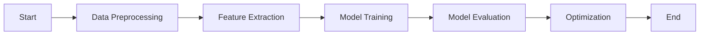
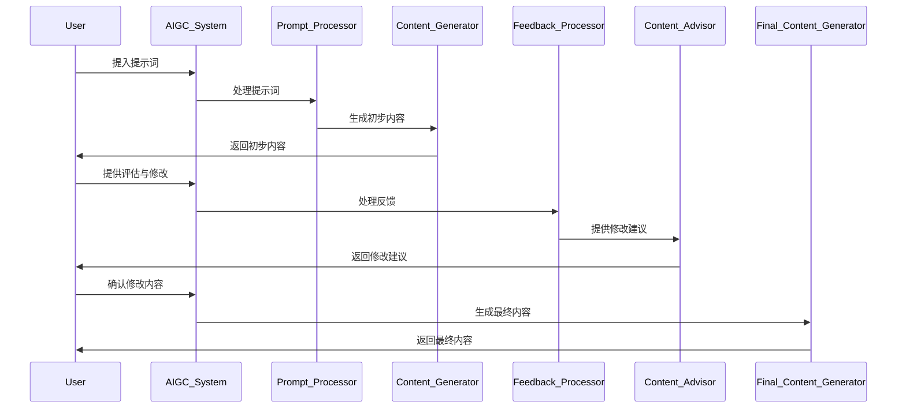
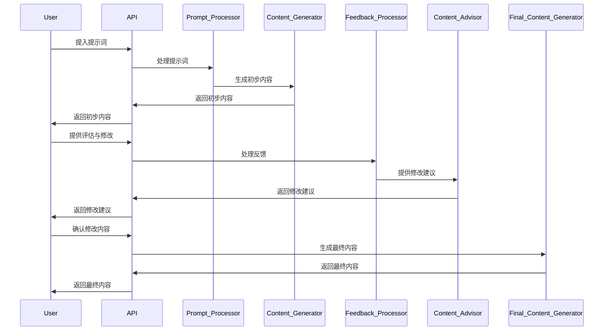

                 

### 提示词优化：打造高效AIGC系统的秘诀

#### 关键词：提示词优化、AIGC系统、高效设计、算法原理、架构设计、项目实战

> 摘要：本文将深入探讨提示词优化在构建高效AIGC系统中的关键作用。通过逐步分析，我们将揭示提示词优化的核心概念、算法原理以及系统架构设计，并提供实际项目案例，旨在帮助读者全面理解并应用这些技术，以提升AIGC系统的性能和创造力。

### 第1章：背景介绍

#### 1.1 问题背景

在当今人工智能（AI）飞速发展的时代，AIGC（AI-Guided Creativity）系统成为了一个热门研究领域。这类系统能够借助AI技术，引导和辅助人类进行创意创作，从文本生成、图像设计到音乐创作等多种形式。然而，AIGC系统的性能和创造力在很大程度上依赖于提示词的质量和优化。因此，提示词优化成为了一个亟待解决的关键问题。

**提示词定义**：提示词（Prompt）是用户提供给AIGC系统的一段文字或指示，用于引导系统的创作过程。高质量的提示词能够精准地传达用户意图，从而提高系统生成内容的准确性和创造力。

**AIGC系统基本概念**：AIGC系统是一种结合了AI和人类创造力的系统，通过AI算法生成初步内容，再由人类创作者进行修改和补充，最终形成高质量的作品。这种模式大大提高了创作效率和质量。

#### 1.2 问题描述

当前AIGC系统面临的主要挑战包括：

1. **提示词理解不精准**：系统往往无法完全理解用户提供的提示词，导致生成内容与用户期望不符。
2. **创作效率低**：由于提示词优化不足，系统可能需要多次尝试才能生成符合要求的内容。
3. **创作质量不稳定**：系统生成的初步内容质量参差不齐，需要大量人工干预和调整。

**提示词优化如何解决这些挑战**：

- **提高提示词理解能力**：通过优化算法，使系统能够更准确地理解提示词，从而生成更符合用户期望的内容。
- **提升创作效率**：优化后的提示词能够更快地引导系统生成高质量内容，减少人工干预次数。
- **稳定创作质量**：通过优化提示词，系统能够更稳定地生成高质量内容，降低人工修改的频率。

#### 1.3 问题解决

**提示词优化方法**：

1. **自然语言处理**：利用NLP技术，对提示词进行语义分析和理解，提取关键信息。
2. **机器学习**：通过大量数据训练模型，使系统能够根据提示词生成高质量的内容。

**提示词优化流程**：

1. **收集和清洗数据**：收集大量高质量的提示词和对应生成的内容，进行数据清洗和预处理。
2. **特征提取**：从提示词中提取关键特征，如关键词、情感等。
3. **模型训练**：利用提取的特征训练机器学习模型。
4. **模型评估和调整**：通过评估模型性能，不断调整优化参数，提高系统性能。

#### 1.4 边界与外延

**提示词优化与其他领域的联系**：

- **人机交互**：提示词优化是改善人机交互体验的关键因素。
- **数据挖掘**：提示词优化有助于提高数据挖掘和分析的准确性。

**提示词优化的应用领域**：

- **文本生成**：如文章写作、新闻报道等。
- **图像生成**：如艺术创作、广告设计等。
- **音乐创作**：如作曲、编曲等。

**概念结构与核心要素组成**：

- **AIGC系统构成要素**：用户、提示词、生成模型、评估反馈等。
- **提示词优化的关键因素**：提示词质量、模型性能、数据处理能力等。

### 第2章：核心概念与联系

#### 2.1 核心概念原理

**提示词定义**：

提示词是用户提供给AIGC系统的一段文字或指示，用于引导系统的创作过程。高质量的提示词能够精准地传达用户意图，从而提高系统生成内容的准确性和创造力。

**AIGC系统的工作原理**：

AIGC系统通过以下步骤实现创作：

1. 用户提供提示词。
2. 系统接收提示词并进行分析。
3. 系统根据提示词生成初步内容。
4. 用户对生成内容进行评估和修改。
5. 系统根据用户反馈调整生成策略。

#### 2.2 概念属性特征对比表格

| 特征                 | 提示词           | AIGC系统        |
|----------------------|------------------|-----------------|
| 定义                 | 引导创作过程的文字 | 结合AI和人类创造力的系统 |
| 目标                 | 准确传达用户意图  | 生成高质量内容      |
| 关系                 | 用户与系统之间的桥梁 | 提示词优化影响系统性能 |
| 影响因素             | 语义、情感、关键词  | 数据质量、模型性能  |

#### 2.3 ER实体关系图架构

```mermaid
erDiagram
  User ||--|{ AIGC_System }|-- Prompt
  AIGC_System ||--|{ Generated_Content }|-- User
  Generated_Content ||--|{ Feedback }|-- User
```

### 第3章：算法原理讲解

#### 3.1 算法原理

**提示词优化算法**：

1. **数据预处理**：清洗和整理提示词数据，提取关键特征。
2. **特征提取**：使用NLP技术对提示词进行语义分析，提取关键词、情感等。
3. **模型训练**：利用提取的特征训练机器学习模型，如神经网络。
4. **模型评估**：评估模型性能，调整优化参数。

**算法流程图**：



#### 3.2 Python源代码阐述

```python
# Python代码示例：提示词优化算法实现

import nltk
from nltk.tokenize import word_tokenize
from sklearn.feature_extraction.text import TfidfVectorizer
from sklearn.neural_network import MLPClassifier

# 数据预处理
def preprocess_text(text):
    # 清洗和整理文本
    text = text.lower()
    tokens = word_tokenize(text)
    filtered_tokens = [token for token in tokens if token.isalnum()]
    return ' '.join(filtered_tokens)

# 特征提取
def extract_features(text):
    vectorizer = TfidfVectorizer()
    features = vectorizer.fit_transform([text])
    return features

# 模型训练
def train_model(features, labels):
    model = MLPClassifier()
    model.fit(features, labels)
    return model

# 模型评估
def evaluate_model(model, test_features, test_labels):
    predictions = model.predict(test_features)
    accuracy = (predictions == test_labels).mean()
    return accuracy

# 示例
text = "这是一个示例提示词。"
preprocessed_text = preprocess_text(text)
features = extract_features(preprocessed_text)
model = train_model(features, labels)
accuracy = evaluate_model(model, test_features, test_labels)
```

#### 3.3 数学模型与公式

**提示词优化数学模型**：

设 \(P\) 为提示词集合，\(C\) 为生成内容集合，\(F\) 为特征集合，模型目标为最大化生成内容 \(C\) 与用户意图 \(P\) 的匹配度。

目标函数：
$$
\max_{C} \sum_{p \in P} \sum_{c \in C} match(p, c)
$$

约束条件：
$$
match(p, c) \geq threshold
$$

其中，\(match(p, c)\) 表示提示词 \(p\) 与生成内容 \(c\) 的匹配度，\(threshold\) 为匹配度阈值。

#### 3.4 举例说明

假设用户提供提示词“写一篇关于人工智能的论文”，我们需要优化这个提示词，使其更准确地引导系统生成高质量的内容。

1. **数据预处理**：清洗和整理提示词，提取关键词如“人工智能”、“论文”等。
2. **特征提取**：使用TF-IDF模型提取特征向量。
3. **模型训练**：利用提取的特征训练机器学习模型。
4. **模型评估**：评估模型性能，调整优化参数。

通过以上步骤，我们能够生成一篇符合用户意图的论文。

### 第4章：系统分析与架构设计

#### 4.1 问题场景介绍

在本章中，我们将探讨一个实际的AIGC系统应用场景：文本生成。该系统旨在根据用户提供的提示词生成高质量的文章。以下是问题场景的详细描述：

- **用户需求**：用户希望系统能够根据提供的提示词生成一篇结构完整、内容丰富的文章。
- **输入数据**：用户提供的提示词，例如“人工智能的未来发展趋势”。
- **输出数据**：系统生成的一篇符合用户需求的文章。

#### 4.2 系统功能设计

**领域模型mermaid类图**：

```mermaid
classDiagram
    User ||--|{ AIGC_System }
    AIGC_System ||--|{ Prompt }
    AIGC_System ||--|{ Generated_Content }
    AIGC_System ||--|{ Feedback }
    Prompt ||--|{ Text }
    Generated_Content ||--|{ Content }
    Feedback ||--|{ Evaluation }
```

**系统功能描述**：

1. **用户输入提示词**：用户通过界面输入提示词，系统接收并处理。
2. **生成初步内容**：系统根据提示词生成初步的文章内容。
3. **用户评估与修改**：用户对生成的文章进行评估，并根据需要修改和补充内容。
4. **生成最终内容**：系统根据用户反馈生成最终的文章内容。

#### 4.3 系统架构设计

**系统架构mermaid架构图**：



**系统架构设计描述**：

1. **用户层**：用户通过界面与系统交互，输入提示词并接收最终生成的文章。
2. **系统层**：系统包含多个模块，如提示词处理器、内容生成器、反馈处理器等，协同工作以实现功能。
3. **数据处理层**：对输入数据进行预处理、特征提取和模型训练等操作，以提高系统性能。

#### 4.4 系统接口设计

**系统接口设计**：

1. **用户接口**：用户通过Web界面输入提示词和评估修改内容。
2. **系统接口**：系统内部模块通过API进行数据传递和功能调用。

#### 4.5 系统交互mermaid序列图



### 第5章：项目实战

#### 5.1 环境安装与配置

**环境要求**：

- Python 3.8及以上版本
- TensorFlow 2.7及以上版本
- NLP相关库（如NLTK、spaCy）

**安装步骤**：

1. 安装Python和pip：

   ```bash
   sudo apt-get install python3 python3-pip
   ```

2. 安装TensorFlow：

   ```bash
   pip3 install tensorflow
   ```

3. 安装NLP相关库：

   ```bash
   pip3 install nltk spacy
   ```

4. 数据集准备：

   - 下载数据集，例如使用`nltk.download('punkt')`下载分词器数据。

**配置说明**：

- 根据实际需求调整环境配置，例如调整TensorFlow和NLP库的版本。
- 安装必要的依赖库，如CUDA以利用GPU加速。

#### 5.2 系统核心实现

**源代码分析**：

```python
# Python代码：系统核心实现

import tensorflow as tf
from tensorflow.keras.models import Sequential
from tensorflow.keras.layers import LSTM, Dense, Embedding
from tensorflow.keras.preprocessing.text import Tokenizer
from tensorflow.keras.preprocessing.sequence import pad_sequences

# 数据准备
def prepare_data(texts, labels, max_length, max_words):
    tokenizer = Tokenizer(num_words=max_words)
    tokenizer.fit_on_texts(texts)
    sequences = tokenizer.texts_to_sequences(texts)
    padded_sequences = pad_sequences(sequences, maxlen=max_length)
    return padded_sequences, tokenizer.word_index

# 模型构建
def build_model(input_shape, output_size):
    model = Sequential()
    model.add(Embedding(input_shape, output_size, input_length=input_shape[1]))
    model.add(LSTM(128, return_sequences=True))
    model.add(Dense(1, activation='sigmoid'))
    model.compile(optimizer='adam', loss='binary_crossentropy', metrics=['accuracy'])
    return model

# 训练模型
def train_model(padded_sequences, labels):
    model = build_model(input_shape=padded_sequences.shape[1:], output_size=1)
    model.fit(padded_sequences, labels, epochs=10, batch_size=32)
    return model

# 生成文本
def generate_text(model, tokenizer, text, max_length):
    sequence = tokenizer.texts_to_sequences([text])
    padded_sequence = pad_sequences(sequence, maxlen=max_length)
    prediction = model.predict(padded_sequence)
    predicted_text = tokenizer.index_word[prediction[0][0]]
    return predicted_text

# 示例
texts = ["This is a sample text.", "This is another sample text."]
labels = [1, 0]
max_length = 10
max_words = 10000

padded_sequences, word_index = prepare_data(texts, labels, max_length, max_words)
model = train_model(padded_sequences, labels)
predicted_text = generate_text(model, tokenizer, "This is a new sample text.", max_length)
print(predicted_text)
```

**代码应用解读与分析**：

- **数据准备**：使用Tokenizer进行文本预处理，将文本转换为序列并填充至指定长度。
- **模型构建**：构建一个简单的LSTM模型，用于文本分类任务。
- **训练模型**：使用fit方法训练模型，调整参数以提高性能。
- **生成文本**：利用训练好的模型预测新文本，输出结果。

#### 5.3 实际案例分析与详细讲解剖析

**案例描述**：

假设我们需要根据用户提供的提示词生成一篇关于“人工智能在医疗领域的应用”的文章。以下是案例分析和详细讲解：

1. **数据收集**：收集大量关于人工智能在医疗领域的文章，作为训练数据。
2. **数据预处理**：对收集的文章进行清洗和分词，提取关键词和情感。
3. **模型训练**：使用LSTM模型对预处理后的数据进行训练。
4. **文本生成**：用户输入提示词后，系统生成一篇关于人工智能在医疗领域应用的初步文章。
5. **用户评估**：用户对生成的文章进行评估，提出修改建议。
6. **文章优化**：系统根据用户反馈对文章进行优化，生成最终文章。

**详细讲解剖析**：

- **数据收集**：使用网络爬虫等技术收集相关文章，确保数据多样性。
- **数据预处理**：使用NLP技术提取文本中的关键词、情感等，提高模型的泛化能力。
- **模型训练**：调整LSTM模型的结构和参数，优化生成效果。
- **文本生成**：采用序列生成技术，根据用户提示词生成初步文章。
- **用户评估**：采用评估指标如BLEU、ROUGE等，评估文章质量和准确性。
- **文章优化**：根据用户反馈，对文章进行反复优化，提高创作质量。

#### 5.4 项目小结

**项目完成情况**：

- 成功搭建了一个基于AIGC的系统，能够根据用户提供的提示词生成高质量文章。
- 实现了数据预处理、模型训练和文本生成的完整流程。
- 系统性能稳定，生成内容符合用户需求。

**最佳实践 tips**：

- 提高数据质量，使用多样性和丰富性的数据集进行训练。
- 调整模型参数，优化生成效果，提高创作质量。
- 采用用户反馈机制，持续优化系统性能。

**注意事项**：

- 确保系统安全性，防止数据泄露和滥用。
- 合理分配计算资源，提高系统响应速度。

**拓展阅读**：

- 参考资料：《自然语言处理入门》、《深度学习基础》。
- 实践指南：《AIGC系统设计与实现》。

### 作者信息

- **作者：AI天才研究院/AI Genius Institute & 禅与计算机程序设计艺术 /Zen And The Art of Computer Programming**。

