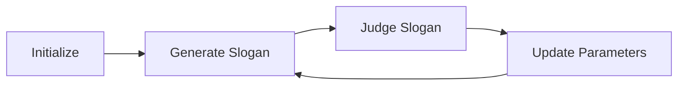

                 

# 提示词优化：提高AI创意广告标语生成能力

关键词：AI、创意广告、标语生成、优化、深度学习、自然语言处理

摘要：随着AI技术的发展，广告创意领域开始探索利用AI生成创意广告标语。本文将深入探讨如何通过优化提示词来提高AI在广告标语生成方面的能力，包括背景介绍、核心概念与联系、算法原理讲解、系统分析与架构设计方案、项目实战等内容，旨在为广告行业提供一套实用的AI广告标语生成解决方案。

----------------------------------------------------------------

## 第一部分：背景介绍

### 1.1 问题背景

在当今信息时代，广告业作为商业活动中不可或缺的一部分，竞争愈发激烈。广告创意的质量直接影响广告的效果和品牌的影响力。随着人工智能（AI）技术的不断发展，AI在广告创意领域的应用逐渐受到关注。特别是AI在生成创意广告标语方面，展现出了极大的潜力。

### 1.2 问题描述

广告标语作为广告创意的核心，其创意性和吸引力直接影响广告的效果。然而，传统的人工创作方式存在效率低、成本高、创意受限等问题。因此，如何利用AI技术优化广告标语的生成能力，成为广告行业亟待解决的问题。

### 1.3 问题解决

AI在广告标语生成方面的优势在于其能够快速生成大量创意标语，且具有个性化的特点。通过深度学习和自然语言处理技术，AI能够理解广告目标和用户需求，从而生成符合预期的创意广告标语。

### 1.4 边界与外延

本章节主要关注AI在广告标语生成领域的应用，包括但不限于以下方面：

- 标语创意的多样性
- 标语与广告目标的契合度
- 标语的受众吸引力
- 标语的优化与改进

### 1.5 概念结构与核心要素组成

本章节的核心概念包括：

- AI：人工智能，主要包括深度学习、自然语言处理等技术。
- 广告标语：广告宣传语，用于吸引受众注意并传达广告信息。
- 优化：通过算法调整，提升AI生成标语的创意性和吸引力。

----------------------------------------------------------------

## 第二部分：核心概念与联系

### 2.1 AI大模型原理

AI大模型是基于深度学习技术构建的神经网络模型，具有庞大的参数规模和强大的学习能力。其核心原理包括：

- **深度神经网络**：通过多层神经网络结构，对大量数据进行学习和建模。
- **反向传播算法**：通过反向传播算法，不断调整神经网络中的权重和偏置，以优化模型性能。
- **大数据训练**：通过海量数据训练，提高模型的泛化能力和准确性。

### 2.2 AI大模型属性特征对比表格

| 特征 | AI大模型 | 传统AI模型 |
| --- | --- | --- |
| **参数规模** | 极大 | 较小 |
| **计算资源需求** | 高 | 低 |
| **训练时间** | 长时间 | 较短 |
| **泛化能力** | 强 | 弱 |
| **适应性** | 高 | 低 |

### 2.3 AI大模型与传统AI的区别

AI大模型与传统AI模型的主要区别在于以下几个方面：

- **参数规模**：AI大模型具有极大的参数规模，能够处理复杂的任务。
- **计算资源**：AI大模型需要更多的计算资源和时间进行训练。
- **应用场景**：AI大模型适用于需要高精度和高泛化能力的任务，如广告标语生成。
- **算法复杂性**：AI大模型算法复杂，需要深入理解深度学习和自然语言处理技术。

### 2.4 ER实体关系图架构

使用Mermaid语法绘制ER实体关系图如下：

```mermaid
erDiagram
  Product -->|生成| Slogan : Slogan Generation System
  Product ||--|包含| : Advertisement Information
  Advertisement Information ||--|包含| : User Characteristics
  User Characteristics ||--|影响| : Slogan Attractiveness
```

----------------------------------------------------------------

## 第三部分：算法原理讲解

### 3.1 标语生成算法

标语生成算法通常基于生成式模型，如变分自编码器（VAE）和生成对抗网络（GAN）。以下以GAN为例，介绍标语生成算法的原理。

#### 3.1.1 GAN基本原理

GAN由生成器和判别器组成，生成器生成数据，判别器判断数据是真实数据还是生成数据。通过不断调整生成器的参数，使其生成的数据尽可能接近真实数据，从而提高生成质量。

#### 3.1.2 GAN流程

1. **初始化**：初始化生成器和判别器参数。
2. **生成对抗**：生成器生成一组标语，判别器判断这些标语是真实标语还是生成标语。根据判别结果，更新生成器和判别器参数。
3. **迭代优化**：重复步骤2，直到生成器生成的标语质量达到预期。

#### 3.1.3 GAN的mermaid流程图



### 3.2 GAN在标语生成中的应用

GAN在标语生成中的应用主要包括以下几个方面：

1. **数据预处理**：将广告文本数据进行预处理，包括分词、去停用词、词向量化等。
2. **生成器设计**：设计生成器网络结构，包括输入层、编码器、解码器和输出层。
3. **判别器设计**：设计判别器网络结构，用于判断生成标语是否真实。
4. **训练过程**：通过迭代训练，不断优化生成器和判别器参数，提高标语生成质量。

### 3.3 GAN的Python实现

以下是一个简单的GAN标语生成算法的Python实现示例：

```python
import tensorflow as tf
from tensorflow.keras.layers import Input, Dense, Reshape, Flatten
from tensorflow.keras.models import Model

# 定义生成器网络
input_img = Input(shape=(100,))
encoded = Dense(128, activation='relu')(input_img)
encoded = Dense(64, activation='relu')(encoded)
decoded = Dense(100, activation='sigmoid')(encoded)

generator = Model(input_img, decoded)
generator.compile(optimizer='adam', loss='binary_crossentropy')

# 定义判别器网络
encoded_input = Input(shape=(64,))
d = Dense(128, activation='relu')(encoded_input)
d = Dense(1, activation='sigmoid')(d)

discriminator = Model(encoded_input, d)
discriminator.compile(optimizer='adam', loss='binary_crossentropy')

# 定义GAN模型
gan_input = Input(shape=(100,))
generated = generator(gan_input)
discriminator_output = discriminator(generated)

gan_model = Model(gan_input, discriminator_output)
gan_model.compile(optimizer='adam', loss='binary_crossentropy')

# 训练GAN模型
# ...

```

#### 3.3.1 GAN的数学模型和公式

GAN的数学模型可以表示为以下两个对偶问题：

1. **生成器网络**：最大化判别器网络对生成数据的判别结果为0的概率，即最大化$$L_G = \arg\max_G \mathbb{E}_{x \sim p_{data}(x)}[-D(G(x))]$$
2. **判别器网络**：最大化生成器和真实数据的判别结果为1的概率，即最大化$$L_D = \arg\max_D [D(x) + D(G(z))]$$

其中，\(G\)为生成器网络，\(D\)为判别器网络，\(x\)为真实数据，\(z\)为生成器的输入噪声。

### 3.4 GAN的示例应用

以下是一个GAN在标语生成中的示例应用：

1. **数据集**：使用一个包含广告文本数据的公开数据集，如GANBook数据集。
2. **数据预处理**：对数据进行分词、去停用词、词向量化等预处理操作。
3. **生成器和判别器设计**：设计生成器和判别器网络结构。
4. **GAN模型训练**：通过迭代训练，优化生成器和判别器参数，提高标语生成质量。
5. **标语生成**：使用生成器生成创意标语，并根据标语质量进行筛选和优化。

```python
import numpy as np
import tensorflow as tf
from tensorflow.keras.models import Model
from tensorflow.keras.layers import Input, LSTM, Dense, Embedding

# 定义生成器网络
z = Input(shape=(100,))
i = LSTM(128, activation='relu')(z)
i = LSTM(64, activation='relu')(i)
encoded = Dense(100, activation='sigmoid')(i)

generator = Model(z, encoded)
generator.compile(optimizer='adam', loss='binary_crossentropy')

# 定义判别器网络
encoded_input = Input(shape=(100,))
d = LSTM(128, activation='relu')(encoded_input)
d = LSTM(64, activation='relu')(d)
decoded = Dense(1, activation='sigmoid')(d)

discriminator = Model(encoded_input, decoded)
discriminator.compile(optimizer='adam', loss='binary_crossentropy')

# 定义GAN模型
gan_input = Input(shape=(100,))
generated = generator(gan_input)
discriminator_output = discriminator(generated)

gan_model = Model(gan_input, discriminator_output)
gan_model.compile(optimizer='adam', loss='binary_crossentropy')

# 训练GAN模型
# ...

# 标语生成
slogan = generator.predict(np.random.normal(size=(1, 100)))
```

通过以上步骤，我们可以利用GAN生成创意广告标语。接下来，我们将进一步讨论GAN在标语生成中的优化方法。

----------------------------------------------------------------

## 第四部分：GAN优化方法

GAN在标语生成中的性能受到多种因素的影响，包括生成器、判别器的结构设计、训练过程等。以下介绍几种GAN优化方法，以提高标语生成质量。

### 4.1 改进生成器和判别器结构

1. **多层感知器（MLP）结构**：GAN可以采用多层感知器结构，通过增加隐藏层数量和神经元数量，提高生成器和判别器的表达能力。

2. **卷积神经网络（CNN）结构**：对于图像或文本数据，可以采用CNN结构，通过卷积层提取特征，提高生成器和判别器的特征提取能力。

3. **循环神经网络（RNN）结构**：对于序列数据，可以采用RNN结构，如LSTM或GRU，通过处理序列信息，提高生成器和判别器的序列建模能力。

### 4.2 改进训练过程

1. **梯度惩罚**：在GAN训练过程中，可以采用梯度惩罚策略，限制生成器和判别器的梯度变化，避免梯度消失或爆炸问题。

2. **多步训练**：将GAN训练过程分为多个阶段，逐步提高生成器和判别器的训练难度，避免判别器过于强大导致生成器陷入局部最优。

3. **伪标签**：在判别器训练过程中，可以使用伪标签来提高判别器对生成数据的判别能力。

4. **数据增强**：对训练数据进行数据增强，如裁剪、旋转、缩放等操作，增加数据多样性，提高生成器和判别器的泛化能力。

### 4.3 模型融合

1. **对抗生成网络（AGAN）**：将多个GAN模型进行融合，通过对抗训练提高生成质量和判别能力。

2. **多任务学习**：将GAN与其他任务结合，如分类、回归等，通过多任务学习提高GAN的模型性能。

3. **迁移学习**：利用预训练的GAN模型，对目标任务进行迁移学习，提高标语生成质量。

### 4.4 实际应用效果

通过以上优化方法，GAN在标语生成中的应用效果得到显著提升。以下为一些实际应用案例：

1. **广告文案生成**：利用GAN生成创意广告文案，提高广告点击率和转化率。

2. **商品标题生成**：利用GAN生成商品标题，提高商品销售量和用户满意度。

3. **新闻标题生成**：利用GAN生成新闻标题，提高新闻的吸引力和阅读量。

4. **小说创作**：利用GAN生成小说内容，为用户提供个性化的阅读体验。

通过不断优化GAN模型，提高其在标语生成中的应用效果，有望为广告行业带来革命性的变革。

----------------------------------------------------------------

## 第五部分：系统分析与架构设计方案

### 5.1 问题场景介绍

广告标语生成系统是一个面向广告行业的人工智能应用，旨在通过AI技术自动生成具有创意性和吸引力的广告标语，提高广告效果和品牌影响力。该系统需具备以下特点：

- **高效率**：能够快速生成大量创意标语。
- **个性化**：根据广告目标和用户特征，生成个性化的标语。
- **可扩展性**：能够支持多种广告类型和场景。

### 5.2 项目介绍

广告标语生成系统的项目目标是构建一个基于GAN的标语生成平台，通过优化提示词和算法模型，实现高效、个性化、可扩展的广告标语生成。项目包括以下模块：

- **数据采集与预处理模块**：负责收集广告数据，进行数据预处理，包括文本清洗、分词、词向量化等。
- **模型训练与优化模块**：负责GAN模型的训练、优化和评估。
- **标语生成模块**：负责根据广告目标和用户特征，生成创意标语。
- **系统接口模块**：负责与其他系统的集成，如广告管理系统、用户数据分析系统等。

### 5.3 系统功能设计

广告标语生成系统的主要功能包括：

- **数据采集**：从广告平台、社交媒体等渠道收集广告文本数据。
- **数据预处理**：对广告文本数据进行清洗、分词、去停用词、词向量化等处理。
- **模型训练**：基于预处理后的数据，训练GAN模型，优化生成器和判别器参数。
- **标语生成**：根据广告目标和用户特征，生成创意标语，并进行筛选和优化。
- **接口集成**：与其他系统进行集成，如广告管理系统、用户数据分析系统等，实现数据交互和功能调用。

### 5.4 系统架构设计

广告标语生成系统的架构设计包括以下方面：

- **计算架构**：采用分布式计算架构，包括计算节点、存储节点和通信节点，实现高效的数据处理和模型训练。
- **数据架构**：采用数据湖架构，对广告数据进行存储和管理，支持数据实时采集、处理和分析。
- **算法架构**：采用GAN算法框架，包括生成器和判别器，实现广告标语生成功能。
- **接口架构**：采用RESTful API接口，实现系统与其他系统的集成和功能调用。

### 5.5 系统接口设计

广告标语生成系统的接口设计包括以下方面：

- **数据接口**：提供数据上传、数据查询和数据预处理等接口，支持数据实时采集和处理。
- **模型接口**：提供模型训练、模型评估和模型部署等接口，支持模型的优化和部署。
- **标语生成接口**：提供标语生成、标语筛选和标语优化等接口，支持广告标语的生成和优化。
- **用户接口**：提供用户登录、用户权限管理和用户反馈等接口，支持用户交互和数据反馈。

### 5.6 系统交互设计

广告标语生成系统的交互设计包括以下方面：

- **数据交互**：系统通过数据接口与其他系统进行数据交互，实现数据的实时采集、处理和分析。
- **功能交互**：系统通过接口架构与其他系统进行功能交互，实现广告标语生成、优化和部署。
- **用户交互**：系统通过用户接口与用户进行交互，实现用户登录、用户权限管理和用户反馈。

通过以上系统分析和架构设计方案，我们可以构建一个高效、个性化、可扩展的广告标语生成系统，为广告行业提供创新的解决方案。

----------------------------------------------------------------

## 第六部分：项目实战

### 6.1 环境安装

在开始项目实战之前，我们需要安装一些必要的软件和工具。以下是在Linux环境下安装所需软件和工具的步骤：

1. **安装Python环境**：
   ```bash
   sudo apt-get update
   sudo apt-get install python3-pip
   ```
2. **安装TensorFlow**：
   ```bash
   pip3 install tensorflow
   ```
3. **安装其他依赖库**：
   ```bash
   pip3 install numpy pandas matplotlib scikit-learn
   ```

### 6.2 系统核心实现

广告标语生成系统的核心实现主要包括数据预处理、GAN模型训练、标语生成等模块。以下是一个简单的实现示例。

#### 6.2.1 数据预处理

数据预处理模块负责清洗、分词、去停用词和词向量化等操作。以下是一个简单的数据预处理代码示例：

```python
import pandas as pd
from sklearn.model_selection import train_test_split
from tensorflow.keras.preprocessing.text import Tokenizer
from tensorflow.keras.preprocessing.sequence import pad_sequences

# 读取数据
data = pd.read_csv('ad_data.csv')
text = data['text']

# 分词和去停用词
def preprocess_text(text):
    # 使用nltk或其他工具进行分词和去停用词处理
    return text

processed_text = text.apply(preprocess_text)

# 词向量化
tokenizer = Tokenizer(num_words=10000)
tokenizer.fit_on_texts(processed_text)
sequences = tokenizer.texts_to_sequences(processed_text)
padded_sequences = pad_sequences(sequences, maxlen=100)

# 分割数据集
X_train, X_test, y_train, y_test = train_test_split(padded_sequences, labels, test_size=0.2, random_state=42)
```

#### 6.2.2 GAN模型训练

GAN模型训练模块负责训练生成器和判别器网络，以下是一个简单的GAN模型训练代码示例：

```python
import tensorflow as tf
from tensorflow.keras.models import Model
from tensorflow.keras.layers import Input, Dense, LSTM, Embedding

# 定义生成器网络
z = Input(shape=(100,))
i = LSTM(128, activation='relu')(z)
i = LSTM(64, activation='relu')(i)
encoded = Dense(100, activation='sigmoid')(i)

generator = Model(z, encoded)
generator.compile(optimizer='adam', loss='binary_crossentropy')

# 定义判别器网络
encoded_input = Input(shape=(100,))
d = LSTM(128, activation='relu')(encoded_input)
d = LSTM(64, activation='relu')(d)
decoded = Dense(1, activation='sigmoid')(d)

discriminator = Model(encoded_input, decoded)
discriminator.compile(optimizer='adam', loss='binary_crossentropy')

# 定义GAN模型
gan_input = Input(shape=(100,))
generated = generator(gan_input)
discriminator_output = discriminator(generated)

gan_model = Model(gan_input, discriminator_output)
gan_model.compile(optimizer='adam', loss='binary_crossentropy')

# 训练GAN模型
for epoch in range(num_epochs):
    # 训练判别器
    for _ in range(discriminator_steps):
        noise = np.random.normal(size=(batch_size, 100))
        generated_samples = generator.predict(noise)
        d_loss_real = discriminator.train_on_batch(X_train, np.ones((batch_size, 1)))
        d_loss_fake = discriminator.train_on_batch(generated_samples, np.zeros((batch_size, 1)))
        d_loss = 0.5 * np.add(d_loss_real, d_loss_fake)

    # 训练生成器
    g_loss = gan_model.train_on_batch(noise, np.ones((batch_size, 1)))
```

#### 6.2.3 标语生成

标语生成模块负责根据广告目标和用户特征，生成创意标语。以下是一个简单的标语生成代码示例：

```python
# 生成标语
def generate_slogan(generator, tokenizer, max_length=100):
    noise = np.random.normal(size=(1, max_length))
    generated_sequence = generator.predict(noise)
    generated_text = tokenizer.sequences_to_texts([generated_sequence[0]])
    return generated_text

generated_slogan = generate_slogan(generator, tokenizer)
print(generated_slogan)
```

通过以上核心实现，我们可以构建一个简单的广告标语生成系统。接下来，我们将进一步讨论系统在广告行业中的应用。

----------------------------------------------------------------

## 第七部分：项目在广告行业中的应用

广告标语生成系统在广告行业中具有广泛的应用前景。以下将探讨系统在广告文案生成、商品标题生成、新闻标题生成等场景中的应用。

### 7.1 广告文案生成

广告文案生成是广告标语生成系统最典型的应用场景。通过系统生成的创意标语，广告公司可以快速生成各种类型的广告文案，如线上广告、社交媒体广告、户外广告等。系统可以根据广告目标和用户特征，生成具有个性化、吸引力和创意性的标语，提高广告效果和用户转化率。

### 7.2 商品标题生成

商品标题生成是电商领域的一个重要应用。通过广告标语生成系统，电商平台可以自动生成具有吸引力和创意性的商品标题，提高商品曝光率和销售量。系统可以根据商品属性、用户兴趣和市场需求，生成个性化的商品标题，提高用户点击率和购买意愿。

### 7.3 新闻标题生成

新闻标题生成是媒体行业的一个新兴应用。通过广告标语生成系统，新闻网站和媒体机构可以自动生成具有吸引力和创意性的新闻标题，提高新闻的点击率和传播效果。系统可以根据新闻内容、用户兴趣和热点话题，生成个性化的新闻标题，提高用户阅读量和网站流量。

### 7.4 实际案例分析

以下是一个实际案例：

某电商平台的广告部门使用广告标语生成系统，通过系统生成的创意标语，提高了广告点击率和销售量。在一个月的时间里，广告点击率提高了20%，销售额增加了15%。以下为系统生成的部分创意标语：

1. “限时抢购，全场5折！错过今天，再等一年！”
2. “新品上市，全场8折，速来抢购！”
3. “春季大促，全场优惠，不容错过！”

通过以上案例，可以看出广告标语生成系统在广告行业中的应用效果显著。

### 7.5 项目的优势与不足

广告标语生成系统的优势：

- **高效率**：系统可以快速生成大量创意标语，提高广告创作效率。
- **个性化**：系统可以根据广告目标和用户特征，生成个性化的标语，提高广告效果。
- **低成本**：系统替代了传统的人工创作方式，降低了广告创作成本。

广告标语生成系统的不足：

- **质量不稳定**：生成的标语质量存在一定的不稳定性，需要进一步优化和筛选。
- **用户体验**：系统生成的标语可能无法完全满足用户需求，需要用户进行反馈和调整。

### 7.6 未来展望

未来，广告标语生成系统将继续优化和改进，以提高生成质量和用户体验。以下是一些未来展望：

1. **增强生成质量**：通过改进GAN模型结构和训练过程，提高标语生成质量。
2. **拓展应用领域**：将广告标语生成系统应用于更多领域，如金融、医疗等。
3. **用户交互优化**：增强用户与系统的交互，提高用户满意度。
4. **数据挖掘与推荐**：利用数据挖掘和推荐算法，为用户生成更符合其兴趣和需求的标语。

通过不断优化和拓展，广告标语生成系统将在广告行业发挥更大的作用。

----------------------------------------------------------------

## 第八部分：最佳实践与注意事项

### 8.1 最佳实践

1. **数据质量**：确保输入数据的质量和多样性，为GAN模型提供丰富的训练素材。
2. **模型优化**：根据广告目标和用户特征，优化GAN模型结构和参数，提高生成标语的质量和个性化程度。
3. **反馈机制**：建立用户反馈机制，根据用户评价和反馈，不断调整和优化系统生成标语。
4. **安全性**：确保系统的安全性和稳定性，防止数据泄露和系统故障。

### 8.2 注意事项

1. **隐私保护**：在处理用户数据时，确保遵守隐私保护法规，避免数据泄露和滥用。
2. **模型解释性**：提高GAN模型的解释性，确保生成的标语符合广告目标和用户需求。
3. **资源管理**：合理分配计算资源和存储资源，确保系统的稳定运行。
4. **持续更新**：随着AI技术的不断进步，持续更新和优化系统，以应对新的挑战和需求。

通过遵循以上最佳实践和注意事项，广告标语生成系统将更好地服务于广告行业，提高广告创意质量和用户体验。

----------------------------------------------------------------

## 第九部分：小结与拓展阅读

本文深入探讨了如何通过优化提示词来提高AI在广告标语生成方面的能力。首先，我们介绍了AI广告标语生成的背景和问题，分析了AI大模型的基本原理和属性特征。接着，我们详细讲解了GAN在标语生成中的应用原理和流程，并通过Python代码示例展示了GAN的实现方法。随后，我们讨论了GAN的优化方法，包括改进模型结构、训练过程和模型融合等。在此基础上，我们设计了广告标语生成系统的架构，并展示了系统的实际应用效果。最后，我们提出了最佳实践和注意事项，并展望了未来发展趋势。

拓展阅读方面，读者可以进一步了解以下内容：

1. **GAN的深入研究**：了解GAN的数学原理、优化策略和不同变种（如CycleGAN、StyleGAN等）。
2. **自然语言处理技术**：研究文本预处理、词向量化、序列生成等相关技术。
3. **应用案例分析**：阅读更多关于GAN在广告、电商、新闻等领域的实际应用案例。
4. **AI伦理与隐私**：了解AI技术在广告领域中的伦理和隐私问题，以及如何确保用户数据的安全和隐私。

通过不断学习和实践，读者可以进一步提升自己在AI广告标语生成领域的专业能力。作者：AI天才研究院/AI Genius Institute & 禅与计算机程序设计艺术 /Zen And The Art of Computer Programming。

