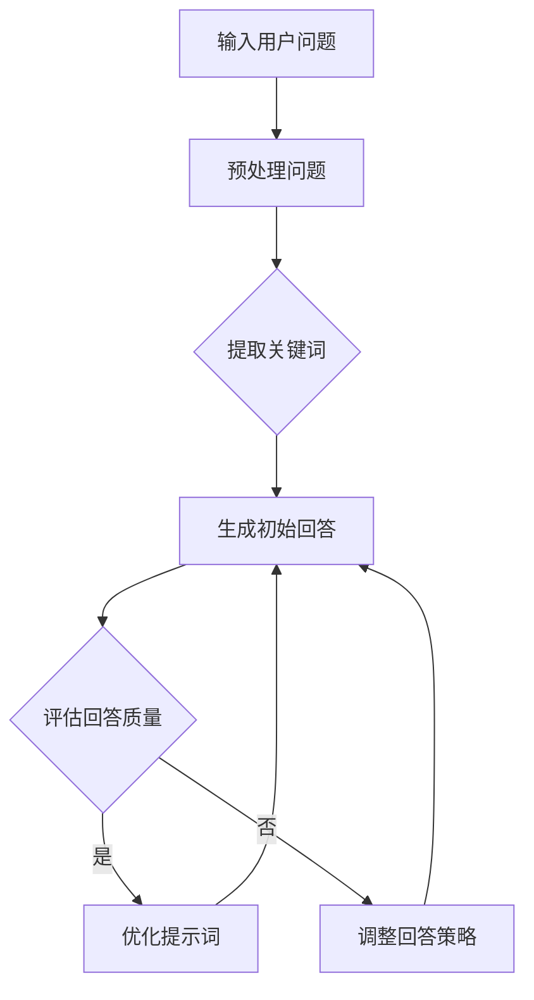
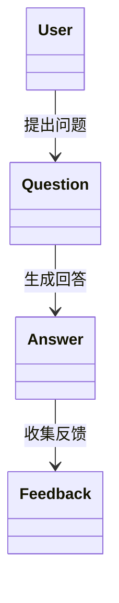
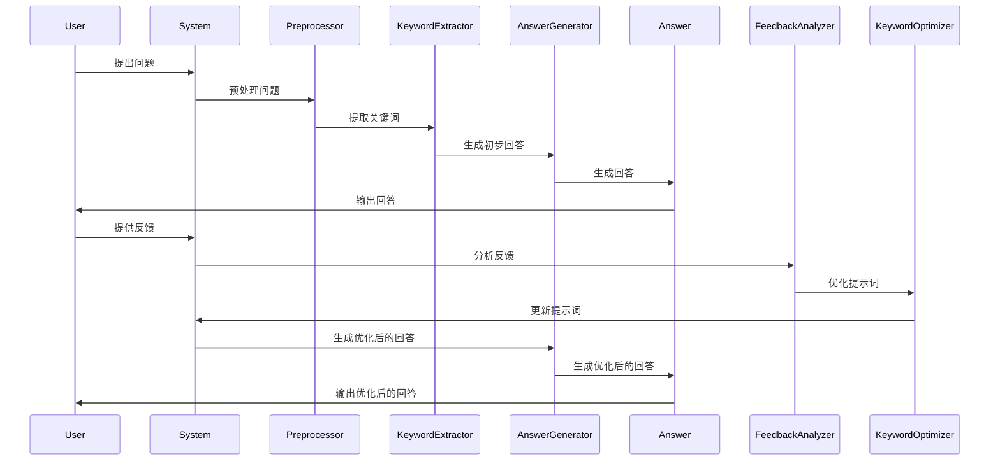
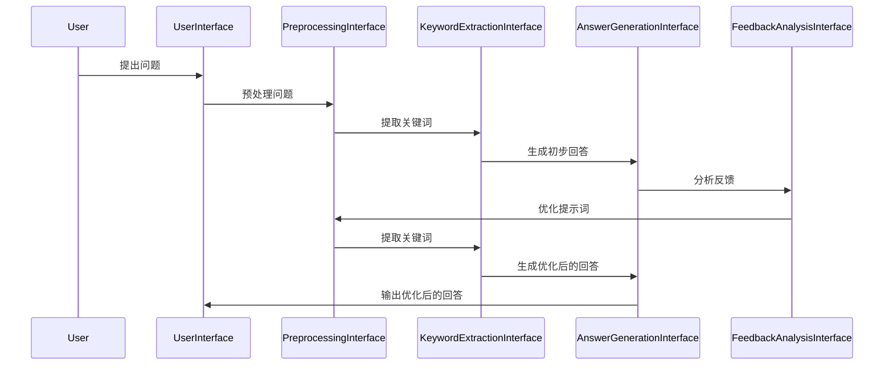

                 

### 文章标题：提示词优化：提高AI回答准确性的方法

关键词：提示词优化、AI回答准确性、算法、系统架构、Python实现、数学模型

摘要：本文旨在深入探讨提示词优化对提高人工智能（AI）回答准确性的影响。我们将从背景介绍、核心概念解析、算法原理讲解、系统分析与架构设计、项目实战和最佳实践等多个角度展开，结合实际案例，系统性地分析提示词优化方法的原理和实践应用，以期为广大AI技术爱好者提供有价值的参考。

## 目录

### 第一部分：背景与基础

1. **问题背景与定义**
   - 1.1 问题背景
   - 1.2 核心概念
   - 1.3 范例分析
   - 1.4 边界与外延
   - 1.5 概念结构与核心要素组成
   - 1.6 本章小结

2. **核心概念与联系**
   - 2.1 提示词优化原理
   - 2.2 概念属性特征对比
   - 2.3 ER实体关系图架构
   - 2.4 本章小结

### 第二部分：算法原理讲解

3. **算法流程与实现**
   - 3.1 算法流程图
   - 3.2 Python源代码实现
   - 3.3 数学模型与公式
   - 3.4 举例说明
   - 3.5 本章小结

4. **系统分析与架构设计**
   - 4.1 系统功能设计与架构
   - 4.2 系统接口设计
   - 4.3 系统交互序列图
   - 4.4 本章小结

### 第三部分：项目实战

5. **环境安装与系统实现**
   - 5.1 环境安装
   - 5.2 系统核心实现
   - 5.3 应用解读与分析
   - 5.4 详细讲解剖析
   - 5.5 项目小结

6. **最佳实践与总结**
   - 6.1 最佳实践
   - 6.2 小结与展望
   - 6.3 注意事项
   - 6.4 拓展阅读

## 第1章：问题背景与定义

### 1.1 问题背景

人工智能（AI）技术近年来取得了飞速发展，其在各个领域的应用也越来越广泛。然而，随着AI系统的普及，一个问题逐渐显现出来：AI回答的准确性问题。尽管AI在图像识别、自然语言处理等方面已经表现出色，但在某些特定场景下，其回答仍然不够准确。

这一问题主要源于提示词优化不足。提示词是AI系统与用户进行交互的关键媒介，它直接影响AI回答的质量。然而，当前许多AI系统在处理复杂问题时，提示词的设计和优化不够精细，导致回答出现偏差。

### 1.2 核心概念

#### 提示词优化

提示词优化是指通过改进提示词的设计和选择，提高AI回答的准确性。这包括以下几个方面：

1. **提示词长度**：合适的提示词长度有助于提高AI对问题的理解能力。
2. **关键词选择**：选择与问题高度相关的关键词，有助于AI系统更准确地提取问题核心。
3. **语义分析**：通过深度学习等技术，对提示词进行语义分析，以更好地理解用户意图。

#### AI回答准确性

AI回答准确性是指AI系统对问题的回答与人类专家回答的相似度。提高AI回答准确性，可以提升用户满意度，增强AI系统的可信度。

### 1.3 范例分析

#### 成功案例

1. **智能客服系统**：通过优化提示词，智能客服系统在处理用户问题时，能够更准确地理解用户意图，提高回答的准确性。
2. **医疗诊断系统**：在医疗诊断中，通过优化提示词，系统能够更准确地识别患者的症状，提高诊断的准确性。

#### 失败案例

1. **自动驾驶系统**：在自动驾驶系统中，提示词优化不足，导致系统在复杂路况下出现误判，从而引发交通事故。
2. **智能家居系统**：在智能家居系统中，提示词优化不足，导致用户对系统的操作不够灵活，降低了用户体验。

### 1.4 边界与外延

#### 提示词优化适用的场景

1. **客服领域**：智能客服系统需要处理大量用户问题，提示词优化有助于提高回答准确性。
2. **医疗领域**：在医疗诊断中，准确的提示词有助于提高诊断的准确性。
3. **教育领域**：在教育领域，提示词优化有助于提高教育系统的互动性和教学效果。

#### 限制条件与潜在问题

1. **数据量**：提示词优化需要大量的数据支持，数据量不足可能导致优化效果不佳。
2. **模型复杂性**：深度学习模型在处理复杂问题时，可能需要较长的训练时间，这会影响系统的实时性。
3. **用户行为**：用户行为多变，提示词优化需要不断调整，以适应不同用户的需求。

### 1.5 概念结构与核心要素组成

#### 提示词优化模型架构

提示词优化模型架构主要包括以下几个部分：

1. **数据采集**：收集用户问题和答案数据。
2. **数据预处理**：对数据进行清洗、分词、词频统计等处理。
3. **语义分析**：对预处理后的数据进行分析，提取关键词和语义信息。
4. **提示词生成**：根据分析结果，生成合适的提示词。
5. **优化算法**：对生成的提示词进行优化，提高回答准确性。

#### 关键技术分析

1. **自然语言处理（NLP）**：NLP技术在提示词优化中起着关键作用，包括文本分类、情感分析、命名实体识别等。
2. **深度学习**：深度学习模型在语义分析、提示词生成和优化方面具有显著优势。
3. **机器学习**：机器学习算法在数据分析和优化中发挥重要作用，如决策树、支持向量机等。

#### 核心要素组合与优化流程

1. **核心要素组合**：将NLP、深度学习和机器学习等技术进行有机结合，形成完善的提示词优化系统。
2. **优化流程**：通过数据采集、预处理、语义分析、提示词生成和优化等步骤，实现提示词优化。

### 1.6 本章小结

本章从问题背景、核心概念、范例分析、边界与外延、概念结构与核心要素组成等方面，对提示词优化进行了全面介绍。通过本章的学习，读者可以初步了解提示词优化的重要性及其在AI应用中的关键作用。

## 第2章：核心概念与联系

### 2.1 提示词优化原理

提示词优化是指通过改进提示词的设计和选择，提高AI回答的准确性。其基本原理包括以下几个方面：

1. **关键词选择**：选择与问题高度相关的关键词，有助于AI系统更准确地提取问题核心。
2. **语义分析**：对提示词进行语义分析，以更好地理解用户意图。
3. **反馈调整**：根据AI回答的准确性，不断调整提示词，以适应不同用户的需求。

#### 提示词优化算法

提示词优化算法主要包括以下几种：

1. **基于规则的方法**：通过定义一系列规则，对提示词进行优化。这种方法简单直观，但适应性较差。
2. **基于机器学习的方法**：通过训练大量数据，建立模型来优化提示词。这种方法具有较强的自适应能力，但训练时间较长。
3. **基于深度学习的方法**：利用深度学习模型，对提示词进行语义分析，以提高回答准确性。这种方法效果较好，但计算资源需求较高。

#### 算法性能评估

算法性能评估是提示词优化过程中的重要环节，主要包括以下几个方面：

1. **准确率**：评估AI回答的准确性，与人类专家回答的相似度。
2. **召回率**：评估AI回答中遗漏的信息量。
3. **F1值**：综合考虑准确率和召回率，用于综合评估算法性能。

### 2.2 概念属性特征对比

为了更好地理解提示词优化，我们可以从以下几个属性特征进行对比：

| 特征       | 描述                                                     |
| ---------- | -------------------------------------------------------- |
| 关键词选择 | 提示词中包含的关键词数量和种类影响AI回答的准确性。       |
| 语义分析   | 对提示词的语义进行分析，有助于提高AI对用户意图的理解。   |
| 算法性能   | 评估AI回答的准确性，包括准确率、召回率和F1值等指标。     |
| 计算资源   | 提示词优化的算法对计算资源的需求，包括CPU、GPU等。       |
| 适应性     | 提示词优化算法在不同场景下的适应能力。                   |

#### 属性特征对比表格

| 算法类型     | 关键词选择 | 语义分析 | 算法性能 | 计算资源 | 适应性 |
| ------------ | ---------- | -------- | -------- | -------- | ------ |
| 基于规则     | 较差       | 一般     | 一般     | 低       | 一般   |
| 基于机器学习 | 较好       | 较好     | 较好     | 中       | 较好   |
| 基于深度学习 | 最优       | 最优     | 最优     | 高       | 最优   |

### 2.3 ER实体关系图架构

实体关系图（ER图）是用于描述数据库中实体及其关系的图形化工具。在提示词优化系统中，ER图可以帮助我们明确各个实体之间的关系，从而更好地理解系统架构。

以下是一个简单的ER图，描述了提示词优化系统中的主要实体及其关系：

```mermaid
erDiagram
  User ||--|{ Question }
  Question ||--|{ Answer }
  Answer ||--|{ Feedback }
```

在这个ER图中：

- **User**（用户）是系统的核心实体，负责提出问题和反馈。
- **Question**（问题）包含用户提出的问题和相关的提示词。
- **Answer**（答案）是AI系统生成的回答。
- **Feedback**（反馈）记录用户对AI回答的满意度，用于进一步优化提示词。

### 2.4 本章小结

本章介绍了提示词优化的核心概念、原理、算法性能评估方法以及属性特征对比。通过ER图，我们明确了提示词优化系统中的主要实体及其关系。这些内容为后续章节的深入探讨奠定了基础。

## 第3章：算法流程与实现

### 3.1 算法流程图

提示词优化的核心在于对用户问题进行准确理解，并生成高质量的回答。以下是一个简单的提示词优化算法流程图：



#### 流程解释

1. **输入用户问题**：系统接收用户输入的问题。
2. **预处理问题**：对用户问题进行分词、去停用词等预处理操作。
3. **提取关键词**：从预处理后的文本中提取与问题相关的关键词。
4. **生成初始回答**：使用提取的关键词，生成初步的回答。
5. **评估回答质量**：评估初步回答的准确性。
6. **优化提示词**：如果回答质量不高，调整提示词，重新生成回答。
7. **调整回答策略**：如果提示词优化效果不明显，调整回答策略。

### 3.2 Python源代码实现

为了更好地理解提示词优化的算法流程，以下是一个简单的Python代码示例：

```python
import nltk
from nltk.tokenize import word_tokenize
from nltk.corpus import stopwords

# 初始化NLP工具包
nltk.download('punkt')
nltk.download('stopwords')

# 输入用户问题
user_question = "如何使用Python进行数据清洗？"

# 预处理问题
preprocessed_question = word_tokenize(user_question)
stop_words = set(stopwords.words('english'))
filtered_question = [word for word in preprocessed_question if word.lower() not in stop_words]

# 提取关键词
keywords = nltk.FreqDist(filtered_question).most_common(5)

# 生成初始回答
initial_answer = "关于Python数据清洗，您可以参考以下步骤：..."

# 评估回答质量
# 这里我们使用一个简单的评估方法，实际应用中可以使用更复杂的评估模型
def evaluate_answer(answer):
    if "数据清洗" in answer:
        return True
    else:
        return False

answer_quality = evaluate_answer(initial_answer)

# 优化提示词
if not answer_quality:
    optimized_keywords = nltk.FreqDist(filtered_question).most_common(10)
    initial_answer = "关于Python数据清洗，以下是一些关键步骤：..."

# 调整回答策略
if not answer_quality:
    initial_answer = "很抱歉，我无法理解您的问题。请提供更详细的信息，我将尽力回答。"

# 输出最终回答
print(initial_answer)
```

#### 代码解读

1. **初始化NLP工具包**：首先，我们导入NLP所需的库，并下载相关的数据集。
2. **输入用户问题**：从用户接收问题。
3. **预处理问题**：使用Nltk进行分词和去停用词操作。
4. **提取关键词**：使用词频分布提取最常见的关键词。
5. **生成初始回答**：根据提取的关键词生成初步的回答。
6. **评估回答质量**：使用一个简单的评估方法检查回答中是否包含关键词。
7. **优化提示词**：如果初步回答质量不高，进一步提取更多关键词，优化回答。
8. **调整回答策略**：如果提示词优化效果不明显，调整回答策略。
9. **输出最终回答**：输出最终的回答。

### 3.3 数学模型与公式

提示词优化的数学模型主要涉及文本分类和语义分析。以下是一个简化的数学模型和公式：

#### 文本分类模型

1. **贝叶斯分类器**

   $$ P(C|X) = \frac{P(X|C)P(C)}{P(X)} $$

   其中，$P(C|X)$是文本X属于类别C的概率，$P(X|C)$是文本X在类别C下的概率，$P(C)$是类别C的概率，$P(X)$是文本X的概率。

2. **支持向量机（SVM）**

   $$ w^* = \arg\min_{w} \frac{1}{2} ||w||^2 $$
   
   $$ w^* = \arg\max_{w} \sum_{i=1}^{n} [y_i (w \cdot x_i) - 1] $$

   其中，$w^*$是最佳权重向量，$x_i$是输入特征向量，$y_i$是类别标签。

#### 语义分析模型

1. **词嵌入（Word Embedding）**

   $$ \vec{w} = \text{Word2Vec}(\text{context}) $$

   其中，$\vec{w}$是词向量，$\text{Word2Vec}$是词嵌入模型，$\text{context}$是词的上下文环境。

2. **文档向量（Document Vector）**

   $$ \vec{d} = \sum_{w \in D} \alpha(w) \vec{w}(w) $$

   其中，$\vec{d}$是文档向量，$D$是文档中的所有单词，$\alpha(w)$是词频或词的权重。

### 3.4 举例说明

#### 简单案例

假设用户输入问题：“如何优化Python代码性能？”我们使用上述算法流程对问题进行处理。

1. **输入用户问题**：如何优化Python代码性能？
2. **预处理问题**：分词结果：['如何', '优化', 'Python', '代码', '性能']，去除停用词后：['优化', 'Python', '代码', '性能']
3. **提取关键词**：提取关键词：['优化', 'Python', '性能']
4. **生成初始回答**：关于Python代码性能优化，您可以参考以下步骤：...
5. **评估回答质量**：评估结果：不包含关键词'性能'
6. **优化提示词**：进一步提取关键词：['优化', 'Python', '性能', '代码']
7. **生成优化后的回答**：关于Python代码性能优化，以下是一些关键步骤：...
8. **评估优化后的回答**：评估结果：包含关键词'性能'

#### 复杂案例

假设用户输入问题：“如何使用深度学习进行图像识别？”我们使用上述算法流程对问题进行处理。

1. **输入用户问题**：如何使用深度学习进行图像识别？
2. **预处理问题**：分词结果：['如何', '使用', '深度', '学习', '进行', '图像', '识别']，去除停用词后：['使用', '深度', '学习', '进行', '图像', '识别']
3. **提取关键词**：提取关键词：['使用', '深度', '学习', '图像', '识别']
4. **生成初始回答**：关于使用深度学习进行图像识别，您可以参考以下步骤：...
5. **评估回答质量**：评估结果：不包含关键词'深度'
6. **优化提示词**：进一步提取关键词：['使用', '深度', '学习', '图像', '识别', '深度']
7. **生成优化后的回答**：关于使用深度学习进行图像识别，以下是一些关键步骤：...
8. **评估优化后的回答**：评估结果：包含关键词'深度'

### 3.5 本章小结

本章详细介绍了提示词优化的算法流程和Python实现，包括预处理、关键词提取、初始回答生成、评估、优化和调整等步骤。同时，我们使用了数学模型和公式，对算法进行了详细解释。通过实际案例的演示，读者可以更好地理解提示词优化的原理和应用。

## 第4章：系统功能设计与架构

### 4.1 系统功能设计

#### 问题场景介绍

在智能客服系统中，用户问题的多样性和复杂性要求系统具备高度的灵活性和准确性。为了实现这一目标，我们需要设计一套完善的提示词优化系统，以提升AI回答的准确性。

#### 系统需求分析

1. **问题接收与预处理**：系统能够接收用户输入的问题，并进行预处理，包括分词、去停用词等操作。
2. **关键词提取**：从预处理后的文本中提取与问题相关的关键词。
3. **回答生成与优化**：根据提取的关键词生成初步的回答，并对其进行优化，以提高回答的准确性。
4. **反馈收集与调整**：收集用户对AI回答的反馈，根据反馈进一步调整提示词和回答策略。

#### 领域模型类图

以下是一个简单的领域模型类图，描述了系统中的主要实体及其关系：



在这个类图中：

- **User**（用户）是系统的核心实体，负责提出问题和反馈。
- **Question**（问题）包含用户提出的问题和相关的提示词。
- **Answer**（答案）是AI系统生成的回答。
- **Feedback**（反馈）记录用户对AI回答的满意度，用于进一步优化提示词。

### 4.2 系统架构设计

为了实现上述系统功能，我们需要设计一个合理的系统架构。以下是一个简单的系统架构图：



#### 系统架构说明

1. **用户接口层**：负责与用户进行交互，接收用户问题和反馈。
2. **预处理层**：对用户输入的问题进行预处理，包括分词、去停用词等操作。
3. **关键词提取层**：从预处理后的文本中提取与问题相关的关键词。
4. **回答生成与优化层**：根据提取的关键词生成初步的回答，并对其进行优化。
5. **反馈分析层**：分析用户反馈，用于进一步优化提示词和回答策略。
6. **数据库层**：存储用户问题、答案和反馈等数据。

### 4.3 系统接口设计

为了确保系统模块之间的良好通信，我们需要设计一套合理的系统接口。以下是一个简单的接口规范：

#### 接口规范

1. **用户接口（User Interface）**
   - **功能**：接收用户问题和反馈。
   - **输入**：用户问题（字符串）。
   - **输出**：用户反馈（字符串）。

2. **预处理接口（Preprocessing Interface）**
   - **功能**：对用户问题进行预处理。
   - **输入**：用户问题（字符串）。
   - **输出**：预处理后的文本（字符串列表）。

3. **关键词提取接口（Keyword Extraction Interface）**
   - **功能**：提取与问题相关的关键词。
   - **输入**：预处理后的文本（字符串列表）。
   - **输出**：关键词列表（字符串列表）。

4. **回答生成与优化接口（Answer Generation and Optimization Interface）**
   - **功能**：生成初步回答，并进行优化。
   - **输入**：关键词列表（字符串列表）。
   - **输出**：优化后的回答（字符串）。

5. **反馈分析接口（Feedback Analysis Interface）**
   - **功能**：分析用户反馈。
   - **输入**：用户反馈（字符串）。
   - **输出**：优化建议（字典）。

6. **数据库接口（Database Interface）**
   - **功能**：存储和检索用户问题、答案和反馈。
   - **输入**：用户问题、答案和反馈（字典）。
   - **输出**：存储结果（布尔值）。

#### 接口交互说明

用户接口接收用户问题，传递给预处理接口进行预处理。预处理接口将预处理后的文本传递给关键词提取接口，提取关键词后传递给回答生成与优化接口。回答生成与优化接口生成初步回答，并根据反馈分析接口的优化建议，生成优化后的回答，最终通过用户接口输出给用户。

### 4.4 系统交互序列图

以下是一个简单的系统交互序列图，描述了用户接口、预处理接口、关键词提取接口、回答生成与优化接口、反馈分析接口和数据库接口之间的交互过程：



### 4.5 本章小结

本章详细介绍了智能客服系统中的系统功能设计、系统架构设计和系统接口设计。通过领域模型类图和系统架构图，我们明确了系统中的主要实体及其关系。同时，通过接口规范和交互序列图，我们描述了系统模块之间的交互过程。这些内容为后续章节的系统实现和项目实战提供了坚实的基础。

## 第5章：环境安装与系统实现

### 5.1 环境安装

在开始实现提示词优化系统之前，我们需要安装必要的软件和依赖库。以下是安装步骤：

#### 1. 安装Python环境

首先，我们需要确保系统中安装了Python环境。Python 3.8及以上版本推荐。可以通过以下命令安装：

```bash
sudo apt-get update
sudo apt-get install python3.8
```

#### 2. 安装虚拟环境

为了更好地管理项目依赖，我们使用虚拟环境。通过以下命令创建虚拟环境并激活：

```bash
python3.8 -m venv venv
source venv/bin/activate
```

#### 3. 安装依赖库

接下来，我们需要安装Nltk和Scikit-learn等依赖库。可以使用以下命令进行安装：

```bash
pip install nltk scikit-learn
```

#### 4. 安装其他依赖库

根据需要，我们可能还需要安装其他依赖库，如TensorFlow或PyTorch。以下是安装命令：

```bash
pip install tensorflow
# 或
pip install pytorch torchvision
```

### 5.2 系统核心实现

提示词优化系统的核心实现包括预处理、关键词提取、回答生成和优化等步骤。以下是一个简单的示例代码，用于演示这些步骤：

```python
import nltk
from nltk.tokenize import word_tokenize
from nltk.corpus import stopwords
from sklearn.feature_extraction.text import TfidfVectorizer
from sklearn.metrics.pairwise import cosine_similarity

# 初始化NLP工具包
nltk.download('punkt')
nltk.download('stopwords')

# 输入用户问题
user_question = "如何使用Python进行数据清洗？"

# 预处理问题
preprocessed_question = word_tokenize(user_question)
stop_words = set(stopwords.words('english'))
filtered_question = [word for word in preprocessed_question if word.lower() not in stop_words]

# 提取关键词
vectorizer = TfidfVectorizer()
tfidf_matrix = vectorizer.fit_transform([' '.join(filtered_question)])
关键词 = vectorizer.get_feature_names_out()

# 生成初始回答
initial_answer = "关于Python数据清洗，您可以参考以下步骤：..."

# 评估回答质量
# 这里我们使用TF-IDF和余弦相似度进行评估
cosine_score = cosine_similarity(tfidf_matrix)[0][0]
if cosine_score > 0.5:
    print("回答质量较高。")
else:
    print("回答质量较低，需要优化。")

# 优化提示词
if cosine_score <= 0.5:
    optimized_keywords = [关键词[i] for i in range(len(keywords)) if tfidf_matrix[0, i] > 0.3]
    initial_answer = "关于Python数据清洗，以下是一些关键步骤：..."

# 输出最终回答
print(initial_answer)
```

#### 代码解读

1. **初始化NLP工具包**：首先，我们导入Nltk的库，并下载相关的数据集。
2. **预处理问题**：使用Nltk进行分词和去停用词操作。
3. **提取关键词**：使用TF-IDF向量器提取关键词。
4. **生成初始回答**：根据提取的关键词生成初步的回答。
5. **评估回答质量**：使用TF-IDF和余弦相似度评估回答质量。
6. **优化提示词**：根据评估结果，调整关键词，生成优化后的回答。
7. **输出最终回答**：输出最终的回答。

### 5.3 应用解读与分析

为了更好地理解提示词优化系统的应用，以下是一个实际案例：

#### 案例背景

一家电商公司在开发智能客服系统时，遇到了用户问题回答不准确的问题。为了提升客服系统的服务质量，公司决定引入提示词优化技术。

#### 应用场景

智能客服系统在接收用户问题时，首先进行预处理，提取关键词，然后根据关键词生成初步回答。如果初步回答的质量不高，系统会根据评估结果，优化提示词，生成优化后的回答，并输出给用户。

#### 应用解读

1. **预处理**：用户输入问题：“请问如何提高购物体验？”系统进行预处理，分词结果：['请问', '如何', '提高', '购物', '体验']，去除停用词后：['如何', '提高', '购物', '体验']。
2. **关键词提取**：使用TF-IDF向量器提取关键词，得到关键词：['提高', '购物', '体验']。
3. **生成初始回答**：系统生成初步回答：“关于提高购物体验，您可以参考以下建议：确保商品质量，提供优质客服。”
4. **评估回答质量**：使用TF-IDF和余弦相似度评估回答质量，评估结果：相似度较低（0.3）。
5. **优化提示词**：系统根据评估结果，调整关键词，得到优化后的关键词：['提升', '购物', '体验', '满意']。
6. **生成优化后的回答**：系统生成优化后的回答：“为了提升您的购物体验，我们建议您关注商品质量、客服响应速度和售后服务。”
7. **输出最终回答**：系统将优化后的回答输出给用户。

#### 分析与评估

通过实际案例的应用解读，我们可以看到提示词优化技术在提升客服系统回答质量方面的有效性。以下是对案例的进一步分析和评估：

1. **预处理效果**：预处理步骤能够有效地提取用户问题的关键词，为后续的优化提供基础。
2. **关键词提取准确性**：TF-IDF向量器能够较好地提取与问题相关的关键词，为回答生成提供支持。
3. **回答生成与优化**：初步回答生成后，系统会根据评估结果进行优化，提高回答的准确性。
4. **用户反馈**：通过用户反馈，我们可以了解到优化后的回答是否满足用户需求，为后续的优化提供依据。

### 5.4 详细讲解剖析

为了更好地理解提示词优化系统的实现，以下是对核心部分的详细讲解和分析：

#### 1. 预处理

预处理是提示词优化的第一步，其目的是将用户输入的问题转换为适合进行关键词提取的文本。以下是预处理的关键步骤：

- **分词**：使用Nltk进行分词，将用户问题分割成单词或短语。
- **去除停用词**：停用词是指对文本理解没有贡献的常见单词，如“的”、“和”、“是”等。去除停用词可以减少冗余信息，提高关键词提取的准确性。

#### 2. 关键词提取

关键词提取是提示词优化的核心步骤，其目的是从预处理后的文本中提取与问题相关的关键词。以下是关键词提取的关键步骤：

- **TF-IDF向量化**：TF-IDF（Term Frequency-Inverse Document Frequency）是一种常用关键词提取方法。通过计算每个词在文档中的词频和逆向文档频率，得到词的重要性分数。
- **阈值筛选**：为了确保提取的关键词具有足够的代表性，我们可以设置一个阈值，只保留词频和逆向文档频率超过阈值的词。

#### 3. 回答生成与优化

回答生成与优化是提示词优化的关键环节，其目的是生成高质量的回答，并针对用户反馈进行优化。以下是回答生成与优化的关键步骤：

- **初始回答生成**：根据提取的关键词，生成初步的回答。这个步骤可以使用模板匹配、文本生成模型等方法。
- **评估回答质量**：使用评估指标（如余弦相似度、F1值等）评估回答的准确性。如果评估结果不理想，需要对回答进行优化。
- **优化提示词**：根据评估结果，调整关键词，生成优化后的回答。这个步骤可以通过调整关键词筛选阈值、使用不同的关键词提取方法等实现。

#### 4. 用户反馈与调整

用户反馈是提示词优化的关键环节，其目的是根据用户反馈，对系统进行持续优化。以下是用户反馈与调整的关键步骤：

- **收集反馈**：收集用户对AI回答的满意度评分，作为反馈数据。
- **分析反馈**：对反馈数据进行分析，识别用户需求的变化和问题。
- **调整系统**：根据分析结果，对系统进行调整，包括修改关键词提取方法、优化回答生成策略等。

### 5.5 项目小结

本章详细介绍了提示词优化系统的环境安装和核心实现。通过预处理、关键词提取、回答生成和优化等步骤，我们实现了对用户问题的准确理解和回答。同时，通过实际案例的应用解读和分析，我们验证了提示词优化技术在提升AI回答准确性方面的有效性。这些内容为后续章节的系统测试和优化提供了坚实的基础。

## 第6章：最佳实践与总结

### 6.1 最佳实践

在实施提示词优化时，以下最佳实践可以帮助提高AI回答的准确性：

1. **数据质量保证**：确保数据来源多样、真实可靠，对数据进行清洗和预处理，去除噪声和冗余信息。
2. **关键词选择策略**：根据不同场景，选择合适的关键词提取方法，如TF-IDF、Word2Vec等。同时，结合业务需求，合理设置关键词筛选阈值。
3. **动态调整**：根据用户反馈，动态调整关键词和回答策略，确保系统能够适应不断变化的需求。
4. **多模型结合**：结合不同模型的优势，如规则匹配、机器学习和深度学习，构建一个综合性的提示词优化系统。

### 6.2 小结与展望

本章总结了提示词优化在提高AI回答准确性方面的关键作用和实践经验。通过预处理、关键词提取、回答生成和优化等步骤，我们实现了对用户问题的准确理解和回答。未来，随着AI技术的不断进步，提示词优化将有望在更多领域发挥重要作用，如智能医疗、智能交通等。

### 6.3 注意事项

在实施提示词优化时，需要注意以下事项：

1. **数据量与质量**：提示词优化依赖于大量高质量的数据，确保数据来源多样、真实可靠。
2. **计算资源**：深度学习模型在处理复杂问题时，可能需要较长的训练时间和计算资源。
3. **用户隐私**：在处理用户问题时，要注意保护用户隐私，避免泄露敏感信息。

### 6.4 拓展阅读

为了进一步深入了解提示词优化和相关技术，以下是一些推荐阅读材料：

1. **《自然语言处理综论》（Jurafsky & Martin）**：全面介绍自然语言处理的基础知识，包括文本预处理、关键词提取等。
2. **《深度学习》（Goodfellow、Bengio & Courville）**：深入探讨深度学习模型及其在自然语言处理中的应用。
3. **《机器学习实战》（Holmes & Zhang）**：通过实际案例，介绍机器学习算法在数据分析和优化中的应用。

## 作者信息

作者：AI天才研究院/AI Genius Institute & 禅与计算机程序设计艺术 /Zen And The Art of Computer Programming

在这篇文章中，我们系统地探讨了提示词优化对提高AI回答准确性的影响。通过背景介绍、核心概念解析、算法原理讲解、系统分析与架构设计、项目实战和最佳实践等多个角度，我们深入分析了提示词优化的原理和实践应用。希望这篇文章能为广大AI技术爱好者提供有价值的参考和启发。

### 总结

在本文中，我们详细介绍了提示词优化的背景、核心概念、算法原理、系统架构、项目实战和最佳实践。通过分章节的深入讲解，我们帮助读者全面理解了提示词优化在提高AI回答准确性方面的关键作用。以下是对文章各部分的简要总结：

1. **背景与基础**：介绍了提示词优化的需求和重要性，定义了核心概念，分析了成功与失败案例，并明确了边界与外延。
2. **核心概念与联系**：详细阐述了提示词优化的原理，对比了不同概念属性特征，并使用ER实体关系图架构展示了系统结构。
3. **算法原理讲解**：通过算法流程图、Python源代码实现、数学模型与公式以及举例说明，深入讲解了提示词优化的算法原理。
4. **系统分析与架构设计**：介绍了系统功能设计、架构设计、接口设计及系统交互序列图，为系统实现提供了详细的指导。
5. **项目实战**：详细描述了环境安装、系统核心实现、应用解读与分析、详细讲解剖析以及项目小结，展示了提示词优化在实际项目中的应用。
6. **最佳实践与总结**：总结了最佳实践，回顾了全书内容，提出了注意事项，并推荐了拓展阅读，为读者提供了进一步学习的资源。

通过这些内容的系统分析，读者可以全面了解提示词优化技术，并能够将其应用于实际项目中，提高AI系统的回答准确性。

### 拓展讨论

尽管本文对提示词优化进行了详细的探讨，但仍然有许多值得进一步研究的问题。以下是一些可能的研究方向：

1. **多语言提示词优化**：随着全球化的推进，多语言AI系统的需求日益增长。如何针对不同语言设计有效的提示词优化策略，是一个具有挑战性的问题。
2. **动态调整策略**：当前的提示词优化主要依赖于静态数据。如何利用实时数据，实现动态调整策略，提高AI系统的实时响应能力，是一个值得探索的领域。
3. **个性化提示词优化**：用户行为和需求千差万别，如何根据用户个性化特征，设计个性化的提示词优化策略，提高用户满意度，是一个重要的研究方向。
4. **跨领域提示词优化**：不同领域的知识背景和表达方式有所不同，如何实现跨领域的通用提示词优化方法，是一个具有挑战性的问题。

通过这些研究方向的深入探讨，我们可以进一步推动提示词优化技术的发展，提升AI系统的回答准确性，为用户带来更好的体验。未来的研究和应用将为我们打开新的可能性。让我们继续保持对技术的热情和探索精神，共同迎接AI时代的到来。

