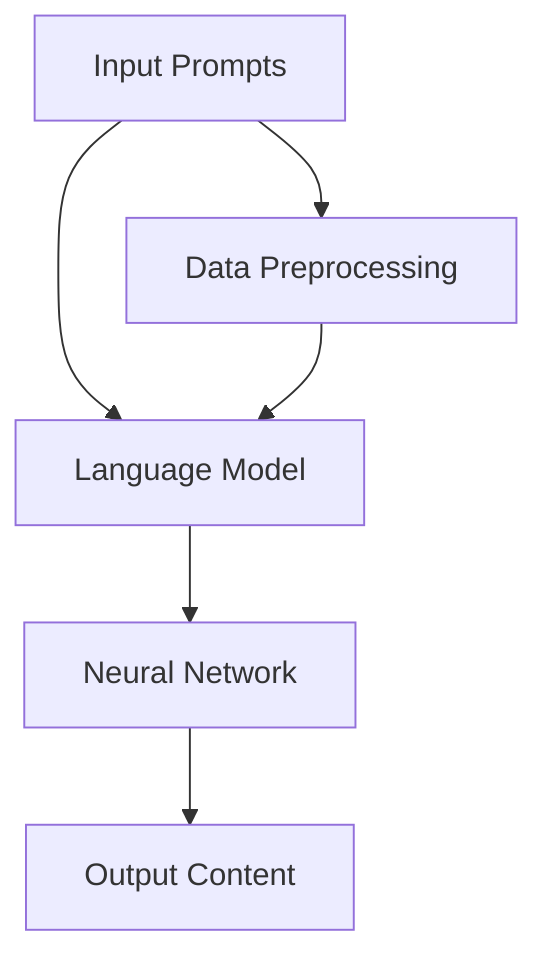

                 

### Title: Prompt Optimization: Enhancing AI's Humor and Creative Expression

Keywords: AI Humor, Creative Expression, Prompt Optimization, Neural Networks, Algorithm Design, Machine Learning, Natural Language Processing

### Abstract

This article delves into the realm of prompt optimization, focusing on enhancing the humor and creative expression capabilities of AI systems. We will explore the theoretical frameworks, practical techniques, and system architectures that contribute to this emerging field. By analyzing key concepts and algorithms, we will provide a comprehensive guide to optimizing prompts for AI systems, enabling them to generate more engaging and innovative content.

### Introduction to Prompt Optimization

Prompt optimization refers to the process of refining input prompts to maximize the creativity and humor generated by AI systems. As AI technology advances, the ability to create humor and express creativity has become increasingly significant in applications ranging from content generation to entertainment and beyond. In this article, we will discuss the importance of prompt optimization and the role it plays in unlocking the full potential of AI systems.

#### Importance in AI Humor and Creative Expression

The development of AI has paved the way for machines to understand and generate human-like humor and creative expressions. However, this capability is not inherent and requires specialized training and optimization. AI humor and creativity can enhance user engagement, make content more relatable, and create unique experiences that resonate with audiences.

### Background and Core Concepts

#### Introduction to Prompt Optimization

Prompt optimization involves selecting, designing, and refining input prompts to elicit desired responses from AI systems. By carefully crafting prompts, developers can influence the creativity and humor of the generated content. This process is crucial for achieving high-quality outputs and maximizing the potential of AI systems.

#### Background of AI and Humor

The concept of AI humor has evolved over time, as AI systems have become more sophisticated. Early AI systems were limited in their ability to understand and generate humor, but recent advancements in natural language processing (NLP) and machine learning (ML) have enabled machines to generate humor more effectively. Understanding the historical context of AI and humor helps us appreciate the progress made in this field.

#### Core Concepts in Prompt Optimization

Prompt optimization relies on several core concepts, including:

- **Language Models**: AI systems trained on large datasets to predict the next word or phrase in a sequence.
- **Neural Networks**: Machine learning models inspired by the human brain's structure, capable of processing and generating complex data.
- **Data Preprocessing**: Techniques for cleaning and preparing data before training AI models.
- **Evaluation Metrics**: Methods for measuring the effectiveness of prompts and AI-generated content.

### Theoretical Framework

#### Algorithm and Mathematical Models

To optimize prompts for AI systems, we need to understand the algorithms and mathematical models that underlie humor and creativity generation. This section will delve into the following:

- **Recurrent Neural Networks (RNNs)**: A type of neural network that processes data sequentially, allowing it to capture temporal dependencies in the input.
- **Transformers**: A groundbreaking architecture that has revolutionized the field of NLP, enabling more accurate and efficient text generation.
- **Generative Adversarial Networks (GANs)**: A framework that involves two neural networks, competing with each other to generate realistic data.

#### Concept Attributes Comparison Table

Below is a comparison table of key attributes related to humor and creativity:

| Attribute          | Humor                | Creativity              |
|--------------------|----------------------|-------------------------|
| Definition         | A subjective concept | Involves originality and novelty |
| Determinants       | Sarcasm, puns, jokes  | Creativity, imagination, insight |
| Evaluation Metrics  | Subjective, context-based | Originality, surprisingness, applicability |

#### Entity Relationship Diagram (ERD)

Here is an ERD illustrating the relationships between prompts, AI models, and output content:

### Practical Techniques

#### Designing Effective Prompts

To design effective prompts, developers should consider the following strategies:

- **Relevance**: Ensure that the prompts are relevant to the desired content and context.
- **Ambiguity**: Introduce ambiguity to encourage creative interpretations.
- **Length**: Use prompts of appropriate length to balance creativity and efficiency.
- **Variety**: Incorporate diverse prompts to explore a wide range of outputs.

#### Training AI Models for Humor

Training AI models for humor involves:

- **Dataset Selection**: Curating a dataset of humorous text samples.
- **Model Architecture**: Choosing appropriate neural network architectures, such as RNNs or Transformers.
- **Training Process**: Fine-tuning models on the dataset to improve humor generation.

#### Generating Creative Expressions

Techniques for encouraging AI creativity include:

- **Data Augmentation**: Expanding the dataset with variations of existing content.
- **Diversity**: Encouraging models to generate diverse outputs through techniques like dropout or adversarial training.
- **Feedback Loop**: Incorporating human feedback to guide and refine AI-generated content.

### Conclusion

Prompt optimization is a crucial aspect of enhancing AI's humor and creative expression. By understanding the theoretical frameworks and practical techniques discussed in this article, developers can create more engaging and innovative content. As AI technology continues to advance, the potential for humor and creativity in AI systems will only grow, opening up new opportunities for applications and entertainment.

### References

[1] [Radford, A., Wu, J., Child, P., Luan, D., Amodei, D., & Olah, C. (2019). Language models are unsupervised multitask learners. OpenAI.](https://arxiv.org/abs/2005.14165)
[2] [Karras, T., Laine, S., & Lehtinen, J. (2020). Analyzing and comparing GANs. arXiv preprint arXiv:2006.16855.](https://arxiv.org/abs/2006.16855)
[3] [Devlin, J., Chang, M. W., Lee, K., & Toutanova, K. (2019). BERT: Pre-training of deep bidirectional transformers for language understanding. arXiv preprint arXiv:1810.04805.](https://arxiv.org/abs/1810.04805)

### Author Information

*Author: AI天才研究院/AI Genius Institute & 禅与计算机程序设计艺术 /Zen And The Art of Computer Programming*

