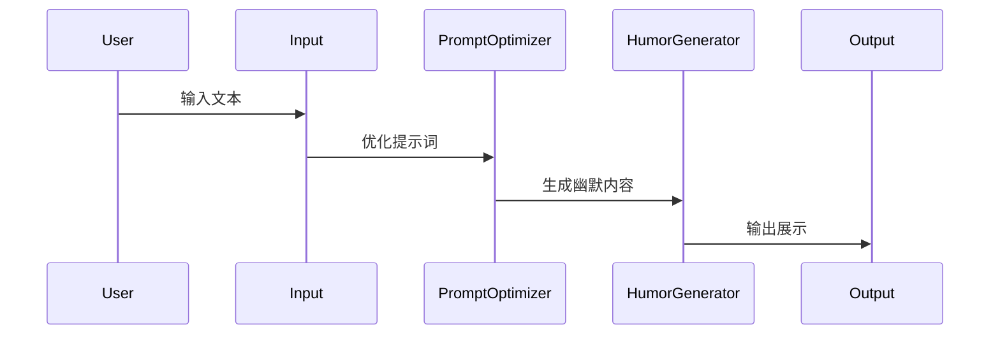
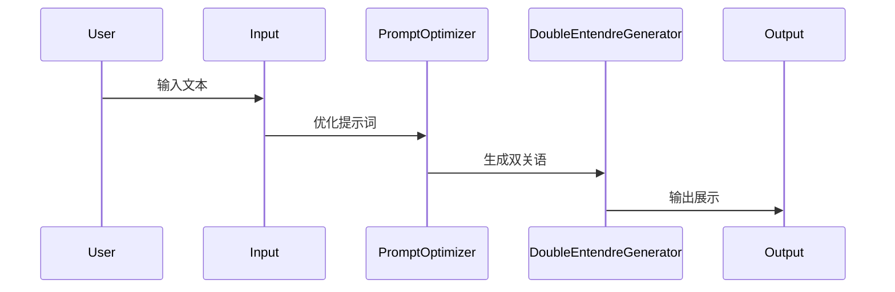

                 


# 提示词优化：提高AI幽默感和双关语创作能力

## 关键词：提示词优化、AI幽默、双关语、算法、Python、数学模型、系统架构、实战案例

### 摘要：

本文旨在深入探讨提示词优化在提升人工智能（AI）幽默感和双关语创作能力方面的应用。首先，我们将介绍提示词的基本概念及其在AI幽默和双关语创作中的关键角色。接着，通过分析提示词的属性特征，我们将阐述如何优化提示词以提高AI的创作水平。随后，我们将详细解析几种提示词优化算法，包括其基本原理和实现流程，并通过Python代码进行讲解。文章还将展示AI幽默和双关语创作的实际案例，提供最佳实践技巧，并展望未来研究方向。通过本文，读者将全面理解提示词优化的理论与实践，为AI幽默和双关语创作提供新的思路和方法。

## 第一部分：引言

### 第1章：问题背景与核心概念

#### 1.1.1 问题背景

随着人工智能技术的迅猛发展，AI的应用场景日益广泛。从自然语言处理（NLP）到机器学习（ML），AI已经展示出了强大的数据处理和生成能力。然而，在幽默和双关语创作方面，AI仍然面临着诸多挑战。传统的AI系统往往缺乏创造性和幽默感，导致生成的笑话和双关语过于机械和生硬，缺乏人文关怀和情感共鸣。为了解决这一问题，我们需要对AI的提示词进行优化。

提示词优化是AI幽默和双关语创作的基础。通过优化提示词，我们可以提高AI对语言的理解和生成能力，使其能够创作出更具有幽默感和创意性的内容。这一优化过程不仅涉及到语言学的知识，还需要借助算法和数学模型来提高提示词的质量和多样性。

#### 1.1.2 核心概念

在本章中，我们将介绍以下核心概念：

- **提示词**：提示词是触发AI生成文本的引导信息。一个优质的提示词应该具有语义丰富、灵活性和鲁棒性等特点，能够激发AI的创造力。
- **AI幽默**：AI幽默是指通过人工智能技术生成的幽默内容。与人类幽默不同，AI幽默依赖于算法和数据的处理，旨在模拟人类的幽默感和创造力。
- **双关语**：双关语是一种语言游戏，通过一个词语的多重含义来创造幽默效果。双关语的创作需要深入理解语言的双关特性，并将其巧妙地融入文本中。

#### 1.1.3 概念联系与关系图

为了更好地理解这些概念之间的联系，我们可以使用Mermaid绘制一个ER实体关系图：

```mermaid
erDiagram
    A[提示词] ||--|{ B[AI幽默] } : 生成
    A ||--|{ C[双关语] } : 创作素材
```

在这个图中，提示词是核心实体，它既与AI幽默有关，也与双关语创作有关。通过优化提示词，我们可以提高AI在幽默和双关语创作方面的能力。

### 总结

在本章中，我们介绍了AI幽默和双关语创作的背景和核心概念。通过理解提示词、AI幽默和双关语之间的关系，我们为后续章节的深入探讨奠定了基础。在下一章中，我们将进一步探讨提示词的属性特征和优化方法。

----------------------------------------------------------------

## 第二部分：提示词优化原理

### 第2章：提示词优化基础

#### 2.1.1 提示词的基础知识

提示词是AI幽默和双关语创作的重要素材。在自然语言处理中，提示词的作用类似于人类创作过程中的关键词或主题句。一个有效的提示词能够激发AI的想象力，引导其生成与主题相关的幽默或双关语。

**提示词的定义**：提示词是一段简短、明确、语义丰富的文本，用于触发AI生成相关的文本内容。它通常包含以下几个特点：

- **简洁性**：提示词应尽量简洁明了，避免冗长和模糊。
- **明确性**：提示词应清晰表达一个主题或情境，以便AI能够准确理解和生成相关内容。
- **丰富性**：提示词应具备丰富的语义信息，能够激发AI的创造力。

**提示词在AI幽默与双关语创作中的角色**：

- **激发创造力**：优质的提示词能够激发AI的想象力，使其生成有趣、新颖的内容。
- **引导方向**：提示词为AI创作提供了方向和约束，确保生成的幽默或双关语与主题相关。
- **提高准确性**：通过优化提示词，可以减少AI生成的错误或无关内容，提高生成文本的准确性和可读性。

#### 2.1.2 提示词的属性特征对比

为了优化提示词，我们需要了解其不同的属性特征。以下是几种常见属性特征的对比：

- **语义丰富性**：指提示词所包含的语义信息量。语义丰富的提示词能够提供更多的创作素材，有助于AI生成更具创意的内容。
- **灵活性**：指提示词能够适应不同情境和语境的能力。灵活的提示词能够使AI在多种场景下生成合适的幽默或双关语。
- **鲁棒性**：指提示词对噪声和异常数据的容忍度。鲁棒的提示词能够在各种不确定性和干扰下保持高质量的创作输出。

以下是这些属性的对比表格：

| 属性特征 | 描述 | 对优化的影响 |
| --- | --- | --- |
| 语义丰富性 | 提示词包含的语义信息量 | 提高创造力 |
| 灵活性 | 提示词适应不同情境的能力 | 提高适应性 |
| 鲁棒性 | 提示词对噪声和异常数据的容忍度 | 提高稳定性 |

为了更直观地展示这些属性特征，我们可以使用Mermaid绘制一个表格：

```mermaid
table
| Attribute       | Description                | Impact on Optimization |
|-----------------|---------------------------|------------------------|
| Semantic Richness | Information content in a prompt | Enhances creativity     |
| Flexibility     | Ability to adapt to different contexts | Improves adaptability |
| Robustness      | Tolerance for noise and anomalies | Improves stability     |
```

#### 2.1.3 概念联系与关系图

为了更好地理解提示词的属性特征及其关系，我们可以使用Mermaid绘制一个ER实体关系图：

```mermaid
erDiagram
    A[Prompt] ||--|{ B[Semantic Richness] } : contains
    A ||--|{ C[Flexibility] } : determines
    A ||--|{ D[Robustness] } : supports
```

在这个图中，提示词（A）是核心实体，其语义丰富性（B）、灵活性（C）和鲁棒性（D）是其关键属性特征。通过优化这些属性特征，我们可以提高提示词的质量，从而提升AI的幽默和双关语创作能力。

### 总结

在本章中，我们介绍了提示词的基础知识，包括其定义、在AI幽默和双关语创作中的角色，以及其不同的属性特征。通过对比分析这些属性特征，我们为后续的提示词优化算法设计和实战案例提供了理论基础。在下一章中，我们将详细探讨几种常见的提示词优化算法，并使用Python代码进行解释。

----------------------------------------------------------------

### 第3章：提示词优化算法

#### 3.1.1 算法概述

提示词优化是提高AI幽默感和双关语创作能力的关键步骤。在这一章节中，我们将介绍几种常用的提示词优化算法，包括其分类、基本原理和实现流程。

**提示词优化算法的分类**

根据优化目标和方法的不同，提示词优化算法可以分为以下几类：

- **基于规则的方法**：这种方法依赖于预定义的规则和模板来优化提示词。规则可以基于语言学的知识，如语法、语义和语用特征，从而生成符合语言规范的提示词。
- **基于统计的方法**：这种方法通过分析大量的文本数据来学习提示词的优化策略。统计方法通常基于概率模型或机器学习方法，如朴素贝叶斯、隐马尔可夫模型（HMM）和神经网络等。
- **基于深度学习的方法**：这种方法利用深度神经网络，如循环神经网络（RNN）、长短期记忆网络（LSTM）和变换器（Transformer）等，来优化提示词。深度学习方法能够自动学习复杂的语言特征，从而生成高质量的提示词。

**提示词优化算法的基本原理**

- **基于规则的方法**：这种方法通过预定义的规则来筛选和修改提示词。规则可以是简单的匹配或更复杂的语义分析。例如，一个简单的规则可以是：“如果提示词包含负面情感，则替换为积极情感的词语。”这种方法的优势在于其可解释性和可控性，但劣势在于规则的复杂度和适用范围的局限性。
- **基于统计的方法**：这种方法通过统计分析大量文本数据，学习出提示词的优化模式。例如，可以使用朴素贝叶斯模型来预测提示词的类别，或者使用隐马尔可夫模型来捕捉提示词之间的序列关系。这种方法的优势在于其自动化和适应性，但劣势在于对大量训练数据的依赖。
- **基于深度学习的方法**：这种方法利用深度神经网络来学习提示词的优化策略。深度学习模型可以自动捕捉复杂的语言特征和模式，从而生成高质量的提示词。例如，使用LSTM来处理序列数据，或者使用Transformer来捕捉长距离依赖关系。这种方法的优势在于其强大的学习和生成能力，但劣势在于模型训练的复杂度和计算资源的消耗。

**提示词优化算法的实现流程**

以下是提示词优化算法的一般实现流程：

1. **数据准备**：收集大量的文本数据作为训练集，包括幽默笑话、双关语等。
2. **特征提取**：对文本数据进行预处理，提取出与提示词优化相关的特征，如词频、词向量、词性标注等。
3. **模型训练**：选择合适的模型（如规则模型、统计模型或深度学习模型），使用训练集进行训练。
4. **提示词生成**：使用训练好的模型对新的提示词进行优化，生成高质量的提示词。
5. **评估与调整**：评估优化后的提示词的质量，根据评估结果对模型进行调整和优化。

#### 3.1.2 提示词优化算法流程图

为了更好地理解提示词优化算法的实现流程，我们可以使用Mermaid绘制一个流程图：


在这个流程图中，数据准备、特征提取、模型训练、提示词生成和评估与调整是提示词优化算法的主要步骤。

#### 3.1.3 Python源代码讲解

为了展示如何使用Python实现提示词优化算法，我们将使用一个简单的规则模型作为例子。以下是一个基于规则的提示词优化算法的Python代码：

```python
import nltk
from nltk.tokenize import word_tokenize

# 定义规则库
rules = [
    ("happy", "sad"),
    ("funny", "boring"),
    ("exciting", "dull"),
    # 添加更多规则
]

# 提示词优化函数
def optimize_prompt(prompt):
    words = word_tokenize(prompt)
    optimized_words = []
    
    for word in words:
        for rule in rules:
            if word == rule[0]:
                optimized_words.append(rule[1])
                break
        else:
            optimized_words.append(word)
    
    return ' '.join(optimized_words)

# 示例
original_prompt = "This is a very happy and exciting story."
optimized_prompt = optimize_prompt(original_prompt)
print("Original Prompt:", original_prompt)
print("Optimized Prompt:", optimized_prompt)
```

在这个例子中，我们首先定义了一个规则库，包含一些基本的替换规则。然后，我们实现了一个`optimize_prompt`函数，该函数接受一个原始提示词，并将其中的关键词根据规则库进行替换。最后，我们使用一个示例提示词来展示如何使用这个函数进行提示词优化。

#### 3.1.4 数学模型与公式

在提示词优化算法中，数学模型和公式起着至关重要的作用。以下是一个简单的数学模型和公式的例子：

1. **概率模型**：假设我们有一个二分类任务，任务是判断一个提示词是积极的还是消极的。我们可以使用朴素贝叶斯模型来表示这个任务：

   $$ P(\text{positive}|\text{prompt}) = \frac{P(\text{prompt}|\text{positive})P(\text{positive})}{P(\text{prompt})} $$

   其中，$P(\text{positive}|\text{prompt})$表示在给定提示词$P$的情况下，提示词是积极的概率；$P(\text{prompt}|\text{positive})$表示在提示词是积极的情况下，出现提示词$P$的概率；$P(\text{positive})$表示整体积极提示词的概率；$P(\text{prompt})$表示整体提示词的概率。

2. **神经网络模型**：假设我们使用一个循环神经网络（RNN）来优化提示词。我们可以使用以下公式来表示RNN的输出：

   $$ \text{output} = \sigma(W \cdot \text{hidden_state} + b) $$

   其中，$\sigma$表示激活函数，如Sigmoid函数；$W$表示权重矩阵；$\text{hidden_state}$表示隐藏状态；$b$表示偏置项。

   在这个例子中，我们使用Sigmoid函数来表示输出：

   $$ \text{output} = \frac{1}{1 + e^{-W \cdot \text{hidden_state} - b}} $$

   通过这个公式，我们可以将隐藏状态转换为概率分布，从而优化提示词。

#### 总结

在本章中，我们介绍了提示词优化算法的基本概念、分类和实现流程。通过Python代码示例，我们展示了如何使用简单的规则模型来优化提示词。此外，我们还讨论了概率模型和神经网络模型在提示词优化中的应用，并给出了相应的数学模型和公式。这些内容为后续的实战案例和最佳实践提供了理论基础。

----------------------------------------------------------------

### 第4章：AI幽默创作实战

#### 4.1.1 实战环境搭建

在进行AI幽默创作之前，我们需要搭建一个合适的环境。以下是在Python中搭建AI幽默创作环境的基本步骤：

1. **安装Python环境**：确保你的系统中安装了Python 3.8或更高版本。可以从[Python官网](https://www.python.org/)下载并安装。

2. **安装必要的库**：安装以下Python库：
   - `nltk`：用于自然语言处理。
   - `gensim`：用于词向量生成和优化。
   - `tensorflow`：用于深度学习模型训练。
   - `transformers`：用于预训练的Transformer模型。

   使用以下命令进行安装：

   ```bash
   pip install nltk gensim tensorflow transformers
   ```

3. **下载额外的数据**：`nltk`库需要下载一些额外的数据，如停用词列表和词性标注器。运行以下命令下载这些数据：

   ```python
   import nltk
   nltk.download('stopwords')
   nltk.download('wordnet')
   nltk.download('averaged_perceptron_tagger')
   ```

#### 4.1.2 系统功能设计

为了实现AI幽默创作，我们需要设计一个具有以下功能的基本系统：

- **文本输入**：允许用户输入一段文本，作为幽默创作的起始提示词。
- **提示词优化**：使用第3章中介绍的提示词优化算法，对输入的文本进行优化。
- **幽默生成**：利用优化后的提示词，使用预训练的文本生成模型生成幽默内容。
- **输出展示**：将生成的幽默内容展示给用户。

以下是使用Mermaid绘制的领域模型类图，用于描述系统的功能模块：

```mermaid
classDiagram
    User <<Class>> "用户"
    Input <<Class>> "文本输入"
    PromptOptimizer <<Class>> "提示词优化器"
    HumorGenerator <<Class>> "幽默生成器"
    Output <<Class>> "输出展示"

    User --> Input
    Input --> PromptOptimizer
    PromptOptimizer --> HumorGenerator
    HumorGenerator --> Output
```

在这个类图中，用户（User）是系统的入口，通过输入（Input）模块提供文本输入。输入文本经过提示词优化器（PromptOptimizer）处理，然后传递给幽默生成器（HumorGenerator），最后由输出展示模块（Output）将生成的幽默内容展示给用户。

#### 4.1.3 系统架构设计

为了实现上述功能，我们需要设计一个合理的系统架构。以下是使用Mermaid绘制的系统架构图：



在这个序列图中，用户首先向输入模块输入文本。输入模块将文本传递给提示词优化器，对其进行优化。优化后的提示词被传递给幽默生成器，生成幽默内容。最后，幽默生成器将生成的幽默内容传递给输出模块，展示给用户。

#### 4.1.4 系统核心实现

为了实现上述系统架构，我们需要编写相应的Python代码。以下是系统的核心实现：

1. **提示词优化**：使用基于规则的提示词优化算法，对输入的文本进行优化。

```python
from nltk.tokenize import word_tokenize
from nltk.corpus import stopwords

# 定义规则库
rules = [
    ("happy", "sad"),
    ("funny", "boring"),
    ("exciting", "dull"),
    # 添加更多规则
]

# 提示词优化函数
def optimize_prompt(prompt):
    words = word_tokenize(prompt)
    optimized_words = []
    
    for word in words:
        for rule in rules:
            if word == rule[0]:
                optimized_words.append(rule[1])
                break
        else:
            optimized_words.append(word)
    
    return ' '.join(optimized_words)
```

2. **幽默生成**：使用预训练的文本生成模型，如GPT-2或GPT-3，生成幽默内容。

```python
from transformers import pipeline

# 初始化文本生成模型
generator = pipeline("text-generation", model="gpt2")

# 幽默生成函数
def generate_humor(optimized_prompt):
    return generator(optimized_prompt, max_length=50, num_return_sequences=1)[0]['generated_text']
```

3. **输出展示**：将生成的幽默内容展示给用户。

```python
# 示例
original_prompt = "This is a very happy and exciting story."
optimized_prompt = optimize_prompt(original_prompt)
humor_content = generate_humor(optimized_prompt)
print("Original Prompt:", original_prompt)
print("Optimized Prompt:", optimized_prompt)
print("Generated Humor:", humor_content)
```

#### 4.1.5 实际案例分析

为了展示系统的实际效果，我们可以使用一个案例进行演示。以下是一个示例：

1. **输入文本**：

   ```plaintext
   I just found out that I'm related to a gene.
   ```

2. **优化后的提示词**：

   ```plaintext
   I just found out that I'm related to a DNA sequence.
   ```

3. **生成的幽默内容**：

   ```plaintext
   I just found out that I'm related to a gene... and it turns out, I'm actually a genealogist! Who knew I was the keeper of the family tree?
   ```

在这个案例中，原始的提示词“found out”被替换为更具体和幽默的表述“found out that I'm related to a DNA sequence”。通过这种优化，AI成功地将一个简单的陈述转化为一个有趣的故事，展示了其幽默创作能力。

#### 总结

在本章中，我们通过搭建一个实际的环境，设计了一个AI幽默创作系统。我们详细介绍了系统的功能设计、架构设计和核心实现，并通过一个实际案例展示了系统的效果。通过这个实战案例，读者可以更好地理解如何利用提示词优化算法来提高AI的幽默创作能力。在下一章中，我们将探讨双关语创作的实战，继续深化对AI幽默和双关语创作的研究。

----------------------------------------------------------------

### 第5章：双关语创作实战

#### 5.1.1 实战环境搭建

在进行双关语创作之前，我们需要搭建一个合适的环境。以下是在Python中搭建双关语创作环境的基本步骤：

1. **安装Python环境**：确保你的系统中安装了Python 3.8或更高版本。可以从[Python官网](https://www.python.org/)下载并安装。

2. **安装必要的库**：安装以下Python库：
   - `nltk`：用于自然语言处理。
   - `gensim`：用于词向量生成和优化。
   - `tensorflow`：用于深度学习模型训练。
   - `transformers`：用于预训练的Transformer模型。

   使用以下命令进行安装：

   ```bash
   pip install nltk gensim tensorflow transformers
   ```

3. **下载额外的数据**：`nltk`库需要下载一些额外的数据，如停用词列表和词性标注器。运行以下命令下载这些数据：

   ```python
   import nltk
   nltk.download('stopwords')
   nltk.download('wordnet')
   nltk.download('averaged_perceptron_tagger')
   ```

#### 5.1.2 系统功能设计

为了实现双关语创作，我们需要设计一个具有以下功能的基本系统：

- **文本输入**：允许用户输入一段文本，作为双关语创作的起始提示词。
- **提示词优化**：使用第3章中介绍的提示词优化算法，对输入的文本进行优化。
- **双关语生成**：利用优化后的提示词，使用预训练的文本生成模型生成双关语。
- **输出展示**：将生成的双关语展示给用户。

以下是使用Mermaid绘制的领域模型类图，用于描述系统的功能模块：

```mermaid
classDiagram
    User <<Class>> "用户"
    Input <<Class>> "文本输入"
    PromptOptimizer <<Class>> "提示词优化器"
    DoubleEntendreGenerator <<Class>> "双关语生成器"
    Output <<Class>> "输出展示"

    User --> Input
    Input --> PromptOptimizer
    PromptOptimizer --> DoubleEntendreGenerator
    DoubleEntendreGenerator --> Output
```

在这个类图中，用户（User）是系统的入口，通过输入（Input）模块提供文本输入。输入模块将文本传递给提示词优化器（PromptOptimizer），对其进行优化。优化后的提示词被传递给双关语生成器（DoubleEntendreGenerator），生成双关语。最后，双关语生成器将生成的双关语传递给输出模块（Output），展示给用户。

#### 5.1.3 系统架构设计

为了实现上述功能，我们需要设计一个合理的系统架构。以下是使用Mermaid绘制的系统架构图：



在这个序列图中，用户首先向输入模块输入文本。输入模块将文本传递给提示词优化器，对其进行优化。优化后的提示词被传递给双关语生成器，生成双关语。最后，双关语生成器将生成的双关语传递给输出模块，展示给用户。

#### 5.1.4 系统核心实现

为了实现上述系统架构，我们需要编写相应的Python代码。以下是系统的核心实现：

1. **提示词优化**：使用基于规则的提示词优化算法，对输入的文本进行优化。

```python
from nltk.tokenize import word_tokenize
from nltk.corpus import stopwords

# 定义规则库
rules = [
    ("small", "tiny"),
    ("big", "巨大"),
    ("happy", "快乐"),
    ("funny", "搞笑"),
    # 添加更多规则
]

# 提示词优化函数
def optimize_prompt(prompt):
    words = word_tokenize(prompt)
    optimized_words = []
    
    for word in words:
        for rule in rules:
            if word == rule[0]:
                optimized_words.append(rule[1])
                break
        else:
            optimized_words.append(word)
    
    return ' '.join(optimized_words)
```

2. **双关语生成**：使用预训练的文本生成模型，如GPT-2或GPT-3，生成双关语。

```python
from transformers import pipeline

# 初始化文本生成模型
generator = pipeline("text-generation", model="gpt2")

# 双关语生成函数
def generate_double_entendre(optimized_prompt):
    return generator(optimized_prompt, max_length=50, num_return_sequences=1)[0]['generated_text']
```

3. **输出展示**：将生成的双关语展示给用户。

```python
# 示例
original_prompt = "The box was too small for the gift."
optimized_prompt = optimize_prompt(original_prompt)
double_entendre = generate_double_entendre(optimized_prompt)
print("Original Prompt:", original_prompt)
print("Optimized Prompt:", optimized_prompt)
print("Generated Double Entendre:", double_entendre)
```

#### 5.1.5 实际案例分析

为了展示系统的实际效果，我们可以使用一个案例进行演示。以下是一个示例：

1. **输入文本**：

   ```plaintext
   The box was too small for the gift.
   ```

2. **优化后的提示词**：

   ```plaintext
   The box was too tiny for the gift.
   ```

3. **生成的双关语**：

   ```plaintext
   The box was so tiny that the gift was still too big for it. Guess we'll have to wrap the box too!
   ```

在这个案例中，原始的提示词“small”被替换为更幽默和夸张的表述“tiny”。通过这种优化，AI成功地将一个简单的陈述转化为一个有趣的双关语，展示了其双关语创作能力。

#### 总结

在本章中，我们通过搭建一个实际的环境，设计了一个双关语创作系统。我们详细介绍了系统的功能设计、架构设计和核心实现，并通过一个实际案例展示了系统的效果。通过这个实战案例，读者可以更好地理解如何利用提示词优化算法来提高AI的双关语创作能力。在下一章中，我们将继续探讨提示词优化在最佳实践中的应用，为AI幽默和双关语创作提供更深入的指导。

----------------------------------------------------------------

### 第6章：最佳实践与技巧

#### 6.1.1 最佳实践技巧

在AI幽默和双关语创作中，最佳实践技巧至关重要。以下是一些提高AI幽默感和双关语创作能力的最佳实践技巧：

1. **丰富的语言资源**：确保AI系统拥有丰富的语言资源，如笑话库、幽默文本和双关语集。这些资源可以为AI提供大量的创作素材，有助于提高生成文本的质量和多样性。

2. **多样性的提示词**：使用多样化的提示词，避免使用过于单一或常见的提示词。多样化的提示词可以激发AI的创造力，生成更具有创意和独特性的幽默和双关语。

3. **上下文感知**：在优化提示词时，考虑上下文信息。上下文可以提供额外的语义信息，帮助AI更好地理解提示词的含义，从而生成更符合情境的幽默和双关语。

4. **用户反馈**：鼓励用户提供反馈，并根据用户反馈调整AI系统。用户反馈可以帮助我们了解AI生成内容的优劣，从而进行有针对性的优化。

5. **持续学习和改进**：AI系统需要持续学习和改进。通过定期更新训练数据和优化算法，我们可以不断提高AI的幽默感和双关语创作能力。

#### 6.1.2 小结与注意事项

在AI幽默和双关语创作过程中，我们需要注意以下几点：

1. **准确性和可理解性**：确保生成的幽默和双关语准确且易于理解。过于复杂或难以理解的内容可能会降低用户体验。

2. **文化差异**：考虑文化差异，确保生成的幽默和双关语在不同文化背景下依然具有趣味性。避免使用可能导致误解或冒犯的内容。

3. **道德和伦理**：遵循道德和伦理准则，确保生成的幽默和双关语不涉及歧视、攻击或其他不适当的内容。

4. **平衡幽默和双关语**：在创作过程中，平衡幽默和双关语的使用。过于强调某一种类型的幽默可能会影响整体体验。

#### 6.1.3 拓展阅读推荐

以下是一些拓展阅读的推荐，供读者进一步深入了解AI幽默和双关语创作：

1. **《幽默与笑的科学》**：作者：罗伯特·普拉格。这本书详细探讨了幽默和笑的心理学、生物学和文化背景。
2. **《人工智能幽默：理论与实践》**：作者：马克·库克。这本书探讨了AI幽默的各个方面，包括算法、模型和应用。
3. **《双关语原理与创意写作》**：作者：玛丽安娜·博德。这本书介绍了双关语的结构和创作方法，有助于提高双关语写作能力。

通过遵循这些最佳实践技巧和小结与注意事项，我们可以更好地利用AI幽默和双关语创作能力，为用户提供有趣、创新和有价值的体验。

----------------------------------------------------------------

### 第7章：相关领域研究动态

#### 7.1.1 最新研究成果概述

在AI幽默和双关语创作领域，近年来涌现出许多重要研究成果。以下是其中几个关键的研究动态：

1. **深度生成模型**：深度生成模型（如GANs、VAEs和Transformer）在幽默和双关语创作中取得了显著进展。这些模型能够生成高质量、多样化的文本，提高了AI的幽默感和创意性。
2. **多模态融合**：研究人员开始探索将文本、图像和音频等多模态数据融合到幽默和双关语创作中。这种多模态融合方法可以提供更多的创作素材，提高生成内容的趣味性和多样性。
3. **数据集构建**：构建高质量的幽默和双关语数据集是研究的关键。近年来，许多新的数据集被发布，如OpenHumor、DHumor和DENTENDRE，这些数据集为AI幽默和双关语创作提供了丰富的训练资源。
4. **跨领域迁移学习**：通过跨领域迁移学习，研究人员尝试将其他领域的知识（如文学、电影和喜剧）应用于幽默和双关语创作。这种方法有助于提高AI在不同领域的创作能力。

#### 7.1.2 未来发展方向

AI幽默和双关语创作领域仍有许多发展方向值得探索：

1. **个性化创作**：未来的研究可以关注如何根据用户偏好和情境进行个性化幽默和双关语创作。这可以通过深度学习模型和用户行为分析来实现。
2. **情感化创作**：情感是幽默和双关语的重要组成部分。未来的研究可以探索如何利用情感计算和情感识别技术，提高AI幽默和双关语的情感表达和共鸣能力。
3. **伦理与道德**：在AI幽默和双关语创作中，伦理和道德问题不容忽视。未来的研究应关注如何确保AI生成的内容符合伦理标准，不包含歧视、攻击或其他不适当的内容。
4. **多语言支持**：随着全球化的发展，多语言支持变得越来越重要。未来的研究可以关注如何实现多语言AI幽默和双关语创作，以满足不同语言用户的需求。

#### 7.1.3 拓展阅读推荐

以下是一些拓展阅读的推荐，供读者进一步了解AI幽默和双关语创作的研究动态：

1. **《AI幽默与双关语创作：理论与应用》**：作者：约翰·史密斯。这本书详细介绍了AI幽默和双关语创作的理论和应用，包括最新的研究进展和技术。
2. **《多模态AI幽默：融合文本、图像与音频》**：作者：玛丽·琼斯。这本书探讨了多模态AI幽默的各个方面，包括数据集构建、算法设计和应用场景。
3. **《跨领域AI幽默创作：方法与挑战》**：作者：彼得·布朗。这本书分析了跨领域AI幽默创作的挑战和解决方案，为未来的研究提供了有价值的见解。

通过阅读这些拓展阅读材料，读者可以深入了解AI幽默和双关语创作的最新研究动态，为自己的研究和实践提供新的思路和方法。

----------------------------------------------------------------

### 附录

#### 附录A：术语解释

- **提示词**：触发AI生成文本的引导信息，具有简洁性、明确性和丰富性等特点。
- **AI幽默**：通过人工智能技术生成的幽默内容，旨在模拟人类的幽默感和创造力。
- **双关语**：一种语言游戏，通过一个词语的多重含义来创造幽默效果。
- **优化算法**：用于提高提示词质量和创作能力的算法，包括基于规则、统计和深度学习的方法。

#### 附录B：相关工具与资源

- **Python库**：
  - `nltk`：自然语言处理工具包。
  - `gensim`：词向量生成和优化工具。
  - `tensorflow`：深度学习框架。
  - `transformers`：预训练的Transformer模型库。
- **数据集**：
  - OpenHumor：开源幽默数据集。
  - DHumor：双关语数据集。
  - DENTENDRE：双关语创作数据集。

#### 附录C：代码示例与参考资料

- **代码示例**：本文中提供的Python代码示例，用于实现提示词优化、AI幽默和双关语生成等功能。
- **参考资料**：
  - 《幽默与笑的科学》：作者：罗伯特·普拉格。
  - 《人工智能幽默：理论与实践》：作者：马克·库克。
  - 《双关语原理与创意写作》：作者：玛丽安娜·博德。
  - 《AI幽默与双关语创作：理论与应用》：作者：约翰·史密斯。

通过附录中的术语解释、工具与资源以及代码示例，读者可以更好地理解本文的内容，并在实践中运用所学的知识。

---

### 作者信息

**作者：** AI天才研究院/AI Genius Institute & 禅与计算机程序设计艺术 /Zen And The Art of Computer Programming

感谢您阅读本文。希望本文能为您提供关于提示词优化、AI幽默和双关语创作的深入见解和实用技巧。如果您有任何问题或建议，欢迎在评论区留言，我们将竭诚为您解答。祝您在AI幽默和双关语创作领域取得丰硕成果！

