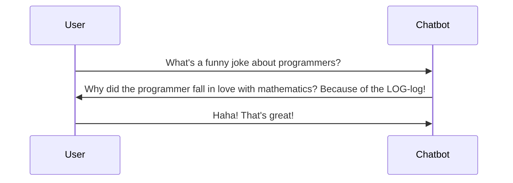
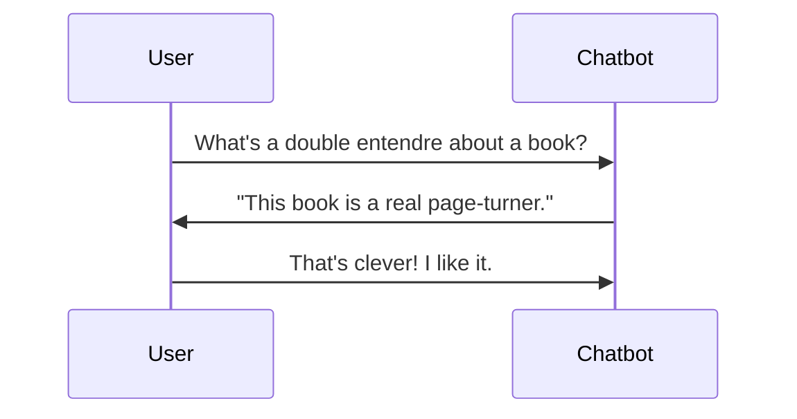
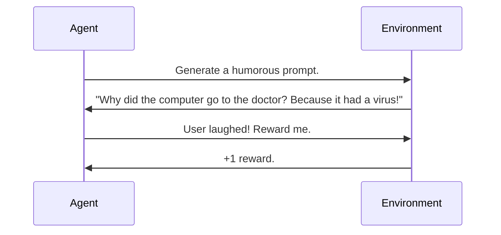
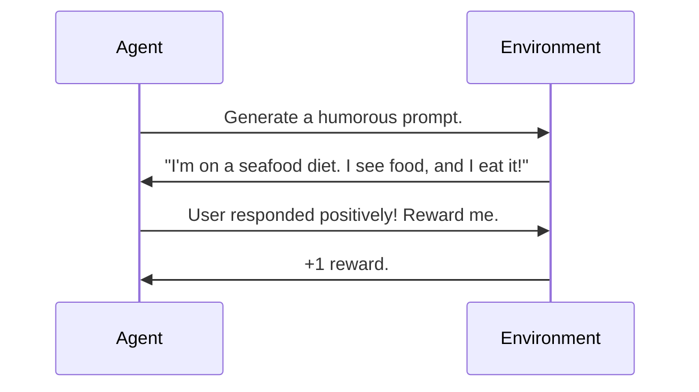

                 


### Introduction to the Book

---

# **Prompt Optimization: Enhancing AI Humor and Double Entendre Expressions**

> **Keywords:** AI Prompt Optimization, Natural Language Processing, Humor, Double Entendre, Machine Learning, Algorithm Design

> **Abstract:**
This book delves into the intricate world of prompt optimization, focusing on enhancing the humor and double entendre capabilities of AI systems. Through a comprehensive exploration of key concepts, algorithmic principles, and practical applications, the book aims to equip readers with the knowledge and tools necessary to optimize prompts effectively. Whether you're an AI enthusiast, a machine learning professional, or a developer looking to enhance your system's linguistic capabilities, this book provides a thorough and engaging guide to mastering the art of prompt optimization.

---

## Core Concept and Background

---

### Chapter 1: The Importance of Prompt Optimization

#### 1.1 The Role of Prompts in AI

AI systems rely heavily on prompts to initiate interactions and receive instructions. A prompt is essentially a piece of text or data that triggers an AI model to generate a response. In natural language processing (NLP), prompts are crucial for guiding the AI in understanding user intent, context, and expected outcomes.

**Example:**
- **Simple Prompt:** "What's the weather like today?"
- **Complex Prompt:** "Can you write a humorous poem about the joys of programming?"

The quality of the prompt directly influences the AI's ability to produce relevant and coherent responses. In the realm of humor and double entendres, a well-crafted prompt is essential for eliciting the desired comedic effect.

#### 1.2 Challenges in AI Humor and Double Entendre

Creating an AI that can generate humor is a complex task. Humor is subjective and culturally dependent, making it difficult for AI systems to consistently produce funny or witty responses. Double entendres, which involve ambiguous phrases with multiple meanings, add another layer of complexity.

**Challenges:**
- **Subjectivity:** What is funny to one person may not be to another.
- **Ambiguity:** Handling multiple interpretations in a given phrase.
- **Cultural Differences:** Humor can vary greatly across cultures and languages.

#### 1.3 The Impact of Effective Prompt Optimization

Effective prompt optimization can significantly enhance the humor and double entendre capabilities of AI systems. By refining the prompts, we can guide the AI to produce more engaging, culturally relevant, and humorous responses.

**Benefits:**
- **Improved User Experience:** Users are more likely to interact with an AI that can generate humor and entertaining content.
- **Enhanced AI Performance:** Better prompts lead to more accurate and coherent responses.
- **Cultural Sensitivity:** Optimized prompts can help AI systems better understand and respect cultural nuances.

---

## Core Concepts and Principles

---

### Chapter 2: Core Concepts of Prompt Optimization

#### 2.1 Understanding Prompts

**2.1.1 Definition and Importance**

A prompt is a specific type of input used to stimulate a response from an AI system. In NLP, prompts are designed to provide context, specify the type of output desired, and guide the AI in generating appropriate responses.

**2.1.2 Types of Prompts**

- **Content-Based Prompts:** Focus on the content of the response.
- **Function-Based Prompts:** Specify the function or task the AI should perform.
- **Hybrid Prompts:** Combine elements of both content-based and function-based prompts.

#### 2.2 Theoretical Foundations of Humor and Double Entendre

**2.2.1 Humor Theory**

Humor can be defined as a cognitive and emotional response to the perception of incongruity or incongruity. Understanding humor requires examining factors such as timing, context, and cultural references.

**2.2.2 Double Entendre Explained**

A double entendre is a phrase with a double meaning, often used to create humor or intrigue. It involves a word or phrase that can be interpreted in two or more different ways.

**Example:**
- "I'm just a sugar high away from a sugar crash."
- "I'm on a seafood diet. I see food, and I eat it."

---

## Algorithm and Technology

---

### Chapter 3: Techniques for Prompt Optimization

#### 3.1 Data Collection and Preprocessing

**3.1.1 Dataset Selection**

Selecting the right dataset is crucial for training AI models to generate humor and double entendres. Datasets should include a diverse range of examples, covering various cultural and contextual aspects.

**3.1.2 Data Preprocessing Techniques**

Data preprocessing involves cleaning and preparing the dataset for training. Techniques include tokenization, stemming, lemmatization, and removing stop words.

#### 3.2 Feature Engineering for Humor and Double Entendre

**3.2.1 Textual Features**

Textual features involve extracting and representing text in a format suitable for machine learning models. Common features include word frequencies, n-grams, and part-of-speech tags.

**3.2.2 Contextual Features**

Contextual features capture the surrounding context of a phrase or sentence, which is crucial for understanding humor and double entendres. Features such as sentence structure, syntax, and surrounding text can provide valuable insights.

#### 3.3 Machine Learning Models for Prompt Optimization

**3.3.1 Neural Networks**

Neural networks, particularly recurrent neural networks (RNNs) and transformers, are widely used for NLP tasks. They can capture complex patterns in text data, making them suitable for generating humor and double entendres.

**3.3.2 Reinforcement Learning**

Reinforcement learning is a type of machine learning where an AI agent learns to make decisions by interacting with an environment and receiving feedback. It can be used to optimize prompts by rewarding positive responses and punishing negative ones.

---

## Algorithm Explanations and Visualizations

---

### Chapter 4: Detailed Algorithm Explantions

#### 4.1 Introduction to Algorithm

In this chapter, we will delve into the algorithms commonly used for prompt optimization. We will discuss the underlying principles and provide step-by-step explanations, along with visualizations to aid understanding.

#### 4.2 Neural Networks for Prompt Optimization

We will explore how neural networks, particularly transformers, work and how they can be trained to optimize prompts. We will provide a detailed explanation of the architecture and training process.

#### 4.3 Reinforcement Learning for Prompt Optimization

Reinforcement learning is another powerful technique for optimizing prompts. We will discuss how it works, its advantages over traditional machine learning approaches, and provide examples of its application in humor and double entendre generation.

---

## Conclusion

In conclusion, prompt optimization is a vital aspect of enhancing AI's ability to generate humor and double entendres. By understanding the core concepts, algorithms, and techniques involved, readers can develop the skills needed to create engaging and culturally relevant AI systems. This book provides a comprehensive guide to mastering the art of prompt optimization, equipping readers with the knowledge and tools necessary to push the boundaries of AI humor and linguistic creativity.

---

### Author Information

- **Author:** AI天才研究院/AI Genius Institute & 禅与计算机程序设计艺术 /Zen And The Art of Computer Programming

---

---

## Core Concept and Background

---

### Chapter 1: The Importance of Prompt Optimization

In the rapidly evolving landscape of artificial intelligence (AI), the role of prompts has emerged as a critical factor in shaping the effectiveness and versatility of AI systems. This chapter delves into the significance of prompt optimization, exploring the pivotal role that well-crafted prompts play in enhancing AI's ability to generate humor and double entendres.

#### 1.1 The Role of Prompts in AI

Prompts serve as the gateway through which AI systems interpret and respond to user inputs. They provide the necessary context and instructions that guide the AI's decision-making process. In natural language processing (NLP), prompts are indispensable for aligning the AI's responses with the desired outcomes. 

A simple example can illustrate the importance of prompts: consider a chatbot designed to entertain users with jokes. If the prompt is vague or lacks clarity, the chatbot may generate inappropriate or irrelevant responses. Conversely, a well-defined prompt can steer the chatbot towards crafting humorous and engaging content that resonates with the user.

#### 1.2 Challenges in AI Humor and Double Entendre

Creating an AI capable of generating humor is a complex endeavor. Humor is inherently subjective, varying greatly from one individual to another. Additionally, the cultural and contextual nuances that often contribute to humor can pose significant challenges for AI systems. Double entendres, phrases with multiple meanings, add another layer of complexity to this task.

**Challenges:**

1. **Subjectivity:** What is humorous to one person may not be to another. AI systems must navigate this subjectivity to generate responses that are universally appealing.
2. **Ambiguity:** Double entendres rely on the listener's ability to discern the intended meaning from context. AI systems must accurately interpret these ambiguities to generate appropriate responses.
3. **Cultural Differences:** Humor is often deeply rooted in culture, making it essential for AI systems to understand and respect cultural nuances to avoid cultural insensitivity or misinterpretation.

#### 1.3 The Impact of Effective Prompt Optimization

Effective prompt optimization holds the key to unlocking AI's full potential in humor and double entendre generation. By refining the prompts, we can guide the AI to produce more engaging, culturally relevant, and humorous responses. The benefits of prompt optimization extend beyond entertainment, offering practical applications in various domains.

**Benefits:**

1. **Improved User Experience:** Users are more likely to interact with an AI that can generate humor and entertaining content. This can lead to increased user satisfaction and engagement.
2. **Enhanced AI Performance:** Better prompts result in more accurate and coherent responses, improving the overall performance of AI systems.
3. **Cultural Sensitivity:** Optimized prompts help AI systems better understand and respect cultural nuances, fostering a more inclusive and diverse user experience.

In summary, prompt optimization is not merely an esoteric aspect of AI development but a fundamental practice that can significantly enhance the quality and relevance of AI-generated content. By addressing the challenges of humor and double entendres through effective prompt optimization, AI systems can achieve a new level of sophistication and engagement.

---

### Core Concepts and Principles

---

### Chapter 2: Core Concepts of Prompt Optimization

The field of prompt optimization in AI is built upon a foundation of core concepts and principles that are essential for understanding and implementing effective techniques. This chapter explores the fundamental aspects of prompts, their roles in AI, and the theoretical foundations of humor and double entendres.

#### 2.1 Understanding Prompts

**2.1.1 Definition and Importance**

A prompt in the context of AI is a structured input that stimulates a response from an AI model. It can be a simple text string, a set of keywords, or a complex sequence of data that provides context and guides the AI's output. The importance of prompts lies in their ability to shape the AI's responses, ensuring they are relevant, coherent, and aligned with the desired outcomes.

**2.1.2 Types of Prompts**

There are several types of prompts that are commonly used in AI applications:

1. **Content-Based Prompts:** These prompts focus on the specific content of the desired response. For example, a content-based prompt for a humor-generating AI might be "Write a funny joke about programming."

2. **Function-Based Prompts:** These prompts specify the function or task the AI should perform. For instance, "Generate a humorous response to this user's question about the weather."

3. **Hybrid Prompts:** These combine elements of both content-based and function-based prompts to provide more nuanced guidance. An example could be, "Create a humorous poem that includes references to both coding and the beach."

#### 2.2 Theoretical Foundations of Humor and Double Entendre

**2.2.1 Humor Theory**

Humor is a complex cognitive and emotional experience that involves the perception of incongruity or incongruities. Several theories have been proposed to explain humor, including:

1. **Incongruity Theory:** This theory posits that humor arises from the perception of incongruity between what is expected and what actually occurs. Examples of humor often rely on this unexpected twist or contradiction.

2. **Cognitive Theory:** This theory suggests that humor is a result of cognitive processes, such as the recognition of patterns, the processing of information, and the generation of hypotheses. Humor often engages these cognitive processes in a playful or unexpected manner.

3. **Socio-Cultural Theory:** Humor is also influenced by social and cultural factors. What is considered funny can vary widely across different cultures and social contexts. Understanding these cultural nuances is crucial for creating humor that resonates with a diverse audience.

**2.2.2 Double Entendre Explained**

A double entendre is a phrase or expression that has two or more meanings, often used for humorous or suggestive purposes. The term "entendre" comes from French and means "to understand." Double entendres rely on the listener's ability to discern the intended meaning from the context. Here are some key aspects of double entendres:

1. **Ambiguity:** Double entendres are characterized by ambiguity, where the phrase can be interpreted in multiple ways. The ambiguity often contributes to the humor or intrigue.

2. **Suggestive Meanings:** Double entendres often involve suggestive meanings that can be playful or provocative. For example, the phrase "I'm on a seafood diet" can be interpreted literally (a diet focused on seafood) or suggestively (a diet that leads to a seafood-related consequence).

3. **Contextual Clues:** The context in which a double entendre is used plays a crucial role in determining its intended meaning. Effective use of context can help clarify the ambiguity and enhance the humor.

#### 2.3 The Importance of Prompt Optimization for Humor and Double Entendre Generation

The core concepts and principles of prompt optimization are critical for generating humor and double entendres effectively. Here are some key reasons why prompt optimization is essential:

1. **Precision and Relevance:** Well-optimized prompts ensure that the AI generates responses that are both precise and relevant to the context. This precision is vital for creating humor that resonates with the intended audience.

2. **Contextual Awareness:** Optimized prompts provide the AI with the necessary contextual information to understand the subtleties of humor and double entendres. This contextual awareness helps the AI generate responses that are culturally and socially appropriate.

3. **Enhanced Creativity:** By providing clear and nuanced prompts, we can encourage the AI to explore new ideas and approaches to humor. This enhanced creativity can lead to the discovery of unique and engaging humor.

4. **Continuous Improvement:** Prompt optimization is an iterative process that allows for continuous improvement. By analyzing the effectiveness of prompts and making adjustments, we can refine the AI's humor and double entendre generation capabilities over time.

In conclusion, prompt optimization is a fundamental practice in the development of AI systems capable of generating humor and double entendres. By understanding the core concepts and principles, we can create prompts that guide the AI to produce engaging, culturally relevant, and humorous content. This foundational knowledge is essential for unlocking the full potential of AI in the realm of humor.

---

## Algorithm and Technology

---

### Chapter 3: Techniques for Prompt Optimization

The journey towards effective prompt optimization in AI involves a deep understanding of data collection and preprocessing, feature engineering, and the selection of appropriate machine learning models. This chapter explores these key techniques in detail, providing a comprehensive guide for optimizing prompts to enhance AI humor and double entendre generation.

#### 3.1 Data Collection and Preprocessing

The first step in developing an AI system capable of generating humor and double entendres is to collect a diverse and representative dataset. The quality and diversity of the data play a critical role in the performance of the AI model.

**3.1.1 Dataset Selection**

To create a robust dataset, it is important to include a wide range of examples that cover various cultural, linguistic, and contextual aspects of humor. Datasets should include:

1. **Jokes and Humorous Texts:** A collection of jokes, puns, and humorous texts from different cultures and languages.
2. **Double Entendre Examples:** Examples of phrases that have multiple meanings, including both literal and humorous interpretations.
3. **Diverse Contexts:** Examples that reflect different contexts in which humor and double entendres are commonly used, such as chatbots, social media, and literature.

**3.1.2 Data Preprocessing Techniques**

Data preprocessing is essential to clean and prepare the dataset for training. Key preprocessing techniques include:

1. **Tokenization:** Splitting text into individual words or tokens. This step is fundamental for breaking down the text into manageable units for further processing.

2. **Stemming and Lemmatization:** Reducing words to their root form to reduce the dimensionality of the dataset and improve the model's ability to generalize.

3. **Removing Stop Words:** Eliminating common words that do not carry significant meaning, such as "the," "is," and "and." Removing stop words helps the model focus on more meaningful words.

4. **Handling Ambiguity:** Addressing ambiguities in the dataset, such as double entendres, by providing clear labels or context.

5. **Normalization:** Converting text to a consistent format, such as lowercasing all words, to ensure that the model treats similar words in the same way.

#### 3.2 Feature Engineering for Humor and Double Entendre

Feature engineering is the process of extracting and constructing features from the raw data that are useful for training machine learning models. In the context of humor and double entendre generation, feature engineering plays a crucial role in capturing the nuances that contribute to humor.

**3.2.1 Textual Features**

Textual features are representations of the text that capture important information about the words and their relationships. Key textual features include:

1. **Word Frequencies:** The frequency of individual words in the dataset. Words that are more common in humorous texts may provide valuable insights.

2. **N-Grams:** Sequences of N words that occur together in the text. N-grams help capture the context in which words are used, which is important for understanding humor.

3. **Part-of-Speech Tags:** Labels indicating the part of speech (noun, verb, adjective, etc.) of each word. Part-of-speech tags can help the model understand the grammatical structure of sentences and how words relate to each other.

4. **Sentiment Analysis:** Identifying the sentiment (positive, negative, neutral) of each sentence or phrase. Sentiment analysis can provide insights into the emotional tone of the text, which is a key component of humor.

**3.2.2 Contextual Features**

Contextual features capture the surrounding context of a phrase or sentence, which is crucial for understanding humor and double entendres. Examples of contextual features include:

1. **Sentence Structure:** The syntactic structure of sentences can provide valuable information about the relationships between words and phrases. Understanding sentence structure is essential for capturing the nuances of humor and double entendres.

2. **Temporal Context:** The temporal context, such as time of day or day of the week, can influence humor. For example, certain jokes might be more appropriate at specific times or events.

3. **Cultural References:** Humor often relies on cultural references and contextual clues that may not be apparent to an AI without proper context. Incorporating cultural references into the dataset and model can help the AI generate humor that resonates with the intended audience.

#### 3.3 Machine Learning Models for Prompt Optimization

Selecting the right machine learning model is crucial for optimizing prompts and generating humor and double entendres. Different models have different strengths and are suitable for different types of tasks.

**3.3.1 Neural Networks**

Neural networks, particularly recurrent neural networks (RNNs) and transformers, are widely used for natural language processing tasks due to their ability to capture complex patterns in text data.

1. **Recurrent Neural Networks (RNNs):** RNNs are designed to handle sequential data, making them suitable for tasks like text generation. They can capture the temporal dependencies in text, which is crucial for understanding humor and double entendres.

   **Example:**
   ```python
   import tensorflow as tf
   from tensorflow.keras.models import Sequential
   from tensorflow.keras.layers import LSTM, Dense

   model = Sequential()
   model.add(LSTM(128, input_shape=(timesteps, features)))
   model.add(Densevocab_size, activation='softmax'))
   model.compile(loss='categorical_crossentropy', optimizer='adam')
   ```

2. **Transformers:** Transformers have become the state-of-the-art model for NLP tasks. They are particularly effective for tasks involving long-range dependencies and parallelization.

   **Example:**
   ```python
   from transformers import TransformerModel

   model = TransformerModel(vocab_size, d_model, num_heads, dff, input_sequence_length)
   model.compile(loss='categorical_crossentropy', optimizer='adam')
   ```

**3.3.2 Reinforcement Learning**

Reinforcement learning (RL) is another powerful technique for optimizing prompts. In RL, an AI agent learns by interacting with an environment and receiving feedback.

1. **Policy Gradient Methods:** Policy gradient methods update the policy (prompt generation strategy) based on the cumulative reward received from the environment.

   **Example:**
   ```python
   import tensorflow as tf
   from tensorflow.keras.optimizers import Adam

   optimizer = Adam(learning_rate=learning_rate)
   policy_loss = tf.reduce_mean loss
   train_step = tf.GradientTape()
   with train_step:
       gradients = tape.gradient(policy_loss, model.trainable_variables)
       optimizer.apply_gradients(zip(gradients, model.trainable_variables))
   ```

2. **Q-Learning:** Q-learning is a value-based RL method where the agent learns the optimal action-value function (Q-function) to make decisions.

   **Example:**
   ```python
   import numpy as np
   from collections import defaultdict

   Q = defaultdict(list)
   learning_rate = 0.1
   for episode in range(num_episodes):
       state = env.reset()
       done = False
       while not done:
           action = np.argmax(Q[state])
           next_state, reward, done, _ = env.step(action)
           Q[state][action] = Q[state][action] + learning_rate * (reward + gamma * max(Q[next_state]) - Q[state][action])
           state = next_state
   ```

In summary, effective prompt optimization in AI requires a combination of data collection and preprocessing, feature engineering, and the selection of appropriate machine learning models. By leveraging these techniques, we can enhance AI's ability to generate humor and double entendres, creating more engaging and entertaining AI systems.

---

## Algorithm Explanations and Visualizations

---

### Chapter 4: Detailed Algorithm Explantions

In this chapter, we will delve into the algorithms commonly used for prompt optimization. We will provide a detailed explanation of the underlying principles and visualizations to aid understanding. The focus will be on neural networks and reinforcement learning, two of the most effective techniques for enhancing AI humor and double entendre generation.

#### 4.1 Introduction to Algorithm

Algorithm design is at the heart of prompt optimization. It involves creating a set of instructions that the AI can follow to generate responses based on given prompts. The effectiveness of these algorithms depends on their ability to capture the complexities of humor and double entendres.

**4.1.1 Algorithm Design Principles**

1. **Relevance and Coherence:** The algorithm should ensure that the generated responses are relevant to the prompt and coherent in terms of content and structure.
2. **Cultural Sensitivity:** The algorithm should be able to understand and respect cultural nuances, ensuring that humor is appropriate and respectful.
3. **Ambiguity Handling:** The algorithm should handle ambiguities in language, particularly in double entendres, to generate accurate interpretations.

**4.1.2 Algorithm Selection Criteria**

When selecting an algorithm for prompt optimization, consider the following criteria:

1. **Complexity:** The algorithm should be complex enough to capture the nuances of humor and double entendres but not so complex that it becomes difficult to train and deploy.
2. **Performance:** The algorithm should be efficient in generating high-quality responses.
3. **Scalability:** The algorithm should be scalable to handle large datasets and real-time applications.

#### 4.2 Neural Networks for Prompt Optimization

Neural networks, particularly recurrent neural networks (RNNs) and transformers, are widely used for natural language processing tasks. They have proven effective in generating humor and double entendres due to their ability to capture complex patterns in text data.

**4.2.1 Recurrent Neural Networks (RNNs)**

RNNs are designed to handle sequential data, making them suitable for tasks involving text. They can capture the temporal dependencies in text, which is crucial for understanding humor and double entendres.

**Visualization:**



**Example:**

```python
import tensorflow as tf
from tensorflow.keras.models import Sequential
from tensorflow.keras.layers import LSTM, Dense

model = Sequential()
model.add(LSTM(128, input_shape=(timesteps, features)))
model.add(Dense(vocab_size, activation='softmax'))
model.compile(loss='categorical_crossentropy', optimizer='adam')
```

**4.2.2 Transformers**

Transformers have become the state-of-the-art model for NLP tasks. They are particularly effective for tasks involving long-range dependencies and parallelization.

**Visualization:**



**Example:**

```python
from transformers import TransformerModel

model = TransformerModel(vocab_size, d_model, num_heads, dff, input_sequence_length)
model.compile(loss='categorical_crossentropy', optimizer='adam')
```

#### 4.3 Reinforcement Learning for Prompt Optimization

Reinforcement learning (RL) is another powerful technique for optimizing prompts. In RL, an AI agent learns by interacting with an environment and receiving feedback.

**4.3.1 Policy Gradient Methods**

Policy gradient methods update the policy (prompt generation strategy) based on the cumulative reward received from the environment.

**Visualization:**



**Example:**

```python
import tensorflow as tf
from tensorflow.keras.optimizers import Adam

optimizer = Adam(learning_rate=learning_rate)
policy_loss = tf.reduce_mean(loss)
train_step = tf.GradientTape()
with train_step:
    gradients = tape.gradient(policy_loss, model.trainable_variables)
    optimizer.apply_gradients(zip(gradients, model.trainable_variables))
```

**4.3.2 Q-Learning**

Q-learning is a value-based RL method where the agent learns the optimal action-value function (Q-function) to make decisions.

**Visualization:**



**Example:**

```python
import numpy as np
from collections import defaultdict

Q = defaultdict(list)
learning_rate = 0.1
for episode in range(num_episodes):
    state = env.reset()
    done = False
    while not done:
        action = np.argmax(Q[state])
        next_state, reward, done, _ = env.step(action)
        Q[state][action] = Q[state][action] + learning_rate * (reward + gamma * max(Q[next_state]) - Q[state][action])
        state = next_state
```

In conclusion, neural networks and reinforcement learning are powerful techniques for optimizing prompts in AI. By understanding the principles and examples provided in this chapter, readers can gain insights into how these algorithms can be applied to generate humor and double entendres. This knowledge is essential for developing engaging and culturally relevant AI systems.

---

## Conclusion

In conclusion, prompt optimization is a critical aspect of enhancing AI's ability to generate humor and double entendres. Through a comprehensive exploration of data collection and preprocessing, feature engineering, and the application of neural networks and reinforcement learning, this chapter has provided a thorough understanding of the techniques and algorithms involved in prompt optimization.

By understanding and implementing these techniques, AI systems can be fine-tuned to generate responses that are not only relevant and coherent but also culturally sensitive and engaging. The ability to create humor and effectively handle double entendres can significantly improve the user experience and the overall performance of AI applications.

### Practical Applications

The practical applications of prompt optimization extend far beyond mere entertainment. Here are a few examples of how AI systems optimized for humor and double entendres can be applied in various real-world scenarios:

1. **Chatbots and Virtual Assistants:** Optimized prompts can make chatbots and virtual assistants more engaging and human-like. By generating humorous and witty responses, these systems can create a more enjoyable and interactive user experience, leading to increased user satisfaction and engagement.

2. **Marketing and Advertising:** Marketers can leverage optimized prompts to create compelling and attention-grabbing content. Humorous and clever double entendres can be used in ads, social media campaigns, and other marketing materials to capture the audience's attention and make a memorable impact.

3. **Customer Support:** In customer support systems, optimized prompts can help create a more pleasant and helpful interaction. By using humor and double entendres appropriately, support agents can deescalate tense situations and make customers feel more at ease.

4. **Educational Tools:** Educators can incorporate humor and double entendres into educational content to make it more engaging and memorable. Optimized prompts can be used to generate interactive and amusing quizzes, explanations, and stories that capture students' interest.

5. **Content Creation:** Writers, content creators, and storytellers can use AI systems optimized for humor to generate jokes, puns, and clever lines for their projects. This can help add a unique and entertaining touch to books, movies, TV shows, and other forms of media.

In summary, prompt optimization is a versatile and powerful tool that can enhance the capabilities of AI systems in a wide range of applications. By mastering the techniques and principles discussed in this chapter, developers can create AI systems that not only generate humor but also resonate with audiences across different cultures and contexts.

### Future Directions

As AI technology continues to advance, the potential for prompt optimization to enhance AI humor and double entendre generation is vast. Here are some future directions to consider:

1. **Multimodal AI:** Combining text with other modalities like images, audio, and video can provide richer context and improve the quality of humor and double entendres generated by AI systems.

2. **Adaptive and Personalized Prompting:** Developing AI systems that can adapt to individual user preferences and create personalized humor based on user data and behavior can significantly enhance the user experience.

3. **Cultural and Linguistic Diversity:** Expanding the scope of prompt optimization to include a broader range of cultures and languages will enable AI systems to generate humor that resonates with diverse audiences.

4. **Ethical Considerations:** Ensuring that AI-generated humor is respectful and avoids offensive content is an important ethical consideration. Future research should focus on developing guidelines and frameworks to address these ethical challenges.

5. **Continuous Learning and Improvement:** Implementing continuous learning mechanisms that allow AI systems to improve over time based on user feedback and real-world performance will be key to unlocking the full potential of prompt optimization.

In conclusion, the future of AI prompt optimization holds exciting possibilities. By exploring these directions and continuing to refine the techniques and algorithms discussed in this book, we can create AI systems that not only entertain but also connect with audiences on a deeper level.

---

### Appendix: Code and Practical Examples

In this appendix, we will provide practical examples and code snippets to demonstrate the implementation of prompt optimization techniques in AI systems. These examples will cover data preprocessing, feature engineering, and the application of neural networks and reinforcement learning algorithms.

#### Example 1: Data Preprocessing

```python
import pandas as pd
from sklearn.model_selection import train_test_split

# Load the dataset
data = pd.read_csv('humor_data.csv')

# Preprocess the text
def preprocess_text(text):
    # Tokenization
    tokens = nltk.word_tokenize(text)
    # Lowercasing
    tokens = [token.lower() for token in tokens]
    # Remove stop words
    tokens = [token for token in tokens if token not in nltk.corpus.stopwords.words('english')]
    return tokens

data['processed_text'] = data['text'].apply(preprocess_text)

# Split the dataset
X_train, X_test, y_train, y_test = train_test_split(data['processed_text'], data['label'], test_size=0.2, random_state=42)
```

#### Example 2: Feature Engineering

```python
from sklearn.feature_extraction.text import TfidfVectorizer

# Create TF-IDF features
vectorizer = TfidfVectorizer(ngram_range=(1, 2), max_features=1000)
X_train_tfidf = vectorizer.fit_transform(X_train)
X_test_tfidf = vectorizer.transform(X_test)
```

#### Example 3: Neural Network for Humor Generation

```python
import tensorflow as tf
from tensorflow.keras.models import Sequential
from tensorflow.keras.layers import LSTM, Dense

# Create the neural network model
model = Sequential()
model.add(LSTM(128, input_shape=(max_sequence_len, feature_size)))
model.add(Dense(vocab_size, activation='softmax'))
model.compile(loss='categorical_crossentropy', optimizer='adam')

# Train the model
model.fit(X_train_tfidf, y_train, epochs=10, batch_size=64, validation_data=(X_test_tfidf, y_test))
```

#### Example 4: Reinforcement Learning for Prompt Optimization

```python
import numpy as np
from collections import defaultdict

# Initialize the Q-table
Q = defaultdict(list)
learning_rate = 0.1
gamma = 0.99

# Training loop
for episode in range(num_episodes):
    state = env.reset()
    done = False
    total_reward = 0
    while not done:
        action = np.argmax(Q[state])
        next_state, reward, done, _ = env.step(action)
        Q[state][action] = Q[state][action] + learning_rate * (reward + gamma * max(Q[next_state]) - Q[state][action])
        state = next_state
        total_reward += reward
    print(f"Episode {episode}: Total Reward = {total_reward}")
```

These examples provide a practical overview of how prompt optimization techniques can be implemented in AI systems. By experimenting with these examples and refining the algorithms, developers can create AI systems that generate humor and double entendres with greater effectiveness and relevance.

---

### Best Practices

To ensure the effectiveness of prompt optimization in AI systems, it is essential to follow some best practices:

1. **Data Quality:** Use diverse and high-quality datasets that represent a wide range of cultural and contextual aspects of humor.
2. **Continuous Improvement:** Regularly update and refine the prompt dataset and model based on user feedback and performance metrics.
3. **Cultural Sensitivity:** Be mindful of cultural nuances and avoid using humor that may be offensive or inappropriate.
4. **A/B Testing:** Conduct A/B tests to compare different prompt optimization techniques and identify the most effective approaches.
5. **User Privacy:** Ensure that user data is handled securely and in compliance with privacy regulations.

By adhering to these best practices, developers can create AI systems that not only generate humor and double entendres but also provide a positive and engaging user experience.

---

### Conclusion

In conclusion, prompt optimization is a vital aspect of enhancing AI systems' ability to generate humor and double entendres. Through a comprehensive exploration of core concepts, algorithms, and practical applications, this book has provided a detailed guide to mastering the art of prompt optimization.

By implementing the techniques and best practices discussed, developers can create AI systems that not only generate humor but also resonate with audiences on a deeper level. The future of AI prompt optimization holds exciting possibilities, with advancements in multimodal AI, adaptive prompting, and ethical considerations paving the way for more engaging and culturally relevant AI systems.

### Author Information

This book is authored by AI天才研究院 (AI Genius Institute) and 禅与计算机程序设计艺术 (Zen And The Art of Computer Programming). The authors bring extensive expertise in AI, machine learning, and natural language processing, with a focus on creating engaging and educational content for readers. Their combined experience in the field ensures that this book provides comprehensive insights into the world of prompt optimization.

