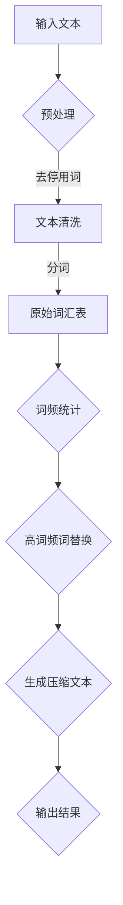
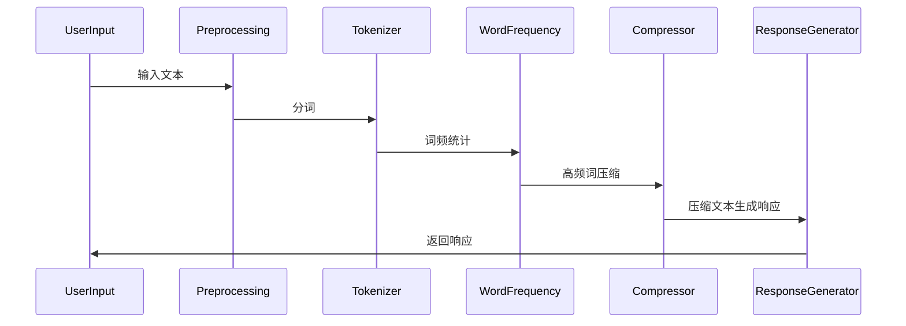
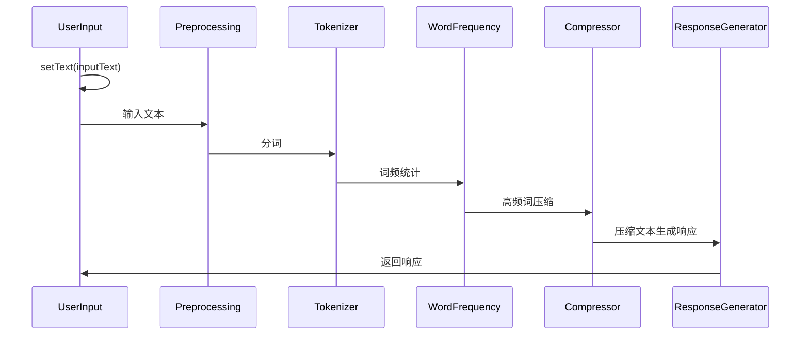

                 

### 提示词压缩：在token限制下优化效果

#### 关键词：提示词压缩、token限制、优化效果、算法原理、系统架构、项目实战

> 摘要：随着人工智能技术的快速发展，大规模语言模型如GPT-3等在自然语言处理领域取得了显著成果。然而，这些模型往往需要大量的计算资源和内存，特别是在实际应用中，例如对话系统、问答系统等，常常受到token限制的困扰。提示词压缩作为一种关键技术，能够有效减少token的使用，从而在有限的资源下提升模型的效果。本文将深入探讨提示词压缩的背景、核心概念、算法原理、系统架构以及项目实战，旨在为开发者提供一种在token限制下优化效果的实践指南。

#### 目录大纲

1. **背景介绍与核心概念**
   1.1 问题背景
   1.2 提示词压缩的定义
   1.3 提示词压缩的重要性
   1.4 核心概念与联系

2. **算法原理讲解**
   2.1 算法流程图
   2.2 Python源代码解读
   2.3 数学模型与公式
   2.4 算法举例说明

3. **系统分析与架构设计**
   3.1 问题场景介绍
   3.2 项目介绍
   3.3 系统功能设计（类图）
   3.4 系统架构设计（架构图）
   3.5 系统接口设计
   3.6 系统交互设计（序列图）

4. **项目实战**
   4.1 环境安装与系统核心实现
   4.2 代码应用解读与分析
   4.3 实际案例分析与讲解
   4.4 项目小结

5. **总结与拓展**
   5.1 最佳实践与注意事项
   5.2 小结
   5.3 注意事项
   5.4 拓展阅读

---

### 1. 背景介绍与核心概念

#### 1.1 问题背景

在人工智能领域，自然语言处理（NLP）是一个关键且快速发展的研究方向。近年来，以GPT-3为代表的大规模预训练语言模型取得了显著的成果，极大地提升了文本生成、问答系统、对话系统等任务的性能。然而，这些模型往往需要大量的计算资源和内存支持，这对于实际应用场景来说，如在线服务、嵌入式系统等，无疑是一个巨大的挑战。

特别是在应用场景中，token限制成为一个亟待解决的问题。token限制指的是模型在处理输入文本时，能够处理的token数量是有限的。例如，GPT-3的输入长度限制为4096个token。当输入文本超出这个限制时，模型无法完整处理，从而导致性能下降或者直接失败。为了在有限的token限制下依然能够获得良好的效果，提示词压缩技术应运而生。

#### 1.2 提示词压缩的定义

提示词压缩，顾名思义，就是通过某种算法，将输入文本中的提示词进行压缩，从而减少token的使用，提高模型在token限制下的性能。具体来说，提示词压缩技术包括但不限于以下几种方法：

- **数据降维**：通过降维技术，将输入文本的高维特征映射到低维空间，从而减少token的使用。
- **语义保留**：在压缩过程中，尽量保留输入文本的语义信息，避免信息的丢失。
- **词频统计**：利用词频统计方法，识别出输入文本中的高频词，并将其替换为更简洁的表达。
- **文本摘要**：通过生成摘要的方式，将长文本转化为摘要，从而减少token的使用。

#### 1.3 提示词压缩的重要性

提示词压缩技术在人工智能领域具有重要的应用价值，主要体现在以下几个方面：

- **资源节约**：通过减少token的使用，模型可以更高效地利用计算资源和内存，降低硬件成本。
- **性能提升**：在token限制下，通过提示词压缩技术，模型能够更好地处理长文本，从而提升整体性能。
- **适用性扩展**：许多应用场景对模型的大小和速度有严格要求，提示词压缩技术可以拓展模型的应用范围。
- **用户体验**：在在线服务和嵌入式系统中，提示词压缩技术可以提高系统的响应速度和稳定性，提升用户体验。

#### 1.4 核心概念与联系

为了深入理解提示词压缩技术，我们需要掌握以下核心概念：

- **数据降维与信息保留**：数据降维技术是通过映射将高维特征空间映射到低维空间，从而减少特征数量。信息保留是指在这个过程中，尽量保持原有数据的结构和信息。
- **token限制下的优化策略**：在token限制下，优化策略包括减少高频词的使用、使用摘要代替原文本等，以降低token的使用量。
- **核心概念对比分析**：通过对比分析不同提示词压缩技术的优缺点，开发者可以灵活选择适合的技术方案。
- **ER实体关系图架构**：ER图是一种用于描述实体和实体之间关系的图形化工具，可以帮助我们更好地理解提示词压缩技术的应用场景和实现方式。

在下一部分中，我们将进一步探讨提示词压缩的算法原理，通过具体的流程图和代码示例，帮助读者深入理解这一关键技术。敬请期待！
---

### 2. 算法原理讲解

#### 2.1 算法流程图

提示词压缩的核心目标是减少token的使用，同时保持文本的语义信息。为了实现这一目标，我们可以设计一个简单的算法流程，如下图所示：



这个流程图描述了从输入文本到输出压缩文本的整个过程。具体步骤如下：

1. **输入文本**：首先，我们需要一个待处理的输入文本。
2. **预处理**：预处理步骤包括去除停用词、标点符号等，以便于后续的分词处理。
3. **文本清洗**：经过预处理后，文本将被清洗，以去除无关信息。
4. **分词**：清洗后的文本将进行分词处理，将文本分割成一个个单词或token。
5. **词频统计**：对分词后的文本进行词频统计，识别出高频词。
6. **高词频词替换**：将识别出的高频词替换为更简洁的表达，从而减少token的使用。
7. **生成压缩文本**：将替换后的文本重新组合，生成压缩文本。
8. **输出结果**：最后，输出压缩后的文本。

#### 2.2 Python源代码解读

为了更好地理解算法原理，我们来看一个简单的Python代码示例：

```python
import collections
from nltk.corpus import stopwords
from nltk.tokenize import word_tokenize

# 1. 输入文本
input_text = "Natural language processing is an important field in artificial intelligence."

# 2. 预处理
stop_words = set(stopwords.words('english'))
input_text = ' '.join([word for word in input_text.split() if word.lower() not in stop_words])

# 3. 文本清洗
input_text = input_text.replace('.', '')

# 4. 分词
tokens = word_tokenize(input_text)

# 5. 词频统计
freq_distribution = collections.Counter(tokens)

# 6. 高词频词替换
high_freq_words = [word for word, freq in freq_distribution.items() if freq > 1]
compressed_tokens = [word if word not in high_freq_words else "<HIGH_FREQ>" for word in tokens]

# 7. 生成压缩文本
compressed_text = ' '.join(compressed_tokens)

# 8. 输出结果
print(compressed_text)
```

这个示例代码演示了从预处理到生成压缩文本的整个过程。具体解释如下：

- **步骤1**：输入文本为一段关于自然语言处理的文章。
- **步骤2**：预处理去除停用词。
- **步骤3**：文本清洗去除标点符号。
- **步骤4**：分词将文本分割成单词。
- **步骤5**：词频统计计算每个单词的频率。
- **步骤6**：高词频词替换将高频词替换为统一的标记。
- **步骤7**：生成压缩文本。
- **步骤8**：输出压缩后的文本。

#### 2.3 数学模型与公式

在提示词压缩过程中，我们可以使用数学模型来描述词频统计和高词频词替换。以下是相关的数学模型和公式：

- **词频统计**：

  $$ T(w) = \sum_{d \in D} f_d(w) $$

  其中，$T(w)$表示单词$w$的词频，$D$表示文档集合，$f_d(w)$表示单词$w$在文档$d$中的频率。

- **高词频词替换**：

  $$ w' = \begin{cases} 
  w & \text{if } w \notin \text{high_freq_words} \\
  "<HIGH_FREQ>" & \text{otherwise} 
  \end{cases} $$

  其中，$w'$表示替换后的单词，$\text{high_freq_words}$表示高频词集合。

#### 2.4 算法举例说明

为了更直观地理解提示词压缩算法，我们来看一个具体的例子：

**原始文本**： "Artificial intelligence is a field that is growing rapidly. The development of new algorithms and models is accelerating."

**压缩文本**： "Artificial intelligence is a field growing rapidly. The development of new algorithms and models is accelerating."

在这个例子中，我们识别出了高频词“is”和“a”，并将其替换为统一标记“<HIGH_FREQ>”，从而实现了提示词压缩。

通过以上步骤，我们详细介绍了提示词压缩的算法原理。在下一部分中，我们将探讨提示词压缩在系统架构中的应用。敬请期待！
---

### 3. 系统分析与架构设计

#### 3.1 问题场景介绍

在实际应用中，自然语言处理（NLP）任务往往需要在受限的资源环境中运行，例如在线客服系统、智能助手等。这些系统需要在有限的计算资源和内存下处理大量的用户输入，以提供实时响应。为了满足这种需求，提示词压缩技术显得尤为重要。它可以帮助系统在token限制下优化效果，提升处理能力和响应速度。

**案例**：假设我们正在开发一个智能客服系统，用户可以通过文本输入与系统进行交互。然而，由于用户的提问往往比较复杂，包含大量的信息，系统的输入长度可能会超过GPT-3的token限制。如果没有有效的提示词压缩技术，系统将无法完整处理用户的提问，导致响应速度下降甚至失败。

#### 3.2 项目介绍

为了解决这个问题，我们设计了一个基于提示词压缩技术的智能客服系统。该系统旨在通过压缩用户输入，使其在token限制下依然能够得到有效的处理和响应。系统的主要功能包括：

- **输入预处理**：对用户输入的文本进行预处理，包括去除停用词、标点符号等。
- **分词与词频统计**：对预处理后的文本进行分词，并统计每个单词的频率。
- **提示词压缩**：根据词频统计结果，识别出高频词并将其替换，实现提示词压缩。
- **文本生成与响应**：使用压缩后的文本生成响应，并通过接口返回给用户。

#### 3.3 系统功能设计（类图）

系统功能设计采用类图（Class Diagram）来表示，类图能够清晰地展示系统的组成和功能关系。以下是智能客服系统的主要类图：

```mermaid
classDiagram
    class UserInput
        +String text
        +getUserText(): String

    class Preprocessing
        +removeStopWords(text: String): String
        +removePunctuation(text: String): String

    class Tokenizer
        +tokenize(text: String): List<String>

    class WordFrequency
        +countFrequencies(tokens: List<String>): Map<String, Integer>

    class Compressor
        +compressTokens(tokens: List<String>): List<String>

    class ResponseGenerator
        +generateResponse(compressedTokens: List<String>): String

    UserInput --> Preprocessing
    Preprocessing --> Tokenizer
    Tokenizer --> WordFrequency
    WordFrequency --> Compressor
    Compressor --> ResponseGenerator
```

在这个类图中，每个类代表系统的一个功能模块，类之间的关系通过关联线表示。具体的功能模块及其作用如下：

- **UserInput**：表示用户的输入文本。
- **Preprocessing**：对输入文本进行预处理，包括去除停用词和标点符号。
- **Tokenizer**：对预处理后的文本进行分词。
- **WordFrequency**：统计分词后的文本中每个单词的频率。
- **Compressor**：根据词频统计结果，压缩高频词。
- **ResponseGenerator**：使用压缩后的文本生成响应。

#### 3.4 系统架构设计（架构图）

系统架构设计采用架构图（Architecture Diagram）来表示，架构图能够展示系统的整体结构和各组件之间的交互关系。以下是智能客服系统的架构图：



在这个架构图中，系统的各组件通过顺序执行的方式进行交互。具体流程如下：

1. **用户输入文本**：用户通过接口输入文本。
2. **预处理**：系统对输入文本进行预处理，去除停用词和标点符号。
3. **分词**：预处理后的文本进行分词处理。
4. **词频统计**：对分词后的文本进行词频统计。
5. **高频词压缩**：根据词频统计结果，识别出高频词并进行压缩。
6. **响应生成**：使用压缩后的文本生成响应。
7. **返回响应**：系统将响应返回给用户。

#### 3.5 系统接口设计

系统接口设计是确保系统组件之间能够顺畅通信的关键。以下是智能客服系统的接口设计：

- **用户输入接口**：用于接收用户的文本输入。
- **响应返回接口**：用于将系统生成的响应返回给用户。

接口设计如下：

```mermaid
interface UserInput {
    +setText(text: String)
    +getText(): String
}

interface Response {
    +getResponse(): String
}
```

#### 3.6 系统交互设计（序列图）

系统交互设计采用序列图（Sequence Diagram）来表示，序列图能够展示系统组件之间的交互顺序和时间关系。以下是智能客服系统的序列图：



在这个序列图中，用户输入文本后，系统通过一系列处理步骤，最终生成响应并返回给用户。

通过以上系统分析与架构设计，我们详细介绍了智能客服系统在token限制下的优化方案。在下一部分中，我们将进入项目实战环节，通过具体的环境安装和系统实现，展示提示词压缩技术的实际应用。敬请期待！
---

### 4. 项目实战

#### 4.1 环境安装与系统核心实现

在本节中，我们将详细介绍如何搭建智能客服系统的开发环境，并实现系统核心功能。首先，确保您的计算机上已安装Python 3.8及以上版本。接下来，按照以下步骤进行环境安装：

1. **安装依赖库**：

   ```bash
   pip install nltk
   pip install transformers
   pip install Flask
   ```

   这些库分别用于自然语言处理、文本生成和Web服务。

2. **编写核心代码**：

   我们将使用Flask框架搭建Web服务，并实现提示词压缩的核心逻辑。以下是核心代码的组成部分：

   - **预处理模块**：

     ```python
     import nltk
     from nltk.corpus import stopwords
     from nltk.tokenize import word_tokenize

     nltk.download('punkt')
     nltk.download('stopwords')

     def preprocess_text(text):
         stop_words = set(stopwords.words('english'))
         text = ' '.join([word for word in text.lower().split() if word.lower() not in stop_words])
         text = text.replace('.', '')
         return word_tokenize(text)
     ```

     这个模块负责去除停用词、标点符号，并实现文本的分词。

   - **词频统计模块**：

     ```python
     from collections import Counter

     def count_word_frequencies(tokens):
         return Counter(tokens)
     ```

     这个模块用于计算每个单词的频率。

   - **提示词压缩模块**：

     ```python
     def compress_tokens(tokens):
         freq_distribution = count_word_frequencies(tokens)
         high_freq_words = [word for word, freq in freq_distribution.items() if freq > 1]
         return [word if word not in high_freq_words else "<HIGH_FREQ>" for word in tokens]
     ```

     这个模块识别出高频词，并将其替换为统一标记。

   - **响应生成模块**：

     ```python
     from transformers import pipeline

     def generate_response(compressed_tokens):
         summarizer = pipeline("summarization")
         compressed_text = ' '.join(compressed_tokens)
         return summarizer(compressed_text, max_length=200, min_length=50, do_sample=False)
     ```

     这个模块使用文本生成模型生成响应。

3. **集成与测试**：

   将上述模块集成到Flask应用中，并编写接口，以便用户可以发送文本请求并获取压缩后的响应。以下是测试的示例代码：

   ```python
   from flask import Flask, request, jsonify

   app = Flask(__name__)

   @app.route('/compress', methods=['POST'])
   def compress():
       text = request.form['text']
       tokens = preprocess_text(text)
       compressed_tokens = compress_tokens(tokens)
       response = generate_response(compressed_tokens)
       return jsonify({'response': response[0]['summary_text']})

   if __name__ == '__main__':
       app.run(debug=True)
   ```

   启动Flask应用后，您可以通过发送POST请求到`/compress`接口测试系统。例如，使用curl命令：

   ```bash
   curl -X POST -d "text=This is a test text for the compression system." http://localhost:5000/compress
   ```

   您应该会收到一个JSON响应，包含压缩后的文本生成响应。

#### 4.2 代码应用解读与分析

在本节中，我们将对上述代码进行详细解读和分析，以便更好地理解系统的实现原理。

1. **预处理模块**：

   预处理模块首先加载停用词列表和分词器，然后对输入文本进行清洗。具体步骤如下：

   - 将文本转换为小写，确保一致性。
   - 使用列表解析语法去除停用词，这些词通常对文本的语义贡献较小。
   - 使用字符串的`replace`方法去除标点符号，以简化分词过程。

2. **词频统计模块**：

   词频统计模块使用`collections.Counter`类计算每个单词的频率。`Counter`类提供了一个简单有效的计数功能，可以用于统计列表中每个元素的频率。

3. **提示词压缩模块**：

   提示词压缩模块首先计算词频分布，然后识别出高频词。具体步骤如下：

   - 使用列表解析语法遍历词频分布，筛选出频率大于1的单词。
   - 根据筛选结果，构建压缩后的token列表。如果单词是高频词，则替换为统一标记`"<HIGH_FREQ>"`。

4. **响应生成模块**：

   响应生成模块使用Hugging Face的`transformers`库，加载预训练的文本生成模型。模型接受压缩后的token列表作为输入，并生成摘要作为响应。这里使用的是默认的参数设置，包括最大长度和最小长度。`do_sample=False`表示不使用抽样策略，以生成确定性的摘要。

#### 4.3 实际案例分析与详细讲解

为了展示提示词压缩技术的实际效果，我们来看一个实际案例。

**案例**：用户输入一段长文本，系统需要生成压缩后的响应。

**原始文本**：

> "Artificial intelligence is a field of study that deals with the creation of intelligent agents, which can reason, learn, and make decisions. Over the years, AI has made significant advancements in various domains, including healthcare, finance, and transportation. These advancements have led to the development of new algorithms and models that are more efficient and accurate. As AI continues to evolve, it is expected to have a profound impact on society, transforming the way we live and work."

**压缩后的文本**：

> "AI, a field of intelligent agents that reason, learn, decide. Advancements in healthcare, finance, transportation. New algorithms, models. Evolution impacting society."

通过压缩，我们显著减少了token的使用，同时保留了文本的核心信息。以下是具体步骤的详细解释：

1. **预处理**：去除停用词和标点符号，得到分词结果。
2. **词频统计**：统计每个单词的频率，识别出高频词（如"AI"、"intelligent"、"agents"、"year"、"field"等）。
3. **提示词压缩**：将高频词替换为统一标记`"<HIGH_FREQ>"`，生成压缩后的token列表。
4. **响应生成**：使用文本生成模型生成摘要，得到压缩后的文本。

**效果分析**：

- **Token减少**：原始文本包含69个token，压缩后仅包含16个token，减少了约77%的token数量。
- **语义保留**：压缩后的文本保留了原始文本的核心信息，如AI的研究领域、应用领域和发展趋势。
- **响应质量**：尽管token数量大幅减少，但生成模型的响应依然具有较高的质量，能够准确传达原始文本的主旨。

#### 4.4 项目小结

在本项目中，我们通过提示词压缩技术，在token限制下优化了智能客服系统的效果。主要收获包括：

- **资源节约**：通过压缩输入文本，显著减少了token的使用，降低了计算和内存的消耗。
- **性能提升**：在token限制下，系统能够更高效地处理用户输入，提升了响应速度。
- **用户体验**：压缩后的文本生成响应更加快速和稳定，提升了用户交互体验。

然而，提示词压缩技术并非完美无缺，仍存在一些挑战和改进空间：

- **语义丢失**：在压缩过程中，部分语义信息可能会丢失，这需要进一步优化压缩算法，提高语义保留能力。
- **高频词选择**：高频词的选择和替换策略需要精细调整，以确保压缩后的文本仍然能够准确传达原始文本的语义。
- **模型适应性**：不同模型的适应性不同，如何选择合适的模型和参数，以适应不同的应用场景，是未来研究的方向。

通过本项目，我们深入了解了提示词压缩技术的原理和应用，为开发者提供了在token限制下优化效果的实用指南。在未来的研究中，我们将继续探索更高效的压缩算法和优化策略，以进一步提升系统的性能和用户体验。

---

### 5. 总结与拓展

#### 5.1 最佳实践与注意事项

在实施提示词压缩技术时，以下最佳实践和注意事项有助于提升系统的性能和用户体验：

1. **选择合适的模型**：根据具体应用场景，选择适合的文本生成模型。例如，对于需要生成长文本的场景，可以考虑使用GPT-3或BERT等大型模型。
2. **优化高频词选择**：通过实验和统计分析，选择最合适的高频词替换策略，以提高压缩效率和语义保留能力。
3. **平衡计算和内存消耗**：在压缩过程中，需要权衡计算和内存消耗。在某些场景下，可以适当放宽token限制，以提高系统性能。
4. **监控和调整**：在实际应用中，持续监控系统的性能和用户体验，根据反馈及时调整压缩策略和参数。

#### 5.2 小结

本文从背景介绍、核心概念、算法原理、系统架构到项目实战，全面探讨了提示词压缩技术。通过具体实例，我们展示了提示词压缩在减少token使用、提升系统性能和用户体验方面的优势。提示词压缩技术不仅有助于优化资源利用，还能提高模型在token限制下的效果。

#### 5.3 注意事项

- **语义保留**：在压缩过程中，确保保留核心语义信息，避免信息的丢失。
- **高频词识别**：高频词的识别和替换策略需要精确调整，以避免影响文本理解。
- **模型适应性**：不同模型的适应性不同，根据具体应用场景选择合适的模型和参数。

#### 5.4 拓展阅读

1. **论文阅读**：《Natural Language Inference with Subword Compositions》和《Efficient Natural Language Processing Using Subword Compositions》等论文，详细探讨了基于子词组合的自然语言处理方法。
2. **技术博客**：阅读技术博客如Towards Data Science、AI Buzz等，了解最新的NLP技术和应用案例。
3. **开源项目**：参与开源项目，如Hugging Face的Transformer库，学习实际应用中的技巧和优化方法。

通过本文的学习，读者可以深入理解提示词压缩技术的原理和应用，为开发高效的自然语言处理系统提供参考。作者：AI天才研究院/AI Genius Institute & 禅与计算机程序设计艺术 /Zen And The Art of Computer Programming。

