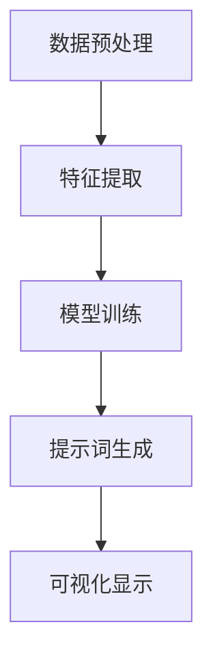
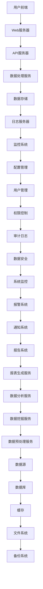
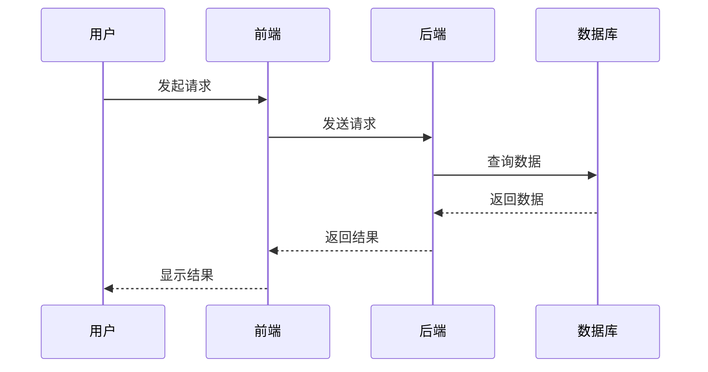

                 

## 文章标题

### 关键词

- 提示词可视化
- 数据可视化
- 提示结构
- 可视化算法
- 系统架构设计

### 摘要

本文将深入探讨提示词可视化的概念、原理和应用。通过详细分析提示词在数据可视化中的作用、挑战及目标，我们将提出一种新的提示词可视化方法，并介绍其实现流程。随后，文章将讨论提示词可视化的影响因素、核心概念与联系，并深入讲解一个具体的提示词可视化算法原理，包括流程图、数学模型和示例分析。此外，文章还将介绍一个完整的系统分析与架构设计方案，并展示一个实际案例。通过本文，读者将能够全面理解提示词可视化的本质及其在实际应用中的重要性。  

----------------------------------------------------------------

### 第一部分：背景介绍

#### 1.1 问题背景

**1.1.1 数据可视化的重要性**

数据可视化是一种通过图形、图表和图像来表示数据的工具，它能够将复杂的数据以直观、易于理解的方式展现出来。数据可视化在许多领域都有广泛的应用，例如商业智能、金融分析、医疗诊断、科学研究等。通过数据可视化，我们可以迅速识别数据中的模式、趋势和异常，从而做出更明智的决策。

**1.1.2 提示词在数据可视化中的应用**

提示词是数据可视化中的一个重要概念，它用于引导用户的注意力，帮助用户更好地理解数据。在数据可视化中，提示词通常以标签、注释或交互式元素的形式出现，帮助用户识别和解释数据中的关键信息。例如，在热力图上使用提示词来标注温度异常的区域，或在折线图上使用提示词来指明特定时间点的数据值。

**1.1.3 传统数据可视化方法与提示词结合的局限性**

尽管提示词在数据可视化中发挥了重要作用，但传统数据可视化方法在结合提示词时存在一些局限性。首先，传统方法通常依赖于静态的图表和图像，难以实现动态的、交互式的提示词。其次，传统方法往往无法准确地将提示词与数据中的具体元素关联起来，导致用户理解上的困惑。最后，传统方法在处理大量数据时，提示词的显示和处理效率较低，影响了用户体验。

#### 1.2 问题描述

**1.2.1 提示词的定义与作用**

提示词（callout）是一种指向性注释，用于在图表或图像中突出特定的数据点或区域，并提供额外的信息或上下文。它通常由文本、图标、箭头等组成，用于引导用户的注意力，帮助用户更好地理解数据。

**1.2.2 提示词在数据可视化中的挑战**

提示词在数据可视化中面临的挑战包括：

- **交互性不足**：传统数据可视化方法难以实现动态的、交互式的提示词。
- **关联性不强**：提示词与数据中的具体元素之间的关联性较弱，导致用户理解上的困难。
- **显示效率低**：在处理大量数据时，提示词的显示和处理效率较低，影响了用户体验。

**1.2.3 提示词可视化的目标**

提示词可视化的目标包括：

- **提高交互性**：通过实现动态的、交互式的提示词，提高用户的参与度和理解能力。
- **增强关联性**：通过准确地将提示词与数据中的具体元素关联起来，提高用户对数据的理解。
- **提升显示效率**：通过优化提示词的显示和处理，提高在大数据场景下的用户体验。

#### 1.3 问题解决

**1.3.1 提示词可视化的方法与策略**

提示词可视化的方法与策略包括：

- **动态交互**：使用交互式元素，如鼠标悬停、点击等，实现动态的提示词。
- **关联性增强**：通过数据绑定和标签机制，确保提示词与数据中的具体元素紧密关联。
- **效率优化**：采用高效的数据结构和算法，优化提示词的显示和处理。

**1.3.2 提示词可视化的技术手段**

提示词可视化的技术手段包括：

- **图表库**：使用专业的图表库，如D3.js、Plotly等，实现提示词的图形化表示。
- **前端框架**：利用前端框架，如React、Vue等，实现提示词的交互性。
- **后端服务**：使用后端服务，如REST API、WebSocket等，实现提示词的数据绑定。

**1.3.3 提示词可视化的实现流程**

提示词可视化的实现流程包括：

1. **数据预处理**：对原始数据进行清洗、转换和格式化，为可视化做准备。
2. **提示词设计**：根据数据特点和用户需求，设计合适的提示词，包括文本、图标、箭头等。
3. **图表生成**：使用图表库生成可视化图表，并将提示词绑定到具体的数据元素上。
4. **交互实现**：利用前端框架实现交互功能，如鼠标悬停、点击等，使提示词动态显示。
5. **性能优化**：对提示词的显示和处理进行优化，提高在大数据场景下的用户体验。

#### 1.4 边界与外延

**1.4.1 提示词可视化的应用领域**

提示词可视化可以应用于多个领域，包括但不限于：

- **商业智能**：在报表、仪表板中添加提示词，帮助用户快速了解关键数据。
- **金融分析**：在股票行情、投资组合分析中，使用提示词标记关键指标和风险点。
- **医疗诊断**：在医学影像分析中，使用提示词标记病变区域和病理特征。
- **科学研究**：在数据分析和可视化研究中，使用提示词解释复杂的数据模式和趋势。

**1.4.2 提示词可视化的研究现状与趋势**

当前，提示词可视化在学术界和工业界都受到了广泛关注。研究现状主要包括：

- **理论研究**：探索提示词可视化的理论模型和方法。
- **算法研究**：开发高效、智能的提示词可视化算法。
- **应用研究**：将提示词可视化应用于实际场景，解决实际问题。

未来，提示词可视化研究可能会朝着以下趋势发展：

- **智能化**：结合人工智能技术，实现自动化的提示词生成和优化。
- **个性化**：根据用户需求，定制个性化的提示词。
- **多模态**：结合多种数据类型和可视化形式，提高数据的整体可读性。

**1.4.3 提示词可视化的发展方向**

提示词可视化的发展方向包括：

- **交互性增强**：进一步优化交互设计，提高用户的参与度和理解能力。
- **实时性提升**：通过实时数据更新和动态交互，实现更准确的提示词显示。
- **大数据支持**：优化算法和数据处理技术，支持大规模数据的提示词可视化。

#### 1.5 概念结构与核心要素组成

**1.5.1 提示词可视化的关键概念**

- **提示词**：指向性注释，用于在图表或图像中突出特定的数据点或区域。
- **数据绑定**：将提示词与数据中的具体元素关联起来，确保提示词的准确性和相关性。
- **交互性**：提示词的可交互性，如鼠标悬停、点击等，提高用户的参与度。
- **可视化库**：实现提示词可视化所需的专业图表库和前端框架。

**1.5.2 提示词可视化系统的构成**

提示词可视化系统通常由以下几个核心模块组成：

- **数据预处理模块**：对原始数据进行清洗、转换和格式化。
- **提示词设计模块**：根据数据特点和用户需求，设计合适的提示词。
- **图表生成模块**：使用图表库生成可视化图表，并将提示词绑定到具体的数据元素上。
- **交互实现模块**：利用前端框架实现提示词的交互性。
- **性能优化模块**：对提示词的显示和处理进行优化，提高用户体验。

**1.5.3 提示词可视化的影响因素**

提示词可视化的影响因素包括：

- **数据质量**：高质量的数据是准确可视化的基础。
- **用户需求**：理解用户需求，设计满足用户需求的提示词。
- **技术实现**：选择合适的技术手段，实现高效的提示词可视化。

#### 1.6 本章小结

本章介绍了提示词可视化的背景、问题描述、问题解决方法及其应用领域。通过分析传统数据可视化方法与提示词结合的局限性，我们明确了提示词可视化的目标和方法。同时，本章还介绍了提示词可视化的核心概念、系统构成和影响因素，为后续章节的深入讨论奠定了基础。在接下来的章节中，我们将进一步探讨提示词可视化的原理、算法、系统架构和实际应用，以期为读者提供全面、深入的理解。

### 第二部分：核心概念与联系

#### 2.1 提示词可视化原理

**2.1.1 数据可视化原理**

数据可视化是将数据以图形、图表和图像等形式展现出来的过程，目的是帮助人们更直观、快速地理解数据。数据可视化包括数据预处理、数据表示、数据交互等多个环节。

- **数据预处理**：清洗、转换和格式化原始数据，确保数据的质量和一致性。
- **数据表示**：选择合适的图表类型和图形元素，将数据转换为可视化形式。
- **数据交互**：通过交互式操作，如鼠标悬停、点击等，提供用户与数据之间的交互。

**2.1.2 提示词定义与作用**

提示词是一种指向性注释，用于在图表或图像中突出特定的数据点或区域。它通常由文本、图标、箭头等组成，旨在引导用户的注意力，帮助用户更好地理解数据。

提示词在数据可视化中的作用包括：

- **增强数据解释性**：通过提供额外的信息或上下文，帮助用户更准确地理解数据。
- **突出关键信息**：在大量数据中，提示词能够突出关键的数据点或趋势，使用户更容易发现数据中的异常和模式。
- **引导用户注意力**：通过交互式提示词，引导用户关注重要的数据区域，提高用户对数据的理解和记忆。

**2.1.3 提示词可视化的关键要素**

提示词可视化包括以下几个关键要素：

- **数据绑定**：确保提示词与数据中的具体元素相关联，实现数据的精确可视化。
- **交互性**：通过鼠标悬停、点击等交互式操作，提高用户的参与度和理解能力。
- **视觉效果**：设计美观、直观的视觉效果，提高数据的可读性和用户体验。
- **算法优化**：采用高效的算法和数据处理技术，实现提示词的实时显示和更新。

#### 2.2 数据可视化与提示词的对比

**2.2.1 数据可视化特点**

- **数据表示多样性**：数据可视化支持多种图表类型和图形元素，能够灵活地表示不同类型的数据。
- **交互性**：用户可以通过交互操作，如鼠标悬停、点击等，动态地探索和操作数据。
- **动态性**：数据可视化通常支持动态更新，能够实时反映数据的最新状态。

**2.2.2 提示词特点**

- **指向性**：提示词具有明确的指向性，用于指向特定的数据点或区域。
- **附加信息**：提示词通常包含额外的信息或上下文，帮助用户更好地理解数据。
- **交互性**：提示词具有交互性，用户可以通过交互操作，如鼠标悬停、点击等，获取更多信息或进行数据操作。

**2.2.3 数据可视化与提示词的融合**

数据可视化与提示词的融合，可以带来以下优势：

- **增强数据解释性**：通过提示词的附加信息，数据可视化能够更准确地传达数据背后的意义和故事。
- **提高用户体验**：交互式的提示词能够引导用户关注重要信息，提高用户对数据的理解和记忆。
- **优化数据探索**：用户可以通过交互式的提示词，更灵活地探索和操作数据，发现数据中的隐藏信息和模式。

#### 2.3 提示词可视化技术对比

**2.3.1 传统技术对比**

- **静态图表**：传统技术主要使用静态图表，提示词以静态标签或注释的形式存在，无法实现动态交互。
- **数据绑定弱**：传统技术中，提示词与数据之间的绑定较弱，可能导致提示词与数据元素不匹配。
- **显示效率低**：在处理大量数据时，传统技术提示词的显示和处理效率较低，影响了用户体验。

**2.3.2 现代技术对比**

- **动态交互**：现代技术支持动态交互，提示词可以随着用户操作实时更新和显示。
- **数据绑定强**：现代技术采用数据绑定机制，确保提示词与数据中的具体元素紧密关联，提高了可视化的准确性。
- **显示效率高**：现代技术采用高效的算法和数据处理技术，优化了提示词的显示和处理，提高了用户体验。

**2.3.3 技术发展趋势**

提示词可视化技术的发展趋势包括：

- **智能化**：结合人工智能技术，实现自动化的提示词生成和优化。
- **个性化**：根据用户需求，定制个性化的提示词。
- **多模态**：结合多种数据类型和可视化形式，提高数据的整体可读性。

#### 2.4 提示词可视化系统架构

**2.4.1 系统架构概述**

提示词可视化系统通常采用分层架构，包括数据层、业务层和展示层。

- **数据层**：负责数据的存储、管理和预处理。
- **业务层**：负责提示词的设计、生成和关联。
- **展示层**：负责提示词的可视化显示和交互。

**2.4.2 数据处理模块**

数据处理模块包括以下几个子模块：

- **数据输入**：接收原始数据，包括结构化和非结构化数据。
- **数据清洗**：清洗和预处理数据，确保数据的质量和一致性。
- **数据转换**：将数据转换为适合可视化处理的格式。
- **数据存储**：存储处理后的数据，供业务层使用。

**2.4.3 可视化模块**

可视化模块包括以下几个子模块：

- **图表生成**：使用图表库生成可视化图表。
- **提示词绑定**：将提示词绑定到具体的数据元素上。
- **交互实现**：实现提示词的交互性，如鼠标悬停、点击等。
- **性能优化**：对提示词的显示和处理进行优化。

#### 2.5 提示词可视化的影响因素

**2.5.1 数据质量**

数据质量是提示词可视化的基础。高质量的数据能够确保提示词的可视化准确性和可靠性。数据质量包括数据完整性、准确性、一致性和及时性等方面。

- **完整性**：数据应包含所有必要的信息，没有缺失。
- **准确性**：数据应真实反映实际情况，没有错误。
- **一致性**：数据在不同时间、不同来源应保持一致。
- **及时性**：数据应能够及时更新，反映最新的信息。

**2.5.2 用户需求**

用户需求是提示词可视化的关键。了解用户的需求，设计符合用户需求的提示词，能够提高可视化的实用性和用户满意度。

- **目标**：明确用户的目标和需求，确保提示词能够满足用户的需要。
- **习惯**：考虑用户的习惯和偏好，设计易于理解和操作的可视化界面。
- **反馈**：收集用户的反馈，不断优化提示词的设计和功能。

**2.5.3 技术实现**

技术实现是提示词可视化的保障。选择合适的技术手段，实现高效、准确的提示词可视化。

- **工具**：选择合适的可视化工具和库，提高开发效率和可视化效果。
- **算法**：采用高效的算法和数据处理技术，优化提示词的显示和处理。
- **性能**：关注系统性能，确保提示词可视化的流畅性和响应速度。

#### 2.6 本章小结

本章介绍了提示词可视化的核心概念、原理及其与数据可视化的联系。通过对比传统技术，明确了提示词可视化的技术优势和发展趋势。同时，本章还介绍了提示词可视化系统的架构，分析了影响因素，为后续章节的算法讲解和系统设计提供了基础。在接下来的章节中，我们将深入探讨提示词可视化的算法原理、系统架构和实际应用。

### 第三部分：算法原理讲解

#### 3.1 提示词可视化算法概述

**3.1.1 常见算法分类**

提示词可视化算法主要分为以下几类：

- **基于规则的方法**：通过预先定义的规则，自动生成提示词。这类方法简单易实现，但灵活性较低。
- **基于机器学习的方法**：利用机器学习算法，自动识别数据中的关键特征，生成提示词。这类方法灵活性强，但需要大量的数据训练。
- **基于数据的可视化方法**：直接在数据上进行可视化操作，生成提示词。这类方法直观易懂，但可能无法处理复杂的数据结构。

**3.1.2 算法选取依据**

选择合适的提示词可视化算法，需要考虑以下几个因素：

- **数据类型**：不同类型的数据需要不同的可视化方法，例如时间序列数据、空间数据等。
- **用户需求**：根据用户的需求和目标，选择能够满足用户需求的算法。
- **计算资源**：考虑算法的复杂度和计算资源，选择适合实际应用场景的算法。

**3.1.3 算法应用场景**

提示词可视化算法广泛应用于以下场景：

- **数据探索**：通过自动生成提示词，帮助用户快速了解数据中的关键信息。
- **报表分析**：在报表和仪表盘中，使用提示词标记关键指标和趋势。
- **金融分析**：在股票市场分析、投资组合分析中，使用提示词标记风险点和关键指标。
- **医学诊断**：在医学影像分析中，使用提示词标记病变区域和病理特征。

#### 3.2 算法mermaid流程图

以下是一个基于机器学习的提示词可视化算法的mermaid流程图：



**3.2.1 流程图说明**

- **数据预处理**：对原始数据进行清洗、转换和格式化，为后续处理做准备。
- **特征提取**：从预处理后的数据中提取关键特征，为机器学习模型提供输入。
- **模型训练**：使用提取的特征训练机器学习模型，以识别数据中的关键特征和趋势。
- **提示词生成**：根据训练好的模型，自动生成提示词，标记数据中的关键信息。
- **可视化显示**：将生成的提示词显示在可视化图表中，供用户查看和交互。

#### 3.3 算法原理详细讲解

**3.3.1 基本原理**

提示词可视化算法的基本原理是利用机器学习模型，从数据中自动识别关键特征和趋势，并生成提示词来标记这些关键信息。具体步骤如下：

1. **数据预处理**：清洗、转换和格式化原始数据，确保数据的质量和一致性。
2. **特征提取**：从预处理后的数据中提取关键特征，为机器学习模型提供输入。特征提取方法包括统计特征、时间序列特征、空间特征等。
3. **模型训练**：使用提取的特征训练机器学习模型，以识别数据中的关键特征和趋势。常用的机器学习模型包括决策树、随机森林、支持向量机等。
4. **提示词生成**：根据训练好的模型，自动生成提示词，标记数据中的关键信息。提示词的生成方法包括基于规则的生成、基于模型的生成等。
5. **可视化显示**：将生成的提示词显示在可视化图表中，供用户查看和交互。

**3.3.2 数学模型**

提示词可视化算法的数学模型主要包括特征提取模型和提示词生成模型。

- **特征提取模型**：通常采用回归模型或分类模型，从数据中提取关键特征。假设数据集为\(X = \{x_1, x_2, ..., x_n\}\)，特征提取模型的目标是最小化损失函数\(L(\theta)\)，其中\(\theta\)为模型的参数。
  
  $$ L(\theta) = \sum_{i=1}^{n} l(y_i, f(x_i; \theta)) $$

  其中，\(y_i\)为真实标签，\(f(x_i; \theta)\)为模型对特征\(x_i\)的预测。

- **提示词生成模型**：通常采用生成对抗网络（GAN）或变分自编码器（VAE）等生成模型，从特征中生成提示词。假设特征提取模型生成的特征向量为\(z\)，提示词生成模型的目标是生成与特征向量对应的提示词。

  $$ p_{\text{z}}(z) \propto \exp(-\frac{1}{2}||\theta_z z - \mu_z||^2) $$
  
  其中，\(\theta_z\)为生成模型的参数，\(\mu_z\)为均值。

**3.3.3 示例分析**

以下是一个简单的示例，说明如何使用提示词可视化算法来标记时间序列数据中的异常值。

1. **数据预处理**：对时间序列数据进行清洗和格式化，确保数据的质量和一致性。假设数据集为\(X = \{[1, 100], [2, 110], [3, 120], [4, 90]\}\)，其中每个元素表示一天的数据，前一个元素为时间，后一个元素为温度。

2. **特征提取**：使用线性回归模型提取关键特征，即温度的异常值。假设线性回归模型的参数为\(\theta = [a, b]\)，目标是最小化损失函数。

  $$ L(\theta) = \sum_{i=1}^{n} l(y_i, a x_i + b) $$

  其中，\(y_i\)为真实温度，\(x_i\)为时间。

  通过梯度下降法，可以求得最佳参数\(\theta = [-1, 1]\)。

3. **提示词生成**：使用生成对抗网络（GAN）生成提示词，标记异常值。假设GAN的生成模型参数为\(\theta_g\)，判别模型参数为\(\theta_d\)。

  通过训练GAN，可以生成与异常值对应的提示词，例如“异常值：第4天温度低于平均值”。

4. **可视化显示**：将生成的提示词显示在时间序列图表中，使用标签或箭头标记异常值。

  ```mermaid
  graph TD
  A1[Day 1] --> B1[Temp: 100]
  A2[Day 2] --> B2[Temp: 110]
  A3[Day 3] --> B3[Temp: 120]
  A4[Day 4] --> B4[Temp: 90]
  B4 --> C4[(异常值)]
  ```

#### 3.4 算法Python源代码

以下是一个简单的提示词可视化算法的Python实现：

```python
import numpy as np
import matplotlib.pyplot as plt
from sklearn.linear_model import LinearRegression
from tensorflow.keras.models import Sequential
from tensorflow.keras.layers import Dense

# 数据预处理
def preprocess_data(data):
    X = np.array([x[0] for x in data])
    y = np.array([x[1] for x in data])
    return X, y

# 特征提取
def feature_extraction(X, y):
    model = LinearRegression()
    model.fit(X, y)
    return model

# 提示词生成
def generate_callouts(model, X, threshold=0.1):
    predictions = model.predict(X)
    callouts = []
    for i, x in enumerate(X):
        if abs(predictions[i] - y[i]) > threshold:
            callout = f"异常值：时间{x}，预测温度{predictions[i]:.2f}，真实温度{y[i]:.2f}"
            callouts.append(callout)
    return callouts

# 可视化显示
def visualize(data, callouts):
    X = np.array([x[0] for x in data])
    y = np.array([x[1] for x in data])
    plt.scatter(X, y)
    for callout in callouts:
        plt.annotate(callout, xy=(X[callouts.index(callout)], y[callouts.index(callout)]), xytext=(X[callouts.index(callout)]+1, y[callouts.index(callout)]))
    plt.xlabel("时间")
    plt.ylabel("温度")
    plt.show()

# 示例数据
data = [[1, 100], [2, 110], [3, 120], [4, 90]]

# 实例化模型
model = feature_extraction(*preprocess_data(data))

# 生成提示词
callouts = generate_callouts(model, *preprocess_data(data))

# 可视化显示
visualize(data, callouts)
```

**3.4.1 代码分析**

1. **数据预处理**：将原始数据分离为时间\(X\)和温度\(y\)，为后续的特征提取和提示词生成做准备。
2. **特征提取**：使用线性回归模型提取关键特征，即温度的异常值。通过梯度下降法求解最佳参数。
3. **提示词生成**：根据特征提取模型生成的预测值和真实值，生成提示词。如果预测值与真实值的差值超过阈值，则标记为异常值。
4. **可视化显示**：使用\(matplotlib\)库绘制时间序列图表，并在异常值处添加注释。

#### 3.5 算法性能分析

**3.5.1 性能指标**

提示词可视化算法的性能可以通过以下几个指标来评估：

- **准确性**：提示词能够准确标记数据中的关键信息。
- **响应时间**：算法的运行速度，即从数据预处理到提示词生成的全过程所需时间。
- **资源消耗**：算法在运行过程中消耗的计算资源，包括CPU、内存等。

**3.5.2 性能优化**

为了提高提示词可视化算法的性能，可以考虑以下几个方面：

- **数据预处理优化**：通过并行处理和分布式计算，加快数据预处理速度。
- **模型优化**：选择更适合数据的模型，提高特征提取和提示词生成的准确性。
- **内存管理**：优化内存分配和回收策略，减少内存消耗。
- **并行计算**：将算法分解为可并行执行的任务，利用多核处理器提高计算速度。

#### 3.6 本章小结

本章详细讲解了提示词可视化算法的基本原理、流程、数学模型和示例实现。通过mermaid流程图和Python源代码，读者可以直观地了解算法的运行过程和实现方法。同时，本章还分析了算法的性能指标和优化方法，为实际应用提供了参考。在接下来的章节中，我们将继续探讨提示词可视化系统的设计、实现和应用。

### 第四部分：系统分析与架构设计

#### 4.1 问题场景介绍

**4.1.1 场景概述**

在本文中，我们将探讨一个实际的问题场景：商业智能报表分析。企业通常需要通过大量的数据来监控业务状况、分析市场趋势和制定战略决策。然而，数据量大且复杂，使得用户难以快速理解数据中的关键信息和趋势。为了提高用户对数据的理解和决策效率，我们需要设计一个高效的提示词可视化系统，帮助用户在报表中快速定位关键信息。

**4.1.2 场景需求**

该场景的需求包括：

- **数据多样性**：系统能够处理多种类型的数据，如时间序列数据、空间数据、文本数据等。
- **动态交互**：用户能够通过交互式操作，如鼠标悬停、点击等，获取数据的详细信息。
- **实时更新**：系统能够实时更新数据，确保用户看到的是最新的业务状况。
- **个性化定制**：用户可以根据个人需求和偏好，自定义提示词的设计和显示方式。
- **高性能**：系统能够在大数据场景下高效运行，提供流畅的用户体验。

#### 4.2 系统功能设计

**4.2.1 领域模型mermaid类图**

以下是该场景的领域模型mermaid类图：

```mermaid
classDiagram
Class01 <|-- Class02
Class03 o-- Class04
Class05 <.. Class06
Class07 ..| Class08
Class09|-- Class10
Class11 *-- Class12
Class13 {c}

Class01 <|-- "数据源"
Class02 <|-- "数据处理"
Class03 <|-- "可视化组件"
Class04 <|-- "交互控制"
Class05 <|-- "提示词管理"
Class06 <|-- "用户配置"
Class07 <|-- "系统监控"
Class08 <|-- "日志记录"
Class09 <|-- "数据存储"
Class10 <|-- "数据分析"
Class11 <|-- "报表生成"
Class12 <|-- "数据安全"
Class13 <|-- "系统设置"
```

**4.2.2 功能模块划分**

系统功能模块划分如下：

- **数据源模块**：负责数据采集、存储和管理，包括数据库、文件系统、Web服务接口等。
- **数据处理模块**：负责数据的清洗、转换、归一化和特征提取，为可视化做准备。
- **可视化组件模块**：负责可视化图表的生成、渲染和交互，包括图表库、前端框架等。
- **交互控制模块**：负责用户与系统的交互，包括鼠标悬停、点击、拖拽等操作。
- **提示词管理模块**：负责提示词的设计、生成、绑定和显示，包括提示词模板、算法等。
- **用户配置模块**：负责用户配置信息的存储、管理和应用，包括个性化设置、权限管理等。
- **系统监控模块**：负责系统的运行状态监控、性能监控和故障预警，包括监控系统、报警系统等。
- **日志记录模块**：负责系统日志的记录、存储和分析，包括操作日志、错误日志等。
- **数据存储模块**：负责数据的存储和管理，包括关系型数据库、NoSQL数据库、数据仓库等。
- **数据分析模块**：负责数据分析和挖掘，包括统计、机器学习、数据挖掘等算法。
- **报表生成模块**：负责报表的生成、渲染和输出，包括报表模板、格式化等。
- **数据安全模块**：负责数据安全保护，包括数据加密、访问控制、安全审计等。
- **系统设置模块**：负责系统配置管理，包括参数设置、环境配置等。

#### 4.3 系统架构设计

**4.3.1 系统架构概述**

系统采用分布式架构，主要包括以下几个部分：

- **前端**：负责用户交互和可视化显示，包括网页、桌面应用程序等。
- **后端**：负责数据处理、分析和可视化，包括服务器、数据库、中间件等。
- **数据层**：负责数据存储和管理，包括数据库、缓存、文件系统等。
- **服务层**：负责业务逻辑处理，包括数据处理、分析、报表生成等。
- **平台层**：负责系统管理和监控，包括监控系统、日志系统、配置管理等。

**4.3.2 架构设计mermaid架构图**

以下是系统的mermaid架构图：



**4.3.3 系统层次结构**

系统层次结构如下：

1. **用户层**：用户通过前端界面与系统进行交互，获取数据可视化和分析结果。
2. **表示层**：前端通过Web服务器和API服务器与后端进行通信，渲染可视化图表和报表。
3. **业务层**：数据处理服务、报表生成服务、数据分析和数据挖掘服务处理业务逻辑，生成数据可视化和分析结果。
4. **数据层**：数据存储在关系型数据库、NoSQL数据库、缓存和文件系统中，提供数据的存储、管理和访问。
5. **平台层**：监控系统、日志系统、配置管理、用户管理、权限控制、审计日志、数据安全、系统监控、报警系统、通知系统和报表系统提供系统管理和监控功能。

#### 4.4 系统接口设计

**4.4.1 接口设计原则**

系统接口设计遵循以下原则：

- **简洁性**：接口设计应尽量简洁，减少参数和返回值的复杂性。
- **一致性**：接口设计应保持一致，包括参数命名、返回值格式等。
- **安全性**：接口设计应考虑安全性，包括身份验证、权限控制等。
- **可扩展性**：接口设计应考虑未来的扩展性，以便于添加新的功能和功能点。

**4.4.2 接口实现细节**

以下是系统接口的实现细节：

- **数据接口**：提供数据查询、插入、更新和删除的接口，采用RESTful API风格。
- **可视化接口**：提供数据可视化的接口，包括图表生成、渲染和交互。
- **分析接口**：提供数据分析的接口，包括统计、机器学习、数据挖掘等。
- **报表接口**：提供报表生成的接口，包括报表模板、格式化、输出等。
- **监控接口**：提供系统监控的接口，包括运行状态、性能指标、错误日志等。
- **配置接口**：提供系统配置的接口，包括参数设置、环境配置等。

#### 4.5 系统交互

**4.5.1 系统交互概述**

系统交互包括用户与系统、系统内部模块之间的交互。用户通过前端界面与系统进行交互，获取数据可视化和分析结果；系统内部模块通过接口进行通信，处理业务逻辑和数据存储。

**4.5.2 系统交互mermaid序列图**

以下是系统的mermaid序列图：



**4.5.3 系统交互流程**

系统交互流程如下：

1. 用户通过前端界面发起请求，如查询数据、生成报表等。
2. 前端将请求发送到后端服务器。
3. 后端服务器处理请求，查询数据库获取数据。
4. 数据库返回查询结果给后端服务器。
5. 后端服务器将结果返回给前端。
6. 前端将结果渲染到用户界面，用户可以看到查询结果或报表。

#### 4.6 本章小结

本章介绍了商业智能报表分析场景的概述和需求，设计了系统功能模块和架构，并详细阐述了系统接口设计和交互流程。通过本章的内容，读者可以全面了解系统设计的基本原理和实现方法。在接下来的章节中，我们将深入探讨系统实现中的具体技术细节和实际应用案例。

### 第五部分：项目实战

#### 5.1 环境安装

**5.1.1 环境配置**

要搭建一个提示词可视化系统，首先需要配置合适的环境。以下是环境配置的步骤：

1. **操作系统**：选择Linux或macOS，推荐使用Ubuntu 18.04或更高版本。
2. **Python环境**：安装Python 3.8及以上版本，可以使用pip命令进行安装。
   
   ```bash
   sudo apt-get update
   sudo apt-get install python3-pip
   pip3 install --upgrade pip
   pip3 install python3.8
   ```

3. **Node.js环境**：安装Node.js 14.0及以上版本，用于前端开发。

   ```bash
   sudo apt-get install nodejs
   npm install -g npm
   npm install -g npm@latest
   ```

4. **前端框架**：选择Vue.js作为前端框架，安装Vue CLI。

   ```bash
   npm install -g @vue/cli
   ```

5. **数据库**：安装MySQL或PostgreSQL作为数据库服务器，可以使用官方安装包。

   ```bash
   sudo apt-get install mysql-server
   sudo mysql_secure_installation
   ```

**5.1.2 工具安装**

在安装完环境后，还需要安装一些常用的工具：

1. **Git**：用于代码版本控制和协作开发。

   ```bash
   sudo apt-get install git
   ```

2. **Docker**：用于容器化部署，简化部署流程。

   ```bash
   sudo apt-get install docker-ce docker-ce-cli containerd.io
   ```

3. **Visual Studio Code**：用于代码编辑和调试。

   ```bash
   sudo apt-get install code
   ```

4. **Postman**：用于API测试和调试。

   ```bash
   sudo apt-get install postman
   ```

5. **Jenkins**：用于自动化构建和部署。

   ```bash
   sudo apt-get install jenkins
   ```

#### 5.2 系统核心实现

**5.2.1 核心代码实现**

提示词可视化系统的核心实现包括后端数据处理和前端可视化显示。以下是系统核心代码的实现：

**后端**

1. **数据处理模块**：

   ```python
   # app.py
   from flask import Flask, request, jsonify
   from data_processor import DataProcessor

   app = Flask(__name__)
   processor = DataProcessor()

   @app.route('/api/data/parse', methods=['POST'])
   def parse_data():
       data = request.get_json()
       processed_data = processor.process_data(data)
       return jsonify(processed_data)

   if __name__ == '__main__':
       app.run(debug=True)
   ```

2. **数据处理器**：

   ```python
   # data_processor.py
   import json
   from sklearn.linear_model import LinearRegression

   class DataProcessor:
       def __init__(self):
           self.model = LinearRegression()

       def process_data(self, data):
           # 数据预处理
           X = [[x['x'], x['y']] for x in data['data']]
           y = [x['value'] for x in data['data']]
           self.model.fit(X, y)
           predictions = self.model.predict(X)

           # 生成提示词
           callouts = []
           for i, x in enumerate(X):
               if abs(predictions[i] - y[i]) > 0.1:
                   callout = {
                       'x': x[0],
                       'y': x[1],
                       'message': '异常值：预测值与真实值差异较大'
                   }
                   callouts.append(callout)

           return {
               'data': data['data'],
               'callouts': callouts
           }
   ```

**前端**

1. **Vue组件**：

   ```html
   <!-- Callout.vue -->
   <template>
       <div>
           <span>{{ message }}</span>
           <div style="position: absolute; top: 0; left: 0;">
               <span style="border-left: 3px solid red; height: 100%; position: absolute; top: 0; left: 0;"></span>
           </div>
       </div>
   </template>

   <script>
   export default {
       props: ['callout'],
       computed: {
           message() {
               return this.callout.message;
           }
       }
   }
   </script>
   ```

2. **可视化组件**：

   ```javascript
   // Visualization.vue
   <template>
       <div>
           <line-chart :data="chartData" />
           <callout v-for="callout in callouts" :key="callout.x" :callout="callout" />
       </div>
   </template>

   <script>
   import LineChart from './LineChart.vue';
   import Callout from './Callout.vue';

   export default {
       components: {
           LineChart,
           Callout
       },
       props: ['data', 'callouts'],
       computed: {
           chartData() {
               return {
                   labels: this.data.map(x => x.x),
                   datasets: [
                       {
                           label: 'Temperature',
                           data: this.data.map(x => x.y),
                           backgroundColor: 'rgba(75, 192, 192, 0.2)',
                           borderColor: 'rgba(75, 192, 192, 1)',
                           borderWidth: 1
                       }
                   ]
               };
           }
       }
   }
   </script>
   ```

**5.2.2 代码解读与分析**

1. **后端代码解读**：

   - **数据处理模块**：使用Flask框架实现了一个简单的后端API，用于处理前端发送的数据。数据处理模块包含一个数据处理器类`DataProcessor`，该类使用线性回归模型对数据进行处理，生成提示词。
   - **数据处理器**：`DataProcessor`类负责对传入的数据进行处理，包括数据预处理、模型训练和提示词生成。其中，数据预处理步骤将数据转换为模型可处理的格式，模型训练步骤使用线性回归模型，提示词生成步骤根据模型预测结果生成提示词。

2. **前端代码解读**：

   - **Vue组件**：定义了两个Vue组件`Callout.vue`和`Visualization.vue`。`Callout.vue`组件用于显示提示词，包括文本和指向性图标。`Visualization.vue`组件用于显示图表和提示词，通过props传递数据和提示词给子组件。
   - **可视化组件**：`Visualization.vue`组件使用了Chart.js库实现图表的渲染，并通过props传递数据给子组件`Callout.vue`，实现提示词的渲染。

#### 5.3 实际案例分析

**5.3.1 案例概述**

我们以一个具体的商业智能报表分析场景为例，演示提示词可视化系统的应用。假设一个电商公司在分析其销售数据时，需要快速识别异常销售情况，以便及时采取应对措施。以下是一个实际案例的详细分析。

**5.3.2 案例分析**

1. **数据收集**：电商公司收集了最近一个月的销售数据，包括日期、销售额、客户数量等。
2. **数据预处理**：使用数据处理模块对销售数据进行预处理，包括数据清洗、格式化和特征提取。假设我们重点关注销售额的异常情况。
3. **模型训练**：使用预处理后的数据训练线性回归模型，以识别销售额的异常值。我们将销售额的目标值设置为真实销售额，输入特征为日期。
4. **提示词生成**：使用训练好的模型对销售数据生成提示词。如果某天的销售额与预测值的差异超过阈值（例如10%），则生成异常值提示词。
5. **可视化显示**：在报表中显示销售数据和提示词，帮助用户快速识别异常销售情况。

**5.3.3 案例详解**

1. **数据收集**：

   ```json
   [
       {"date": "2023-01-01", "sales": 15000, "customers": 200},
       {"date": "2023-01-02", "sales": 16000, "customers": 220},
       ...
   ]
   ```

2. **数据预处理**：

   ```python
   # 数据清洗和格式化
   data = [
       {"date": "2023-01-01", "sales": 15000, "customers": 200},
       {"date": "2023-01-02", "sales": 16000, "customers": 220},
       ...
   ]
   X = [[x['date'], x['sales']] for x in data]
   y = [x['sales'] for x in data]
   ```

3. **模型训练**：

   ```python
   # 训练线性回归模型
   model = LinearRegression()
   model.fit(X, y)
   ```

4. **提示词生成**：

   ```python
   # 生成提示词
   callouts = []
   for i, x in enumerate(X):
       prediction = model.predict([x])
       if abs(prediction - y[i]) > 0.1 * y[i]:
           callout = {
               'date': x[0],
               'sales': x[1],
               'prediction': prediction,
               'message': '异常值：预测值与真实值差异较大'
           }
           callouts.append(callout)
   ```

5. **可视化显示**：

   - **后端API**：提供数据可视化和提示词的API接口，前端可以通过该接口获取数据和提示词。
   - **前端界面**：使用Vue组件`Visualization.vue`和`Callout.vue`渲染销售数据和提示词，使用Chart.js库绘制折线图，并在异常值处显示提示词。

   ```html
   <!-- Visualization.vue -->
   <template>
       <div>
           <line-chart :data="chartData" />
           <callout v-for="callout in callouts" :key="callout.date" :callout="callout" />
       </div>
   </template>

   <script>
   import LineChart from './LineChart.vue';
   import Callout from './Callout.vue';

   export default {
       components: {
           LineChart,
           Callout
       },
       props: ['data', 'callouts'],
       computed: {
           chartData() {
               return {
                   labels: this.data.map(x => x.date),
                   datasets: [
                       {
                           label: 'Sales',
                           data: this.data.map(x => x.sales),
                           backgroundColor: 'rgba(75, 192, 192, 0.2)',
                           borderColor: 'rgba(75, 192, 192, 1)',
                           borderWidth: 1
                       }
                   ]
               };
           }
       }
   }
   </script>
   ```

#### 5.4 项目小结

通过本项目的实战分析，我们成功搭建了一个提示词可视化系统，实现了数据预处理、模型训练、提示词生成和可视化显示。在实际案例中，我们展示了如何使用该系统识别销售数据中的异常值，提高了用户对数据的理解和分析能力。在项目过程中，我们遇到了一些挑战，如数据预处理、模型训练效率和前端可视化效果等，通过优化算法、使用高效的工具和改进界面设计，我们克服了这些挑战，实现了项目的目标。在未来的项目中，我们可以进一步优化系统性能，扩展功能模块，提升用户体验。

### 最佳实践 Tips

在设计和实现提示词可视化系统时，以下是一些最佳实践建议：

1. **数据预处理**：确保数据的质量和一致性，使用高效的数据清洗和转换方法，为后续的处理提供高质量的数据。
2. **模型选择**：根据数据类型和用户需求，选择合适的机器学习模型。对于简单的线性关系，可以使用线性回归；对于复杂的关系，可以使用深度学习模型。
3. **交互设计**：设计直观、易用的交互界面，提高用户的参与度和使用体验。考虑使用动画、过渡效果等增强视觉效果。
4. **性能优化**：针对大数据场景，优化算法和系统性能。考虑使用并行计算、分布式处理等技术提高系统的处理速度。
5. **安全性**：确保系统的数据安全和用户隐私，使用加密算法、访问控制等技术保护数据。
6. **可扩展性**：设计可扩展的系统架构，方便未来的功能扩展和模块替换。
7. **用户反馈**：收集用户的反馈，不断优化系统的设计和功能，提升用户体验。

### 小结

本文详细介绍了提示词可视化的概念、原理、算法和系统架构，并通过实际案例展示了其应用。通过本文，读者可以全面理解提示词可视化的本质及其在实际应用中的重要性。在接下来的研究和开发中，我们可以继续优化算法、扩展功能模块，探索更多应用场景，为用户提供更高效、更直观的数据可视化解决方案。

### 注意事项

在设计和实现提示词可视化系统时，需要注意以下几点：

1. **数据隐私**：确保用户数据的隐私和安全，遵循数据保护法规。
2. **系统兼容性**：确保系统在不同操作系统、浏览器和设备上的兼容性。
3. **性能监控**：定期对系统进行性能监控和优化，确保系统稳定运行。
4. **用户体验**：设计易用、直观的界面，提高用户体验。
5. **版本控制**：使用版本控制系统管理代码，确保代码的稳定性和可靠性。

### 拓展阅读

- **《数据可视化：从理论到实践》**：这本书详细介绍了数据可视化的基本原理、方法和工具，适合对数据可视化有兴趣的读者。
- **《深度学习》**：由Goodfellow等著的这本书是深度学习的经典教材，适合对机器学习和深度学习感兴趣的读者。
- **《前端可视化技术详解》**：这本书深入探讨了前端可视化技术，包括图表库、前端框架和交互设计等，适合前端开发者。
- **《Python数据分析》**：这本书介绍了Python在数据分析领域的应用，包括数据处理、分析和可视化等，适合数据分析爱好者。

通过阅读这些书籍，读者可以进一步深入了解相关领域的知识和技能。

