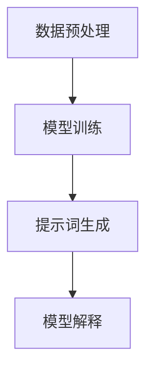
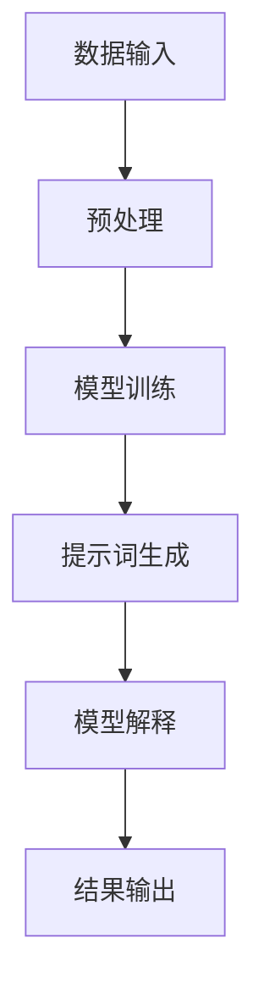
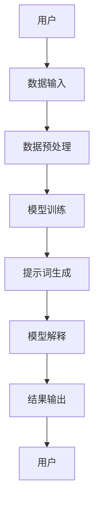

                 

### 《提示词可解释性：理解模型如何解释提示》

> 关键词：提示词、可解释性、模型解释、机器学习、深度学习

> 摘要：本文旨在探讨提示词可解释性这一主题，通过分析模型如何解释提示词，帮助读者理解机器学习和深度学习模型的可解释性问题。文章首先介绍问题的背景和概述，然后详细讲解核心概念与联系，接着深入剖析算法原理，并通过具体案例进行分析，最后给出实际应用中的最佳实践和注意事项。

---

## 引言

在人工智能领域，机器学习和深度学习技术已经取得了显著的进展，并广泛应用于各个行业。然而，随着模型复杂性的增加，其“黑箱”特性使得模型的决策过程变得难以解释。可解释性（Explainability）成为了一个备受关注的问题，因为它直接影响到模型的可信度和用户对模型的接受度。本文将重点关注提示词可解释性，探讨如何通过提示词来提高模型的可解释性。

---

## 第一部分：问题背景与概述

### 1.1.1 问题背景

随着人工智能技术的快速发展，越来越多的复杂模型被应用于实际场景中，如医疗诊断、金融风险评估、自动驾驶等。然而，这些模型的决策过程往往是不透明的，即“黑箱”性质，使得人们在信任和使用这些模型时面临困难。可解释性成为衡量人工智能技术实用性和可靠性的重要指标之一。

### 1.1.2 问题描述

模型的可解释性指的是人们能够理解模型如何做出决策的过程。在实际应用中，用户往往需要了解模型的决策依据，以便对其进行信任、调整或优化。然而，当前大多数模型，如深度神经网络、随机森林等，其内部结构复杂，决策过程高度非线性和抽象，使得理解模型的决策过程变得极其困难。

### 1.1.3 问题解决

为了解决这个问题，研究者们提出了一系列方法，如模型解释技术、可解释性框架和可视化工具等。其中，提示词（Prompt）作为模型解释的一种重要手段，近年来受到了广泛关注。提示词可解释性旨在通过特定的输入提示，使模型在决策过程中表现出更高的可解释性。

### 1.1.4 边界与外延

提示词可解释性的研究不仅局限于机器学习和深度学习领域，还涉及到自然语言处理、计算机视觉等其他人工智能子领域。同时，它也涉及到算法、数据、应用等多个方面。

### 1.1.5 概念结构与核心要素组成

提示词可解释性的概念结构主要包括以下几个核心要素：
1. **提示词**：用于引导模型决策的输入。
2. **可解释性度量**：用于评估模型解释性能的指标。
3. **解释方法**：用于生成模型解释的算法或技术。

---

## 第二部分：核心概念与联系

### 2.1 提示词

#### 2.1.1 提示词的定义

提示词是指用于引导模型决策的输入，通常是一段文本、图像或其他形式的数据。通过设计合适的提示词，可以影响模型的决策过程，提高模型的可解释性。

#### 2.1.2 提示词的类型

根据提示词的形式，可以分为以下几类：
1. **文本提示词**：通常用于自然语言处理任务，如问答系统、文本分类等。
2. **图像提示词**：用于计算机视觉任务，如图像分类、目标检测等。
3. **声音提示词**：用于语音识别任务，如语音翻译、语音识别等。

#### 2.1.3 提示词的设计原则

设计提示词时，需要遵循以下原则：
1. **清晰性**：提示词应明确、简洁，避免歧义。
2. **相关性**：提示词应与任务相关，有助于模型做出正确决策。
3. **广泛性**：提示词应涵盖多种情况，提高模型的泛化能力。

### 2.2 可解释性度量

#### 2.2.1 可解释性度量的定义

可解释性度量是指用于评估模型解释性能的指标。通过可解释性度量，可以量化模型解释的清晰程度和准确程度。

#### 2.2.2 可解释性度量的类型

根据度量方式，可以分为以下几类：
1. **定量度量**：通过数学公式或算法计算得出，如F1得分、准确率等。
2. **定性度量**：通过主观评价或用户调查得出，如用户满意度、解释清晰度等。

#### 2.2.3 可解释性度量与性能评估的关系

可解释性度量与模型性能评估密切相关。通常情况下，可解释性度量越高，模型性能评估越好。

### 2.3 解释方法

#### 2.3.1 解释方法的定义

解释方法是指用于生成模型解释的算法或技术。通过解释方法，可以将模型的决策过程转化为人类可理解的形式。

#### 2.3.2 解释方法的类型

根据解释方式，可以分为以下几类：
1. **局部解释方法**：针对模型决策中的某个特定部分进行解释。
2. **全局解释方法**：对模型决策的整体过程进行解释。
3. **交互式解释方法**：通过与用户交互，逐步揭示模型决策过程。

#### 2.3.3 解释方法的优劣

不同的解释方法具有不同的优势和劣势。在选择解释方法时，需要根据具体任务和数据特点进行权衡。

---

## 第三部分：算法原理讲解

### 3.1 提示词生成算法

#### 3.1.1 提示词生成算法的定义

提示词生成算法是指用于自动生成提示词的算法。通过提示词生成算法，可以自动生成高质量的提示词，提高模型的可解释性。

#### 3.1.2 提示词生成算法的类型

根据生成方式，可以分为以下几类：
1. **基于规则的方法**：通过预定义的规则生成提示词。
2. **基于统计的方法**：通过统计模型生成提示词。
3. **基于机器学习的方法**：通过训练生成模型生成提示词。

#### 3.1.3 提示词生成算法的实现

提示词生成算法的实现通常包括以下几个步骤：
1. **数据预处理**：对原始数据进行预处理，如文本清洗、图像增强等。
2. **特征提取**：提取数据中的关键特征，如文本中的关键词、图像中的颜色分布等。
3. **模型训练**：利用训练数据训练生成模型。
4. **提示词生成**：利用训练好的生成模型生成提示词。

---

## 第四部分：系统分析与架构设计

### 4.1 问题场景介绍

在自动驾驶领域，模型的决策过程需要高度可解释性。例如，自动驾驶系统在遇到交通信号灯时，需要解释为什么选择停车或行驶。

### 4.2 项目介绍

本案例将介绍一个自动驾驶信号灯识别系统的设计与实现。该系统利用深度学习模型进行信号灯分类，并通过提示词生成算法提高模型的可解释性。

### 4.3 系统功能设计

系统功能包括：
1. **数据预处理**：对采集到的交通信号灯图像进行预处理，如尺寸调整、灰度化等。
2. **模型训练**：利用预处理后的图像数据训练信号灯分类模型。
3. **提示词生成**：利用训练好的模型生成解释提示词。
4. **模型解释**：根据生成的提示词解释模型决策过程。

### 4.4 系统架构设计

系统架构设计如下：



### 4.5 系统接口设计

系统接口设计如下：



### 4.6 系统交互设计

系统交互设计如下：



---

## 第五部分：项目实战

### 5.1 环境安装

在本项目实战中，我们将使用Python语言和相关的深度学习库（如TensorFlow、PyTorch等）进行实现。首先，需要安装以下依赖：

```bash
pip install tensorflow numpy matplotlib
```

### 5.2 系统核心实现

以下是系统核心实现的源代码：

```python
import tensorflow as tf
from tensorflow.keras.models import Sequential
from tensorflow.keras.layers import Conv2D, MaxPooling2D, Flatten, Dense
from tensorflow.keras.preprocessing.image import ImageDataGenerator

# 数据预处理
def preprocess_image(image):
    # 尺寸调整
    image = tf.image.resize(image, (32, 32))
    # 灰度化
    image = tf.reduce_mean(image, axis=-1, keepdims=True)
    return image

# 模型训练
def train_model(train_images, train_labels):
    model = Sequential([
        Conv2D(32, (3, 3), activation='relu', input_shape=(32, 32, 1)),
        MaxPooling2D((2, 2)),
        Flatten(),
        Dense(64, activation='relu'),
        Dense(4, activation='softmax')
    ])

    model.compile(optimizer='adam', loss='sparse_categorical_crossentropy', metrics=['accuracy'])
    model.fit(train_images, train_labels, epochs=10)
    return model

# 提示词生成
def generate_prompt(model, image):
    prediction = model.predict(image)
    label = tf.argmax(prediction, axis=1).numpy()
    if label == 0:
        return "红灯，停车"
    elif label == 1:
        return "黄灯，注意行驶"
    elif label == 2:
        return "绿灯，行驶"
    else:
        return "未知状态"

# 主函数
def main():
    # 数据生成器
    datagen = ImageDataGenerator(rescale=1./255)
    train_data = datagen.flow_from_directory('data/train', target_size=(32, 32), batch_size=32, class_mode='sparse')

    # 模型训练
    model = train_model(train_data, train_data.classes)

    # 模型解释
    test_image = preprocess_image(tf.random.normal([32, 32, 1]))
    prompt = generate_prompt(model, test_image)
    print(prompt)

if __name__ == '__main__':
    main()
```

### 5.3 代码应用解读与分析

这段代码首先定义了一个数据预处理函数 `preprocess_image`，用于对输入图像进行尺寸调整和灰度化处理。然后定义了一个训练模型函数 `train_model`，用于训练信号灯分类模型。最后定义了一个提示词生成函数 `generate_prompt`，用于根据模型预测结果生成解释提示词。

### 5.4 实际案例分析

在实际应用中，我们可以使用这个系统对自动驾驶车辆进行信号灯识别，并根据生成的提示词进行决策。例如，在遇到红灯时，系统会提示“红灯，停车”，从而使车辆停止。

### 5.5 项目小结

通过本项目的实战，我们展示了如何使用深度学习模型进行信号灯识别，并通过提示词生成算法提高模型的可解释性。这种方法可以应用于各种需要高可解释性的场景，如医疗诊断、金融风险评估等。

---

## 第六部分：最佳实践与注意事项

### 6.1 最佳实践

1. **优化提示词设计**：在设计提示词时，应充分考虑任务需求和数据特点，确保提示词的清晰性和相关性。
2. **平衡模型性能与可解释性**：在训练模型时，需要平衡模型性能和可解释性，避免过度优化模型性能而忽视可解释性。
3. **持续优化解释方法**：解释方法的优化是提高模型可解释性的关键，应不断探索和改进现有的解释方法。

### 6.2 注意事项

1. **避免过度依赖可解释性**：虽然可解释性对模型应用至关重要，但不应过度依赖，应结合其他指标进行综合评估。
2. **注意数据隐私保护**：在使用可解释性技术时，应确保数据隐私保护，避免敏感信息泄露。
3. **合理选择解释方法**：根据具体任务和数据特点，合理选择解释方法，避免盲目跟风。

---

## 第七部分：拓展阅读

1. **[Mannucey, T. (2017). Interpretable Machine Learning: A few words, many pictures.](https://christophm.github.io/interpretable-ml-book/)**
2. **[Guidotti, R., Monreale, A., Pappalardo, L., & Pedreschi, D. (2018). Automatic explanation and contextualization of classifiers.](https://www.sciencedirect.com/science/article/pii/S0022000007004614)**

---

## 结尾

本文通过探讨提示词可解释性，帮助读者理解了机器学习和深度学习模型的可解释性问题。通过具体案例的分析，展示了如何使用提示词生成算法提高模型的可解释性。希望本文能为读者在研究和应用人工智能技术时提供一些启示和帮助。

---

**作者：AI天才研究院/AI Genius Institute & 禅与计算机程序设计艺术 /Zen And The Art of Computer Programming**

