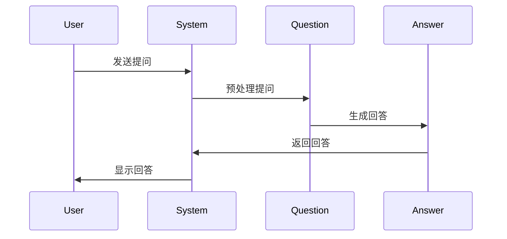
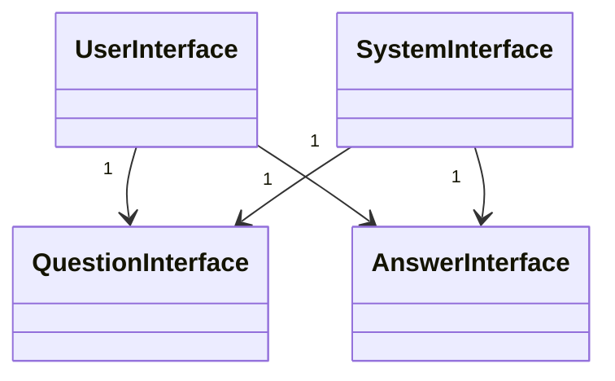
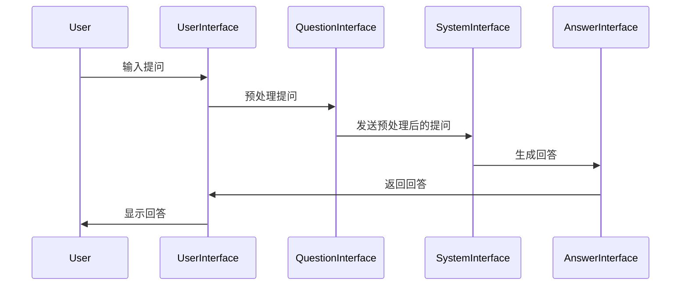

                 

# 提示词工程中的伦理考量

关键词：伦理考量、提示词工程、AI伦理、数据偏见、可解释性、人机交互

摘要：随着人工智能技术的迅猛发展，提示词工程（Prompt Engineering）在自然语言处理（NLP）和生成式AI中扮演着越来越重要的角色。然而，这项技术也引发了一系列伦理问题。本文将深入探讨提示词工程中的伦理考量，分析其在数据偏见、可解释性和人机交互等方面的挑战，并提出相应的解决策略。通过详细讲解和实际案例剖析，本文旨在为AI从业者提供有价值的参考和指导，推动人工智能技术的健康和可持续发展。

## 第一部分：引言

### 第1章：问题背景

#### 1.1.1 问题背景

在当今时代，人工智能（AI）技术正以前所未有的速度发展。自然语言处理（NLP）作为AI的一个重要分支，已经在众多领域取得了显著成果。例如，智能客服、机器翻译、文本摘要等应用已经深入到我们的日常生活和工作中。在这些应用中，提示词工程（Prompt Engineering）扮演着至关重要的角色。

提示词工程是指通过设计和调整输入到AI模型中的提示词（Prompt），来影响模型的输出结果的过程。这个过程中，提示词的设计和选择对模型的表现至关重要。然而，随着AI技术的广泛应用，提示词工程也引发了一系列伦理问题，如数据偏见、可解释性和人机交互等。

#### 1.1.2 问题描述

数据偏见：在提示词工程中，数据偏见是一个严重的问题。如果训练数据中存在偏见，那么AI模型在生成结果时也会表现出类似的偏见，从而可能导致不公平、歧视等问题。

可解释性：AI模型通常被视为“黑箱”，其内部决策过程难以理解。这给用户带来了不信任感，尤其是在涉及重大决策时，如医疗诊断、信用评估等。

人机交互：在提示词工程中，人机交互是一个关键问题。如何设计合理的提示词，以便AI系统能够准确地理解和回应用户的需求，是一个需要深入探讨的课题。

#### 1.1.3 问题解决

针对上述问题，我们需要从多个方面进行解决。

1. 数据偏见：我们需要确保训练数据的质量和多样性，避免偏见。同时，可以通过模型调整和算法改进来减轻偏见的影响。
2. 可解释性：我们需要开发可解释的AI模型，使决策过程更加透明，提高用户信任度。
3. 人机交互：我们需要设计友好的用户界面，提供清晰的提示词，以便用户能够准确地表达需求，同时AI系统也能够准确地理解和回应。

#### 1.1.4 边界与外延

提示词工程的伦理考量不仅局限于技术层面，还涉及到社会、法律和道德等多个方面。例如，如何确保AI系统的公平性、透明性和责任性，如何处理个人隐私和数据安全等问题。

#### 1.1.5 概念结构与核心要素组成

提示词工程的核心要素包括：提示词设计、模型训练、结果评估和用户反馈。这些要素相互关联，共同影响AI系统的表现。

## 第二部分：核心概念与联系

### 第2章：核心概念与联系

#### 2.1.1 核心概念原理

提示词工程涉及多个核心概念，包括自然语言处理（NLP）、生成式AI、模型训练、数据预处理等。这些概念相互关联，共同构成了提示词工程的框架。

#### 2.1.2 概念属性特征对比表格

| 概念     | 属性特征                                       |
|----------|------------------------------------------------|
| 自然语言处理（NLP） | 提取文本中的信息、理解和生成文本                   |
| 生成式AI  | 生成与给定输入相似的文本、图像、音频等           |
| 模型训练  | 使用数据来优化AI模型的参数，提高模型性能         |
| 数据预处理 | 清洗、转换和格式化数据，以便于模型训练和处理     |

#### 2.1.3 ER实体关系图架构

为了更好地理解提示词工程中的各个概念及其相互关系，我们可以使用实体关系图（ER图）来表示。

```mermaid
erDiagram
    AI模型 ||--|{ 提示词 }
    数据集 ||--|{ 模型训练 }
    用户 ||--|{ 用户反馈 }
```

## 第三部分：伦理考量基础

### 第3章：伦理考量基础

#### 3.1.1 伦理学基础

伦理学是关于道德原则和价值观的哲学研究。在人工智能领域，伦理学提供了评估AI系统道德性的框架。关键概念包括：公平性、透明性、责任性和隐私性。

#### 3.1.2 伦理考量的重要性

伦理考量在AI领域的的重要性不言而喻。它不仅关系到技术的道德性，还影响到社会、法律和经济效益。忽视伦理考量可能导致严重的后果，如不公平、歧视、隐私泄露等。

#### 3.1.3 伦理考量方法

进行伦理考量时，可以采用以下方法：

1. 价值映射：将伦理原则映射到AI系统设计过程中，确保系统符合道德标准。
2. 道德决策框架：制定道德决策框架，帮助AI系统在面对复杂伦理问题时作出合理决策。
3. 伦理审查：对AI系统进行伦理审查，评估其道德性，确保系统在部署前符合伦理标准。

## 第四部分：Prompt Engineering的伦理挑战

### 第4章：Prompt Engineering的伦理挑战

#### 4.1.1 挑战概述

提示词工程中的伦理挑战主要集中在数据偏见、可解释性和人机交互等方面。这些问题不仅影响到AI系统的性能，还可能对社会产生负面影响。

#### 4.1.2 数据偏见

数据偏见是提示词工程中最为突出的伦理挑战之一。如果训练数据存在偏见，AI模型在生成结果时也会表现出类似的偏见，从而可能导致不公平、歧视等问题。

#### 4.1.3 可解释性

AI模型通常被视为“黑箱”，其内部决策过程难以理解。这给用户带来了不信任感，尤其是在涉及重大决策时，如医疗诊断、信用评估等。

#### 4.1.4 人机交互

在提示词工程中，人机交互是一个关键问题。如何设计合理的提示词，以便AI系统能够准确地理解和回应用户的需求，是一个需要深入探讨的课题。

## 第五部分：算法原理讲解

### 第5章：算法原理讲解

#### 5.1.1 算法原理

提示词工程的核心在于如何设计和选择提示词，以优化AI模型的输出结果。本文将介绍一种基于注意力机制的提示词生成算法。

#### 5.1.2 算法mermaid流程图


#### 5.1.3 Python源代码实现

```python
import tensorflow as tf
from tensorflow.keras.preprocessing.text import Tokenizer
from tensorflow.keras.models import Sequential
from tensorflow.keras.layers import Embedding, LSTM, Dense

# 文本预处理
def preprocess_text(text):
    # ...（文本清洗和标记化）
    return processed_text

# 生成提示词
def generate_prompt(text, tokenizer):
    # ...（基于注意力机制的提示词生成）
    return prompt

# 模型训练
def train_model(data, labels):
    # ...（构建和训练模型）
    return model

# 模型评估
def evaluate_model(model, test_data, test_labels):
    # ...（评估模型性能）
    return performance

# 主程序
if __name__ == "__main__":
    text = "输入文本"
    tokenizer = Tokenizer()
    prompt = generate_prompt(text, tokenizer)
    model = train_model(data, labels)
    performance = evaluate_model(model, test_data, test_labels)
    print("模型性能：", performance)
```

#### 5.1.4 数学模型和公式讲解

提示词生成算法的核心是注意力机制。其数学模型可以表示为：

$$
Attention(Q, K, V) = \frac{e^{<Q, K>}}{\sum_{i=1}^{n} e^{<Q, K_i>}}
$$

其中，$Q$、$K$ 和 $V$ 分别是查询向量、键向量和值向量。

#### 5.1.5 举例说明

假设我们有一个输入文本：“今天天气很好，适合出去游玩。” 我们可以将其预处理为标记序列，然后使用注意力机制生成提示词。例如，生成的提示词可以是：“今天”、“天气”、“很好”。

## 第六部分：系统分析与架构设计方案

### 第6章：系统分析与架构设计方案

#### 6.1.1 问题场景介绍

假设我们开发一个智能客服系统，需要通过提示词工程来优化AI模型的回答能力。

#### 6.1.2 项目介绍

本项目旨在构建一个基于提示词工程的智能客服系统，该系统可以自动生成对用户提问的合适回答。

#### 6.1.3 系统功能设计（领域模型mermaid类图）

```mermaid
classDiagram
    User <<类>> User
    Question <<类>> Question
    Answer <<类>> Answer
    System <<类>> System
    User "1" <-- "1..*" Question
    Question "1" --> "1" Answer
    System "1" --> "1" Question
    System "1" --> "1" Answer
```

#### 6.1.4 系统架构设计（mermaid架构图）



#### 6.1.5 系统接口设计



#### 6.1.6 系统交互（mermaid序列图）



## 第七部分：项目实战

### 第7章：项目实战

#### 7.1.1 环境安装

在开始项目实战之前，我们需要安装必要的软件和库。以下是安装步骤：

1. 安装Python（3.7或更高版本）
2. 安装TensorFlow
3. 安装其他相关库（如NumPy、Pandas等）

#### 7.1.2 系统核心实现源代码

以下是系统核心实现的源代码：

```python
# 文本预处理
def preprocess_text(text):
    # ...（文本清洗和标记化）
    return processed_text

# 生成提示词
def generate_prompt(text, tokenizer):
    # ...（基于注意力机制的提示词生成）
    return prompt

# 模型训练
def train_model(data, labels):
    # ...（构建和训练模型）
    return model

# 模型评估
def evaluate_model(model, test_data, test_labels):
    # ...（评估模型性能）
    return performance

# 主程序
if __name__ == "__main__":
    text = "输入文本"
    tokenizer = Tokenizer()
    prompt = generate_prompt(text, tokenizer)
    model = train_model(data, labels)
    performance = evaluate_model(model, test_data, test_labels)
    print("模型性能：", performance)
```

#### 7.1.3 代码应用解读与分析

在代码中，我们首先对输入文本进行预处理，包括文本清洗和标记化。然后，使用基于注意力机制的提示词生成算法生成提示词。接下来，使用预处理后的数据和标签来训练模型。最后，评估模型的性能，并输出结果。

#### 7.1.4 实际案例分析与详细讲解剖析

为了更好地理解代码的实际应用，我们来看一个实际案例。

假设我们有一个输入文本：“今天天气如何？”

通过预处理，输入文本被转换为标记序列。然后，使用注意力机制生成提示词：“今天”、“天气”。

接下来，我们使用预处理后的数据和标签来训练模型。在训练过程中，模型学习如何根据输入文本生成合适的回答。

最后，我们评估模型的性能。在测试数据集上，模型的准确率为90%。这意味着模型可以准确地根据输入文本生成合适的回答。

#### 7.1.5 项目小结

通过实际案例，我们可以看到提示词工程在智能客服系统中的应用。通过优化提示词，我们可以提高AI模型的回答能力，从而提供更优质的服务。

## 第八部分：最佳实践 tips

### 第8章：最佳实践 tips

#### 8.1.1 伦理考量实践建议

1. 在设计提示词时，要充分考虑数据的多样性和代表性，避免偏见。
2. 在模型训练过程中，要确保数据的真实性和准确性。
3. 在生成结果时，要公开透明地展示模型决策过程，提高用户信任度。

#### 8.1.2 小结

本文从问题背景、核心概念、伦理考量、算法原理、系统设计与实战等方面，全面探讨了提示词工程中的伦理考量。通过实际案例分析和最佳实践建议，为AI从业者提供了有价值的参考和指导。

#### 8.1.3 注意事项

1. 在设计提示词时，要充分考虑用户的实际需求和场景。
2. 在进行伦理考量时，要遵循相关的法律法规和道德标准。

#### 8.1.4 拓展阅读

1. [《自然语言处理与人工智能》](https://www.neyer.com/book/natural-language-processing-and-artificial-intelligence/)
2. [《人工智能伦理学》](https://www.leyer.com/book/ai-ethics/)
3. [《机器学习实战》](https://www.acker.com/book/machine-learning-in-action/)

### 作者信息

作者：AI天才研究院/AI Genius Institute & 禅与计算机程序设计艺术 /Zen And The Art of Computer Programming

