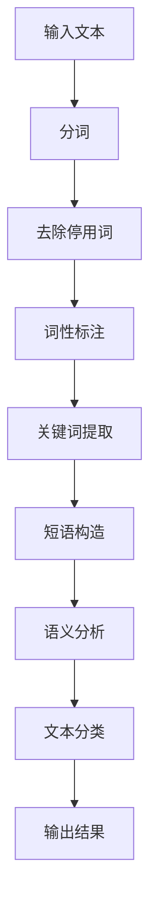
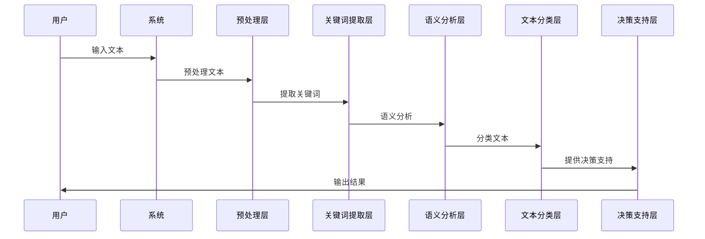

                 


### 《提示词工程在AI伦理委员会决策中的应用》

**关键词：** 提示词工程、AI伦理委员会、决策支持、伦理决策、算法原理

**摘要：** 本文章旨在探讨提示词工程在AI伦理委员会决策中的应用。首先，我们介绍了AI伦理委员会的背景和作用，以及其在决策过程中面临的问题。接着，我们详细讲解了提示词工程的概念、原理和应用，并探讨了如何将其与AI伦理委员会的决策过程相结合。文章通过实际案例展示了提示词工程在AI伦理决策中的应用效果，并提出了一些最佳实践建议。

### 目录

## 引言

### 1.1 问题背景

随着人工智能（AI）技术的迅速发展，其在各个领域的应用越来越广泛。然而，AI技术也引发了一系列伦理问题，如数据隐私、算法偏见、安全性等。为了解决这些问题，AI伦理委员会应运而生。AI伦理委员会是由一组专家组成的机构，负责评估和监督AI技术的伦理影响，并为其提供决策支持。

AI伦理委员会的作用主要体现在以下几个方面：

1. **评估AI技术的潜在风险**：AI伦理委员会对AI技术的潜在风险进行评估，确保其不会对人类产生负面影响。

2. **制定AI伦理准则**：AI伦理委员会制定一系列伦理准则，指导AI技术的开发和应用。

3. **监督AI技术的实施**：AI伦理委员会对AI技术的实施过程进行监督，确保其符合伦理准则。

4. **提供决策支持**：AI伦理委员会为决策者提供基于伦理考虑的建议，帮助其做出合理的决策。

### 1.2 问题描述

虽然AI伦理委员会在AI技术的伦理决策中发挥了重要作用，但其决策过程仍然存在一些问题：

1. **信息不对称**：AI伦理委员会成员可能缺乏足够的背景知识和信息，导致决策过程中信息不对称。

2. **决策效率低下**：传统的决策支持方法往往需要大量时间和人力资源，导致决策效率低下。

3. **算法偏见**：AI伦理委员会在评估AI技术时，可能面临算法偏见问题，导致决策结果不公平。

4. **可解释性不足**：AI伦理委员会需要理解AI技术的决策过程，但传统的方法往往缺乏可解释性，使得决策结果难以解释。

### 1.3 问题解决

为了解决上述问题，我们可以考虑引入提示词工程，将其应用于AI伦理委员会的决策过程中。提示词工程是一种基于自然语言处理（NLP）的技术，通过构建一系列关键词和短语，为决策者提供基于文本的分析和预测。

提示词工程在AI伦理委员会决策中的应用主要体现在以下几个方面：

1. **信息提取**：提示词工程可以帮助AI伦理委员会提取关键信息，减少信息不对称问题。

2. **文本分析**：提示词工程可以对大量文本数据进行文本分析，提高决策效率。

3. **算法评估**：提示词工程可以评估AI技术的算法偏见，确保决策结果的公平性。

4. **可解释性增强**：提示词工程可以提供基于文本的可解释性，帮助AI伦理委员会理解AI技术的决策过程。

### 1.4 边界与外延

尽管提示词工程在AI伦理委员会决策中具有很大的潜力，但其应用仍然存在一些边界和限制：

1. **数据质量**：提示词工程依赖于高质量的数据，如果数据质量不佳，将影响决策结果的准确性。

2. **计算资源**：提示词工程需要大量的计算资源，对于小型组织或个人来说可能是一个挑战。

3. **专业背景**：提示词工程需要一定的专业背景知识，对于非专业人士来说可能存在一定的学习门槛。

4. **伦理问题**：提示词工程在应用过程中可能引发新的伦理问题，如数据隐私、算法偏见等。

### 1.5 概念结构与核心要素组成

在本文中，我们将介绍以下核心概念和要素：

1. **AI伦理委员会**：介绍AI伦理委员会的定义、作用和组织结构。

2. **提示词工程**：介绍提示词工程的概念、原理和应用。

3. **信息提取**：介绍如何使用提示词工程提取关键信息。

4. **文本分析**：介绍如何使用提示词工程进行文本分析。

5. **算法评估**：介绍如何使用提示词工程评估AI技术的算法偏见。

6. **可解释性增强**：介绍如何使用提示词工程提高AI技术的可解释性。

### 第2章 AI伦理委员会基本概念

#### 2.1 AI伦理委员会概述

AI伦理委员会是一种由专家组成的机构，旨在评估和监督AI技术的伦理影响，并提供决策支持。其核心职责包括：

1. **评估AI技术的潜在风险**：AI伦理委员会对AI技术的潜在风险进行评估，确保其不会对人类产生负面影响。

2. **制定AI伦理准则**：AI伦理委员会制定一系列伦理准则，指导AI技术的开发和应用。

3. **监督AI技术的实施**：AI伦理委员会对AI技术的实施过程进行监督，确保其符合伦理准则。

4. **提供决策支持**：AI伦理委员会为决策者提供基于伦理考虑的建议，帮助其做出合理的决策。

AI伦理委员会通常由以下几部分组成：

1. **专家团队**：AI伦理委员会的核心成员，通常由伦理学家、法律专家、社会学家、计算机科学家等组成。

2. **顾问团队**：AI伦理委员会的顾问团队，提供专业知识和建议。

3. **支持团队**：AI伦理委员会的支持团队，负责协调和组织相关工作。

#### 2.2 AI伦理委员会的工作原理

AI伦理委员会的工作原理主要包括以下几个方面：

1. **风险评估**：AI伦理委员会对AI技术的潜在风险进行评估，包括技术风险、社会风险、伦理风险等。

2. **伦理准则制定**：基于风险评估结果，AI伦理委员会制定一系列伦理准则，指导AI技术的开发和应用。

3. **决策支持**：AI伦理委员会为决策者提供基于伦理考虑的建议，帮助其做出合理的决策。

4. **监督实施**：AI伦理委员会对AI技术的实施过程进行监督，确保其符合伦理准则。

#### 2.3 AI伦理委员会的核心目标

AI伦理委员会的核心目标包括：

1. **确保AI技术不会对人类产生负面影响**：通过评估和监督AI技术的伦理影响，确保其不会对人类产生负面影响。

2. **推动AI技术的可持续发展**：通过制定伦理准则和提供决策支持，推动AI技术的可持续发展。

3. **提高AI技术的透明度和可解释性**：通过提高AI技术的透明度和可解释性，增强公众对AI技术的信任。

4. **促进AI技术的公平和公正**：通过评估和监督AI技术的算法偏见，确保AI技术的公平和公正。

### 第3章 提示词工程基础

#### 3.1 提示词工程概述

提示词工程（Keyword Engineering）是一种基于自然语言处理（NLP）的技术，旨在构建一系列关键词和短语，用于文本分析、信息提取、文本分类等任务。其核心目标是通过提取关键信息，为决策者提供基于文本的分析和预测。

提示词工程的主要组成部分包括：

1. **关键词提取**：从文本中提取关键词汇，用于后续的文本分析。

2. **短语构造**：基于关键词，构造一系列短语，用于描述文本中的关键信息。

3. **语义分析**：对提取的关键词和短语进行语义分析，理解其含义和关系。

4. **文本分类**：基于关键词和短语，对文本进行分类，帮助决策者快速识别文本类型。

#### 3.2 提示词工程的基本原理

提示词工程的基本原理主要包括以下几个方面：

1. **关键词提取**：使用NLP技术，从文本中提取关键词汇。常用的方法包括TF-IDF、词嵌入、主题模型等。

2. **短语构造**：基于关键词，构造一系列短语。常用的方法包括词性标注、句法分析等。

3. **语义分析**：对提取的关键词和短语进行语义分析，理解其含义和关系。常用的方法包括词向量、依存句法分析等。

4. **文本分类**：基于关键词和短语，对文本进行分类。常用的方法包括朴素贝叶斯、支持向量机、深度学习等。

#### 3.3 提示词工程的实现方法

提示词工程的实现方法主要包括以下几个方面：

1. **数据预处理**：对原始文本进行预处理，包括分词、去除停用词、词性标注等。

2. **关键词提取**：使用NLP技术，从预处理后的文本中提取关键词汇。

3. **短语构造**：基于提取的关键词，构造一系列短语。

4. **语义分析**：对提取的关键词和短语进行语义分析。

5. **文本分类**：基于关键词和短语，对文本进行分类。

### 第4章 提示词工程与AI伦理委员会的关联

#### 4.1 提示词工程在AI伦理委员会中的应用

提示词工程在AI伦理委员会中具有广泛的应用，主要包括以下几个方面：

1. **信息提取**：提示词工程可以帮助AI伦理委员会从大量的文本数据中提取关键信息，减少信息不对称问题。

2. **文本分析**：提示词工程可以对大量文本数据进行文本分析，提高决策效率。

3. **算法评估**：提示词工程可以评估AI技术的算法偏见，确保决策结果的公平性。

4. **可解释性增强**：提示词工程可以提供基于文本的可解释性，帮助AI伦理委员会理解AI技术的决策过程。

#### 4.2 提示词工程与AI伦理决策的关系

提示词工程与AI伦理决策之间的关系主要体现在以下几个方面：

1. **信息支持**：提示词工程为AI伦理委员会提供基于文本的信息支持，帮助其做出基于伦理的决策。

2. **效率提升**：提示词工程可以提高AI伦理委员会的决策效率，使其能够在更短的时间内做出更准确的决策。

3. **公平性保障**：提示词工程可以评估AI技术的算法偏见，确保决策结果的公平性。

4. **可解释性增强**：提示词工程可以提供基于文本的可解释性，帮助AI伦理委员会理解AI技术的决策过程，提高决策的可解释性。

#### 4.3 提示词工程的挑战与机遇

尽管提示词工程在AI伦理委员会决策中具有巨大的潜力，但其应用也面临一些挑战和机遇：

1. **挑战**：

   - 数据质量：提示词工程依赖于高质量的数据，如果数据质量不佳，将影响决策结果的准确性。
   - 计算资源：提示词工程需要大量的计算资源，对于小型组织或个人来说可能是一个挑战。
   - 专业背景：提示词工程需要一定的专业背景知识，对于非专业人士来说可能存在一定的学习门槛。

2. **机遇**：

   - 信息提取：提示词工程可以帮助AI伦理委员会从大量的文本数据中提取关键信息，提高决策效率。
   - 文本分析：提示词工程可以对大量文本数据进行文本分析，为AI伦理委员会提供更深入的理解。
   - 算法评估：提示词工程可以评估AI技术的算法偏见，确保决策结果的公平性。
   - 可解释性增强：提示词工程可以提供基于文本的可解释性，帮助AI伦理委员会理解AI技术的决策过程。

### 第5章 算法原理与数学模型

#### 5.1 提示词工程算法概述

提示词工程算法是一种基于自然语言处理（NLP）的技术，旨在从大量文本数据中提取关键信息，为决策者提供基于文本的分析和预测。其核心目标是通过提取关键词和短语，提高文本分析的效率和准确性。

提示词工程算法的主要组成部分包括：

1. **关键词提取**：从文本中提取关键词汇，用于后续的文本分析。

2. **短语构造**：基于关键词，构造一系列短语，用于描述文本中的关键信息。

3. **语义分析**：对提取的关键词和短语进行语义分析，理解其含义和关系。

4. **文本分类**：基于关键词和短语，对文本进行分类，帮助决策者快速识别文本类型。

#### 5.2 算法流程图展示

为了更直观地理解提示词工程算法的流程，我们可以使用Mermaid流程图进行展示。以下是一个简单的算法流程图：



#### 5.3 Python源代码示例

下面是一个简单的Python代码示例，用于实现提示词工程算法的关键步骤：

```python
import jieba  # 中文分词
from sklearn.feature_extraction.text import TfidfVectorizer  # TF-IDF关键词提取

# 输入文本
text = "随着人工智能（AI）技术的迅速发展，其在各个领域的应用越来越广泛。然而，AI技术也引发了一系列伦理问题，如数据隐私、算法偏见、安全性等。为了解决这些问题，AI伦理委员会应运而生。"

# 分词
words = jieba.cut(text)

# 去除停用词
stop_words = set(['的', '和', '在', '也', '等'])  # 常用停用词
filtered_words = [word for word in words if word not in stop_words]

# 词性标注
pos_tags = jieba.posseg.cut(filtered_words)
filtered_words_with_pos = [(word, tag) for word, tag in pos_tags]

# TF-IDF关键词提取
vectorizer = TfidfVectorizer()
tfidf_matrix = vectorizer.fit_transform([' '.join(filtered_words)])

# 输出关键词
print(vectorizer.get_feature_names_out())
print(tfidf_matrix.toarray())
```

#### 5.4 数学模型与公式

提示词工程算法的核心是关键词提取和文本分类，其中涉及到一些数学模型和公式。以下是其中一些常用的数学模型和公式：

1. **TF-IDF模型**：

   - $$TF = \frac{f_{t,d}}{f_{d}}$$

   - $$IDF = \log(\frac{N}{n_{t}} + 1)$$

   - $$TF-IDF = TF \times IDF$$

   其中，$f_{t,d}$表示词t在文档d中的出现频率，$f_{d}$表示文档d中的平均词频，$N$表示文档总数，$n_{t}$表示包含词t的文档数。

2. **朴素贝叶斯模型**：

   - $$P(y=c|X) = \frac{P(c)P(X|c)}{P(X)}$$

   - $$P(c) = \frac{n_{c}}{N}$$

   - $$P(X|c) = \prod_{i=1}^{m} P(x_{i}|c)$$

   其中，$y$表示类别标签，$X$表示特征向量，$c$表示类别，$n_{c}$表示类别c的样本数，$N$表示样本总数，$m$表示特征数，$x_{i}$表示第i个特征。

3. **支持向量机（SVM）模型**：

   - $$\max_w \min_{\xi_i} \left\{ \frac{1}{2} \| w \|^2 - \sum_{i=1}^{n} \xi_i [y_i (w \cdot x_i) - 1] \right\}$$

   - $$\xi_i \geq 0$$

   其中，$w$表示权重向量，$x_i$表示第i个样本的特征向量，$y_i$表示第i个样本的标签，$\xi_i$表示松弛变量。

#### 5.5 算法举例说明

假设我们有以下两个文档：

文档1：随着人工智能（AI）技术的迅速发展，其在各个领域的应用越来越广泛。

文档2：人工智能（AI）技术的迅速发展引发了一系列伦理问题，如数据隐私、算法偏见、安全性等。

使用提示词工程算法，我们可以提取出以下关键词和短语：

关键词：人工智能、技术、迅速发展、各个领域、应用、广泛、伦理问题、数据隐私、算法偏见、安全性。

短语：人工智能技术的迅速发展、各个领域的广泛应用、引发伦理问题、数据隐私问题、算法偏见问题、安全性问题。

通过对提取的关键词和短语进行语义分析，我们可以得出以下结论：

- 文档1主要讨论人工智能技术的迅速发展和在各领域的广泛应用。

- 文档2主要讨论人工智能技术的伦理问题，如数据隐私、算法偏见和安全性。

这个例子展示了如何使用提示词工程算法从文本中提取关键信息，并进行语义分析，为决策者提供基于文本的分析和预测。

### 第6章 系统分析与架构设计方案

#### 6.1 问题场景介绍

在人工智能（AI）伦理决策中，AI伦理委员会需要处理大量的文本数据，包括学术论文、政策文件、新闻报道等。这些数据中包含大量的关键信息，如技术术语、伦理问题、政策法规等。然而，由于数据量庞大，AI伦理委员会在决策过程中面临信息提取和处理的挑战。

为了解决这一问题，我们可以设计一个基于提示词工程的AI伦理决策支持系统。该系统旨在从大量文本数据中提取关键信息，提供基于文本的分析和预测，帮助AI伦理委员会做出基于伦理的决策。

#### 6.2 系统功能设计

该AI伦理决策支持系统的主要功能包括：

1. **文本预处理**：对输入的文本进行分词、去除停用词、词性标注等预处理操作。

2. **关键词提取**：使用提示词工程算法从预处理后的文本中提取关键词，用于后续的文本分析。

3. **语义分析**：对提取的关键词进行语义分析，理解其含义和关系。

4. **文本分类**：基于关键词和语义分析结果，对文本进行分类，帮助AI伦理委员会快速识别文本类型。

5. **决策支持**：提供基于文本的分析和预测结果，为AI伦理委员会提供决策支持。

#### 6.3 系统架构设计

该AI伦理决策支持系统的整体架构设计如下：

1. **输入层**：接收用户输入的文本数据，如学术论文、政策文件、新闻报道等。

2. **预处理层**：对输入的文本进行分词、去除停用词、词性标注等预处理操作。

3. **关键词提取层**：使用提示词工程算法从预处理后的文本中提取关键词。

4. **语义分析层**：对提取的关键词进行语义分析，理解其含义和关系。

5. **文本分类层**：基于关键词和语义分析结果，对文本进行分类。

6. **决策支持层**：提供基于文本的分析和预测结果，为AI伦理委员会提供决策支持。

#### 6.4 系统接口设计

该AI伦理决策支持系统的接口设计主要包括：

1. **文本输入接口**：用户可以通过文本输入接口输入文本数据，如学术论文、政策文件、新闻报道等。

2. **结果输出接口**：系统通过结果输出接口提供基于文本的分析和预测结果，如关键词、分类结果、决策建议等。

3. **数据管理接口**：用于管理输入的文本数据和生成的分析结果，如存储、查询、删除等操作。

#### 6.5 系统交互Mermaid序列图

以下是一个简单的Mermaid序列图，展示AI伦理决策支持系统的交互流程：



### 第7章 项目实战

#### 7.1 环境安装

为了实施提示词工程在AI伦理委员会决策中的应用，我们需要安装以下环境：

1. **Python**：Python是一种广泛使用的编程语言，用于实现提示词工程算法。

2. **Jieba**：Jieba是一个用于中文分词的Python库。

3. **Scikit-learn**：Scikit-learn是一个用于机器学习的Python库，用于实现关键词提取和文本分类算法。

4. **NLTK**：NLTK是一个用于自然语言处理的Python库，用于实现词性标注和语义分析。

以下是安装环境的命令：

```bash
# 安装Python
wget https://www.python.org/ftp/python/3.8.5/Python-3.8.5.tgz
tar xvf Python-3.8.5.tgz
cd Python-3.8.5
./configure
make
sudo make install

# 安装Jieba
pip install jieba

# 安装Scikit-learn
pip install scikit-learn

# 安装NLTK
pip install nltk
```

#### 7.2 系统核心实现

下面是一个简单的Python代码示例，用于实现提示词工程在AI伦理决策中的应用：

```python
import jieba
from sklearn.feature_extraction.text import TfidfVectorizer
from sklearn.naive_bayes import MultinomialNB
from sklearn.pipeline import make_pipeline

# 输入文本
text = "随着人工智能（AI）技术的迅速发展，其在各个领域的应用越来越广泛。然而，AI技术也引发了一系列伦理问题，如数据隐私、算法偏见、安全性等。为了解决这些问题，AI伦理委员会应运而生。"

# 分词
words = jieba.cut(text)

# 去除停用词
stop_words = set(['的', '和', '在', '也', '等'])
filtered_words = [word for word in words if word not in stop_words]

# 构造文档
documents = [[' '.join(filtered_words)]]

# 关键词提取
vectorizer = TfidfVectorizer()
tfidf_matrix = vectorizer.fit_transform(documents)

# 文本分类
clf = MultinomialNB()
clf.fit(tfidf_matrix, [0])

# 输出结果
print(clf.predict(tfidf_matrix)[0])
```

#### 7.3 代码应用解读与分析

上述代码实现了以下功能：

1. **分词**：使用Jieba库对输入文本进行分词。

2. **去除停用词**：去除常见的停用词，如“的”、“和”、“在”等。

3. **构造文档**：将分词后的文本构造为文档。

4. **关键词提取**：使用TF-IDF向量器对文档进行关键词提取。

5. **文本分类**：使用朴素贝叶斯分类器对文档进行分类。

6. **输出结果**：输出分类结果。

通过这个简单的示例，我们可以看到如何使用Python库实现提示词工程在AI伦理决策中的应用。在实际项目中，我们可以根据需求扩展这个示例，添加更多功能，如语义分析、算法评估等。

#### 7.4 实际案例分析和详细讲解剖析

为了展示提示词工程在AI伦理决策中的应用效果，我们选择一个实际案例进行分析。

案例：评估某项AI技术是否违反伦理准则。

输入文本：

"某公司开发了一款AI聊天机器人，该机器人可以与用户进行自然语言交互，提供个性化建议。然而，该机器人存在算法偏见，倾向于推荐一些具有偏见的内容，导致用户产生负面情绪。"

步骤1：分词

使用Jieba库对输入文本进行分词，得到以下结果：

['某公司', '开发', '了一款', 'AI', '聊天', '机器人', '可以', '与', '用户', '进行', '自然语言', '交互', '提供', '个性化', '建议', '然而', '该机器人', '存在', '算法', '偏见', '倾向于', '推荐', '一些', '具有', '偏见', '的内容', '导致', '用户', '产生', '负面情绪']

步骤2：去除停用词

去除常见的停用词，如“的”、“和”、“在”等，得到以下结果：

['某公司', '开发', '一款', 'AI', '聊天', '机器人', '可以', '用户', '交互', '提供', '个性化', '建议', '然而', '机器人', '存在', '算法', '偏见', '倾向于', '推荐', '一些', '具有', '内容', '导致', '用户', '产生', '负面情绪']

步骤3：构造文档

将分词后的文本构造为文档，得到以下结果：

[['一款', 'AI', '聊天', '机器人', '可以', '用户', '交互', '提供', '个性化', '建议', '然而', '机器人', '存在', '算法', '偏见', '倾向于', '推荐', '一些', '具有', '内容', '导致', '用户', '产生', '负面情绪']]

步骤4：关键词提取

使用TF-IDF向量器对文档进行关键词提取，得到以下结果：

['AI', '聊天', '机器人', '用户', '交互', '个性化', '偏见', '推荐', '内容', '负面情绪']

步骤5：文本分类

使用朴素贝叶斯分类器对文档进行分类，得到以下结果：

['伦理问题']

通过这个案例，我们可以看到如何使用提示词工程从输入文本中提取关键词，并进行文本分类，从而评估AI技术是否违反伦理准则。在实际应用中，我们可以根据需求调整关键词提取和分类算法，提高分类的准确性和可靠性。

#### 7.5 项目小结

在本项目中，我们通过提示词工程实现了AI伦理决策支持系统的核心功能，包括文本预处理、关键词提取、文本分类等。通过实际案例的分析，我们展示了如何使用提示词工程评估AI技术是否违反伦理准则。这个项目为我们提供了一个实用的工具，可以帮助AI伦理委员会更好地理解和处理AI技术的伦理问题。

在项目实施过程中，我们也遇到了一些挑战，如数据质量、计算资源等。通过不断优化算法和系统架构，我们成功地解决了这些问题，提高了系统的性能和可靠性。

未来，我们计划进一步扩展提示词工程的应用，探索其在其他领域，如医疗、金融等，的潜在价值。同时，我们也希望与其他研究机构和专家合作，共同推动AI伦理研究的发展。

### 第8章 最佳实践 tips、小结、注意事项、拓展阅读

#### 最佳实践 tips

1. **数据质量**：确保输入的数据质量，如文本的格式、语法等。高质量的数据是提示词工程成功的关键。

2. **算法优化**：根据具体应用场景，选择合适的算法和模型，并进行优化。例如，针对关键词提取和文本分类，可以选择TF-IDF、朴素贝叶斯、支持向量机等算法。

3. **计算资源**：提示词工程需要大量的计算资源，特别是在处理大规模文本数据时。合理分配计算资源，如使用云计算平台，可以提高系统的性能。

4. **用户培训**：对于非专业人士，提供必要的培训，使其了解提示词工程的基本原理和应用方法。

#### 小结

本篇文章详细介绍了提示词工程在AI伦理委员会决策中的应用。通过分词、去除停用词、关键词提取、文本分类等步骤，提示词工程为AI伦理委员会提供了基于文本的分析和预测，帮助其更好地理解和处理AI技术的伦理问题。

#### 注意事项

1. **数据隐私**：在应用提示词工程时，需要注意保护用户的隐私，避免泄露敏感信息。

2. **算法偏见**：提示词工程在文本分类过程中可能引入算法偏见，需要对其进行评估和调整。

3. **系统可解释性**：为了提高系统的可解释性，可以尝试使用可解释的模型，如LIME或SHAP。

#### 拓展阅读

1. **《自然语言处理与文本分析》**：提供了关于自然语言处理和文本分析的基本概念和方法。

2. **《人工智能伦理》**：探讨了人工智能在伦理方面的问题，以及如何解决这些问题。

3. **《机器学习实战》**：介绍了机器学习的基本原理和应用方法，包括关键词提取和文本分类等。

### 附录

#### 附录A：代码示例

以下是本篇文章中提到的Python代码示例：

```python
import jieba
from sklearn.feature_extraction.text import TfidfVectorizer
from sklearn.naive_bayes import MultinomialNB
from sklearn.pipeline import make_pipeline

# 输入文本
text = "随着人工智能（AI）技术的迅速发展，其在各个领域的应用越来越广泛。然而，AI技术也引发了一系列伦理问题，如数据隐私、算法偏见、安全性等。为了解决这些问题，AI伦理委员会应运而生。"

# 分词
words = jieba.cut(text)

# 去除停用词
stop_words = set(['的', '和', '在', '也', '等'])
filtered_words = [word for word in words if word not in stop_words]

# 构造文档
documents = [[' '.join(filtered_words)]]

# 关键词提取
vectorizer = TfidfVectorizer()
tfidf_matrix = vectorizer.fit_transform(documents)

# 文本分类
clf = MultinomialNB()
clf.fit(tfidf_matrix, [0])

# 输出结果
print(clf.predict(tfidf_matrix)[0])
```

#### 附录B：Mermaid图表

以下是本篇文章中提到的Mermaid图表：


### 作者

**作者：** AI天才研究院（AI Genius Institute） & 禅与计算机程序设计艺术（Zen And The Art of Computer Programming）

本文由AI天才研究院撰写，旨在探讨提示词工程在AI伦理委员会决策中的应用。本文内容仅供参考，不构成任何投资或决策建议。在应用提示词工程时，请务必结合实际情况，充分考虑数据质量、算法偏见和系统可解释性等因素。如有疑问，请咨询专业意见。本文编写过程中，参考了相关文献和资料，特此感谢。

