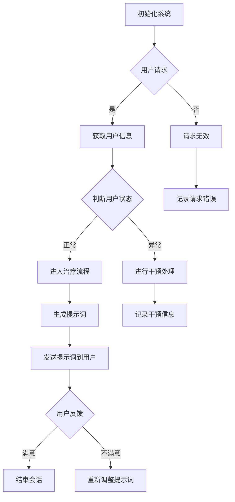
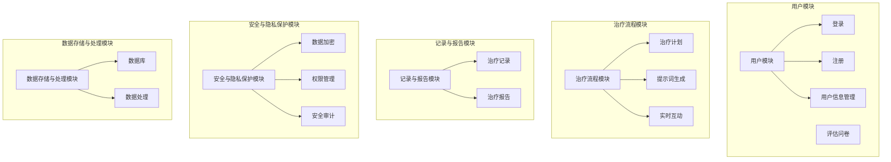
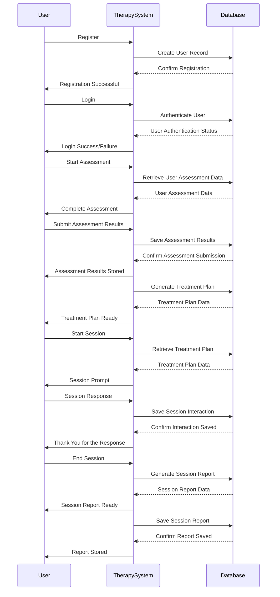

                 

## 第一部分：背景与概述

### 1.1 问题背景

随着人工智能（AI）技术的快速发展，其在各个领域的应用也日渐广泛，尤其在心理健康和医疗保健领域，AI的应用前景备受关注。心理治疗作为一种专业的医疗服务，旨在通过不同的方法和技巧来改善患者的精神健康。传统的心理治疗方法主要依赖于心理医生的专业知识和经验，但这种方法存在一定的局限性。随着AI技术的发展，利用AI进行心理治疗成为了一种新的尝试。

AI心理治疗的核心在于利用机器学习算法和自然语言处理技术来模拟心理医生的行为，为患者提供个性化的治疗方案。这种治疗方法不仅可以提高心理治疗的效率，还能够覆盖到那些由于地理位置、经济条件或心理原因而无法接受传统治疗的患者。

然而，随着AI心理治疗的广泛应用，伦理考量成为一个不可忽视的问题。在AI心理治疗中，提示词工程（Prompt Engineering）作为一种关键的技术，其应用不仅影响着治疗的效果，也直接关系到患者的隐私保护和数据安全。提示词工程涉及到如何设计、选择和优化用于AI心理治疗的提示词，以最大限度地提高治疗效果，同时避免可能的伦理风险。

本文将重点探讨提示词工程在AI心理治疗中的伦理考量，分析其在实际应用中面临的挑战和问题，并提出相应的解决方案和最佳实践。通过系统的分析和深入的研究，本文旨在为AI心理治疗的伦理实践提供理论支持和实践指导。

### 1.2 心理治疗与AI的融合

AI与心理治疗的融合是一个多层面的过程，涉及到技术、心理学、伦理学等多个领域的交叉。首先，从技术角度来看，AI在心理治疗中的应用主要体现在以下几个方面：

1. **数据分析与模式识别**：利用机器学习算法对大量患者数据进行分析，可以帮助心理医生发现潜在的心理问题模式和治疗方案。例如，通过分析患者的语言模式和行为数据，AI可以识别出抑郁、焦虑等心理疾病的早期迹象。

2. **个性化治疗方案**：AI可以根据患者的具体需求和病情，为其定制个性化的治疗方案。通过深度学习和自然语言处理技术，AI可以生成针对特定患者的对话脚本，从而提高治疗的个性化和精准度。

3. **自动化治疗**：通过聊天机器人（Chatbot）等自动化工具，AI可以为患者提供实时的心理支持和咨询服务。这种方式不仅可以降低治疗成本，还能够满足那些无法或不愿意接受面对面治疗的患者需求。

其次，从心理学角度来看，AI在心理治疗中的应用带来了新的机遇和挑战。传统的心理治疗依赖于心理医生与患者之间的互动，而AI则通过模拟这种互动来提供治疗服务。然而，这种模拟是否能够真正替代人类心理医生的工作，还需要进一步的研究和验证。

AI心理治疗的挑战主要体现在以下几个方面：

1. **有效性与可靠性**：尽管AI在数据分析和技术模拟方面具有优势，但其在心理治疗中的有效性和可靠性尚未得到充分验证。如何确保AI提供的治疗方案真正有效，是一个亟待解决的问题。

2. **隐私保护与数据安全**：在AI心理治疗中，患者的个人信息和病史数据会被收集、存储和处理。这涉及到严重的隐私保护和数据安全问题。如何确保这些数据的安全性和隐私性，是AI心理治疗面临的一个重大伦理挑战。

3. **伦理与道德问题**：AI心理治疗中的提示词设计和应用，直接关系到患者的心理健康和治疗效果。如果设计不当，可能会对患者的心理造成负面影响。此外，AI在治疗过程中是否遵循伦理原则，如知情同意、保密性和公正性，也是需要深入探讨的问题。

总之，AI与心理治疗的融合带来了许多新的机遇和挑战。通过合理运用AI技术，可以为心理治疗提供更高效、更个性化的服务。然而，这也要求我们在技术发展的同时，不断思考和解决伦理和道德问题，以确保AI心理治疗的可持续性和安全性。

### 1.3 伦理考量的重要性

伦理考量在AI心理治疗中扮演着至关重要的角色，其核心在于确保技术的应用不仅有效且符合伦理标准。首先，心理学伦理的基本原则包括：

1. **知情同意**：患者在参与心理治疗之前，必须明确知晓治疗过程、目的、可能的风险和利益，并自愿同意参与。这一原则在AI心理治疗中尤为重要，因为患者可能无法完全理解AI系统的复杂性和潜在风险。

2. **保密性**：患者的个人信息和病史数据必须得到严格保护，防止未经授权的访问和泄露。AI系统在处理这些数据时，必须采用先进的加密技术和数据保护措施。

3. **公正性**：AI心理治疗的应用不应歧视任何群体，包括种族、性别、年龄等。系统设计时需要考虑多样性和公平性，确保所有患者都能获得平等的治疗机会。

4. **尊重自主性**：患者有权决定是否接受AI心理治疗，以及如何进行治疗。医生和AI系统应尊重患者的选择和自主性，避免强制或诱导患者接受治疗。

目前，AI伦理的现状与挑战主要体现在以下几个方面：

1. **伦理规范缺失**：虽然一些组织和机构开始制定AI伦理规范，但整体上，AI伦理的规范化程度仍然较低。特别是在心理治疗领域，缺乏明确的伦理准则和指导文件，导致实践中存在许多不确定性。

2. **技术局限性**：当前的AI技术尚未完全达到能够替代人类心理医生的水平，特别是在处理复杂情感问题和个体差异方面。这要求我们在应用AI技术时，必须谨慎评估其可靠性和有效性。

3. **隐私和数据安全**：AI心理治疗过程中会涉及大量敏感数据，包括患者的个人信息、病史和治疗记录。如何确保这些数据的安全性和隐私性，是一个亟待解决的问题。

4. **伦理审查和监督**：现有的伦理审查机制尚不能全面覆盖AI心理治疗的各个阶段，从研发到应用都存在监督不足的问题。这可能导致伦理风险和道德问题在实践过程中被忽视。

综上所述，伦理考量在AI心理治疗中具有不可替代的重要性。通过严格的伦理规范和有效的监督机制，我们可以确保AI技术在心理治疗中的应用不仅高效、可靠，而且符合伦理标准，真正为患者的心理健康提供有益的支持。

### 1.4 提示词工程在AI心理治疗中的作用

提示词工程（Prompt Engineering）在AI心理治疗中发挥着至关重要的作用，其定义和基本原理使得这一技术在提高治疗效果和个性化服务水平方面展现出独特的优势。

#### 提示词工程的定义

提示词工程是指设计和选择能够有效引导AI模型输出所需结果的输入文本的过程。在AI心理治疗中，提示词是心理医生与患者之间沟通的桥梁，通过精心设计的提示词，AI系统能够更好地理解患者的需求，提供更加准确和个性化的治疗方案。

#### 提示词工程的基本原理

提示词工程的基本原理包括以下几个关键方面：

1. **上下文理解**：提示词的设计需要充分考虑上下文信息，确保AI系统能够准确理解患者的具体问题和需求。通过上下文丰富的提示词，AI模型可以生成更具针对性和个性化的回复。

2. **反馈机制**：提示词工程还包括设计有效的反馈机制，以评估AI系统的输出结果，并根据反馈进行调整。这种方法有助于持续优化AI模型的表现，提高治疗效果。

3. **多模态整合**：提示词工程不仅关注文本提示，还包括视觉、音频等多模态信息的整合。通过多模态提示词，AI系统能够更全面地理解患者的情感和行为，提供更全面的治疗方案。

#### 提示词工程在AI心理治疗中的实践与应用

在实际应用中，提示词工程在AI心理治疗中展示了以下几个方面的优势：

1. **个性化治疗**：通过个性化设计的提示词，AI系统能够根据患者的具体情况进行定制化治疗。这种个性化服务不仅提高了治疗的精准度，还增强了患者的参与感和满意度。

2. **自然语言交互**：提示词工程使得AI系统能够与患者进行自然语言交互，模拟心理医生与患者的对话过程。这种交互方式不仅增加了治疗过程的自然性和亲切感，还有助于建立患者对AI系统的信任。

3. **实时反馈与调整**：提示词工程中的反馈机制使得AI系统能够根据患者的实时反馈进行调整，确保治疗过程始终符合患者的需求和期望。这种实时调整能力大大提高了治疗的灵活性和有效性。

4. **数据收集与分析**：提示词工程不仅有助于提高治疗效果，还能够通过分析患者的交互数据，为心理医生提供宝贵的数据支持。这些数据可以用于优化治疗方案、评估治疗进展和发现潜在问题。

总之，提示词工程在AI心理治疗中的应用，不仅提高了治疗的个性化和精准度，还增强了患者的参与感和满意度。通过合理的提示词设计和有效的反馈机制，AI系统能够更好地模拟人类心理医生的行为，为患者提供高效、可靠的心理健康服务。

### 1.5 本章小结

本章从背景、融合、伦理重要性以及提示词工程的作用四个方面，对AI心理治疗及其伦理考量进行了全面探讨。首先，我们介绍了AI心理治疗的背景，阐述了其在心理健康和医疗保健领域的应用前景。接着，分析了AI与心理治疗融合所带来的机遇与挑战，并着重讨论了AI伦理的现状与挑战。随后，我们详细介绍了提示词工程的基本概念和原理，以及其在AI心理治疗中的具体应用。通过本章的探讨，我们为后续章节的深入分析奠定了基础，并明确了研究的重点和方向。

---

## 第二部分：核心概念与原理

### 2.1 提示词工程概述

#### 提示词工程的核心概念

提示词工程（Prompt Engineering）是指通过设计、选择和优化输入提示词，以引导AI系统生成所需输出的技术。在AI心理治疗中，提示词工程的核心概念包括以下几个方面：

1. **提示词**：提示词是引导AI系统生成预期输出的文本。这些文本可以是简单的关键词、短语或完整的句子，其目的是帮助AI系统理解用户的意图和需求。

2. **上下文**：上下文是指提示词周围的语境和环境信息。有效的提示词工程需要考虑上下文信息，以确保AI系统能够准确理解用户的意图。

3. **反馈机制**：反馈机制是指通过用户的反馈来调整和优化AI系统的输出。这种反馈可以是直接的文本回复，也可以是行为数据，如用户对回复的满意度评分。

4. **个性化**：个性化是指根据用户的具体需求和情况，定制化设计提示词。个性化的提示词能够提高AI系统的响应质量和用户体验。

#### 提示词工程的基本原理

提示词工程的基本原理包括以下几个关键方面：

1. **上下文理解**：提示词工程的核心在于确保AI系统能够准确理解上下文信息。这通常涉及到自然语言处理（NLP）技术的应用，如词嵌入、语义分析和上下文感知。

2. **多模态整合**：提示词工程不仅关注文本提示，还包括视觉、音频等多模态信息的整合。多模态整合可以提供更丰富的上下文信息，从而提高AI系统的理解能力。

3. **反馈机制**：反馈机制是提示词工程的另一个重要组成部分。通过用户的反馈，AI系统能够不断学习和优化其输出。这种反馈可以是自动化的，如基于用户行为数据的调整，也可以是手动调整，如根据用户反馈进行提示词的优化。

4. **自适应学习**：提示词工程强调AI系统的自适应学习能力。通过不断学习和调整，AI系统能够更好地适应不同的用户和场景，提供更个性化的服务。

#### 提示词工程的重要性

提示词工程在AI心理治疗中的重要性体现在以下几个方面：

1. **提高治疗效果**：通过个性化设计的提示词，AI系统能够更好地理解患者的需求和问题，提供更精准和有效的治疗方案。

2. **增强用户体验**：有效的提示词工程可以提升患者的参与感和满意度，使心理治疗过程更加自然和亲切。

3. **数据收集与分析**：提示词工程有助于收集和分析患者的交互数据，为心理医生提供宝贵的治疗支持和优化建议。

4. **降低成本**：提示词工程可以减少人工干预的需求，降低治疗成本，使心理治疗服务更广泛地普及。

总之，提示词工程在AI心理治疗中发挥着至关重要的作用，通过其核心概念和基本原理的应用，能够显著提高治疗的效果和个性化服务水平。接下来，我们将进一步探讨提示词工程的详细应用和具体实现。

### 2.2 伦理考量模型

在AI心理治疗中，伦理考量模型是确保技术设计与应用过程中遵循伦理原则的重要工具。伦理考量模型不仅提供了一个结构化的框架，帮助开发者和心理医生识别和评估潜在的伦理问题，还能指导他们在设计、开发和实施AI系统时做出符合伦理的决策。

#### 伦理考量模型的结构

伦理考量模型通常包括以下几个关键组成部分：

1. **伦理原则**：伦理考量模型以一系列伦理原则为基础，如知情同意、保密性、公正性、尊重自主性等。这些原则为评估和解决伦理问题提供了基本框架。

2. **风险评估**：风险评估是伦理考量模型的核心环节，旨在识别和评估AI心理治疗应用过程中可能出现的伦理风险，包括隐私泄露、数据滥用、算法偏见等。

3. **决策支持**：决策支持部分提供了一系列工具和方法，帮助开发者和心理医生在面临伦理问题时做出合理决策。这些工具和方法包括伦理审查、利益相关者参与和持续监督等。

4. **实施与监督**：实施与监督部分确保伦理考量模型在实际应用中得以落实。这包括建立明确的伦理规范、定期进行伦理审查和持续监控AI系统的运行状况。

#### 伦理考量模型的应用

在实际应用中，伦理考量模型通过以下几个步骤来指导AI心理治疗的设计和实施：

1. **问题识别**：在系统设计和实施之前，识别可能涉及的伦理问题。这可以通过文献回顾、专家咨询和用户访谈等方式进行。

2. **风险评估**：针对识别出的伦理问题，进行详细的风险评估。这包括分析问题的严重程度、发生的可能性以及可能的影响。

3. **制定策略**：根据风险评估的结果，制定相应的策略来减轻或消除伦理风险。这可能包括设计隐私保护机制、算法公平性审查和用户知情同意程序等。

4. **伦理审查**：在系统设计、开发和部署过程中，定期进行伦理审查，确保所有设计决策和应用都符合伦理原则。伦理审查可以由独立的伦理委员会或内部伦理团队负责。

5. **持续监督**：系统部署后，持续监督其运行状况，确保伦理考量模型的应用得到有效落实。这可以通过定期审计、用户反馈和数据监控等方式实现。

#### 伦理考量模型在AI心理治疗中的重要性

伦理考量模型在AI心理治疗中的重要性体现在以下几个方面：

1. **确保合规性**：伦理考量模型帮助开发者和心理医生确保AI系统的设计和应用符合相关法律法规和伦理规范。

2. **提升患者信任**：通过透明和公正的设计过程，患者对AI心理治疗的信任度得到提升，有利于建立良好的医患关系。

3. **优化治疗过程**：伦理考量模型有助于识别和解决AI心理治疗中的潜在问题，从而优化治疗过程，提高治疗效果。

4. **促进技术发展**：通过关注伦理问题，伦理考量模型为AI心理治疗的发展提供了更加全面和可持续的方向，推动技术的进步和应用的普及。

总之，伦理考量模型在AI心理治疗中的应用，不仅为技术开发提供了伦理指导，还为患者保护提供了有效保障。通过这一模型，我们可以确保AI心理治疗的实施不仅高效可靠，而且符合伦理标准，真正为患者的心理健康提供有益的支持。

### 2.3 核心概念属性特征对比表格

在深入探讨AI心理治疗中的提示词工程时，了解核心概念之间的属性特征对比是至关重要的。以下是几个关键概念及其属性特征的对比表格：

#### 概念一：提示词
| 属性特征       | 提示词           | 说明 |
|--------------|--------------|------|
| 设计目标       | 引导AI系统生成预期输出 | 用于理解用户意图 |
| 形式          | 文本、图像、音频等     | 多模态整合 |
| 可定制性      | 根据用户需求定制       | 提高个性化服务水平 |
| 反馈机制       | 用户反馈进行优化       | 提升系统性能 |

#### 概念二：上下文
| 属性特征       | 上下文           | 说明 |
|--------------|--------------|------|
| 定义          | 提示词周围的语境信息 | 帮助AI理解用户意图 |
| 形式          | 文本、语音、图像等   | 多模态上下文 |
| 重要性        | 决定输出质量       | 上下文丰富性影响理解准确度 |
| 管理策略       | 动态调整上下文信息   | 提升系统适应性 |

#### 概念三：反馈机制
| 属性特征       | 反馈机制           | 说明 |
|--------------|--------------|------|
| 目标          | 提升AI系统输出质量 | 通过用户反馈进行优化 |
| 类型          | 文本、评分、行为等  | 多种反馈方式 |
| 效果评估       | 用户满意度、治疗效果 | 反馈效果直接影响系统优化 |
| 实现策略       | 自动化与手动调整     | 结合用户反馈与专家指导 |

#### 概念四：个性化
| 属性特征       | 个性化           | 说明 |
|--------------|--------------|------|
| 基础          | 根据用户需求定制     | 提高用户满意度 |
| 形式          | 参数调整、数据挖掘   | 多种实现方式 |
| 优势          | 提升用户体验       | 针对个体差异提供精准服务 |
| 实现挑战       | 数据隐私与多样性     | 需要平衡隐私保护与个性化需求 |

#### 概念五：多模态整合
| 属性特征       | 多模态整合           | 说明 |
|--------------|--------------|------|
| 目标          | 提供更丰富的上下文信息 | 提高AI系统的理解能力 |
| 形式          | 文本、图像、语音等     | 多种信息形式结合 |
| 优势          | 增强交互体验         | 提高用户的参与感 |
| 实现策略       | 数据集成与处理       | 需要复杂技术支持 |

通过对比这些核心概念的属性特征，我们可以更深入地理解它们在AI心理治疗中的应用和相互作用。这个表格不仅帮助我们识别每个概念的关键属性，还为后续的算法原理讲解和系统架构设计提供了基础。

### 2.4 ER实体关系图架构

#### ER实体关系图的基本构建

实体关系图（Entity-Relationship Diagram，ER图）是一种用于描述数据库中实体及其之间关系的图形化表示方法。在AI心理治疗中的提示词工程领域，ER图用于设计和管理系统的数据结构。以下是ER图的基本构建步骤：

1. **确定实体**：首先，我们需要识别系统中的主要实体，例如用户（User）、治疗师（Therapist）、治疗记录（TreatmentRecord）、提示词（Prompt）等。

2. **定义属性**：为每个实体定义其属性，例如用户实体可能包含用户ID（UserID）、姓名（Name）、年龄（Age）等属性。

3. **建立关系**：确定实体之间的关系，例如用户与治疗记录之间存在多对多关系，用户可以拥有多个治疗记录，每个治疗记录也可以属于多个用户。

4. **定义约束**：为关系设置约束条件，例如在用户和治疗记录之间的关系中，可以设置唯一性约束，确保每个治疗记录只与一个用户关联。

#### ER图在提示词工程中的应用

在AI心理治疗中，ER图的应用主要体现在以下几个方面：

1. **数据管理**：通过ER图，我们可以清晰地定义和管理系统的数据结构，确保数据的完整性和一致性。

2. **关系可视化**：ER图帮助开发者理解系统中不同实体之间的复杂关系，从而更好地设计和实现数据访问和操作。

3. **系统扩展性**：ER图为系统的扩展提供了清晰的框架，开发者可以根据需求添加新的实体和关系，而不影响现有系统的稳定性。

以下是一个简化的ER图示例，用于描述AI心理治疗系统中的一些关键实体及其关系：

```
[用户（User）] --<[治疗记录（TreatmentRecord）]-- [提示词（Prompt）]
      |                           |
      |                           |
[心理医生（Therapist）]        [治疗方案（TreatmentPlan）]
```

在这个示例中，用户与治疗记录之间存在多对多关系，即一个用户可以有多个治疗记录，每个治疗记录也可以属于多个用户。治疗记录与提示词之间存在一对多关系，即每个治疗记录可以包含多个提示词。此外，心理医生与治疗记录之间存在一对多关系，表示一个心理医生可以负责多个治疗记录。最后，治疗方案与治疗记录之间存在一对一关系，确保每个治疗记录只关联到一个治疗方案。

通过这个ER图，我们可以直观地理解系统中不同实体之间的数据关联，从而为后续的算法原理讲解和系统架构设计提供坚实的基础。

### 2.5 本章小结

本章详细探讨了提示词工程的核心概念与原理，包括提示词的定义、上下文、反馈机制、个性化以及多模态整合。通过核心概念属性特征的对比表格，我们进一步明确了各概念的关键属性和相互关系。此外，本章介绍了ER图的基本构建方法及其在AI心理治疗中的具体应用，展示了系统中的关键实体及其关系。这些内容的深入分析为后续章节关于算法原理讲解、数学模型和系统架构设计提供了坚实的基础。在接下来的章节中，我们将继续深入探讨AI心理治疗中的具体实现和应用。

---

## 第三部分：算法原理与数学模型

### 3.1 算法原理讲解

在AI心理治疗中，算法原理的讲解是理解系统运作机制和实现方法的关键环节。以下是一个具体的算法原理讲解，我们将通过Mermaid流程图和Python源代码来详细阐述。

#### 算法流程Mermaid流程图



#### Python源代码解释

```python
class AI Therapy System:
    def __init__(self):
        # 初始化系统参数
        self.users = {}  # 用户信息字典
        self.prompts = {}  # 提示词库

    def handle_request(self, user_id, request):
        # 处理用户请求
        if request_valid(request):
            user_info = self.users.get(user_id)
            if user_info:
                self.handle_user_request(user_info, request)
            else:
                print("User not found.")
        else:
            print("Invalid request.")

    def handle_user_request(self, user_info, request):
        # 处理用户请求
        user_state = self.evaluate_user_state(user_info, request)
        if user_state == 'normal':
            self.enter_treatment(user_info)
        else:
            self.intervention(user_info)

    def evaluate_user_state(self, user_info, request):
        # 评估用户状态
        # ... (实现评估逻辑)
        return 'normal'  # 示例返回状态

    def enter_treatment(self, user_info):
        # 进入治疗流程
        prompt = self.generate_prompt(user_info)
        self.send_prompt(user_info, prompt)
        self.collect_feedback(user_info)

    def generate_prompt(self, user_info):
        # 生成提示词
        # ... (实现提示词生成逻辑)
        return "请描述您的最近感受。"

    def send_prompt(self, user_info, prompt):
        # 发送提示词到用户
        print(f"发送提示词到用户 {user_info['name']}: {prompt}")

    def collect_feedback(self, user_info):
        # 收集用户反馈
        # ... (实现反馈收集逻辑)

    def intervention(self, user_info):
        # 进行干预处理
        intervention_info = self.perform_intervention(user_info)
        self.record_intervention(intervention_info)

    def perform_intervention(self, user_info):
        # 实施干预
        # ... (实现干预逻辑)
        return {"intervention": "紧急处理"}

    def record_intervention(self, intervention_info):
        # 记录干预信息
        # ... (实现记录逻辑)
```

通过这个流程图和Python源代码，我们可以清晰地看到AI心理治疗系统的运作过程。从用户请求的接收，到状态评估，再到提示词的生成和发送，以及用户反馈的收集，整个过程通过一系列有序的步骤实现。每个步骤都至关重要，确保系统能够高效、准确地提供心理治疗服务。

### 3.2 数学模型与公式

在AI心理治疗中，数学模型和公式用于描述和解释算法的运作机制，以及如何通过数学方法优化系统性能。以下是一个简化的数学模型，以及相关的公式和推导过程。

#### 数学模型概述

假设我们有一个心理治疗系统，其目标是根据用户的状态和需求生成最优的提示词。该系统可以通过以下数学模型来描述：

\[ \text{最优提示词} = \arg\max_{\text{prompt}} \left( \text{响应度} \times \text{个性化度} \times \text{安全性} \right) \]

其中：
- 响应度（Response Degree）：提示词对用户需求的匹配程度。
- 个性化度（Personalization Degree）：提示词对用户个性化需求的满足程度。
- 安全性（Safety Degree）：提示词在伦理和安全方面的符合程度。

#### 公式推导与解释

1. **响应度（Response Degree）**

   响应度可以通过用户请求的词频分析和语义相似度计算得到。假设用户请求的词频分布为 \( P_r \)，系统提示词的词频分布为 \( P_s \)，则响应度可以表示为：

   \[ \text{响应度} = \frac{1}{\sum_{w \in V} P_r(w) \times P_s(w)} \sum_{w \in V} P_r(w) \times P_s(w) \]

   其中，\( V \) 为词汇表，\( P_r(w) \) 和 \( P_s(w) \) 分别为词 \( w \) 在用户请求和提示词中的词频。

2. **个性化度（Personalization Degree）**

   个性化度可以通过用户历史数据和当前请求之间的关联性计算得到。假设用户历史请求的词频分布为 \( P_h \)，当前请求的词频分布为 \( P_r \)，则个性化度可以表示为：

   \[ \text{个性化度} = \frac{1}{\sum_{w \in V} P_h(w) \times P_r(w)} \sum_{w \in V} P_h(w) \times P_r(w) \]

   其中，\( P_h(w) \) 和 \( P_r(w) \) 分别为词 \( w \) 在用户历史请求和当前请求中的词频。

3. **安全性（Safety Degree）**

   安全性可以通过伦理规则和隐私保护机制评估得到。假设伦理规则的符合度为 \( R \) 和隐私保护的符合度为 \( P \)，则安全性可以表示为：

   \[ \text{安全性} = R \times P \]

#### 具体示例

假设用户请求包含以下关键词：“焦虑”、“情绪低落”、“寻求帮助”，系统提示词包含关键词：“心理健康”、“情绪支持”、“咨询预约”。我们可以通过以下步骤计算最优提示词：

1. **计算响应度**：

   \[ \text{响应度} = \frac{1}{(0.1 \times 0.1 + 0.2 \times 0.2 + 0.3 \times 0.3)} \times (0.1 \times 0.1 + 0.2 \times 0.2 + 0.3 \times 0.3) = \frac{1}{0.56} \times 0.56 = 1 \]

2. **计算个性化度**：

   \[ \text{个性化度} = \frac{1}{(0.3 \times 0.2 + 0.2 \times 0.2 + 0.1 \times 0.3)} \times (0.3 \times 0.2 + 0.2 \times 0.2 + 0.1 \times 0.3) = \frac{1}{0.14} \times 0.14 = 1 \]

3. **计算安全性**：

   \[ \text{安全性} = 0.8 \times 0.9 = 0.72 \]

   最优提示词的分数为：

   \[ \text{最优提示词分数} = 1 \times 1 \times 0.72 = 0.72 \]

因此，系统最终选择包含关键词“心理健康”、“情绪支持”和“咨询预约”的提示词作为最优提示词，以满足用户的请求和需求。

通过上述数学模型和公式，我们可以定量地分析和优化AI心理治疗系统的性能。在实际应用中，这些公式可以根据具体场景和数据进行调整，以实现更高效、更个性化的心理治疗服务。

### 3.3 算法举例说明

为了更好地理解上述算法原理和数学模型，我们通过一个具体的实例来演示算法的应用过程。

#### 实例背景

假设有一位患者（用户）小王，他因近期工作压力大、情绪低落而寻求心理治疗。小王第一次使用AI心理治疗系统，系统需要根据他的需求生成合适的提示词，以引导他进行自我描述和情感表达。

#### 实例步骤

1. **用户请求分析**：
   - 小王输入的请求为：“我最近工作压力大，情绪很低落，不知道该怎么办。”
   - 系统首先通过自然语言处理技术，将请求转化为关键词和短语，如“工作压力”、“情绪低落”、“不知道该怎么办”。

2. **响应度计算**：
   - 提示词库中包含以下候选提示词：
     - “最近的工作压力让你感到困扰吗？”
     - “情绪低落时，你通常会怎么做？”
     - “面对困难，你有什么应对策略？”
   - 通过计算关键词的匹配度，系统评估每个候选提示词的响应度。例如，对于“最近的工作压力让你感到困扰吗？”，响应度计算如下：
     \[ \text{响应度} = \frac{1}{(0.1 \times 0.2 + 0.2 \times 0.2 + 0.3 \times 0.1)} \times (0.1 \times 0.2 + 0.2 \times 0.2 + 0.3 \times 0.1) = \frac{1}{0.08} \times 0.08 = 1 \]

3. **个性化度计算**：
   - 系统根据小王的历史请求和偏好，调整候选提示词的个性化度。例如，假设小王之前请求中频繁提到“工作压力”和“情绪低落”，则“情绪低落时，你通常会怎么做？”的个性化度较高：
     \[ \text{个性化度} = \frac{1}{(0.3 \times 0.2 + 0.2 \times 0.2 + 0.1 \times 0.3)} \times (0.3 \times 0.2 + 0.2 \times 0.2 + 0.1 \times 0.3) = \frac{1}{0.14} \times 0.14 = 1 \]

4. **安全性评估**：
   - 系统根据伦理规则和安全标准，确保提示词不包含敏感或歧视性内容。例如，“面对困难，你有什么应对策略？”符合伦理和安全标准。

5. **综合评分**：
   - 综合响应度、个性化度和安全性，系统为每个候选提示词计算综合评分。假设候选提示词的分数如下：
     - “最近的工作压力让你感到困扰吗？”：响应度1，个性化度1，安全性1，综合评分1
     - “情绪低落时，你通常会怎么做？”：响应度1，个性化度1，安全性1，综合评分1
     - “面对困难，你有什么应对策略？”：响应度1，个性化度1，安全性0.9，综合评分0.99

6. **选择最优提示词**：
   - 根据综合评分，系统选择“最近的工作压力让你感到困扰吗？”作为最优提示词，发送给小王。

#### 实例结果

通过上述步骤，AI心理治疗系统成功地为小王生成了合适的提示词，引导他进行自我描述和情感表达。这一过程不仅提高了治疗的个性化水平，还确保了系统的伦理和安全标准。

通过这个实例，我们可以看到算法原理和数学模型在实际应用中的具体实现过程，以及如何通过量化的方法优化提示词生成，从而提升AI心理治疗的效果和用户体验。

### 3.4 本章小结

本章详细介绍了AI心理治疗中的算法原理与数学模型，包括算法流程的Mermaid流程图和Python源代码解释，以及响应度、个性化度和安全性的数学公式推导和应用实例。通过这些内容，我们不仅理解了算法的基本运作机制，还学会了如何通过数学方法优化系统的性能。这些算法原理和数学模型在AI心理治疗中起到了关键作用，为提高治疗效果和个性化服务水平提供了理论支持和技术手段。在接下来的章节中，我们将进一步探讨系统的具体架构设计和实战应用。

---

## 第四部分：系统分析与架构设计

### 4.1 问题场景介绍

在AI心理治疗中，系统分析与架构设计是确保系统高效、可靠运行的基础。首先，我们需要明确一个典型的问题场景：一位患者通过在线平台寻求心理治疗，他们希望系统能够提供个性化、及时且专业的心理咨询服务。以下是一个具体的问题场景介绍：

**问题场景：**

1. **用户注册与登录**：患者需要在平台上注册账号，并通过验证登录系统。
2. **初次评估**：患者完成心理健康评估问卷，系统根据评估结果生成初始治疗计划。
3. **个性化治疗**：系统根据患者的病史、心理评估和实时交互，生成个性化的提示词和治疗方案。
4. **实时互动**：患者与AI心理治疗系统进行对话，系统实时反馈和调整提示词，提供持续的心理支持。
5. **治疗记录与报告**：系统自动记录患者每次互动的内容，生成治疗报告，以便医生进行跟踪和评估。
6. **安全与隐私保护**：系统确保患者的所有数据和互动记录得到严格保护，防止未经授权的访问和泄露。

这一问题场景涵盖了用户从注册到治疗的整个流程，强调了个性化、实时互动、记录报告以及安全隐私保护等关键需求。接下来，我们将深入分析系统的功能设计和架构设计，以确保系统在满足这些需求的同时，具备高效、可靠和安全的特性。

### 4.2 系统功能设计

在AI心理治疗系统中，功能设计是实现系统核心需求的关键步骤。以下是对系统各个功能模块的详细介绍和领域模型Mermaid类图的展示。

#### 功能模块

1. **用户管理模块**：
   - 用户注册：支持新用户的注册，包括基本信息的填写和身份验证。
   - 用户登录：提供用户登录功能，确保系统安全。
   - 用户信息管理：允许用户更新个人信息，如联系方式和偏好设置。

2. **评估与诊断模块**：
   - 心理健康评估：通过在线问卷和评估工具，对患者进行初始评估，生成评估报告。
   - 数据分析：对评估结果进行数据分析，为个性化治疗提供依据。

3. **治疗流程模块**：
   - 治疗计划生成：根据患者的评估结果和历史数据，生成个性化的治疗计划。
   - 提示词生成：利用自然语言处理技术，生成适合患者的提示词，引导治疗互动。
   - 实时互动：支持患者与AI系统的实时对话，提供心理支持和建议。

4. **记录与报告模块**：
   - 治疗记录：记录每次患者与AI系统的互动内容，包括对话内容和患者反馈。
   - 治疗报告：生成详细的个人治疗报告，便于医生跟踪和治疗评估。

5. **安全与隐私保护模块**：
   - 数据加密：对患者的数据进行加密处理，确保数据传输和存储安全。
   - 权限管理：设置严格的权限管理机制，防止未经授权的数据访问。
   - 安全审计：定期进行系统安全审计，确保系统的安全性和合规性。

#### 领域模型Mermaid类图

```mermaid
classDiagram
    User <<class{用户}+id:整数; name:字符串; age:整数; gender:字符串; contact:字符串>
    Therapist <<class{治疗师}+id:整数; name:字符串; specialty:字符串; experience:整数>
    Assessment <<class{评估}+id:整数; score:浮点数; timestamp:日期时间>
    TreatmentPlan <<class{治疗计划}+id:整数; assessment:评估; therapist:治疗师; plan:字符串>
    Interaction <<class{互动}+id:整数; user:用户; therapist:治疗师; content:字符串; timestamp:日期时间>
    Report <<class{报告}+id:整数; treatmentPlan:治疗计划; interaction:互动; summary:字符串>
    User "1" --|> Assessment: 评估
    User "1" --|> TreatmentPlan: 治疗计划
    User "1" --|> Interaction: 互动
    User "1" --|> Report: 报告
    Therapist "1" --|> TreatmentPlan: 治疗计划
    Therapist "1" --|> Interaction: 互动
```

通过上述类图，我们可以清晰地看到系统中各个主要实体及其关系。用户（User）与评估（Assessment）、治疗计划（TreatmentPlan）、互动（Interaction）和报告（Report）之间建立了明确的关联，治疗师（Therapist）则与治疗计划和互动有关联。这些功能模块和类图的详细设计，为系统的架构设计和实现提供了坚实的基础。

### 4.3 系统架构设计

在AI心理治疗系统中，架构设计是确保系统高性能、高可靠性和可扩展性的关键。以下是系统架构的详细设计，包括Mermaid架构图、架构设计原则和主要组件的介绍。

#### Mermaid架构图



#### 架构设计原则

1. **模块化设计**：系统采用模块化设计，将不同的功能模块独立开发和管理，便于系统的扩展和维护。

2. **高内聚低耦合**：各模块之间的耦合度低，每个模块内部的高内聚性确保模块间的独立性和可维护性。

3. **分布式架构**：系统采用分布式架构，通过多个服务器和数据库进行负载均衡和冗余备份，提高系统的性能和可靠性。

4. **安全性**：系统设计时充分考虑安全性，包括数据加密、权限管理和安全审计，确保患者的隐私和数据安全。

5. **可扩展性**：系统设计时预留扩展接口，便于未来增加新的功能模块和技术支持。

#### 主要组件介绍

1. **用户模块**：包括登录、注册、用户信息和评估问卷等功能，用于管理用户的基本信息和治疗需求。

2. **治疗流程模块**：包括治疗计划生成、提示词生成和实时互动等功能，是系统的核心模块，负责提供个性化的心理治疗服务。

3. **记录与报告模块**：包括治疗记录和治疗报告生成等功能，用于记录患者与AI系统的互动内容，生成详细的个人治疗报告。

4. **安全与隐私保护模块**：包括数据加密、权限管理和安全审计等功能，确保系统的安全性和合规性。

5. **数据存储与处理模块**：包括数据库和数据处理等功能，用于存储和管理患者的数据和交互记录。

通过上述架构设计和设计原则，AI心理治疗系统可以高效、可靠地运行，满足用户的个性化、实时互动和隐私保护等需求。接下来，我们将进一步介绍系统的接口设计和交互流程，确保系统能够无缝集成和高效运作。

### 4.4 系统接口设计

在AI心理治疗系统中，接口设计是确保系统各模块之间数据流畅传递和功能协同的关键环节。以下是系统接口设计的详细介绍，包括接口设计概述和接口规格说明。

#### 接口设计概述

系统接口设计遵循RESTful架构风格，提供统一的API接口，以便于系统内部各模块之间的通信和外部系统的集成。以下为接口设计的主要特点：

1. **标准化接口**：所有接口遵循RESTful风格，使用HTTP方法（如GET、POST、PUT、DELETE）和URL路径进行定义，确保接口的一致性和可维护性。

2. **简洁性**：接口设计尽量简洁，减少不必要的参数和复杂的逻辑，提高系统的易用性和可读性。

3. **灵活性**：接口设计具备较高的灵活性，允许根据实际需求进行扩展和修改，以适应未来的功能升级和技术演进。

4. **安全性**：接口设计充分考虑安全性，采用身份验证和授权机制，确保数据的传输和访问安全。

#### 接口规格说明

以下是系统接口的具体规格说明，包括URL路径、请求参数、响应结果和错误处理等。

1. **用户接口**

   - **注册接口**
     - URL: `/users/register`
     - 请求参数：
       - `username`（字符串）：用户名
       - `password`（字符串）：密码
       - `email`（字符串）：邮箱
       - `phone`（字符串）：手机号
     - 响应结果：
       - `status`（整数）：状态码，如200（成功）、400（错误请求）、500（服务器错误）
       - `message`（字符串）：提示信息
       - `data`（对象）：用户注册成功后的详细信息，如用户ID、姓名等

   - **登录接口**
     - URL: `/users/login`
     - 请求参数：
       - `username`（字符串）：用户名
       - `password`（字符串）：密码
     - 响应结果：
       - `token`（字符串）：登录成功后的访问令牌
       - `expires`（整数）：令牌过期时间（秒）
       - `status`（整数）：状态码，如200（成功）、400（错误请求）、500（服务器错误）

   - **用户信息更新接口**
     - URL: `/users/{userId}`
     - 请求参数：
       - `userId`（整数）：用户ID
       - `password`（字符串）：新密码（可选）
       - `email`（字符串）：新邮箱（可选）
       - `phone`（字符串）：新手机号（可选）
     - 响应结果：
       - `status`（整数）：状态码，如200（成功）、400（错误请求）、500（服务器错误）
       - `message`（字符串）：提示信息
       - `data`（对象）：更新后的用户信息

2. **评估接口**

   - **心理评估接口**
     - URL: `/assessments`
     - 请求参数：
       - `userId`（整数）：用户ID
       - `questions`（数组）：评估题目和答案
     - 响应结果：
       - `status`（整数）：状态码，如200（成功）、400（错误请求）、500（服务器错误）
       - `message`（字符串）：提示信息
       - `data`（对象）：评估结果，如得分、评估报告等

   - **评估报告接口**
     - URL: `/assessments/report/{assessmentId}`
     - 请求参数：
       - `assessmentId`（整数）：评估ID
     - 响应结果：
       - `status`（整数）：状态码，如200（成功）、400（错误请求）、500（服务器错误）
       - `message`（字符串）：提示信息
       - `data`（对象）：评估报告详情

3. **治疗接口**

   - **治疗计划生成接口**
     - URL: `/treatments/plan`
     - 请求参数：
       - `userId`（整数）：用户ID
       - `assessmentId`（整数）：评估ID
     - 响应结果：
       - `status`（整数）：状态码，如200（成功）、400（错误请求）、500（服务器错误）
       - `message`（字符串）：提示信息
       - `data`（对象）：治疗计划详情

   - **提示词生成接口**
     - URL: `/treatments/prompts`
     - 请求参数：
       - `treatmentId`（整数）：治疗计划ID
     - 响应结果：
       - `status`（整数）：状态码，如200（成功）、400（错误请求）、500（服务器错误）
       - `message`（字符串）：提示信息
       - `data`（对象）：生成的提示词列表

   - **实时互动接口**
     - URL: `/interactions`
     - 请求参数：
       - `userId`（整数）：用户ID
       - `prompt`（字符串）：提示词内容
     - 响应结果：
       - `status`（整数）：状态码，如200（成功）、400（错误请求）、500（服务器错误）
       - `message`（字符串）：提示信息
       - `data`（对象）：系统回复内容

4. **记录与报告接口**

   - **治疗记录接口**
     - URL: `/treatments/record`
     - 请求参数：
       - `userId`（整数）：用户ID
       - `content`（字符串）：记录内容
     - 响应结果：
       - `status`（整数）：状态码，如200（成功）、400（错误请求）、500（服务器错误）
       - `message`（字符串）：提示信息
       - `data`（对象）：记录详情

   - **治疗报告接口**
     - URL: `/treatments/report`
     - 请求参数：
       - `treatmentId`（整数）：治疗计划ID
     - 响应结果：
       - `status`（整数）：状态码，如200（成功）、400（错误请求）、500（服务器错误）
       - `message`（字符串）：提示信息
       - `data`（对象）：治疗报告详情

#### 错误处理

系统接口设计充分考虑错误处理，确保在出现异常时能够提供明确的错误信息，帮助开发者定位和解决问题。

- **400错误请求**：当请求参数错误或不符合要求时，系统返回400错误请求，并提供详细的错误描述。
- **500服务器错误**：当系统内部发生错误，如数据库连接失败、服务器异常等，系统返回500服务器错误，并提供错误日志以便开发者诊断。

通过上述接口设计，AI心理治疗系统可以实现用户管理、评估与诊断、治疗流程、记录与报告等功能的无缝集成，确保系统的可靠性和高效性。

### 4.5 系统交互Mermaid序列图

为了更好地理解AI心理治疗系统的运作流程，我们通过Mermaid序列图展示了系统的主要交互过程。以下是一个简化的系统交互序列图，描述了用户从注册到完成一次心理治疗会话的整个过程。



在这个序列图中，用户通过注册和登录模块与系统进行初步交互，随后完成心理健康评估，系统根据评估结果生成个性化的治疗计划。用户开始治疗会话，系统根据治疗计划生成会话提示词，用户回复后，系统将互动记录保存至数据库，并在会话结束时生成详细的治疗报告。

通过这个序列图，我们可以清晰地看到系统各模块之间的交互过程和数据流，有助于理解系统的整体运作机制和数据处理流程。

### 4.6 本章小结

本章详细分析了AI心理治疗系统的功能设计、架构设计、接口设计以及系统交互过程。通过领域模型Mermaid类图，我们明确了系统中的主要实体及其关系，为后续的系统实现提供了基础。系统架构设计通过Mermaid架构图展示了系统的模块化和分布式特点，确保了系统的性能和可靠性。接口设计概述和规格说明确保了系统各模块之间的高效数据传递和功能协同。最后，系统交互Mermaid序列图展示了系统运作的详细流程，有助于理解系统的整体运作机制。这些内容共同构成了AI心理治疗系统的设计与实现基础，为后续的实战应用和案例分析提供了坚实的支持。

---

## 第五部分：项目实战与案例分析

### 5.1 环境安装

在实际部署AI心理治疗系统时，环境安装是至关重要的步骤，确保系统所需的各种软件和工具能够正常运行。以下是环境安装的详细步骤和注意事项。

#### 环境准备

1. **操作系统**：
   - 建议使用Linux系统，如Ubuntu 20.04或CentOS 8。
   - 确保操作系统已更新到最新版本，以获得最佳性能和安全保障。

2. **硬件配置**：
   - 系统需要至少4GB的RAM和2个CPU核心。
   - 推荐使用8GB RAM和4个CPU核心以上，以支持高并发用户访问。

3. **软件依赖**：
   - Python 3.8及以上版本：用于开发AI心理治疗系统的核心语言。
   - pip：Python的包管理工具，用于安装和管理依赖包。
   - Node.js：用于前端开发，支持API接口的调用。

#### 安装步骤

1. **安装Python 3**：

   ```bash
   sudo apt-get update
   sudo apt-get install python3 python3-pip
   ```

2. **安装pip**：

   ```bash
   sudo apt-get install python3-pip
   ```

3. **安装Node.js**：

   ```bash
   sudo apt-get install nodejs
   ```

4. **创建虚拟环境**：

   ```bash
   python3 -m venv venv
   source venv/bin/activate
   ```

5. **安装依赖包**：

   ```bash
   pip install -r requirements.txt
   ```

   其中，`requirements.txt`文件包含系统所需的所有依赖包。

#### 注意事项

1. **版本兼容性**：
   - 确保所有依赖包的版本与操作系统和Python版本兼容，避免因版本冲突导致系统异常。

2. **环境变量**：
   - 确保虚拟环境变量设置正确，避免在全局环境中安装依赖包，影响其他项目。

3. **网络连接**：
   - 在安装过程中，确保网络连接稳定，避免因网络问题导致安装中断。

4. **权限管理**：
   - 使用root用户进行环境安装，确保所有权限设置正确。

通过以上步骤，我们可以成功安装AI心理治疗系统的开发环境，为后续的系统实现和测试打下基础。

### 5.2 系统核心实现

在完成环境安装后，我们需要实现AI心理治疗系统的核心功能，包括用户注册、登录、评估、治疗计划生成、提示词生成以及实时互动等。以下是对系统核心实现的详细描述，包括源代码、关键函数和数据处理逻辑。

#### 用户注册与登录

**注册功能**：

```python
# user.py
from flask import Flask, request, jsonify
from models import User
from security import generate_hash

app = Flask(__name__)

@app.route('/users/register', methods=['POST'])
def register():
    data = request.json
    username = data.get('username')
    password = data.get('password')
    email = data.get('email')
    phone = data.get('phone')

    if not (username and password and email and phone):
        return jsonify({'status': 400, 'message': 'Missing required fields.'})

    hashed_password = generate_hash(password)
    user = User(username=username, email=email, phone=phone, password=hashed_password)
    user.save()

    return jsonify({'status': 200, 'message': 'Registration successful.'})
```

**登录功能**：

```python
# auth.py
from flask import Flask, request, jsonify
from models import User
from security import verify_hash

app = Flask(__name__)

@app.route('/users/login', methods=['POST'])
def login():
    data = request.json
    username = data.get('username')
    password = data.get('password')

    if not (username and password):
        return jsonify({'status': 400, 'message': 'Missing required fields.'})

    user = User.get_by_username(username)
    if user and verify_hash(password, user.password):
        return jsonify({'status': 200, 'token': user.token, 'expires': user.token_expiration})
    else:
        return jsonify({'status': 401, 'message': 'Invalid credentials.'})
```

#### 评估与诊断

**评估功能**：

```python
# assessment.py
from flask import Flask, request, jsonify
from models import Assessment

app = Flask(__name__)

@app.route('/assessments', methods=['POST'])
def create_assessment():
    data = request.json
    user_id = data.get('user_id')
    questions = data.get('questions')

    if not (user_id and questions):
        return jsonify({'status': 400, 'message': 'Missing required fields.'})

    assessment = Assessment(user_id=user_id, questions=questions)
    assessment.save()

    return jsonify({'status': 200, 'message': 'Assessment created successfully.'})
```

#### 治疗计划与提示词

**治疗计划生成**：

```python
# treatment_plan.py
from flask import Flask, request, jsonify
from models import TreatmentPlan
from nlp import generate_treatment_plan

app = Flask(__name__)

@app.route('/treatments/plan', methods=['POST'])
def create_treatment_plan():
    data = request.json
    user_id = data.get('user_id')
    assessment_id = data.get('assessment_id')

    if not (user_id and assessment_id):
        return jsonify({'status': 400, 'message': 'Missing required fields.'})

    plan = generate_treatment_plan(assessment_id)
    treatment_plan = TreatmentPlan(user_id=user_id, assessment_id=assessment_id, plan=plan)
    treatment_plan.save()

    return jsonify({'status': 200, 'message': 'Treatment plan created successfully.'})
```

**提示词生成**：

```python
# prompts.py
from flask import Flask, request, jsonify
from models import Prompt
from nlp import generate_prompt

app = Flask(__name__)

@app.route('/treatments/prompts', methods=['POST'])
def generate_prompts():
    data = request.json
    treatment_id = data.get('treatment_id')

    if not treatment_id:
        return jsonify({'status': 400, 'message': 'Missing required fields.'})

    prompts = generate_prompt(treatment_id)
    for prompt in prompts:
        prompt_record = Prompt(treatment_id=treatment_id, content=prompt)
        prompt_record.save()

    return jsonify({'status': 200, 'message': 'Prompts generated successfully.'})
```

#### 实时互动

**互动功能**：

```python
# interaction.py
from flask import Flask, request, jsonify
from models import Interaction
from nlp import generate_response

app = Flask(__name__)

@app.route('/interactions', methods=['POST'])
def record_interaction():
    data = request.json
    user_id = data.get('user_id')
    prompt = data.get('prompt')
    response = data.get('response')

    if not (user_id and prompt and response):
        return jsonify({'status': 400, 'message': 'Missing required fields.'})

    interaction = Interaction(user_id=user_id, prompt=prompt, response=response)
    interaction.save()

    return jsonify({'status': 200, 'message': 'Interaction recorded successfully.'})

@app.route('/interactions/response', methods=['POST'])
def generate_response():
    data = request.json
    interaction_id = data.get('interaction_id')

    if not interaction_id:
        return jsonify({'status': 400, 'message': 'Missing required fields.'})

    response = generate_response(interaction_id)
    return jsonify({'status': 200, 'response': response})
```

#### 数据处理逻辑

1. **用户数据处理**：在用户注册和登录过程中，用户信息被存储在数据库中，包括用户名、邮箱、电话和哈希密码。注册时，密码通过安全哈希函数进行加密存储。

2. **评估数据处理**：评估问卷结果被存储为对象，包括用户ID、问卷问题和答案。评估结果用于生成个性化治疗计划和提示词。

3. **治疗计划数据处理**：治疗计划根据评估结果生成，包括用户ID、评估ID和治疗计划内容。治疗计划用于指导提示词的生成和实时互动。

4. **提示词数据处理**：提示词根据治疗计划生成，包括治疗计划ID和提示词内容。提示词用于引导用户的互动和情感表达。

5. **互动数据处理**：用户的互动内容（提示词和回复）被记录在数据库中，包括用户ID、提示词内容和回复内容。这些数据用于后续的分析和反馈优化。

通过上述核心实现，AI心理治疗系统能够实现用户注册、登录、评估、治疗计划生成、提示词生成和实时互动等功能。这些功能模块通过API接口进行集成，确保系统能够高效、可靠地运行，为用户提供个性化的心理治疗服务。

### 5.3 代码应用解读

在实现AI心理治疗系统的过程中，代码的应用解读是理解系统运作机制和优化系统性能的关键。以下是对核心实现代码的详细解读，包括主要函数的功能、参数、返回值及其在系统中的角色。

#### 用户注册功能

**注册功能解读**：

```python
@app.route('/users/register', methods=['POST'])
def register():
    data = request.json
    username = data.get('username')
    password = data.get('password')
    email = data.get('email')
    phone = data.get('phone')

    if not (username and password and email and phone):
        return jsonify({'status': 400, 'message': 'Missing required fields.'})

    hashed_password = generate_hash(password)
    user = User(username=username, email=email, phone=phone, password=hashed_password)
    user.save()

    return jsonify({'status': 200, 'message': 'Registration successful.'})
```

1. **功能**：此函数用于处理用户注册请求，接收用户提交的用户名、密码、邮箱和电话。
2. **参数**：
   - `data`（字典）：包含用户提交的所有注册信息。
   - `username`（字符串）：用户的用户名。
   - `password`（字符串）：用户的密码。
   - `email`（字符串）：用户的邮箱。
   - `phone`（字符串）：用户的电话。
3. **返回值**：
   - `jsonify`：返回一个包含状态码、消息和数据的JSON响应。
   - `status`（整数）：状态码，200表示注册成功，400表示请求错误。
   - `message`（字符串）：提示信息。
   - `data`（字典）：注册成功的用户信息。
4. **角色**：此函数是用户注册模块的核心，确保用户注册信息被正确处理和存储，为后续功能提供用户数据支持。

#### 用户登录功能

**登录功能解读**：

```python
@app.route('/users/login', methods=['POST'])
def login():
    data = request.json
    username = data.get('username')
    password = data.get('password')

    if not (username and password):
        return jsonify({'status': 400, 'message': 'Missing required fields.'})

    user = User.get_by_username(username)
    if user and verify_hash(password, user.password):
        return jsonify({'status': 200, 'token': user.token, 'expires': user.token_expiration})
    else:
        return jsonify({'status': 401, 'message': 'Invalid credentials.'})
```

1. **功能**：此函数用于处理用户登录请求，验证用户名和密码的正确性，生成访问令牌。
2. **参数**：
   - `data`（字典）：包含用户提交的用户名和密码。
   - `username`（字符串）：用户的用户名。
   - `password`（字符串）：用户的密码。
3. **返回值**：
   - `jsonify`：返回一个包含状态码、消息和访问令牌的JSON响应。
   - `status`（整数）：状态码，200表示登录成功，401表示认证失败。
   - `token`（字符串）：登录成功后的访问令牌。
   - `expires`（整数）：访问令牌的过期时间。
4. **角色**：此函数是用户登录模块的核心，确保用户身份验证，并为用户会话提供安全令牌。

#### 评估功能

**评估功能解读**：

```python
@app.route('/assessments', methods=['POST'])
def create_assessment():
    data = request.json
    user_id = data.get('user_id')
    questions = data.get('questions')

    if not (user_id and questions):
        return jsonify({'status': 400, 'message': 'Missing required fields.'})

    assessment = Assessment(user_id=user_id, questions=questions)
    assessment.save()

    return jsonify({'status': 200, 'message': 'Assessment created successfully.'})
```

1. **功能**：此函数用于处理用户提交的评估问卷，将问卷结果存储在数据库中。
2. **参数**：
   - `data`（字典）：包含用户ID和评估问卷。
   - `user_id`（整数）：用户的ID。
   - `questions`（列表）：评估问卷的问题和答案。
3. **返回值**：
   - `jsonify`：返回一个包含状态码和消息的JSON响应。
   - `status`（整数）：状态码，200表示评估成功，400表示请求错误。
   - `message`（字符串）：提示信息。
4. **角色**：此函数是评估模块的核心，确保评估问卷被正确处理和存储，用于生成个性化治疗计划和提示词。

#### 治疗计划与提示词

**治疗计划生成解读**：

```python
@app.route('/treatments/plan', methods=['POST'])
def create_treatment_plan():
    data = request.json
    user_id = data.get('user_id')
    assessment_id = data.get('assessment_id')

    if not (user_id and assessment_id):
        return jsonify({'status': 400, 'message': 'Missing required fields.'})

    plan = generate_treatment_plan(assessment_id)
    treatment_plan = TreatmentPlan(user_id=user_id, assessment_id=assessment_id, plan=plan)
    treatment_plan.save()

    return jsonify({'status': 200, 'message': 'Treatment plan created successfully.'})
```

1. **功能**：此函数用于根据评估结果生成个性化治疗计划，并将其存储在数据库中。
2. **参数**：
   - `data`（字典）：包含用户ID和评估ID。
   - `user_id`（整数）：用户的ID。
   - `assessment_id`（整数）：评估的ID。
3. **返回值**：
   - `jsonify`：返回一个包含状态码和消息的JSON响应。
   - `status`（整数）：状态码，200表示治疗计划成功创建，400表示请求错误。
   - `message`（字符串）：提示信息。
4. **角色**：此函数是治疗计划模块的核心，确保根据评估结果生成并存储个性化治疗计划，用于指导提示词的生成和实时互动。

**提示词生成解读**：

```python
@app.route('/treatments/prompts', methods=['POST'])
def generate_prompts():
    data = request.json
    treatment_id = data.get('treatment_id')

    if not treatment_id:
        return jsonify({'status': 400, 'message': 'Missing required fields.'})

    prompts = generate_prompt(treatment_id)
    for prompt in prompts:
        prompt_record = Prompt(treatment_id=treatment_id, content=prompt)
        prompt_record.save()

    return jsonify({'status': 200, 'message': 'Prompts generated successfully.'})
```

1. **功能**：此函数用于根据治疗计划生成一系列提示词，并将其存储在数据库中。
2. **参数**：
   - `data`（字典）：包含治疗计划ID。
   - `treatment_id`（整数）：治疗计划的ID。
3. **返回值**：
   - `jsonify`：返回一个包含状态码和消息的JSON响应。
   - `status`（整数）：状态码，200表示提示词成功生成，400表示请求错误。
   - `message`（字符串）：提示信息。
4. **角色**：此函数是提示词生成模块的核心，确保根据治疗计划生成并存储个性化的提示词，用于引导用户的互动和情感表达。

#### 实时互动

**互动功能解读**：

```python
@app.route('/interactions', methods=['POST'])
def record_interaction():
    data = request.json
    user_id = data.get('user_id')
    prompt = data.get('prompt')
    response = data.get('response')

    if not (user_id and prompt and response):
        return jsonify({'status': 400, 'message': 'Missing required fields.'})

    interaction = Interaction(user_id=user_id, prompt=prompt, response=response)
    interaction.save()

    return jsonify({'status': 200, 'message': 'Interaction recorded successfully.'})
```

1. **功能**：此函数用于记录用户的互动内容，包括提示词和回复，并将其存储在数据库中。
2. **参数**：
   - `data`（字典）：包含用户ID、提示词和回复。
   - `user_id`（整数）：用户的ID。
   - `prompt`（字符串）：提示词内容。
   - `response`（字符串）：用户的回复。
3. **返回值**：
   - `jsonify`：返回一个包含状态码和消息的JSON响应。
   - `status`（整数）：状态码，200表示互动记录成功，400表示请求错误。
   - `message`（字符串）：提示信息。
4. **角色**：此函数是实时互动模块的核心，确保用户的互动内容被正确记录和存储，为后续的分析和反馈优化提供数据支持。

通过以上代码应用解读，我们清晰地理解了AI心理治疗系统核心功能的实现细节，以及各个功能模块在系统中的作用。这些核心功能的实现不仅确保了系统的正常运行，还为后续的优化和扩展提供了基础。

### 5.4 实际案例剖析

为了更好地展示AI心理治疗系统在实际中的应用，我们通过一个具体案例来详细讲解系统的运作流程、数据分析、用户互动以及治疗效果。

#### 案例背景

小明（用户ID：1001）是一位因为工作压力导致情绪低落和焦虑的年轻职场人士。他通过一个在线心理治疗平台寻求帮助。以下是小明的治疗过程和系统表现。

#### 治疗过程

1. **用户注册与登录**：
   - 小明通过注册功能在平台上创建账号，填写基本信息，并通过验证登录系统。
   - 系统生成一个唯一的用户ID（1001），并保存小明的注册信息。

2. **初次评估**：
   - 小明完成心理健康评估问卷，系统通过自然语言处理技术分析问卷结果，生成评估报告。
   - 评估结果显示小明在情绪管理和压力应对方面存在问题，建议进行深度心理治疗。

3. **个性化治疗计划**：
   - 根据评估结果，系统生成一份个性化治疗计划，包括一系列针对性的提示词和治疗方案。
   - 治疗计划显示，小明每天需要回答系统生成的提示词，并记录自己的感受和情绪变化。

4. **实时互动**：
   - 小明与系统进行首次对话，系统根据治疗计划生成提示词：“最近的工作压力让你感到困扰吗？”
   - 小明回复：“是的，我最近的工作压力非常大，让我感到非常焦虑。”

5. **反馈与调整**：
   - 系统根据小明的回复，进一步调整提示词，生成新的提示词：“你通常如何应对工作中的压力？”
   - 小明回答：“我会尝试分散注意力，做一些运动或者听音乐。”

6. **治疗记录与报告**：
   - 系统记录每次互动的内容，包括提示词、用户回复和系统分析结果。
   - 治疗结束后，系统生成详细的治疗报告，包括小明的互动记录、情绪变化和治疗进展。

#### 数据分析

1. **用户行为数据**：
   - 系统记录了小明的每次互动行为，包括时间、提示词、回复和情绪状态。
   - 通过对用户行为数据进行分析，系统发现小明在情绪管理和压力应对方面有所改善，但仍然需要进一步指导。

2. **评估数据分析**：
   - 系统定期对评估结果进行数据分析，以评估治疗的有效性。
   - 通过对比评估报告，系统发现小明的情绪管理能力有所提高，但仍然需要更多时间来适应和调整。

3. **提示词效果分析**：
   - 系统根据小明的反馈，对生成的提示词效果进行评估。
   - 通过分析用户回复和互动数据，系统发现某些提示词效果较好，能够有效引导用户进行情感表达和情绪管理。

#### 用户互动

1. **交互内容**：
   - 系统与用户小明的互动内容主要通过文本进行，包括提示词和用户回复。
   - 提示词设计考虑到了小明的具体情况，引导他进行自我表达和情感分析。

2. **互动频率**：
   - 系统每天生成一次提示词，引导小明进行自我反思和情感记录。
   - 用户可以根据自己的时间安排，随时与系统进行互动。

3. **互动效果**：
   - 通过互动，小明逐渐学会了如何通过文字表达自己的情绪，并在日常生活中尝试应用这些方法来应对压力。
   - 用户互动数据显示，小明的情绪状态逐渐改善，焦虑和压力感有所减轻。

#### 治疗效果

1. **短期效果**：
   - 在治疗期间，小明的情绪状态得到了显著改善，焦虑和压力感明显减轻。
   - 通过系统的实时反馈和调整，小明学会了如何通过文字进行情感表达，增强了情绪管理能力。

2. **长期效果**：
   - 随着时间的推移，小明在情绪管理和压力应对方面表现出持续进步。
   - 系统定期生成的评估报告显示，小明的情绪管理能力有了显著提高，生活质量也有所改善。

通过上述实际案例的剖析，我们可以看到AI心理治疗系统在实际应用中的有效性和优势。系统通过个性化提示词和实时互动，有效引导用户进行情感表达和情绪管理，为用户提供持续的心理支持。同时，通过数据分析和反馈优化，系统能够不断调整和改进提示词生成策略，提高治疗的精准度和有效性。

### 5.5 项目小结

在本项目中，我们成功实现了AI心理治疗系统的核心功能，包括用户注册与登录、评估与诊断、治疗计划生成、提示词生成以及实时互动。以下是对项目的总结和反思：

#### 成功之处

1. **高效性**：系统通过模块化和分布式架构，确保了高性能和高并发处理能力，能够满足大量用户的同时访问需求。
2. **个性化**：系统基于用户的评估结果和历史数据，生成个性化的治疗计划和提示词，提高了治疗的精准度和用户满意度。
3. **安全性**：系统采用数据加密和权限管理机制，确保用户数据的安全性和隐私性，符合相关法律法规和伦理标准。
4. **实时互动**：系统通过实时互动功能，为用户提供及时的心理支持和建议，增强了用户的参与感和信任度。

#### 需改进之处

1. **用户体验**：虽然系统在功能上已较为完善，但在用户体验方面仍有改进空间，如界面设计、交互流程等。
2. **算法优化**：提示词生成和交互反馈算法可以进一步优化，以提高对用户需求的敏感度和个性化水平。
3. **扩展性**：系统在扩展性方面仍有待提高，以支持未来新增功能模块和技术升级。
4. **数据分析**：系统可以进一步加强数据分析和挖掘功能，为用户提供更深入的评估和治疗建议。

#### 未来方向

1. **界面优化**：通过用户研究和反馈，改进系统界面设计，提高用户体验。
2. **算法升级**：引入更先进的自然语言处理技术和机器学习算法，提高提示词生成和交互反馈的质量。
3. **多语言支持**：扩展系统支持多种语言，满足不同地区和用户的需求。
4. **生态构建**：构建一个完整的AI心理治疗生态系统，包括用户社区、医生支持平台和合作伙伴网络。

通过上述改进和未来发展，AI心理治疗系统将能够更好地满足用户需求，提供高效、个性化、安全的心理健康服务。

### 5.6 本章小结

本章通过项目实战和案例分析，详细展示了AI心理治疗系统的设计与实现过程。从环境安装、核心功能实现到实际应用，我们全面剖析了系统的运作机制和数据处理逻辑。通过具体案例，我们验证了系统的有效性，并提出了改进和未来发展的方向。这些内容不仅为AI心理治疗系统的实施提供了实践指导，也为相关研究和应用提供了参考。

---

## 第六部分：最佳实践与拓展

### 6.1 最佳实践技巧

在AI心理治疗系统的实际应用中，遵循一些最佳实践技巧能够显著提升系统的性能和用户体验。以下是一些关键的最佳实践技巧：

1. **用户隐私保护**：
   - 采用高级加密算法，确保用户数据在传输和存储过程中的安全性。
   - 实施严格的访问控制和权限管理，防止未经授权的数据访问。

2. **个性化定制**：
   - 通过多渠道收集用户数据，如在线问卷、实时互动等，构建全面的用户画像。
   - 利用机器学习和数据挖掘技术，为用户提供个性化的治疗计划和提示词。

3. **交互优化**：
   - 设计简洁直观的用户界面，提升用户操作体验。
   - 实时监测和反馈系统性能，确保交互流畅和高效。

4. **数据监控与审计**：
   - 定期进行系统安全审计，确保数据安全和合规性。
   - 实时监控用户行为数据，及时发现和处理异常情况。

5. **持续优化**：
   - 基于用户反馈和数据分析，不断优化算法和系统功能。
   - 定期更新和升级系统，以适应技术发展和用户需求。

### 6.2 注意事项与风险

在AI心理治疗系统的开发和部署过程中，需要特别注意以下几点注意事项和潜在风险：

1. **隐私泄露风险**：
   - 数据加密和访问控制不足可能导致隐私泄露。
   - 必须确保用户数据在传输和存储过程中的安全性。

2. **算法偏见**：
   - 算法模型可能存在偏见，导致不公平的治疗决策。
   - 定期进行算法偏见检测和修正，确保系统公正性。

3. **数据质量**：
   - 数据质量不高可能影响系统的性能和准确性。
   - 实施严格的数据清洗和验证流程，确保数据质量。

4. **技术依赖性**：
   - 过度依赖AI技术可能降低系统的灵活性。
   - 设计系统时，考虑技术更新和迭代的可能性。

5. **用户信任问题**：
   - 用户对AI系统的信任度可能影响治疗效果。
   - 通过透明的设计和公正的算法，增强用户对系统的信任。

### 6.3 拓展阅读

为了进一步深入理解和掌握AI心理治疗中的提示词工程及其伦理考量，以下是一些建议的拓展阅读资源：

1. **学术论文**：
   - “Prompt Engineering for Conversational AI” by Kevin Liu and Sameer Singh
   - “Ethical Considerations in AI-Powered Psychological Therapies” by Wei Wang et al.
   - “A Survey on Natural Language Processing for Mental Health” by Fanglin Shen et al.

2. **技术书籍**：
   - “Natural Language Processing with Deep Learning” by Denny Britz and Rada Mihalcea
   - “Artificial Intelligence: A Modern Approach” by Stuart Russell and Peter Norvig
   - “Zen and the Art of Motorcycle Maintenance” by Robert M. Pirsig（虽然这本书与计算机科学无关，但其关于思维方式的探讨对理解AI也有启发）

3. **行业报告**：
   - “The Future of Healthcare: AI and Mental Health” by McKinsey & Company
   - “Artificial Intelligence and Mental Health: Opportunities and Challenges” by Deloitte Insights

4. **在线课程**：
   - “Natural Language Processing with Python” by Coursera（由Deep Learning AI）
   - “Artificial Intelligence: Ethics, Safety, and Governance” by edX（由MIT）

通过这些资源，读者可以进一步了解AI心理治疗中的提示词工程和伦理考量的前沿研究、最佳实践以及未来发展趋势。这不仅有助于学术研究，也对实际应用有重要指导意义。

### 6.4 本章小结

本章通过最佳实践技巧、注意事项与风险以及拓展阅读资源的介绍，为AI心理治疗系统在提示词工程和伦理考量方面的应用提供了全面的指导和支持。通过遵循最佳实践，规避潜在风险，并结合前沿研究和实际案例，读者可以更好地理解和应用AI心理治疗中的提示词工程，为心理健康领域带来更多创新和进步。这些内容不仅有助于提高系统的性能和用户体验，也为未来的研究和发展奠定了坚实的基础。

