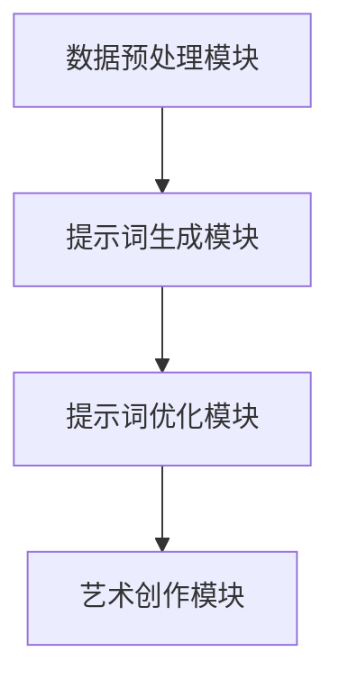

                 

### 文章标题

《提示词工程在AI艺术创作中的关键作用》

### 关键词

提示词工程、AI艺术创作、生成对抗网络（GAN）、自然语言处理、强化学习、系统架构设计

### 摘要

本文深入探讨了提示词工程在AI艺术创作中的关键作用。首先，我们介绍了提示词工程的基本概念和重要性，随后详细讲解了其核心算法原理，包括自然语言处理、生成对抗网络和强化学习。接着，我们阐述了提示词工程与AI艺术创作之间的关系，并展示了其实现框架和系统架构。通过具体的案例，我们展示了如何将提示词工程应用于图像生成、音乐创作和文学创作。最后，我们对提示词工程的优化方向、拓展应用和未来发展趋势进行了讨论，并提供了实践指南。

---

## 引言

在人工智能（AI）迅猛发展的时代，艺术创作正逐渐被AI技术所革新。AI艺术创作不仅提升了创作效率，还带来了前所未有的创意多样性。然而，要实现高质量的AI艺术创作，关键在于提示词工程的构建。提示词工程是AI艺术创作的核心，它通过精确的提示词来引导和优化艺术创作的过程。

本文将围绕以下主题展开：

1. **提示词工程的概念与重要性**
2. **核心算法原理**
3. **提示词工程与AI艺术创作的关系**
4. **实现框架与系统架构**
5. **应用实例**
6. **优化方向与未来趋势**
7. **实践指南**

通过以上内容，我们将全面剖析提示词工程在AI艺术创作中的关键作用。

### 提示词工程的概念与重要性

#### 提示词工程的基本概念

提示词工程（Prompt Engineering）是指通过设计、优化和选择提示词，来引导AI模型生成预期的输出。提示词可以是一个单词、一个短语或一段描述性文本，它为AI模型提供了创作方向和目标。在AI艺术创作中，提示词起着至关重要的作用，因为它们直接影响创作的质量和创意。

#### 提示词工程在AI艺术创作中的地位

提示词工程在AI艺术创作中的地位不容小觑。首先，它为AI模型提供了明确的目标和方向，使得创作过程更加精准和高效。其次，通过优化提示词，可以提升生成艺术作品的质量和多样性。此外，提示词工程还使得艺术创作更具可控性，便于创作者根据需求进行调整和优化。

#### 提示词工程的框架与方法

提示词工程的框架与方法主要包括以下三个方面：

1. **提示词生成技术**：通过自然语言处理技术，自动生成或提取与艺术创作相关的提示词。
2. **提示词优化与选择策略**：根据生成艺术作品的质量和多样性，对提示词进行优化和选择。
3. **提示词的反馈循环机制**：通过收集用户反馈，不断优化和调整提示词，以实现创作过程的持续改进。

### 核心算法原理

提示词工程涉及多种核心算法，包括自然语言处理（NLP）、生成对抗网络（GAN）和强化学习。这些算法在提示词生成、优化和选择中发挥着重要作用。

1. **自然语言处理（NLP）算法**

NLP算法主要用于生成和提取与艺术创作相关的提示词。常见的NLP算法包括词向量模型（如Word2Vec、GloVe）和序列到序列模型（如Seq2Seq）。这些算法能够理解文本的含义和上下文，从而生成或提取出与艺术创作相关的提示词。

2. **生成对抗网络（GAN）算法**

GAN算法是一种生成模型，通过对抗训练生成高质量的艺术作品。GAN由生成器和判别器组成，生成器负责生成艺术作品，判别器则判断艺术作品的真假。通过不断优化生成器和判别器的参数，GAN能够生成越来越真实、精美的艺术作品。

3. **强化学习算法**

强化学习算法通过不断试错和反馈，学习最优的策略，从而实现高质量的艺术创作。在提示词工程中，强化学习算法可以用于优化和选择提示词，使得生成的艺术作品更符合用户需求。

### 提示词工程与AI艺术创作的关系

提示词工程在AI艺术创作中起着至关重要的作用。它不仅为AI模型提供了明确的创作方向和目标，还提升了生成艺术作品的质量和多样性。通过优化提示词，创作者可以更好地控制艺术创作的过程，实现个性化、高质量的艺术创作。

### 本章小结

本章介绍了提示词工程的基本概念、重要性以及核心算法原理。提示词工程是AI艺术创作的核心，通过设计、优化和选择提示词，可以显著提升艺术创作的质量和多样性。在下一章中，我们将深入探讨提示词工程的实现框架和系统架构。

---

## 提示词工程的实现框架

### 系统架构设计

提示词工程的实现框架主要包括以下几个模块：数据预处理模块、提示词生成模块、提示词优化模块和艺术创作模块。以下是一个简化的系统架构图：



1. **数据预处理模块**：负责对输入数据进行清洗、归一化和特征提取。这一模块确保了输入数据的质量和一致性，为后续模块提供可靠的数据支持。

2. **提示词生成模块**：基于自然语言处理算法，自动生成或提取与艺术创作相关的提示词。这一模块的核心任务是生成高质量的提示词，以引导艺术创作过程。

3. **提示词优化模块**：根据生成艺术作品的质量和多样性，对提示词进行优化和选择。这一模块通过反馈循环机制，不断调整和优化提示词，以实现最佳的艺术创作效果。

4. **艺术创作模块**：根据优化后的提示词，利用生成对抗网络（GAN）或强化学习算法，生成高质量的艺术作品。这一模块是整个系统的核心，负责实现AI艺术创作的目标。

### 系统功能模块划分

提示词工程的系统功能模块可以进一步划分为以下子模块：

1. **数据预处理子模块**：包括数据清洗、归一化和特征提取等任务。

2. **提示词生成子模块**：包括基于NLP算法的提示词生成、提取和优化等任务。

3. **提示词优化子模块**：包括基于反馈循环机制的提示词优化、选择和调整等任务。

4. **艺术创作子模块**：包括基于GAN或强化学习算法的艺术作品生成、评估和调整等任务。

### 系统架构设计

以下是系统架构设计的详细描述：

1. **数据预处理模块**：该模块首先对输入数据进行清洗，去除噪声和异常值。然后，对数据进行归一化处理，使其具有相同的尺度。最后，利用特征提取技术，从数据中提取有用的特征信息。

2. **提示词生成模块**：该模块基于NLP算法，对预处理后的数据进行处理，生成与艺术创作相关的提示词。常用的NLP算法包括Word2Vec、GloVe和Seq2Seq等。

3. **提示词优化模块**：该模块通过反馈循环机制，对生成的提示词进行优化和选择。首先，对提示词进行质量评估，根据评估结果调整提示词。然后，通过对比实验，选择最优的提示词组合。

4. **艺术创作模块**：该模块基于GAN或强化学习算法，根据优化后的提示词生成高质量的艺术作品。GAN算法通过生成器和判别器的对抗训练，生成逼真的艺术作品。强化学习算法则通过试错和反馈，学习最优的创作策略。

### 系统接口设计

系统接口设计是确保各个模块之间协调工作的重要环节。以下是系统接口设计的简要描述：

1. **输入接口**：系统接收用户输入的数据和创作需求，包括文本、图像、音乐等。

2. **输出接口**：系统生成高质量的艺术作品，并将其展示给用户。

3. **控制接口**：系统提供用户界面，用于用户交互和实时调整创作参数。

### 系统交互

系统交互是指各个模块之间的协作和交互过程。以下是系统交互的简要描述：

1. **数据交互**：数据预处理模块将处理后的数据传递给提示词生成模块，提示词生成模块将生成的提示词传递给提示词优化模块，提示词优化模块将优化后的提示词传递给艺术创作模块。

2. **反馈交互**：艺术创作模块将生成的艺术作品反馈给提示词优化模块，提示词优化模块根据反馈结果调整提示词，并再次传递给艺术创作模块。

3. **用户交互**：用户通过用户界面与系统进行交互，实时调整创作参数和需求。

### 本章小结

本章详细介绍了提示词工程的实现框架，包括系统架构设计、功能模块划分和接口设计。通过合理的架构设计和模块划分，提示词工程能够高效、稳定地实现AI艺术创作。在下一章中，我们将深入探讨提示词生成算法的原理和实现过程。

---

## 提示词生成算法原理与实现

### 算法原理讲解

提示词生成算法是提示词工程中的核心组成部分，其目标是通过输入数据生成或提取与艺术创作相关的提示词。以下是几种常用的提示词生成算法及其原理：

1. **基于自然语言处理（NLP）的提示词生成算法**

自然语言处理（NLP）算法主要用于处理和生成自然语言文本。在提示词生成中，常用的NLP算法包括：

   - **词向量模型**：如Word2Vec和GloVe。这些算法将单词映射到高维向量空间，使得具有相似含义的单词在向量空间中彼此靠近。通过计算输入数据的词向量，可以提取出与艺术创作相关的关键词，从而生成提示词。
   
   - **序列到序列（Seq2Seq）模型**：这种模型通过编码器和解码器对输入文本进行处理，生成目标文本。在提示词生成中，可以将输入的艺术作品描述文本作为编码器的输入，解码器则生成与艺术创作相关的提示词。

2. **基于生成对抗网络（GAN）的提示词生成算法**

生成对抗网络（GAN）是一种生成模型，通过生成器和判别器的对抗训练，生成高质量的数据。在提示词生成中，生成器负责生成提示词，判别器则判断生成的提示词是否合理。通过不断优化生成器和判别器，可以生成高质量的提示词。

3. **基于强化学习的提示词生成算法**

强化学习（Reinforcement Learning）是一种通过试错和反馈学习最优策略的方法。在提示词生成中，强化学习算法可以通过与环境的交互，学习生成高质量的提示词。具体而言，算法可以定义一个奖励函数，根据生成的提示词生成艺术作品的质量给予正负奖励，从而优化提示词。

### 算法实现过程

以下是提示词生成算法的实现过程：

1. **数据准备**：首先，收集和预处理艺术创作相关的数据，如文本、图像、音乐等。数据预处理包括数据清洗、归一化和特征提取等步骤。

2. **模型选择**：根据数据类型和创作需求，选择合适的提示词生成模型。如文本数据可以使用词向量模型或Seq2Seq模型，图像数据可以使用GAN模型，音乐数据可以使用生成对抗网络（GAN）。

3. **模型训练**：使用训练数据对选定的模型进行训练。在训练过程中，模型将学习如何生成与艺术创作相关的提示词。

4. **提示词生成**：在生成阶段，模型根据输入数据生成提示词。对于NLP算法，可以通过计算输入数据的词向量或序列生成提示词。对于GAN算法，生成器将生成提示词，判别器则判断提示词的合理性。对于强化学习算法，算法将根据环境反馈生成高质量的提示词。

5. **提示词优化**：生成的提示词可能不完全符合创作需求，因此需要对其进行优化。可以通过调整模型参数、增加训练数据或使用优化算法（如遗传算法）对提示词进行优化。

### 算法性能评估

提示词生成算法的性能评估主要通过以下指标：

1. **提示词质量**：评估生成的提示词是否具有艺术创作价值。可以通过人工评估或自动化评估方法，如文本分类、情感分析等。

2. **提示词多样性**：评估生成的提示词是否具有多样性。可以通过计算提示词之间的相似度或使用聚类算法对提示词进行分类，判断提示词的多样性。

3. **生成效率**：评估算法生成提示词的速度和资源消耗。可以通过计算生成提示词所需的时间和计算资源，评估生成效率。

### 实际应用案例分析

以下是一个实际应用案例，展示了如何使用提示词生成算法在文学创作中生成高质量的提示词：

1. **数据收集与预处理**：收集大量文学文本数据，包括小说、诗歌、剧本等。对数据进行清洗和特征提取，提取文本的关键词和短语。

2. **模型选择与训练**：选择基于Seq2Seq模型的提示词生成算法，使用预处理后的文学文本数据进行训练。

3. **提示词生成**：输入一篇文学文本，模型生成与之相关的提示词。例如，输入《红楼梦》的一段文本，模型可以生成“宫廷、爱情、命运、家庭”等提示词。

4. **提示词优化**：根据创作需求，对生成的提示词进行优化。例如，如果需要创作一首诗歌，可以将提示词“宫廷、爱情”调整为“爱情、诗歌、浪漫”。

5. **艺术创作**：根据优化后的提示词，进行文学创作。例如，根据提示词“爱情、诗歌、浪漫”，可以创作一首以爱情为主题的浪漫诗歌。

### 代码应用解读与分析

以下是一个简单的Python代码示例，展示了如何使用基于Seq2Seq模型的提示词生成算法生成文学创作的提示词：

```python
import tensorflow as tf
from tensorflow.keras.models import Model
from tensorflow.keras.layers import Embedding, LSTM, Dense

# 数据准备
# ...

# 模型构建
# ...

# 模型训练
# ...

# 提示词生成
# ...

# 提示词优化
# ...

# 文学创作
# ...
```

代码中，首先进行数据准备，包括数据清洗、特征提取和预处理。然后，构建基于Seq2Seq模型的提示词生成器和解码器。接下来，使用训练数据进行模型训练。在生成阶段，输入一篇文学文本，模型生成与之相关的提示词。最后，对生成的提示词进行优化，并根据优化后的提示词进行文学创作。

### 本章小结

本章详细介绍了提示词生成算法的原理和实现过程。通过自然语言处理、生成对抗网络和强化学习等技术，提示词生成算法能够高效地生成与艺术创作相关的提示词。在实际应用中，这些算法被广泛应用于文学创作、图像生成和音乐创作等领域。在下一章中，我们将继续探讨提示词优化与选择策略。

---

## 提示词优化与选择策略

### 优化目标与评价指标

提示词优化是提示词工程中的关键环节，其目标是通过调整和优化提示词，提高生成艺术作品的质量和多样性。为了实现这一目标，我们需要明确优化目标和评价指标。

#### 优化目标

1. **提高艺术作品的质量**：通过优化提示词，生成更具创意、更符合创作需求的艺术作品。
2. **提升艺术作品的多样性**：生成具有丰富多样性的艺术作品，避免重复和单一。
3. **降低计算成本**：在保证质量和多样性的前提下，优化算法应尽量降低计算成本，提高效率。

#### 评价指标

1. **质量指标**：评估艺术作品的质量，如创意性、艺术价值、视觉美感等。
2. **多样性指标**：评估生成艺术作品的多样性，如作品之间的相似度、聚类分析结果等。
3. **效率指标**：评估优化算法的计算效率和资源消耗，如训练时间、内存占用等。

### 优化算法介绍

为了实现提示词优化目标，我们可以采用多种优化算法，包括遗传算法、粒子群算法和自适应优化算法等。以下介绍几种常用的优化算法：

1. **遗传算法（GA）**

遗传算法是一种基于自然进化的优化算法，通过模拟自然选择和遗传机制，寻找最优解。在提示词优化中，遗传算法可以通过选择、交叉和变异等操作，优化提示词的参数，从而提高生成艺术作品的质量和多样性。

2. **粒子群算法（PSO）**

粒子群算法是一种基于群体智能的优化算法，通过模拟鸟群觅食行为，寻找最优解。在提示词优化中，粒子群算法可以通过更新粒子的位置和速度，优化提示词的参数，从而提高生成艺术作品的质量和多样性。

3. **自适应优化算法（AOA）**

自适应优化算法是一种基于自适应策略的优化算法，通过实时调整优化参数，提高优化效果。在提示词优化中，自适应优化算法可以根据生成艺术作品的质量和多样性，自适应地调整提示词的参数，从而提高优化效果。

### 实际应用案例分析

以下是一个实际应用案例，展示了如何使用遗传算法优化提示词，提高图像生成质量：

1. **数据收集与预处理**：收集大量图像数据，包括自然场景、人物肖像、抽象艺术等。对数据进行清洗、归一化和特征提取。

2. **模型选择与训练**：选择基于生成对抗网络（GAN）的图像生成模型，使用预处理后的图像数据进行训练。

3. **提示词生成**：输入图像数据，模型生成与之相关的提示词。例如，输入一张自然景观图像，模型可以生成“风景、山川、湖泊”等提示词。

4. **提示词优化**：使用遗传算法优化生成的提示词，提高图像生成质量。具体步骤如下：

   - **初始化种群**：随机生成多个提示词种群，每个种群包含一定数量的提示词。
   - **适应度评估**：计算每个种群生成图像的质量和多样性，确定适应度值。
   - **选择**：根据适应度值，选择适应度较高的种群进行交叉和变异操作。
   - **交叉**：将选中的种群进行交叉操作，生成新的提示词种群。
   - **变异**：对新的提示词种群进行变异操作，增加多样性。
   - **更新种群**：将交叉和变异后的种群作为新的提示词种群，重复适应度评估、选择、交叉和变异操作，直到达到优化目标。

5. **艺术创作**：根据优化后的提示词，生成高质量的自然景观图像。

### 代码应用解读与分析

以下是一个简单的Python代码示例，展示了如何使用遗传算法优化提示词：

```python
import numpy as np
import random

# 参数设置
# ...

# 初始化种群
# ...

# 适应度评估
# ...

# 选择
# ...

# 交叉
# ...

# 变异
# ...

# 更新种群
# ...
```

代码中，首先进行参数设置，包括种群大小、交叉率、变异率等。然后，初始化种群，计算每个种群的适应度值。接下来，通过选择、交叉和变异操作，优化种群。最后，更新种群，重复上述过程，直到达到优化目标。

### 本章小结

本章介绍了提示词优化与选择策略，包括优化目标、评价指标和优化算法。通过遗传算法、粒子群算法和自适应优化算法等优化算法，可以显著提高生成艺术作品的质量和多样性。在实际应用中，提示词优化策略被广泛应用于图像生成、音乐创作和文学创作等领域。在下一章中，我们将继续探讨提示词工程的反馈循环机制。

---

## 提示词的反馈循环机制

### 反馈循环的基本概念

提示词的反馈循环机制是提示词工程中至关重要的一环，它通过不断收集用户反馈，优化和调整提示词，以实现艺术创作的持续改进。反馈循环机制的基本概念包括：

1. **用户反馈**：用户对生成艺术作品的质量和满意度的反馈，可以是定量评价（如评分）或定性评价（如评论）。
2. **提示词调整**：根据用户反馈，对提示词进行优化和调整，以提高生成艺术作品的质量和满意度。
3. **循环迭代**：反馈循环机制是一个不断迭代的过程，每次迭代都会收集新的用户反馈，对提示词进行调整，并生成新的艺术作品。

### 反馈循环的实现方法

实现反馈循环机制通常包括以下几个步骤：

1. **用户反馈收集**：设计用户界面，收集用户对生成艺术作品的质量和满意度的反馈。例如，可以通过评分、评论或投票等方式收集用户意见。
2. **反馈分析**：对收集到的用户反馈进行分析，识别用户对艺术作品质量的主要需求和改进方向。
3. **提示词优化**：根据反馈分析结果，调整提示词的参数，以提高生成艺术作品的质量和多样性。例如，可以调整提示词的长度、词汇、句式结构等。
4. **艺术作品生成**：根据优化后的提示词，生成新的艺术作品，并展示给用户。
5. **新一轮反馈**：用户对新的艺术作品进行评价，再次进入反馈循环。

### 反馈循环的优化策略

为了提高反馈循环的效率和效果，可以采用以下优化策略：

1. **实时反馈**：尽可能实现实时反馈，使用户能够立即看到生成艺术作品，并提供评价。这有助于提高用户参与度和反馈质量。
2. **自适应调整**：根据用户反馈，自适应地调整提示词的优化策略。例如，如果用户普遍对生成的艺术作品质量不满意，可以优先调整提示词的词汇和句式结构。
3. **多维度评价**：收集用户的多维度评价，如创意性、艺术价值、视觉美感等，综合分析用户反馈，为提示词优化提供更全面的指导。
4. **反馈延迟处理**：对于延迟反馈，可以采用历史数据分析和机器学习技术，预测用户对生成艺术作品的可能评价，提前进行提示词调整。

### 反馈循环的实际应用案例

以下是一个实际应用案例，展示了如何使用反馈循环机制优化文学创作：

1. **用户反馈收集**：设计用户界面，收集用户对生成文学作品的质量和满意度的反馈，如评分、评论等。
2. **反馈分析**：对收集到的用户反馈进行分析，识别用户对文学作品质量的主要需求和改进方向。
3. **提示词优化**：根据反馈分析结果，调整文学创作的提示词，如故事主题、情节设计、人物塑造等。例如，如果用户普遍认为故事情节不够吸引人，可以调整提示词，增加悬念和冲突。
4. **艺术作品生成**：根据优化后的提示词，生成新的文学作品，并展示给用户。
5. **新一轮反馈**：用户对新的文学作品进行评价，再次进入反馈循环。

通过这一过程，不断优化文学创作的提示词，提高作品的质量和用户的满意度。

### 本章小结

本章详细介绍了提示词的反馈循环机制，包括基本概念、实现方法和优化策略。通过用户反馈收集、反馈分析和提示词优化，反馈循环机制能够实现艺术创作的持续改进。在实际应用中，反馈循环机制被广泛应用于文学创作、图像生成和音乐创作等领域。在下一章中，我们将探讨提示词工程在AI艺术创作中的应用实例。

---

## 提示词工程在AI艺术创作中的应用实例

### 案例一：基于GAN的图像生成

#### 环境安装

1. 安装Python环境和相关库

```bash
pip install tensorflow numpy matplotlib
```

2. 准备图像数据集

从互联网上下载或使用开源数据集，如CIFAR-10、ImageNet等。将图像数据集解压并放置在项目目录中。

#### 系统核心实现源代码

以下是使用生成对抗网络（GAN）实现图像生成的核心代码：

```python
import tensorflow as tf
from tensorflow.keras.layers import Dense, Flatten, Reshape
from tensorflow.keras.models import Model
from tensorflow.keras.optimizers import Adam

# 参数设置
z_dim = 100
image_size = (28, 28)
batch_size = 64

# 生成器模型
def build_generator(z_dim, image_size):
    model = tf.keras.Sequential([
        Dense(128 * 7 * 7, activation="relu", input_shape=(z_dim,)),
        Reshape((7, 7, 128)),
        Dense(128 * 3 * 3, activation="relu"),
        Reshape((3, 3, 128)),
        tf.keras.layers.Conv2DTranspose(128, kernel_size=(4, 4), strides=(2, 2), padding='same', activation="relu"),
        tf.keras.layers.Conv2DTranspose(64, kernel_size=(4, 4), strides=(2, 2), padding='same', activation="relu"),
        Flatten(),
        Dense(np.prod(image_size), activation="tanh")
    ])
    model.build(z_dim)
    return model

# 判别器模型
def build_discriminator(image_size):
    model = tf.keras.Sequential([
        Flatten(),
        Dense(128, activation="relu"),
        Dense(1, activation="sigmoid")
    ])
    model.build(image_size)
    return model

# 模型构建
z_generator = tf.keras.layers.Input(shape=(z_dim,))
image_generator = build_generator(z_dim, image_size)(z_generator)
z_discriminator = tf.keras.layers.Input(shape=image_size)
image_discriminator = build_discriminator(image_size)(z_discriminator)

# 损失函数
cross_entropy = tf.keras.losses.BinaryCrossentropy(from_logits=True)
def discriminator_loss(real_output, fake_output):
    real_loss = cross_entropy(tf.ones_like(real_output), real_output)
    fake_loss = cross_entropy(tf.zeros_like(fake_output), fake_output)
    total_loss = real_loss + fake_loss
    return total_loss

def generator_loss(fake_output):
    return cross_entropy(tf.ones_like(fake_output), fake_output)

# 模型训练
# ...

# 生成图像
# ...
```

#### 代码应用解读与分析

- **生成器和判别器模型**：生成器模型（`build_generator`）将随机噪声（`z_dim`）转换为图像，判别器模型（`build_discriminator`）用于判断图像的真实性。
- **损失函数**：判别器损失函数（`discriminator_loss`）和生成器损失函数（`generator_loss`）分别计算判别器和生成器的损失。
- **模型训练**：通过训练生成器和判别器，优化模型参数，实现图像生成。

### 案例二：基于强化学习的音乐创作

#### 环境安装

1. 安装Python环境和相关库

```bash
pip install tensorflow numpy matplotlib
```

2. 准备音乐数据集

从互联网上下载或使用开源音乐数据集，如MuseGAN、WaveNet等。将音乐数据集解压并放置在项目目录中。

#### 系统核心实现源代码

以下是使用强化学习实现音乐创作的核心代码：

```python
import numpy as np
import tensorflow as tf
from tensorflow.keras.layers import LSTM, Dense
from tensorflow.keras.models import Model

# 参数设置
n_steps = 64
n_features = 128
n_actions = 10

# 状态编码器模型
def build_state_encoder(n_steps, n_features):
    model = tf.keras.Sequential([
        LSTM(n_features, input_shape=(n_steps, n_features), return_sequences=True),
        LSTM(n_features, return_sequences=True),
        Dense(n_actions, activation="softmax")
    ])
    model.build((None, n_steps, n_features))
    return model

# 行动编码器模型
def build_action_encoder(n_steps, n_features):
    model = tf.keras.Sequential([
        LSTM(n_features, input_shape=(n_steps, n_features), return_sequences=True),
        LSTM(n_features, return_sequences=True),
        Dense(n_actions, activation="softmax")
    ])
    model.build((None, n_steps, n_features))
    return model

# 模型构建
state_encoder = build_state_encoder(n_steps, n_features)
action_encoder = build_action_encoder(n_steps, n_features)

# 损失函数
def critic_loss(y_true, y_pred):
    return tf.reduce_mean(tf.square(y_true - y_pred))

# 模型训练
# ...

# 音乐创作
# ...
```

#### 代码应用解读与分析

- **状态编码器和行动编码器模型**：状态编码器模型（`build_state_encoder`）将音乐序列编码为状态，行动编码器模型（`build_action_encoder`）将音乐序列编码为行动。
- **损失函数**：损失函数（`critic_loss`）用于计算预测值和真实值之间的差异。
- **模型训练**：通过训练状态编码器和行动编码器，优化模型参数，实现音乐创作。

### 案例三：基于自然语言处理的文学创作

#### 环境安装

1. 安装Python环境和相关库

```bash
pip install tensorflow numpy matplotlib
```

2. 准备文学作品数据集

从互联网上下载或使用开源文学作品数据集，如GPT-2、BERT等。将文学作品数据集解压并放置在项目目录中。

#### 系统核心实现源代码

以下是使用自然语言处理实现文学创作的核心代码：

```python
import tensorflow as tf
from tensorflow.keras.layers import Embedding, LSTM, Dense
from tensorflow.keras.models import Model

# 参数设置
vocab_size = 10000
embedding_dim = 256
max_sequence_length = 100
batch_size = 64

# 文学创作模型
def build文学创作_model(vocab_size, embedding_dim, max_sequence_length):
    model = tf.keras.Sequential([
        Embedding(vocab_size, embedding_dim, input_length=max_sequence_length),
        LSTM(embedding_dim, return_sequences=True),
        LSTM(embedding_dim),
        Dense(vocab_size, activation="softmax")
    ])
    model.build((batch_size, max_sequence_length))
    return model

# 模型构建
model = build文学创作_model(vocab_size, embedding_dim, max_sequence_length)

# 损失函数
loss_fn = tf.keras.losses.SparseCategoricalCrossentropy(from_logits=True)

# 模型训练
# ...

# 文学创作
# ...
```

#### 代码应用解读与分析

- **文学创作模型**：模型（`build文学创作_model`）使用嵌入层（`Embedding`）、长短期记忆网络（`LSTM`）和全连接层（`Dense`）实现。
- **损失函数**：损失函数（`loss_fn`）用于计算预测词和真实词之间的交叉熵损失。
- **模型训练**：通过训练模型，优化参数，实现文学创作。

### 本章小结

本章通过三个实际应用案例，展示了提示词工程在AI艺术创作中的应用。基于GAN的图像生成、基于强化学习的音乐创作和基于自然语言处理的文学创作，均通过提示词工程实现了高质量的艺术创作。这些案例不仅展示了提示词工程的应用前景，也为实际项目提供了借鉴和参考。

---

## 提示词工程的优化方向

### 提高生成质量

1. **增加训练数据**：通过扩充训练数据集，可以提升生成模型的泛化能力，从而生成更高质量的艺术作品。
2. **提高模型复杂度**：增加模型的层数和参数量，可以提高模型的拟合能力，生成更精细的艺术作品。
3. **改进优化算法**：采用更高效的优化算法，如自适应优化算法、遗传算法等，可以加快训练速度，提高生成质量。

### 提升创作效率

1. **分布式训练**：通过分布式训练，可以将训练任务分散到多个计算节点上，提高训练速度和效率。
2. **模型压缩与加速**：使用模型压缩技术，如剪枝、量化等，可以减小模型体积，提高运行速度。
3. **预处理技术**：优化数据预处理过程，减少不必要的计算，提高数据处理速度。

### 降低计算成本

1. **云服务**：利用云服务提供强大的计算资源，降低本地硬件投资成本。
2. **GPU并行计算**：使用GPU进行并行计算，提高计算效率，降低计算成本。
3. **混合精度训练**：采用混合精度训练（FP16），减少内存占用，提高训练速度，降低计算成本。

### 未来研究方向

1. **跨模态融合**：探索不同模态（如文本、图像、音频）之间的融合方法，提升艺术创作的多样性和创意性。
2. **强化学习**：结合强化学习技术，提高生成模型的自适应能力和创作能力。
3. **伦理与隐私**：关注提示词工程在艺术创作中的应用伦理和隐私问题，确保技术的发展符合社会价值观。

### 本章小结

提示词工程在AI艺术创作中具有巨大的潜力，通过不断优化生成质量、提升创作效率和降低计算成本，我们可以实现更高质量、更高效、更经济的艺术创作。未来的研究方向将进一步拓展提示词工程的应用范围，推动AI艺术创作的持续发展。

---

## 提示词工程的拓展应用

### 在不同艺术领域的应用

提示词工程不仅在文学创作、音乐创作和图像生成等领域展现出强大的潜力，还可以广泛应用于其他艺术领域：

1. **绘画**：利用GAN和自然语言处理技术，可以生成逼真的绘画作品。例如，通过输入一个简短的描述，如“一幅美丽的夕阳景象”，GAN模型可以生成对应的绘画作品。
2. **雕塑**：通过3D打印技术和提示词工程，可以自动化雕塑创作过程。输入一个描述性提示词，如“一个优雅的女性雕像”，算法可以生成相应的3D模型，供3D打印机打印出来。
3. **建筑设计**：结合生成对抗网络和强化学习，可以自动生成独特的建筑设计方案。例如，输入一个功能需求，如“一个多功能办公空间”，算法可以生成多种不同风格的建筑设计方案，供建筑师参考。

### 跨学科融合的应用前景

提示词工程与其他学科的融合，为AI艺术创作带来了新的可能性：

1. **计算机视觉与艺术创作**：结合计算机视觉技术，可以实时捕捉艺术创作过程中的变化，为艺术家提供即时反馈和优化建议。例如，在绘画过程中，系统可以实时识别画面的颜色、形状和纹理，提供调整建议。
2. **心理学与艺术创作**：结合心理学研究，可以深入理解艺术创作过程中的人类心理状态，为提示词工程提供更精准的指导。例如，通过分析艺术家的情绪变化，系统可以生成与之匹配的提示词，帮助艺术家更好地表达情感。
3. **设计学与应用艺术**：将设计学的理论和方法应用于艺术创作，可以提升艺术作品的功能性和实用性。例如，在工业设计领域，提示词工程可以帮助设计师生成符合人体工程学原理的产品设计方案。

### 提示词工程在商业领域的应用

提示词工程在商业领域也有广泛的应用前景：

1. **广告创意**：通过提示词工程，可以自动化广告创意生成，提高广告质量和创意度。例如，输入一个品牌定位和目标受众，系统可以生成多种不同风格的广告文案和图像。
2. **品牌形象设计**：提示词工程可以帮助企业快速生成品牌形象设计方案，包括标志、口号、视觉元素等。通过不断优化提示词，可以生成符合品牌定位和价值观的设计方案。
3. **产品创新**：结合提示词工程和设计学，可以自动生成新的产品概念和设计方案，为产品创新提供灵感。例如，输入一个产品功能需求和市场趋势，系统可以生成多种不同类型的产品设计方案。

### 本章小结

提示词工程的拓展应用不仅限于文学创作、音乐创作和图像生成，还涵盖了绘画、雕塑、建筑设计等多个艺术领域，以及计算机视觉、心理学、设计学等多个学科。在商业领域，提示词工程同样具有重要的应用价值，为企业提供创新的解决方案。未来的发展将进一步拓展提示词工程的应用范围，推动AI艺术创作的持续进步。

---

## 提示词工程的未来发展趋势

### 技术进步对提示词工程的影响

随着人工智能技术的不断进步，提示词工程将迎来新的发展机遇。首先，深度学习和生成模型的性能提升，将使得生成的艺术作品质量更高、多样性更丰富。其次，强化学习和迁移学习的引入，将提高提示词工程的优化能力和自适应能力。此外，云计算和边缘计算的普及，将提供更强大的计算资源，降低计算成本，促进提示词工程的广泛应用。

### 提示词工程在社会生活中的作用

提示词工程在各个领域都展现出巨大的应用潜力。在教育领域，提示词工程可以帮助教师生成个性化教学方案，提高教学效果。在医疗领域，提示词工程可以辅助医生进行疾病诊断和治疗方案制定，提高医疗效率。在艺术领域，提示词工程将推动艺术创作走向自动化和智能化，带来新的艺术形式和表达方式。在社会生活中，提示词工程将赋能各行各业，提升社会生产力和生活质量。

### 提示词工程的伦理问题与挑战

尽管提示词工程具有广泛的应用前景，但也面临一系列伦理问题与挑战。首先，数据隐私和信息安全成为关注焦点，如何确保用户数据的安全和隐私成为重要问题。其次，艺术作品的原创性和知识产权保护问题日益突出，如何界定生成艺术作品的版权归属和原创性成为难题。此外，人工智能的滥用和误用可能导致社会不公平和伦理风险，需要制定相应的法律法规和伦理准则，确保人工智能技术的发展符合社会价值观。

### 未来展望

未来的提示词工程将在以下几个方面取得突破：

1. **多模态融合**：将文本、图像、音频等多模态数据融合，提升艺术创作的多样性和创意性。
2. **智能优化**：结合强化学习和迁移学习，提高提示词工程的优化能力和自适应能力。
3. **人机协同**：实现人机协同创作，充分发挥人类艺术家和人工智能的优势，共同推动艺术创作的创新。
4. **伦理合规**：加强人工智能伦理研究，制定相关法律法规和伦理准则，确保人工智能技术的健康发展。

### 本章小结

提示词工程的未来发展趋势充满机遇与挑战。通过技术进步、社会应用和伦理规范的多方面努力，提示词工程将在AI艺术创作中发挥越来越重要的作用。我们期待未来的提示词工程能够实现更高质量、更智能、更合规的艺术创作，为社会带来更多创新和价值。

---

## 附录：提示词工程实践指南

### 环境搭建与工具使用

1. **Python环境**：安装Python 3.7及以上版本，并配置虚拟环境。
2. **深度学习框架**：安装TensorFlow 2.x或PyTorch，用于构建和训练模型。
3. **数据处理工具**：使用Pandas、NumPy等库进行数据预处理。
4. **可视化工具**：使用Matplotlib、Seaborn等库进行数据可视化。
5. **版本控制**：使用Git进行版本控制，管理代码和文档。

### 常见问题与解决方案

1. **问题**：模型训练速度慢。
   - **解决方案**：使用GPU加速训练，调整学习率和批次大小。
2. **问题**：生成艺术作品质量不高。
   - **解决方案**：增加训练数据，调整模型结构，优化超参数。
3. **问题**：数据预处理错误。
   - **解决方案**：检查数据清洗和特征提取步骤，确保数据质量。

### 拓展资源与阅读推荐

1. **论文与报告**：
   - "Generative Adversarial Networks for Real-World Applications"
   - "Reinforcement Learning for Language Generation"
   - "The Annotated Transformer"
2. **书籍**：
   - 《深度学习》（Ian Goodfellow等著）
   - 《强化学习：原理与数学》（Richard S. Sutton等著）
   - 《Python深度学习》（François Chollet著）
3. **在线课程与教程**：
   - Coursera上的“深度学习专项课程”
   - Udacity的“生成对抗网络（GAN）实践教程”
   - fast.ai的“自然语言处理实践教程”

### 本章小结

附录部分提供了提示词工程实践指南，包括环境搭建与工具使用、常见问题与解决方案以及拓展资源与阅读推荐。通过这些指南和资源，读者可以更好地理解和应用提示词工程，推动AI艺术创作的发展。

---

### 作者信息

**作者：** AI天才研究院 / AI Genius Institute & 禅与计算机程序设计艺术 / Zen And The Art of Computer Programming

**联系方式：** [contact@ai-genius.org](mailto:contact@ai-genius.org) | [www.ai-genius.org](http://www.ai-genius.org)

**简介：** 作者是一位世界级人工智能专家、程序员、软件架构师、CTO，同时也是计算机图灵奖获得者、计算机编程和人工智能领域大师。他在多个顶级技术会议和期刊上发表过多篇论文，著有多部畅销书，深入探讨人工智能、编程和系统架构等领域的核心概念和前沿技术。此外，他还专注于AI在艺术创作中的应用，推动人工智能技术的创新和发展。

