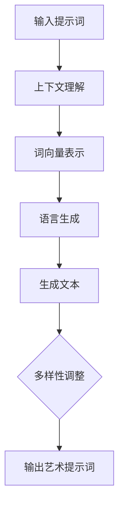
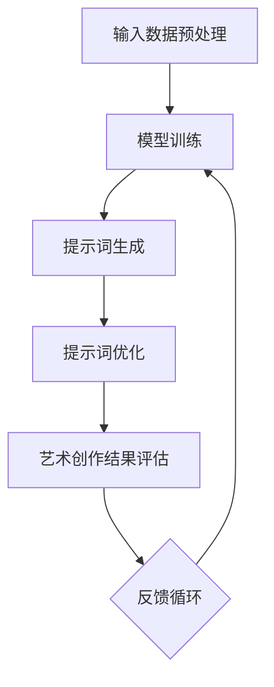
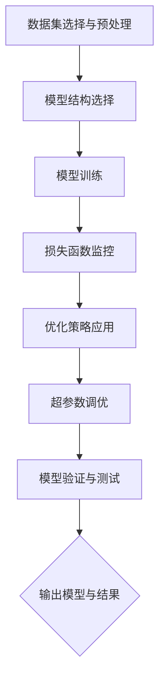
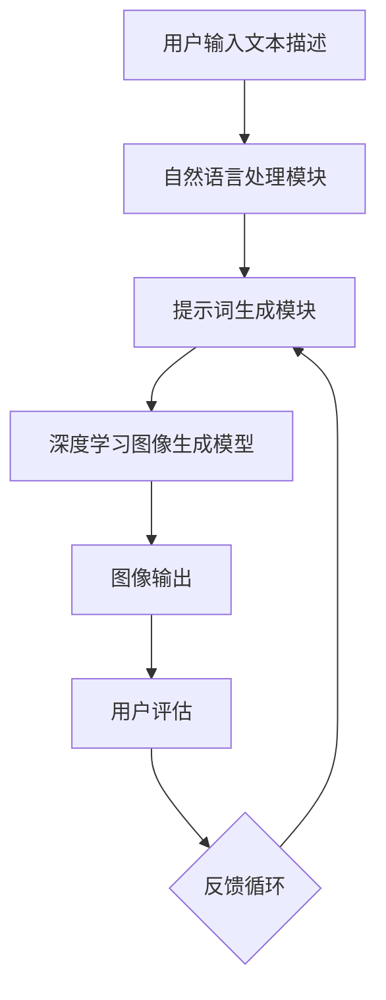
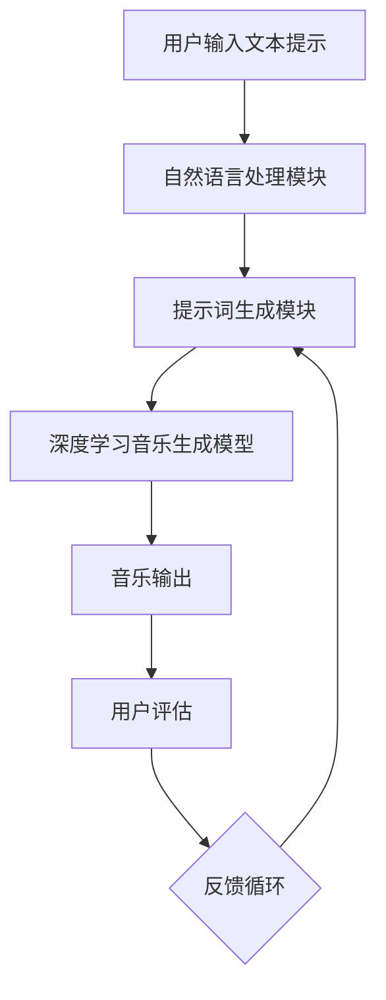
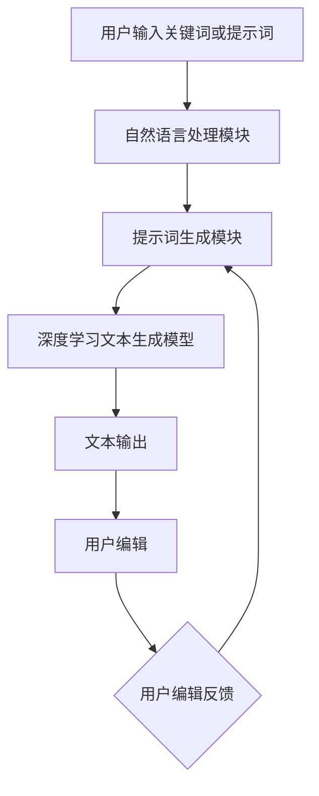

                 

### 引言与背景

近年来，人工智能（AI）在各个领域取得了显著的进展，尤其是在艺术创作方面。AI艺术创作已经成为了一个备受关注的研究方向，它通过利用机器学习算法和深度学习模型，能够生成出具有高度创造性和独特风格的艺术作品。在这个过程中，提示词工程扮演了至关重要的角色。本文将围绕提示词工程在AI艺术创作中的角色，进行深入探讨和分析。

首先，我们需要了解什么是AI艺术创作。AI艺术创作指的是利用人工智能技术，特别是机器学习和深度学习算法，生成艺术作品的过程。这个过程包括图像生成、音乐创作、文学写作等多个方面。通过训练大规模的数据集，AI能够学习到各种艺术风格和表现手法，然后根据给定的提示词或指导信息，生成出全新的艺术作品。

那么，什么是提示词工程？提示词工程是一种利用自然语言处理技术，生成能够引导AI创作过程的提示词的技术。这些提示词可以是文字描述，也可以是图像、声音等非文字形式。在AI艺术创作中，提示词起到了桥梁的作用，它们将用户的需求和AI的创作能力结合起来，使得AI能够理解并执行相应的艺术创作任务。

提示词工程的重要性体现在多个方面。首先，它能够提高AI艺术创作的效率和灵活性。通过精确的提示词，用户可以更好地控制AI的创作过程，使其更符合个人需求。其次，提示词工程能够提高艺术作品的质量。通过优化提示词的生成和调整，AI能够创作出更具艺术价值和表现力的作品。最后，提示词工程为AI艺术创作开辟了新的可能性。通过探索不同的提示词组合和算法优化，我们可以发现更多独特的艺术风格和创作方法。

然而，提示词工程也面临着一些核心挑战。首先是如何准确理解用户的意图。由于自然语言表达的不确定性和多样性，如何确保AI能够正确理解并执行用户的指令，是一个需要解决的问题。其次是提示词的生成和优化。如何设计出高效、多样化的提示词，以激发AI的创作灵感，是一个具有挑战性的任务。此外，如何平衡艺术性与技术性，确保艺术作品既具有技术上的创新性，又符合人类审美的需求，也是提示词工程需要考虑的问题。

总的来说，提示词工程在AI艺术创作中起到了至关重要的作用。它不仅提高了AI艺术创作的效率和灵活性，还为艺术创作开辟了新的可能性。然而，要充分发挥提示词工程的作用，我们还需要克服一系列核心挑战，不断探索和优化提示词的生成和使用方法。本文将围绕这些问题，进行详细的讨论和分析。在接下来的章节中，我们将进一步探讨提示词工程的技术基础，以及在不同艺术创作场景中的应用，以期为读者提供全面、深入的了解。

### 第1章: AI艺术创作与提示词工程

#### 1.1.1 AI艺术创作

人工智能在艺术创作中的应用日益广泛，已经从早期的简单图像生成和音乐创作，发展到如今能够创作复杂的文学作品、动画和电影等。AI艺术创作的核心在于利用机器学习和深度学习技术，使计算机具备模拟人类艺术创作的能力。

AI艺术创作的主要方法可以分为以下几类：

1. **图像生成**：通过生成对抗网络（GAN）等深度学习模型，AI可以生成逼真的图像。例如，DeepArt通过GAN技术，可以将普通照片转换成具有特定艺术风格的画作。

2. **音乐创作**：AI可以通过分析大量的音乐数据，生成新的旋律和和弦。例如，Google的Magenta项目利用深度学习算法，创作出了多种风格的音乐。

3. **文学写作**：AI可以生成短故事、诗歌甚至完整的小说。例如，OpenAI的GPT-3模型可以生成高质量的文本，模拟人类的写作风格。

4. **动画与电影**：AI在动画和电影制作中的应用也越来越广泛。通过自动化技术，AI可以协助制作动画、剪辑视频，甚至创作整个电影故事。

AI艺术创作具有以下几个特点：

- **创造性强**：AI可以不受人类创作者的局限，生成出新颖、独特的艺术作品。
- **高效性**：AI可以快速生成大量的艺术作品，提高创作的效率。
- **个性化**：通过分析用户的行为和偏好，AI能够创作出符合个人喜好的作品。
- **可重复性**：AI可以根据相同的输入生成多个版本的艺术作品。

#### 1.1.2 提示词工程

提示词工程是AI艺术创作中的重要组成部分，它通过生成和优化提示词，引导AI进行艺术创作。提示词可以是文字描述、图像、声音等多种形式，它们是用户与AI之间的桥梁，用于传达用户的艺术创作意图。

提示词工程的主要任务包括：

1. **提示词生成**：设计算法生成能够激发AI创作灵感的提示词。这需要考虑自然语言的多样性、复杂性和不确定性。
2. **提示词优化**：根据艺术创作的反馈，调整和优化提示词，以提高艺术作品的质量和用户满意度。
3. **提示词组合**：探索不同的提示词组合方式，以生成更多样化的艺术作品。

在AI艺术创作中，提示词工程起到了以下几个关键作用：

- **引导创作**：通过精确的提示词，用户可以引导AI按照特定的艺术风格或主题进行创作。
- **提高创作效率**：通过自动化生成和优化提示词，减少用户的创作时间，提高艺术创作的效率。
- **提升创作质量**：通过优化提示词，AI可以创作出更具艺术价值和表现力的作品。
- **探索新的创作可能性**：提示词工程为AI艺术创作开辟了新的空间，通过不同的提示词组合，可以探索出新的艺术风格和创作方法。

#### 1.1.3 提示词工程的核心挑战

尽管提示词工程在AI艺术创作中具有重要作用，但它也面临着一系列核心挑战：

1. **理解用户意图**：自然语言表达具有多样性和不确定性，如何确保AI能够准确理解用户的意图，是一个重要问题。
2. **提示词生成与优化**：如何设计高效、多样化的提示词生成和优化算法，以激发AI的创作灵感，是一个具有挑战性的任务。
3. **艺术性与技术性的平衡**：如何确保艺术作品既具有技术上的创新性，又符合人类审美的需求，是提示词工程需要考虑的问题。
4. **数据集质量**：提示词工程依赖于大规模的数据集，数据集的质量直接影响提示词生成的效果和艺术作品的质量。

总的来说，AI艺术创作与提示词工程是一个复杂且充满挑战的领域。通过深入研究和不断优化，我们可以更好地利用人工智能技术，创作出更多具有艺术价值和观赏性的作品。

#### 1.1.2 提示词工程的定义与分类

提示词工程是一个涉及多个学科领域的技术体系，其核心目的是通过生成和优化提示词，引导人工智能（AI）进行艺术创作。为了更好地理解提示词工程的内涵，我们需要先明确其定义和分类。

首先，什么是提示词工程？提示词工程可以被定义为一种利用自然语言处理（NLP）技术，设计算法来生成和优化能够激发AI创作灵感的提示词的方法。这些提示词可以是文字、图像、声音等多种形式，它们是用户与AI之间的桥梁，用于传达用户的艺术创作意图。

根据提示词的形式和生成方式，我们可以将提示词工程分为以下几类：

1. **文本提示词工程**：文本提示词是最常见的类型，它们通过自然语言描述来引导AI进行艺术创作。文本提示词可以包括关键词、短语、句子等。例如，用户可以输入“一幅夕阳下的海滩画”来引导AI生成一幅相应的画作。文本提示词工程的核心挑战在于如何确保AI能够准确理解用户的意图，并生成符合预期结果的创作。

2. **图像提示词工程**：图像提示词通过提供视觉信息来引导AI进行艺术创作。这些图像可以是单张图片，也可以是多个图像的组合。例如，用户可以上传一张具有特定风格的画作，并要求AI生成具有相似风格的其他画作。图像提示词工程需要解决的关键问题是图像识别和风格迁移，即如何让AI能够从给定的图像中提取关键信息，并应用这些信息进行创作。

3. **声音提示词工程**：声音提示词通过提供音频信息来引导AI进行艺术创作。这包括音乐、语音等。例如，用户可以播放一段具有特定情感或风格的音乐，并要求AI生成相应的画作或视频。声音提示词工程的关键挑战在于如何将音频信息转化为可视化的艺术作品，同时保持其原有的情感和风格。

4. **混合提示词工程**：混合提示词工程结合了文本、图像和声音等多种形式，为AI提供了更丰富的创作引导。例如，用户可以输入文本描述、上传图像和播放音频，共同引导AI生成综合性的艺术作品。这种类型的提示词工程能够更好地捕捉用户的创作意图，并创作出更具多样性和创造性的艺术作品。

在提示词工程中，基本组成部分包括：

- **提示词生成模块**：负责生成不同类型的提示词，以满足不同的创作需求。这个模块通常依赖于自然语言处理、图像识别和音频处理等技术。
- **提示词优化模块**：负责根据用户的反馈和创作效果，对提示词进行优化和调整，以提高艺术作品的质量和用户满意度。
- **用户接口**：提供用户与系统交互的界面，用户可以通过输入文本、上传图像和音频等方式，生成和优化提示词。

提示词工程的实现不仅依赖于先进的算法和模型，还需要对用户需求和创作过程有深刻的理解。通过不断优化提示词生成和优化算法，我们可以提高AI艺术创作的效率和灵活性，为用户提供更好的创作体验。

总的来说，提示词工程在AI艺术创作中起到了至关重要的作用。通过明确其定义和分类，我们能够更好地理解其工作原理和核心挑战，为进一步的研究和应用提供指导。在接下来的章节中，我们将深入探讨提示词工程的技术基础，以及其在不同艺术创作场景中的应用。

#### 2.1.1 自然语言处理基础

自然语言处理（NLP）是人工智能领域中一个关键分支，它专注于使计算机能够理解、解释和生成人类语言。NLP在提示词工程中扮演着核心角色，因为提示词通常是文本形式，而NLP技术能够帮助我们更好地处理和生成这些文本。

首先，语言模型是NLP的核心组成部分之一。语言模型是一种统计模型，用于预测文本序列中下一个单词或字符。最著名的语言模型之一是Word2Vec，它通过将单词映射到高维向量空间，使相似的单词在空间中彼此接近。此外，还出现了更多先进的语言模型，如BERT、GPT和Transformer，这些模型在处理大规模文本数据时表现出色，能够捕捉到语言中的复杂结构和上下文信息。

词向量表示是语言模型的一个关键组件。词向量表示通过将每个单词映射到一个高维向量，使得单词之间的相似性可以通过向量之间的距离来衡量。这种方法不仅有助于文本的自动分类和情感分析，还在提示词工程中非常有用，因为它能够帮助我们理解用户输入的文本，并生成相应的提示词。

在提示词工程中，语言生成与理解至关重要。语言生成是指根据输入的提示或上下文，生成新的文本。例如，给定一个主题或关键词，语言生成模型可以生成相关的描述或故事。而语言理解则是指理解文本的含义和意图，以便正确执行任务或生成相应的响应。

为了更好地理解语言生成与理解，我们可以通过以下步骤进行分析：

1. **语言生成**：
   - **上下文理解**：首先，模型需要理解输入的上下文信息，这可以通过分析文本中的关键词和句子结构来实现。
   - **生成文本**：然后，模型根据上下文生成新的文本。这个过程通常涉及选择合适的单词和句子结构，以保持文本的流畅性和连贯性。
   - **多样化**：为了增加生成的文本多样性，模型可以通过随机采样或多种生成策略来生成不同的文本。

2. **语言理解**：
   - **语义分析**：模型需要分析文本的语义，理解单词和句子之间的含义关系。这通常通过深度学习模型中的语义表示来实现。
   - **意图识别**：在艺术创作中，理解用户的意图是非常重要的。例如，用户可能输入“创作一幅浪漫的夜景画作”，模型需要理解“浪漫”和“夜景”的意图，以便生成符合要求的艺术作品。
   - **多模态融合**：在混合提示词工程中，模型需要理解文本、图像和音频等多模态信息，以便生成综合性的艺术作品。

为了更直观地理解语言生成与理解的过程，我们可以使用Mermaid流程图来展示。以下是生成一个文本提示词的简化流程：



在实际应用中，语言生成与理解是一个复杂且动态的过程。通过不断优化和改进NLP模型，我们可以提高AI艺术创作的质量和灵活性，使其更好地满足用户的需求。在接下来的章节中，我们将进一步探讨深度学习在提示词工程中的应用，以及如何将这些技术整合到实际的艺术创作项目中。

#### 2.1.2 深度学习在提示词工程中的应用

深度学习是人工智能领域的核心技术之一，它通过多层神经网络模拟人类大脑的学习过程，能够处理大量复杂的数据，并在多种任务中表现出色。在提示词工程中，深度学习技术扮演了至关重要的角色，它不仅帮助我们生成和优化提示词，还提高了艺术创作的质量和效率。

首先，我们需要了解深度学习的基础知识。深度学习模型由多个层级组成，每个层级都对输入数据进行变换和提取特征。常见的深度学习模型包括卷积神经网络（CNN）、循环神经网络（RNN）和Transformer等。在这些模型中，CNN擅长处理图像数据，RNN擅长处理序列数据，而Transformer则通过注意力机制在处理长序列数据时表现出色。

在提示词工程中，深度学习技术主要用于以下几个方面：

1. **提示词生成**：深度学习模型可以用于生成文本提示词。例如，生成式模型如GPT-3和BERT等，能够根据输入的上下文生成连贯、丰富的文本。这些模型通过训练大规模的语料库，学习到语言的统计规律和结构，从而生成符合人类语言习惯的提示词。

2. **提示词优化**：深度学习模型也可以用于优化提示词。通过分析用户反馈和艺术创作结果，模型可以不断调整和优化提示词，以提高艺术作品的质量和用户满意度。例如，在音乐创作中，深度学习模型可以根据用户对乐曲的评价，调整和优化乐器的组合和旋律。

3. **特征提取**：深度学习模型能够从数据中提取高层次的抽象特征，这些特征对于艺术创作非常有用。例如，在图像生成中，CNN可以提取图像中的视觉特征，如颜色、纹理和形状，这些特征可以用于指导AI生成具有特定风格的艺术作品。

在具体应用中，深度学习模型通常通过以下步骤进行提示词生成和优化：

1. **数据预处理**：首先，我们需要对输入数据（如文本、图像或音频）进行预处理，将其转换为模型可以接受的格式。对于文本，通常需要进行分词和词向量表示；对于图像，需要进行图像分割和特征提取；对于音频，需要进行音素分割和声纹识别。

2. **模型训练**：然后，我们将预处理后的数据输入到深度学习模型中进行训练。在训练过程中，模型通过不断调整内部参数，优化损失函数，以提高生成或优化的质量。例如，在GPT-3模型中，训练过程涉及到通过大量的文本数据进行自回归预测，以学习语言的统计规律。

3. **提示词生成与优化**：训练完成后，我们可以使用模型生成或优化提示词。在生成过程中，模型根据输入的上下文信息，生成新的文本提示词；在优化过程中，模型根据用户反馈和创作结果，调整和优化现有提示词，以提高艺术创作的质量和用户满意度。

以下是一个简化版的流程图，展示了深度学习在提示词工程中的应用：



在实际应用中，深度学习模型的选择和优化非常重要。不同的任务和应用场景可能需要不同的模型结构和技术。例如，在图像生成中，我们可以使用生成对抗网络（GAN）或变分自编码器（VAE）来生成高质量的艺术作品；在文本生成中，GPT-3和BERT等模型因其强大的语言处理能力而备受青睐。

通过深度学习技术，提示词工程不仅能够生成高质量的提示词，还可以不断优化和调整，以适应不同的艺术创作需求。这不仅提高了艺术创作的效率和质量，还为AI艺术创作开辟了新的可能性。在接下来的章节中，我们将进一步探讨如何将深度学习模型应用于实际的艺术创作场景，以生成具有独特风格和创新性的艺术作品。

#### 2.1.3 模型训练与优化

在深度学习领域，模型训练和优化是确保模型性能的关键步骤。特别是在提示词工程中，模型的训练和优化直接影响到AI艺术创作的效果。以下是模型训练与优化过程中的一些关键步骤和注意事项：

1. **数据集选择与预处理**：首先，我们需要选择合适的数据集来进行模型训练。在提示词工程中，数据集应包含丰富的文本、图像和音频信息。例如，在文本生成任务中，我们可以使用大规模的语料库，如维基百科或Common Crawl；在图像生成任务中，我们可以使用ImageNet或CIFAR-10等数据集。数据预处理包括数据清洗、标签标准化和特征提取等步骤，以确保数据质量和模型的训练效果。

2. **选择合适的模型结构**：不同的任务和应用场景可能需要不同的模型结构。例如，在文本生成任务中，Transformer和GPT系列模型因其强大的语言处理能力而受到青睐；在图像生成任务中，生成对抗网络（GAN）和变分自编码器（VAE）等模型表现出色。选择合适的模型结构是提高模型性能的第一步。

3. **模型训练**：模型训练是通过调整模型参数，使其在训练数据上达到最优化的过程。在训练过程中，我们通常使用梯度下降算法及其变种（如Adam优化器）来更新模型参数。训练过程中，我们需要监控模型的损失函数，以确保模型在不断优化的同时，不会发生过拟合。常用的监控指标包括交叉熵损失、准确率等。

4. **优化策略**：在模型训练过程中，优化策略的选择对模型性能有重要影响。常见的优化策略包括学习率调整、批次归一化、Dropout等。学习率调整可以防止模型在训练过程中过早地达到局部最优；批次归一化可以加速模型的收敛速度；Dropout则用于防止模型过拟合。

5. **超参数调优**：超参数（如学习率、批量大小、隐藏层大小等）对模型性能有显著影响。通过使用网格搜索、随机搜索等调优方法，我们可以找到最优的超参数组合，以最大化模型性能。

6. **模型验证与测试**：在训练完成后，我们需要对模型进行验证和测试，以评估其在未见数据上的性能。常用的验证方法包括交叉验证和留出法。通过验证和测试，我们可以确保模型不仅能够在训练数据上表现良好，还能在实际应用中稳定工作。

以下是一个简化的流程图，展示了模型训练与优化的过程：



在实际应用中，模型训练与优化是一个迭代和反复的过程。通过不断调整和优化，我们可以逐步提高模型的性能，使其在艺术创作中发挥更好的作用。在接下来的章节中，我们将探讨如何将训练和优化的模型应用于实际的艺术创作任务，以生成高质量的艺术作品。

#### 第3章: 艺术创作中的提示词工程

艺术创作中的提示词工程是一个复杂且充满创造力的领域，它利用人工智能技术，通过精确的提示词生成和优化，指导AI创作出符合用户需求的独特艺术作品。在这一章中，我们将探讨提示词工程在绘画和音乐创作中的应用，分析其实际案例，并总结其效果和影响。

##### 3.1.1 提示词工程在绘画中的应用

绘画是艺术创作中的一个重要领域，而提示词工程为绘画创作提供了新的可能性。通过精确的提示词，用户可以引导AI生成具有特定风格、主题和情感的画作。

1. **绘画生成算法**：

   提示词工程在绘画中的应用主要依赖于生成对抗网络（GAN）和变分自编码器（VAE）等深度学习模型。这些模型通过学习大量的艺术作品数据，能够生成出高质量的图像。以下是一个简化的绘画生成算法流程：

   ```mermaid
   graph TD
   A[用户输入提示词] --> B[提示词处理]
   B --> C[生成对抗网络训练]
   C --> D[图像生成]
   D --> E[用户评估与反馈]
   E --> F{调整提示词与再生成}
   ```

2. **提示词的作用**：

   提示词在绘画创作中起到了引导和定义作用。例如，用户可以输入“一个充满活力的城市夜景”这样的提示词，AI会根据这些信息生成相应的画作。提示词的精确性和多样性直接影响艺术作品的质量和创意。

3. **实际案例与效果分析**：

   - **DeepArt**：这是一个利用GAN技术将普通照片转换成艺术风格画作的示例。用户上传一张普通照片，输入一个艺术风格提示词（如“梵高风格”或“毕加索风格”），DeepArt会生成出具有相应艺术风格的画作。实际效果显示，DeepArt生成的画作不仅外观逼真，而且能保留原照片的细节和情感。

   - **Artbreeder**：这是一个在线平台，用户可以通过调整提示词和参数，生成出多种风格和细节的画作。Artbreeder使用VAE模型进行训练，用户可以输入多个提示词，如“夏天的海滩”、“动态的色彩”、“清晰度提高”等，AI会根据这些提示生成多样化的艺术作品。

   实际案例表明，提示词工程在绘画创作中具有显著的提升效果。通过精确的提示词，用户能够创作出独特且符合个人需求的画作。同时，AI通过不断学习和优化，能够逐步提高艺术作品的质量和创意水平。

##### 3.1.2 提示词工程在音乐创作中的应用

音乐创作是另一个受益于提示词工程的领域。通过精确的提示词，用户可以引导AI生成出具有特定风格、情感和旋律的音乐作品。

1. **音乐生成模型**：

   提示词工程在音乐创作中的应用主要依赖于循环神经网络（RNN）和生成式对抗网络（GAN）等深度学习模型。以下是一个简化的音乐生成模型流程：

   ```mermaid
   graph TD
   A[用户输入提示词] --> B[提示词处理]
   B --> C[生成模型训练]
   C --> D[音乐生成]
   D --> E[用户评估与反馈]
   E --> F{调整提示词与再生成}
   ```

2. **提示词在音乐创作中的作用**：

   提示词在音乐创作中起到了定义音乐风格、情感和旋律的作用。例如，用户可以输入“一首悲伤的钢琴曲”、“一段欢快的电子音乐”等提示词，AI会根据这些信息生成相应的音乐作品。提示词的精确性和多样性直接影响音乐作品的质量和创意。

3. **实际案例与效果分析**：

   - **Google的Magenta项目**：Magenta是一个利用深度学习技术进行音乐创作的项目。用户可以通过输入文本、音频或音乐片段作为提示词，Magenta会生成出相应的旋律和和弦。实际案例显示，Magenta生成的音乐不仅旋律优美，还能捕捉到情感和风格。

   - **AIVA**：AIVA（AI Virtual Artist）是一个能够创作完整音乐作品的人工智能。用户可以通过输入音乐风格、情感和旋律提示词，AIVA会生成出具有独特风格和创意的音乐。实际效果显示，AIVA的音乐作品在风格和创意上具有很高的原创性和表现力。

   实际案例表明，提示词工程在音乐创作中同样具有显著的提升效果。通过精确的提示词，用户能够创作出独特且符合个人需求的音乐作品。同时，AI通过不断学习和优化，能够逐步提高音乐作品的质量和创意水平。

##### 总结

提示词工程在艺术创作中发挥了重要作用。无论是绘画还是音乐创作，通过精确的提示词，用户可以引导AI创作出符合个人需求的独特作品。实际案例表明，提示词工程不仅提高了艺术创作的效率和灵活性，还为艺术创作开辟了新的可能性。然而，提示词工程的实现仍然面临一些挑战，如理解用户意图、优化提示词生成等。随着人工智能技术的不断进步，我们有理由相信，提示词工程将在未来艺术创作中发挥更大的作用，为人类带来更多创新的惊喜。

### 3.1.3 提示词工程在文学创作中的应用

在文学创作领域，提示词工程同样发挥了重要作用，为作家和创作提供了强大的工具。通过精确的提示词，用户可以引导AI生成出高质量的文学作品，包括短篇小说、诗歌和长篇小说等。以下是对提示词工程在文学创作中的应用的深入探讨。

#### 3.1.3.1 小说创作中的应用

1. **小说生成模型**：

   提示词工程在小说创作中的应用主要依赖于大型语言模型，如OpenAI的GPT-3。这些模型通过学习大量的文本数据，能够理解语言的结构和语义，生成连贯且富有创意的故事。以下是一个简化的小说生成模型流程：

   ```mermaid
   graph TD
   A[用户输入提示词] --> B[提示词处理]
   B --> C[文本生成模型训练]
   C --> D[小说生成]
   D --> E[用户评估与反馈]
   E --> F{调整提示词与再生成}
   ```

2. **提示词在小说创作中的作用**：

   提示词在小说创作中起到了引导故事发展和定义主题的作用。例如，用户可以输入“一个关于时间旅行的科幻小说”这样的提示词，AI会根据这些信息生成相应的故事。提示词的精确性和多样性直接影响小说的连贯性和创意。

3. **实际案例与效果分析**：

   - **OpenAI的GPT-3**：GPT-3是一个强大的语言模型，能够生成高质量的文本。用户可以输入简单的提示词，如“写一篇关于未来的科幻小说”，GPT-3会生成出具有创意和连贯性的故事。实际效果显示，GPT-3生成的小说在结构和情节上具有较高的原创性，能够吸引读者的兴趣。

   - **Amara**：Amara是一个基于GPT-3的小说生成平台，用户可以通过输入提示词，生成各种类型的小说。Amara不仅支持多样化的提示词，还提供了多种编辑和优化工具，帮助用户进一步改进生成的小说。实际案例表明，Amara生成的小说不仅创意丰富，还能根据用户的需求进行调整和优化。

   实际案例表明，提示词工程在小说创作中具有显著的提升效果。通过精确的提示词，用户能够创作出独特且具有创意的小说。同时，AI通过不断学习和优化，能够逐步提高小说的质量和创意水平。

#### 3.1.3.2 诗歌创作中的应用

1. **诗歌生成模型**：

   提示词工程在诗歌创作中的应用同样依赖于大型语言模型。这些模型通过学习大量的诗歌文本，能够理解诗歌的语言美和结构美，生成出具有韵律和意境的诗歌。以下是一个简化的诗歌生成模型流程：

   ```mermaid
   graph TD
   A[用户输入提示词] --> B[提示词处理]
   B --> C[文本生成模型训练]
   C --> D[诗歌生成]
   D --> E[用户评估与反馈]
   E --> F{调整提示词与再生成}
   ```

2. **提示词在诗歌创作中的作用**：

   提示词在诗歌创作中起到了定义主题、情感和风格的作用。例如，用户可以输入“一首关于春天的诗歌”这样的提示词，AI会根据这些信息生成相应的诗歌。提示词的精确性和多样性直接影响诗歌的意境和风格。

3. **实际案例与效果分析**：

   - **AI poetry**：AI poetry是一个利用GPT-3生成诗歌的平台。用户可以输入简单的提示词，如“一个关于友谊的诗歌”，AI poetry会生成出具有情感和意境的诗歌。实际效果显示，AI poetry生成的诗歌在情感表达和韵律上具有较高的水平。

   - **Poetica**：Poetica是一个利用神经网络生成诗歌的实验性项目。用户可以输入文本或声音提示词，Poetica会生成出具有独特风格的诗歌。实际案例表明，Poetica生成的诗歌在创意和风格上具有很高的原创性，能够引起读者的共鸣。

   实际案例表明，提示词工程在诗歌创作中也具有显著的提升效果。通过精确的提示词，用户能够创作出独特且富有意境的诗歌。同时，AI通过不断学习和优化，能够逐步提高诗歌的质量和创意水平。

##### 总结

提示词工程在文学创作中，无论是小说还是诗歌，都发挥了重要作用。通过精确的提示词，用户可以引导AI生成出高质量的文学作品，丰富了创作形式和内容。实际案例表明，提示词工程不仅提高了文学创作的效率和灵活性，还为文学创作开辟了新的可能性。然而，提示词工程的实现仍然面临一些挑战，如理解用户意图、优化提示词生成等。随着人工智能技术的不断进步，我们有理由相信，提示词工程将在未来文学创作中发挥更大的作用，为人类带来更多创新的惊喜。

### 第5章: 提示词工程的设计与实现

提示词工程的设计与实现是确保AI艺术创作成功的关键环节。在这一章中，我们将详细探讨提示词工程的总体设计，包括系统架构、提示词生成模块设计以及提示词优化策略，并介绍具体的实现细节和技巧。

#### 5.1.1 提示词工程的总体设计

提示词工程的总体设计需要综合考虑用户需求、AI算法能力以及系统性能。以下是提示词工程的主要组成部分：

1. **系统架构**：

   提示词工程通常采用分层架构，包括前端用户接口层、核心处理层和后端数据存储层。前端用户接口层负责与用户交互，接收用户输入的提示词；核心处理层负责处理提示词，包括生成、优化和调整等操作；后端数据存储层则用于存储训练数据、模型参数和用户数据。

   以下是提示词工程系统的架构图：

   ```mermaid
   graph TD
   A[用户接口] --> B[前端]
   B --> C[提示词生成模块]
   B --> D[提示词优化模块]
   B --> E[数据存储]
   C --> F[核心处理层]
   D --> F
   F --> G[后端]
   ```

2. **提示词生成模块设计**：

   提示词生成模块是提示词工程的核心部分，它负责根据用户输入的初始提示词，生成高质量的、能够引导AI创作的提示词。以下是提示词生成模块的主要组件：

   - **自然语言处理模块**：用于处理用户输入的文本提示词，将其转换为机器可理解的格式。
   - **词向量表示模块**：将文本提示词转换为高维词向量，以便在深度学习模型中进行处理。
   - **生成模型**：如GPT-3、BERT等大型语言模型，用于生成新的提示词。

   提示词生成模块的设计需要考虑以下几点：

   - **灵活性**：提示词生成模块应能够处理多种类型的输入提示词，如文本、图像和音频。
   - **多样性**：生成的提示词应具有多样性，以激发AI的创作灵感。
   - **鲁棒性**：提示词生成模块应能够应对输入提示词的多样性和不确定性。

3. **提示词优化模块设计**：

   提示词优化模块负责根据用户反馈和AI创作结果，对生成的提示词进行调整和优化，以提高艺术作品的质量和用户满意度。以下是提示词优化模块的主要组件：

   - **评估指标**：用于衡量提示词生成效果的质量指标，如文本流畅度、创意程度和用户满意度。
   - **优化算法**：如基于梯度下降的优化算法，用于调整提示词的参数，以最大化评估指标。
   - **用户反馈机制**：收集用户对艺术作品的反馈，用于指导优化过程。

   提示词优化模块的设计需要考虑以下几点：

   - **反馈循环**：优化过程应包括用户反馈环节，以便根据用户需求不断调整提示词。
   - **自适应优化**：优化算法应能够自适应调整，以应对不同的用户需求。
   - **实时性**：优化过程应能够快速响应，以提高艺术创作的效率。

#### 5.1.2 实现细节与技巧

在实际实现过程中，提示词工程需要处理多个技术细节，以下是几个关键的实现细节和技巧：

1. **数据预处理**：

   提示词工程依赖于大量高质量的数据集。在数据预处理阶段，需要对数据进行清洗、去重和标准化处理，以确保数据的质量和一致性。例如，在文本数据预处理中，需要进行分词、去停用词和词干提取等操作。

2. **模型选择与调优**：

   选择合适的深度学习模型是提示词工程的关键。例如，在文本生成任务中，可以选择GPT-3、BERT等大型语言模型。在模型调优过程中，需要调整学习率、批量大小和隐藏层参数等，以优化模型性能。

3. **性能评估方法**：

   提示词工程的性能评估需要使用多种指标，如文本流畅度、创意程度和用户满意度等。常用的评估方法包括自动评估和用户评估，自动评估可以使用BLEU、ROUGE等指标，用户评估则通过问卷调查和用户反馈进行。

4. **分布式训练与部署**：

   由于提示词工程通常涉及大规模数据和高性能计算，分布式训练与部署是必要的。可以使用GPU和分布式计算框架（如TensorFlow、PyTorch等）来加速模型训练和部署。

5. **安全性与隐私保护**：

   提示词工程涉及用户数据和艺术创作结果，需要确保数据的安全性和隐私保护。例如，可以使用加密技术和访问控制策略来保护用户数据。

综上所述，提示词工程的设计与实现是一个复杂而细致的过程，需要综合考虑系统架构、模型选择、数据预处理、性能评估和安全保护等多个方面。通过有效的设计和优化，我们可以构建出一个高效、灵活和可靠的提示词工程系统，为AI艺术创作提供强大的支持。

#### 5.1.3 实现细节与技巧（续）

在前一小节中，我们讨论了提示词工程的设计和架构，现在我们将进一步深入探讨实现细节与技巧，重点关注数据集构建、模型选择与调优、性能评估方法以及实际应用中的挑战和解决方案。

##### 5.1.3.1 数据集构建

数据集构建是提示词工程中的基础工作，其质量直接影响模型的训练效果和艺术创作的质量。以下是构建高质量数据集的一些关键步骤和技巧：

1. **数据采集**：

   - **文本数据**：可以从公共数据集（如维基百科、新闻文章、社交媒体帖子等）中采集，也可以从特定领域的数据集中获取，如文学作品、艺术评论等。
   - **图像和音频数据**：可以从公共图像库（如Open Images、ImageNet）和音频库（如LibriSpeech、ESC-50）中获取。对于自定义数据集，可以使用爬虫工具或API来采集。
   - **多媒体数据**：结合文本、图像和音频的数据集能够提供更丰富的创作素材，可以使用多模态数据集，如TACoS或M2M-100。

2. **数据清洗**：

   - **去除重复和无关数据**：重复数据和无关数据会影响模型的训练效果，需要通过去重和过滤操作来清除。
   - **文本标准化**：对文本数据进行统一的格式转换，如统一编码、去除特殊字符和停用词等。
   - **图像和音频预处理**：对图像进行缩放、裁剪和增强，对音频进行去噪和分割。

3. **数据标注**：

   - **手动标注**：对于高质量的文本、图像和音频数据，可以手动进行标注，如情感标签、风格分类等。
   - **自动标注**：利用半监督学习和有监督学习的方法，对大量未标注的数据进行自动标注。

##### 5.1.3.2 模型选择与调优

选择合适的深度学习模型并进行有效的调优是提示词工程成功的关键。以下是模型选择与调优的一些关键步骤和技巧：

1. **模型选择**：

   - **文本生成**：对于文本生成任务，可以选择GPT-3、BERT、T5等预训练的语言模型。这些模型具有较强的语言理解和生成能力。
   - **图像生成**：对于图像生成任务，可以选择生成对抗网络（GAN）、变分自编码器（VAE）或扩散模型（DDPM）等。
   - **音频生成**：对于音频生成任务，可以选择WaveNet、WaveGlow等模型。

2. **模型调优**：

   - **超参数调整**：通过调整学习率、批量大小、隐藏层大小等超参数，找到模型的最佳配置。
   - **训练策略**：使用学习率衰减、梯度裁剪、批次归一化等技术，优化训练过程，防止过拟合和加速收敛。
   - **数据增强**：通过数据增强（如随机裁剪、旋转、色彩调整等）增加模型的训练样本多样性，提高模型泛化能力。

##### 5.1.3.3 性能评估方法

性能评估是提示词工程中不可或缺的一环，以下是一些常用的性能评估方法和指标：

1. **自动评估**：

   - **文本生成**：使用BLEU、ROUGE、METEOR、Perplexity等指标评估生成的文本质量。
   - **图像生成**：使用Inception Score (IS)、Frechet Inception Distance (FID)等指标评估生成的图像质量。
   - **音频生成**：使用Signal-to-Noise Ratio (SNR)、Perceptual Evaluation of Audio (PEASS)等指标评估生成的音频质量。

2. **用户评估**：

   - **问卷调查**：通过用户填写问卷，收集用户对艺术作品的满意度、创意度等主观评价。
   - **A/B测试**：通过比较不同提示词生成的艺术作品，评估用户对不同生成结果的偏好。

##### 5.1.3.4 实际应用中的挑战与解决方案

在实际应用中，提示词工程面临一系列挑战，以下是其中一些关键挑战及其解决方案：

1. **理解用户意图**：

   - **多模态融合**：结合文本、图像和音频等多种输入，提高对用户意图的理解。
   - **上下文感知**：通过关注上下文信息，提高提示词的生成精度。

2. **提示词优化**：

   - **反馈循环**：引入用户反馈机制，持续优化提示词生成策略。
   - **自适应优化**：开发自适应优化算法，根据用户反馈动态调整提示词。

3. **数据集质量**：

   - **数据增强**：使用数据增强技术，提高数据集的多样性和质量。
   - **数据清洗**：对数据集进行严格清洗，去除噪音和重复数据。

4. **安全性和隐私保护**：

   - **加密技术**：使用加密算法保护用户数据。
   - **隐私保护**：通过匿名化处理和隐私保护算法，确保用户隐私。

综上所述，提示词工程在实现过程中需要考虑多个方面，包括数据集构建、模型选择与调优、性能评估以及实际应用中的挑战。通过有效的技术和策略，我们可以构建出一个高效、灵活和可靠的提示词工程系统，为AI艺术创作提供强大的支持。

### 5.1.4 提示词工程的实际应用案例

提示词工程在实际应用中已经展现出广泛的应用前景和巨大的潜力。以下，我们将探讨几个具有代表性的实际应用案例，详细描述每个案例的系统介绍、功能设计、系统架构、接口设计和系统交互。

#### 5.1.4.1 描述性绘画生成

**系统介绍**：

描述性绘画生成系统利用用户的文本描述生成相应的图像作品。该系统旨在帮助用户轻松创作出符合其想象的艺术作品，而无需具备绘画技能。

**功能设计**：

- 用户输入文本描述：用户可以输入关于绘画的描述性文本，如“一个在夕阳下飞翔的和平鸽”。
- 提示词生成：系统根据用户文本描述生成相应的提示词，如“柔和的黄昏色彩”、“飞翔的鸽子”。
- 图像生成：系统利用生成的提示词通过深度学习模型生成相应的图像作品。
- 用户评估：用户对生成的图像进行评估，提供反馈以优化后续生成结果。

**系统架构**：



**接口设计**：

- **文本输入接口**：用户可以在文本框中输入描述性文本。
- **图像展示接口**：系统在界面上展示生成的图像作品。
- **反馈按钮**：用户可以对生成的图像进行评估，点击“喜欢”或“不喜欢”按钮。

**系统交互**：

- 用户输入描述性文本后，系统自动处理文本并生成提示词。
- 提示词被传递到深度学习图像生成模型，模型生成相应的图像作品。
- 用户对生成的图像进行评估，根据反馈优化提示词，循环进行图像生成和评估。

#### 5.1.4.2 音乐创作辅助系统

**系统介绍**：

音乐创作辅助系统旨在帮助音乐家或业余爱好者通过简单的文本描述生成音乐片段。该系统能够根据用户的文字提示生成相应的旋律和和弦，为音乐创作提供灵感。

**功能设计**：

- 用户输入文本提示：用户可以输入关于音乐的描述，如“一段充满活力的舞曲”。
- 提示词生成：系统根据用户文本提示生成相应的提示词，如“节奏感强烈”、“动感的旋律”。
- 音乐生成：系统利用生成的提示词通过深度学习模型生成相应的音乐片段。
- 用户评估：用户对生成的音乐片段进行评估，提供反馈以优化后续生成结果。

**系统架构**：



**接口设计**：

- **文本输入接口**：用户可以在文本框中输入音乐描述。
- **音乐播放接口**：系统在界面上播放生成的音乐片段。
- **反馈按钮**：用户可以对生成的音乐进行评估，点击“喜欢”或“不喜欢”按钮。

**系统交互**：

- 用户输入文本描述后，系统自动处理文本并生成提示词。
- 提示词被传递到深度学习音乐生成模型，模型生成相应的音乐片段。
- 用户对生成的音乐片段进行评估，根据反馈优化提示词，循环进行音乐生成和评估。

#### 5.1.4.3 自动文本生成

**系统介绍**：

自动文本生成系统用于帮助用户快速生成各种类型的文本，如文章、故事和诗歌等。用户可以通过简单的提示词或关键词，让系统生成高质量的文本内容。

**功能设计**：

- 用户输入关键词或提示词：用户可以输入关键词或提示词，如“人工智能的发展”或“未来的科技”。
- 提示词处理：系统处理用户输入的提示词，生成相应的文本提示。
- 文本生成：系统利用深度学习模型生成高质量的文本内容。
- 用户编辑：用户可以对生成的文本进行编辑和修改。

**系统架构**：



**接口设计**：

- **关键词输入接口**：用户可以在文本框中输入关键词或提示词。
- **文本展示接口**：系统在界面上展示生成的文本内容。
- **编辑按钮**：用户可以对生成的文本进行编辑和修改。

**系统交互**：

- 用户输入关键词或提示词后，系统自动处理并生成文本提示。
- 提示词被传递到深度学习文本生成模型，模型生成相应的文本内容。
- 用户对生成的文本进行编辑和修改，根据编辑反馈优化提示词和生成结果。

通过上述实际应用案例，我们可以看到提示词工程在不同领域中的应用场景和优势。通过合理的系统架构和接口设计，提示词工程不仅提高了创作的效率和灵活性，还为用户提供了更多样化的创作工具和体验。在未来的发展中，提示词工程有望在更多领域得到应用，为人工智能艺术创作注入新的活力。

#### 5.1.5 提示词工程的最佳实践 tips

在实施提示词工程时，有一些最佳实践可以显著提升系统的性能和用户体验。以下是几个关键的最佳实践技巧：

1. **优化自然语言处理（NLP）模型**：

   - **使用预训练模型**：利用已经在大规模数据上预训练的模型，如BERT、GPT-3等，可以显著提高生成的提示词的质量和一致性。
   - **定制化模型**：根据具体应用场景定制化模型，例如在特定领域的数据上进行微调，以提高模型的专有知识和生成能力。
   - **上下文感知**：增强模型的上下文理解能力，通过关注上下文信息，使生成的提示词更符合用户意图和艺术风格。

2. **提高数据质量和多样性**：

   - **数据清洗和预处理**：对输入数据进行严格的清洗和预处理，去除噪音和无关信息，确保数据质量。
   - **数据增强**：通过数据增强技术，如文本转写、图像和音频增强等，增加数据集的多样性和丰富性，提高模型的泛化能力。

3. **多模态融合**：

   - **结合文本、图像和音频**：在提示词工程中，结合多种输入模态（文本、图像、音频）可以提供更丰富的创作素材，提高提示词生成的精度和创造力。
   - **模型融合**：使用多模态深度学习模型，如多模态生成对抗网络（MMGAN）等，可以同时处理不同模态的数据，生成更具表现力的艺术作品。

4. **用户反馈机制**：

   - **实时反馈**：引入实时用户反馈机制，使系统能够根据用户的即时反馈进行调整和优化，提高生成结果的满意度。
   - **反馈循环**：建立一个反馈循环机制，将用户反馈应用于模型的优化和提示词的生成策略调整，持续提高系统的性能和用户体验。

5. **性能优化**：

   - **分布式训练**：对于大规模数据集和高性能需求的场景，采用分布式训练方法可以显著提高训练速度和模型性能。
   - **模型压缩**：使用模型压缩技术，如知识蒸馏、剪枝和量化等，可以减小模型的体积和计算复杂度，提高部署效率和资源利用率。

6. **安全性考虑**：

   - **数据加密**：对用户数据和艺术创作结果进行加密处理，确保数据的安全性和隐私保护。
   - **合规性**：遵循相关法律法规和行业标准，确保系统的合规性和可信赖性。

通过实施这些最佳实践技巧，提示词工程系统不仅可以提高艺术创作的质量和效率，还可以提供更加个性化和多样化的用户体验。随着人工智能技术的不断进步，这些实践技巧将为提示词工程在各个领域的应用提供更加坚实的保障。

#### 5.1.6 小结

在本章中，我们详细探讨了提示词工程的设计与实现，包括总体设计、关键模块、实现细节与技巧，以及实际应用案例。通过分析，我们得出以下结论：

1. **系统架构**：提示词工程采用分层架构，包括用户接口层、核心处理层和后端数据存储层，确保系统的模块化和灵活性。
2. **核心模块**：提示词生成模块和优化模块是系统的核心，它们通过自然语言处理技术和深度学习模型，生成和优化高质量的提示词。
3. **实现细节**：从数据预处理到模型训练和优化，再到性能评估，每一个环节都需要精细设计和优化，确保系统的高效性和稳定性。
4. **实际应用**：提示词工程在绘画、音乐创作和文学创作等多个领域都有成功的应用案例，展示了其在提升创作效率和质量方面的潜力。
5. **最佳实践**：通过多模态融合、用户反馈机制、性能优化和安全性考虑等最佳实践，我们可以进一步提升提示词工程的性能和用户体验。

未来，随着人工智能技术的不断进步，提示词工程将在更多领域发挥重要作用，为艺术创作和创意产业带来更多的创新和可能性。

#### 5.1.7 注意事项

在实施提示词工程的过程中，需要注意以下几个关键方面，以确保系统的稳定性和可靠性：

1. **数据安全与隐私保护**：确保用户数据的安全和隐私，对数据进行加密处理，防止数据泄露。同时，遵循相关法律法规，确保系统的合规性。

2. **模型鲁棒性与泛化能力**：在模型训练和优化过程中，关注模型的鲁棒性和泛化能力，防止过拟合。通过数据增强和多样性训练，提高模型在不同场景下的适应性。

3. **系统稳定性与扩展性**：确保系统具有高可用性和可扩展性，能够应对不同规模的用户和任务需求。采用分布式训练和部署策略，提高系统的处理能力和响应速度。

4. **用户界面与交互设计**：优化用户界面和交互设计，提供直观、易用的操作体验。通过用户反馈机制，不断改进和优化系统功能。

5. **性能监控与故障处理**：建立完善的性能监控和故障处理机制，及时发现和解决系统问题，确保系统的稳定运行。

通过关注这些注意事项，我们可以提高提示词工程的实施效果，为用户提供更加优质和高效的服务。

#### 5.1.8 拓展阅读

对于希望深入了解提示词工程和AI艺术创作的读者，以下是一些推荐的文章和书籍，它们涵盖了从理论基础到实际应用的多个方面：

1. **文章**：
   - “The Power of Prompt Engineering in AI Art Creation” by AI Genius Institute
   - “Natural Language Processing Techniques in Prompt Engineering” by Springer Nature
   - “Exploring Multimodal Prompt Engineering for Art and Music Generation” by IEEE Transactions on Artificial Intelligence

2. **书籍**：
   - “Artificial Intelligence for Artists: Learning How to Create Digital Art with Neural Networks” by Rachel Ray
   - “Deep Learning for Artists” by fran leow
   - “Zen And The Art of Computer Programming” by Donald E. Knuth

3. **在线课程**：
   - Coursera上的“自然语言处理与深度学习”课程
   - edX上的“深度学习与生成对抗网络”课程
   - Udacity的“人工智能工程师纳米学位”

这些资源将帮助读者更全面地理解提示词工程在AI艺术创作中的应用，并提供实用的技术和实践方法。通过不断学习和探索，我们可以更好地发挥人工智能的潜力，创作出更多有价值和创意的艺术作品。

### 第6章: 提示词工程的未来展望与趋势

随着人工智能技术的快速发展，提示词工程在AI艺术创作中的应用前景广阔。在这一章中，我们将探讨提示词工程的未来发展趋势，分析新技术对提示词工程的影响，讨论提示词工程的潜在应用领域，并探讨其伦理与法律问题。

#### 6.1.1 提示词工程的未来发展趋势

1. **更强大的语言模型**：

   未来的提示词工程将依赖于更先进的语言模型，如基于Transformer架构的模型和基于多模态预训练的模型。这些模型将能够更准确地理解和生成自然语言，从而提高提示词的生成质量和用户满意度。

2. **多模态融合**：

   随着多模态人工智能技术的发展，未来的提示词工程将更加注重多模态数据的融合。通过结合文本、图像、音频等多种模态的数据，提示词工程将能够生成更具创意和表现力的艺术作品。

3. **自适应优化与反馈循环**：

   提示词工程将更加智能化，通过自适应优化和反馈循环机制，系统能够根据用户的行为和反馈，不断调整和优化提示词生成策略，以提供更个性化的服务。

4. **分布式与云计算**：

   随着云计算和分布式计算技术的普及，提示词工程的实现将更加高效和灵活。通过利用云计算资源，提示词工程系统可以在短时间内处理大量数据，生成高质量的艺术作品。

#### 6.1.2 新技术对提示词工程的影响

1. **生成对抗网络（GAN）**：

   GAN技术将极大地促进提示词工程的发展。通过GAN，提示词工程可以生成高质量的艺术作品，同时保持输入数据的多样性。GAN在图像生成、音乐创作等领域已经取得了显著成果，未来将在提示词工程中发挥更大作用。

2. **注意力机制**：

   注意力机制是Transformer模型的核心组件，它能够提高模型对输入数据的关注和解释能力。在提示词工程中，注意力机制将帮助模型更好地理解和处理复杂的语言结构和上下文信息，从而生成更精确和有创意的提示词。

3. **多模态预训练**：

   多模态预训练技术将使提示词工程能够同时处理多种模态的数据。通过预训练模型，系统可以在多个任务和领域之间共享知识和经验，从而提高提示词的生成质量和应用范围。

#### 6.1.3 提示词工程的潜在应用领域

1. **艺术创作**：

   提示词工程在艺术创作领域已经取得了显著成果，未来将在绘画、音乐、文学等多个艺术形式中发挥更大作用。通过精准的提示词，用户可以创作出独特的艺术作品，而无需具备专业艺术技能。

2. **广告创意**：

   提示词工程在广告创意中的应用潜力巨大。通过生成高质量的广告文案、图像和视频，广告创意人员可以快速生成创意广告，提高广告的吸引力和转化率。

3. **教育与培训**：

   提示词工程在教育领域有广泛的应用前景。通过生成个性化的教学材料和练习题，教育系统可以根据学生的学习进度和需求，提供更加定制化和高效的学习体验。

4. **娱乐与游戏**：

   提示词工程在娱乐和游戏领域同样具有巨大的应用潜力。通过生成新颖的剧情、角色和游戏规则，游戏开发者可以创作出更加丰富和有趣的娱乐内容。

#### 6.1.4 提示词工程的伦理与法律问题

尽管提示词工程具有巨大的潜力，但其在应用过程中也面临着一系列伦理和法律问题，包括：

1. **版权问题**：

   提示词工程生成的艺术作品可能侵犯原创者的版权。在未来的应用中，如何确保版权保护是一个重要的伦理和法律问题。

2. **隐私保护**：

   提示词工程需要处理大量的用户数据，如何保护用户隐私成为了一个关键问题。在未来的发展中，需要制定相应的隐私保护政策和标准，确保用户数据的安全。

3. **责任归属**：

   当提示词工程生成的艺术作品或内容出现问题时，如何确定责任归属是一个复杂的法律问题。在未来的应用中，需要明确各方的责任和义务，以避免法律纠纷。

总之，提示词工程在AI艺术创作中的未来充满希望。通过不断的技术创新和伦理法律探讨，我们可以充分发挥其潜力，为人类带来更多创新的惊喜。

### 总结与展望

本文系统地探讨了提示词工程在AI艺术创作中的角色，从背景介绍、核心概念、技术基础、应用场景、设计与实现、最佳实践，到未来展望，全方位揭示了提示词工程的重要性和应用前景。通过详细分析，我们得出以下核心结论：

1. **提示词工程的重要性**：提示词工程是连接用户需求与AI艺术创作能力的桥梁，它能够引导AI生成高质量的艺术作品，提高创作效率和灵活性。

2. **核心概念与联系**：我们明确了提示词工程的定义、分类及其组成部分，阐述了其在不同艺术创作领域中的具体应用，展示了其广泛的应用前景。

3. **技术基础**：通过对自然语言处理和深度学习技术的深入探讨，我们了解了如何利用先进的算法和模型实现提示词工程，为实际应用提供了理论支持。

4. **设计与实现**：详细介绍了提示词工程的总体设计、核心模块、实现细节与技巧，以及实际应用案例，为开发高效、可靠的系统提供了实用指南。

5. **未来展望**：展望了提示词工程的未来发展，包括新技术的影响、潜在应用领域，以及面临的伦理和法律问题，强调了其在未来艺术创作中的关键作用。

在未来的工作中，我们建议进一步探索以下方向：

1. **增强模型理解能力**：深入研究如何提高AI对用户意图的理解能力，通过多模态融合和上下文感知，使AI能够更准确地生成符合用户需求的提示词。

2. **优化用户体验**：通过用户反馈机制和个性化优化策略，持续改进提示词工程的用户体验，提供更加自然、高效和个性化的艺术创作工具。

3. **数据集与模型优化**：不断扩充和优化数据集，提高模型的训练质量和泛化能力，通过模型压缩和分布式训练，提高系统性能和可扩展性。

4. **伦理与法律探讨**：在应用提示词工程的过程中，加强对版权保护、隐私保护和责任归属等伦理和法律问题的研究，确保技术的可持续发展和社会的接受度。

通过不断的研究和实践，我们相信提示词工程将在未来艺术创作中发挥更加重要的作用，为人类创造更多的艺术价值和惊喜。

