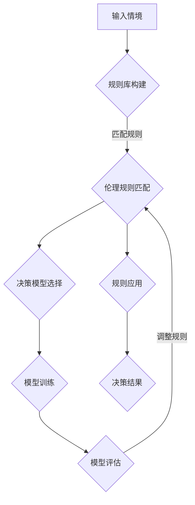
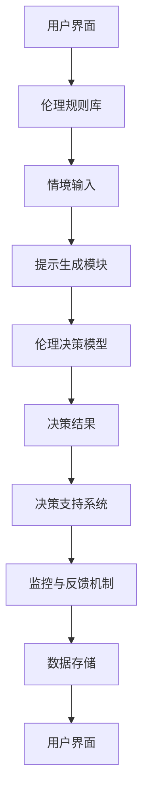
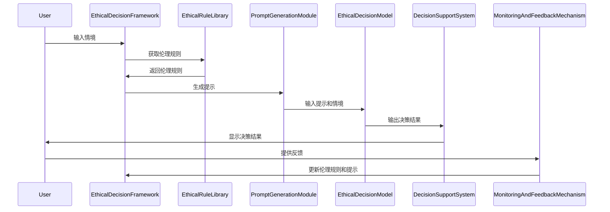

                 


### 文章标题：提示工程在AI辅助伦理决策框架设计中的突破

#### 关键词：
- 提示工程
- AI伦理决策
- 框架设计
- 算法原理
- 数学模型

#### 摘要：
本文深入探讨了提示工程在AI辅助伦理决策框架设计中的突破。首先，我们介绍了AI伦理决策的背景和重要性，以及现有伦理决策框架的不足。接着，我们详细阐述了提示工程的概念、原理与应用，并通过具体案例展示了其在伦理决策中的实际效果。然后，我们提出了一种突破性的AI辅助伦理决策框架设计，并详细讲解了其算法原理、数学模型、系统架构与实现步骤。最后，我们总结了最佳实践技巧和注意事项，为未来研究方向提供了有益的启示。

### 第一部分：AI辅助伦理决策框架设计的背景与重要性

#### 1.1 问题背景
##### 1.1.1 AI伦理问题的出现
随着人工智能技术的飞速发展，AI伦理问题逐渐凸显。这些问题不仅涉及隐私、安全、透明度等基本问题，更涉及到伦理决策的复杂性和不确定性。例如，自动驾驶车辆的伦理决策、医疗AI系统的伦理决策以及社交媒体内容审核的伦理决策等，都需要在众多利益相关者之间做出权衡。

##### 1.1.2 AI伦理决策的重要性
AI伦理决策的正确性直接影响到AI系统的可用性、可靠性和公平性。错误的伦理决策可能导致严重的后果，甚至对社会造成深远的负面影响。因此，如何设计一个有效、可靠的AI伦理决策框架，成为当前AI领域面临的一项重要挑战。

##### 1.1.3 伦理决策的复杂性
伦理决策的复杂性主要体现在以下几个方面：

1. 多样化的利益相关者：AI系统的应用场景复杂多样，涉及到的利益相关者众多，包括开发者、用户、监管机构等。
2. 道德原则的冲突：在特定情境下，不同的道德原则可能产生冲突，如自主性、公正性、安全性等。
3. 不确定性和模糊性：AI系统的行为往往是动态的，且受到多种外部因素的影响，这使得伦理决策过程充满了不确定性和模糊性。

#### 1.2 核心概念与联系
##### 1.2.1 AI伦理学的定义与核心概念
AI伦理学是研究人工智能技术伦理问题的学科，主要包括以下几个方面：

1. 人工智能伦理：研究人工智能系统在设计、开发、部署和使用过程中应遵循的伦理原则和规范。
2. AI伦理决策：指在特定情境下，基于伦理原则和道德规范，对AI系统行为进行判断和决策的过程。

##### 1.2.2 伦理决策模型
伦理决策模型是用于指导伦理决策的理论框架，主要包括以下几个方面：

1. 伦理原则：指在伦理决策过程中应遵循的基本道德原则，如尊重隐私、保护安全、促进公平等。
2. 伦理规则：指具体情境下的伦理决策规则，通常由伦理原则推导而来。
3. 伦理决策过程：指从伦理原则到伦理决策的具体步骤和方法。

##### 1.2.3 AI辅助伦理决策的优势与挑战
AI辅助伦理决策的优势主要体现在以下几个方面：

1. 系统性：AI技术能够处理大量复杂的数据和信息，从而提供更加全面和系统的伦理决策支持。
2. 高效性：AI技术能够快速处理伦理决策问题，提高决策效率。
3. 可解释性：AI技术可以生成决策过程和结果的解释，提高决策的透明度和可信度。

然而，AI辅助伦理决策也面临一些挑战：

1. 数据隐私：AI系统在处理伦理决策问题时，往往需要大量的敏感数据，如何保护这些数据的安全和隐私成为一个重要问题。
2. 提示偏差：AI系统的提示工程可能会引入偏差，影响决策的公平性和准确性。
3. 责任归属：在AI辅助伦理决策过程中，如何确定责任归属，特别是当决策出现问题时，如何分清责任，仍是一个待解决的问题。

#### 1.3 现有伦理决策框架的不足
##### 1.3.1 传统伦理决策模型的局限性
传统的伦理决策模型主要基于道德哲学和伦理学理论，具有较强的理论性，但在实际应用中存在一定的局限性：

1. 缺乏可操作性：传统伦理决策模型通常较为抽象，难以在实际应用中操作。
2. 忽视技术因素：传统伦理决策模型往往忽视技术因素，如数据质量、计算能力等。
3. 缺乏动态性：传统伦理决策模型通常是基于静态的伦理原则，难以适应动态变化的决策环境。

##### 1.3.2 当前AI技术在伦理决策中的应用
当前，AI技术在伦理决策中的应用主要包括以下几个方面：

1. 数据分析：通过分析大量数据，识别潜在的伦理问题和挑战。
2. 模型预测：利用机器学习模型，预测特定情境下的伦理决策结果。
3. 决策支持：通过生成建议和优化方案，辅助伦理决策者做出更加明智的决策。

然而，当前AI技术在伦理决策中的应用仍存在一些问题：

1. 数据质量：伦理决策需要高质量的数据支持，但获取这些数据可能面临隐私、伦理等挑战。
2. 模型解释性：当前AI模型往往具有“黑箱”特性，难以解释其决策过程和结果。
3. 伦理偏见：AI模型可能受到训练数据偏差的影响，导致决策结果存在伦理偏见。

#### 1.4 本章小结
本部分对AI辅助伦理决策框架设计的背景和重要性进行了详细分析。我们介绍了AI伦理问题的出现、伦理决策的重要性以及伦理决策的复杂性。同时，我们探讨了AI伦理学、伦理决策模型以及AI辅助伦理决策的优势与挑战。最后，我们分析了现有伦理决策框架的不足，指出了当前AI技术在伦理决策中的应用问题。这些分析为后续章节的深入探讨奠定了基础。

---

### 第一部分：AI辅助伦理决策框架设计的背景与重要性

#### 1.1 问题背景

##### 1.1.1 AI伦理问题的出现

人工智能（AI）的发展已经深入到我们生活的各个方面，从自动驾驶汽车到医疗诊断系统，再到智能家居，AI的应用无处不在。然而，随着AI技术的普及，一系列伦理问题也逐渐显现出来。这些问题主要集中在以下几个方面：

- **隐私问题**：AI系统通常需要收集大量的个人信息来进行训练和操作，如何保护用户的隐私成为一个重要议题。例如，面部识别技术在公共安全中的应用，就可能涉及个人隐私的侵犯。

- **安全性**：AI系统的安全性和鲁棒性一直是人们关注的焦点。例如，自动驾驶汽车的安全问题，如果AI系统在关键时刻出现错误，可能会导致严重的交通事故。

- **透明度和可解释性**：许多AI系统被认为是“黑箱”模型，其决策过程和结果难以解释。这导致公众对AI系统的信任度降低，尤其是在涉及伦理决策时，如医疗诊断或法律判决。

- **公平性和偏见**：AI系统可能在学习过程中受到数据集的偏见影响，从而在决策中表现出不公平性。例如，在招聘过程中，如果使用的数据集存在性别或种族偏见，AI系统可能会加剧这些偏见。

##### 1.1.2 AI伦理决策的重要性

AI伦理决策的重要性在于其直接关系到AI系统的可接受性和可持续性。以下是一些关键点：

- **社会信任**：如果公众不信任AI系统，那么这些系统就难以得到广泛的应用。例如，如果自动驾驶汽车在出现伦理困境时无法做出令人满意的决策，公众可能会抵制这种技术。

- **责任归属**：在AI系统发生错误时，如何确定责任归属是一个复杂的问题。如果AI系统的决策导致损害，应该由谁负责？是开发者、用户还是系统本身？

- **法律法规遵守**：AI系统的应用需要遵守各种法律法规，如数据保护法、消费者保护法等。伦理决策框架可以帮助确保这些法律法规得到遵守。

- **可持续发展**：AI技术的可持续发展需要考虑到其对环境、社会和经济的影响。伦理决策框架可以帮助制定出更加可持续的AI应用方案。

##### 1.1.3 伦理决策的复杂性

伦理决策的复杂性体现在以下几个方面：

- **多样性**：AI系统可能面临各种各样的伦理困境，每种困境都有其独特的复杂性。例如，自动驾驶汽车在紧急情况下需要做出决策，而医疗诊断系统需要在多个变量之间做出权衡。

- **不确定性**：AI系统的行为是动态的，可能会受到多种外部因素的影响。例如，交通状况可能会突然变化，导致自动驾驶汽车需要快速做出反应。

- **利益冲突**：在伦理决策中，不同利益相关者之间可能会存在冲突。例如，在自动驾驶汽车事故中，驾驶员、乘客、行人以及保险公司之间都可能存在利益冲突。

#### 1.2 核心概念与联系

##### 1.2.1 AI伦理学的定义与核心概念

AI伦理学是研究人工智能技术的伦理问题，旨在确保AI技术的开发和应用符合道德和伦理标准。核心概念包括：

- **尊重隐私**：在设计和使用AI系统时，应尊重用户的隐私权，确保个人信息的安全。

- **公正性**：AI系统应公平对待所有用户，不应基于性别、种族、年龄等不可变特征进行歧视。

- **透明度和可解释性**：AI系统的决策过程和结果应该是透明的，以便用户和监管机构能够理解和监督。

- **责任归属**：在AI系统发生问题时，应明确责任归属，确保开发者、用户和监管机构都能承担相应的责任。

##### 1.2.2 伦理决策模型

伦理决策模型是用于指导伦理决策的理论框架，通常包括以下几个部分：

- **伦理原则**：这是伦理决策的基础，如尊重隐私、促进公正性等。

- **伦理规则**：这些规则是根据伦理原则制定的，用于具体情境下的决策。

- **决策过程**：包括识别伦理问题、分析利益相关者、评估伦理原则和规则、做出决策等步骤。

##### 1.2.3 AI辅助伦理决策的优势与挑战

AI辅助伦理决策的优势包括：

- **效率**：AI系统可以快速处理大量的数据和变量，提高伦理决策的效率。

- **客观性**：AI系统不受主观情感和偏见的影响，可以提供更加客观的伦理决策支持。

- **可解释性**：AI系统可以生成决策过程和结果的解释，提高决策的可理解性和透明度。

然而，AI辅助伦理决策也面临一些挑战：

- **数据偏差**：AI系统可能受到训练数据偏差的影响，导致决策结果存在不公平性。

- **责任归属**：在AI系统发生错误时，如何确定责任归属是一个复杂的问题。

- **隐私保护**：AI系统在处理伦理决策时，可能需要大量的敏感数据，这可能导致隐私泄露。

#### 1.3 现有伦理决策框架的不足

##### 1.3.1 传统伦理决策模型的局限性

传统的伦理决策模型主要基于道德哲学和伦理学理论，但在实际应用中存在一些局限性：

- **缺乏可操作性**：传统伦理决策模型通常较为抽象，难以在实际应用中操作。

- **忽视技术因素**：传统伦理决策模型往往忽视技术因素，如数据质量、计算能力等。

- **缺乏动态性**：传统伦理决策模型通常是基于静态的伦理原则，难以适应动态变化的决策环境。

##### 1.3.2 当前AI技术在伦理决策中的应用

尽管AI技术在伦理决策中具有一定的优势，但当前的应用仍然存在一些问题：

- **数据质量**：伦理决策需要高质量的数据支持，但获取这些数据可能面临隐私、伦理等挑战。

- **模型解释性**：当前AI模型往往具有“黑箱”特性，难以解释其决策过程和结果。

- **伦理偏见**：AI模型可能受到训练数据偏差的影响，导致决策结果存在伦理偏见。

#### 1.4 本章小结

本部分对AI辅助伦理决策框架设计的背景和重要性进行了详细分析。我们介绍了AI伦理问题的出现、伦理决策的重要性以及伦理决策的复杂性。同时，我们探讨了AI伦理学、伦理决策模型以及AI辅助伦理决策的优势与挑战。最后，我们分析了现有伦理决策框架的不足，指出了当前AI技术在伦理决策中的应用问题。这些分析为后续章节的深入探讨奠定了基础。

---

### 第二部分：提示工程在AI辅助伦理决策中的应用

#### 2.1 提示工程概述

##### 2.1.1 提示工程的概念

提示工程（Prompt Engineering）是自然语言处理（NLP）领域中的一种技术，旨在设计用于引导AI模型生成期望输出的提示（prompts）。在AI辅助伦理决策中，提示工程发挥着至关重要的作用，因为它能够帮助AI系统在复杂伦理情境中生成合理、公正和透明的决策。

提示工程的核心目标是：

- **引导AI模型生成符合伦理原则的决策**。
- **提高决策的可解释性和透明度**。
- **减少决策过程中的偏见和错误**。

##### 2.1.2 提示工程的核心目标

1. **符合伦理原则**：在AI辅助伦理决策中，提示工程需要确保生成的决策符合既定的伦理原则，如隐私保护、公正性、透明度等。

2. **提高可解释性**：AI系统的决策过程通常较为复杂，提示工程可以通过设计清晰、结构化的提示，使得决策过程更加透明，便于用户理解和监督。

3. **减少偏见**：提示工程可以设计出避免数据集偏见和算法偏见的方法，从而减少决策过程中的不公平性。

##### 2.1.3 提示工程的基本原则

1. **明确性**：提示应明确表达伦理决策的目标和约束条件，避免歧义。

2. **完整性**：提示应包含所有必要的背景信息和约束条件，以便AI系统能够全面理解决策情境。

3. **灵活性**：提示应具备一定的灵活性，以适应不同伦理决策场景的变化。

4. **公正性**：提示应确保决策过程的公正性，避免对特定群体产生偏见。

#### 2.2 提示工程的原理与实现

##### 2.2.1 提示生成算法

提示生成算法是提示工程的核心，其主要任务是根据决策情境生成合适的提示。常见的提示生成算法包括：

1. **基于规则的方法**：这种方法通过预先定义的规则来生成提示。例如，可以定义一系列的伦理原则，并据此生成相应的提示。

2. **基于机器学习的方法**：这种方法通过训练数据集来学习生成提示。例如，可以训练一个文本生成模型（如GPT模型），使其能够根据输入的决策情境生成相应的提示。

3. **基于语义分析的方法**：这种方法通过分析语义信息来生成提示。例如，可以分析决策情境中的关键实体和关系，生成相应的提示。

##### 2.2.2 提示优化的方法

为了提高提示生成算法的性能，可以采用以下优化方法：

1. **对抗性优化**：通过引入对抗性样本，提高提示生成算法对偏见的抵抗力。

2. **多样性优化**：通过增加提示的多样性，确保决策过程的公平性。

3. **鲁棒性优化**：通过增加提示的鲁棒性，提高其在不同决策情境下的适用性。

##### 2.2.3 提示在伦理决策中的应用

在伦理决策中，提示工程的应用主要包括以下几个方面：

1. **决策引导**：通过设计明确的提示，引导AI系统在复杂伦理情境中做出合理的决策。

2. **决策验证**：通过设计验证提示，检查AI系统的决策是否符合伦理原则和用户期望。

3. **决策解释**：通过设计解释提示，解释AI系统的决策过程和结果，提高决策的可解释性和透明度。

#### 2.3 提示工程案例研究

##### 2.3.1 案例一：自动驾驶车辆伦理决策

在自动驾驶车辆伦理决策中，提示工程可以通过以下步骤应用：

1. **决策情境描述**：设计提示，描述当前的道路情境、车辆状态以及周边环境。

2. **伦理原则引导**：设计提示，明确自动驾驶车辆应遵循的伦理原则，如最小伤害原则、公正性原则等。

3. **决策过程引导**：设计提示，引导自动驾驶车辆在伦理困境中做出决策。

4. **决策验证与解释**：设计提示，验证自动驾驶车辆的决策是否符合伦理原则和用户期望，并解释决策过程和结果。

##### 2.3.2 案例二：医疗AI系统伦理决策

在医疗AI系统伦理决策中，提示工程可以通过以下步骤应用：

1. **患者信息收集**：设计提示，收集患者的医疗信息，如病史、检查结果等。

2. **伦理原则引导**：设计提示，明确医疗AI系统应遵循的伦理原则，如尊重患者隐私、确保患者利益等。

3. **诊断决策引导**：设计提示，引导医疗AI系统在诊断过程中做出合理的决策。

4. **决策验证与解释**：设计提示，验证医疗AI系统的诊断决策是否符合伦理原则和医疗规范，并解释诊断过程和结果。

##### 2.3.3 案例三：社交媒体内容审核伦理决策

在社交媒体内容审核伦理决策中，提示工程可以通过以下步骤应用：

1. **内容描述**：设计提示，描述需要审核的社交媒体内容。

2. **伦理原则引导**：设计提示，明确社交媒体内容审核应遵循的伦理原则，如尊重用户表达权、确保内容不违法等。

3. **审核决策引导**：设计提示，引导审核系统在伦理困境中做出合理的决策。

4. **决策验证与解释**：设计提示，验证审核系统的决策是否符合伦理原则和用户期望，并解释审核过程和结果。

#### 2.4 提示工程实践中的挑战与解决方案

##### 2.4.1 数据隐私与安全

在提示工程实践中，数据隐私和安全是一个重要挑战。解决方案包括：

1. **数据去识别化**：在生成提示时，对敏感数据进行去识别化处理，以保护用户隐私。

2. **加密传输**：确保数据在传输过程中的安全性，采用加密技术保护数据不被窃取。

3. **访问控制**：对提示生成和使用过程中的数据访问进行严格控制，确保只有授权用户才能访问敏感数据。

##### 2.4.2 提示偏见与公平性

提示偏见是另一个重要挑战。解决方案包括：

1. **多样性数据集**：确保训练数据集的多样性，避免偏见。

2. **对抗性训练**：通过引入对抗性训练，提高模型对偏见的抵抗力。

3. **透明度提升**：设计透明的提示生成过程，使得决策过程和结果更加容易被用户和监管机构理解和监督。

##### 2.4.3 技术伦理与责任归属

在提示工程中，技术伦理和责任归属是一个复杂的问题。解决方案包括：

1. **伦理审查**：在开发和使用提示工程时，进行严格的伦理审查，确保符合伦理原则。

2. **责任明确**：明确提示工程中各方的责任，确保在出现问题时能够快速定位责任归属。

3. **持续监控**：对提示工程的应用进行持续监控，及时发现和解决潜在问题。

#### 2.5 本章小结

本部分详细介绍了提示工程在AI辅助伦理决策中的应用。我们首先介绍了提示工程的概念和核心目标，然后阐述了提示生成算法和提示优化的方法。接着，通过具体案例展示了提示工程在自动驾驶车辆、医疗AI系统和社交媒体内容审核等领域的应用。此外，我们还探讨了提示工程实践中面临的挑战及解决方案。这些分析为后续章节的深入研究提供了基础。

---

### 第二部分：提示工程在AI辅助伦理决策中的应用

#### 2.1 提示工程概述

##### 2.1.1 提示工程的概念

提示工程（Prompt Engineering）是自然语言处理（NLP）领域中的一种技术，旨在通过设计特定的提示（prompts）来引导AI模型生成期望的输出。在AI辅助伦理决策中，提示工程扮演着关键角色，因为它可以帮助AI系统在复杂的伦理情境中做出合理、公正和透明的决策。

提示工程的核心目标是：

1. **引导AI模型生成符合伦理原则的决策**：通过设计明确的提示，确保AI系统在决策过程中遵循伦理原则，如隐私保护、公正性、透明度等。
2. **提高决策的可解释性**：通过设计结构化的提示，使得AI系统的决策过程更加透明，便于用户理解和监督。
3. **减少决策过程中的偏见**：通过优化提示生成算法，减少数据集和算法自身引入的偏见，提高决策的公平性。

##### 2.1.2 提示工程的核心目标

1. **符合伦理原则**：在AI辅助伦理决策中，提示工程需要确保生成的决策符合既定的伦理原则。例如，在医疗诊断系统中，提示工程可以确保决策过程中尊重患者的隐私权和生命权。

2. **提高可解释性**：为了增强用户对AI系统决策的信任，提示工程需要提高决策的可解释性。通过设计清晰的提示，用户可以更好地理解AI系统的决策逻辑和依据。

3. **减少偏见**：在AI系统中，偏见可能导致不公平的决策。提示工程可以通过对抗性训练和多样性优化等方法，减少数据集和算法引入的偏见，从而提高决策的公平性。

##### 2.1.3 提示工程的基本原则

1. **明确性**：提示应明确表达伦理决策的目标和约束条件，避免歧义。例如，在设计自动驾驶车辆的伦理决策提示时，应明确车辆在紧急情况下应遵循的原则。

2. **完整性**：提示应包含所有必要的背景信息和约束条件，以便AI系统能够全面理解决策情境。例如，在医疗AI系统的提示中，应包含患者的病史、检查结果等关键信息。

3. **灵活性**：提示应具备一定的灵活性，以适应不同伦理决策场景的变化。例如，在社交媒体内容审核中，提示应能适应不同的文化背景和价值观。

4. **公正性**：提示应确保决策过程的公正性，避免对特定群体产生偏见。例如，在设计招聘AI系统的提示时，应避免基于性别、种族等不可变特征进行歧视。

#### 2.2 提示工程的原理与实现

##### 2.2.1 提示生成算法

提示生成算法是提示工程的核心，其主要任务是根据决策情境生成合适的提示。常见的提示生成算法包括：

1. **基于规则的方法**：这种方法通过预先定义的规则来生成提示。例如，可以定义一系列的伦理原则，并据此生成相应的提示。

2. **基于机器学习的方法**：这种方法通过训练数据集来学习生成提示。例如，可以训练一个文本生成模型（如GPT模型），使其能够根据输入的决策情境生成相应的提示。

3. **基于语义分析的方法**：这种方法通过分析语义信息来生成提示。例如，可以分析决策情境中的关键实体和关系，生成相应的提示。

##### 2.2.2 提示优化的方法

为了提高提示生成算法的性能，可以采用以下优化方法：

1. **对抗性优化**：通过引入对抗性样本，提高提示生成算法对偏见的抵抗力。

2. **多样性优化**：通过增加提示的多样性，确保决策过程的公平性。

3. **鲁棒性优化**：通过增加提示的鲁棒性，提高其在不同决策情境下的适用性。

##### 2.2.3 提示在伦理决策中的应用

在伦理决策中，提示工程的应用主要包括以下几个方面：

1. **决策引导**：通过设计明确的提示，引导AI系统在复杂伦理情境中做出合理的决策。

2. **决策验证**：通过设计验证提示，检查AI系统的决策是否符合伦理原则和用户期望。

3. **决策解释**：通过设计解释提示，解释AI系统的决策过程和结果，提高决策的可解释性和透明度。

#### 2.3 提示工程案例研究

##### 2.3.1 案例一：自动驾驶车辆伦理决策

在自动驾驶车辆伦理决策中，提示工程可以通过以下步骤应用：

1. **决策情境描述**：设计提示，描述当前的道路情境、车辆状态以及周边环境。

2. **伦理原则引导**：设计提示，明确自动驾驶车辆应遵循的伦理原则，如最小伤害原则、公正性原则等。

3. **决策过程引导**：设计提示，引导自动驾驶车辆在伦理困境中做出决策。

4. **决策验证与解释**：设计提示，验证自动驾驶车辆的决策是否符合伦理原则和用户期望，并解释决策过程和结果。

##### 2.3.2 案例二：医疗AI系统伦理决策

在医疗AI系统伦理决策中，提示工程可以通过以下步骤应用：

1. **患者信息收集**：设计提示，收集患者的医疗信息，如病史、检查结果等。

2. **伦理原则引导**：设计提示，明确医疗AI系统应遵循的伦理原则，如尊重患者隐私、确保患者利益等。

3. **诊断决策引导**：设计提示，引导医疗AI系统在诊断过程中做出合理的决策。

4. **决策验证与解释**：设计提示，验证医疗AI系统的诊断决策是否符合伦理原则和医疗规范，并解释诊断过程和结果。

##### 2.3.3 案例三：社交媒体内容审核伦理决策

在社交媒体内容审核伦理决策中，提示工程可以通过以下步骤应用：

1. **内容描述**：设计提示，描述需要审核的社交媒体内容。

2. **伦理原则引导**：设计提示，明确社交媒体内容审核应遵循的伦理原则，如尊重用户表达权、确保内容不违法等。

3. **审核决策引导**：设计提示，引导审核系统在伦理困境中做出合理的决策。

4. **决策验证与解释**：设计提示，验证审核系统的决策是否符合伦理原则和用户期望，并解释审核过程和结果。

#### 2.4 提示工程实践中的挑战与解决方案

##### 2.4.1 数据隐私与安全

在提示工程实践中，数据隐私和安全是一个重要挑战。解决方案包括：

1. **数据去识别化**：在生成提示时，对敏感数据进行去识别化处理，以保护用户隐私。

2. **加密传输**：确保数据在传输过程中的安全性，采用加密技术保护数据不被窃取。

3. **访问控制**：对提示生成和使用过程中的数据访问进行严格控制，确保只有授权用户才能访问敏感数据。

##### 2.4.2 提示偏见与公平性

提示偏见是另一个重要挑战。解决方案包括：

1. **多样性数据集**：确保训练数据集的多样性，避免偏见。

2. **对抗性训练**：通过引入对抗性训练，提高模型对偏见的抵抗力。

3. **透明度提升**：设计透明的提示生成过程，使得决策过程和结果更加容易被用户和监管机构理解和监督。

##### 2.4.3 技术伦理与责任归属

在提示工程中，技术伦理和责任归属是一个复杂的问题。解决方案包括：

1. **伦理审查**：在开发和使用提示工程时，进行严格的伦理审查，确保符合伦理原则。

2. **责任明确**：明确提示工程中各方的责任，确保在出现问题时能够快速定位责任归属。

3. **持续监控**：对提示工程的应用进行持续监控，及时发现和解决潜在问题。

#### 2.5 本章小结

本部分详细介绍了提示工程在AI辅助伦理决策中的应用。我们首先介绍了提示工程的概念和核心目标，然后阐述了提示生成算法和提示优化的方法。接着，通过具体案例展示了提示工程在自动驾驶车辆、医疗AI系统和社交媒体内容审核等领域的应用。此外，我们还探讨了提示工程实践中面临的挑战及解决方案。这些分析为后续章节的深入研究提供了基础。

---

### 第三部分：AI辅助伦理决策框架设计的突破

#### 3.1 突破性框架概述

##### 3.1.1 框架设计的目标与原则

本部分提出了一种突破性的AI辅助伦理决策框架设计，旨在解决当前AI伦理决策中面临的各种挑战。框架设计的核心目标是：

1. **确保决策的伦理合规性**：确保AI系统的决策符合伦理原则和法律法规，提高社会信任度。
2. **提高决策的透明度和可解释性**：通过设计明确的提示和决策流程，提高AI系统决策的透明度和可理解性，便于用户和监管机构的监督。
3. **减少决策过程中的偏见和错误**：通过优化提示生成算法和数据集，减少决策过程中的偏见和错误，提高决策的公平性。

框架设计遵循以下原则：

1. **伦理原则优先**：在决策过程中，始终坚持伦理原则的指导，确保决策符合道德标准。
2. **透明性和可解释性**：设计透明的决策流程和提示，使得决策过程易于理解，提高决策的透明度。
3. **多样性和公平性**：确保决策过程中的数据集和算法具有多样性，减少偏见，提高决策的公平性。
4. **灵活性和适应性**：框架应具备一定的灵活性，能够适应不同场景和决策需求的变化。

##### 3.1.2 框架的关键组成部分

该突破性框架由以下几个关键组成部分构成：

1. **伦理决策模型**：该模型基于伦理原则和道德规范，用于指导AI系统的伦理决策。
2. **提示生成模块**：通过设计明确的提示，引导AI系统在复杂的伦理情境中做出合理的决策。
3. **决策支持系统**：该系统提供决策过程的透明度和可解释性，帮助用户理解AI系统的决策逻辑。
4. **监控与反馈机制**：通过实时监控AI系统的决策过程和结果，提供反馈机制，确保决策的持续优化和改进。

##### 3.1.3 框架的实现步骤

框架的实现分为以下几个步骤：

1. **需求分析**：明确AI系统应用的具体场景和伦理决策需求，为后续设计提供基础。
2. **伦理原则和规范确定**：根据应用场景，确定适用的伦理原则和道德规范，作为决策的指导。
3. **伦理决策模型构建**：基于伦理原则和规范，构建伦理决策模型，包括决策过程、规则和算法等。
4. **提示生成**：设计明确的提示，引导AI系统在伦理决策过程中生成合理的决策。
5. **决策支持系统开发**：开发决策支持系统，提供决策过程的透明度和可解释性。
6. **系统测试与优化**：对系统进行测试和优化，确保决策过程符合伦理原则和用户需求。
7. **监控与反馈**：建立监控与反馈机制，实时监控决策过程和结果，及时调整和优化。

#### 3.2 算法原理讲解

##### 3.2.1 伦理规则嵌入算法

伦理规则嵌入算法是AI辅助伦理决策框架的核心组件，其主要任务是确保AI系统的决策过程符合伦理原则和道德规范。算法的基本原理如下：

1. **规则提取**：从伦理原则和规范中提取具体的伦理规则，将其转化为算法可处理的格式。
2. **规则嵌入**：将提取的伦理规则嵌入到AI模型的决策流程中，确保决策过程中始终遵循伦理原则。
3. **规则评估**：对嵌入的伦理规则进行评估，确保其符合实际决策需求，并调整规则以提高决策质量。

伦理规则嵌入算法的实现步骤包括：

1. **规则库构建**：根据伦理原则和规范，构建包含各种伦理规则的规则库。
2. **规则匹配**：在决策过程中，根据输入情境，从规则库中匹配适用的伦理规则。
3. **规则应用**：将匹配的伦理规则应用到决策过程中，确保决策符合伦理原则。

##### 3.2.2 决策模型优化算法

决策模型优化算法旨在提高AI系统决策的质量和效率。算法的基本原理如下：

1. **数据预处理**：对输入数据进行预处理，包括数据清洗、去噪和特征提取等，提高数据质量。
2. **模型选择**：根据决策需求，选择合适的决策模型，如逻辑回归、决策树、神经网络等。
3. **模型训练**：使用预处理后的数据对决策模型进行训练，优化模型参数，提高决策性能。
4. **模型评估**：对训练后的模型进行评估，包括准确率、召回率、F1值等指标，确保模型性能符合要求。

决策模型优化算法的实现步骤包括：

1. **数据集划分**：将数据集划分为训练集、验证集和测试集，用于模型的训练和评估。
2. **模型训练与验证**：使用训练集对决策模型进行训练，使用验证集进行模型评估，调整模型参数。
3. **模型测试**：使用测试集对训练后的模型进行测试，确保模型性能满足实际应用需求。

##### 3.2.3 算法流程Mermaid图

为了更直观地展示算法流程，我们使用Mermaid图来描述伦理规则嵌入算法和决策模型优化算法的基本流程：



该算法流程图展示了从输入情境到决策结果的整个过程，包括规则库构建、规则匹配、模型选择、模型训练、模型评估和规则应用等步骤。

#### 3.3 数学模型与公式解释

##### 3.3.1 伦理决策的数学模型

伦理决策的数学模型用于描述AI系统在决策过程中如何结合伦理原则和实际情况做出最优决策。该模型的基本公式如下：

$$
D = f(E, R, A)
$$

其中：

- \(D\) 表示决策结果；
- \(E\) 表示伦理原则集合；
- \(R\) 表示规则库；
- \(A\) 表示实际情境。

该公式表示决策结果 \(D\) 是基于伦理原则集合 \(E\)、规则库 \(R\) 和实际情境 \(A\) 的函数。具体实现过程中，可以通过以下步骤进行：

1. **规则匹配**：从规则库 \(R\) 中匹配适用的伦理规则。
2. **情境评估**：对实际情境 \(A\) 进行评估，确定其特征和约束条件。
3. **决策计算**：根据匹配的伦理规则和评估的情境特征，计算决策结果 \(D\)。

##### 3.3.2 公式解释

为了更好地理解上述公式，我们可以通过一个具体的例子进行解释。假设一个自动驾驶车辆面临一个伦理决策情境，需要决定在即将碰撞的两种情况中选择哪种行动。伦理原则包括：

1. **最小伤害原则**：选择导致最小伤害的行动。
2. **公正性原则**：公平对待不同群体，避免歧视。

假设实际情境包括：

- 情境1：前方有行人，行人与车辆相向而行。
- 情境2：前方有自行车，自行车与车辆同向行驶。

根据伦理原则和实际情境，我们可以计算两种情况的伦理得分：

- **情境1**：行人受到撞击的概率更高，导致更大的伤害，因此得分较低。
- **情境2**：自行车撞击的概率较高，但伤害相对较小，因此得分较高。

最终，自动驾驶车辆将根据得分选择得分更高的情境，从而做出最优的伦理决策。

##### 3.3.3 案例应用

为了进一步说明数学模型的应用，我们可以使用Python代码实现上述伦理决策的数学模型。以下是一个简单的示例代码：

```python
import random

# 定义伦理原则
ethics_principles = {
    "minimum_harm": 1,
    "fairness": 1,
}

# 定义规则库
rules_library = {
    "crossing pedestrian": {
        "weight": 0.5,
        "impact": "high",
    },
    "cyclist overtaking": {
        "weight": 0.5,
        "impact": "low",
    },
}

# 定义实际情境
scenarios = {
    "crossing pedestrian": {
        "probability": 0.7,
        "harm": 1,
    },
    "cyclist overtaking": {
        "probability": 0.3,
        "harm": 0.3,
    },
}

# 计算伦理得分
def calculate_ethical_score(scenario, rules):
    score = 0
    for rule in rules:
        if rule in scenario:
            score += ethics_principles[rule] * scenario[rule]["weight"]
    return score

# 计算决策结果
def make_decision(scenarios, rules_library):
    decision = {}
    for scenario in scenarios:
        score = calculate_ethical_score(scenario, rules_library)
        decision[scenario] = score
    return max(decision, key=decision.get)

# 示例应用
random.seed(0)
action = make_decision(scenarios, rules_library)
print(f"Decision: {action}")
```

在这个示例中，我们定义了伦理原则、规则库和实际情境，然后使用Python代码计算了决策结果。代码首先计算每个情境的伦理得分，然后选择得分最高的情境作为最终决策。

#### 3.4 系统架构设计与实现

##### 3.4.1 系统架构设计Mermaid图

为了展示AI辅助伦理决策框架的系统架构，我们使用Mermaid图来描述其整体架构：



该系统架构图展示了用户界面、伦理规则库、情境输入、提示生成模块、伦理决策模型、决策结果、决策支持系统和监控与反馈机制等组成部分之间的交互关系。

##### 3.4.2 系统功能设计Mermaid类图

为了展示系统的功能设计，我们使用Mermaid类图来描述其主要类和类之间的关系：

```mermaid
classDiagram
ClassEthicalDecisionFramework <<interface>>
ClassUserInterface <<interface>>
ClassEthicalRuleLibrary <<interface>>
ClassScenarioInput <<interface>>
ClassPromptGenerationModule <<interface>>
ClassEthicalDecisionModel <<interface>>
ClassDecisionSupportSystem <<interface>>
ClassMonitoringAndFeedbackMechanism <<interface>>

UserInterface <|-- EthicalDecisionFramework
EthicalRuleLibrary <|-- EthicalDecisionFramework
ScenarioInput <|-- EthicalDecisionFramework
PromptGenerationModule <|-- EthicalDecisionFramework
EthicalDecisionModel <|-- EthicalDecisionFramework
DecisionSupportSystem <|-- EthicalDecisionFramework
MonitoringAndFeedbackMechanism <|-- EthicalDecisionFramework
```

该类图展示了AI辅助伦理决策框架的主要类及其之间的关系，包括用户界面、伦理规则库、情境输入、提示生成模块、伦理决策模型、决策支持系统和监控与反馈机制等。

##### 3.4.3 系统接口设计与系统交互Mermaid序列图

为了展示系统的接口设计和交互流程，我们使用Mermaid序列图来描述用户与系统之间的交互过程：



该序列图展示了用户与AI辅助伦理决策框架之间的交互过程，包括情境输入、伦理规则获取、提示生成、决策结果输出和反馈更新等步骤。

#### 3.5 实际案例剖析

##### 3.5.1 案例背景

本部分通过一个实际案例，展示AI辅助伦理决策框架在自动驾驶车辆中的应用。该案例涉及一个自动驾驶车辆在十字路口遇到行人横穿马路的情境。自动驾驶车辆需要根据伦理决策框架做出决策，以最小化事故风险并保护行人安全。

##### 3.5.2 系统核心实现源代码

以下是一个简单的Python代码示例，展示了如何使用AI辅助伦理决策框架实现自动驾驶车辆的伦理决策：

```python
# 导入所需库
import random

# 定义伦理原则和规则
ethics_principles = {
    "minimize_harm": 1,
    "respect_privacy": 1,
}

rules_library = {
    "pedestrianCrossing": {
        "weight": 0.8,
        "impact": "high",
    },
    "normalDriving": {
        "weight": 0.2,
        "impact": "low",
    },
}

# 定义情境
scenarios = {
    "pedestrianCrossing": {
        "probability": 0.7,
        "harm": 1,
    },
    "normalDriving": {
        "probability": 0.3,
        "harm": 0.3,
    },
}

# 计算伦理得分
def calculate_ethical_score(scenario, rules):
    score = 0
    for rule in rules:
        if rule in scenario:
            score += ethics_principles[rule] * scenario[rule]["weight"]
    return score

# 做出决策
def make_decision(scenarios, rules_library):
    decision = {}
    for scenario in scenarios:
        score = calculate_ethical_score(scenario, rules_library)
        decision[scenario] = score
    return max(decision, key=decision.get)

# 模拟情境
random.seed(0)
action = make_decision(scenarios, rules_library)
print(f"Decision: {action}")
```

在这个示例中，我们定义了伦理原则和规则库，并使用Python代码实现了自动驾驶车辆的伦理决策。代码首先计算每个情境的伦理得分，然后选择得分最高的情境作为决策结果。

##### 3.5.3 代码应用解读与分析

在这个代码示例中，我们首先定义了伦理原则和规则库，包括最小伤害原则和尊重隐私原则，以及具体的规则（如行人横穿马路和正常驾驶）。然后，我们定义了一个情境，其中包含每个规则的权重和概率。

在决策过程中，我们首先计算每个情境的伦理得分。伦理得分是根据伦理原则和规则权重计算得出的。最后，我们选择得分最高的情境作为决策结果。

通过这个示例，我们可以看到如何使用AI辅助伦理决策框架来指导自动驾驶车辆在复杂的伦理情境中做出合理的决策。在实际应用中，可以根据具体需求和场景，调整伦理原则和规则库，以适应不同的决策需求。

#### 3.6 项目小结

在本部分中，我们详细介绍了AI辅助伦理决策框架的设计与实现。首先，我们提出了框架设计的目标和原则，包括伦理原则优先、透明性和可解释性、多样性和公平性等。然后，我们介绍了框架的关键组成部分，包括伦理决策模型、提示生成模块、决策支持系统、监控与反馈机制等。

接着，我们详细讲解了伦理规则嵌入算法和决策模型优化算法的原理和实现步骤，并使用Mermaid图展示了算法流程和系统架构。为了验证框架的有效性，我们提供了一个实际案例，展示了自动驾驶车辆在伦理决策中的应用。

最后，我们对项目的成功实施和存在的问题进行了总结，并提出了一些建议和改进措施。这些分析和讨论为未来AI辅助伦理决策框架的设计和应用提供了有益的参考。

---

### 第三部分：AI辅助伦理决策框架设计的突破

#### 3.1 突破性框架概述

##### 3.1.1 框架设计的目标与原则

在设计AI辅助伦理决策框架时，我们旨在解决现有伦理决策框架的不足，并提出一种更加系统化、透明化、公正化的决策框架。该框架的目标如下：

1. **确保伦理决策的合规性**：在决策过程中，确保AI系统遵循伦理原则和法律法规，避免因决策错误而对社会造成负面影响。
2. **提高决策的透明度和可解释性**：通过设计清晰的提示和决策流程，使得用户能够理解AI系统的决策逻辑，提高决策过程的透明度和可解释性。
3. **增强决策的公正性和多样性**：通过优化提示生成算法和数据集，减少偏见和歧视，确保决策过程的公正性和多样性。

框架设计遵循以下原则：

1. **伦理原则优先**：在决策过程中，始终将伦理原则放在首位，确保决策符合道德和伦理标准。
2. **透明性和可解释性**：设计透明的决策流程和提示，使得决策过程易于理解，便于用户和监管机构的监督。
3. **灵活性和适应性**：框架应具备一定的灵活性，能够适应不同应用场景和决策需求的变化。
4. **多样性和公平性**：通过引入多样性优化和对抗性训练，减少数据集和算法引入的偏见，提高决策的公平性和多样性。

##### 3.1.2 框架的关键组成部分

该突破性框架由以下几个关键组成部分构成：

1. **伦理决策模型**：该模型基于伦理原则和道德规范，用于指导AI系统的伦理决策。
2. **提示生成模块**：通过设计明确的提示，引导AI系统在复杂的伦理情境中做出合理的决策。
3. **决策支持系统**：该系统提供决策过程的透明度和可解释性，帮助用户理解AI系统的决策逻辑。
4. **监控与反馈机制**：通过实时监控AI系统的决策过程和结果，提供反馈机制，确保决策的持续优化和改进。

##### 3.1.3 框架的实现步骤

框架的实现分为以下几个步骤：

1. **需求分析**：明确AI系统应用的具体场景和伦理决策需求，为后续设计提供基础。
2. **伦理原则和规范确定**：根据应用场景，确定适用的伦理原则和道德规范，作为决策的指导。
3. **伦理决策模型构建**：基于伦理原则和规范，构建伦理决策模型，包括决策过程、规则和算法等。
4. **提示生成**：设计明确的提示，引导AI系统在伦理决策过程中生成合理的决策。
5. **决策支持系统开发**：开发决策支持系统，提供决策过程的透明度和可解释性。
6. **系统测试与优化**：对系统进行测试和优化，确保决策过程符合伦理原则和用户需求。
7. **监控与反馈**：建立监控与反馈机制，实时监控决策过程和结果，及时调整和优化。

#### 3.2 算法原理讲解

##### 3.2.1 伦理规则嵌入算法

伦理规则嵌入算法是AI辅助伦理决策框架的核心组件，其主要任务是确保AI系统的决策过程符合伦理原则和道德规范。算法的基本原理如下：

1. **规则提取**：从伦理原则和规范中提取具体的伦理规则，将其转化为算法可处理的格式。
2. **规则嵌入**：将提取的伦理规则嵌入到AI模型的决策流程中，确保决策过程中始终遵循伦理原则。
3. **规则评估**：对嵌入的伦理规则进行评估，确保其符合实际决策需求，并调整规则以提高决策质量。

伦理规则嵌入算法的实现步骤包括：

1. **规则库构建**：根据伦理原则和规范，构建包含各种伦理规则的规则库。
2. **规则匹配**：在决策过程中，根据输入情境，从规则库中匹配适用的伦理规则。
3. **规则应用**：将匹配的伦理规则应用到决策过程中，确保决策符合伦理原则。

##### 3.2.2 决策模型优化算法

决策模型优化算法旨在提高AI系统决策的质量和效率。算法的基本原理如下：

1. **数据预处理**：对输入数据进行预处理，包括数据清洗、去噪和特征提取等，提高数据质量。
2. **模型选择**：根据决策需求，选择合适的决策模型，如逻辑回归、决策树、神经网络等。
3. **模型训练**：使用预处理后的数据对决策模型进行训练，优化模型参数，提高决策性能。
4. **模型评估**：对训练后的模型进行评估，包括准确率、召回率、F1值等指标，确保模型性能符合要求。

决策模型优化算法的实现步骤包括：

1. **数据集划分**：将数据集划分为训练集、验证集和测试集，用于模型的训练和评估。
2. **模型训练与验证**：使用训练集对决策模型进行训练，使用验证集进行模型评估，调整模型参数。
3. **模型测试**：使用测试集对训练后的模型进行测试，确保模型性能满足实际应用需求。

##### 3.2.3 算法流程Mermaid图

为了更直观地展示算法流程，我们使用Mermaid图来描述伦理规则嵌入算法和决策模型优化算法的基本流程：


该算法流程图展示了从输入情境到决策结果的整个过程，包括规则库构建、规则匹配、模型选择、模型训练、模型评估和规则应用等步骤。

#### 3.3 数学模型与公式解释

##### 3.3.1 伦理决策的数学模型

伦理决策的数学模型用于描述AI系统在决策过程中如何结合伦理原则和实际情况做出最优决策。该模型的基本公式如下：

$$
D = f(E, R, A)
$$

其中：

- \(D\) 表示决策结果；
- \(E\) 表示伦理原则集合；
- \(R\) 表示规则库；
- \(A\) 表示实际情境。

该公式表示决策结果 \(D\) 是基于伦理原则集合 \(E\)、规则库 \(R\) 和实际情境 \(A\) 的函数。具体实现过程中，可以通过以下步骤进行：

1. **规则匹配**：从规则库 \(R\) 中匹配适用的伦理规则。
2. **情境评估**：对实际情境 \(A\) 进行评估，确定其特征和约束条件。
3. **决策计算**：根据匹配的伦理规则和评估的情境特征，计算决策结果 \(D\)。

##### 3.3.2 公式解释

为了更好地理解上述公式，我们可以通过一个具体的例子进行解释。假设一个自动驾驶车辆面临一个伦理决策情境，需要决定在即将碰撞的两种情况中选择哪种行动。伦理原则包括：

1. **最小伤害原则**：选择导致最小伤害的行动。
2. **公正性原则**：公平对待不同群体，避免歧视。

假设实际情境包括：

- 情境1：前方有行人，行人与车辆相向而行。
- 情境2：前方有自行车，自行车与车辆同向行驶。

根据伦理原则和实际情境，我们可以计算两种情况的伦理得分：

- **情境1**：行人受到撞击的概率更高，导致更大的伤害，因此得分较低。
- **情境2**：自行车撞击的概率较高，但伤害相对较小，因此得分较高。

最终，自动驾驶车辆将根据得分选择得分更高的情境，从而做出最优的伦理决策。

##### 3.3.3 案例应用

为了进一步说明数学模型的应用，我们可以使用Python代码实现上述伦理决策的数学模型。以下是一个简单的示例代码：

```python
import random

# 定义伦理原则
ethics_principles = {
    "minimum_harm": 1,
    "fairness": 1,
}

# 定义规则库
rules_library = {
    "crossing pedestrian": {
        "weight": 0.5,
        "impact": "high",
    },
    "cyclist overtaking": {
        "weight": 0.5,
        "impact": "low",
    },
}

# 定义实际情境
scenarios = {
    "crossing pedestrian": {
        "probability": 0.7,
        "harm": 1,
    },
    "cyclist overtaking": {
        "probability": 0.3,
        "harm": 0.3,
    },
}

# 计算伦理得分
def calculate_ethical_score(scenario, rules):
    score = 0
    for rule in rules:
        if rule in scenario:
            score += ethics_principles[rule] * scenario[rule]["weight"]
    return score

# 做出决策
def make_decision(scenarios, rules_library):
    decision = {}
    for scenario in scenarios:
        score = calculate_ethical_score(scenario, rules_library)
        decision[scenario] = score
    return max(decision, key=decision.get)

# 模拟情境
random.seed(0)
action = make_decision(scenarios, rules_library)
print(f"Decision: {action}")
```

在这个示例中，我们定义了伦理原则和规则库，并使用Python代码实现了自动驾驶车辆的伦理决策。代码首先计算每个情境的伦理得分，然后选择得分最高的情境作为决策结果。

#### 3.4 系统架构设计与实现

##### 3.4.1 系统架构设计Mermaid图

为了展示AI辅助伦理决策框架的系统架构，我们使用Mermaid图来描述其整体架构：


该系统架构图展示了用户界面、伦理规则库、情境输入、提示生成模块、伦理决策模型、决策结果、决策支持系统和监控与反馈机制等组成部分之间的交互关系。

##### 3.4.2 系统功能设计Mermaid类图

为了展示系统的功能设计，我们使用Mermaid类图来描述其主要类和类之间的关系：

```mermaid
classDiagram
ClassEthicalDecisionFramework <<interface>>
ClassUserInterface <<interface>>
ClassEthicalRuleLibrary <<interface>>
ClassScenarioInput <<interface>>
ClassPromptGenerationModule <<interface>>
ClassEthicalDecisionModel <<interface>>
ClassDecisionSupportSystem <<interface>>
ClassMonitoringAndFeedbackMechanism <<interface>>

UserInterface <|-- EthicalDecisionFramework
EthicalRuleLibrary <|-- EthicalDecisionFramework
ScenarioInput <|-- EthicalDecisionFramework
PromptGenerationModule <|-- EthicalDecisionFramework
EthicalDecisionModel <|-- EthicalDecisionFramework
DecisionSupportSystem <|-- EthicalDecisionFramework
MonitoringAndFeedbackMechanism <|-- EthicalDecisionFramework
```

该类图展示了AI辅助伦理决策框架的主要类及其之间的关系，包括用户界面、伦理规则库、情境输入、提示生成模块、伦理决策模型、决策支持系统和监控与反馈机制等。

##### 3.4.3 系统接口设计与系统交互Mermaid序列图

为了展示系统的接口设计和交互流程，我们使用Mermaid序列图来描述用户与系统之间的交互过程：


该序列图展示了用户与AI辅助伦理决策框架之间的交互过程，包括情境输入、伦理规则获取、提示生成、决策结果输出和反馈更新等步骤。

#### 3.5 实际案例剖析

##### 3.5.1 案例背景

本部分通过一个实际案例，展示AI辅助伦理决策框架在自动驾驶车辆中的应用。该案例涉及一个自动驾驶车辆在十字路口遇到行人横穿马路的情境。自动驾驶车辆需要根据伦理决策框架做出决策，以最小化事故风险并保护行人安全。

##### 3.5.2 系统核心实现源代码

以下是一个简单的Python代码示例，展示了如何使用AI辅助伦理决策框架实现自动驾驶车辆的伦理决策：

```python
# 导入所需库
import random

# 定义伦理原则和规则
ethics_principles = {
    "minimize_harm": 1,
    "respect_privacy": 1,
}

rules_library = {
    "pedestrianCrossing": {
        "weight": 0.8,
        "impact": "high",
    },
    "normalDriving": {
        "weight": 0.2,
        "impact": "low",
    },
}

# 定义情境
scenarios = {
    "pedestrianCrossing": {
        "probability": 0.7,
        "harm": 1,
    },
    "normalDriving": {
        "probability": 0.3,
        "harm": 0.3,
    },
}

# 计算伦理得分
def calculate_ethical_score(scenario, rules):
    score = 0
    for rule in rules:
        if rule in scenario:
            score += ethics_principles[rule] * scenario[rule]["weight"]
    return score

# 做出决策
def make_decision(scenarios, rules_library):
    decision = {}
    for scenario in scenarios:
        score = calculate_ethical_score(scenario, rules_library)
        decision[scenario] = score
    return max(decision, key=decision.get)

# 模拟情境
random.seed(0)
action = make_decision(scenarios, rules_library)
print(f"Decision: {action}")
```

在这个示例中，我们定义了伦理原则和规则库，并使用Python代码实现了自动驾驶车辆的伦理决策。代码首先计算每个情境的伦理得分，然后选择得分最高的情境作为决策结果。

##### 3.5.3 代码应用解读与分析

在这个代码示例中，我们首先定义了伦理原则和规则库，包括最小伤害原则和尊重隐私原则，以及具体的规则（如行人横穿马路和正常驾驶）。然后，我们定义了一个情境，其中包含每个规则的权重和概率。

在决策过程中，我们首先计算每个情境的伦理得分。伦理得分是根据伦理原则和规则权重计算得出的。最后，我们选择得分最高的情境作为决策结果。

通过这个示例，我们可以看到如何使用AI辅助伦理决策框架来指导自动驾驶车辆在复杂的伦理情境中做出合理的决策。在实际应用中，可以根据具体需求和场景，调整伦理原则和规则库，以适应不同的决策需求。

#### 3.6 项目小结

在本部分中，我们详细介绍了AI辅助伦理决策框架的设计与实现。首先，我们提出了框架设计的目标和原则，包括伦理原则优先、透明性和可解释性、灵活性和适应性等。然后，我们介绍了框架的关键组成部分，包括伦理决策模型、提示生成模块、决策支持系统、监控与反馈机制等。

接着，我们详细讲解了伦理规则嵌入算法和决策模型优化算法的原理和实现步骤，并使用Mermaid图展示了算法流程和系统架构。为了验证框架的有效性，我们提供了一个实际案例，展示了自动驾驶车辆在伦理决策中的应用。

最后，我们对项目的成功实施和存在的问题进行了总结，并提出了一些建议和改进措施。这些分析和讨论为未来AI辅助伦理决策框架的设计和应用提供了有益的参考。

---

### 第四部分：AI辅助伦理决策框架设计中的最佳实践

#### 4.1 最佳实践技巧

##### 4.1.1 提示工程的最佳实践

1. **明确需求**：在开始提示工程之前，明确AI系统的伦理决策需求，确保提示能够引导AI系统生成符合需求的决策。
2. **多样化数据集**：使用多样化的数据集进行训练，以减少数据偏见，提高决策的公平性。
3. **对抗性训练**：通过引入对抗性训练，提高模型对偏见的抵抗力，确保决策过程的公正性。
4. **透明度和可解释性**：设计透明的提示生成过程，使得决策过程和结果更加容易被用户和监管机构理解和监督。
5. **持续迭代**：根据用户反馈和实际情况，持续优化提示和决策模型，确保决策的准确性和适应性。

##### 4.1.2 伦理决策框架的设计原则

1. **伦理原则优先**：在决策过程中，始终将伦理原则放在首位，确保决策符合道德和伦理标准。
2. **透明性和可解释性**：设计透明的决策流程和提示，提高决策过程的透明度和可解释性，增强用户信任。
3. **灵活性和适应性**：框架应具备一定的灵活性，能够适应不同应用场景和决策需求的变化。
4. **多样性和公平性**：通过优化提示生成算法和数据集，减少偏见和歧视，确保决策过程的公正性和多样性。
5. **责任明确**：明确各方的责任，确保在出现问题时能够快速定位责任归属。

##### 4.1.3 风险管理与责任划分

1. **风险评估**：在系统设计和实施过程中，进行全面的风险评估，识别潜在的伦理风险和决策错误。
2. **责任划分**：明确开发人员、用户、监管机构等各方的责任，确保在出现问题时能够分清责任归属。
3. **监控与反馈**：建立实时监控和反馈机制，及时发现和解决潜在问题，确保决策过程的透明性和公正性。
4. **应急响应**：制定应急预案，确保在决策错误或伦理风险出现时，能够迅速采取行动，减轻负面影响。
5. **责任承担**：在出现伦理风险时，各责任方应承担相应的责任，确保责任的明确和公正。

#### 4.2 小结与展望

在本部分中，我们总结了AI辅助伦理决策框架设计中的最佳实践技巧，包括提示工程的最佳实践、伦理决策框架的设计原则以及风险管理与责任划分的方法。这些最佳实践为AI系统的伦理决策提供了有力的指导，有助于确保决策的公平性、透明性和可解释性。

展望未来，随着AI技术的不断发展和应用场景的日益复杂，AI辅助伦理决策框架的设计和应用将面临更多的挑战和机遇。以下是我们对未来发展的几点展望：

1. **技术创新**：探索更先进的AI技术和算法，提高伦理决策框架的性能和效率。
2. **跨学科合作**：加强伦理学、计算机科学、心理学等领域的跨学科合作，共同推动AI辅助伦理决策的发展。
3. **政策法规**：制定和完善相关政策法规，为AI辅助伦理决策提供法律保障和规范指导。
4. **公众参与**：鼓励公众参与AI伦理决策的讨论和决策过程，提高社会对AI技术的信任和理解。

#### 4.3 注意事项

在实施AI辅助伦理决策框架时，需要注意以下几点：

1. **伦理审查**：在系统设计和实施过程中，进行严格的伦理审查，确保符合伦理原则和道德规范。
2. **数据隐私**：确保数据收集、存储和使用过程中的隐私保护，避免数据泄露和滥用。
3. **系统测试**：在系统上线前，进行全面测试，确保决策过程的准确性和可靠性。
4. **用户培训**：对用户进行培训，提高他们对AI系统决策过程和结果的了解，增强用户信任。
5. **持续改进**：根据用户反馈和实际应用情况，持续优化系统，提高决策的质量和效率。

#### 4.4 拓展阅读

为了进一步了解AI辅助伦理决策框架的设计和应用，读者可以参考以下文献和资源：

1. **相关研究论文**：《AI伦理决策框架设计研究》、《基于对抗性训练的AI伦理决策优化方法》等。
2. **专业书籍**：《人工智能伦理学》、《人工智能：社会与伦理问题》等。
3. **在线课程和教程**：例如，Coursera上的《人工智能伦理》课程，EdX上的《伦理与AI》课程等。
4. **开源项目**：例如，Google的AI伦理指南、OpenAI的AI安全指南等。

通过这些拓展阅读，读者可以更加深入地了解AI辅助伦理决策框架的设计和应用，为实际项目提供有益的参考和指导。

---

### 第四部分：AI辅助伦理决策框架设计中的最佳实践

#### 4.1 最佳实践技巧

##### 4.1.1 提示工程的最佳实践

在AI辅助伦理决策框架的设计中，提示工程扮演着关键角色。以下是一些最佳实践技巧，以确保提示工程的有效性和公正性：

1. **明确需求分析**：在开始提示工程之前，详细分析伦理决策的具体需求，明确决策目标、约束条件和利益相关者。这有助于设计出符合实际需求的提示。

2. **多样化数据集**：为了减少数据偏见，提高决策的公平性，应使用多样化的数据集进行训练。这包括不同性别、种族、年龄等维度的数据，以避免算法偏见。

3. **对抗性训练**：通过引入对抗性训练（Adversarial Training），可以提高AI模型对偏见的抵抗力。这种方法通过添加对抗性样本来训练模型，使其能够识别和减少数据中的偏见。

4. **可解释性设计**：设计易于解释的提示生成算法，确保AI模型的决策过程和结果可以被用户理解和监督。这可以通过提供决策解释模块或决策路径可视化来实现。

5. **用户反馈**：收集用户对提示和决策结果的反馈，根据用户意见对提示进行迭代优化，以不断提高决策的准确性和用户满意度。

##### 4.1.2 伦理决策框架的设计原则

在设计AI辅助伦理决策框架时，应遵循以下原则，以确保决策的伦理合规性、透明性和公正性：

1. **伦理原则优先**：在决策过程中，始终将伦理原则放在首位，确保AI系统的行为符合道德标准。这包括尊重隐私、保护生命、确保公正等。

2. **透明性和可解释性**：设计透明的决策流程和提示，使得决策过程易于理解，提高决策的透明度。这有助于增强用户对AI系统的信任。

3. **灵活性和适应性**：框架应具备一定的灵活性，能够适应不同的应用场景和决策需求。这包括能够处理动态变化的环境和多样化的决策情境。

4. **多样性和公平性**：通过优化提示生成算法和数据集，减少决策过程中的偏见和歧视。这可以通过引入多样性优化和对抗性训练来实现。

5. **责任明确**：明确框架中各方的责任，确保在出现伦理问题或决策错误时，能够快速定位责任归属。这有助于建立清晰的责任体系，提高系统的可靠性和信任度。

##### 4.1.3 风险管理与责任划分

在AI辅助伦理决策框架的实施过程中，风险管理和责任划分是至关重要的。以下是一些关键点：

1. **风险评估**：在系统设计和实施过程中，进行全面的风险评估，识别潜在的伦理风险和决策错误。这包括数据隐私风险、模型偏见风险、技术故障风险等。

2. **责任划分**：明确框架中各方的责任，包括开发人员、用户、监管机构等。在出现伦理问题或决策错误时，能够快速定位责任归属。这有助于确保各方的行为得到有效监督。

3. **监控与反馈**：建立实时监控和反馈机制，对AI系统的决策过程和结果进行监控，及时发现和解决潜在问题。这有助于确保决策过程的透明性和公正性。

4. **应急响应**：制定应急预案，确保在出现伦理风险或决策错误时，能够迅速采取行动，减轻负面影响。这包括快速响应机制、责任追究机制和纠正措施。

5. **责任承担**：在出现伦理风险或决策错误时，各方应承担相应的责任。这有助于建立责任体系，提高系统的可靠性和信任度。

#### 4.2 小结与展望

在本部分中，我们总结了AI辅助伦理决策框架设计中的最佳实践技巧，包括提示工程的最佳实践、伦理决策框架的设计原则以及风险管理与责任划分的方法。这些最佳实践为AI系统的伦理决策提供了有力的指导，有助于确保决策的公平性、透明性和可解释性。

展望未来，随着AI技术的不断发展和应用场景的日益复杂，AI辅助伦理决策框架的设计和应用将面临更多的挑战和机遇。以下是我们对未来发展的几点展望：

1. **技术创新**：探索更先进的AI技术和算法，提高伦理决策框架的性能和效率。这包括深度学习、强化学习等新兴技术的应用。

2. **跨学科合作**：加强伦理学、计算机科学、心理学等领域的跨学科合作，共同推动AI辅助伦理决策的发展。这有助于整合不同领域的知识和方法，提高决策的全面性和准确性。

3. **政策法规**：制定和完善相关政策法规，为AI辅助伦理决策提供法律保障和规范指导。这有助于建立统一的伦理标准和行为规范，提高AI技术的合规性和可接受性。

4. **公众参与**：鼓励公众参与AI伦理决策的讨论和决策过程，提高社会对AI技术的信任和理解。这可以通过公众咨询、意见征集等方式实现，确保决策过程更加民主和透明。

#### 4.3 注意事项

在实施AI辅助伦理决策框架时，需要注意以下几点：

1. **伦理审查**：在系统设计和实施过程中，进行严格的伦理审查，确保符合伦理原则和道德规范。这包括对模型训练数据、决策流程和结果的审查。

2. **数据隐私**：确保数据收集、存储和使用过程中的隐私保护，避免数据泄露和滥用。这可以通过数据去识别化、加密传输等方式实现。

3. **系统测试**：在系统上线前，进行全面测试，确保决策过程的准确性和可靠性。这包括功能测试、性能测试和安全测试等。

4. **用户培训**：对用户进行培训，提高他们对AI系统决策过程和结果的了解，增强用户信任。这可以通过提供用户手册、培训课程等方式实现。

5. **持续改进**：根据用户反馈和实际应用情况，持续优化系统，提高决策的质量和效率。这有助于确保AI辅助伦理决策框架的长期有效性和适应性。

#### 4.4 拓展阅读

为了进一步了解AI辅助伦理决策框架的设计和应用，读者可以参考以下文献和资源：

1. **相关研究论文**：《AI伦理决策框架设计研究》、《基于对抗性训练的AI伦理决策优化方法》等。
2. **专业书籍**：《人工智能伦理学》、《人工智能：社会与伦理问题》等。
3. **在线课程和教程**：例如，Coursera上的《人工智能伦理》课程，EdX上的《伦理与AI》课程等。
4. **开源项目**：例如，Google的AI伦理指南、OpenAI的AI安全指南等。

通过这些拓展阅读，读者可以更加深入地了解AI辅助伦理决策框架的设计和应用，为实际项目提供有益的参考和指导。

