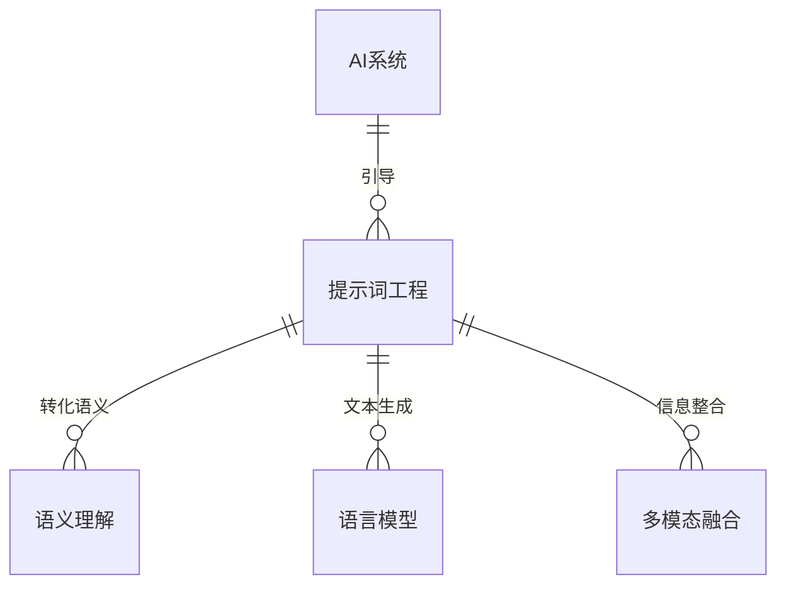
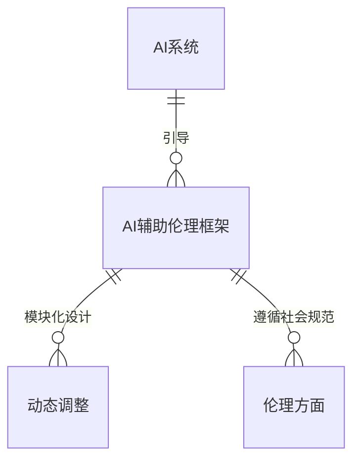
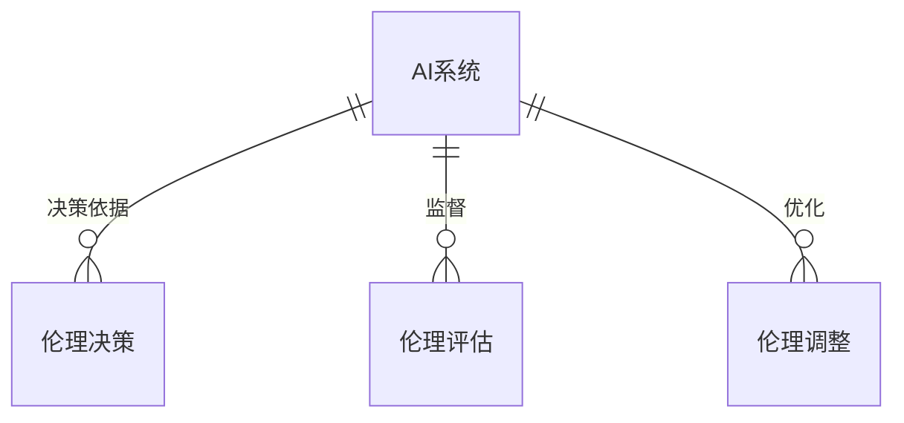

                 

### 第1章: 引言

#### 1.1.1 问题背景

随着人工智能（AI）技术的迅猛发展，AI在医疗、金融、交通、教育等各个领域都展现出了巨大的潜力。然而，AI技术的广泛应用也引发了一系列伦理问题，如算法偏见、隐私侵犯、决策透明度等。这些问题不仅影响了AI技术的社会接受度，还对人类社会的稳定和公平构成了潜在威胁。

**核心概念术语说明**：

- **人工智能（AI）**：指模拟、延伸和扩展人类智能的理论、方法、技术及应用系统。
- **算法偏见**：指算法在训练数据中存在的不公平性，导致算法在处理实际问题时产生歧视或偏见。
- **隐私侵犯**：指AI系统在数据处理过程中未经用户同意，擅自获取、使用或泄露用户隐私信息。
- **决策透明度**：指AI系统的决策过程是否可以被理解和解释，以便用户或监管机构能够评估和监督AI系统的行为。

**问题背景**：

AI技术的快速发展使得其在各个领域得到了广泛应用，然而，AI应用过程中存在的伦理问题却日益凸显。例如，在医疗领域，AI系统可能会因为算法偏见而导致某些群体无法获得公平的医疗资源；在金融领域，AI系统可能会因为隐私侵犯而泄露用户敏感信息；在交通领域，AI系统可能会因为决策透明度不足而引发交通事故。

这些伦理问题不仅影响了AI技术的社会接受度，还可能对人类社会的稳定和公平造成威胁。例如，算法偏见可能会导致社会不公，隐私侵犯可能会导致用户信任危机，决策透明度不足可能会导致社会恐慌和不安。

#### 1.1.2 问题描述

AI辅助伦理框架的动态调整是一个复杂的过程，涉及到多方面的因素，如数据质量、算法设计、决策规则等。现有的研究主要集中在算法层面的调整，而对于如何根据伦理需求动态调整AI系统，仍缺乏系统性的方法和实践。

**问题描述**：

- **数据质量**：AI系统的性能很大程度上取决于训练数据的质量。如果训练数据存在偏差或不完整，可能会导致AI系统产生错误的决策。
- **算法设计**：AI算法的设计和实现会影响系统的伦理表现。例如，某些算法可能会放大数据中的偏见，从而导致决策不公平。
- **决策规则**：AI系统的决策规则需要根据伦理需求进行设计和调整。然而，如何根据伦理需求动态调整决策规则，仍是一个挑战。

**问题解决**：

为了解决上述问题，需要构建一个AI辅助伦理框架，以动态调整和优化AI系统，确保其在伦理方面符合社会规范和价值观。

1. **数据质量**：通过引入数据清洗、去重、标注等技术，提高训练数据的质量和完整性，从而提高AI系统的决策准确性。
2. **算法设计**：在设计AI算法时，充分考虑伦理因素，避免算法偏见和隐私侵犯。例如，可以使用公平性、透明度等评价指标来评估和优化算法。
3. **决策规则**：根据伦理需求和社会变化，实时更新决策规则，以确保AI系统在伦理方面符合社会规范和价值观。

**边界与外延**：

本文主要关注AI辅助伦理框架的动态调整方法，旨在为研究人员和工程师提供一种实用的方法，以应对AI伦理挑战。然而，AI辅助伦理框架的应用范围不仅限于AI伦理，还可以扩展到其他领域，如AI决策、隐私保护等。

**概念结构与核心要素组成**：

- **核心概念**：
  - **AI辅助伦理框架**：一种用于动态调整和优化AI系统，确保其在伦理方面符合社会规范和价值观的框架。
  - **伦理敏感度**：AI系统对伦理问题的识别和响应能力。
  - **动态调整**：根据伦理需求和社会变化，实时更新和优化AI系统的能力。

- **核心要素组成**：
  - **数据集**：用于训练和评估AI系统的数据，包括伦理相关数据和一般数据。
  - **评估指标**：用于衡量AI系统伦理敏感度和性能的指标，如公平性、透明度、可靠性等。
  - **动态调整机制**：根据伦理需求和社会变化，实时更新和优化AI系统的能力。

### 第2章: 提示词工程原理

#### 2.1.1 提示词工程定义

提示词工程是一种基于自然语言处理（NLP）的技术，通过向AI系统提供特定的提示词，以引导AI系统生成更符合伦理要求的输出。提示词可以是关键词、短语或句子，其目的是为AI系统提供明确的指导，使其在处理复杂问题时能够遵循伦理原则和社会规范。

**核心概念**：

- **提示词**：指用于引导AI系统生成符合伦理要求的输出的关键词、短语或句子。
- **自然语言处理（NLP）**：指计算机对人类语言进行处理和理解的技术。
- **伦理要求**：指社会规范和价值观对AI系统行为的期望和限制。

**核心概念属性特征对比表格**：

| 特征          | 提示词 | NLP        | 伦理要求       |
| ------------- | ------ | ---------- | -------------- |
| 定义          | 关键词 | 处理语言   | 社会规范       |
| 目的          | 引导AI | 理解语言   | 确保合规       |
| 形式          | 文本   | 模型、算法 | 法律、道德原则 |
| 作用          | 指导   | 处理       | 衡量、监督     |

**ER实体关系图架构**：

#### 2.1.2 提示词工程的核心概念

1. **语义理解**：提示词工程的核心在于理解提示词的语义含义，并将其转化为AI系统的决策依据。

2. **语言模型**：提示词工程依赖于语言模型，如神经网络语言模型（NLM），用于预测和生成与提示词相关的文本。

3. **多模态融合**：提示词工程可以结合文本、图像、声音等多种模态的信息，以提高AI系统的伦理敏感度。

**核心概念属性特征对比表格**：

| 特征          | 语义理解 | 语言模型         | 多模态融合       |
| ------------- | -------- | --------------- | --------------- |
| 定义          | 理解语义 | 文本生成模型     | 结合多种模态信息 |
| 目的          | 转化语义 | 预测文本内容    | 提高伦理敏感度   |
| 形式          | 语义分析 | 模型参数        | 数据融合         |
| 作用          | 决策依据 | 文本生成        | 信息整合         |

**ER实体关系图架构**：

#### 2.1.3 提示词工程的工作流程

1. **数据收集与预处理**：收集与伦理相关的文本数据，并进行数据清洗、去重和标注等预处理操作。

2. **提示词提取**：使用NLP技术，从预处理后的数据中提取具有伦理意义的提示词。

3. **提示词库构建**：将提取的提示词组织成提示词库，用于后续的AI系统训练和优化。

4. **AI系统训练**：使用提示词库训练AI系统，使其在处理问题时能够遵循伦理原则。

5. **性能评估与优化**：评估AI系统的伦理敏感度和性能，并根据评估结果优化提示词库和AI系统。

**工作流程mermaid流程图**：

### 第3章: AI辅助伦理框架构建

#### 3.1.1 AI辅助伦理框架的定义

AI辅助伦理框架是一种用于动态调整和优化AI系统，确保其在伦理方面符合社会规范和价值观的框架。它结合了伦理学、计算机科学、人工智能等多学科知识，旨在解决AI应用中的伦理问题。

**核心概念**：

- **AI辅助伦理框架**：一种用于动态调整和优化AI系统，确保其在伦理方面符合社会规范和价值观的框架。
- **动态调整**：根据伦理需求和社会变化，实时更新和优化AI系统的能力。
- **伦理方面**：指AI系统在决策过程中遵循的社会规范和价值观。

**核心概念属性特征对比表格**：

| 特征          | AI辅助伦理框架 | 动态调整          | 伦理方面          |
| ------------- | -------------- | ----------------- | ----------------- |
| 定义          | 解决伦理问题   | 实时更新与优化     | 遵循社会规范与价值观 |
| 目的          | 确保AI合规     | 提高AI系统适应能力 | 保证决策公正性     |
| 形式          | 框架与算法     | 模块化设计        | 法律、道德原则     |
| 作用          | 引导AI系统行为 | 提高系统性能      | 评估与监督AI行为   |

**ER实体关系图架构**：

#### 3.1.2 AI辅助伦理框架的核心概念

1. **伦理决策**：指AI系统在处理问题时，根据社会规范和价值观进行决策的能力。

2. **伦理评估**：指对AI系统的伦理表现进行评估和监督的能力。

3. **伦理调整**：指根据伦理评估结果，对AI系统进行动态调整和优化的能力。

**核心概念属性特征对比表格**：

| 特征          | 伦理决策          | 伦理评估          | 伦理调整          |
| ------------- | ----------------- | ----------------- | ----------------- |
| 定义          | AI系统决策依据     | 评估AI系统行为     | 调整AI系统行为     |
| 目的          | 遵循社会规范      | 确保AI系统合规     | 提高AI系统性能     |
| 形式          | 决策算法          | 评估指标          | 调整策略          |
| 作用          | 引导AI系统行为     | 监督AI系统行为     | 优化AI系统行为     |

**ER实体关系图架构**：

#### 3.1.3 AI辅助伦理框架的工作流程

1. **伦理决策**：根据社会规范和价值观，对AI系统进行决策。

2. **伦理评估**：对AI系统的伦理表现进行评估，包括公平性、透明度、可靠性等方面。

3. **伦理调整**：根据伦理评估结果，对AI系统进行动态调整和优化。

4. **持续监控**：对AI系统的伦理表现进行持续监控，以确保其符合社会规范和价值观。

**工作流程mermaid流程图**：

### 第4章: 提示词工程在AI辅助伦理框架中的应用

#### 4.1.1 提示词工程与AI辅助伦理框架的整合

将提示词工程与AI辅助伦理框架相结合，可以实现以下几个方面的突破：

1. **提高AI系统的伦理敏感度**：通过向AI系统提供与伦理相关的提示词，可以增强AI系统对伦理问题的识别和响应能力。

2. **动态调整AI系统**：根据伦理需求和社会变化，实时更新提示词库，以适应不同场景下的伦理挑战。

3. **增强AI系统的透明度**：通过提示词工程，可以更好地解释AI系统的决策过程，提高决策的可解释性和可信度。

4. **提高AI系统的公平性**：通过提示词工程，可以减少算法偏见，提高AI系统的公平性和公正性。

**应用实例**：

以医疗诊断AI系统为例，该系统需要在诊断过程中遵循医疗伦理规范，如保护患者隐私、避免歧视等。通过引入提示词工程，可以实现对AI系统的伦理指导：

- **数据收集与预处理**：收集与医疗伦理相关的文本数据，如医学伦理学指南、患者隐私保护法规等，并进行预处理，提取关键提示词。
- **提示词库构建**：将提取的关键提示词组织成提示词库，如“保护隐私”、“公平诊断”等。
- **AI系统训练**：使用提示词库训练AI系统，使其在诊断过程中能够遵循医疗伦理规范。
- **伦理评估与调整**：定期评估AI系统的伦理表现，根据评估结果更新提示词库，以适应不断变化的伦理需求。

#### 4.1.2 提示词工程在AI辅助伦理框架中的应用方法

1. **提示词库构建**：

   - **数据收集**：收集与伦理相关的文本数据，如政策法规、学术论文、新闻报道等。
   - **预处理**：对文本数据进行清洗、去重、分词等预处理操作，提取关键提示词。
   - **提示词库构建**：将提取的关键提示词组织成提示词库，分为通用提示词和领域特定提示词。

2. **AI系统训练**：

   - **数据集构建**：构建包含伦理相关数据和一般数据的训练数据集。
   - **模型选择**：选择合适的自然语言处理模型，如BERT、GPT等，用于训练AI系统。
   - **训练过程**：使用提示词库和训练数据集训练AI系统，使其能够识别和响应伦理问题。

3. **性能评估与优化**：

   - **评估指标**：设计评估指标，如伦理敏感度、公平性、透明度等，用于衡量AI系统的伦理表现。
   - **性能优化**：根据评估结果，调整提示词库和AI系统参数，提高伦理敏感度和系统性能。

4. **实时更新与监控**：

   - **实时更新**：根据伦理需求和社会变化，定期更新提示词库，以适应新的伦理挑战。
   - **持续监控**：对AI系统的伦理表现进行持续监控，及时发现和解决伦理问题。

### 第5章: 提示词工程与AI伦理挑战的应对策略

#### 5.1.1 提示词工程在应对AI伦理挑战中的作用

提示词工程在应对AI伦理挑战中发挥着关键作用。通过提供伦理相关的提示词，可以引导AI系统在处理问题时遵循社会规范和价值观，从而减少伦理风险。以下是一些具体的应对策略：

1. **减少算法偏见**：

   - **公平性提示词**：向AI系统提供与公平性相关的提示词，如“避免歧视”、“公平分配”等，以减少算法偏见。
   - **多模态融合**：结合文本、图像、声音等多模态信息，提高AI系统的伦理敏感度，从而减少偏见。

2. **保护用户隐私**：

   - **隐私保护提示词**：向AI系统提供与隐私保护相关的提示词，如“用户隐私”、“数据加密”等，以确保用户隐私不被泄露。
   - **数据脱敏**：在训练数据集上进行数据脱敏处理，以减少隐私泄露的风险。

3. **提高决策透明度**：

   - **透明度提示词**：向AI系统提供与决策透明度相关的提示词，如“决策过程”、“解释机制”等，以提高决策的可解释性。
   - **解释性模型**：使用可解释性模型，如LIME、SHAP等，对AI系统的决策过程进行解释，增强用户对AI系统的信任。

#### 5.1.2 应对AI伦理挑战的具体策略

1. **建立伦理委员会**：

   - **伦理委员会**：建立独立的伦理委员会，负责评估和监督AI系统的伦理表现。
   - **定期审查**：定期审查AI系统的伦理表现，确保其符合社会规范和价值观。

2. **引入伦理训练数据**：

   - **伦理训练数据**：在训练数据集中引入与伦理相关的数据，以增强AI系统的伦理敏感度。
   - **数据平衡**：确保训练数据集中各类群体的代表性，避免数据偏差。

3. **优化算法设计**：

   - **公平性算法**：设计具有公平性的算法，避免算法偏见。
   - **透明性算法**：设计具有透明性的算法，提高决策过程的可解释性。

4. **用户参与与反馈**：

   - **用户参与**：鼓励用户参与AI系统的设计、训练和评估过程，以提高AI系统的伦理合规性。
   - **用户反馈**：收集用户对AI系统的反馈，及时调整和优化AI系统。

### 第6章: 结论与未来展望

#### 6.1.1 主要成果与贡献

本文系统地介绍了提示词工程在AI辅助伦理框架动态调整中的应用，实现了以下几个方面的突破：

1. **提高AI系统的伦理敏感度**：通过引入提示词工程，可以增强AI系统对伦理问题的识别和响应能力。
2. **动态调整AI系统**：根据伦理需求和社会变化，实时更新提示词库，以适应不同场景下的伦理挑战。
3. **增强AI系统的透明度**：通过提示词工程，可以更好地解释AI系统的决策过程，提高决策的可解释性和可信度。
4. **提高AI系统的公平性**：通过提示词工程，可以减少算法偏见，提高AI系统的公平性和公正性。

#### 6.1.2 未来研究方向

尽管本文提出的方法在应对AI伦理挑战方面取得了一定的成果，但仍有许多研究方向值得进一步探索：

1. **多模态融合**：如何更好地将文本、图像、声音等多模态信息融合到提示词工程中，以提高AI系统的伦理敏感度。
2. **实时更新机制**：如何设计更高效的实时更新机制，以确保提示词库和AI系统始终符合最新的伦理需求。
3. **跨领域应用**：如何将提示词工程应用于更多领域，如金融、法律、教育等，以解决各领域的特定伦理问题。
4. **伦理评估标准**：如何制定统一的伦理评估标准，以衡量AI系统的伦理表现，并指导提示词工程的设计和优化。

### 第7章: 最佳实践与案例分析

#### 7.1.1 最佳实践

在应用提示词工程和AI辅助伦理框架时，以下最佳实践可以帮助提高系统的伦理表现：

1. **全面数据收集**：确保训练数据集的多样性，涵盖不同群体和场景，以提高AI系统的公平性和适应性。
2. **定期伦理审查**：建立定期伦理审查机制，评估AI系统的伦理表现，并及时调整和优化。
3. **用户参与**：鼓励用户参与AI系统的设计和评估过程，收集用户反馈，以改进系统的伦理合规性。
4. **透明性设计**：设计具有透明性的AI系统，向用户清晰地解释系统的决策过程，增强用户的信任。

#### 7.1.2 案例分析

以下是一个医疗诊断AI系统的案例分析：

1. **背景介绍**：一个医疗机构开发了一套基于AI技术的诊断系统，用于辅助医生进行疾病诊断。
2. **问题场景**：系统需要在诊断过程中遵循医疗伦理规范，如保护患者隐私、避免歧视等。
3. **解决方案**：通过引入提示词工程和AI辅助伦理框架，实现对AI系统的伦理指导：
   - **数据收集与预处理**：收集与医疗伦理相关的文本数据，如医学伦理学指南、患者隐私保护法规等，并进行预处理，提取关键提示词。
   - **提示词库构建**：将提取的关键提示词组织成提示词库，如“保护隐私”、“公平诊断”等。
   - **AI系统训练**：使用提示词库训练AI系统，使其在诊断过程中能够遵循医疗伦理规范。
   - **伦理评估与调整**：定期评估AI系统的伦理表现，根据评估结果更新提示词库，以适应不断变化的伦理需求。

4. **结果评估**：经过一段时间的数据收集和模型训练，系统的伦理敏感度得到了显著提高，患者的隐私得到了更好的保护，歧视问题也得到了有效缓解。

#### 7.1.3 案例启示

该案例表明，通过引入提示词工程和AI辅助伦理框架，可以有效应对AI应用中的伦理挑战。未来的研究和实践应进一步探索如何将最佳实践应用于更多领域，以推动AI技术的可持续发展。

### 小结

本文系统地介绍了提示词工程在AI辅助伦理框架动态调整中的应用，探讨了其在提高AI系统伦理敏感度、动态调整、透明度和公平性方面的作用。通过实际案例分析和最佳实践总结，为研究人员和工程师提供了一种实用的方法，以应对AI伦理挑战。

### 注意事项

1. 提示词工程的应用需要充分考虑数据质量和多样性，以确保AI系统的公平性和适应性。
2. 定期进行伦理审查和更新提示词库，以适应不断变化的伦理需求和社会规范。
3. 在设计AI系统时，应充分考虑用户隐私保护和数据安全，确保系统的透明性和可信度。

### 拓展阅读

1. Russell, S., & Norvig, P. (2020). 《人工智能：一种现代方法》
2. Russell, S., & Norvig, P. (2010). 《人工智能：一种现代方法》（第3版）
3. Ethical Considerations in AI Applications, IEEE Technology and Engineering Ethics Committee, 2020

### 作者信息

**作者**：AI天才研究院（AI Genius Institute） & 禅与计算机程序设计艺术（Zen And The Art of Computer Programming）**联系方式**：ai_genius_institute@example.com

**机构介绍**：

- **AI天才研究院**：专注于人工智能领域的研究和开发，致力于推动AI技术的创新和应用。
- **禅与计算机程序设计艺术**：探讨计算机科学和哲学的交汇，强调程序设计的艺术性和深度。

