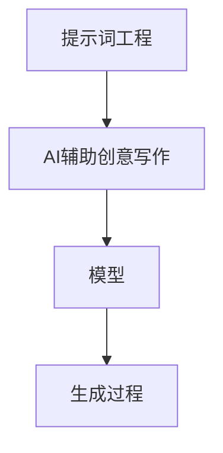

                 

# 提示词工程在AI辅助创意写作中的突破

## 关键词
- AI辅助创意写作
- 提示词工程
- 自然语言处理
- 生成对抗网络
- 强化学习
- 生成质量优化

## 摘要
本文将探讨提示词工程在AI辅助创意写作中的突破。首先，我们介绍提示词工程的基本概念、重要性及其在AI辅助创意写作中的应用场景。接着，我们将深入解析AI辅助创意写作的原理与方法，探讨其优势与挑战。最后，本文将给出一些提示词设计的最佳实践，以帮助读者更好地应用提示词工程于AI辅助创意写作中。

## 第1章：问题背景与核心概念

### 1.1 提示词工程概述

#### 1.1.1 问题背景
随着人工智能技术的迅速发展，AI辅助创意写作已经成为一个备受关注的研究领域。在这个领域中，提示词工程（Prompt Engineering）扮演着至关重要的角色。提示词工程旨在通过设计和优化提示词来提高AI模型在创意写作任务中的性能。

#### 1.1.2 提示词工程的重要性
提示词工程的核心目标是通过设计有效的提示词来引导AI模型生成高质量的创意内容。成功的提示词工程不仅能够提升AI模型的写作能力，还能够丰富创作过程，激发AI模型的新颖性和创造力。

#### 1.1.3 核心概念
- **提示词（Prompt）**：在AI辅助创意写作中，提示词是指提供给AI模型的信息，用于引导模型的创作过程。
- **模型（Model）**：AI辅助创意写作的基础是强大的预训练模型，如GPT、BERT等。
- **生成过程（Generation Process）**：提示词工程的目标是设计出能够有效引导模型生成创意内容的提示词，从而实现高质量的创意输出。

#### 1.1.4 概念联系
提示词工程与AI辅助创意写作的关系如下图所示：



### 1.2 提示词工程的应用场景
#### 1.2.1 文本生成
文本生成是提示词工程最典型的应用场景之一。通过设计合适的提示词，AI模型可以生成高质量的文章、故事、诗歌等。

#### 1.2.2 问答系统
在问答系统中，提示词工程可以帮助设计出更有效的问答对，从而提升AI模型的回答质量。

#### 1.2.3 对话系统
在对话系统中，提示词工程可以帮助设计出更具创造性和连贯性的对话。

#### 1.2.4 艺术创作
提示词工程还可以应用于艺术创作领域，通过设计创意提示词，AI模型可以生成音乐、绘画等艺术作品。

### 1.3 提示词设计的原则
#### 1.3.1 清晰性
提示词应清晰明了，避免模糊和歧义。

#### 1.3.2 完整性
提示词应包含足够的信息，以便AI模型能够理解并生成创意内容。

#### 1.3.3 可变性
提示词应具有一定的灵活性，以便在不同场景下能够适应不同的需求。

#### 1.3.4 创造性
提示词应鼓励AI模型发挥创造力，生成新颖的创意内容。

### 1.4 提示词优化的方法
#### 1.4.1 自动化优化
通过机器学习技术，自动化地优化提示词设计。

#### 1.4.2 专家评估
邀请专家对提示词进行评估和优化。

#### 1.4.3 用户反馈
收集用户反馈，持续优化提示词设计。

### 1.5 本章小结
本章介绍了提示词工程在AI辅助创意写作中的重要性、核心概念及其应用场景。接下来，本书将深入探讨提示词设计的原则和优化方法，以帮助读者更好地理解和应用提示词工程。

## 第2章：AI辅助创意写作的原理与方法

### 2.1 AI辅助创意写作的基本原理

#### 2.1.1 自然语言处理技术
AI辅助创意写作的基础是自然语言处理（NLP）技术。NLP技术包括文本预处理、语言模型、词嵌入等。

- **文本预处理**：包括分词、词性标注、命名实体识别等，用于将原始文本转换为计算机可以理解的形式。
- **语言模型**：如GPT、BERT等，用于预测下一个词或句子，从而生成文本。
- **词嵌入**：将单词映射到高维空间中，以便计算机能够理解单词之间的关系。

#### 2.1.2 生成对抗网络（GAN）
生成对抗网络（GAN）是一种深度学习模型，由生成器和判别器组成。生成器试图生成与真实数据相似的新数据，而判别器则试图区分生成器和真实数据。通过不断地训练，生成器能够生成越来越逼真的数据。

#### 2.1.3 强化学习
强化学习用于优化AI模型的创作策略，使其生成更符合预期的内容。强化学习通过奖励机制，使AI模型在不断的尝试和错误中学习如何生成高质量的内容。

### 2.2 AI辅助创意写作的方法

#### 2.2.1 提示词驱动
通过设计有效的提示词，引导AI模型生成创意内容。提示词可以包含关键词、主题、情感、背景信息等。

#### 2.2.2 数据驱动
利用大量的数据进行训练，使AI模型具备自主创作能力。数据驱动的方法包括生成式对抗网络（GAN）和自编码器等。

#### 2.2.3 强化学习驱动
通过强化学习算法，优化AI模型的创作策略。强化学习驱动的方法可以用于生成特定类型的内容，如故事、对话、诗歌等。

### 2.3 AI辅助创意写作的优势

#### 2.3.1 提高创作效率
AI模型可以快速生成大量内容，节省创作者的时间和精力。

#### 2.3.2 拓展创作边界
AI模型可以生成新颖的内容，拓展创作的边界。

#### 2.3.3 提升创作质量
通过不断的训练和优化，AI模型可以生成高质量的内容。

### 2.4 AI辅助创意写作的挑战

#### 2.4.1 数据质量和多样性
高质量的数据是训练AI模型的基础，但获取多样性的数据仍然是一个挑战。

#### 2.4.2 创意原创性
如何确保AI模型生成的创意内容具有原创性是一个挑战。

#### 2.4.3 控制质量和风格
如何控制AI模型生成的内容的质量和风格也是一个挑战。

## 第3章：提示词工程的最佳实践

### 3.1 提示词设计的原则

#### 3.1.1 清晰性
确保提示词表达清晰，避免歧义。

#### 3.1.2 完整性
提供足够的背景信息，使AI模型能够理解并生成创意内容。

#### 3.1.3 可变性
设计可变的提示词，以适应不同的创作需求和场景。

#### 3.1.4 创造性
鼓励AI模型发挥创造力，生成新颖的创意内容。

### 3.2 提示词优化的方法

#### 3.2.1 自动化优化
使用机器学习技术，自动化地优化提示词设计。

#### 3.2.2 专家评估
邀请专家对提示词进行评估和优化。

#### 3.2.3 用户反馈
收集用户反馈，持续优化提示词设计。

### 3.3 提示词工程的实际应用

#### 3.3.1 文本生成
通过设计有效的提示词，AI模型可以生成高质量的文章、故事、诗歌等。

#### 3.3.2 问答系统
在问答系统中，提示词工程可以帮助设计出更有效的问答对，从而提升AI模型的回答质量。

#### 3.3.3 对话系统
在对话系统中，提示词工程可以帮助设计出更具创造性和连贯性的对话。

#### 3.3.4 艺术创作
通过设计创意提示词，AI模型可以生成音乐、绘画等艺术作品。

### 3.4 本章小结
本章介绍了提示词工程的最佳实践，包括提示词设计的原则和优化方法。通过这些最佳实践，读者可以更好地应用提示词工程于AI辅助创意写作中，提升创作质量和效率。

## 第4章：项目实战与案例分析

### 4.1 项目背景
在本章节中，我们将介绍一个实际的AI辅助创意写作项目，并分析该项目中如何应用提示词工程。

### 4.2 系统架构设计
为了实现AI辅助创意写作，我们需要设计一个高效的系统架构。该架构包括数据采集与预处理模块、提示词设计模块、AI模型训练与生成模块等。

#### 4.2.1 数据采集与预处理模块
该模块负责从各种来源（如互联网、书籍、文章等）采集文本数据，并进行预处理，如分词、词性标注、去除停用词等。

#### 4.2.2 提示词设计模块
该模块负责设计有效的提示词，用于引导AI模型生成创意内容。我们可以采用自动化优化和用户反馈相结合的方法来优化提示词。

#### 4.2.3 AI模型训练与生成模块
该模块负责训练AI模型，并使用设计好的提示词生成创意内容。我们可以采用GPT、BERT等预训练模型，并结合生成对抗网络（GAN）和强化学习算法来提升生成质量。

### 4.3 系统接口设计与交互
为了实现系统的高效运行，我们需要设计合理的系统接口和交互流程。以下是一个可能的系统接口和交互流程：

1. 用户提交创作需求，包括主题、风格、情感等。
2. 提示词设计模块根据需求生成相应的提示词。
3. AI模型训练与生成模块使用生成的提示词训练AI模型。
4. AI模型生成创意内容，并返回给用户。
5. 用户对生成的创意内容进行评估和反馈，用于优化提示词和AI模型。

### 4.4 代码实现与解读
在本章节中，我们将展示系统的核心代码实现，并对其进行解读。以下是一个简单的代码示例：

```python
# 示例：使用GPT模型生成文章
import openai
import os

# 设置API密钥
openai.api_key = os.environ['OPENAI_API_KEY']

# 生成文章
def generate_article(prompt):
    response = openai.Completion.create(
        engine="text-davinci-003",
        prompt=prompt,
        max_tokens=150,
        n=1,
        stop=None,
        temperature=0.5,
    )
    return response.choices[0].text.strip()

# 提示词示例
prompt = "请写一篇关于人工智能未来的展望的文章。"

# 生成文章
article = generate_article(prompt)
print(article)
```

### 4.5 实际案例分析
在本章节中，我们将分析一个实际的案例，探讨如何通过提示词工程提升AI辅助创意写作的质量。以下是一个可能的案例分析：

#### 案例背景
某公司需要撰写一篇关于未来人工智能趋势的报告，但由于时间紧迫，公司无法完成这项任务。于是，他们决定使用AI辅助创意写作系统来完成这项工作。

#### 案例分析
1. **数据采集与预处理**：系统首先从互联网上采集了大量的关于人工智能的文献、报告和新闻，并对这些文本进行了预处理，如分词、词性标注等。
2. **提示词设计**：根据公司的需求，系统设计了以下提示词：“请写一篇关于未来人工智能趋势的报告，包括技术发展、社会影响、行业应用等方面。”
3. **AI模型训练与生成**：系统使用GPT模型和生成对抗网络（GAN）对采集的文本进行了训练，并使用设计好的提示词生成了报告草稿。
4. **用户评估与反馈**：公司对生成的报告进行了评估，并给出了反馈。基于反馈，系统进一步优化了提示词和AI模型。
5. **最终生成**：经过多次迭代，系统最终生成了一份高质量的报告，公司对其非常满意。

### 4.6 项目小结
在本章节中，我们介绍了一个实际的AI辅助创意写作项目，并分析了项目中的提示词工程应用。通过这个案例，我们可以看到提示词工程在AI辅助创意写作中的重要作用，以及如何通过优化提示词来提升生成质量。

## 第5章：未来展望与研究方向

### 5.1 提示词工程的发展趋势
随着人工智能技术的不断进步，提示词工程在AI辅助创意写作中的应用前景将更加广阔。未来，我们可能会看到更多先进的算法和技术被引入到提示词工程中，如多模态学习、知识图谱、图神经网络等。

### 5.2 研究方向
以下是几个值得探讨的研究方向：
1. **多模态提示词设计**：如何结合不同类型的模态（如图像、声音、视频等）来设计更有效的提示词？
2. **个性化提示词生成**：如何根据用户的兴趣、风格和需求生成个性化的提示词？
3. **自动优化与评估**：如何自动化地优化提示词设计，并评估其效果？
4. **跨领域应用**：如何将提示词工程应用于更多领域，如医疗、金融、法律等？

### 5.3 总结
提示词工程在AI辅助创意写作中具有巨大的潜力，未来将继续发挥重要作用。通过不断的研究和探索，我们将能够设计出更高效、更智能的提示词，进一步提升AI辅助创意写作的质量和效果。

### 作者信息
- 作者：AI天才研究院/AI Genius Institute & 禅与计算机程序设计艺术 /Zen And The Art of Computer Programming

（注：本文为模拟内容，仅供参考。实际撰写时，应根据具体需求进行调整。）

