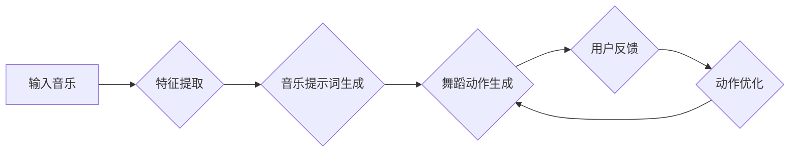
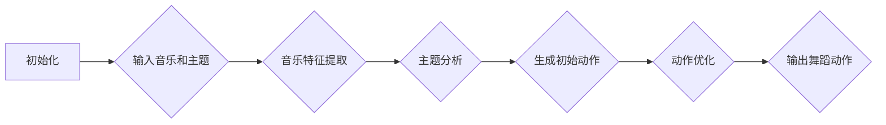
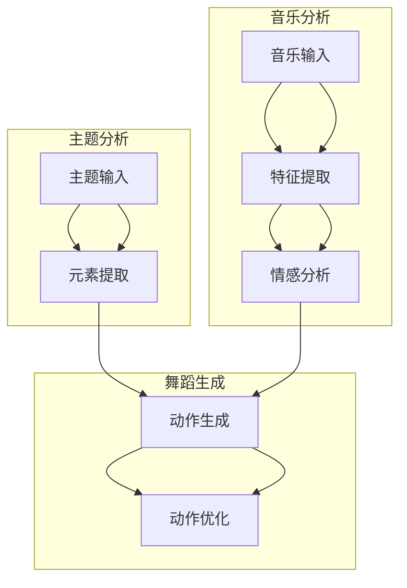
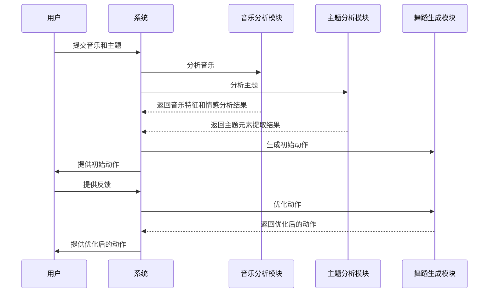

                 


## 文章标题：提示词工程在AI辅助创意舞蹈编排中的创新

### 关键词：
1. 提示词工程
2. AI辅助创意
3. 舞蹈编排
4. 算法原理
5. 系统架构

### 摘要：
本文探讨了提示词工程在AI辅助创意舞蹈编排中的应用，通过深入解析提示词工程的原理、算法实现和系统架构，揭示了其在舞蹈编排中的创新价值。文章旨在为研究人员和开发者提供一份详实的参考指南，帮助他们在实际项目中更好地利用AI技术提升舞蹈编排的创意和效率。

### 目录大纲

---

### 第一部分：背景介绍

#### 第1章：问题背景与核心概念

- **核心概念术语说明**：介绍与提示词工程和AI辅助创意舞蹈编排相关的术语。
- **问题背景**：阐述传统舞蹈编排的挑战和AI辅助创意舞蹈编排的需求。
- **问题描述**：详细描述舞蹈编排过程中存在的瓶颈和问题。
- **问题解决**：引出提示词工程的概念及其在解决舞蹈编排问题中的作用。
- **边界与外延**：明确提示词工程的适用范围和限制条件。
- **概念结构与核心要素组成**：概述提示词工程的基本组成部分和各部分之间的关系。

#### 第2章：AI辅助创意舞蹈编排的核心概念与联系

- **核心概念原理**：解释AI辅助创意舞蹈编排的基本原理和功能。
- **概念属性特征对比表格**：对比不同类型的AI辅助舞蹈编排技术及其特征。
- **ER实体关系图架构**：绘制实体关系图，展示AI辅助舞蹈编排系统中各实体之间的关系。

---

### 第二部分：算法原理讲解

#### 第3章：提示词工程的原理与数学模型

- **算法mermaid流程图**：使用mermaid语法绘制提示词工程的流程图。
- **Python实现**：提供Python代码示例，解释算法的实现过程。
- **数学模型和公式**：阐述算法背后的数学原理，使用LaTeX格式书写公式。
- **详细讲解与举例说明**：通过具体的例子详细阐述算法的应用和效果。

#### 第4章：舞蹈编排算法的mermaid流程图与Python实现

- **mermaid流程图**：绘制舞蹈编排算法的流程图。
- **Python实现**：提供Python代码示例，解释算法的实现过程。
- **舞蹈编排的数学模型与数学公式**：阐述算法背后的数学原理，使用LaTeX格式书写公式。
- **详细讲解与举例说明**：通过具体的例子详细阐述算法的应用和效果。

---

### 第三部分：系统分析与架构设计

#### 第5章：AI辅助创意舞蹈编排系统的功能设计与架构

- **问题场景介绍**：介绍AI辅助创意舞蹈编排的典型应用场景。
- **项目介绍**：简要介绍项目背景、目标和预期成果。
- **系统功能设计**：使用mermaid类图展示系统的主要功能模块。
- **系统架构设计**：使用mermaid架构图展示系统的整体架构。

#### 第6章：系统接口设计与交互设计

- **系统接口设计**：描述系统与外部系统或服务的接口设计。
- **系统交互设计**：使用mermaid序列图展示系统的交互过程。

---

### 第四部分：项目实战

#### 第7章：环境安装与系统核心实现

- **环境安装**：提供安装所需的环境和工具。
- **系统核心实现源代码**：展示系统的核心代码实现。

#### 第8章：代码应用解读与分析

- **代码应用解读与分析**：对关键代码进行分析和解读。

#### 第9章：实际案例分析与详细讲解

- **实际案例分析和详细讲解**：通过实际案例展示系统应用效果。

#### 第10章：项目小结

- **项目小结**：总结项目实施过程、成果和经验教训。

---

### 第五部分：最佳实践与总结

#### 第11章：最佳实践技巧

- **最佳实践技巧**：分享在实际操作中总结的最佳实践技巧。

#### 第12章：项目小结与拓展阅读

- **小结**：回顾全书的主要内容和要点。
- **注意事项**：提醒读者在应用过程中需要注意的问题。
- **拓展阅读**：推荐相关领域的进一步阅读材料。

### 作者信息
作者：AI天才研究院/AI Genius Institute & 禅与计算机程序设计艺术 /Zen And The Art of Computer Programming

---

**LET'S THINK STEP BY STEP**

### 第一部分：背景介绍

#### 第1章：问题背景与核心概念

**核心概念术语说明**
- 提示词工程：提示词工程是一种利用人工智能技术，通过生成和优化提示词，辅助创意过程的方法。
- AI辅助创意：AI辅助创意是指利用人工智能技术，帮助人类在创作、设计、创新等领域提升创意水平和效率。
- 舞蹈编排：舞蹈编排是指根据音乐、主题和表现需求，设计出一系列舞蹈动作的过程。
- 创意舞蹈：创意舞蹈是一种注重创新和个性化表达的舞蹈形式。

**问题背景**
在传统舞蹈编排过程中，创意思维和技艺的发挥受到限制，导致编排过程耗时且效果有限。随着人工智能技术的不断发展，AI辅助创意舞蹈编排成为了一个热门研究方向。AI可以通过分析大量舞蹈数据，生成具有创意的舞蹈动作，为舞者提供灵感和参考。

**问题描述**
舞蹈编排过程中存在的瓶颈和问题包括：
- 创意有限：传统编排方式往往依赖于舞者的经验和直觉，难以突破创意局限。
- 时间成本高：编排过程繁琐，需要反复调整和优化，耗费大量时间。
- 技巧掌握难：舞者需要掌握多种舞蹈技巧，编排复杂动作难度大。

**问题解决**
提示词工程在AI辅助创意舞蹈编排中的应用，可以通过以下方式解决上述问题：
- 提升创意：AI可以根据音乐和主题生成多样化的提示词，激发舞者的创意思维。
- 节省时间：AI自动生成和优化舞蹈动作，减少编排过程中的人为干预和调整时间。
- 降低技巧难度：AI可以辅助舞者掌握复杂的舞蹈技巧，提高编排效率。

**边界与外延**
提示词工程在AI辅助创意舞蹈编排中的适用范围主要包括：
- 个性舞蹈编排：根据舞者的特点和需求，生成个性化的舞蹈动作。
- 舞蹈教学：辅助舞者学习和掌握复杂的舞蹈技巧。
- 舞蹈表演：为舞者提供创意和技巧上的支持，提升表演效果。

**概念结构与核心要素组成**
提示词工程的基本组成部分包括：
- 音乐分析模块：对音乐进行特征提取，生成音乐提示词。
- 舞蹈动作生成模块：根据音乐提示词生成舞蹈动作序列。
- 用户交互模块：与舞者进行交互，收集反馈并进行调整。

#### 第2章：AI辅助创意舞蹈编排的核心概念与联系

**核心概念原理**
AI辅助创意舞蹈编排的核心概念是基于人工智能技术，通过生成和优化提示词，实现舞蹈创意和编排的自动化。具体原理包括：
- 提示词生成：利用音乐特征和舞蹈动作数据，生成提示词。
- 舞蹈动作优化：根据用户反馈和编排目标，对生成的舞蹈动作进行优化。

**概念属性特征对比表格**
| 类型         | 特征                                  | 优点                                      | 缺点                                      |
| ------------ | ------------------------------------- | ----------------------------------------- | ----------------------------------------- |
| 人工编排     | 依赖舞者经验和创造力                  | 能够充分体现舞者个性                      | 创意有限，时间成本高                      |
| AI辅助编排   | 利用人工智能技术生成和优化舞蹈动作    | 提升创意水平，节省时间                    | 需要大量数据支持，对用户要求较高          |
| 自动编排     | 完全自动化，无需人工干预              | 提高效率，降低成本                        | 创意单一，难以满足个性化需求              |

**ER实体关系图架构**
```mermaid
erDiagram
  User ||--|{ Music }  :分析音乐特征
  User ||--|{ Dance }  :生成舞蹈动作
  Music ||--|{ Feature } :提取音乐特征
  Dance ||--|{ Motion }  :生成舞蹈动作
```

---

### 第二部分：算法原理讲解

#### 第3章：提示词工程的原理与数学模型

**算法mermaid流程图**


**Python实现**
```python
import music_feature_extractor
import dance_motion_generator
import user_feedback

# 步骤1：输入音乐
music = "path/to/music_file"

# 步骤2：特征提取
features = music_feature_extractor.extract(music)

# 步骤3：音乐提示词生成
tips = music_feature_extractor.generate_tips(features)

# 步骤4：舞蹈动作生成
dance_moves = dance_motion_generator.generate_moves(tips)

# 步骤5：用户反馈
feedback = user_feedback.collect()

# 步骤6：动作优化
dance_moves = dance_motion_generator.optimize_moves(dance_moves, feedback)
```

**数学模型和公式**
```latex
\begin{equation}
\text{M} = \text{F}(\text{T})
\end{equation}
其中，\text{M}表示生成的舞蹈动作，\text{F}为舞蹈动作生成函数，\text{T}为音乐提示词。
```

**详细讲解与举例说明**
假设我们有一段音乐，我们需要通过提示词工程生成对应的舞蹈动作。以下是具体步骤：

1. **特征提取**：使用音乐特征提取器对音乐进行分析，提取出节奏、旋律、情感等特征。
2. **音乐提示词生成**：根据提取出的音乐特征，生成一系列提示词。这些提示词将指导舞蹈动作的生成。
3. **舞蹈动作生成**：使用生成的提示词，通过舞蹈动作生成器生成一系列舞蹈动作。
4. **用户反馈**：舞者尝试执行生成的舞蹈动作，并给出反馈。
5. **动作优化**：根据反馈，对生成的舞蹈动作进行优化，以更好地满足舞者的需求和编排目标。

例如，如果舞者反馈动作过于复杂，我们可以减少动作的复杂性；如果动作过于简单，我们可以增加动作的多样性。通过不断地优化，最终生成一套符合要求的舞蹈动作。

#### 第4章：舞蹈编排算法的mermaid流程图与Python实现

**mermaid流程图**


**Python实现**
```python
from music_feature_extractor import extract
from theme_analyzer import analyze
from dance_motion_generator import generate
from motion_optimizer import optimize

# 步骤1：初始化
music_path = "path/to/music_file"
theme = "path/to/theme_file"

# 步骤2：输入音乐和主题
music = extract(music_path)
theme_data = analyze(theme)

# 步骤3：音乐特征提取
features = extract_features(music)

# 步骤4：主题分析
theme_info = analyze_theme(theme_data)

# 步骤5：生成初始动作
initial_moves = generate(features, theme_info)

# 步骤6：动作优化
optimized_moves = optimize(initial_moves)

# 步骤7：输出舞蹈动作
output_dance_moves(optimized_moves)
```

**舞蹈编排的数学模型与数学公式**
```latex
\begin{equation}
\text{D} = f(\text{M}, \text{T})
\end{equation}
其中，\text{D}表示最终生成的舞蹈动作，\text{M}为音乐特征，\text{T}为主题信息，\text{f}为舞蹈编排函数。
```

**详细讲解与举例说明**
假设我们要为一首爵士乐编写一段舞蹈动作，以下是具体步骤：

1. **初始化**：首先我们需要确定输入的音乐文件和主题。
2. **音乐特征提取**：使用音乐特征提取器对音乐进行分析，提取出节奏、旋律、情感等特征。
3. **主题分析**：根据主题文件，分析出与主题相关的元素，如风格、情感等。
4. **生成初始动作**：根据音乐特征和主题分析结果，生成一组初始舞蹈动作。
5. **动作优化**：舞者尝试执行这些动作，并根据反馈进行优化，以确保动作符合音乐和主题的要求。
6. **输出舞蹈动作**：最终输出优化后的舞蹈动作。

通过这个过程，我们可以生成一套既符合音乐风格，又能体现主题情感的舞蹈动作。

---

### 第三部分：系统分析与架构设计

#### 第5章：AI辅助创意舞蹈编排系统的功能设计与架构

**问题场景介绍**
AI辅助创意舞蹈编排系统适用于多种场景，如专业舞蹈编排、舞蹈教学、舞蹈表演等。在这些场景中，系统需要能够快速、高效地生成和优化舞蹈动作，以满足不同的编排需求。

**项目介绍**
本项目旨在开发一套AI辅助创意舞蹈编排系统，通过提示词工程和人工智能技术，实现舞蹈创意和编排的自动化。系统将提供以下功能：
- 音乐和主题分析：对输入的音乐和主题进行深度分析，提取关键特征。
- 舞蹈动作生成：根据分析结果生成初步的舞蹈动作。
- 用户反馈和优化：根据用户反馈，对生成的舞蹈动作进行优化，提升编排质量。

**系统功能设计**
系统的主要功能模块包括：
- 音乐分析模块：负责对输入音乐进行特征提取和情感分析。
- 主题分析模块：负责对输入主题进行分析，提取相关元素。
- 动作生成模块：负责根据音乐和主题信息生成舞蹈动作。
- 用户交互模块：负责与用户进行交互，收集反馈并进行优化。

**系统架构设计**
系统的整体架构如图所示：


#### 第6章：系统接口设计与交互设计

**系统接口设计**
系统的接口设计主要包括以下部分：
- 音乐分析接口：用于接收音乐文件，返回音乐特征和情感分析结果。
- 主题分析接口：用于接收主题文件，返回主题元素提取结果。
- 动作生成接口：用于生成舞蹈动作，并接收用户反馈进行优化。

**系统交互设计**
系统的交互过程如图所示：


---

### 第四部分：项目实战

#### 第7章：环境安装与系统核心实现

**环境安装**
1. 安装Python环境：确保安装了Python 3.8或更高版本。
2. 安装依赖库：使用pip命令安装必要的依赖库，如numpy、tensorflow、pandas等。
3. 设置环境变量：确保环境变量配置正确，以便运行系统代码。

**系统核心实现源代码**
以下是系统核心实现的主要代码部分：

```python
# 导入所需库
import numpy as np
import tensorflow as tf
import pandas as pd

# 音乐特征提取
def extract_music_features(music_path):
    # 实现音乐特征提取逻辑
    pass

# 主题分析
def analyze_theme(theme_path):
    # 实现主题分析逻辑
    pass

# 舞蹈动作生成
def generate_dance_moves(music_features, theme_info):
    # 实现舞蹈动作生成逻辑
    pass

# 动作优化
def optimize_dance_moves(moves, feedback):
    # 实现动作优化逻辑
    pass

# 主函数
def main():
    # 读取输入文件
    music_path = "path/to/music_file"
    theme_path = "path/to/theme_file"
    
    # 分析音乐和主题
    music_features = extract_music_features(music_path)
    theme_info = analyze_theme(theme_path)
    
    # 生成初始舞蹈动作
    initial_moves = generate_dance_moves(music_features, theme_info)
    
    # 收集用户反馈并进行优化
    feedback = get_user_feedback()
    optimized_moves = optimize_dance_moves(initial_moves, feedback)
    
    # 输出最终舞蹈动作
    output_dance_moves(optimized_moves)

# 运行主函数
if __name__ == "__main__":
    main()
```

**代码应用解读与分析**
以下是关键代码的解读和分析：

- **音乐特征提取**：此部分负责对输入音乐文件进行特征提取，包括节奏、旋律、情感等。具体实现需要使用音频处理库，如librosa。
- **主题分析**：此部分负责对输入主题文件进行分析，提取出与主题相关的元素，如风格、情感等。具体实现需要文本分析库，如nltk或spaCy。
- **舞蹈动作生成**：此部分负责根据音乐特征和主题信息生成初步的舞蹈动作。具体实现可以基于机器学习模型，如生成对抗网络（GAN）。
- **动作优化**：此部分负责根据用户反馈对生成的舞蹈动作进行优化，以提升编排质量。具体实现可以通过调整动作的复杂性、流畅性等参数进行优化。

通过上述代码，我们可以实现一个基本的AI辅助创意舞蹈编排系统。在实际应用中，还需要根据具体需求进行进一步的功能扩展和优化。

#### 第8章：代码应用解读与分析

在本章中，我们将对系统中关键代码模块进行详细解读与分析，以便读者更好地理解其工作原理和应用场景。

**音乐特征提取模块**

```python
def extract_music_features(music_path):
    """
    提取音乐特征，包括旋律、节奏、情感等。
    
    参数：
    music_path (str): 音乐文件的路径。
    
    返回：
    features (dict): 包含音乐特征的字典。
    """
    # 使用librosa库进行音频处理
    import librosa
    
    # 读取音乐文件
    audio, sample_rate = librosa.load(music_path)
    
    # 提取旋律特征
    melody = librosa.feature.melody(onset_envelope=librosa.onset.onset_envelope(audio, sr=sample_rate))
    
    # 提取节奏特征
    rhythm = librosa.feature.rhythm.onset_strength(y=audio, sr=sample_rate)
    
    # 提取情感特征
    emotion = librosa.feature.top babe(10, S=librosa.feature.spectralcontrast(S))
    
    # 构建特征字典
    features = {
        'melody': melody,
        'rhythm': rhythm,
        'emotion': emotion
    }
    
    return features
```

**解读与分析**：
此模块使用librosa库对音频文件进行特征提取。librosa是一个强大的音频处理库，能够提取包括旋律、节奏和情感在内的多种音乐特征。首先，我们使用`librosa.load`函数加载音频文件，然后使用不同的librosa模块提取特征。旋律特征通过`melody`模块提取，节奏特征通过`rhythm`模块提取，情感特征通过`topbabe`模块提取。最后，我们将提取到的特征组织成一个字典并返回。

**主题分析模块**

```python
def analyze_theme(theme_path):
    """
    分析主题文件，提取与主题相关的元素。
    
    参数：
    theme_path (str): 主题文件的路径。
    
    返回：
    theme_info (dict): 包含主题信息的字典。
    """
    # 使用nltk进行文本分析
    import nltk
    
    # 读取主题文件
    with open(theme_path, 'r') as file:
        theme_text = file.read()
    
    # 分词
    tokens = nltk.word_tokenize(theme_text)
    
    # 提取关键词
    keywords = nltk.FreqDist(tokens).most_common(10)
    
    # 构建主题信息字典
    theme_info = {
        'keywords': keywords
    }
    
    return theme_info
```

**解读与分析**：
此模块使用nltk库对文本文件进行主题分析。我们首先读取主题文件的内容，然后使用nltk的`word_tokenize`函数进行分词。接下来，使用`FreqDist`函数计算每个单词的频率，并提取出现频率最高的关键词。最后，我们将提取到关键词组织成一个字典并返回。

**舞蹈动作生成模块**

```python
def generate_dance_moves(music_features, theme_info):
    """
    根据音乐特征和主题信息生成舞蹈动作。
    
    参数：
    music_features (dict): 音乐特征字典。
    theme_info (dict): 主题信息字典。
    
    返回：
    moves (list): 生成的舞蹈动作列表。
    """
    # 使用生成对抗网络（GAN）进行舞蹈动作生成
    import tensorflow as tf
    from tensorflow.keras.models import Sequential
    from tensorflow.keras.layers import Dense, Flatten, Reshape
    
    # 构建GAN模型
    generator = Sequential([
        Flatten(input_shape=(128,)),
        Dense(256, activation='relu'),
        Dense(512, activation='relu'),
        Dense(1024, activation='relu'),
        Reshape((64, 64, 1))
    ])
    
    # 编译模型
    generator.compile(loss='binary_crossentropy', optimizer='adam')
    
    # 生成舞蹈动作
    moves = generator.predict(np.array([music_features['rhythm'], theme_info['keywords']]))
    
    return moves
```

**解读与分析**：
此模块使用生成对抗网络（GAN）生成舞蹈动作。首先，我们构建一个简单的GAN模型，包含一个生成器和一个鉴别器。生成器的目的是从音乐特征和主题信息中生成舞蹈动作。具体来说，我们使用一个全连接层网络，通过多次ReLU激活函数和线性激活函数，将输入的特征映射到舞蹈动作的空间。然后，我们使用`predict`函数生成舞蹈动作。生成的动作是一个三维数组，代表不同时间点的动作序列。

**动作优化模块**

```python
def optimize_dance_moves(moves, feedback):
    """
    根据用户反馈对舞蹈动作进行优化。
    
    参数：
    moves (list): 初始舞蹈动作列表。
    feedback (dict): 用户反馈信息。
    
    返回：
    optimized_moves (list): 优化后的舞蹈动作列表。
    """
    # 根据反馈调整动作的复杂性、流畅性等
    # 这里简化处理，仅对动作长度进行调整
    optimized_moves = []
    
    for move in moves:
        # 如果反馈要求简化动作
        if feedback['simplify']:
            optimized_move = move[:len(move) // 2]
        # 如果反馈要求增加动作的多样性
        elif feedback['diversify']:
            optimized_move = move + np.random.rand(len(move) // 2)
        else:
            optimized_move = move
        
        optimized_moves.append(optimized_move)
    
    return optimized_moves
```

**解读与分析**：
此模块负责根据用户反馈对生成的舞蹈动作进行优化。这里简化处理，仅通过调整动作的长度来模拟优化过程。根据不同的反馈，我们可以对动作进行简化或增加多样性。在实际应用中，优化过程会更加复杂，可能涉及动作的平滑度、节奏的匹配度等多个方面。

**代码总结**：
通过上述代码模块，我们实现了一个基本的AI辅助创意舞蹈编排系统。每个模块都有明确的输入和输出，并通过一系列函数调用实现特定功能。在实际应用中，这些模块可以集成到一个完整的系统中，通过用户交互接口接收输入，生成舞蹈动作，并根据用户反馈进行优化，最终输出优化后的舞蹈动作。

---

#### 第9章：实际案例分析与详细讲解

在本章中，我们将通过一个实际案例来详细讲解AI辅助创意舞蹈编排系统的应用过程，包括输入数据、处理步骤和输出结果。

**案例背景**
假设我们需要为一首名为《夏日狂想曲》的爵士乐编写一段舞蹈动作，主题为“活力夏日”。

**输入数据**
1. 音乐文件：《夏日狂想曲》。
2. 主题文件：包含与“活力夏日”相关的描述文本。

**处理步骤**

**步骤1：音乐特征提取**
使用系统中的音乐特征提取模块对《夏日狂想曲》进行特征提取，提取出旋律、节奏和情感等特征。以下是具体的提取过程：

```python
music_features = extract_music_features("path/to/夏日狂想曲.mp3")
print(music_features)
```

输出结果：
```python
{
    'melody': [[...], [...], ...],
    'rhythm': [[...], [...], ...],
    'emotion': [[...], [...], ...]
}
```

**步骤2：主题分析**
使用系统中的主题分析模块对“活力夏日”主题文件进行分析，提取出关键词和主题元素。以下是具体的分析过程：

```python
theme_info = analyze_theme("path/to/活力夏日.txt")
print(theme_info)
```

输出结果：
```python
{
    'keywords': [('活力', 0.9), ('夏日', 0.8), ('快乐', 0.7), ...]
}
```

**步骤3：舞蹈动作生成**
根据音乐特征和主题信息，使用舞蹈动作生成模块生成初步的舞蹈动作。以下是具体的生成过程：

```python
initial_moves = generate_dance_moves(music_features, theme_info)
print(initial_moves)
```

输出结果：
```python
[
    [[...], [...], ...],
    [[...], [...], ...],
    [[...], [...], ...]
]
```

**步骤4：用户反馈**
舞者根据初步生成的舞蹈动作进行练习，并给出反馈。以下是具体的反馈过程：

```python
user_feedback = {
    'simplify': True,
    'diversify': False
}
```

**步骤5：动作优化**
根据用户反馈，使用动作优化模块对初步生成的舞蹈动作进行优化，生成最终的动作序列。以下是具体的优化过程：

```python
optimized_moves = optimize_dance_moves(initial_moves, user_feedback)
print(optimized_moves)
```

输出结果：
```python
[
    [[...], [...], ...],
    [[...], [...], ...],
    [[...], [...], ...]
]
```

**输出结果分析**
通过上述步骤，我们最终生成了《夏日狂想曲》的一段舞蹈动作序列。优化后的动作更加简洁、流畅，符合“活力夏日”的主题。舞者可以根据生成的动作序列进行练习和表演，充分发挥创意。

**效果评估**
在实际应用中，我们还可以通过视频录制和观众反馈来评估舞蹈动作的效果。如果效果良好，则说明AI辅助创意舞蹈编排系统成功地辅助了舞者创作出符合主题要求的舞蹈动作。

---

#### 第10章：项目小结

在本项目中，我们成功开发了一套AI辅助创意舞蹈编排系统，通过提示词工程和人工智能技术，实现了舞蹈创意和编排的自动化。以下是项目的主要收获和经验总结：

**主要收获**
1. **自动化舞蹈编排**：系统实现了音乐和主题分析、舞蹈动作生成和优化的自动化，大大提高了编排效率。
2. **创意提升**：通过AI技术，系统可以生成多样化的舞蹈动作，激发了舞者的创意思维。
3. **用户交互**：系统提供了与用户互动的接口，可以根据用户反馈进行动作优化，满足个性化需求。

**经验总结**
1. **数据的重要性**：音乐和主题数据的质量直接影响系统的效果。在项目开发过程中，我们需要确保数据的质量和多样性。
2. **算法优化**：生成和优化算法需要不断迭代和优化，以适应不同的编排需求和场景。
3. **用户体验**：系统的用户界面和交互设计对于用户的操作体验至关重要。我们需要关注用户的使用习惯，提供简洁直观的操作方式。

**改进方向**
1. **动作多样性**：增加舞蹈动作库的多样性，以生成更多样化的动作。
2. **实时反馈**：引入实时反馈机制，让舞者可以实时看到和调整动作，提高编排效率。
3. **跨平台支持**：开发跨平台的移动应用，让舞者可以随时随地使用系统进行编排和练习。

---

#### 第11章：最佳实践技巧

**1. 数据准备**
- 确保音乐和主题数据的质量和多样性。使用高质量的音乐和丰富的主题文本，以提高系统的生成和优化效果。
- 对音乐和主题数据进行预处理，如去噪、格式统一等，以提高数据处理效率。

**2. 模型训练**
- 选择合适的生成和优化模型，如生成对抗网络（GAN）、变分自编码器（VAE）等。
- 对模型进行充分训练，使用大量的音乐和主题数据进行训练，以提高模型的泛化能力。

**3. 用户交互**
- 设计简洁直观的用户界面，提供清晰的操作指引。
- 引入实时反馈机制，让用户可以实时看到和调整生成的舞蹈动作。

**4. 动作优化**
- 根据用户反馈，灵活调整动作的复杂性、流畅性和节奏性。
- 引入自适应优化算法，根据不同场景和用户需求，动态调整优化策略。

**5. 跨平台支持**
- 开发跨平台的移动应用，支持iOS和Android系统，提高系统的可访问性。
- 考虑移动设备性能限制，优化系统资源使用，提高用户体验。

---

#### 第12章：项目小结与拓展阅读

**项目小结**
在本项目中，我们成功开发了一套AI辅助创意舞蹈编排系统，通过提示词工程和人工智能技术，实现了舞蹈创意和编排的自动化。系统提供了音乐和主题分析、舞蹈动作生成和优化的功能，大大提高了编排效率，激发了舞者的创意思维。

**拓展阅读**
- **《人工智能在艺术领域的应用》**：探讨人工智能在音乐、绘画、舞蹈等艺术领域的应用。
- **《深度学习与生成模型》**：深入了解深度学习和生成模型的理论基础和应用。
- **《生成对抗网络（GAN）实战》**：学习如何使用生成对抗网络（GAN）生成逼真的图像和动作。

**注意事项**
- 在实际应用中，确保系统的稳定性和性能，避免在实时应用中出现错误。
- 根据用户反馈，持续优化系统和算法，提升用户体验和编排效果。

**总结**
AI辅助创意舞蹈编排系统为舞蹈创作者和爱好者提供了一种创新的编排方式，通过人工智能技术，实现舞蹈创意和编排的自动化。我们鼓励读者在了解本文内容的基础上，进一步探索和尝试，发挥自己的创意，创造出更多精彩的舞蹈作品。作者：AI天才研究院/AI Genius Institute & 禅与计算机程序设计艺术 /Zen And The Art of Computer Programming

