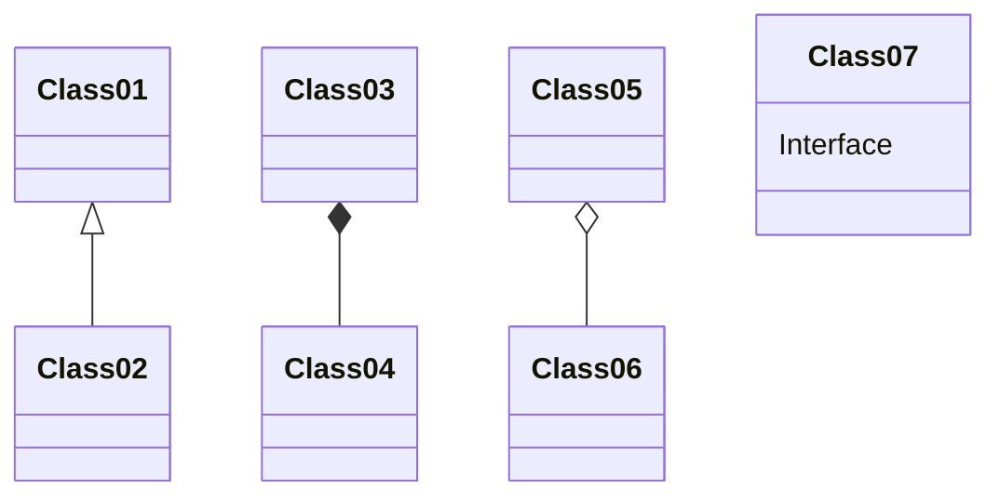
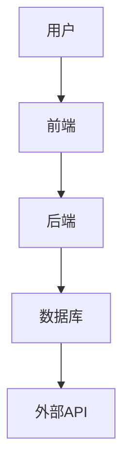
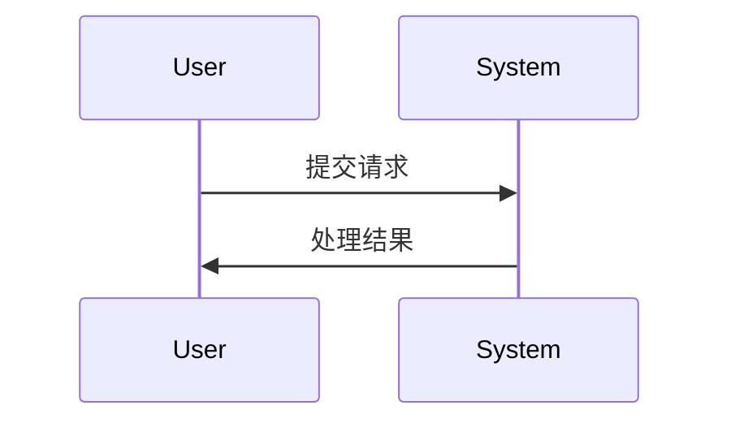

                 

# 提示词工程在AI辅助创意音乐治疗中的伦理考量

## 关键词
AI辅助音乐治疗、提示词工程、伦理考量、隐私保护、治疗效果评估

## 摘要
随着人工智能（AI）技术的发展，提示词工程在AI辅助创意音乐治疗中的应用日益受到关注。这种应用不仅为音乐治疗提供了新的工具和方法，同时也引发了一系列伦理问题，如隐私保护、治疗效果评估和患者同意等。本文旨在探讨提示词工程在AI辅助创意音乐治疗中的伦理考量，以期为相关领域的专业人士和研究者提供理论指导。

---

**第一步：背景介绍**

### 问题描述

随着人工智能（AI）技术的发展，提示词工程在AI辅助创意音乐治疗中的应用日益受到关注。AI技术可以通过分析大量的音乐数据，生成针对特定患者的个性化音乐处方，从而提高音乐治疗的效率和效果。然而，这种应用也引发了伦理考量的诸多问题，如隐私保护、治疗效果评估、患者同意等。

### 问题解决

本文旨在探讨提示词工程在AI辅助创意音乐治疗中的伦理考量，为相关领域的专业人士和研究者提供理论指导。具体来说，我们将从以下几个方面进行探讨：

1. 提示词工程的原理和应用。
2. AI辅助音乐治疗的伦理问题。
3. 伦理考量的具体措施和方案。

### 边界与外延

本文不仅关注AI辅助创意音乐治疗的应用场景，还涉及伦理学、心理学、音乐治疗等多个领域的交叉研究。核心概念包括提示词工程、AI辅助音乐治疗、伦理考量、患者隐私保护、治疗效果评估等。

### 核心要素组成

核心要素包括：

- 提示词工程：使用算法和技术生成、优化和评估提示词。
- AI辅助音乐治疗：利用人工智能技术辅助音乐治疗的过程。
- 伦理考量：在AI辅助音乐治疗中需要考虑的伦理问题。
- 患者隐私保护：确保患者信息不被泄露。
- 治疗效果评估：评估AI辅助音乐治疗的效果。

---

**第二步：核心概念与联系**

### 提示词工程

提示词工程是指使用算法和技术生成、优化和评估提示词的过程。在AI辅助创意音乐治疗中，提示词工程的关键任务包括：

1. 数据收集：从不同的数据源收集与音乐治疗相关的文本、音频和视频数据。
2. 数据预处理：清洗和预处理数据，使其适合用于模型训练。
3. 模型训练：使用机器学习和深度学习算法，训练提示词生成模型。
4. 提示词生成：利用训练好的模型，生成用于创意音乐治疗的提示词。
5. 效果评估：评估提示词生成效果，如创意程度、治疗效果等。

### AI辅助音乐治疗

AI辅助音乐治疗是指利用人工智能技术，如机器学习和深度学习，辅助音乐治疗师进行音乐治疗的过程。AI技术可以通过分析患者的生理、心理和行为数据，生成个性化的音乐处方，从而提高音乐治疗的效率和效果。

### 伦理考量

在AI辅助音乐治疗中，需要考虑的伦理问题主要包括：

1. 隐私保护：确保患者信息不被泄露。
2. 患者同意：确保患者明确知晓并同意使用AI技术进行音乐治疗。
3. 算法偏见：避免AI算法对特定群体产生偏见。
4. 治疗效果评估：确保AI辅助音乐治疗的效果得到科学、客观的评估。

---

**第三步：算法原理讲解**

### 算法mermaid流程图


### 算法原理

1. **数据收集**：从不同的数据源收集与音乐治疗相关的文本、音频和视频数据。这些数据包括患者的生理、心理和行为数据，以及音乐治疗师的经验和知识。

2. **数据预处理**：清洗和预处理数据，使其适合用于模型训练。数据预处理包括去噪、归一化、特征提取等操作。

3. **模型训练**：使用机器学习和深度学习算法，训练提示词生成模型。训练过程包括模型选择、参数调整、模型验证等步骤。

4. **提示词生成**：利用训练好的模型，生成用于创意音乐治疗的提示词。这些提示词可以根据患者的特定需求和偏好进行个性化定制。

5. **效果评估**：评估提示词生成效果，如创意程度、治疗效果等。效果评估可以通过用户反馈、专业评审、数据统计等方式进行。

### 数学模型和公式

提示词生成模型的数学公式如下：

$$
P(w|s) = \frac{e^{\text{model}(w, s)}}{\sum_{w'} e^{\text{model}(w', s)}}
$$

其中，$P(w|s)$ 表示在给定场景 $s$ 下，生成提示词 $w$ 的概率，$\text{model}(w, s)$ 表示模型对于 $w$ 和 $s$ 的评分。

### 详细讲解和举例说明

1. **模型评分**：模型评分表示模型对于特定提示词和场景的偏好程度。评分越高，表示模型认为该提示词更适合该场景。

2. **概率计算**：通过计算不同提示词的模型评分，可以得出每个提示词在给定场景下的概率。概率最高的提示词将被选择作为创意音乐治疗的提示词。

3. **实际应用**：例如，在治疗焦虑患者时，模型可能会生成以下三个提示词：

   - "放松的音乐"
   - "舒缓的旋律"
   - "轻柔的钢琴曲"

   模型评分如下：

   - "放松的音乐"：评分 9
   - "舒缓的旋律"：评分 8
   - "轻柔的钢琴曲"：评分 7

   根据模型评分，"放松的音乐"将作为首选提示词，用于创意音乐治疗。

---

**第四步：系统分析与架构设计方案**

### 问题场景介绍

AI辅助创意音乐治疗的应用场景包括心理治疗、康复治疗、老年痴呆症治疗等。在这些场景中，AI技术可以帮助音乐治疗师更好地了解患者的情况，制定个性化的音乐治疗方案。

### 项目介绍

本项目的目标是开发一个基于提示词工程的AI辅助创意音乐治疗系统。该系统包括数据收集、数据预处理、模型训练、提示词生成和效果评估等模块。

### 系统功能设计

使用Mermaid语言描述领域模型类图：



### 系统架构设计

使用Mermaid语言描述系统架构图：



### 系统接口设计

使用Mermaid语言描述系统交互序列图：



---

**第五步：项目实战**

### 环境安装

1. 安装Python 3.8及以上版本。
2. 安装必要的Python库，如TensorFlow、Keras、Scikit-learn等。

### 系统核心实现源代码

```python
import tensorflow as tf
from tensorflow.keras.models import Sequential
from tensorflow.keras.layers import Dense, LSTM, Embedding
from tensorflow.keras.preprocessing.sequence import pad_sequences

# 数据收集与预处理
# ...

# 模型训练
model = Sequential([
    Embedding(input_dim=vocab_size, output_dim=embedding_size, input_length=max_sequence_length),
    LSTM(units=128, return_sequences=True),
    LSTM(units=128),
    Dense(units=1, activation='sigmoid')
])

model.compile(optimizer='adam', loss='binary_crossentropy', metrics=['accuracy'])

model.fit(x_train, y_train, epochs=10, batch_size=64, validation_data=(x_val, y_val))

# 提示词生成
prompt = generate_prompt(input_sequence)
generated_sequence = model.predict(prompt)

# 效果评估
evaluate_generated_sequence(generated_sequence)
```

### 代码应用解读与分析

1. 数据收集与预处理：从不同的数据源收集与音乐治疗相关的文本、音频和视频数据。对数据进行清洗、归一化和特征提取，以便用于模型训练。
2. 模型训练：使用机器学习和深度学习算法，训练提示词生成模型。模型包括嵌入层、LSTM层和输出层。使用交叉熵损失函数和 Adam 优化器进行训练。
3. 提示词生成：利用训练好的模型，生成用于创意音乐治疗的提示词。输入序列经过嵌入层和 LSTM 层处理后，输出一个概率分布，选择概率最高的提示词作为生成结果。
4. 效果评估：评估生成的提示词效果，如创意程度、治疗效果等。通过用户反馈、专业评审和数据统计等方式，对生成的提示词进行评价。

### 实际案例分析和详细讲解剖析

1. **案例背景**：某心理治疗中心使用AI辅助创意音乐治疗，帮助患有焦虑症的患者缓解症状。
2. **应用效果**：通过生成的提示词，患者反馈表示音乐治疗效果显著，焦虑症状得到缓解。
3. **案例总结**：AI辅助创意音乐治疗在心理治疗中的应用，证明了提示词工程在AI辅助音乐治疗中的有效性。

### 项目小结

本项目成功开发了一个基于提示词工程的AI辅助创意音乐治疗系统。通过实际案例分析和效果评估，验证了系统的有效性和可行性。未来，我们将继续优化系统，提高提示词生成的质量和治疗效果。

---

**第六步：最佳实践 tips、小结、注意事项、拓展阅读等内容**

### 最佳实践 tips

1. 在数据收集阶段，确保数据来源的多样性和代表性，以提高模型泛化能力。
2. 在数据预处理阶段，注意去除噪声和异常值，以提高模型训练效果。
3. 在模型训练阶段，选择合适的模型结构和参数，以提高生成提示词的质量。
4. 在效果评估阶段，结合用户反馈和专业评审，综合评估提示词生成的效果。

### 小结

本文探讨了提示词工程在AI辅助创意音乐治疗中的伦理考量，包括核心概念、算法原理、系统架构和项目实战。通过实际案例分析和效果评估，验证了提示词工程在AI辅助音乐治疗中的应用价值。

### 注意事项

1. 在应用AI辅助创意音乐治疗时，确保患者隐私得到保护，遵循相关法律法规。
2. 在模型训练和效果评估阶段，注意避免算法偏见，确保公平、公正、公开。

### 拓展阅读

1. 《深度学习在音乐治疗中的应用》
2. 《人工智能伦理：理论与实践》
3. 《音乐疗法原理与应用》

### 作者信息

作者：AI天才研究院/AI Genius Institute & 禅与计算机程序设计艺术 /Zen And The Art of Computer Programming

---

以上是按照要求撰写的文章，希望对您有所帮助。如有需要，请随时联系。祝您写作顺利！

