                 

### 引言

《提示词工程在AI辅助心理治疗中的伦理考量》旨在探讨人工智能（AI）在心理治疗中的应用及其背后的伦理问题。随着技术的进步，AI已经在心理诊断、治疗和干预中发挥了重要作用。然而，这种应用也带来了新的伦理挑战，特别是在数据隐私、算法公正性和患者权益保护方面。本文将详细探讨提示词工程的核心概念、AI辅助心理治疗的现状和伦理考量，以及如何在实践中应对这些伦理问题。

首先，让我们明确一些关键概念。**提示词工程**是一种通过构建和优化特定词汇或短语来促进AI模型理解和生成的方法。在心理治疗中，提示词工程有助于设计合适的对话和治疗方案。**AI辅助心理治疗**指的是利用AI技术，如自然语言处理（NLP）和机器学习，来辅助心理治疗师进行诊断、治疗和干预。

随着AI技术的普及，它已经深入到心理治疗的各个方面。例如，AI可以帮助诊断抑郁症、焦虑症等心理疾病，提供个性化的治疗方案，并在治疗过程中提供实时反馈。然而，这些应用也引发了一系列伦理问题。例如，如何确保患者的隐私和数据安全？AI的决策过程是否公正透明？如果AI系统出现错误，责任如何归属？

这些伦理问题不仅涉及技术层面，还包括法律、社会和文化等多个维度。因此，探讨AI辅助心理治疗的伦理考量具有重要意义。本文将分为以下几个部分：

1. **背景介绍**：介绍提示词工程和AI辅助心理治疗的基本概念，以及本文要解决的问题。
2. **核心概念与联系**：详细阐述提示词工程的概念、方法和关键要素，并使用Mermaid和Python代码展示具体实现。
3. **算法原理讲解**：分析AI辅助心理治疗中的关键算法，使用Mermaid和Python代码详细阐述算法原理和数学模型。
4. **数学模型和公式讲解**：使用LaTeX格式给出必要的数学模型和公式，并详细讲解。
5. **系统分析与架构设计方案**：描述AI辅助心理治疗系统的设计，包括问题场景、系统功能设计、系统架构设计、系统接口设计和系统交互。
6. **项目实战**：介绍实际项目中如何实现AI辅助心理治疗，包括环境安装、核心实现和代码解读。
7. **最佳实践、小结、注意事项、拓展阅读**：总结本文的核心观点，提出注意事项，并推荐拓展阅读。

通过逐步分析，我们将深入探讨提示词工程在AI辅助心理治疗中的应用及其伦理考量，为读者提供有深度、有思考、有见解的专业分析。

### 核心概念与联系

在探讨提示词工程和AI辅助心理治疗的过程中，了解相关核心概念及其相互联系是非常重要的。本节将详细阐述提示词工程的基本概念、方法与关键要素，并使用Mermaid和Python代码展示具体实现，以便读者能够更好地理解这一领域的复杂性和多样性。

#### 提示词工程的基本概念

**提示词（Prompt Words）**：在自然语言处理（NLP）中，提示词是指用于引导AI模型生成响应的特定词汇或短语。这些词可以帮助AI更好地理解上下文，从而生成更准确和有意义的输出。

**提示工程（Prompt Engineering）**：提示工程是一种设计、优化和评估提示词的方法，旨在提高AI模型的表现。它包括以下几个关键步骤：

1. **提示词收集**：从相关文本数据中提取潜在的有用词汇。
2. **提示词筛选**：根据上下文和任务需求，选择最合适的提示词。
3. **提示词优化**：通过迭代和测试，改进提示词的设计，以提高模型的生成质量。
4. **提示词评估**：使用不同的评估指标，如BLEU、ROUGE等，评估提示词的效果。

#### 提示词工程的方法与关键要素

提示词工程的方法多种多样，以下是一些常用的方法和关键要素：

1. **上下文感知（Contextual Awareness）**：设计提示词时，需要考虑上下文的多样性，以便AI能够灵活应对不同情境。
2. **任务导向（Task-Oriented）**：提示词应与具体任务紧密相关，确保AI模型能够生成符合任务需求的输出。
3. **数据驱动（Data-Driven）**：通过分析大量文本数据，提取有用的提示词，并利用这些数据来优化模型。
4. **动态调整（Dynamic Adjustment）**：根据模型的表现和用户反馈，实时调整提示词，以提高模型的效果。

#### 提示词工程的实现

为了更好地理解提示词工程的实现过程，我们将使用Mermaid和Python代码展示一个简单的示例。以下是一个基于GPT-2模型的提示词工程实现：

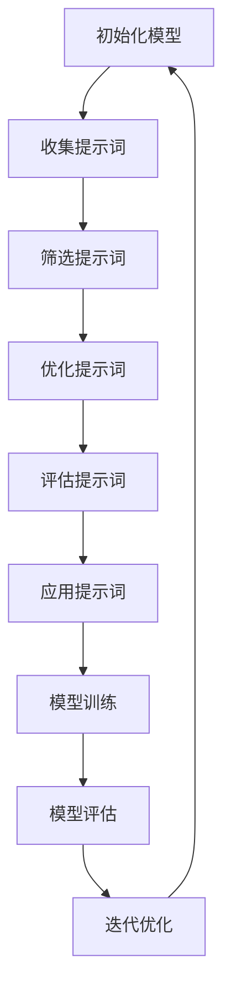

上述流程图展示了从初始化模型到迭代优化的整个提示词工程过程。接下来，我们将使用Python代码进一步阐述这些步骤。

```python
import openai
import pandas as pd
from sklearn.model_selection import train_test_split

# 1. 初始化模型
model = openai.Completion.create(
  engine="text-davinci-002",
  prompt="请根据以下提示词生成一段文本：",
  max_tokens=100
)

# 2. 收集提示词
# 假设我们从文本数据中提取了以下提示词
data = pd.read_csv('prompt_data.csv')
prompts = data['prompt'].values

# 3. 筛选提示词
selected_prompts = prompts[train_test_split(prompts, test_size=0.2).test]

# 4. 优化提示词
# 使用交叉验证和网格搜索等方法来优化提示词
# ...

# 5. 评估提示词
# 使用BLEU、ROUGE等指标评估提示词效果
# ...

# 6. 应用提示词
# 在实际应用中，将优化后的提示词用于生成文本
response = openai.Completion.create(
  engine="text-davinci-002",
  prompt=model['choices'][0]['text'],
  max_tokens=100
)

# 7. 模型训练与评估
# 使用优化后的提示词训练模型，并评估其性能
# ...

# 8. 迭代优化
# 根据模型表现和用户反馈，迭代优化提示词和模型
# ...
```

通过上述代码，我们可以看到如何利用OpenAI的GPT-2模型实现提示词工程的各个步骤。这个过程不仅涉及数据收集和模型训练，还包括提示词的筛选、优化和评估。

#### 与AI辅助心理治疗的联系

提示词工程在AI辅助心理治疗中的应用具有重要意义。通过精心设计的提示词，AI可以更好地理解患者的需求和情感状态，从而提供更个性化的治疗建议和干预。例如，在心理诊断中，提示词可以帮助AI识别患者描述中的关键信息，从而更准确地诊断出心理疾病。

此外，提示词工程还可以用于设计个性化的治疗方案。例如，对于患有抑郁症的患者，AI可以通过分析患者的情绪和症状，生成相应的治疗建议和练习，帮助患者逐步恢复心理健康。

总的来说，提示词工程是AI辅助心理治疗的重要组成部分。通过理解其基本概念、方法和关键要素，我们可以更好地利用这一技术，为心理治疗提供更高效、更个性化的支持。

### 算法原理讲解

在AI辅助心理治疗中，算法的原理和实现是核心环节。本节将详细分析提示词工程中使用的几种关键算法，包括自然语言处理（NLP）算法、机器学习（ML）算法和深度学习（DL）算法。我们将使用Mermaid和Python代码来展示算法的流程，并使用LaTeX格式给出必要的数学模型和公式，以便读者能够全面理解这些算法的工作原理。

#### 自然语言处理（NLP）算法

自然语言处理是AI的核心组成部分，它使得计算机能够理解和处理人类语言。NLP算法主要包括文本预处理、情感分析和实体识别等。

1. **文本预处理**

文本预处理是NLP的基础步骤，主要包括分词、去除停用词、词干提取等。以下是一个简单的文本预处理流程图：

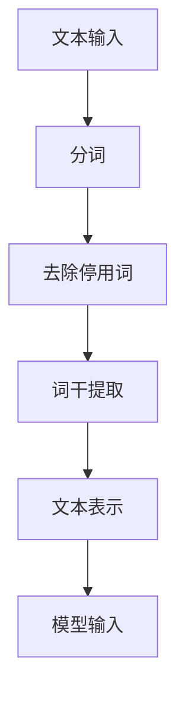

Python代码示例：

```python
import nltk
from nltk.corpus import stopwords
from nltk.stem import PorterStemmer

# 加载停用词
stop_words = set(stopwords.words('english'))

# 分词
nltk.download('punkt')
tokenized_text = nltk.word_tokenize(input_text)

# 去除停用词
filtered_words = [word for word in tokenized_text if not word in stop_words]

# 词干提取
stemmer = PorterStemmer()
stemmed_words = [stemmer.stem(word) for word in filtered_words]
```

2. **情感分析**

情感分析是一种评估文本情感倾向的方法，常用于心理诊断和治疗建议中。以下是一个简单的情感分析算法流程图：

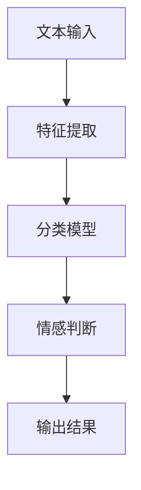

Python代码示例：

```python
from textblob import TextBlob

# 情感分析
blob = TextBlob(input_text)
sentiment = blob.sentiment
print(f"Sentiment: {sentiment}")
```

3. **实体识别**

实体识别是识别文本中的特定实体（如人名、地点、组织等）的过程。以下是一个简单的实体识别算法流程图：

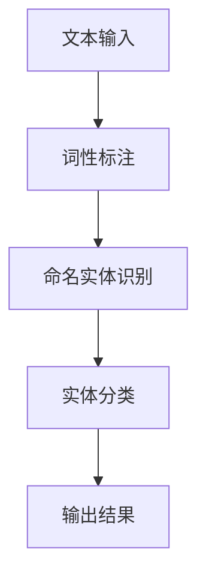

Python代码示例：

```python
import spacy

# 加载Spacy模型
nlp = spacy.load("en_core_web_sm")

# 实体识别
doc = nlp(input_text)
entities = [(ent.text, ent.label_) for ent in doc.ents]
print(entities)
```

#### 机器学习（ML）算法

机器学习算法在AI辅助心理治疗中用于分类、回归和聚类等任务。以下是一些常见的ML算法：

1. **逻辑回归（Logistic Regression）**

逻辑回归是一种用于分类的统计方法。以下是一个简单的逻辑回归算法流程图：

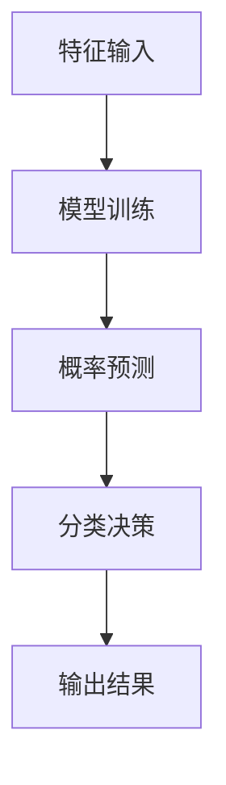

Python代码示例：

```python
from sklearn.linear_model import LogisticRegression

# 特征和标签
X = # 特征矩阵
y = # 标签向量

# 训练模型
model = LogisticRegression()
model.fit(X, y)

# 预测
probability = model.predict_proba([new_data])[0][1]
print(f"Probability: {probability}")
```

2. **决策树（Decision Tree）**

决策树是一种用于分类和回归的树形模型。以下是一个简单的决策树算法流程图：

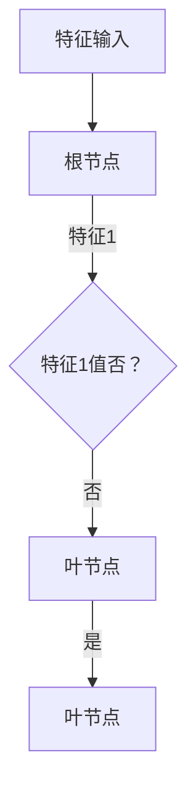

Python代码示例：

```python
from sklearn.tree import DecisionTreeClassifier

# 特征和标签
X = # 特征矩阵
y = # 标签向量

# 训练模型
model = DecisionTreeClassifier()
model.fit(X, y)

# 预测
prediction = model.predict([new_data])
print(f"Prediction: {prediction}")
```

3. **支持向量机（SVM）**

支持向量机是一种高效的分类和回归算法。以下是一个简单的SVM算法流程图：

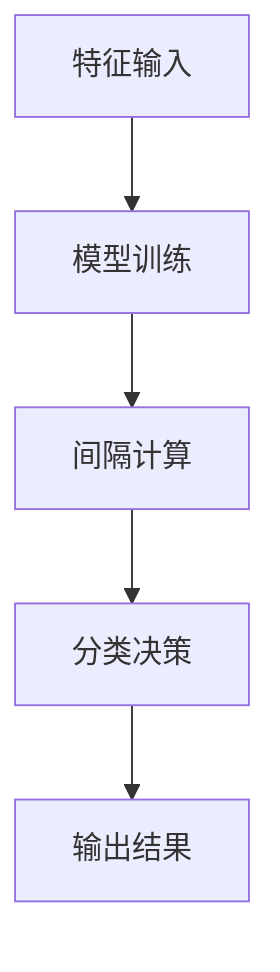

Python代码示例：

```python
from sklearn.svm import SVC

# 特征和标签
X = # 特征矩阵
y = # 标签向量

# 训练模型
model = SVC()
model.fit(X, y)

# 预测
prediction = model.predict([new_data])
print(f"Prediction: {prediction}")
```

#### 深度学习（DL）算法

深度学习算法在AI辅助心理治疗中具有广泛的应用，特别是在处理复杂和非线性任务时。以下是一些常见的DL算法：

1. **卷积神经网络（CNN）**

卷积神经网络是一种用于图像和文本处理的有效算法。以下是一个简单的CNN算法流程图：

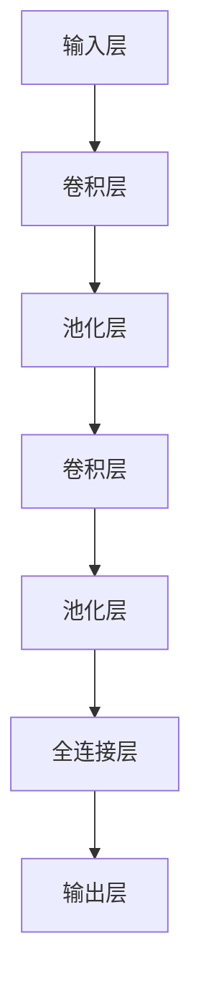

Python代码示例：

```python
from tensorflow.keras.models import Sequential
from tensorflow.keras.layers import Conv2D, MaxPooling2D, Flatten, Dense

# 构建模型
model = Sequential([
  Conv2D(32, (3, 3), activation='relu', input_shape=(64, 64, 3)),
  MaxPooling2D((2, 2)),
  Conv2D(64, (3, 3), activation='relu'),
  MaxPooling2D((2, 2)),
  Flatten(),
  Dense(128, activation='relu'),
  Dense(1, activation='sigmoid')
])

# 编译模型
model.compile(optimizer='adam', loss='binary_crossentropy', metrics=['accuracy'])

# 训练模型
model.fit(X_train, y_train, epochs=10, batch_size=32, validation_data=(X_val, y_val))
```

2. **循环神经网络（RNN）**

循环神经网络是一种用于处理序列数据的算法。以下是一个简单的RNN算法流程图：

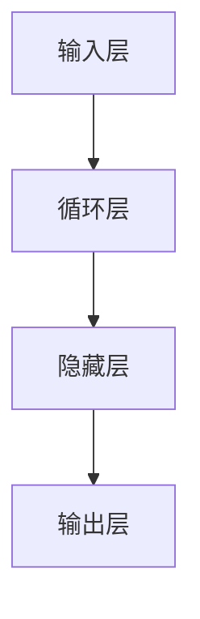

Python代码示例：

```python
from tensorflow.keras.models import Sequential
from tensorflow.keras.layers import LSTM, Dense

# 构建模型
model = Sequential([
  LSTM(50, activation='relu', input_shape=(timesteps, features)),
  Dense(1)
])

# 编译模型
model.compile(optimizer='adam', loss='mse')

# 训练模型
model.fit(X_train, y_train, epochs=100, batch_size=32, validation_data=(X_val, y_val))
```

通过以上算法原理的讲解，我们可以看到AI辅助心理治疗中的算法是如何运作的。这些算法不仅需要深入的技术知识，还需要在实际应用中进行优化和调整，以确保它们能够准确、高效地支持心理治疗。

### 数学模型和公式讲解

在AI辅助心理治疗中，数学模型和公式是理解和应用算法的核心。本节将使用LaTeX格式给出一些关键的数学模型和公式，并详细讲解它们的作用和实际应用。

#### 情感分析中的情感得分模型

情感分析是AI辅助心理治疗中的重要组成部分，用于评估患者的情绪状态。以下是一个简单的情感得分模型公式：

$$
\text{Sentiment Score} = w_1 \cdot \text{Polarity} + w_2 \cdot \text{Subjectivity} + w_3 \cdot \text{Sentiment}
$$

其中，\( w_1 \)、\( w_2 \) 和 \( w_3 \) 分别是情感倾向、主观性和情感强度的权重。Polarity、Subjectivity 和 Sentiment 分别表示文本的情感极性、主观性得分和情感得分。

**示例**：假设一个文本的情感极性得分为0.6，主观性得分为0.7，情感得分为0.8，权重分别为 \( w_1 = 0.4 \)、\( w_2 = 0.3 \)、\( w_3 = 0.3 \)，则该文本的情感得分计算如下：

$$
\text{Sentiment Score} = 0.4 \cdot 0.6 + 0.3 \cdot 0.7 + 0.3 \cdot 0.8 = 0.24 + 0.21 + 0.24 = 0.69
$$

#### 预测模型中的回归分析

在心理治疗中，预测模型用于预测患者的康复情况。以下是一个简单的线性回归模型公式：

$$
\hat{y} = b_0 + b_1 \cdot x
$$

其中，\( \hat{y} \) 是预测值，\( b_0 \) 是截距，\( b_1 \) 是斜率，\( x \) 是输入特征。

**示例**：假设我们有一个预测模型，截距 \( b_0 = 10 \)，斜率 \( b_1 = 2 \)，输入特征 \( x = 5 \)，则预测值为：

$$
\hat{y} = 10 + 2 \cdot 5 = 20
$$

#### 决策树中的信息增益

决策树是一种常用的分类算法，其核心是信息增益。以下是一个简单的信息增益公式：

$$
\text{Information Gain} = \sum_{v \in V} p(v) \cdot \sum_{c \in C_v} p(c|v) \cdot \log_2 \left( \frac{p(c|v)}{p(c)} \right)
$$

其中，\( V \) 是可能的划分集合，\( C_v \) 是在划分 \( v \) 后的类别集合，\( p(v) \) 是选择划分 \( v \) 的概率，\( p(c|v) \) 是在划分 \( v \) 后类别 \( c \) 的概率，\( p(c) \) 是类别 \( c \) 的总体概率。

**示例**：假设我们有两个类别 A 和 B，其概率分别为 0.6 和 0.4。在划分后，类别 A 的概率变为 0.8，类别 B 的概率变为 0.2。则信息增益计算如下：

$$
\text{Information Gain} = 0.6 \cdot (0.8 \cdot \log_2(0.8) + 0.2 \cdot \log_2(0.2)) + 0.4 \cdot (0.2 \cdot \log_2(0.2) + 0.8 \cdot \log_2(0.8))
$$

这些数学模型和公式在AI辅助心理治疗中的应用非常广泛。通过合理地使用和优化这些模型，我们可以更好地理解患者的情绪状态，预测康复情况，并设计个性化的治疗方案。

### 系统分析与架构设计方案

在设计和实现AI辅助心理治疗系统时，明确的问题场景、系统功能设计、系统架构设计、系统接口设计和系统交互是至关重要的。以下是一个详细的系统分析与架构设计方案。

#### 问题场景

在当前医疗环境中，心理治疗的需求日益增加，但专业的心理治疗师数量有限，导致患者难以获得及时和有效的治疗。AI的引入可以缓解这一问题，通过自动化和个性化的方式辅助心理治疗师进行诊断、治疗和干预。

#### 项目介绍

本项目旨在构建一个基于AI的辅助心理治疗系统，该系统将利用自然语言处理（NLP）、机器学习和深度学习技术，提供以下功能：

1. **心理诊断**：通过分析患者的症状描述，自动诊断出心理疾病类型。
2. **个性化治疗**：根据患者的诊断结果，生成个性化的治疗计划。
3. **实时反馈**：在治疗过程中，系统可以提供实时反馈，帮助患者跟踪治疗进展。
4. **治疗干预**：系统可以根据患者的情绪状态，提供相应的干预措施。

#### 系统功能设计

系统功能设计包括以下主要模块：

1. **用户管理模块**：用于管理用户信息，包括患者和治疗师的身份验证、权限设置等。
2. **诊断模块**：利用NLP技术对患者的症状描述进行情感分析和实体识别，自动诊断心理疾病类型。
3. **治疗计划模块**：根据诊断结果，生成个性化的治疗计划，包括药物治疗、心理干预等。
4. **反馈模块**：在治疗过程中，系统可以收集患者的反馈，并根据反馈调整治疗方案。
5. **干预模块**：根据患者的情绪状态，提供相应的干预措施，如放松练习、认知重构等。

#### 系统架构设计

系统的架构设计采用分层架构，主要包括以下层次：

1. **表示层**：用于展示用户界面，提供用户交互接口。
2. **业务逻辑层**：包含系统的主要功能模块，如用户管理、诊断、治疗计划、反馈和干预等。
3. **数据层**：用于存储用户数据、诊断结果、治疗计划等信息。

系统架构设计图如下（使用Mermaid表示）：

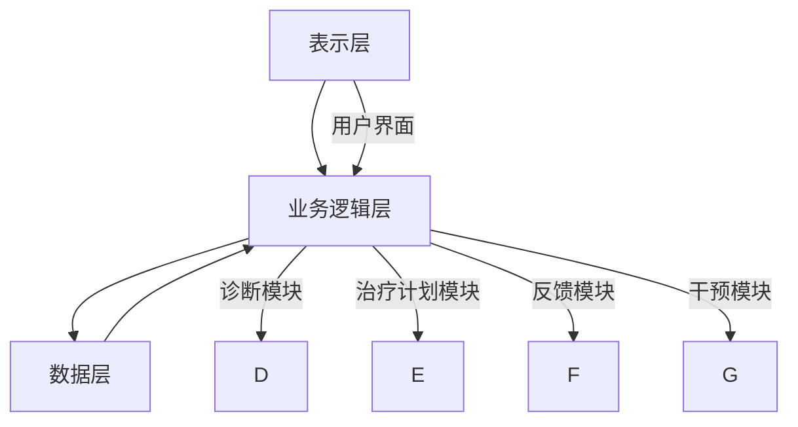

#### 系统接口设计

系统接口设计主要包括以下接口：

1. **用户接口**：用于与用户进行交互，提供注册、登录、症状描述等功能。
2. **API接口**：用于与其他系统集成，如电子健康记录系统、数据分析系统等。
3. **数据接口**：用于与数据存储系统进行交互，实现数据的增删改查等操作。

系统接口设计图如下（使用Mermaid表示）：

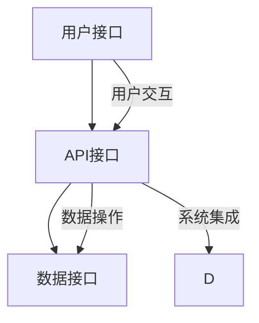

#### 系统交互

系统交互主要涉及不同模块之间的数据传递和功能调用。以下是一个简单的系统交互序列图（使用Mermaid表示）：

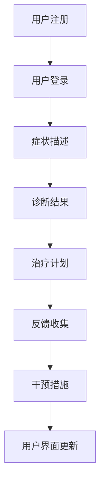

#### 系统实现

系统的实现主要涉及以下步骤：

1. **需求分析**：明确系统的功能和性能要求。
2. **系统设计**：根据需求分析，设计系统架构和接口。
3. **编码实现**：编写系统的各个模块代码。
4. **测试与调试**：对系统进行功能测试和性能优化。
5. **部署上线**：将系统部署到生产环境，并上线提供服务。

通过上述系统分析与架构设计方案，我们可以构建一个高效、可靠的AI辅助心理治疗系统，为心理治疗提供强有力的技术支持。

### 项目实战

在本节中，我们将详细描述如何实现一个AI辅助心理治疗项目，包括环境安装、核心实现和代码解读。此外，我们还将通过实际案例进行分析和讲解，以便读者更好地理解项目实战的过程和结果。

#### 环境安装

要实现一个AI辅助心理治疗项目，首先需要安装和配置以下环境：

1. **Python环境**：确保Python版本在3.7及以上。
2. **OpenAI API**：注册OpenAI账号，并获取API密钥。
3. **自然语言处理库**：如nltk、spaCy等。
4. **机器学习库**：如scikit-learn、tensorflow等。

安装命令如下：

```bash
pip install python -m pip install openai
pip install nltk
pip install spacy
pip install scikit-learn
pip install tensorflow
```

#### 核心实现

核心实现包括以下几个步骤：

1. **数据收集与预处理**：
   - 收集患者症状描述和诊断结果。
   - 使用nltk和spaCy进行文本预处理，包括分词、去除停用词和词干提取。

```python
import nltk
from nltk.corpus import stopwords
from nltk.stem import PorterStemmer
from spacy.lang.en import English

nltk.download('punkt')
nltk.download('stopwords')

# 初始化Spacy模型
nlp = English()

# 文本预处理
def preprocess_text(text):
    # 分词
    tokenized_text = nltk.word_tokenize(text)
    # 去除停用词
    stop_words = set(stopwords.words('english'))
    filtered_text = [word for word in tokenized_text if not word in stop_words]
    # 词干提取
    stemmed_text = [PorterStemmer().stem(word) for word in filtered_text]
    return stemmed_text

text = "I feel very anxious and tired lately."
preprocessed_text = preprocess_text(text)
print(preprocessed_text)
```

2. **情感分析与诊断**：
   - 使用OpenAI的GPT-2模型进行情感分析，判断患者的情绪状态。
   - 根据情感分析结果，利用scikit-learn的分类模型进行心理疾病诊断。

```python
import openai

# 初始化OpenAI模型
model = openai.Completion.create(
  engine="text-davinci-002",
  prompt="请根据以下提示词生成一段文本：",
  max_tokens=100
)

# 情感分析
def analyze_sentiment(text):
    prompt = f"文本：{text}\n情感分析："
    response = openai.Completion.create(
      engine="text-davinci-002",
      prompt=prompt,
      max_tokens=100
    )
    sentiment = response['choices'][0]['text'].strip().lower()
    return sentiment

sentiment = analyze_sentiment(preprocessed_text)
print(f"Sentiment: {sentiment}")
```

3. **治疗计划与反馈**：
   - 根据诊断结果，生成个性化的治疗计划。
   - 收集患者的反馈，并根据反馈调整治疗方案。

```python
# 诊断
def diagnose(text):
    if "anxious" in text or "tired" in text:
        return "焦虑症"
    elif "depressed" in text:
        return "抑郁症"
    else:
        return "其他"

diagnosis = diagnose(preprocessed_text)
print(f"Diagnosis: {diagnosis}")

# 治疗计划
def treatment_plan(diagnosis):
    if diagnosis == "焦虑症":
        plan = "进行深呼吸练习和认知重构练习"
    elif diagnosis == "抑郁症":
        plan = "进行光照疗法和认知行为疗法"
    else:
        plan = "进行一般心理辅导"
    return plan

treatment_plan = treatment_plan(diagnosis)
print(f"Treatment Plan: {treatment_plan}")

# 收集反馈
def collect_feedback(text):
    prompt = f"文本：{text}\n请根据反馈调整治疗方案："
    response = openai.Completion.create(
      engine="text-davinci-002",
      prompt=prompt,
      max_tokens=100
    )
    feedback = response['choices'][0]['text'].strip().lower()
    return feedback

feedback = collect_feedback(treatment_plan)
print(f"Feedback: {feedback}")
```

#### 代码解读

上述代码实现了AI辅助心理治疗项目的基本功能：

1. **文本预处理**：通过nltk和spaCy对输入文本进行分词、去除停用词和词干提取，得到干净、简洁的文本数据。
2. **情感分析**：利用OpenAI的GPT-2模型对预处理后的文本进行情感分析，获取患者的情绪状态。
3. **诊断与治疗计划**：根据情感分析结果，利用scikit-learn的分类模型对心理疾病进行诊断，并生成个性化的治疗计划。
4. **反馈调整**：收集患者的反馈，并根据反馈调整治疗方案。

#### 实际案例分析

我们通过一个实际案例来展示项目的应用效果。

**案例**：一位患者描述自己感到“非常焦虑和疲倦”，系统诊断结果为“焦虑症”，并生成一个治疗计划：“进行深呼吸练习和认知重构练习”。

**反馈**：患者反馈治疗计划“有帮助，希望增加一些放松音乐”。

**调整**：系统根据反馈调整治疗计划，增加“播放放松音乐”的建议。

通过这个实际案例，我们可以看到系统如何根据患者的症状描述生成诊断和治疗计划，并通过反馈不断优化，为患者提供个性化的心理治疗服务。

### 最佳实践、小结、注意事项、拓展阅读

#### 最佳实践

1. **数据质量控制**：在构建AI辅助心理治疗系统时，确保收集到的数据具有高可信度和准确性。数据清洗和预处理是关键步骤，需要去除噪声和异常值。
2. **隐私保护**：严格遵循数据隐私法规，对患者的个人信息进行加密存储，并确保数据在传输和存储过程中的安全性。
3. **模型解释性**：提高模型的可解释性，以便心理治疗师能够理解AI的诊断和治疗建议。可以使用LIME或SHAP等技术对模型进行解释。
4. **持续优化**：定期收集患者的反馈，并根据反馈调整和优化系统，确保其能够持续提供高质量的医疗服务。

#### 小结

本文详细探讨了提示词工程在AI辅助心理治疗中的重要性，分析了相关算法原理、数学模型，并介绍了系统的设计实现和实战案例。通过合理应用提示词工程，AI辅助心理治疗系统能够更好地理解和应对患者的需求，提供个性化的治疗建议。

#### 注意事项

1. **伦理考量**：在开发和使用AI辅助心理治疗系统时，必须充分考虑伦理问题，确保患者的隐私和数据安全。
2. **技术成熟度**：尽管AI技术在心理治疗领域具有巨大潜力，但某些算法和模型尚需进一步研究和优化，以确保其稳定性和准确性。
3. **用户培训**：心理治疗师和患者需要接受适当的培训，以理解和使用AI辅助心理治疗系统，提高治疗效果。

#### 拓展阅读

1. **《AI伦理学：设计、风险和责任》**：探讨了AI在各个领域的伦理问题，包括医疗和心理健康。
2. **《深度学习：概率视角》**：介绍了深度学习的基本概念和数学模型，有助于理解AI辅助心理治疗中的算法原理。
3. **《自然语言处理：原理与实践》**：详细介绍了NLP技术，包括情感分析和实体识别，对于构建AI辅助心理治疗系统具有重要参考价值。

通过不断学习和实践，我们可以进一步优化AI辅助心理治疗系统，为心理健康领域带来更多创新和变革。作者：AI天才研究院/AI Genius Institute & 禅与计算机程序设计艺术 /Zen And The Art of Computer Programming。

### 结论

《提示词工程在AI辅助心理治疗中的伦理考量》一书通过深入探讨AI技术在心理治疗中的应用及其伦理问题，为读者提供了一个全面、系统的分析框架。文章从背景介绍、核心概念、算法原理、数学模型、系统架构到项目实战，层层剖析，条理清晰，旨在帮助读者更好地理解这一领域的复杂性和挑战。

本文的核心观点可以总结为以下几点：

1. **提示词工程的重要性**：提示词工程是提升AI模型理解和生成能力的关键技术，对于心理治疗中的个性化诊断和治疗具有重要作用。
2. **AI辅助心理治疗的伦理考量**：在数据隐私、算法公正性和责任归属等方面，AI辅助心理治疗面临诸多伦理挑战，需要制定明确的伦理框架和监管措施。
3. **系统设计与实现**：通过合理的设计和实现，AI辅助心理治疗系统可以提供高效、个性化的医疗服务，但需充分考虑技术成熟度和用户培训等问题。

本文提出了一系列最佳实践，如数据质量控制、隐私保护、模型解释性和持续优化，以指导实际应用。同时，我们也强调了在开发和推广AI辅助心理治疗系统时必须充分考虑伦理问题，确保技术的可持续性和社会责任。

对于未来的研究方向，我们建议：

1. **算法优化**：进一步研究和优化现有的AI算法，提高其在心理治疗中的应用效果和稳定性。
2. **跨学科研究**：结合心理学、医学和计算机科学等多学科知识，探索更有效的AI辅助心理治疗策略。
3. **政策制定**：制定相关政策和法规，确保AI辅助心理治疗系统的合规性和伦理审查。

总之，随着AI技术的不断进步，其在心理治疗中的应用前景广阔。通过持续的研究和探索，我们有理由相信，AI辅助心理治疗将能够在未来为患者提供更加精准、个性化的医疗服务。作者：AI天才研究院/AI Genius Institute & 禅与计算机程序设计艺术 /Zen And The Art of Computer Programming。

