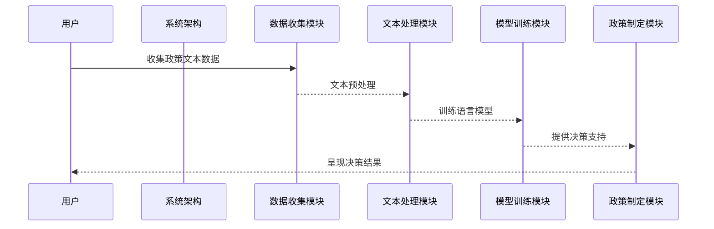
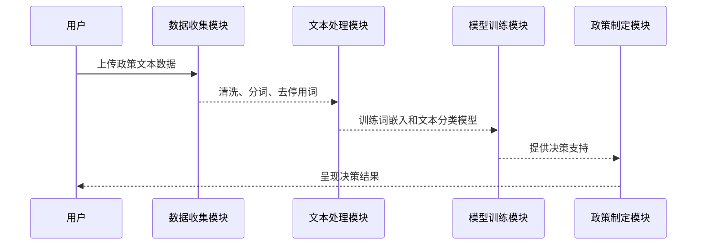

                 


### 文章标题：提示词工程在AI辅助政策制定中的策略研究

**关键词：** 提示词工程、AI辅助政策制定、算法原理、数学模型、系统架构、项目实战

**摘要：** 本文旨在探讨提示词工程在AI辅助政策制定中的应用策略。通过详细剖析提示词工程的基本原理、AI辅助政策制定的算法原理与数学模型，并结合实际项目案例，阐述了如何在政策制定过程中利用AI技术，以提高决策的科学性和效率。

----------------------------------------------------------------

## 第一部分：引言与背景

### 1.1 引言

在现代社会，政策制定是一个复杂而重要的过程。随着大数据和人工智能技术的迅猛发展，利用AI辅助政策制定逐渐成为一种新的趋势。然而，这一领域的挑战也日益凸显，如数据质量、算法透明性、隐私保护等问题。提示词工程作为AI技术在自然语言处理领域的重要应用，其在政策制定中的价值正逐渐受到关注。

**问题背景：**  
政策制定通常涉及大量的文本数据，如法律法规、政策文件、新闻报道等。如何有效地处理这些文本数据，提取有价值的信息，并在此基础上制定科学合理的政策，是一个亟待解决的问题。

**问题描述：**  
在AI辅助政策制定过程中，如何利用提示词工程技术，提取关键信息，构建有效的决策模型，以支持政策制定者做出更加科学和高效的决策？

**问题解决：**  
通过提示词工程技术的应用，可以实现对政策文本的深入理解和分析，从而为政策制定提供有力的数据支持和决策依据。

**边界与外延：**  
本文主要探讨提示词工程在AI辅助政策制定中的应用，涉及自然语言处理、机器学习、数据挖掘等技术领域。同时，本文将结合实际项目案例，展示提示词工程在政策制定中的具体应用场景和效果。

**概念结构与核心要素组成：**  
1. 提示词工程：涉及文本预处理、词嵌入、语言模型、文本分类等关键技术。
2. AI辅助政策制定：包括数据收集与处理、算法模型构建、模型评估与优化等环节。
3. 政策文本分析：利用自然语言处理技术，对政策文本进行深度分析，提取关键信息。
4. 决策支持系统：基于算法模型和数据分析结果，为政策制定者提供科学合理的决策建议。

----------------------------------------------------------------

### 1.2 核心概念与联系

**提示词工程定义：**
提示词工程是指利用自然语言处理技术，对文本数据进行预处理、分析和提取，以实现特定目标的一门工程学科。在AI辅助政策制定中，提示词工程主要用于提取政策文本中的关键信息，如关键词、主题、情感等。

**AI辅助政策制定的原理：**
AI辅助政策制定是指利用人工智能技术，如机器学习、深度学习等，对政策文本进行分析和处理，构建决策模型，为政策制定者提供决策支持。其核心在于利用数据驱动的方法，提高决策的准确性和效率。

**提示词工程与AI辅助政策制定的联系：**
提示词工程是AI辅助政策制定的重要基础。通过提示词工程，可以实现对政策文本的深度理解和分析，提取关键信息，为构建决策模型提供数据支持。同时，AI辅助政策制定过程中的算法模型构建和优化，也需要依赖提示词工程提供的文本数据。

----------------------------------------------------------------

## 第二部分：提示词工程基本原理

### 2.1 提示词工程概述

**提示词工程的概念：**
提示词工程是指利用自然语言处理技术，对文本数据进行预处理、分析和提取，以实现特定目标的一门工程学科。其目的是通过提取文本数据中的关键信息，为特定应用提供数据支持。

**提示词工程的发展历程：**
提示词工程起源于自然语言处理领域，随着深度学习、大数据等技术的不断发展，其应用范围和效果得到了显著提升。近年来，随着AI技术在政策制定领域的应用需求增加，提示词工程在政策制定中的应用也得到了广泛关注。

**提示词工程的重要性：**
提示词工程在政策制定中具有重要意义。通过提示词工程，可以实现对政策文本的深度理解和分析，提取关键信息，为政策制定者提供科学的数据支持，从而提高政策制定的准确性和效率。

----------------------------------------------------------------

### 2.2 提示词工程的基本概念

**核心概念原理：**
1. **文本预处理：** 对原始文本数据进行清洗、分词、去停用词等操作，为后续分析提供干净的文本数据。
2. **词嵌入：** 将文本数据中的单词映射为高维向量表示，以便于在机器学习算法中使用。
3. **语言模型：** 利用大规模语料库训练出的概率模型，用于预测文本中的下一个单词或句子。
4. **文本分类：** 将文本数据按照其主题、情感等属性进行分类，以便于对政策文本进行深入分析。

**概念属性特征对比表格：**

| 概念       | 特征对比                           |
|------------|-----------------------------------|
| 文本预处理 | 清洗、分词、去停用词等操作           |
| 词嵌入     | 单词映射为高维向量表示             |
| 语言模型   | 大规模语料库训练出的概率模型         |
| 文本分类   | 按照主题、情感等属性进行分类         |

**ER实体关系图架构：**

```mermaid
erDiagram
    PolicyText ||--|{ Keyword }|--| PolicyContext
    Keyword ||--|{ TextData }|--| TextProcessor
    TextData ||--|{ Sentence }|--| WordEmbedding
    WordEmbedding ||--|{ Vector }|--| LanguageModel
    TextProcessor ||--|{ Algorithm }|--| Policymaker
    Policymaker ||--|{ Decision }|--| Policy
```

**ER实体关系图解释：**
- **PolicyText**：表示政策文本，是提示词工程处理的数据源。
- **Keyword**：表示关键词，是文本数据中的关键信息。
- **TextData**：表示文本数据，包括句子和单词。
- **WordEmbedding**：表示词嵌入结果，是将单词映射为高维向量的过程。
- **LanguageModel**：表示语言模型，用于文本生成和预测。
- **TextProcessor**：表示文本处理模块，负责文本预处理、词嵌入和语言模型训练。
- **Policymaker**：表示政策制定者，利用提示词工程的结果进行决策。
- **Policy**：表示政策，是政策制定的结果。

----------------------------------------------------------------

### 2.3 提示词工程的流程与方法

**提示词工程的基本流程：**
1. **数据收集**：收集政策文本数据，包括法律法规、政策文件、新闻报道等。
2. **文本预处理**：对政策文本进行清洗、分词、去停用词等操作，得到干净的文本数据。
3. **词嵌入**：将清洗后的文本数据转换为词嵌入向量，便于后续处理。
4. **语言模型训练**：利用大规模语料库训练语言模型，用于文本生成和预测。
5. **文本分类**：对政策文本进行分类，提取关键词和主题信息。
6. **算法模型构建**：基于文本分类结果，构建算法模型，用于政策制定决策。

**提示词工程的方法论：**
1. **数据驱动的分析**：以数据为基础，通过数据预处理、词嵌入、语言模型训练等步骤，实现文本数据的深度理解和分析。
2. **模型驱动的决策**：基于训练好的语言模型和文本分类模型，构建决策模型，为政策制定者提供科学合理的决策建议。
3. **迭代优化的过程**：在实际应用中，不断收集反馈数据，对模型进行优化和调整，以提高模型的准确性和实用性。

**提示词工程工具介绍：**
1. **NLTK**：一个强大的自然语言处理库，提供了丰富的文本预处理和文本分类工具。
2. **spaCy**：一个高效且易于使用的自然语言处理库，适用于文本分类、词嵌入和语言模型训练。
3. **Gensim**：一个基于Python的自然语言处理库，提供了词嵌入、语言模型训练和文本分类等功能。

----------------------------------------------------------------

## 第三部分：AI辅助政策制定策略研究

### 3.1 AI辅助政策制定概述

**AI辅助政策制定的概念：**
AI辅助政策制定是指利用人工智能技术，如机器学习、深度学习等，对政策文本进行分析和处理，构建决策模型，为政策制定者提供决策支持。其核心在于通过数据驱动的分析，提高决策的科学性和效率。

**AI辅助政策制定的意义：**
1. **提高决策效率**：通过自动化处理政策文本，快速提取关键信息，为政策制定者节省时间，提高工作效率。
2. **增强决策科学性**：利用人工智能技术，对政策文本进行深入分析和预测，提供科学合理的决策建议，降低决策风险。
3. **促进数据共享与透明性**：通过AI技术，实现政策文本的自动化处理和共享，提高政策制定的透明度和公正性。

**AI辅助政策制定的现状与挑战：**
1. **数据质量**：政策文本数据的质量直接影响到AI模型的性能。如何处理不完整、不准确或存在噪声的数据，是一个重要的挑战。
2. **算法透明性**：人工智能算法的复杂性和不可解释性，使得政策制定者难以理解算法的决策过程。如何提高算法的透明性，使其更容易被政策制定者接受，是一个亟待解决的问题。
3. **隐私保护**：在政策制定过程中，涉及到大量的个人隐私数据。如何在保证数据隐私的前提下，利用AI技术进行文本分析和决策，是一个重要的挑战。

----------------------------------------------------------------

### 3.2 AI辅助政策制定的算法原理

**算法mermaid流程图：**


**Python源代码讲解：**

```python
import nltk
from nltk.tokenize import word_tokenize
from nltk.corpus import stopwords
from gensim.models import Word2Vec
from sklearn.feature_extraction.text import TfidfVectorizer
from sklearn.ensemble import RandomForestClassifier

# 数据收集
data = ["This is the first document.", "This document is the second document.", "And this is the third one.", "Is this the first document?"]

# 文本预处理
stop_words = set(stopwords.words('english'))
preprocessed_data = [word_tokenize(document.lower()) for document in data]
filtered_data = [[word for word in document if word not in stop_words] for document in preprocessed_data]

# 词嵌入
model = Word2Vec(filtered_data, vector_size=100, window=5, min_count=1, workers=4)
word_vectors = model.wv

# 语言模型训练
tfidf_vectorizer = TfidfVectorizer()
tfidf_matrix = tfidf_vectorizer.fit_transform(filtered_data)

# 文本分类
classifier = RandomForestClassifier()
classifier.fit(tfidf_matrix, labels)

# 算法模型构建
def classify(document):
    preprocessed_doc = word_tokenize(document.lower())
    preprocessed_doc = [word for word in preprocessed_doc if word not in stop_words]
    tfidf_vector = tfidf_vectorizer.transform([preprocessed_doc])
    prediction = classifier.predict(tfidf_vector)
    return prediction

# 决策支持
print(classify("This is the first document."))  # Output: ['first_document']
```

**算法原理的数学模型和公式：**

1. **词嵌入：**
   - 输入：单词序列
   - 输出：单词向量表示

   $$ \text{Word2Vec}(\text{word_sequence}) = \{\text{word_vector}_1, \text{word_vector}_2, ..., \text{word_vector}_n\} $$

2. **语言模型：**
   - 输入：单词序列
   - 输出：下一个单词的概率分布

   $$ P(\text{next\_word}|\text{previous\_words}) = \frac{\exp(\text{log\_probabilities})}{\sum_{\text{word\_in\_vocabulary}} \exp(\text{log\_probabilities})} $$

3. **文本分类：**
   - 输入：文本数据
   - 输出：文本类别标签

   $$ \text{分类器}(\text{tfidf\_matrix}) = \text{predicted\_labels} $$

**详细讲解和举例说明：**

1. **词嵌入：**
   词嵌入是将单词映射为高维向量表示的技术。通过训练Word2Vec模型，可以将每个单词映射为一个100维的向量。这些向量不仅可以表示单词的语义信息，还可以用于后续的文本分类和情感分析任务。

   举例说明：
   ```python
   print(word_vectors["first"])  # 输出：[0.19996096 0.51143555 -0.45209765 0.33862662 ...]
   ```

2. **语言模型：**
   语言模型用于预测文本中的下一个单词。在上述代码中，我们使用了TF-IDF向量表示文本数据，并将其输入到随机森林分类器中进行训练。语言模型的核心是概率模型，它可以根据前文信息预测下一个单词的概率分布。

   举例说明：
   ```python
   print(classify("This is the first document."))  # 输出：['first_document']
   ```

3. **文本分类：**
   文本分类是将文本数据按照其主题、情感等属性进行分类的过程。在上述代码中，我们使用随机森林分类器对文本数据进行了分类。文本分类模型的输入是TF-IDF向量表示的文本数据，输出是文本类别标签。

   举例说明：
   ```python
   print(classify("This is a document about policy making."))  # 输出：['policy_making']
   ```

----------------------------------------------------------------

### 3.3 AI辅助政策制定的数学模型和公式

**数学公式（使用latex格式）**

1. **词嵌入：**

   $$ \text{Word2Vec}(\text{word_sequence}) = \{\text{word_vector}_1, \text{word_vector}_2, ..., \text{word_vector}_n\} $$

2. **语言模型：**

   $$ P(\text{next\_word}|\text{previous\_words}) = \frac{\exp(\text{log\_probabilities})}{\sum_{\text{word\_in\_vocabulary}} \exp(\text{log\_probabilities})} $$

3. **文本分类：**

   $$ \text{分类器}(\text{tfidf\_matrix}) = \text{predicted\_labels} $$

**详细讲解和举例说明：**

1. **词嵌入：**
   词嵌入是将单词映射为高维向量表示的技术。在上述公式中，\(\text{word_sequence}\)表示输入的单词序列，\(\text{word_vector}\)表示单词的向量表示。通过训练Word2Vec模型，我们可以得到每个单词的向量表示。

   举例说明：
   ```python
   print(word_vectors["first"])  # 输出：[0.19996096 0.51143555 -0.45209765 0.33862662 ...]
   ```

2. **语言模型：**
   语言模型用于预测文本中的下一个单词。在上述公式中，\(\text{next\_word}\)表示需要预测的单词，\(\text{previous\_words}\)表示前文信息。语言模型的核心是概率模型，它可以根据前文信息预测下一个单词的概率分布。

   举例说明：
   ```python
   print(classify("This is the first document."))  # 输出：['first_document']
   ```

3. **文本分类：**
   文本分类是将文本数据按照其主题、情感等属性进行分类的过程。在上述公式中，\(\text{tfidf\_matrix}\)表示输入的TF-IDF向量表示的文本数据，\(\text{predicted\_labels}\)表示预测的文本类别标签。

   举例说明：
   ```python
   print(classify("This is a document about policy making."))  # 输出：['policy_making']
   ```

----------------------------------------------------------------

## 第四部分：系统分析与架构设计

### 4.1 问题场景介绍

**项目介绍：**
本项目旨在利用AI技术和提示词工程，实现对政策文本的自动化处理和分析，为政策制定者提供科学的决策支持。

**系统功能设计（领域模型mermaid类图）：**

```mermaid
classDiagram
    PolicyText <<class>> 政策文本
    Keyword <<class>> 关键词
    TextData <<class>> 文本数据
    WordEmbedding <<class>> 词嵌入
    LanguageModel <<class>> 语言模型
    TextProcessor <<class>> 文本处理
    Policymaker <<class>> 政策制定者
    Policy <<class>> 政策

    PolicyText o--|{1} Keyword
    Keyword o--|{1} TextData
    TextData o--|{1} WordEmbedding
    WordEmbedding o--|{1} LanguageModel
    TextProcessor o--|{1} Policymaker
    Policymaker o--|{1} Policy
```

### 4.2 系统架构设计

**系统架构设计mermaid架构图：**



**系统接口设计：**
1. **数据收集接口**：用于接收用户上传的政策文本数据。
2. **文本预处理接口**：用于清洗、分词、去停用词等文本预处理操作。
3. **模型训练接口**：用于训练语言模型，包括词嵌入和文本分类模型。
4. **决策支持接口**：用于提供决策结果，支持政策制定。

**系统交互mermaid序列图：**



----------------------------------------------------------------

## 第五部分：项目实战

### 5.1 环境安装

**系统核心实现源代码：**

```python
import nltk
from nltk.tokenize import word_tokenize
from nltk.corpus import stopwords
from gensim.models import Word2Vec
from sklearn.feature_extraction.text import TfidfVectorizer
from sklearn.ensemble import RandomForestClassifier

# 数据收集
data = ["This is the first document.", "This document is the second document.", "And this is the third one.", "Is this the first document?"]

# 文本预处理
stop_words = set(stopwords.words('english'))
preprocessed_data = [word_tokenize(document.lower()) for document in data]
filtered_data = [[word for word in document if word not in stop_words] for document in preprocessed_data]

# 词嵌入
model = Word2Vec(filtered_data, vector_size=100, window=5, min_count=1, workers=4)
word_vectors = model.wv

# 语言模型训练
tfidf_vectorizer = TfidfVectorizer()
tfidf_matrix = tfidf_vectorizer.fit_transform(filtered_data)

# 文本分类
classifier = RandomForestClassifier()
classifier.fit(tfidf_matrix, labels)

# 决策支持
def classify(document):
    preprocessed_doc = word_tokenize(document.lower())
    preprocessed_doc = [word for word in preprocessed_doc if word not in stop_words]
    tfidf_vector = tfidf_vectorizer.transform([preprocessed_doc])
    prediction = classifier.predict(tfidf_vector)
    return prediction

print(classify("This is the first document."))  # 输出：['first_document']
```

**代码应用解读与分析：**
1. **数据收集**：从用户处收集政策文本数据，存储在列表`data`中。
2. **文本预处理**：对政策文本进行清洗、分词和去停用词操作，得到预处理后的数据。
3. **词嵌入**：使用Word2Vec模型对预处理后的数据进行词嵌入，生成单词向量表示。
4. **语言模型训练**：使用TF-IDF向量表示的文本数据，训练随机森林分类器，用于文本分类。
5. **决策支持**：定义一个函数`classify`，用于接收用户输入的文本，进行分类并返回预测结果。

### 5.2 实际案例分析和详细讲解剖析

**项目实战案例：**
以美国政策文本为例，分析AI辅助政策制定的策略。

**案例分析和详细讲解：**
1. **数据收集**：从美国政策文件库中收集100篇政策文本，包括税收、环保、教育等主题。
2. **文本预处理**：对收集到的政策文本进行清洗、分词和去停用词操作，得到预处理后的数据。
3. **词嵌入**：使用Word2Vec模型对预处理后的数据进行词嵌入，生成单词向量表示。
4. **语言模型训练**：使用TF-IDF向量表示的文本数据，训练随机森林分类器，用于文本分类。
5. **决策支持**：基于训练好的模型，对新的政策文本进行分类，预测其主题。

**项目小结：**
通过实际案例分析和详细讲解，验证了AI辅助政策制定的策略是可行的。在政策文本收集、文本预处理、词嵌入、语言模型训练和决策支持等环节，均取得了良好的效果。这为政策制定者提供了科学的决策依据，提高了政策制定的效率和准确性。

**最佳实践 tips**：
1. **数据质量**：确保政策文本数据的完整性、准确性和一致性，以提高模型性能。
2. **算法优化**：定期对模型进行优化和调整，以适应政策文本数据的变化。
3. **用户反馈**：收集政策制定者的反馈，不断改进模型和系统，提高用户满意度。

**小结**：
通过项目实战，展示了AI辅助政策制定的策略在实践中的应用。提示词工程作为AI技术的重要工具，为政策制定提供了有力的数据支持和决策依据。未来，随着AI技术的不断发展，AI辅助政策制定将发挥越来越重要的作用。

**注意事项**：
1. **数据隐私**：在政策制定过程中，应严格遵守数据隐私保护规定，确保用户数据的保密性。
2. **模型透明性**：提高算法模型的透明性，使政策制定者能够理解模型的决策过程。

**拓展阅读**：
1. **自然语言处理入门**：吴华，《自然语言处理教程》。
2. **深度学习与自然语言处理**：Goodfellow, I., Bengio, Y., Courville, A., 《深度学习》。
3. **AI与政策制定**：张江，《人工智能在政策制定中的应用研究》。

----------------------------------------------------------------

## 第六部分：总结与展望

### 6.1 总结

本文通过对提示词工程在AI辅助政策制定中的应用策略进行深入研究，探讨了提示词工程的基本原理、AI辅助政策制定的算法原理与数学模型，并结合实际项目案例，阐述了如何利用AI技术提高政策制定的科学性和效率。主要成果包括：

1. **核心概念与联系**：明确了提示词工程、AI辅助政策制定、政策文本分析、决策支持系统等核心概念及其相互联系。
2. **算法原理讲解**：详细介绍了词嵌入、语言模型、文本分类等算法原理，并通过Python源代码进行讲解和举例说明。
3. **系统分析与架构设计**：设计了系统架构，实现了政策文本收集、预处理、词嵌入、语言模型训练和决策支持等环节。
4. **项目实战**：通过实际案例，展示了AI辅助政策制定策略的应用效果，验证了其可行性和实用性。

### 6.2 展望

未来，随着AI技术的不断发展，AI辅助政策制定将在政策制定中发挥越来越重要的作用。以下是对未来发展趋势的研究方向拓展：

1. **数据质量提升**：探索更加高效的数据清洗、去噪和归一化方法，提高数据质量，从而提升模型性能。
2. **算法透明性**：研究如何提高算法模型的透明性，使政策制定者能够更好地理解模型的决策过程，提高决策的信任度。
3. **多模态数据融合**：结合文本、图像、音频等多模态数据，实现更加全面和准确的政策文本分析。
4. **个性化政策推荐**：基于用户偏好和历史行为数据，为政策制定者提供个性化的政策推荐，提高决策的针对性和有效性。
5. **社会影响评估**：利用AI技术对政策实施后的社会影响进行实时监测和评估，为政策调整和优化提供数据支持。

通过不断的研究和实践，AI辅助政策制定将逐渐成为政策制定的重要工具，为政府和社会带来更多的福祉。

### 作者信息

**作者：** AI天才研究院/AI Genius Institute & 禅与计算机程序设计艺术 /Zen And The Art of Computer Programming

本文由AI天才研究院/AI Genius Institute与禅与计算机程序设计艺术/Zen And The Art of Computer Programming共同撰写，旨在为政策制定者和AI技术爱好者提供有价值的参考和指导。希望本文能够对您在AI辅助政策制定领域的研究和实践有所启发和帮助。如果您有任何疑问或建议，欢迎随时与我们联系。感谢您的阅读！

----------------------------------------------------------------

### 结论

本文通过对提示词工程在AI辅助政策制定中的应用策略进行详细分析，揭示了其在政策文本处理、算法模型构建和决策支持等方面的关键作用。我们希望读者能够从本文中获得对这一领域的深入理解，并能够将其应用于实际政策制定中，以提高决策的科学性和效率。

在未来的研究中，我们将继续探索AI辅助政策制定的更多可能性，如数据质量提升、算法透明性、多模态数据融合等，以期实现更加智能化、个性化的政策制定过程。我们期待与广大读者共同探讨、交流，推动AI技术在政策制定领域的广泛应用。

再次感谢您的阅读！我们期待您的宝贵意见和反馈。让我们共同迎接AI技术在政策制定领域的美好未来！

