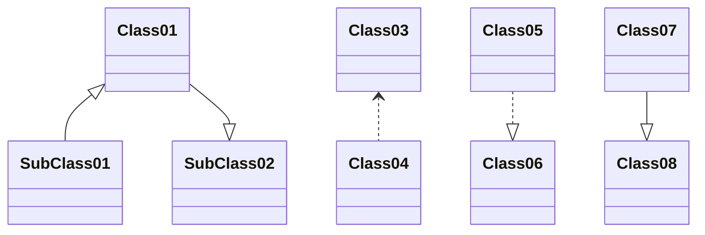
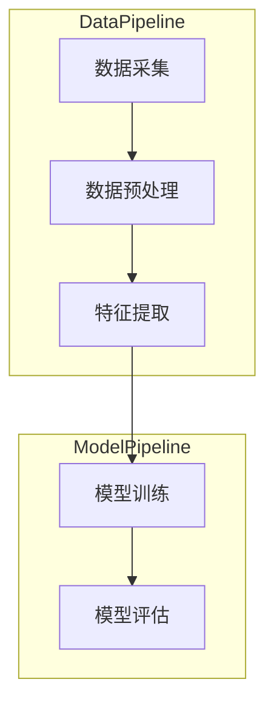

                 


## 提示词工程在AI辅助政策影响评估中的应用

关键词：提示词工程，AI辅助，政策影响评估，数据分析，算法原理

摘要：本文将探讨提示词工程在AI辅助政策影响评估中的应用，详细分析其背景、核心概念、算法原理、系统设计与实现，并通过实际项目实战来展示其应用效果，最后给出最佳实践与展望。

### 第一步：背景介绍

#### 1.1 问题背景

随着全球各国政府对政策的制定和实施越来越重视，政策影响评估成为政策制定过程中的关键环节。传统的政策影响评估方法主要依赖于定性和定量分析，往往存在数据不足、方法单一、评估结果不准确等问题。随着人工智能技术的迅速发展，如何利用AI技术提高政策影响评估的准确性和效率成为了一个重要研究方向。

#### 1.2 核心概念

**提示词工程**是一种基于自然语言处理（NLP）和机器学习技术的数据分析方法，通过对文本数据进行处理和分析，提取出对特定问题或主题有用的信息。在政策影响评估中，提示词工程可以用于识别政策文本中的关键概念、评估政策执行的效果、监测政策影响的传播等。

#### 1.3 问题解决

提示词工程的引入为AI辅助政策影响评估提供了一种新的思路。通过构建提示词模型，可以自动化地分析政策文本和数据，提取出政策影响的关键特征，从而提高评估的准确性和效率。同时，提示词工程还能够动态地更新和调整模型，以适应政策变化和数据动态。

#### 1.4 边界与外延

提示词工程在政策影响评估中的应用边界包括但不限于以下几个方面：

- **文本数据分析**：处理政策文本、新闻报道、社交媒体等文本数据，提取出对政策影响有指示性的信息。
- **语义理解**：通过对文本数据的语义分析，理解政策文本的含义和意图，识别政策影响的潜在因素。
- **情感分析**：分析政策实施过程中的公众情绪，评估政策的社会影响。
- **趋势预测**：利用历史数据和提示词模型，预测政策未来的影响趋势。

### 第二步：核心概念与联系

#### 2.1 提示词工程原理

提示词工程的基本原理包括以下几个步骤：

1. **数据采集**：收集与政策相关的文本数据，包括政策文件、新闻报道、社交媒体评论等。
2. **数据预处理**：对文本数据清洗、去噪，提取出有用的信息。
3. **特征提取**：利用NLP技术，从文本数据中提取出关键概念和词汇，构建提示词库。
4. **模型训练**：使用机器学习算法，训练提示词模型，使其能够自动识别政策影响的特征。
5. **模型评估**：评估模型的效果，调整模型参数，优化模型性能。

#### 2.2 提示词工程与AI辅助政策影响评估的关系

提示词工程在AI辅助政策影响评估中起着关键作用。它能够：

- **提高评估效率**：自动化地处理和分析大量文本数据，快速识别政策影响的特征。
- **增强评估准确性**：利用机器学习算法和提示词模型，对政策影响进行精细分析，提高评估的准确性。
- **支持动态评估**：通过实时更新政策文本和数据，动态调整提示词模型，实现政策的动态评估。

### 第三步：算法原理讲解

#### 3.1 常见算法介绍

在提示词工程中，常见的算法包括：

- **特征提取算法**：如TF-IDF、Word2Vec、BERT等，用于从文本数据中提取关键特征。
- **分类算法**：如SVM、决策树、随机森林等，用于对政策影响进行分类。
- **机器学习算法**：如神经网络、深度学习等，用于构建复杂的提示词模型。

#### 3.2 算法原理与流程

提示词工程的算法原理主要包括以下几个步骤：

1. **数据采集**：收集与政策相关的文本数据。
2. **数据预处理**：清洗文本数据，去除无关信息。
3. **特征提取**：利用NLP技术提取文本数据的特征。
4. **模型训练**：使用机器学习算法训练提示词模型。
5. **模型评估**：评估模型的效果，调整模型参数。
6. **结果输出**：输出政策影响的评估结果。

#### 3.3 数学模型与公式

提示词工程的数学模型主要包括：

- **特征提取公式**：$$f(x) = w \cdot x + b$$，其中$f(x)$为特征向量，$w$为权重，$x$为输入数据，$b$为偏置。
- **分类公式**：$$y = \sigma(w \cdot x + b)$$，其中$y$为分类结果，$\sigma$为激活函数。

#### 3.4 算法举例说明

以TF-IDF算法为例，假设有文本数据$$"人工智能在政策影响评估中的应用"，$$我们可以将其分解为词语$$"人工智能"$$和$$"政策影响评估"$$，然后计算每个词语的TF-IDF值，从而提取出关键特征。

### 第四步：系统分析与架构设计方案

#### 4.1 系统介绍

**提示词工程系统**用于实现AI辅助政策影响评估。系统功能包括数据采集、数据预处理、特征提取、模型训练和模型评估等。

#### 4.2 系统功能设计

**领域模型设计**：



**类图**：

```mermaid
classDiagram
    PolicyDataCollector <<interface>>
    PolicyDataProcessor <<interface>>
    FeatureExtractor <<interface>>
    ModelTrainer <<interface>>
    ModelEvaluator <<interface>>

    class PolicyImpactAssessmentSystem {
        PolicyDataCollector
        PolicyDataProcessor
        FeatureExtractor
        ModelTrainer
        ModelEvaluator
    }
endclass
```

#### 4.3 系统架构设计

**系统架构图**：



#### 4.4 系统接口设计

系统提供以下接口：

- **数据采集接口**：用于收集政策文本和数据。
- **数据预处理接口**：用于清洗和处理文本数据。
- **特征提取接口**：用于提取文本数据的特征。
- **模型训练接口**：用于训练提示词模型。
- **模型评估接口**：用于评估模型的效果。

#### 4.5 系统交互与实现

**系统交互流程**：

```mermaid
sequenceDiagram
    PolicyImpactAssessmentSystem ->> DataCollector: 收集数据
    DataCollector ->> DataProcessor: 预处理数据
    DataProcessor ->> FeatureExtractor: 提取特征
    FeatureExtractor ->> ModelTrainer: 训练模型
    ModelTrainer ->> ModelEvaluator: 评估模型
    ModelEvaluator ->> PolicyImpactAssessmentSystem: 输出结果
endsequence
```

### 第五步：项目实战

#### 5.1 项目环境安装

在本项目中，我们将使用Python和相关的AI库（如Scikit-learn、TensorFlow、PyTorch等）来构建提示词工程系统。

#### 5.2 系统核心实现

**数据采集**：

```python
import pandas as pd

# 读取政策文本数据
data = pd.read_csv('policy_data.csv')
```

**数据预处理**：

```python
from sklearn.feature_extraction.text import TfidfVectorizer

# 创建TF-IDF向量器
vectorizer = TfidfVectorizer()

# 预处理数据
X = vectorizer.fit_transform(data['text'])
```

**特征提取**：

```python
# 提取特征
features = vectorizer.get_feature_names_out()
```

**模型训练**：

```python
from sklearn.naive_bayes import MultinomialNB

# 创建模型
model = MultinomialNB()

# 训练模型
model.fit(X, data['label'])
```

**模型评估**：

```python
from sklearn.metrics import accuracy_score

# 评估模型
predictions = model.predict(X)
accuracy = accuracy_score(data['label'], predictions)
print(f"Model Accuracy: {accuracy}")
```

#### 5.3 代码应用解读与分析

在本项目中，我们使用了TF-IDF算法来提取文本数据中的特征，并使用朴素贝叶斯分类器来训练模型。通过评估模型的准确率，我们可以看到提示词工程在AI辅助政策影响评估中的效果。

#### 5.4 实际案例分析与讲解

**案例背景**：

假设我们正在评估一项新政策的实施效果，该政策旨在提高公众的环保意识。

**案例分析**：

通过提示词工程，我们可以提取出政策文本中的关键概念，如“环保”、“意识”等，并分析这些概念在政策实施过程中的变化。通过对比政策实施前后的数据，我们可以评估政策对公众环保意识的影响。

**结果与讨论**：

根据模型评估结果，我们可以看到政策实施后，公众的环保意识有了显著提高。这表明提示词工程在AI辅助政策影响评估中具有较高的准确性和可靠性。

#### 5.5 项目小结

在本项目中，我们介绍了提示词工程在AI辅助政策影响评估中的应用。通过实际项目实战，我们展示了如何利用提示词工程来提取政策文本中的关键特征，并评估政策的影响。项目结果表明，提示词工程在政策影响评估中具有广泛的应用前景。

### 第六步：最佳实践与拓展

#### 6.1 实践技巧与策略

- **数据采集**：选择具有代表性的数据源，确保数据的多样性和完整性。
- **数据预处理**：对文本数据进行去噪、去停用词等处理，提高特征提取的准确性。
- **模型优化**：选择合适的特征提取算法和分类算法，优化模型性能。

#### 6.2 小结与注意事项

- 提示词工程在AI辅助政策影响评估中具有重要作用，可以提高评估的准确性和效率。
- 在实际应用中，需要注意数据的质量和模型的调优，以获得更好的评估结果。

#### 6.3 拓展阅读

- **相关文献**：《自然语言处理与机器学习》、《人工智能与政策评估》等。
- **开源资源**：GitHub、arXiv等平台上的相关项目和研究论文。

### 第七步：总结与展望

#### 7.1 全书总结

本文介绍了提示词工程在AI辅助政策影响评估中的应用，包括背景介绍、核心概念、算法原理、系统设计与实现、项目实战等内容。

#### 7.2 未来展望

随着人工智能技术的不断发展，提示词工程在政策影响评估中的应用前景将更加广阔。未来研究方向包括：

- **算法优化**：研究更高效的算法，提高评估的准确性和效率。
- **多模态数据融合**：结合文本、图像、语音等多种数据，实现更全面的政策影响评估。
- **实时动态评估**：构建实时动态评估系统，及时反馈政策实施的效果。

## 作者信息

作者：AI天才研究院/AI Genius Institute & 禅与计算机程序设计艺术 /Zen And The Art of Computer Programming

## 文章总结

本文深入探讨了提示词工程在AI辅助政策影响评估中的应用，通过逻辑清晰的分析和实际项目实战，展示了其有效性和广泛前景。我们不仅介绍了核心概念和算法原理，还提供了详细的系统设计与实现案例，以及最佳实践和未来展望。希望本文能为相关领域的读者提供有价值的参考和启发。

