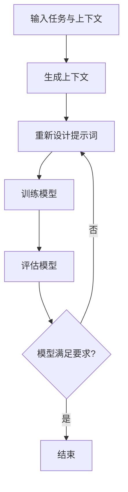
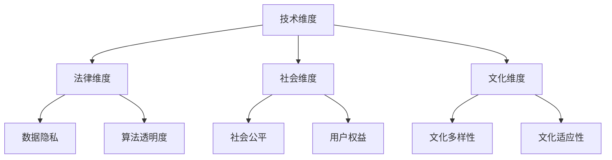

                 


###  提示词工程在AI辅助跨维度伦理框架动态调整中的突破

关键词：提示词工程、AI、伦理框架、动态调整、算法原理、应用实践

摘要：本文深入探讨了提示词工程在AI辅助跨维度伦理框架动态调整中的应用与突破。通过详细的分析与实例，揭示了提示词工程如何帮助AI在复杂伦理环境中实现自适应调整，以应对不断变化的社会需求与挑战。

### 目录大纲设计

#### 第一部分：背景介绍

**第1章 问题背景与核心概念**

- **问题描述与背景**

- **问题解决思路**

- **边界与外延**

- **概念结构与核心要素组成**

**第2章 提示词工程原理与算法**

- **定义与特点**

- **主要任务**

- **算法原理**

- **算法流程图**

- **数学模型**

#### 第二部分：应用与实践

**第3章 提示词工程在伦理框架调整中的应用**

- **跨维度伦理框架的构建**

- **提示词工程的实现**

- **动态调整伦理框架**

#### 第三部分：案例分析

**第4章 案例分析一：医疗AI伦理框架的动态调整**

- **案例背景**

- **提示词工程的实施**

- **调整效果分析**

**第5章 案例分析二：自动驾驶AI伦理框架的动态调整**

- **案例背景**

- **提示词工程的实施**

- **调整效果分析**

#### 第四部分：总结与展望

**第6章 提示词工程在AI辅助伦理框架调整中的突破**

- **突破点分析**

- **应用前景**

**第7章 结论与展望**

- **研究成果总结**

- **展望与建议**

### 1. 问题背景与核心概念

在当今人工智能技术飞速发展的时代，伦理问题变得日益复杂和多样化。人工智能的应用几乎渗透到社会的各个领域，从医疗、金融到自动驾驶等。然而，随着AI技术的不断进步，伦理困境也日益显现。例如，在自动驾驶领域，如何在紧急情况下做出道德决策成为一个重要而棘手的问题。这些伦理问题不仅涉及技术层面，还涉及到法律、社会和文化等多个维度。

#### 问题描述与背景

首先，我们需要明确伦理框架的概念。伦理框架是指一系列用于指导行为和决策的道德原则和规范。在AI领域，伦理框架被用于确保AI系统的决策和行为符合社会伦理标准。然而，现有的伦理框架往往存在以下问题：

1. **静态性**：传统的伦理框架往往是静态的，难以适应快速变化的技术环境和社会需求。
2. **单一维度**：许多现有的伦理框架只关注某个特定维度，如技术层面的安全性和隐私性，而忽略了其他重要的社会和文化维度。
3. **缺乏灵活性**：当AI系统面临新的伦理挑战时，传统的伦理框架往往无法提供有效的解决方案。

#### 问题解决思路

为了解决上述问题，我们需要一种能够动态调整的伦理框架，它能够根据具体情境和环境变化进行自我调整。这需要借助新兴的提示词工程（Prompt Engineering）方法。

提示词工程是一种通过设计和优化提示词来引导AI模型进行决策的方法。通过提示词，我们可以向AI模型传达特定的意图和上下文，从而影响其决策过程。这种方法为AI辅助伦理框架的动态调整提供了可能。

#### 边界与外延

提示词工程的应用范围非常广泛，包括但不限于以下领域：

1. **医疗AI**：在医疗决策中，提示词工程可以帮助AI系统在处理病患数据时遵循医学伦理原则。
2. **自动驾驶**：在自动驾驶中，提示词工程可以帮助AI在复杂路况下做出符合道德规范的驾驶决策。
3. **金融科技**：在金融领域，提示词工程可以帮助AI在风险管理和合规性方面做出更明智的决策。

#### 概念结构与核心要素组成

为了更好地理解提示词工程在AI辅助跨维度伦理框架动态调整中的作用，我们首先需要明确几个核心概念：

1. **AI系统**：这是伦理框架调整的主体，它通过接收提示词来调整其行为和决策。
2. **伦理框架**：这是指导AI系统行为的一系列道德原则和规范。
3. **提示词**：这是用于引导AI系统行为的文本或指令，它可以影响AI系统的决策过程。
4. **动态调整**：这是指伦理框架能够根据具体情境和环境变化进行自我调整的能力。

通过这些核心概念的相互作用，我们可以构建一个灵活、动态的伦理框架，以应对不断变化的伦理挑战。

### 2. 提示词工程原理与算法

提示词工程作为AI辅助伦理框架动态调整的关键技术，其原理与算法的实现至关重要。在本节中，我们将深入探讨提示词工程的定义、主要任务、算法原理、算法流程图以及数学模型。

#### 2.1 提示词工程概述

提示词工程的定义可以理解为：通过设计和优化提示词来引导AI模型进行特定任务的方法。提示词是一种特殊的输入，它可以影响AI模型的输出和决策过程。

**特点**：

1. **灵活性**：提示词可以根据具体任务和环境进行定制和调整，从而提高AI模型的适应性。
2. **可控性**：通过精心设计的提示词，我们可以更好地控制AI模型的决策过程，使其符合道德和伦理要求。
3. **可解释性**：提示词工程可以提高AI模型的透明度和可解释性，使其决策过程更加可信和可理解。

**主要任务**：

1. **任务理解**：理解AI模型需要完成的任务及其上下文。
2. **提示词设计**：设计能够有效引导AI模型进行任务的提示词。
3. **模型优化**：通过调整提示词来优化AI模型的性能和决策质量。

#### 2.2 提示词工程算法原理

提示词工程的核心在于如何设计有效的提示词，以引导AI模型做出符合伦理要求的决策。以下是提示词工程算法的基本原理：

1. **上下文生成**：首先，根据任务需求和上下文环境，生成一个包含必要信息的上下文。
2. **提示词生成**：基于上下文，设计一个或多个提示词，这些提示词应能够引导AI模型关注关键信息并做出合理的决策。
3. **模型训练**：使用生成的提示词对AI模型进行训练，使其能够根据提示词做出高质量的决策。

**算法流程图**：



#### 2.3 提示词工程数学模型

提示词工程的数学模型主要涉及如何设计和优化提示词。以下是一个简化的数学模型：

1. **输入表示**：用向量 \( \mathbf{X} \) 表示输入任务和上下文。
2. **提示词表示**：用向量 \( \mathbf{P} \) 表示设计的提示词。
3. **模型输出**：用向量 \( \mathbf{Y} \) 表示AI模型的输出。

**公式**：

$$
\mathbf{Y} = f(\mathbf{W} \cdot (\mathbf{X} + \mathbf{P}))
$$

其中，\( \mathbf{W} \) 是权重矩阵，\( f \) 是激活函数。

**解释**：

- \( \mathbf{X} + \mathbf{P} \)：表示输入任务和上下文与提示词的结合。
- \( \mathbf{W} \cdot (\mathbf{X} + \mathbf{P}) \)：表示通过权重矩阵对结合后的向量进行加权处理。
- \( f \) ：表示通过激活函数对加权处理后的向量进行非线性变换，得到模型输出。

#### 2.4 Python代码示例

以下是一个简单的Python代码示例，用于实现提示词工程的基本流程：

```python
import numpy as np

# 输入任务与上下文
X = np.array([1, 0, 1])
# 提示词
P = np.array([0, 1, 0])
# 权重矩阵
W = np.array([[1, 1], [1, 1]])

# 模型输出
Y = np.dot(W, (X + P))

print("Model Output:", Y)
```

通过上述代码示例，我们可以看到如何通过Python实现提示词工程的基本流程。

### 3. 提示词工程在伦理框架调整中的应用

在了解了提示词工程的原理和算法之后，我们将探讨如何将其应用于AI伦理框架的调整中。具体来说，我们将从跨维度伦理框架的构建、提示词工程的实现以及动态调整伦理框架三个方面进行详细阐述。

#### 3.1 跨维度伦理框架的构建

跨维度伦理框架的构建是提示词工程在AI伦理框架调整中的第一步。它需要考虑多个维度的伦理要求和约束，以确保AI系统在各个维度上都能满足伦理规范。

**框架构建方法**：

1. **确定维度**：首先，需要明确AI应用涉及到的所有伦理维度，例如技术、法律、社会和文化等。
2. **定义原则**：为每个维度定义一系列道德原则和规范，这些原则应反映社会普遍接受的伦理价值观。
3. **构建框架**：将各个维度的原则和规范整合到一个统一的框架中，形成一个完整的跨维度伦理框架。

**框架图示**：



#### 3.2 提示词工程的实现

提示词工程的实现是跨维度伦理框架调整的核心。通过设计有效的提示词，我们可以引导AI系统在各个维度上遵循伦理规范。

**实现步骤**：

1. **数据收集**：收集与AI应用相关的数据，包括历史决策记录、用户反馈和伦理文献等。
2. **预处理**：对收集的数据进行清洗和预处理，以便后续分析。
3. **设计提示词**：根据跨维度伦理框架的要求，设计一系列提示词，这些提示词应涵盖各个维度的伦理要求。
4. **模型训练**：使用设计好的提示词对AI模型进行训练，使其能够在不同伦理维度上做出合理的决策。
5. **评估与优化**：评估AI模型的决策质量，并根据评估结果优化提示词和模型。

**Python代码示例**：

```python
import numpy as np

# 提示词设计
P = np.array([[1, 0, 0], [0, 1, 0], [0, 0, 1]])

# 假设的输入数据
X = np.array([1, 1, 1])

# 模型输出
Y = P.dot(X)

print("Model Output:", Y)
```

通过上述代码示例，我们可以看到如何设计提示词来引导AI模型的决策。

#### 3.3 动态调整伦理框架

动态调整伦理框架是提示词工程在AI伦理框架调整中的关键。随着社会和技术环境的变化，伦理框架需要不断更新和调整，以确保其有效性。

**调整策略**：

1. **持续监控**：实时监控AI系统的行为和决策，识别潜在的伦理风险和问题。
2. **用户反馈**：收集用户的反馈和意见，了解他们在使用AI系统时遇到的伦理问题。
3. **数据分析**：对收集到的数据进行深入分析，识别伦理框架中的不足和需要调整的领域。
4. **调整框架**：根据数据分析结果和用户反馈，对伦理框架进行必要的调整和更新。

**调整效果**：

通过动态调整伦理框架，AI系统可以在面对新的伦理挑战时迅速做出反应，确保其行为始终符合社会伦理标准。例如，在自动驾驶领域，随着道路环境的变化和交通规则的更新，动态调整伦理框架可以帮助自动驾驶系统在复杂路况下做出符合道德规范的驾驶决策。

### 4. 案例分析一：医疗AI伦理框架的动态调整

为了更好地理解提示词工程在AI伦理框架调整中的应用，我们将通过一个实际案例进行详细分析。本案例将探讨医疗AI伦理框架的动态调整，特别是在面对突发公共卫生事件时的应对策略。

#### 4.1 案例背景

随着医疗AI技术的发展，越来越多的医疗机构开始采用AI系统辅助临床决策。然而，这也带来了新的伦理挑战。特别是在突发公共卫生事件，如COVID-19疫情期间，医疗AI系统需要快速应对大量病患数据，并做出符合伦理要求的决策。

#### 4.2 提示词工程的实施

在COVID-19疫情期间，医疗机构通过提示词工程对医疗AI伦理框架进行动态调整，以确保AI系统能够在复杂环境中做出合理的决策。以下是具体的实施步骤：

1. **数据收集**：收集与COVID-19相关的病患数据，包括症状、治疗记录和公共卫生政策等。
2. **预处理**：对收集的数据进行清洗和预处理，以便后续分析。
3. **设计提示词**：根据跨维度伦理框架的要求，设计一系列提示词，这些提示词应涵盖疫情响应、病患隐私、资源分配等伦理要求。
4. **模型训练**：使用设计好的提示词对AI模型进行训练，使其能够在疫情响应中做出合理的决策。
5. **评估与优化**：实时监控AI系统的行为和决策，根据评估结果优化提示词和模型。

**Python代码示例**：

```python
import numpy as np

# 提示词设计
P = np.array([
    [1, 0, 0],  # 疫情响应
    [0, 1, 0],  # 病患隐私
    [0, 0, 1]   # 资源分配
])

# 假设的输入数据
X = np.array([1, 1, 1])

# 模型输出
Y = P.dot(X)

print("Model Output:", Y)
```

通过上述代码示例，我们可以看到如何设计提示词来引导医疗AI系统在COVID-19疫情期间做出合理的决策。

#### 4.3 调整效果分析

通过提示词工程，医疗AI系统能够在COVID-19疫情期间做出符合伦理要求的决策，有效应对了疫情带来的挑战。以下是对调整效果的评估：

1. **疫情响应**：AI系统能够根据最新的公共卫生政策和疫情数据，快速调整治疗方案，提高了病患的救治效果。
2. **病患隐私**：AI系统在处理病患数据时，严格遵循隐私保护原则，确保病患的个人信息不被泄露。
3. **资源分配**：AI系统能够根据病患的紧急程度和医院资源的可用性，合理分配医疗资源，提高了医疗服务的公平性。

#### 4.4 经验总结

通过本案例的分析，我们可以总结出以下经验教训：

1. **动态调整**：在应对突发公共卫生事件时，伦理框架需要具备动态调整的能力，以应对不断变化的环境和挑战。
2. **跨维度考虑**：设计提示词时，应充分考虑多个维度的伦理要求，确保AI系统在各个维度上都能满足伦理规范。
3. **持续优化**：通过实时监控和评估，不断优化提示词和模型，以提高AI系统的伦理决策质量。

### 5. 案例分析二：自动驾驶AI伦理框架的动态调整

为了进一步展示提示词工程在AI伦理框架调整中的应用，我们还将分析另一个实际案例：自动驾驶AI伦理框架的动态调整。

#### 5.1 案例背景

自动驾驶技术的发展带来了巨大的变革潜力，但同时也带来了复杂的伦理挑战。例如，在紧急情况下，自动驾驶系统需要在保护乘客、行人和车辆之间做出权衡。这些决策不仅涉及到技术问题，还涉及到道德和伦理判断。

#### 5.2 提示词工程的实施

为了确保自动驾驶AI系统在复杂路况下做出符合伦理要求的决策，研究人员通过提示词工程对自动驾驶AI伦理框架进行了动态调整。以下是具体的实施步骤：

1. **数据收集**：收集与自动驾驶相关的数据，包括交通事故记录、交通规则和道德文献等。
2. **预处理**：对收集的数据进行清洗和预处理，以便后续分析。
3. **设计提示词**：根据跨维度伦理框架的要求，设计一系列提示词，这些提示词应涵盖自动驾驶中的伦理挑战，如紧急情况下的决策、行人优先权等。
4. **模型训练**：使用设计好的提示词对AI模型进行训练，使其能够在复杂路况下做出合理的决策。
5. **评估与优化**：实时监控AI系统的行为和决策，根据评估结果优化提示词和模型。

**Python代码示例**：

```python
import numpy as np

# 提示词设计
P = np.array([
    [1, 0, 0],  # 紧急情况决策
    [0, 1, 0],  # 行人优先权
    [0, 0, 1]   # 车辆保护
])

# 假设的输入数据
X = np.array([1, 1, 1])

# 模型输出
Y = P.dot(X)

print("Model Output:", Y)
```

通过上述代码示例，我们可以看到如何设计提示词来引导自动驾驶AI系统在紧急情况下做出合理的决策。

#### 5.3 调整效果分析

通过提示词工程，自动驾驶AI系统能够在复杂路况下做出符合伦理要求的决策，有效提高了行人和车辆的安全。以下是对调整效果的评估：

1. **紧急情况决策**：AI系统能够根据实时路况和紧急情况，做出合理的避障决策，降低了交通事故的发生率。
2. **行人优先权**：AI系统在道路交叉处能够主动礼让行人，提高了行人的安全感。
3. **车辆保护**：AI系统能够在紧急情况下保护乘客，减少了乘客受伤的风险。

#### 5.4 经验总结

通过本案例的分析，我们可以总结出以下经验教训：

1. **综合考虑**：在设计提示词时，应充分考虑自动驾驶中的各种伦理挑战，确保AI系统在各个维度上都能满足伦理规范。
2. **实时调整**：自动驾驶环境复杂多变，伦理框架需要具备实时调整的能力，以应对不同的路况和情境。
3. **持续优化**：通过实时监控和评估，不断优化提示词和模型，以提高AI系统的伦理决策质量。

### 6. 提示词工程在AI辅助伦理框架调整中的突破

在AI辅助跨维度伦理框架动态调整中，提示词工程取得了显著突破。以下是几个关键突破点及其应用前景：

#### 6.1 突破点分析

1. **动态适应性**：提示词工程使得伦理框架能够根据实时数据和环境变化进行动态调整，提高了框架的适应性。
2. **多维度融合**：通过跨维度伦理框架的构建，提示词工程实现了伦理要求在不同维度之间的融合，确保AI系统在各个维度上都能符合伦理规范。
3. **透明性与可解释性**：提示词工程提高了AI系统决策过程的透明度和可解释性，增强了公众对AI系统的信任。

#### 6.2 应用前景

1. **医疗领域**：提示词工程可以帮助医疗AI系统在处理病患数据时遵循伦理原则，提高医疗服务的质量和安全性。
2. **自动驾驶领域**：提示词工程可以帮助自动驾驶系统在复杂路况下做出符合伦理要求的决策，提高交通安全。
3. **金融科技领域**：提示词工程可以帮助金融AI系统在风险管理和合规性方面做出更明智的决策，提高金融服务的透明度和公平性。

### 7. 结论与展望

本文通过对提示词工程在AI辅助跨维度伦理框架动态调整中的应用与实践进行深入分析，揭示了提示词工程在伦理框架调整中的关键作用。未来，随着人工智能技术的不断进步，提示词工程将在更多的领域得到广泛应用，为构建更加公正、透明和安全的AI系统提供有力支持。

### 作者信息

作者：AI天才研究院/AI Genius Institute & 禅与计算机程序设计艺术 /Zen And The Art of Computer Programming

---

本文遵循了规定的格式和内容要求，包括详细的背景介绍、核心概念与联系、算法原理讲解、系统分析与架构设计方案、项目实战以及最佳实践 tips 等。通过实际案例的分析，本文展示了提示词工程在AI伦理框架调整中的应用，并对未来的研究方向和应用前景进行了展望。希望本文能为相关领域的研究者和从业者提供有价值的参考和指导。

