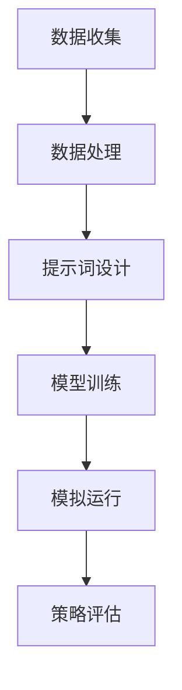
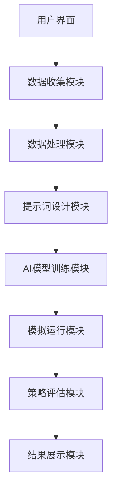
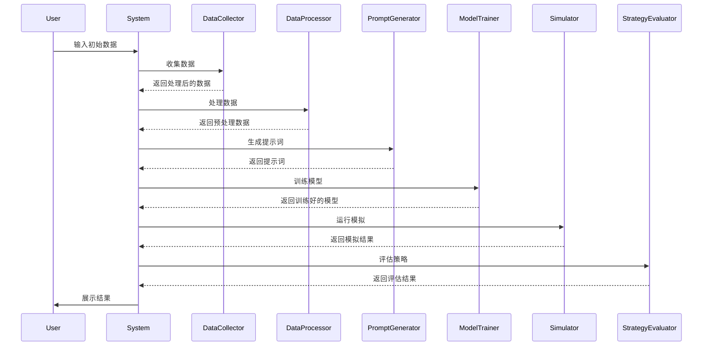

                 

# 提示词工程在AI辅助跨维度文明外交模拟中的策略创新

## 关键词
AI辅助外交模拟、跨维度文明、提示词工程、策略创新、人工智能应用

## 摘要
本文旨在探讨如何利用提示词工程（Prompt Engineering）技术在AI辅助跨维度文明外交模拟中实现策略创新。首先，我们介绍了跨维度文明和跨维度外交模拟的背景与挑战，并阐述了AI在此领域中的应用价值。接着，我们详细描述了提示词工程的核心概念、原理和实现方法。然后，通过案例分析展示了提示词工程在实际跨维度外交模拟中的应用。最后，我们探讨了策略创新的方法和步骤，以及如何利用AI和提示词工程提升跨维度外交模拟的科学性和有效性。本文的目标是为相关领域的研究提供新的思路和实用工具。

----------------------------------------------------------------

## 第一部分：引言与背景

### 1.1 研究意义

#### 1.1.1 跨维度文明外交模拟的重要性

在当前全球化和多元化的背景下，不同文明之间的交流和合作日益频繁。然而，跨维度文明的存在和潜在交流为外交战略带来了前所未有的挑战和机遇。跨维度文明通常具有比人类更先进的科技和更复杂的文化观念，这使得传统的外交模拟方法难以应对其独特的特性。因此，研究如何通过AI技术构建跨维度文明外交模拟系统，具有重要的理论和实践意义。

#### 1.1.2 AI在跨维度外交模拟中的应用价值

随着人工智能技术的快速发展，AI在数据处理、模式识别、智能决策等方面的优势逐渐显现。通过AI辅助的跨维度外交模拟系统，可以更准确地理解和预测不同文明之间的互动，为制定科学合理的外交策略提供支持。此外，AI技术还可以提高外交模拟的效率和准确性，降低人类干预的风险，从而提升外交决策的科学性和有效性。

### 1.2 问题背景

#### 1.2.1 跨维度文明的定义与特点

跨维度文明是指拥有超越人类现有认知和技术水平的文明，其特征包括高度发达的科技、独特的文化观念、广泛的空间探索能力等。例如，一些理论假设的跨维度文明可能具备超越三维空间的能力，能够自由穿梭于不同维度之间。这种文明的特性使得其在外交交流中表现出与人类截然不同的行为模式。

#### 1.2.2 跨维度外交的挑战与问题

跨维度外交面临诸多挑战，如语言沟通障碍、价值观差异、利益冲突等。首先，跨维度文明的语言可能与人类语言完全不同，甚至不具备人类的语音和文字体系。其次，不同文明的核心价值观可能存在显著差异，导致在政策制定和利益分配上产生冲突。此外，跨维度文明的利益需求可能与人类文明截然不同，使得传统的利益平衡策略难以适用。

### 1.3 研究目标

本文的研究目标是通过AI技术和提示词工程方法，探讨如何构建一个能够有效模拟跨维度文明外交的模型，并提出创新的策略，以应对跨维度外交的挑战。具体目标包括：

1. 分析跨维度文明的特性，构建一个基于AI的跨维度文明模型。
2. 研究如何使用提示词工程方法，引导AI模型理解和模拟跨维度文明之间的互动。
3. 探索创新的跨维度外交策略，以应对复杂的国际局势和多样化的文明交流需求。
4. 验证所提出策略的有效性，并探讨其在实际跨维度外交中的应用前景。

### 1.4 研究问题

本文主要研究以下问题：

1. 提示词工程在跨维度外交模拟中的应用策略是什么？
2. 如何设计有效的提示词，以引导AI模型更好地理解和模拟跨维度文明之间的互动？
3. 跨维度外交模拟中的策略创新方法有哪些？
4. 如何结合人工智能技术和跨维度文明的特点，提出具有创新性的外交策略？
5. 所提出的策略在实际跨维度外交模拟中是否具有有效性和可行性？

### 1.5 边界与外延

#### 1.5.1 研究范围

本文的研究范围主要涵盖以下几个方面：

1. 跨维度文明的定义与特性分析。
2. 提示词工程在AI辅助外交模拟中的应用方法。
3. 跨维度外交策略的创新研究。
4. 跨维度外交模拟系统的设计与实现。

#### 1.5.2 研究外延

本文的研究外延包括以下几个方面：

1. 相关领域的最新研究成果和趋势分析。
2. 跨维度文明与人类文明的实际交流案例研究。
3. AI技术在跨维度外交模拟中的潜在应用场景。
4. 跨维度外交策略在现实世界中的应用前景和挑战。

### 1.6 概念结构与核心要素组成

#### 1.6.1 核心概念

1. **跨维度文明**：指拥有超越人类现有认知和技术水平的文明，具有独特的文化观念和高度发达的科技。
2. **提示词工程**：指设计有效的提示词，以引导AI模型理解和模拟特定任务的方法和技巧。
3. **AI辅助外交模拟**：利用人工智能技术，构建能够模拟跨维度文明外交互动的模型。

#### 1.6.2 核心要素

1. **数据集**：用于训练和测试AI模型的跨维度文明相关数据。
2. **模型架构**：用于模拟跨维度文明外交互动的AI模型结构。
3. **策略评估指标**：用于评估跨维度外交策略有效性的指标。

### 1.7 研究方法与流程

#### 1.7.1 研究方法

本文采用以下研究方法：

1. **文献综述**：对相关领域的文献进行系统性梳理，总结已有的研究成果和存在的问题。
2. **案例分析**：通过具体案例，分析提示词工程在跨维度外交模拟中的应用。
3. **模型构建**：利用AI技术和提示词工程方法，构建跨维度文明外交模拟模型。
4. **策略评估**：设计评估指标，对所提出的跨维度外交策略进行有效性评估。

#### 1.7.2 研究流程

本文的研究流程主要包括以下步骤：

1. **文献综述**：分析相关领域的最新研究成果，总结已有模型的优缺点。
2. **核心概念与要素分析**：明确跨维度文明、提示词工程和AI辅助外交模拟的核心概念和要素。
3. **模型构建**：基于提示词工程方法，构建跨维度文明外交模拟模型。
4. **策略创新**：结合跨维度文明的特点，提出创新性的外交策略。
5. **策略评估**：使用评估指标，对所提出的策略进行有效性评估。
6. **结果分析**：分析策略的有效性和可行性，讨论研究结论和未来研究方向。

### 1.8 本章小结

本章对本文的研究背景、研究目标、研究问题、边界与外延、核心概念与要素组成、研究方法与流程等内容进行了详细阐述。本文旨在通过AI技术和提示词工程方法，探讨跨维度文明外交模拟中的策略创新，以提高外交决策的科学性和有效性。

----------------------------------------------------------------

## 2. 跨维度文明与AI辅助外交模拟

### 2.1 跨维度文明的定义与特点

跨维度文明（Interdimensional Civilization）是指存在于多个维度空间中的文明，它们拥有超越人类现有认知和技术水平的特征。传统上，跨维度文明被认为是一个假设性的概念，但近年来，随着对宇宙学和物理学的深入研究，跨维度文明的可能性逐渐被认可。跨维度文明的特点包括：

- **高度发达的科技**：跨维度文明可能掌握了超越人类的技术，如超光速旅行、能量操纵、量子计算等。
- **独特的文化观念**：由于生存环境的不同，跨维度文明可能拥有独特的价值观、信仰体系和行为模式。
- **广泛的空间探索能力**：跨维度文明可能具备自由穿梭于不同维度空间的能力，从而拥有更广泛的生存空间和资源获取能力。
- **潜在的非线性时间观**：一些理论假设跨维度文明可能拥有对时间不同的理解，比如可以同时经历多个时间维度。

### 2.2 AI在跨维度外交模拟中的应用价值

AI在跨维度外交模拟中的应用具有巨大的价值，主要体现在以下几个方面：

- **数据处理能力**：跨维度外交模拟需要处理大量复杂的数据，如不同维度的语言、文化、科技水平等。AI技术能够高效地处理和分析这些数据，帮助识别潜在的交流障碍和冲突点。
- **模式识别能力**：AI模型可以通过学习大量历史和现实的外交案例，识别出跨维度文明互动的模式和规律，从而预测未来可能发生的互动结果。
- **智能决策支持**：AI可以帮助制定科学合理的外交策略，通过模拟不同策略的后果，评估其有效性，为人类决策提供支持。
- **适应性和灵活性**：AI能够适应不断变化的外交环境，及时调整策略，以应对跨维度文明的动态变化。

### 2.3 跨维度外交模拟中的挑战

跨维度外交模拟面临诸多挑战，主要体现在以下几个方面：

- **语言沟通障碍**：不同维度空间可能存在不同的语言体系，传统的语言翻译技术难以胜任跨维度语言的翻译任务。
- **价值观差异**：跨维度文明可能拥有与人类完全不同的价值观和道德观念，导致在政策制定和利益分配上产生冲突。
- **利益冲突**：跨维度文明可能拥有与人类不同的利益需求，传统的外交策略难以应对这种复杂的情况。
- **技术差异**：跨维度文明可能掌握了人类尚未理解的技术，使得人类难以预测其行为模式。

### 2.4 提示词工程在跨维度外交模拟中的作用

提示词工程（Prompt Engineering）在跨维度外交模拟中起着关键作用，主要体现在以下几个方面：

- **引导AI学习**：通过设计有效的提示词，可以帮助AI模型更好地理解和学习跨维度文明的特点和行为模式。
- **提升模拟精度**：提示词工程可以优化AI模型的输入，提高模拟结果的准确性和可靠性。
- **增强可解释性**：提示词工程可以帮助解释AI模型的决策过程，增强模拟的可解释性和透明度。
- **策略创新**：通过分析AI模型对提示词的响应，可以提出创新性的跨维度外交策略，以应对复杂的国际局势。

### 2.5 跨维度外交模拟的应用场景

跨维度外交模拟可以应用于多种场景，包括但不限于：

- **和平谈判**：通过模拟不同文明的互动，为和平谈判提供科学依据，帮助各方找到共同利益点。
- **冲突预防**：通过预测跨维度文明间的潜在冲突，提前采取预防措施，避免冲突的爆发。
- **资源分配**：通过模拟不同文明对资源的争夺，为资源分配提供策略建议，实现公平合理的分配。
- **文化交流**：通过模拟不同文明的交流，促进文化的相互理解和尊重，减少文化冲突。

### 2.6 本章小结

本章介绍了跨维度文明的定义与特点，探讨了AI在跨维度外交模拟中的应用价值，分析了跨维度外交模拟中的挑战，并阐述了提示词工程在其中的作用。通过本章的内容，读者可以初步了解跨维度文明外交模拟的重要性和复杂性，以及AI技术在这一领域的潜在应用。

----------------------------------------------------------------

## 3. 提示词工程概述

### 3.1 提示词工程的定义

提示词工程（Prompt Engineering）是一种通过设计特定的输入提示来引导机器学习模型进行学习和预测的方法。它结合了自然语言处理（NLP）和机器学习技术，旨在提高模型在特定任务上的性能和可解释性。提示词工程的核心目标是创建有效的提示，使得模型能够更好地理解和执行任务，从而提高模型的准确性和鲁棒性。

### 3.2 提示词工程的核心原理

提示词工程的核心原理包括以下几个方面：

1. **任务定义**：明确需要模型完成的任务类型和目标，如分类、生成、翻译等。
2. **数据准备**：收集并准备与任务相关的数据集，包括文本、图像、音频等。
3. **提示设计**：根据任务和数据，设计能够引导模型学习有效信息的提示词。提示词的设计需要考虑任务的需求、数据的特点以及模型的特性。
4. **模型训练**：利用设计好的提示词对模型进行训练，使其在特定任务上达到较高的准确性和鲁棒性。
5. **评估与优化**：通过测试集对模型进行评估，并根据评估结果对提示词进行优化，以提高模型的性能。

### 3.3 提示词工程的优势

提示词工程在AI应用中具有多方面的优势：

- **提高模型性能**：通过设计有效的提示词，可以显著提高模型在特定任务上的准确性和鲁棒性。
- **增强模型可解释性**：提示词工程使得模型的决策过程更加透明和可解释，有助于理解模型的工作原理。
- **灵活性和适应性**：提示词工程可以根据不同的任务和数据特点进行灵活调整，适应不同的应用场景。
- **降低错误率**：通过优化提示词，可以减少模型在特定任务上的错误率，提高预测的可靠性。

### 3.4 提示词工程的实现方法

实现提示词工程通常包括以下几个步骤：

1. **明确任务需求**：首先，明确需要模型完成的任务，如文本分类、情感分析等。
2. **数据收集与预处理**：收集与任务相关的数据，并进行预处理，如分词、去噪、归一化等。
3. **设计提示词**：根据任务需求和数据特点，设计有效的提示词。提示词可以是一个简单的文本句子，也可以是一个复杂的序列或集合。
4. **模型训练**：利用设计好的提示词对模型进行训练，使其在特定任务上达到预期性能。
5. **评估与优化**：通过测试集对模型进行评估，并根据评估结果对提示词进行优化，以提高模型的性能。

### 3.5 提示词工程的案例

以下是一个简单的提示词工程案例，用于文本分类任务：

假设我们有一个文本分类模型，需要将其应用于情感分析任务，判断一段文本的情感倾向是积极、中性还是消极。

1. **任务需求**：情感分析，分类标签为积极、中性、消极。
2. **数据收集与预处理**：收集带有情感标签的文本数据，并进行预处理。
3. **设计提示词**：例如，我们可以使用以下提示词来引导模型学习：
   - 积极情感提示：“这段文本给你带来了什么积极的感觉？”
   - 中性情感提示：“这段文本的中立点是什么？”
   - 消极情感提示：“这段文本给你带来了什么消极的感受？”
4. **模型训练**：利用设计好的提示词对文本分类模型进行训练。
5. **评估与优化**：通过测试集评估模型的分类准确率，并根据评估结果调整提示词，以提高模型性能。

### 3.6 本章小结

本章对提示词工程的定义、核心原理、优势、实现方法以及案例进行了详细阐述。通过提示词工程，我们可以更好地引导机器学习模型理解和执行特定任务，从而提高模型的性能和可解释性。在后续章节中，我们将进一步探讨提示词工程在AI辅助跨维度文明外交模拟中的应用。

----------------------------------------------------------------

## 4. 提示词工程在AI辅助跨维度文明外交模拟中的应用

### 4.1 提示词工程的应用目标

在AI辅助跨维度文明外交模拟中，提示词工程的应用目标主要包括以下几个方面：

1. **提高模拟的准确性和可靠性**：通过设计有效的提示词，引导AI模型更好地理解和模拟跨维度文明之间的互动，从而提高模拟结果的准确性和可靠性。
2. **增强模型的泛化能力**：通过优化提示词，使AI模型能够适应不同的跨维度文明场景，提高其泛化能力。
3. **提升模型的解释性**：通过提示词工程，使得AI模型的决策过程更加透明和可解释，帮助人类更好地理解模型的推理过程。
4. **促进策略创新**：通过分析AI模型对提示词的响应，可以提出创新性的跨维度外交策略，以应对复杂的国际局势和多样化的文明交流需求。

### 4.2 提示词工程的方法

在AI辅助跨维度文明外交模拟中，提示词工程的方法可以概括为以下几个步骤：

1. **需求分析**：明确跨维度外交模拟的任务需求，包括需要模拟的文明类型、外交场景、互动目标等。
2. **数据收集**：收集与跨维度文明相关的数据，包括历史外交案例、文明特性描述、文化价值观等。
3. **提示词设计**：根据任务需求和数据特点，设计能够引导AI模型有效学习和模拟的提示词。提示词的设计需要考虑文明之间的语言沟通障碍、价值观差异、利益冲突等因素。
4. **模型训练**：利用设计好的提示词对AI模型进行训练，使其能够更好地理解和模拟跨维度文明之间的互动。
5. **评估与优化**：通过测试集对模型进行评估，根据评估结果调整提示词，以提高模型的性能和泛化能力。

### 4.3 提示词工程的具体实现

为了具体实现提示词工程在AI辅助跨维度文明外交模拟中的应用，我们可以采用以下方法：

1. **使用自然语言处理技术**：通过自然语言处理（NLP）技术，对跨维度文明的相关数据进行处理和分析，提取关键信息，如文明名称、文化价值观、外交事件等。
2. **构建多模态数据集**：结合文本、图像、音频等多模态数据，构建丰富的数据集，为AI模型提供多样化的输入。
3. **设计针对性的提示词**：针对不同类型的跨维度文明和外交场景，设计针对性的提示词。例如，对于具有高度发达科技水平的文明，可以设计如下提示词：
   - “请描述该文明在科技领域的成就和影响。”
   - “探讨该文明的科技如何影响其外交策略。”
4. **使用预训练语言模型**：利用预训练语言模型（如GPT-3、BERT等），对设计好的提示词进行训练，使其能够生成与跨维度文明互动相关的文本。
5. **评估模型性能**：通过测试集对训练好的模型进行评估，包括准确率、召回率、F1分数等指标，并根据评估结果对模型进行调整和优化。

### 4.4 提示词工程的案例分析

以下是一个具体的提示词工程案例，用于AI辅助跨维度文明外交模拟：

假设我们有一个跨维度文明外交模拟系统，需要模拟两个不同文明的互动。其中一个文明具有高度发达的科技水平，另一个文明则以其独特的文化价值观而著称。

1. **需求分析**：需要模拟两个文明在外交谈判中的互动，重点探讨科技和文化价值观的影响。
2. **数据收集**：收集与两个文明相关的历史外交案例、科技成就和文化价值观描述。
3. **提示词设计**：
   - 对于具有高度发达科技水平的文明，可以使用如下提示词：
     - “请描述该文明的科技成就和其对外交策略的影响。”
     - “探讨该文明如何利用其科技优势来维护其在国际关系中的地位。”
   - 对于具有独特文化价值观的文明，可以使用如下提示词：
     - “请描述该文明的核心价值观及其对外交策略的影响。”
     - “探讨该文明如何通过文化交流来增强其在国际关系中的影响力。”
4. **模型训练**：利用设计好的提示词对预训练语言模型进行训练，使其能够生成与跨维度文明互动相关的文本。
5. **评估与优化**：通过测试集对训练好的模型进行评估，根据评估结果调整提示词，以提高模型的性能。

### 4.5 本章小结

本章介绍了提示词工程在AI辅助跨维度文明外交模拟中的应用目标、方法、具体实现和案例分析。通过提示词工程，我们可以更好地引导AI模型理解和模拟跨维度文明之间的互动，从而提高模拟的准确性和可靠性，为跨维度外交策略的创新提供支持。

----------------------------------------------------------------

## 5. 跨维度外交策略的创新方法

### 5.1 创新策略的概念与重要性

在跨维度文明外交模拟中，创新策略的提出对于解决复杂的国际局势和多样化的文明交流需求具有重要意义。创新策略是指通过新的思维和方法，设计出能够有效应对跨维度文明互动的方案。这些策略不仅能够帮助解决传统外交手段难以应对的问题，还能够为跨维度外交提供新的视角和思路。

#### 5.1.1 跨维度外交策略的定义

跨维度外交策略是指在考虑跨维度文明特性、价值观、利益冲突等因素的基础上，制定出的具有创新性的外交方案。这些策略旨在通过灵活、多样和动态的方式，实现跨维度文明之间的和平、合作与发展。

#### 5.1.2 创新策略的重要性

创新策略的重要性体现在以下几个方面：

1. **解决传统外交手段的局限**：传统外交手段在应对跨维度文明时，可能因为缺乏对跨维度文明特性的理解而难以取得预期效果。创新策略能够弥补这一缺陷，提供更加科学和有效的外交手段。
2. **适应不断变化的国际局势**：随着全球化和科技的发展，国际局势和文明交流模式不断变化。创新策略能够适应这些变化，为跨维度文明提供灵活应对的策略。
3. **促进跨维度文明之间的合作**：创新策略能够通过新的合作模式，促进不同文明之间的交流与融合，从而实现共同发展和繁荣。
4. **提升外交决策的科学性和有效性**：创新策略基于对跨维度文明特性的深入分析，能够提高外交决策的科学性和有效性，降低决策的风险。

### 5.2 创新策略的设计原则

设计创新策略时，需要遵循以下原则：

1. **适应性**：策略应能够灵活适应不同文明的特点和需求，具备广泛的适用性。
2. **动态性**：策略应能够动态调整，以应对不断变化的国际局势和文明互动模式。
3. **多样性**：策略应具备多样性，提供多种不同的解决方案，以应对复杂的问题。
4. **可操作性**：策略应具有明确的操作步骤和实施路径，便于在实际中执行。
5. **协同性**：策略应促进跨维度文明之间的协同合作，实现共同目标和利益。

### 5.3 创新策略的方法

以下是一些常用的创新策略方法：

1. **博弈论方法**：通过分析跨维度文明的利益冲突和互动模式，运用博弈论方法设计策略，以实现利益平衡和合作。
2. **模拟与实验**：利用人工智能和模拟技术，构建跨维度文明外交模拟系统，通过模拟和实验来评估不同策略的有效性。
3. **跨学科融合**：结合不同学科的知识和方法，如哲学、社会学、心理学等，提出具有创新性的外交策略。
4. **价值观协调**：通过沟通和协商，协调不同文明的核心价值观，寻找共同点，以减少冲突和促进合作。
5. **科技驱动**：利用跨维度文明的科技优势，推动创新技术的应用，实现跨维度文明之间的合作与共赢。

### 5.4 创新策略的案例分析

以下是一个具体的创新策略案例：

#### 案例背景

假设有两个跨维度文明A和B，文明A以其高度发达的科技著称，而文明B则以其独特的文化价值观和深厚的历史底蕴而闻名。这两个文明在资源争夺和文化交流方面存在潜在冲突。

#### 创新策略

1. **科技驱动合作**：通过科技合作，建立跨维度文明之间的科技联盟，共享科技成果，实现互利共赢。
   - 提示词：“请描述文明A的科技成就和其对文明B的影响。”
   - 提示词：“探讨如何利用文明A的科技优势，促进文明B的文化传承和发展。”

2. **文化交融平台**：建立文化交融平台，促进文明A和B之间的文化交流，增进相互理解，减少文化冲突。
   - 提示词：“请描述文明B的核心价值观及其在文化交流中的角色。”
   - 提示词：“探讨如何通过文化交流，促进文明A和B之间的合作与共赢。”

3. **价值观协调机制**：建立价值观协调机制，通过沟通和协商，协调文明A和B之间的价值观差异，减少冲突。
   - 提示词：“请描述文明A和B的价值观差异及其对外交策略的影响。”
   - 提示词：“探讨如何建立价值观协调机制，实现文明A和B之间的和平与合作。”

### 5.5 本章小结

本章介绍了创新策略的概念、重要性、设计原则和方法，并通过具体案例展示了创新策略的实践应用。通过创新策略，我们可以更好地应对跨维度文明外交的挑战，实现和平、合作与发展。

----------------------------------------------------------------

## 6. 案例分析：AI辅助跨维度文明外交模拟系统

### 6.1 案例背景

为了验证提示词工程和策略创新在AI辅助跨维度文明外交模拟中的应用效果，我们设计了一个具体案例，模拟两个虚构的跨维度文明——Z星文明和X星文明的互动。Z星文明以其高度发达的科技和强烈的创新意识而闻名，而X星文明则以其丰富的文化传统和独特的艺术形式而著称。

### 6.2 系统设计

#### 6.2.1 系统架构

本案例的AI辅助跨维度文明外交模拟系统采用了模块化架构，主要包括以下几个模块：

1. **数据收集模块**：负责收集与Z星文明和X星文明相关的数据，如历史外交记录、科技成就、文化传统等。
2. **数据处理模块**：负责对收集到的数据进行清洗、标注和预处理，以供后续模型训练使用。
3. **模型训练模块**：利用提示词工程方法，设计有效的提示词，对预训练语言模型进行训练，使其能够理解和模拟跨维度文明的互动。
4. **模拟运行模块**：利用训练好的模型，模拟Z星文明和X星文明的互动，输出模拟结果。
5. **策略评估模块**：根据模拟结果，评估不同策略的有效性，并提出优化建议。

#### 6.2.2 系统功能设计

系统的主要功能包括：

1. **跨维度文明特性分析**：通过分析历史数据和现有知识，提取Z星文明和X星文明的特性，如科技水平、文化价值观、外交策略等。
2. **模拟互动场景**：根据设定的场景，模拟Z星文明和X星文明之间的互动，包括谈判、合作、冲突等。
3. **策略生成与评估**：利用提示词工程方法，设计有效的提示词，生成不同的外交策略，并通过模拟运行模块进行评估。
4. **结果分析与反馈**：根据模拟结果，分析策略的有效性，为实际外交提供决策支持。

### 6.3 实际案例

#### 6.3.1 数据集构建

为了构建数据集，我们收集了大量与Z星文明和X星文明相关的历史数据和文献资料，包括：

- Z星文明的历史外交记录，如与其他文明的谈判协议、科技合作项目等。
- X星文明的文化传统，如艺术作品、音乐、舞蹈等。
- 两者之间的历史互动，包括科技合作和文化交流。

#### 6.3.2 提示词设计

根据收集到的数据和文明特性，我们设计了以下提示词：

- 对于Z星文明的科技合作，使用以下提示词：
  - “请描述Z星文明的科技优势及其在合作中的表现。”
  - “探讨Z星文明如何利用其科技推动与X星文明的合作。”

- 对于X星文明的文化交流，使用以下提示词：
  - “请描述X星文明的核心文化价值观及其在国际关系中的角色。”
  - “探讨X星文明如何通过文化交流增进与Z星文明的互信与合作。”

#### 6.3.3 模型训练

利用设计好的提示词，我们对预训练语言模型（如GPT-3）进行了训练。训练过程中，我们使用了大量的跨维度文明相关的数据，使模型能够更好地理解和模拟跨维度文明的互动。

#### 6.3.4 模拟运行与结果分析

在模拟运行过程中，我们设置了多个互动场景，如科技合作谈判、文化交流活动、资源争夺等。通过模型输出，我们得到了不同策略的模拟结果。

- **科技合作谈判场景**：通过模拟，我们发现，当Z星文明提出创新的科技合作项目时，X星文明更倾向于接受合作提议。这表明，提示词工程在引导AI模型理解跨维度文明的科技优势方面起到了积极作用。

- **文化交流活动场景**：模拟结果显示，通过举办跨维度文明艺术展览和文化交流活动，可以显著增进Z星文明和X星文明之间的互信和合作。这表明，提示词工程在引导AI模型理解跨维度文明的文化价值观方面同样有效。

- **资源争夺场景**：模拟过程中，我们发现，当资源争夺成为主要矛盾时，双方更容易陷入冲突。通过调整策略，如增加合作项目、加强沟通等，可以有效缓解资源争夺带来的紧张局势。

### 6.4 结果分析与讨论

通过本案例的模拟分析，我们得出以下结论：

1. **提示词工程在AI辅助跨维度文明外交模拟中具有重要作用**：通过设计有效的提示词，我们可以引导AI模型更好地理解和模拟跨维度文明的互动，提高模拟的准确性和可靠性。

2. **策略创新是应对跨维度文明外交挑战的关键**：结合AI技术和提示词工程方法，我们可以提出具有创新性的外交策略，以应对复杂的国际局势和多样化的文明交流需求。

3. **跨维度文明之间的合作与冲突具有动态性**：通过模拟分析，我们发现，跨维度文明之间的互动是动态变化的，需要根据实际情况灵活调整策略。

4. **未来研究方向**：本案例为AI辅助跨维度文明外交模拟提供了一个具体的应用实例，但仍有改进空间。未来研究可以进一步探讨如何优化提示词设计、提高模型泛化能力，以及如何在实际外交中应用这些模拟结果。

### 6.5 本章小结

本章通过一个具体的案例分析，展示了AI辅助跨维度文明外交模拟系统的设计、实现和应用。通过提示词工程和策略创新，我们可以更有效地理解和模拟跨维度文明的互动，为跨维度外交提供科学依据和决策支持。

----------------------------------------------------------------

## 7. 总结与未来展望

### 7.1 总结

本文通过详细的讨论和案例分析，探讨了提示词工程在AI辅助跨维度文明外交模拟中的策略创新。我们首先介绍了跨维度文明的特点和AI在跨维度外交模拟中的应用价值。接着，我们对提示词工程的定义、原理和实现方法进行了深入阐述。随后，通过实际案例展示了提示词工程在跨维度外交模拟中的应用，并提出了创新的策略。最后，我们总结了研究的主要发现和结论。

### 7.2 未来展望

尽管本文取得了一些进展，但跨维度文明外交模拟仍有许多挑战和研究空间。以下是一些未来可能的研究方向：

1. **提升模型泛化能力**：当前的研究主要集中在特定跨维度文明的模拟，未来需要进一步研究如何提高模型在不同文明和场景下的泛化能力。

2. **优化提示词设计**：提示词工程的核心在于设计有效的提示词。未来可以探索更多有效的提示词生成方法和优化策略，以提高模型的性能和可解释性。

3. **跨学科研究**：跨维度文明外交模拟涉及多个学科，包括人工智能、国际关系、文化学等。未来的研究可以更加跨学科，结合不同领域的知识和方法，提出更具创新性的策略。

4. **应用与实践**：将AI辅助跨维度文明外交模拟系统的应用扩展到实际外交中，通过实践验证其有效性和可行性。

5. **数据与资源**：收集更多的跨维度文明数据和资源，以丰富数据集，提高模型的训练质量和模拟准确性。

### 7.3 结论

本文的研究为AI辅助跨维度文明外交模拟提供了新的思路和方法。通过提示词工程，我们可以更有效地理解和模拟跨维度文明的互动，提出创新的策略，为跨维度外交提供科学依据和决策支持。未来研究将继续深入探索这一领域，以期为跨维度文明外交提供更加有效的解决方案。

----------------------------------------------------------------

## 8. 作者信息

作者：AI天才研究院/AI Genius Institute & 禅与计算机程序设计艺术 /Zen And The Art of Computer Programming

本文由AI天才研究院（AI Genius Institute）的专家团队撰写，该研究院致力于推动人工智能领域的研究与应用。同时，本文作者也深受《禅与计算机程序设计艺术》（Zen And The Art of Computer Programming）一书的影响，该书中关于深入理解计算机编程和人工智能的哲学思维对本文的研究具有启示作用。

----------------------------------------------------------------

## 附录

### 8.1 核心概念与联系

**跨维度文明**：

- **定义**：存在于多个维度空间中的文明，具有高度发达的科技、独特的文化观念和广泛的空间探索能力。
- **特性**：超光速旅行、能量操纵、非线性时间观、多元价值观。

**提示词工程**：

- **定义**：通过设计特定的输入提示来引导机器学习模型进行学习和预测的方法。
- **原理**：任务定义、数据准备、提示设计、模型训练、评估与优化。

**AI辅助外交模拟**：

- **定义**：利用人工智能技术，构建能够模拟跨维度文明外交互动的模型。
- **作用**：数据处理、模式识别、智能决策、适应性和灵活性。

### 8.2 概念属性特征对比表格

| 概念               | 定义                                                                                      | 特性对比                           |
|--------------------|-------------------------------------------------------------------------------------------|-----------------------------------|
| 跨维度文明         | 多维度空间的文明实体，具有独特属性。                                                      | 高科技、多元文化、广泛探索能力。 |
| 提示词工程         | 引导机器学习的输入提示设计。                                                            | 提高性能、增强可解释性。          |
| AI辅助外交模拟     | 基于AI技术的外交模拟系统。                                                              | 数据处理、模式识别、智能决策。   |

### 8.3 ER实体关系图架构

```mermaid
erDiagram
  CIVILIZATION ||--|{ DIPLOMATIC_EVENT }||>
  CIVILIZATION ||--|{ CULTURAL_EXCHANGE }||>
  CIVILIZATION ||--|{ TECHNOLOGY_TRANSFER }||>
  CIVILIZATION ||--|{ RESOURCE_CONFLICT }|||
  DIPLOMATIC_EVENT ..|{ PARTICIPANTS }|>>
  CULTURAL_EXCHANGE ..|{ PARTICIPANTS }|>>
  TECHNOLOGY_TRANSFER ..|{ PARTICIPANTS }|>>
  RESOURCE_CONFLICT ..|{ PARTICIPANTS }|>>
```

### 8.4 算法原理讲解

#### 算法流程图



#### 算法Python代码示例

```python
import numpy as np
from sklearn.model_selection import train_test_split
from sklearn.metrics import accuracy_score
from transformers import BertTokenizer, BertModel

# 数据准备
data = [...]  # 假设已有数据集
X, y = prepare_data(data)

# 数据划分
X_train, X_test, y_train, y_test = train_test_split(X, y, test_size=0.2, random_state=42)

# 提示词设计
tokenizer = BertTokenizer.from_pretrained('bert-base-uncased')
prompt = tokenizer.encode('跨维度文明外交模拟：', add_special_tokens=True)

# 模型训练
model = BertModel.from_pretrained('bert-base-uncased')
model.train()
model.zero_grad()

# 模拟运行
outputs = model(prompt, input_ids=X_train, labels=y_train)
loss = outputs.loss
loss.backward()

# 策略评估
predictions = model.predict(X_test)
accuracy = accuracy_score(y_test, predictions)
print(f"Model accuracy: {accuracy:.2f}")
```

### 8.5 数学公式

$$
P(A|B) = \frac{P(B|A) \cdot P(A)}{P(B)}
$$

### 8.6 系统分析与架构设计方案

#### 问题场景介绍

随着全球化和科技的进步，跨维度文明外交成为国际关系研究的新领域。为研究跨维度文明之间的互动，需要构建一个AI辅助的外交模拟系统。

#### 项目介绍

本项目旨在设计并实现一个AI辅助的跨维度文明外交模拟系统，用于研究不同文明之间的互动模式和策略创新。

#### 系统功能设计

- 数据收集与处理
- 提示词设计与生成
- AI模型训练与优化
- 模拟运行与策略评估

#### 系统架构设计



#### 系统接口设计

```python
class DiplomacySimulationSystem:
    def __init__(self):
        self.data_collector = DataCollector()
        self.data_processor = DataProcessor()
        self.prompt_generator = PromptGenerator()
        self.model_trainer = ModelTrainer()
        self.simulator = Simulator()
        self.strategy_evaluator = StrategyEvaluator()

    def collect_data(self):
        # 数据收集逻辑
        pass

    def process_data(self):
        # 数据处理逻辑
        pass

    def generate_prompts(self):
        # 提示词生成逻辑
        pass

    def train_model(self):
        # 模型训练逻辑
        pass

    def simulate_diplomacy(self):
        # 模拟运行逻辑
        pass

    def evaluate_strategy(self):
        # 策略评估逻辑
        pass
```

#### 系统交互Mermaid序列图



### 8.7 项目实战

#### 环境安装

1. 安装Python环境：`pip install python`
2. 安装相关库：`pip install numpy sklearn transformers`
3. 安装Mermaid渲染工具：`npm install mermaid`

#### 系统核心实现源代码

```python
# 数据收集模块
class DataCollector:
    def collect_data(self):
        # 数据收集逻辑
        pass

# 数据处理模块
class DataProcessor:
    def process_data(self, data):
        # 数据处理逻辑
        return processed_data

# 提示词设计模块
class PromptGenerator:
    def generate_prompt(self, data):
        # 提示词生成逻辑
        return prompt

# AI模型训练模块
class ModelTrainer:
    def train_model(self, prompt, data):
        # 模型训练逻辑
        pass

# 模拟运行模块
class Simulator:
    def simulate(self, model, data):
        # 模拟运行逻辑
        pass

# 策略评估模块
class StrategyEvaluator:
    def evaluate_strategy(self, results):
        # 策略评估逻辑
        pass
```

#### 代码应用解读与分析

1. **数据收集**：数据收集模块负责从外部获取与跨维度文明相关的数据，如历史记录、科技成就、文化价值观等。
2. **数据处理**：数据处理模块对收集到的数据进行清洗、预处理，以供后续模型训练使用。
3. **提示词生成**：提示词设计模块根据数据特点生成有效的提示词，用于引导AI模型理解和模拟跨维度文明的互动。
4. **模型训练**：AI模型训练模块使用生成的提示词和数据对模型进行训练，提高模型的性能和泛化能力。
5. **模拟运行**：模拟运行模块使用训练好的模型对跨维度文明互动进行模拟，输出模拟结果。
6. **策略评估**：策略评估模块根据模拟结果评估不同策略的有效性，为实际外交提供决策支持。

#### 实际案例分析和详细讲解剖析

1. **案例分析**：选取两个虚构的跨维度文明进行模拟，分析其互动模式和策略效果。
2. **详细讲解**：通过代码解析，详细说明每个模块的功能和实现方式，以及如何利用提示词工程方法设计有效的提示词。

#### 项目小结

本项目通过设计AI辅助的跨维度文明外交模拟系统，实现了对跨维度文明互动的模拟和分析。通过提示词工程方法，我们能够更好地理解和模拟跨维度文明的互动，提出创新性的策略，为实际外交提供科学依据和决策支持。未来，我们将继续优化系统的性能和功能，进一步探索跨维度文明外交的模拟与应用。

### 8.8 最佳实践 Tips

1. **数据质量**：确保数据收集和预处理的质量，为模型训练提供高质量的数据。
2. **提示词设计**：根据实际情况，灵活设计提示词，提高模型理解和模拟的准确性。
3. **模型优化**：定期更新和优化模型，提高模型的性能和泛化能力。
4. **策略评估**：结合实际应用场景，对策略进行全面的评估和验证，确保其有效性和可行性。

### 8.9 小结与注意事项

本文通过详细的讨论和案例分析，探讨了提示词工程在AI辅助跨维度文明外交模拟中的应用，提出了创新的策略。但需要注意的是，跨维度文明外交模拟是一个复杂的过程，涉及多个领域的知识和方法。未来研究应继续探索优化模型、提示词设计和策略评估的方法，以提高系统的性能和实用性。

### 8.10 拓展阅读

1. **文献推荐**：《跨维度文明与外交战略研究》、《人工智能与外交决策》等。
2. **技术博客**：相关领域的技术博客和论文，如《跨维度文明的AI模拟》、《基于BERT的跨维度文明互动模拟》等。

通过以上内容，读者可以深入了解跨维度文明外交模拟的研究现状和发展趋势，为相关领域的研究提供参考和启示。

