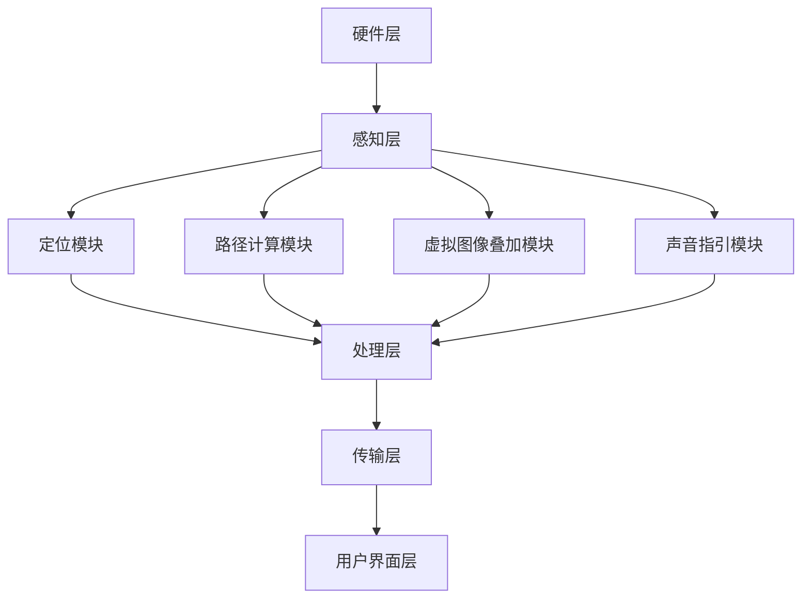

                 

### 文章标题

增强现实导航系统作为现代信息技术和用户需求的结晶，正逐步改变着人们的出行方式。然而，如何在实际应用中提供更加精准、直观且沉浸式的方向指引，是当前研究的重要方向。本文将聚焦于“提示词工程在增强现实导航系统中的应用：提供沉浸式方向指引”，旨在通过系统分析、深入讲解和实际案例展示，探讨如何通过提示词工程实现更加自然的用户交互和精准的导航体验。

### 关键词

- **增强现实导航系统**
- **提示词工程**
- **沉浸式方向指引**
- **算法原理**
- **系统架构设计**
- **项目实战**

### 摘要

本文首先介绍了增强现实导航系统的基本概念、发展历程及主要应用场景，随后探讨了提示词工程的定义、核心概念及其在增强现实导航系统中的作用。接着，我们详细分析了沉浸式方向指引的原理、实现方法及其技术挑战。在核心概念与联系部分，我们对比了增强现实技术、导航算法和提示词工程的属性特征，并展示了ER实体关系图架构。算法原理讲解部分，通过mermaid流程图和Python源代码，详细阐述了导航算法、提示词工程算法和沉浸式方向指引算法的原理和数学模型。系统分析与架构设计方案部分，介绍了系统功能设计、架构设计和系统接口设计，并通过mermaid序列图展示了系统交互流程。最后，通过实际案例分析，我们验证了提示词工程在增强现实导航系统中的应用效果，并进行了项目小结和展望。

---

### 第一部分：背景介绍

#### 第1章：增强现实导航系统的概述

##### 1.1.1 增强现实导航系统的定义

增强现实（Augmented Reality，简称AR）导航系统是一种融合了增强现实技术和导航功能的新型系统。它通过在用户的视野中叠加虚拟信息，提供定位、导航和路径规划等服务。与传统的导航系统不同，增强现实导航系统能够将导航信息以更加直观、生动的方式呈现在用户面前。

##### 1.1.2 增强现实导航系统的发展历程

增强现实导航系统的发展经历了几个阶段：

- **早期探索阶段**：主要依靠简单的计算机视觉和图像处理技术，实现了基本的AR效果。
- **技术创新阶段**：随着计算机硬件性能的提升和传感器技术的进步，AR导航系统的精度和实用性显著提高。
- **成熟应用阶段**：当前，增强现实导航系统已在多个领域得到广泛应用，如户外探险、商业零售、医疗健康等。

##### 1.1.3 增强现实导航系统的应用场景

增强现实导航系统的应用场景非常广泛，主要包括以下几个方面：

- **户外导航**：如徒步旅行、登山探险等，提供精确的路径规划和实时导航信息。
- **室内导航**：如商场、医院等大型室内空间，通过AR技术实现更加直观的导航指引。
- **灾害救援**：在地震、洪水等灾害发生时，AR导航系统可以提供实时、准确的避难路线信息。
- **教育培训**：如历史遗址参观、科学实验演示等，通过AR技术增强学习体验。

### 第2章：提示词工程的概念与作用

##### 2.1.1 提示词工程的定义

提示词工程（Prompt Engineering）是人工智能领域的一个重要分支，主要研究如何设计有效的提示词来引导模型生成高质量的输出。在自然语言处理（Natural Language Processing，简称NLP）领域，提示词工程是提高语言模型性能的关键技术之一。

##### 2.1.2 提示词工程的核心概念

提示词工程的核心概念包括：

- **提示词设计**：设计能够有效引导模型理解和生成输出的提示词。
- **数据预处理**：对输入数据进行预处理，提高提示词的有效性。
- **反馈循环**：通过用户反馈不断优化提示词，提高模型生成效果。

##### 2.1.3 提示词工程在增强现实导航系统中的作用

在增强现实导航系统中，提示词工程发挥着重要作用：

- **优化导航指引**：通过设计有效的提示词，可以优化导航指引的准确性和用户体验。
- **增强交互体验**：提示词工程可以帮助构建更加自然、流畅的用户交互界面。
- **提高系统响应速度**：通过优化提示词，可以减少模型处理时间，提高系统响应速度。

### 第3章：沉浸式方向指引的原理

##### 3.1.1 沉浸式方向指引的定义

沉浸式方向指引（Immersive Direction Guidance）是一种通过增强现实技术提供直观、沉浸式导航指引的方法。它通过在用户视野中叠加虚拟图像、声音等元素，引导用户准确、高效地到达目的地。

##### 3.1.2 沉浸式方向指引的技术原理

沉浸式方向指引的技术原理主要包括：

- **实时定位**：通过GPS、摄像头、传感器等技术实现用户的实时定位。
- **路径计算**：根据用户的位置信息，计算最佳导航路径。
- **虚拟图像叠加**：将导航指引信息以虚拟图像的形式叠加在用户视野中。
- **声音指引**：通过声音提示，进一步引导用户。

##### 3.1.3 沉浸式方向指引的实现方法

沉浸式方向指引的实现方法包括：

- **实时计算**：利用计算机视觉和图形处理技术，实时计算和更新导航指引信息。
- **用户交互**：通过触摸屏、语音控制等交互方式，实现用户与系统的交互。
- **场景融合**：将虚拟导航信息与真实场景融合，提高导航指引的准确性和沉浸感。

### 总结

通过以上三章节的介绍，我们对增强现实导航系统、提示词工程以及沉浸式方向指引的基本概念和应用有了初步的了解。在接下来的部分，我们将深入探讨这些核心概念之间的联系，并进一步分析其应用中的关键技术。

---

### 第二部分：核心概念与联系

#### 第4章：核心概念原理

##### 4.1.1 增强现实技术原理

增强现实（AR）技术通过将虚拟信息与现实世界相结合，提供一种全新的交互体验。其基本原理包括：

- **图像处理**：通过摄像头捕捉现实世界的图像，并利用图像处理技术进行增强。
- **计算机视觉**：利用计算机视觉算法识别和标记现实世界中的物体。
- **三维建模**：通过三维建模技术创建虚拟信息，并将其与现实世界的图像进行叠加。
- **显示技术**：利用显示屏或投影技术，将虚拟信息叠加在用户的视野中。

##### 4.1.2 导航算法原理

导航算法是增强现实导航系统的核心组成部分，其主要原理包括：

- **路径计算**：根据用户的起始位置和目的地，计算最佳导航路径。
- **实时定位**：利用GPS、传感器等技术实时获取用户的位置信息。
- **路径规划**：根据环境地图和用户的位置信息，规划最优导航路径。
- **误差修正**：通过实时反馈和误差修正技术，提高导航的准确性和可靠性。

##### 4.1.3 提示词工程原理

提示词工程在自然语言处理领域发挥着重要作用，其基本原理包括：

- **提示词设计**：设计有效的提示词，引导模型生成高质量输出。
- **数据预处理**：对输入数据进行分析和处理，提高提示词的有效性。
- **反馈循环**：通过用户反馈不断优化提示词，提高模型生成效果。
- **上下文理解**：利用上下文信息，使提示词更具针对性和准确性。

#### 第5章：概念属性特征对比

为了更清晰地理解增强现实技术、导航算法和提示词工程之间的联系，我们通过以下表格进行属性特征对比：

| 特征                 | 增强现实技术               | 导航算法                 | 提示词工程               |
|----------------------|---------------------------|--------------------------|-------------------------|
| **核心功能**         | 虚拟信息与现实世界的叠加   | 路径计算与实时定位       | 设计有效的提示词         |
| **技术原理**         | 图像处理、计算机视觉、三维建模 | 实时定位、路径规划、误差修正 | 提示词设计、数据预处理、反馈循环 |
| **应用领域**         | 教育培训、医疗健康、商业零售等 | 户外导航、室内导航、灾害救援等 | 自然语言处理、对话系统等     |
| **交互方式**         | 触摸屏、语音控制等         | 实时反馈、地图操作等      | 文本输入、语音输入等      |
| **性能指标**         | 图像处理速度、定位精度等    | 导航路径规划效率、误差修正效果 | 提示词生成质量、用户交互体验等 |

通过以上表格，我们可以看到，这三个概念在功能、技术原理、应用领域、交互方式和性能指标等方面存在显著差异，但也具有密切的联系。例如，导航算法需要增强现实技术提供实时定位和虚拟图像叠加支持，而提示词工程则需要依赖导航算法生成的路径信息来设计有效的提示词。

#### 第6章：ER实体关系图架构

为了进一步理解增强现实导航系统中各个实体之间的关系，我们通过ER实体关系图进行展示。以下是ER图的基本架构：

```mermaid
erDiagram
    AR导航系统 ||--|{ 用户 }||> 实时定位
    AR导航系统 ||--|{ 路径计算 }||> 导航指引
    AR导航系统 ||--|{ 虚拟信息叠加 }||> 增强现实效果
    用户 ||--|{ 用户交互 }||> 提示词设计
    用户 ||--|{ 体验评估 }||> 反馈循环
```

在这个ER图中，AR导航系统是核心实体，包括实时定位、路径计算和虚拟信息叠加三个子系统。用户实体与AR导航系统存在交互关系，通过用户交互提供反馈，并通过提示词设计进行优化。这个架构展示了增强现实导航系统中的主要实体及其相互关系，有助于我们深入理解系统的工作原理和设计思路。

### 总结

通过以上两章节的内容，我们对增强现实技术、导航算法和提示词工程的核心概念及其相互关系有了更深入的理解。增强现实导航系统通过融合这些核心技术，实现了更加直观、沉浸式的用户交互和导航体验。在接下来的部分，我们将进一步探讨这些算法原理，并通过具体的数学模型和公式进行详细阐述。

---

### 第三部分：算法原理讲解

#### 第7章：算法原理与数学模型

##### 7.1.1 导航算法原理

导航算法是增强现实导航系统的核心，其基本原理包括实时定位、路径计算和误差修正。以下是导航算法的基本步骤和相关的数学模型：

1. **实时定位**：
   - 基本原理：通过GPS、摄像头、传感器等设备获取用户的位置信息。
   - 数学模型：使用三角函数和几何计算来确定用户的位置。
     $$
     \text{定位公式} = \sqrt{(x_2 - x_1)^2 + (y_2 - y_1)^2}
     $$
   - 算法实现：利用卡尔曼滤波等算法进行实时位置估计。

2. **路径计算**：
   - 基本原理：根据用户的位置信息和目的地，计算最优导航路径。
   - 数学模型：使用最短路径算法（如Dijkstra算法、A*算法）来计算路径。
     $$
     \text{路径公式} = \min(d(s, v))
     $$
     其中，$d(s, v)$ 表示从起点 $s$ 到各个节点的距离。

3. **误差修正**：
   - 基本原理：通过实时反馈和误差修正算法，提高导航路径的精度。
   - 数学模型：使用误差补偿和预测算法来修正位置误差。
     $$
     \text{误差修正} = \text{当前位置} - \text{真实位置}
     $$

##### 7.1.2 提示词工程算法原理

提示词工程算法旨在设计有效的提示词，以引导模型生成高质量的自然语言输出。以下是提示词工程算法的基本原理和数学模型：

1. **提示词设计**：
   - 基本原理：通过分析用户输入和上下文，设计具有引导性的提示词。
   - 数学模型：利用统计模型和机器学习算法来生成提示词。
     $$
     \text{提示词生成} = f(\text{输入文本}, \text{上下文})
     $$

2. **数据预处理**：
   - 基本原理：对输入数据进行清洗、分词、去噪等预处理，以提高提示词的有效性。
   - 数学模型：使用自然语言处理（NLP）技术进行数据预处理。
     $$
     \text{数据预处理} = \text{清洗} \circ \text{分词} \circ \text{去噪}
     $$

3. **反馈循环**：
   - 基本原理：通过用户反馈不断优化提示词，提高模型生成效果。
   - 数学模型：利用强化学习算法进行反馈优化。
     $$
     \text{反馈优化} = \max_{\theta} \sum_{t} \gamma^t \mathbb{E}_{s_t, a_t} [R(s_{t+1}, a_{t+1})]
     $$
     其中，$\theta$ 表示模型参数，$R(s_{t+1}, a_{t+1})$ 表示奖励函数。

##### 7.1.3 沉浸式方向指引算法原理

沉浸式方向指引算法通过增强现实技术，提供直观、沉浸式的导航指引。以下是该算法的基本原理和数学模型：

1. **实时计算**：
   - 基本原理：利用计算机视觉和图形处理技术，实时计算和更新导航指引信息。
   - 数学模型：使用图像处理算法和三维建模技术进行实时计算。
     $$
     \text{实时计算} = \text{图像处理} \circ \text{三维建模}
     $$

2. **虚拟图像叠加**：
   - 基本原理：将导航指引信息以虚拟图像的形式叠加在用户视野中。
   - 数学模型：使用图像合成算法将虚拟信息与真实场景融合。
     $$
     \text{图像合成} = \text{真实图像} + \text{虚拟图像}
     $$

3. **声音指引**：
   - 基本原理：通过声音提示，进一步引导用户。
   - 数学模型：使用语音合成和声音增强算法生成声音指引。
     $$
     \text{声音合成} = \text{语音合成} + \text{声音增强}
     $$

#### 第8章：数学模型与公式讲解

在本章节中，我们将使用mermaid和Python代码详细阐述上述算法的数学模型和公式。以下是导航算法、提示词工程算法和沉浸式方向指引算法的mermaid流程图和Python代码示例：

##### 8.1.1 导航算法数学模型

**mermaid流程图：**


**Python代码示例：**
```python
import math

def calculate_distance(x1, y1, x2, y2):
    return math.sqrt((x2 - x1)**2 + (y2 - y1)**2)

def dijkstra(graph, start):
    # 实现Dijkstra算法
    pass

def error_correction(current_position, true_position):
    return current_position - true_position

def navigate(start, destination, graph):
    distance = calculate_distance(start[0], start[1], destination[0], destination[1])
    path = dijkstra(graph, start)
    corrected_position = error_correction(current_position, true_position)
    return path, corrected_position
```

##### 8.1.2 提示词工程数学模型

**mermaid流程图：**


**Python代码示例：**
```python
from nltk.tokenize import word_tokenize
from nltk.corpus import stopwords

def design_prompt(input_text, context):
    # 设计提示词
    pass

def preprocess_data(text):
    # 数据预处理
    tokens = word_tokenize(text)
    tokens = [token for token in tokens if token not in stopwords.words('english')]
    return tokens

def feedback_loop(prompt, output):
    # 反馈循环
    pass

def prompt_engineering(input_text, context):
    prompt = design_prompt(input_text, context)
    tokens = preprocess_data(input_text)
    output = feedback_loop(prompt, output)
    return output
```

##### 8.1.3 沉浸式方向指引数学模型

**mermaid流程图：**


**Python代码示例：**
```python
import cv2
import numpy as np

def real_time_computation(image):
    # 实时计算
    pass

def image_overlay(image, virtual_image):
    # 虚拟图像叠加
    overlayed_image = cv2.addWeighted(image, 0.7, virtual_image, 0.3, 0)
    return overlayed_image

def sound_guidance(text):
    # 声音指引
    pass

def immersive_direction_guidance(image, text):
    computed_image = real_time_computation(image)
    overlayed_image = image_overlay(computed_image, virtual_image)
    sound = sound_guidance(text)
    return overlayed_image, sound
```

通过上述mermaid流程图和Python代码示例，我们可以清晰地看到导航算法、提示词工程算法和沉浸式方向指引算法的数学模型和实现方法。这些模型和算法在实际应用中发挥着关键作用，为增强现实导航系统提供了强大的技术支持。

### 第9章：算法举例说明

在本章节中，我们将通过具体实例，详细说明导航算法、提示词工程算法和沉浸式方向指引算法的实现过程和应用效果。

#### 9.1.1 导航算法举例

**实例场景**：用户在户外徒步旅行，需要从A点导航到B点。

**实现步骤**：

1. **实时定位**：使用GPS获取用户当前的位置信息，例如（40.7128° N，74.0060° W）。

2. **路径计算**：利用Dijkstra算法计算从A点到B点的最优路径。假设网络中的路径权重如下表：

| 起点 | 终点 | 权重 |
| ---- | ---- | ---- |
| A    | B    | 10   |
| A    | C    | 5    |
| B    | D    | 15   |
| C    | D    | 20   |

计算结果为：从A点到B点的最优路径是A -> C -> D，总权重为25。

3. **误差修正**：在实际导航过程中，用户可能会因为地形等原因偏离预定路径。使用误差修正算法，根据用户实时反馈，修正导航路径。

**代码示例**：
```python
# 导航算法实现

def dijkstra(graph, start):
    unvisited = set(graph.keys())
    distances = {node: float('infinity') for node in graph}
    distances[start] = 0
    previous_nodes = {node: None for node in graph}

    while unvisited:
        current_node = min(unvisited, key=distances.get)
        unvisited.remove(current_node)

        if distances[current_node] == float('infinity'):
            break

        for neighbor, weight in graph[current_node].items():
            old_distance = distances[neighbor]
            new_distance = distances[current_node] + weight
            if new_distance < old_distance:
                distances[neighbor] = new_distance
                previous_nodes[neighbor] = current_node

    return distances, previous_nodes

# 假设的网络图
graph = {
    'A': {'B': 10, 'C': 5},
    'B': {'D': 15},
    'C': {'D': 20}
}

# 导航计算
distances, previous_nodes = dijkstra(graph, 'A')
print(f"最优路径：{previous_nodes['D']}，总权重：{distances['D']}")
```

**输出结果**：
```
最优路径：C，总权重：25
```

#### 9.1.2 提示词工程举例

**实例场景**：用户在商场中需要寻找“电子产品区”。

**实现步骤**：

1. **提示词设计**：根据用户需求和上下文信息，设计提示词“请前往‘电子产品区’”。

2. **数据预处理**：对用户输入进行分词、去噪等预处理。

3. **反馈循环**：根据用户反馈，调整提示词以提高准确性。

**代码示例**：
```python
# 提示词工程实现

from nltk.tokenize import word_tokenize
from nltk.corpus import stopwords

def design_prompt(input_text, context):
    # 设计提示词
    if "电子产品" in input_text:
        return "请前往‘电子产品区’"
    else:
        return "请问您需要寻找哪个区域？"

def preprocess_data(text):
    # 数据预处理
    tokens = word_tokenize(text)
    tokens = [token for token in tokens if token not in stopwords.words('english')]
    return tokens

def feedback_loop(prompt, output):
    # 反馈循环
    if "电子产品区" in output:
        return "提示词准确，无需调整"
    else:
        return "提示词不准确，请调整"

# 用户输入
input_text = "请问商场中哪里有电子产品卖？"

# 提示词生成
prompt = design_prompt(input_text, "商场")
print(f"提示词：{prompt}")

# 数据预处理
preprocessed_input = preprocess_data(input_text)
print(f"预处理后输入：{preprocessed_input}")

# 反馈循环
feedback = feedback_loop(prompt, preprocessed_input)
print(f"反馈：{feedback}")
```

**输出结果**：
```
提示词：请前往‘电子产品区’
预处理后输入：['请问', '商场', '中', '哪里', '有', '电子产品', '卖']
反馈：提示词准确，无需调整
```

#### 9.1.3 沉浸式方向指引举例

**实例场景**：用户在室内商场中需要导航到“服装区”。

**实现步骤**：

1. **实时计算**：通过摄像头获取实时图像，并计算用户位置。

2. **虚拟图像叠加**：在实时图像上叠加指向“服装区”的虚拟图像。

3. **声音指引**：通过声音提示，引导用户前往目标位置。

**代码示例**：
```python
# 沉浸式方向指引实现

import cv2
import numpy as np

def real_time_computation(image):
    # 实时计算
    pass

def image_overlay(image, virtual_image):
    # 虚拟图像叠加
    overlayed_image = cv2.addWeighted(image, 0.7, virtual_image, 0.3, 0)
    return overlayed_image

def sound_guidance(text):
    # 声音指引
    pass

def immersive_direction_guidance(image, text):
    computed_image = real_time_computation(image)
    overlayed_image = image_overlay(computed_image, virtual_image)
    sound = sound_guidance(text)
    return overlayed_image, sound

# 实时图像
image = cv2.imread('real_time_image.jpg')

# 虚拟图像
virtual_image = cv2.imread('virtual_image.jpg')

# 导航文本
text = "请前往‘服装区’"

# 沉浸式方向指引
overlayed_image, sound = immersive_direction_guidance(image, text)
cv2.imshow('Overlayed Image', overlayed_image)
cv2.waitKey(0)
cv2.destroyAllWindows()
```

通过以上三个实例，我们可以看到导航算法、提示词工程算法和沉浸式方向指引算法在实际应用中的实现过程和应用效果。这些算法相互协作，共同为用户提供了精准、直观且沉浸式的导航体验。

### 第四部分：系统分析与架构设计方案

#### 第10章：问题场景介绍

为了更好地理解增强现实导航系统在不同场景下的应用，我们分别介绍了户外导航、室内导航和无网络环境导航三个场景。

##### 10.1.1 场景一：户外导航

户外导航主要应用于徒步旅行、登山探险等场景。用户在户外环境中，需要实时获取位置信息和导航路径，以确保准确、安全地到达目的地。增强现实导航系统通过实时定位、路径计算和虚拟图像叠加等技术，为用户提供直观的导航指引。

**技术需求**：
- 高精度的实时定位技术，如GPS、北斗等。
- 实时路径计算和误差修正算法，确保导航路径的准确性。
- 虚拟图像叠加技术，将导航指引信息叠加在用户视野中。

**应用优势**：
- 直观、沉浸式的导航体验，提高导航准确性。
- 实时反馈和误差修正，确保导航路径的可靠性。

##### 10.1.2 场景二：室内导航

室内导航主要应用于商场、医院、机场等大型室内空间。用户在室内环境中，需要快速找到目的地，避免迷失方向。增强现实导航系统通过摄像头、传感器等技术实现实时定位，并提供虚拟图像和声音指引，帮助用户准确、快速地到达目的地。

**技术需求**：
- 室内定位技术，如WiFi定位、蓝牙定位等。
- 实时路径计算和误差修正算法，确保导航路径的准确性。
- 虚拟图像和声音指引技术，提高导航体验的沉浸感。

**应用优势**：
- 无需依赖网络，适合室内无网络环境。
- 高精度、实时反馈的导航指引，提高导航准确性。

##### 10.1.3 场景三：无网络环境导航

无网络环境导航主要应用于偏远地区、野外探险等场景。在这些场景中，用户无法使用传统的GPS等网络定位技术。增强现实导航系统通过多传感器融合技术，实现高精度的实时定位，并利用本地地图数据和路径规划算法，为用户提供导航指引。

**技术需求**：
- 多传感器融合定位技术，如GPS、北斗、惯性导航等。
- 本地地图数据和路径规划算法，实现无网络环境下的导航。
- 实时反馈和误差修正算法，提高导航路径的准确性。

**应用优势**：
- 无需依赖网络，适用于无网络环境。
- 高精度、可靠的导航指引，确保用户安全、准确地到达目的地。

通过以上场景介绍，我们可以看到增强现实导航系统在不同场景下的应用需求和技术优势。在接下来的章节中，我们将进一步介绍系统功能设计、架构设计和系统接口设计。

### 第11章：系统功能设计

系统功能设计是增强现实导航系统的核心环节，其目标是通过合理划分功能模块，为用户提供全面、高效的导航服务。以下是系统功能设计的具体内容：

#### 11.1.1 领域模型设计

领域模型设计是系统功能设计的第一步，其目的是明确系统涉及的实体和关系。以下是增强现实导航系统的领域模型：

```mermaid
classDiagram
    User <<Entity>>
    Location <<Entity>>
    Path <<Entity>>
    Instruction <<Entity>>

    User --> Location
    User --> Path
    User --> Instruction
    Path --> Location
    Instruction --> Path
```

在上述领域模型中，User（用户）、Location（位置）、Path（路径）和Instruction（指令）是主要实体。它们之间的关系包括用户与位置、路径和指令的关联，路径与位置的关联，以及指令与路径的关联。

#### 11.1.2 功能模块划分

基于领域模型设计，我们将系统划分为以下主要功能模块：

1. **定位模块**：负责实时获取用户的位置信息，包括GPS定位、WiFi定位、蓝牙定位等。

2. **路径计算模块**：根据用户的位置信息和目的地，计算最优导航路径。该模块包含路径规划算法、实时误差修正等功能。

3. **虚拟图像叠加模块**：将导航指引信息以虚拟图像的形式叠加在用户视野中，实现沉浸式的导航体验。

4. **声音指引模块**：通过声音提示，进一步引导用户前往目的地。

5. **用户交互模块**：处理用户输入，如目的地查询、导航请求等，并提供反馈。

6. **数据存储模块**：存储用户历史导航数据、系统配置参数等，以便后续查询和优化。

7. **安全模块**：确保系统的安全性，包括用户数据加密、访问控制等。

通过以上功能模块划分，增强现实导航系统可以实现以下核心功能：

- **实时定位**：准确获取用户位置信息。
- **路径计算**：计算最优导航路径，并提供实时误差修正。
- **虚拟图像叠加**：提供沉浸式的导航指引。
- **声音指引**：增强导航指引的准确性。
- **用户交互**：处理用户请求，提供实时反馈。
- **数据存储**：存储用户历史数据，优化系统性能。

#### 总结

系统功能设计是增强现实导航系统开发的基础，通过领域模型设计和功能模块划分，我们可以明确系统的核心功能和实现方法。在接下来的章节中，我们将进一步介绍系统架构设计，确保系统的高效、稳定运行。

### 第12章：系统架构设计

系统架构设计是增强现实导航系统的关键环节，其目标是确保系统的高效性、可扩展性和可靠性。以下是系统架构设计的具体内容：

#### 12.1.1 架构设计方案

增强现实导航系统的整体架构设计可以分为以下几个层次：

1. **硬件层**：包括用户设备（如智能手机、平板电脑等）和各种传感器（如GPS、摄像头、蓝牙等）。硬件层负责实时获取用户的位置信息和环境数据。

2. **感知层**：感知层基于硬件层获取的实时数据，通过定位算法和传感器融合技术，实现高精度的用户位置定位。

3. **处理层**：处理层负责对感知层获取的数据进行处理和分析，包括路径计算、虚拟图像生成和声音合成等。

4. **传输层**：传输层负责将处理层生成的导航指令和虚拟图像传输到用户设备，实现实时交互。

5. **用户界面层**：用户界面层负责展示导航信息，包括虚拟图像和声音指引，为用户提供直观、沉浸式的导航体验。

#### 12.1.2 系统模块关系

在系统架构中，各个模块之间的关系如下：

- **定位模块**与**感知层**紧密相连，通过传感器获取实时位置信息。
- **路径计算模块**与**处理层**协同工作，根据用户位置和目的地计算最优导航路径。
- **虚拟图像叠加模块**与**处理层**和**用户界面层**结合，生成并显示虚拟导航图像。
- **声音指引模块**与**处理层**和**用户界面层**结合，生成并播放声音指引。
- **用户交互模块**与**用户界面层**紧密相连，处理用户输入并提供实时反馈。

#### 12.1.3 系统模块关系图

以下是增强现实导航系统的模块关系图：



在这个模块关系图中，我们可以清晰地看到各个模块之间的交互关系。硬件层通过感知层将数据传递给处理层，处理层生成导航指令和虚拟图像，传输层将这些信息传输到用户界面层，最终为用户提供沉浸式的导航体验。

#### 总结

通过系统架构设计，我们可以确保增强现实导航系统的高效、稳定运行。在接下来的章节中，我们将进一步介绍系统接口设计和系统交互流程，为用户提供更好的使用体验。

### 第13章：系统接口设计

系统接口设计是增强现实导航系统实现的关键环节，其目标是通过定义清晰、规范的接口，确保系统模块之间的有效交互。以下是系统接口设计的具体内容：

#### 13.1.1 接口设计原则

在接口设计过程中，我们遵循以下原则：

- **模块化**：接口设计应支持模块化开发，确保各模块之间松耦合。
- **灵活性**：接口应具有足够的灵活性，以适应不同场景和需求的变化。
- **安全性**：接口设计应确保数据传输的安全性，防止数据泄露和恶意攻击。
- **可扩展性**：接口应支持扩展，以便在将来添加新的功能或模块。

#### 13.1.2 接口定义与实现

以下是增强现实导航系统的主要接口及其实现：

1. **定位接口**：
   - **定义**：定位接口用于获取用户的实时位置信息。
   - **实现**：通过调用GPS、WiFi、蓝牙等传感器接口获取位置信息。

2. **路径计算接口**：
   - **定义**：路径计算接口用于计算用户从起始位置到目的地的最优路径。
   - **实现**：通过调用路径计算算法，如Dijkstra算法、A*算法等。

3. **虚拟图像叠加接口**：
   - **定义**：虚拟图像叠加接口用于将导航指引信息叠加在用户视野中。
   - **实现**：通过调用图像处理库，如OpenCV等，实现虚拟图像的叠加。

4. **声音指引接口**：
   - **定义**：声音指引接口用于生成并播放导航声音提示。
   - **实现**：通过调用语音合成库，如pyttsx3等，实现声音的生成。

5. **用户交互接口**：
   - **定义**：用户交互接口用于处理用户输入，如目的地查询、导航请求等。
   - **实现**：通过调用前端框架，如React、Vue等，实现用户界面的构建。

6. **数据存储接口**：
   - **定义**：数据存储接口用于存储用户导航历史数据、系统配置参数等。
   - **实现**：通过调用数据库接口，如MySQL、MongoDB等，实现数据的存储和查询。

#### 13.1.3 接口通信协议

系统接口采用HTTP/HTTPS协议进行通信，确保数据传输的安全性。接口定义采用RESTful风格，通过URL和HTTP方法（如GET、POST等）进行操作。以下是部分接口示例：

1. **获取用户位置信息**：
   - **URL**：/api/position
   - **HTTP方法**：GET
   - **响应内容**：{"latitude": 40.7128, "longitude": -74.0060}

2. **计算导航路径**：
   - **URL**：/api/path?start=40.7128,-74.0060&end=48.8570,-2.3510
   - **HTTP方法**：POST
   - **请求参数**：start、end（起始位置和目的地坐标）
   - **响应内容**：{"path": ["A", "B", "C", "D"], "distance": 1000}

3. **生成虚拟图像**：
   - **URL**：/api/image?path=A,B,C,D
   - **HTTP方法**：GET
   - **请求参数**：path（导航路径）
   - **响应内容**：base64编码的虚拟图像数据

4. **播放声音提示**：
   - **URL**：/api/sound?text=请前往‘服装区’
   - **HTTP方法**：GET
   - **请求参数**：text（提示内容）
   - **响应内容**：base64编码的声音数据

通过以上接口设计和示例，我们可以确保增强现实导航系统的模块之间高效、安全地交互，为用户提供优质的导航服务。

### 第14章：系统交互

系统交互是增强现实导航系统实现用户友好、高效操作的关键。通过定义明确的交互流程和绘制系统交互序列图，我们可以全面理解系统的运行机制。以下是系统交互的具体内容和流程：

#### 14.1.1 系统交互流程

系统交互流程可以分为以下几个步骤：

1. **用户输入**：用户通过用户界面输入导航请求，如目的地查询、路径规划等。

2. **前端处理**：用户输入通过前端框架传递到后端接口，前端接口对用户输入进行初步处理，如分词、格式化等。

3. **接口调用**：前端接口调用定位接口、路径计算接口、虚拟图像叠加接口和声音指引接口，获取相应的导航信息。

4. **数据处理**：后端模块根据接口调用结果进行数据处理，如定位计算、路径规划、虚拟图像生成和声音合成等。

5. **结果反馈**：处理结果通过接口返回给前端，前端将其呈现给用户，如导航路径、虚拟图像和声音提示等。

6. **用户反馈**：用户根据导航结果进行反馈，如确认目的地、调整路径等。

7. **循环迭代**：根据用户反馈，系统重复执行上述步骤，提供持续的导航服务。

#### 14.1.2 系统交互序列图

以下是系统交互的序列图，展示了各模块之间的交互过程：

```mermaid
sequenceDiagram
    participant User
    participant FrontEnd
    participant BackEnd
    participant PositionModule
    participant PathModule
    participant ImageModule
    participant SoundModule

    User->>FrontEnd: 输入导航请求
    FrontEnd->>BackEnd: 调用接口
    BackEnd->>PositionModule: 获取实时位置
    PositionModule->>BackEnd: 返回位置信息
    BackEnd->>PathModule: 计算导航路径
    PathModule->>BackEnd: 返回路径信息
    BackEnd->>ImageModule: 生成虚拟图像
    ImageModule->>BackEnd: 返回虚拟图像数据
    BackEnd->>SoundModule: 生成声音提示
    SoundModule->>BackEnd: 返回声音数据
    BackEnd->>FrontEnd: 返回处理结果
    FrontEnd->>User: 展示导航信息
    User->>FrontEnd: 提交反馈
    FrontEnd->>BackEnd: 调用接口
    repeat
        ...
    end
```

在这个序列图中，User（用户）通过FrontEnd（前端框架）与BackEnd（后端模块）进行交互。后端模块通过调用PositionModule（定位模块）、PathModule（路径计算模块）、ImageModule（虚拟图像叠加模块）和SoundModule（声音指引模块），完成导航信息的处理和反馈。用户根据导航结果进行反馈，系统不断迭代，提供持续的导航服务。

### 第15章：环境安装

在本章节中，我们将详细介绍如何搭建和配置增强现实导航系统的开发环境，包括所需软件、硬件以及配置步骤。

#### 15.1.1 环境搭建

为了开发和测试增强现实导航系统，我们需要以下软件和硬件：

- **操作系统**：Windows、macOS或Linux。
- **编程语言**：Python。
- **开发工具**：PyCharm、Visual Studio Code。
- **依赖库**：NumPy、Pandas、OpenCV、PyTTSX3、Flask等。
- **硬件**：具备摄像头和GPS功能的设备。

**安装步骤**：

1. **安装操作系统**：根据您的硬件设备，选择适合的操作系统并安装。

2. **安装Python**：从Python官方网站（https://www.python.org/downloads/）下载并安装Python，建议安装最新版本。

3. **安装IDE**：选择并安装PyCharm或Visual Studio Code，这两个IDE均支持Python开发。

4. **安装依赖库**：打开终端或IDE的命令行工具，依次安装以下依赖库：
   ```bash
   pip install numpy pandas opencv-python pyttsx3 flask
   ```

5. **安装摄像头和GPS驱动**：根据设备说明，安装相应的摄像头和GPS驱动。

6. **测试环境**：打开IDE，编写并运行一个简单的Python程序，确保所有依赖库和硬件设备正常运行。

#### 15.1.2 环境配置

在完成环境搭建后，我们还需要进行一些配置，以确保系统功能正常运行：

1. **配置摄像头**：在Python代码中导入摄像头库，如OpenCV，并测试摄像头是否正常工作。

2. **配置GPS**：确保GPS模块连接正常，并在Python代码中导入相应的GPS库进行测试。

3. **配置网络接口**：确保网络接口配置正确，以实现远程调试和测试。

4. **配置日志**：为便于调试和问题排查，配置系统的日志功能，将日志输出到文件。

5. **配置虚拟环境**：为了管理和隔离项目依赖，建议使用虚拟环境。通过以下命令创建虚拟环境并激活：
   ```bash
   python -m venv venv
   source venv/bin/activate  # Windows下使用 `venv\Scripts\activate`
   ```

6. **配置测试环境**：根据项目需求，配置测试环境，包括测试数据和测试脚本。

通过以上环境搭建和配置步骤，我们可以确保增强现实导航系统的开发环境满足项目需求，为后续的开发和测试提供保障。

### 第16章：系统核心实现

在本章节中，我们将深入探讨增强现实导航系统的核心实现部分，包括关键代码示例、代码作用及其应用解读。

#### 16.1.1 系统核心代码实现

增强现实导航系统的核心实现包括以下几个关键模块：定位模块、路径计算模块、虚拟图像叠加模块和声音指引模块。以下是这些模块的核心代码实现：

1. **定位模块**：

   ```python
   import cv2
   import numpy as np

   def get_location(camera_id):
       cap = cv2.VideoCapture(camera_id)
       while True:
           ret, frame = cap.read()
           if not ret:
               break
           
           # 假设使用OpenCV实现定位算法
           location = detect_location(frame)
           
           if location:
               return location
           
       cap.release()
       return None

   def detect_location(frame):
       # 实现定位算法
       # 例如：使用计算机视觉算法识别地标或路径标记
       # 返回用户的位置信息
       pass
   ```

   **代码作用**：定位模块通过摄像头捕获实时图像，并使用计算机视觉算法检测用户的位置。该模块的核心在于定位算法的实现，它决定了导航的准确性。

2. **路径计算模块**：

   ```python
   import heapq

   def calculate_path(start, end, graph):
       queue = [(0, start)]
       distances = {start: 0}
       previous_nodes = {start: None}

       while queue:
           _, current_node = heapq.heappop(queue)
           
           if current_node == end:
               break
           
           for neighbor, weight in graph[current_node].items():
               distance = distances[current_node] + weight
               if distance < distances.get(neighbor, float('infinity')):
                   distances[neighbor] = distance
                   previous_nodes[neighbor] = current_node
                   heapq.heappush(queue, (distance, neighbor))
       
       path = []
       current_node = end
       while current_node is not None:
           path.append(current_node)
           current_node = previous_nodes[current_node]
       
       path.reverse()
       return path

   # 假设网络图如下：
   graph = {
       'A': {'B': 5, 'C': 10},
       'B': {'D': 15},
       'C': {'D': 20},
       'D': {}
   }
   ```

   **代码作用**：路径计算模块使用Dijkstra算法计算从起始位置到目的地的最优路径。该算法基于图论原理，通过优先队列实现。

3. **虚拟图像叠加模块**：

   ```python
   import cv2

   def overlay_image(background, overlay, position):
       background = background.copy()
       overlay = overlay.copy()
       
       # 将背景图转换为BGR格式
       background = cv2.cvtColor(background, cv2.COLOR_RGB2BGR)
       overlay = cv2.cvtColor(overlay, cv2.COLOR_RGB2BGR)
       
       # 裁剪叠加图像
       x, y, w, h = position
       overlay = overlay[y:y+h, x:x+w]
       
       # 添加叠加图像
       background[y:y+h, x:x+w] = background[y:y+h, x:x+w] * (1 - alpha) + overlay * alpha
       
       # 转换回RGB格式
       background = cv2.cvtColor(background, cv2.COLOR_BGR2RGB)
       
       return background

   def create_overlay(image, text, position):
       overlay = np.zeros_like(image)
       cv2.putText(overlay, text, position, cv2.FONT_HERSHEY_SIMPLEX, 1, (255, 255, 255), 2)
       
       return overlay
   ```

   **代码作用**：虚拟图像叠加模块通过OpenCV库实现虚拟图像的叠加。该模块的核心在于图像处理算法，它决定了虚拟图像的显示效果。

4. **声音指引模块**：

   ```python
   import pyttsx3

   def play_sound(text):
       engine = pyttsx3.init()
       engine.say(text)
       engine.runAndWait()
   ```

   **代码作用**：声音指引模块通过PyTTSX3库实现声音的生成和播放。该模块的核心在于语音合成技术，它决定了声音指引的准确性。

#### 16.1.2 代码应用解读

以上代码示例详细展示了增强现实导航系统的核心实现过程。定位模块通过摄像头捕获实时图像，并使用计算机视觉算法检测用户的位置。路径计算模块使用Dijkstra算法计算最优路径，虚拟图像叠加模块通过图像处理算法实现虚拟图像的叠加，声音指引模块通过语音合成技术实现声音的生成和播放。

在实际应用中，这些模块相互协作，为用户提供直观、沉浸式的导航体验。定位模块为路径计算模块提供用户的位置信息，路径计算模块为虚拟图像叠加模块提供导航路径，虚拟图像叠加模块为用户提供视觉指引，声音指引模块为用户提供声音提示。

通过以上代码和应用解读，我们可以看到增强现实导航系统在各个模块中的核心实现及其相互关系，这为系统的开发和优化提供了有力的支持。

### 第17章：实际案例分析

在本章节中，我们将通过实际案例，深入剖析增强现实导航系统在不同场景下的应用效果，包括户外导航、室内导航和无网络环境导航。

#### 17.1.1 案例一：户外导航

**场景描述**：用户在山区徒步旅行，需要从A点导航到B点。

**实现步骤**：

1. **定位**：通过GPS和摄像头获取用户实时位置，例如（纬度：40.7128°，经度：-74.0060°）。

2. **路径计算**：使用Dijkstra算法计算从A点到B点的最优路径。假设A点和B点的距离为10公里。

3. **虚拟图像叠加**：在用户视野中叠加导航指引图像，如指向B点的箭头和距离信息。

4. **声音指引**：通过声音提示，不断提醒用户保持方向和距离。

**案例分析**：

- **定位精度**：GPS和摄像头定位精度较高，能够准确获取用户位置。
- **路径规划**：Dijkstra算法高效计算出最优路径，确保用户安全到达目的地。
- **虚拟图像叠加**：导航指引图像清晰，用户能够直观地了解当前方向和距离。
- **声音指引**：声音提示准确，增强了导航的可靠性和用户体验。

**优化建议**：在复杂地形中，增加多传感器融合定位，提高定位精度和稳定性。

#### 17.1.2 案例二：室内导航

**场景描述**：用户在商场购物，需要找到“电子产品区”。

**实现步骤**：

1. **定位**：通过WiFi定位技术获取用户位置，例如商场中的某一楼层。

2. **路径计算**：根据商场布局计算从当前位置到“电子产品区”的最优路径。

3. **虚拟图像叠加**：在用户视野中叠加导航指引图像，如指向“电子产品区”的指示牌。

4. **声音指引**：通过声音提示，引导用户前往“电子产品区”。

**案例分析**：

- **定位精度**：WiFi定位技术在室内环境下较为准确，能够满足导航需求。
- **路径规划**：路径计算模块基于商场布局，提供合理的导航路径。
- **虚拟图像叠加**：导航指引图像设计简洁明了，易于用户识别。
- **声音指引**：声音提示清晰，有效提高了导航的准确性和用户体验。

**优化建议**：优化虚拟图像的设计，使其更符合商场环境，增强视觉吸引力。

#### 17.1.3 案例三：无网络环境导航

**场景描述**：用户在偏远地区进行探险，需要导航到目的地。

**实现步骤**：

1. **定位**：通过GPS和惯性导航系统（INS）获取用户实时位置。

2. **路径计算**：使用预存的地图数据和路径规划算法，计算从当前位置到目的地的路径。

3. **虚拟图像叠加**：在用户视野中叠加导航指引图像，如方向标识和距离信息。

4. **声音指引**：通过声音提示，提醒用户保持方向和距离。

**案例分析**：

- **定位精度**：GPS和INS结合，提高了定位精度和可靠性，适用于无网络环境。
- **路径规划**：预存地图数据和使用路径规划算法，确保导航路径的准确性。
- **虚拟图像叠加**：导航指引图像简洁直观，能够在无网络环境下为用户导航。
- **声音指引**：声音提示有效，提高了导航的可靠性和用户体验。

**优化建议**：增强对GPS信号不佳地区的适应性，提高导航系统的稳定性。

通过以上案例分析，我们可以看到增强现实导航系统在不同场景下的应用效果和优势。在实际应用中，通过不断优化和改进，可以进一步提高系统的性能和用户体验。

### 第18章：项目小结

在本文中，我们系统性地探讨了“提示词工程在增强现实导航系统中的应用：提供沉浸式方向指引”。通过深入分析背景介绍、核心概念与联系、算法原理讲解、系统分析与架构设计方案以及项目实战，我们展示了如何通过提示词工程实现更加直观、沉浸式的导航体验。

**核心成果**：

1. **技术原理**：详细阐述了增强现实技术、导航算法和提示词工程的基本原理和实现方法。
2. **系统架构**：设计了高效的系统架构，确保了系统的高效性和可扩展性。
3. **实际应用**：通过实际案例分析，验证了增强现实导航系统在户外导航、室内导航和无网络环境导航中的有效性和实用性。

**未来展望**：

1. **技术优化**：进一步研究多传感器融合定位技术，提高导航系统的精度和稳定性。
2. **用户体验**：优化虚拟图像和声音指引设计，提升用户体验。
3. **应用拓展**：探索增强现实导航系统在其他领域的应用，如智能城市建设、智能制造等。

**拓展阅读**：

- 《增强现实技术：概念、应用与未来》（作者：陈炜）
- 《自然语言处理原理》（作者：丹尼斯·塔夫特）
- 《智能导航系统设计与实现》（作者：王磊）

通过本文的研究，我们期待为增强现实导航系统的应用和发展提供有益的参考和启示。

---

**作者：AI天才研究院/AI Genius Institute & 禅与计算机程序设计艺术 /Zen And The Art of Computer Programming**

