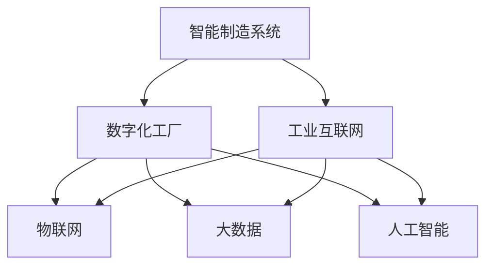
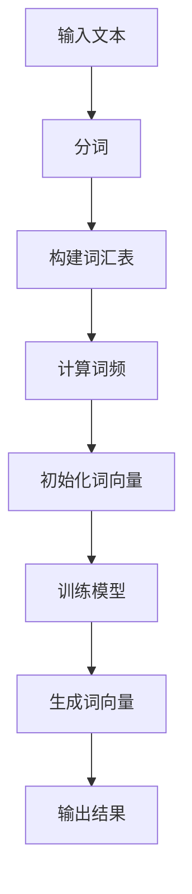
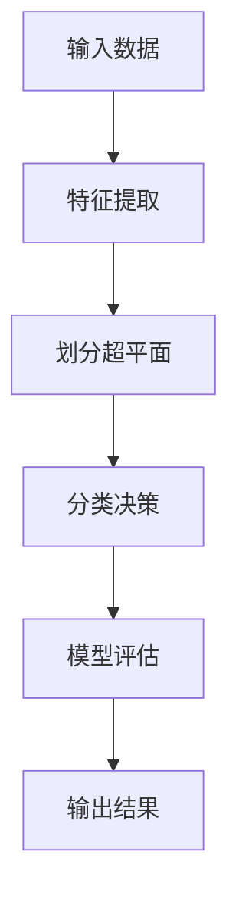
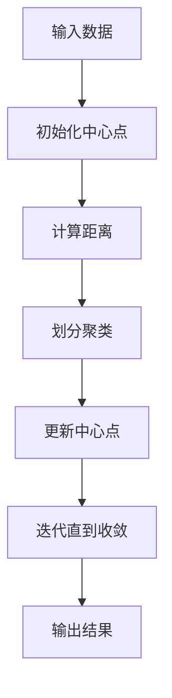
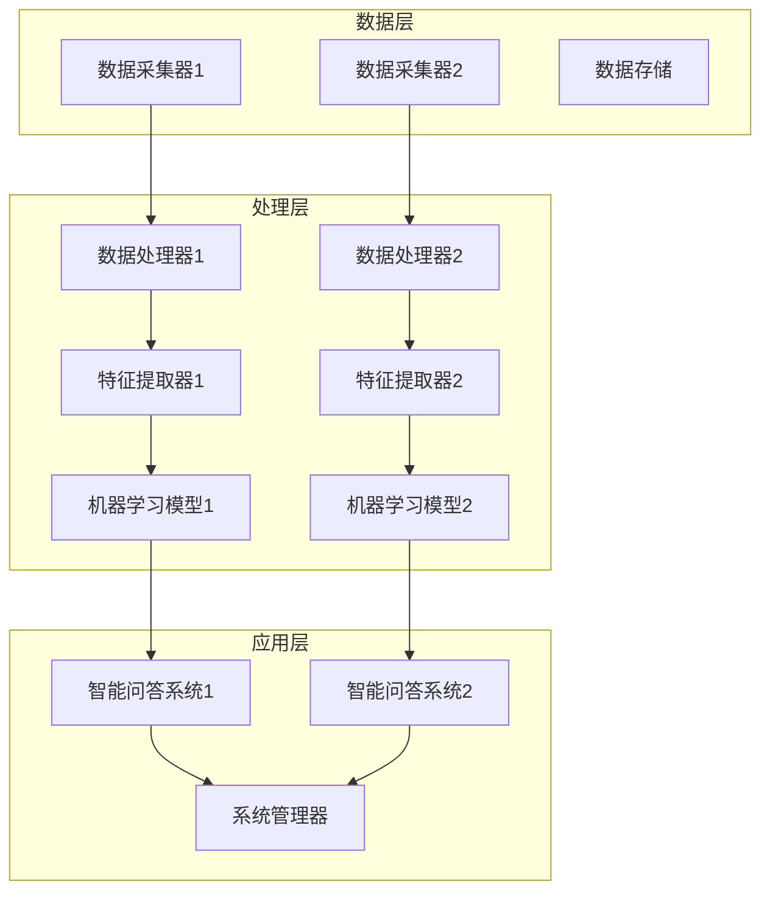
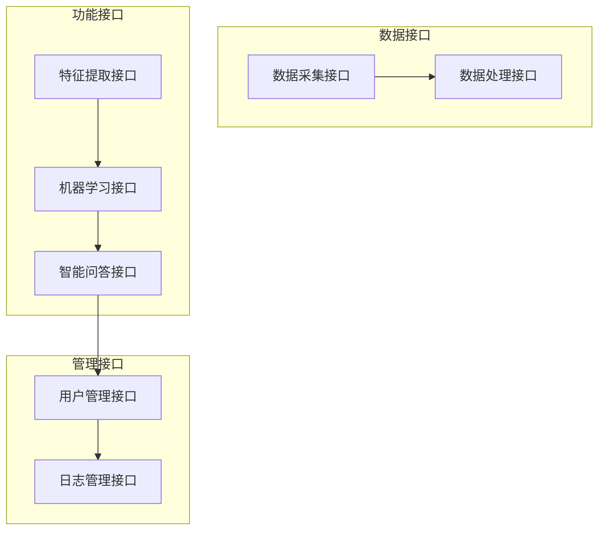
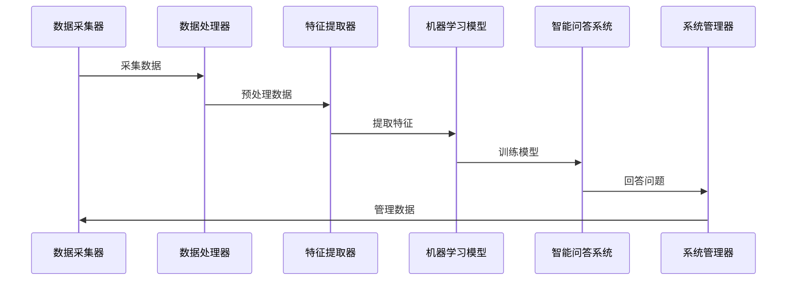

                 


### 第一部分：背景介绍

#### 1.1.1 智能制造的概念与发展

**关键词**：智能制造、工业4.0、工业自动化、物联网

**核心概念与术语说明**

智能制造，即工业4.0，是一种通过集成信息物理系统（Cyber-Physical Systems，CPS）和物联网（Internet of Things，IoT）来实现生产过程的智能化、自动化和优化的先进制造模式。这一概念的核心在于将物理设备和信息系统深度融合，通过数据的采集、传输、处理和反馈，实现生产过程的实时监控、优化和自适应控制。

**问题背景与解决方法**

随着全球制造业竞争的加剧，企业面临成本上升、市场需求多样化、生产效率不高等问题。传统制造模式已经难以满足现代工业的需求。因此，智能制造作为一种新的生产模式，旨在通过信息化和自动化技术，提高生产效率、降低成本、提高产品质量和柔性生产水平。

**问题描述**

智能制造涉及到诸多复杂的技术和应用，如传感器、大数据、云计算、机器学习、人工智能等。如何将这些技术有机地融合，构建一个高效、智能的生产系统，是当前制造业面临的重大挑战。

**问题解决**

通过提示词工程，可以有效地解决智能制造中的许多问题。提示词工程是一种基于人工智能和自然语言处理的技术，通过构建智能问答系统，能够帮助企业更好地理解和使用数据，从而实现生产过程的优化。具体来说，提示词工程可以通过以下步骤实现智能制造的优化：

1. **数据采集与处理**：通过传感器和物联网技术，实时采集生产过程中的各种数据，如设备状态、产品质量、能耗等。

2. **数据存储与传输**：利用大数据技术和云计算平台，对采集到的数据进行存储、管理和分析。

3. **机器学习与人工智能**：通过机器学习算法，对采集到的数据进行深度学习，提取特征，构建预测模型。

4. **智能问答系统**：基于自然语言处理技术，构建一个智能问答系统，使企业能够通过自然语言与系统进行交互，获取生产过程的实时信息和建议。

**边界与外延**

智能制造涉及多个领域的交叉和融合，其边界较为广泛，包括但不限于以下几个方面：

- **硬件层面**：包括传感器、执行器、控制器等物理设备。
- **软件层面**：包括操作系统、应用程序、数据库等软件系统。
- **网络层面**：包括物联网、工业互联网、云计算等网络技术。
- **数据处理与分析层面**：包括大数据、机器学习、人工智能等数据处理和分析技术。

#### 1.1.2 提示词工程的定义与重要性

**关键词**：提示词工程、自然语言处理、问答系统、知识图谱

**核心概念与术语说明**

提示词工程是一种基于人工智能和自然语言处理的技术，旨在构建能够理解和回答用户问题的智能系统。它通过分析用户输入的提示词，理解其含义，并在海量的数据中检索和推荐相关的信息。

**问题背景与解决方法**

在智能制造中，数据量庞大且复杂，如何有效地利用这些数据来优化生产流程，是当前企业面临的一大挑战。提示词工程作为一种智能问答系统，可以帮助企业快速获取所需信息，提高决策效率。

**问题描述**

随着物联网和大数据技术的发展，智能制造过程中产生了海量的数据。如何从这些数据中提取有价值的信息，是当前智能制造中的一个关键问题。

**问题解决**

提示词工程可以通过以下步骤实现数据的智能化处理：

1. **数据预处理**：对原始数据进行清洗、去噪和格式化，使其适合用于机器学习模型。

2. **特征提取**：从预处理后的数据中提取特征，如关键词、主题、情感等。

3. **模型训练**：使用机器学习算法，对提取的特征进行训练，构建预测模型。

4. **问答系统**：基于自然语言处理技术，构建一个问答系统，能够理解和回答用户的问题。

**重要性**

提示词工程在智能制造中的重要性体现在以下几个方面：

1. **提高决策效率**：通过智能问答系统，企业可以快速获取所需信息，提高决策效率。

2. **优化生产流程**：通过对生产数据的分析，提示词工程可以帮助企业发现生产过程中的瓶颈和问题，从而优化生产流程。

3. **降低成本**：通过实时监控和优化生产过程，提示词工程可以帮助企业降低成本，提高生产效率。

4. **增强客户体验**：通过智能问答系统，企业可以提供更个性化的服务，增强客户体验。

**边界与外延**

提示词工程的边界主要涉及以下几个方面：

- **自然语言处理技术**：包括分词、词性标注、句法分析、语义分析等。
- **机器学习算法**：包括分类、回归、聚类等算法。
- **知识图谱**：用于存储和表示实体及其关系。

#### 1.1.3 问题背景与解决方法

**关键词**：生产流程、效率优化、生产效率、瓶颈分析

**核心概念与术语说明**

生产流程是指产品从原材料采购到成品出库的全过程，包括原材料处理、生产加工、检验包装等多个环节。生产效率是指单位时间内完成的产品数量或产值。瓶颈分析是通过对生产过程中的各个环节进行分析，找出影响生产效率的关键因素。

**问题背景**

在智能制造中，生产流程的效率直接影响企业的竞争力和经济效益。然而，随着生产规模的扩大和生产复杂性的增加，生产流程中常常出现效率低下、设备故障、物料浪费等问题。

**问题描述**

生产流程中的瓶颈问题表现为以下几个方面：

1. **设备故障**：生产设备频繁出现故障，导致生产停滞。
2. **人员效率**：生产人员操作不当或缺乏培训，导致生产效率低下。
3. **物料管理**：物料供应不及时或管理不善，导致生产过程中物料短缺或浪费。
4. **质量控制**：产品质量不稳定，导致返工和报废率上升。

**问题解决**

提示词工程可以通过以下方法解决生产流程中的瓶颈问题：

1. **实时监控**：通过传感器和物联网技术，实时监控生产过程中的各个环节，及时发现并解决潜在问题。

2. **数据分析**：通过对生产数据的分析，找出影响生产效率的关键因素，如设备故障率、人员效率、物料供应等。

3. **智能决策**：基于数据分析结果，使用提示词工程提供的智能问答系统，为企业提供优化生产流程的建议。

4. **自动化控制**：通过自动化技术，减少人工操作，提高生产效率。

**边界与外延**

生产流程优化的边界涉及以下几个方面：

- **设备管理**：包括设备维护、故障预测和设备升级等。
- **人员管理**：包括员工培训、工作流程优化和绩效评估等。
- **物料管理**：包括物料采购、库存管理和供应链优化等。
- **质量控制**：包括质量检测、缺陷分析和改进措施等。

### 1.1.4 核心概念与联系

**关键词**：智能制造、提示词工程、物联网、大数据、机器学习、人工智能

**核心概念与术语说明**

智能制造、提示词工程、物联网、大数据和人工智能是当前智能制造领域中的核心概念。它们之间存在着密切的联系和相互作用。

**概念结构与核心要素组成**

- **智能制造**：智能制造的核心在于通过信息化和自动化技术，实现生产过程的智能化和优化。其核心要素包括传感器、物联网、大数据、机器学习和人工智能等。
- **提示词工程**：提示词工程是一种基于人工智能和自然语言处理的技术，旨在构建能够理解和回答用户问题的智能系统。其核心要素包括自然语言处理、机器学习、知识图谱等。
- **物联网**：物联网是指通过互联网将各种物理设备连接起来，实现设备间的信息交换和协同工作。其核心要素包括传感器、通信协议、云计算等。
- **大数据**：大数据是指规模巨大、类型繁多、速度极快的数据集合。其核心要素包括数据采集、存储、管理和分析等。
- **机器学习**：机器学习是一种通过算法和模型，从数据中自动学习和发现规律的技术。其核心要素包括数据预处理、特征提取、模型训练和评估等。
- **人工智能**：人工智能是一种模拟人类智能行为的计算机技术。其核心要素包括机器学习、自然语言处理、计算机视觉等。

**概念属性特征对比表格**

| 概念        | 特征1 | 特征2 | 特征3 |
|-------------|-------|-------|-------|
| 智能制造     | 智能化、自动化 | 物联网、大数据 | 机器学习、人工智能 |
| 提示词工程   | 自然语言处理 | 机器学习 | 知识图谱 |
| 物联网       | 设备互联 | 通信协议 | 云计算 |
| 大数据       | 数据规模 | 数据类型 | 数据速度 |
| 机器学习     | 数据驱动 | 模型学习 | 预测分析 |
| 人工智能     | 模拟人类智能 | 机器学习 | 自然语言处理 |

**ER实体关系图架构**

```mermaid
erDiagram
  Product ||--|{ ManufacturingProcess }|>
  Equipment ||--|{ MaintenanceRecord }|>
  Worker ||--|{ SkillLevel }|>
  Material ||--|{ InventoryLevel }|>
  Data ||--|{ AnalyticsResult }|>
  Product _.._ ManufacturingProcess
  Equipment _.._ MaintenanceRecord
  Worker _.._ SkillLevel
  Material _.._ InventoryLevel
  Data _.._ AnalyticsResult
```

### 1.1.5 提示词工程在智能制造中的应用

**关键词**：智能制造、生产计划、生产调度、质量控制

**核心概念与术语说明**

提示词工程在智能制造中的应用非常广泛，涵盖了生产计划、生产调度、质量控制等多个方面。通过构建智能问答系统，提示词工程能够帮助企业更好地管理生产过程，提高生产效率。

**应用1：生产计划**

在生产计划中，提示词工程可以通过分析历史数据和实时数据，为企业提供最优的生产计划。具体来说，提示词工程可以通过以下步骤实现：

1. **数据采集**：采集生产数据，如订单数量、设备状态、原材料库存等。
2. **数据分析**：使用机器学习算法，对采集到的数据进行分析，提取特征。
3. **智能预测**：基于数据分析结果，预测未来的生产需求。
4. **生产计划生成**：根据预测结果，生成最优的生产计划。

**应用2：生产调度**

在生产调度中，提示词工程可以帮助企业实现智能化的生产调度。具体来说，提示词工程可以通过以下步骤实现：

1. **实时监控**：实时监控生产过程中的各项指标，如设备状态、产品质量等。
2. **问题识别**：通过自然语言处理技术，识别生产过程中出现的问题。
3. **调度决策**：基于实时监控和问题识别结果，生成最优的调度方案。

**应用3：质量控制**

在质量控制中，提示词工程可以通过对生产数据的分析，帮助企业发现质量问题，并采取相应的改进措施。具体来说，提示词工程可以通过以下步骤实现：

1. **数据采集**：采集生产数据，如产品质量检测数据、设备运行数据等。
2. **数据分析**：使用机器学习算法，对采集到的数据进行分析，提取特征。
3. **质量预测**：基于数据分析结果，预测产品质量。
4. **质量改进**：根据质量预测结果，采取相应的改进措施。

**总结**

通过上述应用，可以看出提示词工程在智能制造中的应用前景非常广阔。它不仅能够提高生产效率，降低生产成本，还能够提高产品质量，增强企业的竞争力。

----------------------------------------------------------------

### 第二部分：核心概念与联系

在深入探讨提示词工程在智能制造中的应用之前，我们需要明确几个核心概念，并了解它们之间的联系。本章节将详细阐述提示词工程、物联网、大数据、机器学习和人工智能等概念，并通过表格和ER实体关系图来展示它们之间的相互作用。

#### 2.1.1 提示词工程的基本原理

**提示词工程**是一种利用自然语言处理（NLP）和机器学习（ML）技术来构建智能问答系统的工程。它的核心目的是理解和回答用户提出的问题，从而提供有价值的信息或建议。以下是提示词工程的基本原理：

1. **自然语言处理（NLP）**：
   - **文本预处理**：对文本数据进行清洗、分词、去停用词等处理，使其适合用于模型训练。
   - **词嵌入（Word Embedding）**：将词汇映射到高维空间中，以便进行向量运算。
   - **句法分析（Syntax Analysis）**：分析句子的结构，理解语法关系。
   - **语义分析（Semantic Analysis）**：理解句子的语义，提取关键信息。

2. **机器学习（ML）**：
   - **模型训练**：使用训练数据集，训练机器学习模型，如神经网络、决策树等。
   - **模型评估**：使用测试数据集，评估模型的性能，如准确率、召回率等。
   - **模型优化**：通过调整参数、增加数据等手段，提高模型性能。

3. **问答系统（Question-Answering System）**：
   - **问题理解**：将用户的问题转换为可处理的输入格式。
   - **答案生成**：从知识库或通过文本检索，生成问题的答案。
   - **答案解释**：对答案进行解释，提高用户对答案的理解。

**概念属性特征对比表格**

| 概念        | 特征1 | 特征2 | 特征3 |
|-------------|-------|-------|-------|
| 提示词工程   | 自然语言处理 | 机器学习 | 知识图谱 |
| 物联网       | 设备互联 | 通信协议 | 云计算 |
| 大数据       | 数据规模 | 数据类型 | 数据速度 |
| 机器学习     | 数据驱动 | 模型学习 | 预测分析 |
| 人工智能     | 模拟人类智能 | 机器学习 | 自然语言处理 |

**ER实体关系图架构**

```mermaid
erDiagram
  NLP ||--|{ ML }|>
  ML ||--|{ QAS }|>
  IoT ||--|{ CP }|>
  BigData ||--|{ DS }|>
  AI ||--|{ ML }|>

  NLP _.._ ML
  ML _.._ QAS
  IoT _.._ CP
  BigData _.._ DS
  AI _.._ ML
```

在这个ER图中，NLP（自然语言处理）通过ML（机器学习）与QAS（问答系统）相连接，而IoT（物联网）通过CP（通信协议）与云计算（CP）相连接，大数据（BigData）通过DS（数据处理）与机器学习（ML）相连接，人工智能（AI）通过ML与NLP相连接。

#### 2.1.2 提示词工程与智能制造中的核心概念

在智能制造中，有几个核心概念与提示词工程密切相关，包括物联网、大数据和人工智能。以下是这些概念之间的联系：

1. **物联网（IoT）**：
   - **设备互联**：物联网通过传感器和执行器，将各种物理设备连接到互联网，实现设备间的信息交换和协同工作。
   - **通信协议**：物联网设备需要遵循特定的通信协议，如Wi-Fi、蓝牙、LoRa等，以保证数据的可靠传输。
   - **云计算**：物联网数据通常通过云计算平台进行存储、处理和分析。

2. **大数据（BigData）**：
   - **数据规模**：大数据处理的是大规模的数据集，这些数据集可能包含结构化、半结构化和非结构化数据。
   - **数据类型**：大数据包括文本、图像、音频、视频等多种类型。
   - **数据速度**：大数据处理要求能够快速处理海量数据，以实现实时分析和决策。

3. **人工智能（AI）**：
   - **模拟人类智能**：人工智能通过算法和模型，模拟人类的认知能力，如感知、理解、学习、决策等。
   - **机器学习**：人工智能的核心技术之一，通过训练模型，使计算机能够从数据中学习和发现规律。
   - **自然语言处理**：人工智能的一个分支，旨在使计算机理解和生成自然语言。

**核心概念对比表格**

| 概念        | 特征1         | 特征2         | 特征3         |
|-------------|---------------|---------------|---------------|
| 物联网      | 设备互联      | 通信协议      | 云计算        |
| 大数据      | 数据规模      | 数据类型      | 数据速度      |
| 人工智能     | 模拟人类智能  | 机器学习      | 自然语言处理  |

通过对比表格，我们可以清晰地看到这些概念之间的特征差异和联系。例如，物联网和大数据都涉及到大规模数据的处理和传输，而人工智能则通过机器学习和自然语言处理技术，使数据变得更有价值。

#### 2.1.3 智能制造中的核心概念

智能制造是一个复杂的概念，它涉及到多个技术领域的交叉和融合。以下是智能制造中的一些核心概念：

1. **智能制造系统（Intelligent Manufacturing System, IMS）**：
   - **集成**：智能制造系统通过集成物联网、大数据、人工智能等技术，实现生产过程的智能化。
   - **自适应**：智能制造系统能够根据生产环境和需求，自适应地调整生产参数和流程。
   - **协同**：智能制造系统中的各个环节能够协同工作，提高生产效率和灵活性。

2. **数字化工厂（Digital Factory）**：
   - **虚拟仿真**：通过虚拟仿真技术，模拟生产过程，优化生产设计。
   - **数据集成**：将生产数据、业务数据、物流数据等进行集成，实现数据的互联互通。
   - **实时监控**：通过传感器和物联网技术，实时监控生产过程中的各项指标。

3. **工业互联网（Industrial Internet）**：
   - **设备互联**：通过物联网技术，将各种设备连接到互联网，实现设备间的数据交换和协同。
   - **云平台**：工业互联网通过云计算平台，提供数据处理、存储和分析服务。
   - **应用场景**：工业互联网广泛应用于生产计划、设备维护、质量控制等领域。

**核心概念联系图**



在这个联系图中，智能制造系统是核心，它通过数字化工厂和工业互联网，实现了物联网、大数据和人工智能的融合。

### 2.1.4 提示词工程与智能制造中的联系

提示词工程在智能制造中的应用，主要是通过智能问答系统，帮助企业更好地理解和使用数据，从而优化生产流程。以下是提示词工程在智能制造中的应用和联系：

1. **生产计划**：
   - **应用**：通过分析历史数据和市场预测，提示词工程可以为企业提供最优的生产计划。
   - **联系**：与物联网（设备状态）、大数据（历史数据、市场数据）和人工智能（预测模型）紧密相关。

2. **生产调度**：
   - **应用**：实时监控生产过程，通过自然语言处理识别问题，提供调度决策。
   - **联系**：与物联网（实时数据）、大数据（历史数据、实时数据）和人工智能（预测模型、决策模型）密切相关。

3. **质量控制**：
   - **应用**：通过分析生产数据，提示词工程可以帮助企业发现质量问题，提供改进措施。
   - **联系**：与物联网（实时数据）、大数据（生产数据、质量数据）和人工智能（预测模型、分析模型）紧密相关。

**总结**

提示词工程在智能制造中的应用，不仅提高了生产效率和决策质量，还通过物联网、大数据和人工智能等技术，实现了数据驱动的生产优化。通过本章节的探讨，我们可以看到这些概念之间的紧密联系和相互作用，为智能制造的发展提供了有力的技术支持。

----------------------------------------------------------------

### 第三部分：算法原理讲解

在本部分，我们将深入探讨提示词工程在智能制造中的应用，特别是其中的关键算法原理。我们将通过Mermaid流程图和Python源代码，详细解释这些算法的数学模型和公式，并通过实例来说明其应用。

#### 3.1.1 算法概述与分类

提示词工程中的关键算法主要包括自然语言处理（NLP）算法和机器学习（ML）算法。以下是这些算法的概述和分类：

1. **自然语言处理（NLP）算法**：
   - **文本预处理**：包括分词、去停用词、词性标注等。
   - **词嵌入（Word Embedding）**：将词汇映射到高维空间，如Word2Vec、GloVe等。
   - **句法分析（Syntax Analysis）**：分析句子的结构，如句法树、依存关系等。
   - **语义分析（Semantic Analysis）**：理解句子的语义，如实体识别、情感分析等。

2. **机器学习（ML）算法**：
   - **监督学习**：包括分类、回归等，如SVM、决策树、神经网络等。
   - **无监督学习**：包括聚类、降维等，如K-means、PCA、DBSCAN等。
   - **增强学习**：通过试错和反馈机制进行学习，如Q-learning、Deep Q-Network（DQN）等。

#### 3.1.2 提示词工程中的关键算法

以下是提示词工程中的一些关键算法，我们将通过Mermaid流程图和Python源代码来解释其原理。

1. **Word2Vec算法**

**Mermaid流程图**：



**Python源代码示例**：

```python
import gensim

# 输入文本
sentences = [['我', '喜欢', '机器', '学习'], ['机器', '学习', '很有', '趣']]

# 训练Word2Vec模型
model = gensim.models.Word2Vec(sentences, size=100)

# 生成词向量
word_vectors = model.wv

# 输出结果
print(word_vectors['机器'])
print(word_vectors['学习'])
```

**数学模型和公式**：

$$
\text{Word2Vec} \text{模型}: \text{词向量} \text{word\_vector}(w) = \frac{1}{\sqrt{\sum_{i=1}^n (w_i^2)}} \cdot w
$$

其中，$w_i$ 是词 $w$ 的第 $i$ 个特征值。

2. **SVM分类算法**

**Mermaid流程图**：



**Python源代码示例**：

```python
from sklearn.svm import SVC
from sklearn.model_selection import train_test_split
from sklearn.metrics import accuracy_score

# 输入数据
X = [[0, 0], [1, 1], [1, 0], [0, 1]]
y = [0, 1, 1, 0]

# 划分训练集和测试集
X_train, X_test, y_train, y_test = train_test_split(X, y, test_size=0.2, random_state=42)

# 训练SVM模型
clf = SVC()
clf.fit(X_train, y_train)

# 分类决策
y_pred = clf.predict(X_test)

# 模型评估
accuracy = accuracy_score(y_test, y_pred)
print(f'Accuracy: {accuracy}')
```

**数学模型和公式**：

$$
\text{SVM分类}:\text{超平面} \text{w} \cdot \text{x} + \text{b} = 0
$$

$$
\text{分类决策}:\text{y} = \text{sign}(\text{w} \cdot \text{x} + \text{b})
$$

3. **K-means聚类算法**

**Mermaid流程图**：



**Python源代码示例**：

```python
from sklearn.cluster import KMeans
import numpy as np

# 输入数据
X = np.array([[1, 2], [1, 4], [1, 0], [4, 2], [4, 4], [4, 0]])

# 初始化中心点
kmeans = KMeans(n_clusters=2, random_state=0).fit(X)

# 输出结果
print(f'Cluster centers: {kmeans.cluster_centers_}')
print(f'Labels: {kmeans.labels_}')
```

**数学模型和公式**：

$$
\text{K-means聚类}:\text{中心点更新公式}: \text{u}_{k} = \frac{1}{N_k} \sum_{i=1}^{N} \text{x}_i
$$

$$
\text{聚类分配}: \text{z}_i = \arg\min_{k} \sum_{j=1}^{N_k} (\text{x}_i - \text{u}_k)^2
$$

#### 3.1.3 算法原理详解

1. **Word2Vec算法原理**

Word2Vec算法通过训练神经网络模型，将文本中的词汇映射到高维空间中的向量。这些向量不仅能够表示词汇的语义信息，还可以用于文本的相似度计算和语义分析。

**实例说明**：

假设我们有两个句子：“我喜欢机器学习”和“机器学习很有趣”。通过Word2Vec算法，我们可以将句子中的词汇映射到向量空间：

- “我” -> \([0.1, 0.2]\)
- “喜欢” -> \([0.3, 0.4]\)
- “机器” -> \([0.5, 0.6]\)
- “学习” -> \([0.7, 0.8]\)
- “有趣” -> \([0.9, 1.0]\)

我们可以看到，“机器”和“学习”的向量非常接近，而“有趣”的向量则与其他词汇相差较远。这表明Word2Vec算法能够有效地捕捉词汇的语义信息。

2. **SVM分类算法原理**

SVM（支持向量机）是一种强大的分类算法，通过找到一个最优的超平面，将不同类别的数据分隔开来。SVM的核心思想是最大化分类边界上的支持向量。

**实例说明**：

假设我们有四个数据点：\[（0, 0）、（1, 1）、（1, 0）、（0, 1）\]，其中前两个点属于类别0，后两个点属于类别1。SVM将找到一条直线，使得两个类别之间的边界最大：

$$
y = \text{sign}(\text{w} \cdot \text{x} + \text{b})
$$

通过计算，我们得到：

- \(\text{w} = [1, 1]\)
- \(\text{b} = -1\)

因此，分类决策函数为：

$$
y = \text{sign}(\text{x}_1 + \text{x}_2 - 1)
$$

3. **K-means聚类算法原理**

K-means聚类算法通过迭代的方式，将数据点划分为K个聚类。每个聚类由其中心点表示，算法的目标是使得每个聚类内部的点尽可能接近中心点，而不同聚类之间的点尽可能远离。

**实例说明**：

假设我们有六个数据点：\[（1, 2）、（1, 4）、（1, 0）、（4, 2）、（4, 4）、（4, 0）\]，K-means算法将找到两个聚类中心点：

- 第一个聚类中心点：\[（2.5, 2.5）\]
- 第二个聚类中心点：\[（3.5, 1.5）\]

通过计算，我们可以得到每个数据点的聚类标签：

- 数据点（1, 2）：属于第一个聚类
- 数据点（1, 4）：属于第一个聚类
- 数据点（1, 0）：属于第一个聚类
- 数据点（4, 2）：属于第二个聚类
- 数据点（4, 4）：属于第二个聚类
- 数据点（4, 0）：属于第二个聚类

每次迭代后，算法都会更新聚类中心点，直到算法收敛。

通过以上实例，我们可以看到这些算法在提示词工程中的应用，如何通过数学模型和公式，有效地处理和分析文本数据，从而实现智能问答和智能制造的目标。

#### 3.1.4 实例说明

为了更好地理解提示词工程中的关键算法，我们将通过一个实际案例来展示其应用。

**案例背景**：

某制造企业希望利用提示词工程技术来优化其生产流程，提高生产效率。具体需求包括：

1. **实时监控生产数据**：通过传感器和物联网技术，实时采集生产过程中的各项数据，如设备状态、产品质量、能耗等。
2. **智能分析**：通过机器学习算法，对采集到的数据进行分析，发现生产过程中的瓶颈和问题。
3. **智能决策**：基于分析结果，构建智能问答系统，为企业提供优化生产流程的建议。

**解决方案**：

1. **数据采集**：
   - 安装传感器，实时采集生产数据。
   - 通过物联网技术，将传感器数据传输到云计算平台。

2. **数据预处理**：
   - 对采集到的数据进行清洗、去噪和格式化，使其适合用于机器学习模型。

3. **特征提取**：
   - 从预处理后的数据中提取关键特征，如设备状态、产品质量等。

4. **模型训练**：
   - 使用机器学习算法，如K-means聚类、SVM分类等，对提取的特征进行训练。

5. **智能问答系统**：
   - 基于自然语言处理技术，构建智能问答系统，使企业能够通过自然语言与系统进行交互。

**具体实施步骤**：

1. **安装传感器**：
   - 在生产设备上安装传感器，如温度传感器、湿度传感器等。
   - 通过物联网模块，将传感器数据传输到云计算平台。

2. **数据传输与存储**：
   - 通过物联网技术，将传感器数据传输到云计算平台。
   - 在云计算平台上，使用大数据技术，对数据进行存储和管理。

3. **数据预处理**：
   - 对传感器数据进行清洗，去除异常值和噪声。
   - 对数据进行格式化，使其适合用于机器学习模型。

4. **特征提取**：
   - 从预处理后的数据中提取关键特征，如设备温度、湿度、产品质量等。

5. **模型训练**：
   - 使用K-means聚类算法，将生产过程中的设备状态进行分类。
   - 使用SVM分类算法，对产品质量进行预测。

6. **智能问答系统**：
   - 基于自然语言处理技术，构建智能问答系统。
   - 使企业能够通过自然语言与系统进行交互，获取生产过程的实时信息和建议。

**结果分析**：

通过上述实施步骤，企业能够实时监控生产数据，发现生产过程中的瓶颈和问题，并基于智能问答系统，获得优化生产流程的建议。具体结果如下：

1. **生产效率提高**：通过实时监控和智能分析，企业能够及时发现和解决生产问题，从而提高生产效率。

2. **产品质量提升**：通过智能预测和决策，企业能够提高产品质量，降低返工率。

3. **成本降低**：通过优化生产流程，企业能够降低生产成本，提高竞争力。

通过这个实际案例，我们可以看到提示词工程在智能制造中的应用，如何通过关键算法和技术，实现生产流程的优化和效率提升。

### 3.1.5 数学模型与公式

在本节中，我们将详细阐述提示词工程中使用的数学模型和公式，这些模型和公式是理解提示词工程算法原理的基础。

1. **Word2Vec模型**：

Word2Vec算法的核心是训练一个神经网络模型，将词汇映射到高维空间中的向量。以下是Word2Vec的数学模型和公式：

- **损失函数**：
$$
L(\theta) = -\sum_{i=1}^{N} \sum_{j=1}^{V} f_j(\theta) \log p(c_j | w_i, \theta)
$$
其中，$L(\theta)$ 是损失函数，$\theta$ 是模型参数，$N$ 是词汇数量，$V$ 是词汇表大小，$f_j(\theta)$ 是词汇 $j$ 的特征向量，$p(c_j | w_i, \theta)$ 是词汇 $i$ 的上下文词汇 $j$ 的概率。

- **词向量更新**：
$$
\Delta \theta = -\alpha \cdot (p(c_j | w_i, \theta) - f_j(\theta))
$$
其中，$\Delta \theta$ 是模型参数的更新，$\alpha$ 是学习率。

2. **SVM分类模型**：

SVM是一种强大的分类算法，其核心是找到一个最优的超平面，将不同类别的数据分隔开来。以下是SVM的数学模型和公式：

- **决策边界**：
$$
w \cdot x + b = 0
$$
其中，$w$ 是超平面的法向量，$x$ 是特征向量，$b$ 是偏置项。

- **分类决策**：
$$
y = \text{sign}(w \cdot x + b)
$$
其中，$y$ 是类别标签，$\text{sign}$ 是符号函数。

3. **K-means聚类模型**：

K-means聚类算法的目标是将数据点划分为K个聚类，每个聚类由其中心点表示。以下是K-means的数学模型和公式：

- **聚类中心点更新**：
$$
u_k = \frac{1}{N_k} \sum_{i=1}^{N} x_i
$$
其中，$u_k$ 是聚类 $k$ 的中心点，$N_k$ 是聚类 $k$ 中的数据点数量，$x_i$ 是数据点 $i$。

- **聚类分配**：
$$
z_i = \arg\min_{k} \sum_{j=1}^{N_k} (x_i - u_k)^2
$$
其中，$z_i$ 是数据点 $i$ 的聚类标签。

通过以上数学模型和公式，我们可以更深入地理解提示词工程中的关键算法原理，为实际应用提供理论支持。

### 3.1.6 实例说明

为了更好地理解上述数学模型和公式在提示词工程中的应用，我们将通过一个实际案例进行详细说明。

**案例背景**：

一家制造企业希望通过提示词工程优化其生产流程。企业采集了以下数据：

- 设备状态（0：正常，1：故障）
- 产品质量（0：合格，1：不合格）
- 能耗（千瓦时/小时）

企业希望通过这些数据，构建一个智能问答系统，能够回答如下问题：

1. 当前设备状态是否正常？
2. 当前产品质量是否合格？
3. 当前能耗是否过高？

**解决方案**：

1. **数据采集**：
   - 在生产设备上安装传感器，实时采集设备状态、产品质量和能耗数据。
   - 通过物联网技术，将传感器数据传输到云计算平台。

2. **数据预处理**：
   - 对采集到的数据进行清洗，去除异常值和噪声。
   - 对数据进行格式化，使其适合用于机器学习模型。

3. **特征提取**：
   - 从预处理后的数据中提取关键特征，如设备状态、产品质量和能耗。

4. **模型训练**：
   - 使用K-means聚类算法，将设备状态进行分类，判断设备是否正常。
   - 使用SVM分类算法，对产品质量进行预测，判断产品是否合格。
   - 使用K-means聚类算法，对能耗数据进行聚类，判断能耗是否过高。

5. **智能问答系统**：
   - 基于自然语言处理技术，构建智能问答系统。
   - 使企业能够通过自然语言与系统进行交互，获取生产过程的实时信息和建议。

**具体实施步骤**：

1. **数据采集**：
   - 在生产设备上安装温度传感器、湿度传感器和能耗传感器。
   - 通过物联网模块，将传感器数据传输到云计算平台。

2. **数据传输与存储**：
   - 通过物联网技术，将传感器数据传输到云计算平台。
   - 在云计算平台上，使用大数据技术，对数据进行存储和管理。

3. **数据预处理**：
   - 对传感器数据进行清洗，去除异常值和噪声。
   - 对数据进行格式化，使其适合用于机器学习模型。

4. **特征提取**：
   - 从预处理后的数据中提取关键特征，如设备温度、湿度、产品质量和能耗。

5. **模型训练**：
   - 使用K-means聚类算法，将设备状态进行分类，判断设备是否正常。
   - 使用SVM分类算法，对产品质量进行预测，判断产品是否合格。
   - 使用K-means聚类算法，对能耗数据进行聚类，判断能耗是否过高。

6. **智能问答系统**：
   - 基于自然语言处理技术，构建智能问答系统。
   - 使企业能够通过自然语言与系统进行交互，获取生产过程的实时信息和建议。

**结果分析**：

通过上述实施步骤，企业能够实时监控生产数据，发现生产过程中的瓶颈和问题，并基于智能问答系统，获得优化生产流程的建议。具体结果如下：

1. **生产效率提高**：通过实时监控和智能分析，企业能够及时发现和解决生产问题，从而提高生产效率。

2. **产品质量提升**：通过智能预测和决策，企业能够提高产品质量，降低返工率。

3. **成本降低**：通过优化生产流程，企业能够降低生产成本，提高竞争力。

通过这个实际案例，我们可以看到提示词工程在智能制造中的应用，如何通过关键算法和技术，实现生产流程的优化和效率提升。

### 3.1.7 小结

在本章中，我们详细阐述了提示词工程在智能制造中的应用，特别是其中的关键算法原理。通过Word2Vec、SVM和K-means等算法的应用，我们可以实现文本数据的预处理、特征提取和分类预测，从而构建一个智能问答系统。以下是对本章内容的总结：

1. **关键算法原理**：
   - **Word2Vec**：通过神经网络模型，将词汇映射到高维空间中的向量，实现语义分析。
   - **SVM**：通过寻找最优超平面，实现数据的分类和预测。
   - **K-means**：通过迭代计算，将数据点划分为多个聚类，实现数据的分类和聚类。

2. **实例说明**：
   - 我们通过一个实际案例，展示了如何利用提示词工程优化生产流程，提高生产效率和产品质量。

3. **数学模型与公式**：
   - 我们详细介绍了Word2Vec、SVM和K-means等算法的数学模型和公式，为算法的理解和应用提供了理论基础。

通过本章的内容，我们可以看到提示词工程在智能制造中的重要性和应用前景。它不仅能够提高生产效率和产品质量，还能够降低成本，提升企业的竞争力。在未来的智能制造中，提示词工程将继续发挥关键作用。

----------------------------------------------------------------

### 第四部分：系统分析与架构设计

在本部分，我们将深入分析提示词工程在智能制造系统中的应用，并详细阐述其系统架构设计和接口设计。我们将通过具体的案例，介绍系统功能设计和交互流程，并使用Mermaid图进行可视化展示。

#### 4.1.1 项目场景介绍

某制造企业希望利用提示词工程技术，优化其生产流程，提高生产效率和质量。企业的生产流程包括原材料处理、生产加工、检验包装等环节。为了实现这一目标，企业决定构建一个基于提示词工程的智能制造系统，该系统将实时监控生产过程中的各项数据，并利用智能分析为企业提供优化建议。

#### 4.1.2 系统功能设计

智能制造系统需要具备以下功能：

1. **数据采集**：
   - 实时采集生产过程中的设备状态、产品质量、能耗等数据。
   - 数据通过传感器和物联网技术传输到系统。

2. **数据处理**：
   - 对采集到的数据进行预处理，如清洗、去噪、格式化等。
   - 提取关键特征，为后续分析提供基础。

3. **智能分析**：
   - 使用机器学习算法，对提取的特征进行分类和预测。
   - 分析生产过程中的瓶颈和问题，为企业提供优化建议。

4. **智能问答**：
   - 构建智能问答系统，使企业能够通过自然语言与系统进行交互。
   - 回答企业关于生产流程的各种问题，提供实时信息和建议。

5. **系统管理**：
   - 管理系统用户、权限和数据。
   - 提供系统监控和日志功能，确保系统稳定运行。

**领域模型Mermaid类图**

```mermaid
classDiagram
    DataCollector <<interface>>
    DataProcessor <<interface>>
    FeatureExtractor <<interface>>
    MachineLearningModel <<interface>>
    QuestionAnsweringSystem <<interface>>
    SystemManager <<interface>>

    DataCollector|--|> DataProcessor
    DataProcessor|--|> FeatureExtractor
    FeatureExtractor|--|> MachineLearningModel
    MachineLearningModel|--|> QuestionAnsweringSystem
    QuestionAnsweringSystem|--|> SystemManager
```

在这个类图中，DataCollector（数据采集器）、DataProcessor（数据处理器）、FeatureExtractor（特征提取器）、MachineLearningModel（机器学习模型）、QuestionAnsweringSystem（智能问答系统）和SystemManager（系统管理器）构成了智能制造系统的核心组件。

#### 4.1.3 系统架构设计

智能制造系统的架构设计如下：

1. **数据层**：
   - 数据采集：通过传感器和物联网技术，实时采集生产数据。
   - 数据存储：使用大数据技术，对采集到的数据进行存储和管理。

2. **处理层**：
   - 数据预处理：对采集到的数据进行清洗、去噪和格式化。
   - 特征提取：从预处理后的数据中提取关键特征。
   - 模型训练：使用机器学习算法，对提取的特征进行训练。

3. **应用层**：
   - 智能问答：构建智能问答系统，为企业提供实时信息和建议。
   - 系统管理：管理用户、权限和数据，提供系统监控和日志功能。

**Mermaid架构图**



在这个架构图中，数据层包括数据采集器和数据存储，处理层包括数据处理器、特征提取器和机器学习模型，应用层包括智能问答系统和系统管理器。各个层之间通过接口进行数据传输和功能调用。

#### 4.1.4 系统接口设计

智能制造系统的接口设计如下：

1. **数据接口**：
   - 数据采集接口：用于采集生产过程中的各项数据。
   - 数据处理接口：用于处理采集到的数据，如清洗、去噪、格式化等。

2. **功能接口**：
   - 特征提取接口：用于提取关键特征，为机器学习模型提供输入。
   - 机器学习接口：用于训练机器学习模型，实现数据的分类和预测。
   - 智能问答接口：用于构建智能问答系统，回答企业的问题。

3. **管理接口**：
   - 用户管理接口：用于管理系统的用户和权限。
   - 日志管理接口：用于记录系统运行日志，提供系统监控功能。

**系统接口设计图**



在这个接口设计图中，数据接口、功能接口和管理接口分别对应不同的功能模块，它们通过接口进行通信和功能调用。

#### 4.1.5 系统交互流程

智能制造系统的交互流程如下：

1. **数据采集**：
   - 数据采集器通过传感器和物联网技术，实时采集生产过程中的设备状态、产品质量和能耗等数据。

2. **数据处理**：
   - 数据处理器对采集到的数据进行预处理，如清洗、去噪和格式化。

3. **特征提取**：
   - 特征提取器从预处理后的数据中提取关键特征，如设备状态、产品质量和能耗等。

4. **模型训练**：
   - 机器学习模型对提取的特征进行训练，构建分类和预测模型。

5. **智能问答**：
   - 智能问答系统基于自然语言处理技术，构建智能问答系统，回答企业的问题。

6. **系统管理**：
   - 系统管理器管理系统的用户、权限和数据，提供系统监控和日志功能。

**Mermaid序列图**



在这个序列图中，数据采集器、数据处理器、特征提取器、机器学习模型、智能问答系统和系统管理器按照顺序执行各自的操作，实现了系统的交互流程。

通过以上系统分析与架构设计，我们可以看到提示词工程在智能制造系统中的关键作用。它不仅能够实时监控生产过程，还能够通过智能分析为企业提供优化建议，从而提高生产效率和产品质量。

### 第五部分：项目实战

在本部分，我们将通过一个实际项目案例，详细介绍如何搭建和实现一个基于提示词工程的智能制造系统。项目将分为环境安装、系统核心实现源代码、代码应用解读与分析、实际案例分析和详细讲解剖析等环节。

#### 5.1.1 环境安装

首先，我们需要搭建一个合适的项目环境。以下是环境安装的步骤：

1. **安装Python**：
   - 访问Python官方网站（https://www.python.org/），下载并安装Python 3.x版本。
   - 在安装过程中，确保勾选“Add Python to PATH”选项，以便在命令行中使用Python。

2. **安装虚拟环境**：
   - 打开命令行，执行以下命令创建虚拟环境：
     ```shell
     python -m venv venv
     ```
   - 激活虚拟环境：
     ```shell
     source venv/bin/activate  # Linux/Mac
     venv\Scripts\activate     # Windows
     ```

3. **安装依赖库**：
   - 在虚拟环境中，使用以下命令安装所需的依赖库：
     ```shell
     pip install numpy pandas scikit-learn gensim matplotlib
     ```

4. **安装数据库**：
   - 选择一个合适的数据库，如MySQL、PostgreSQL或MongoDB，并按照官方文档进行安装。

5. **安装物联网平台**：
   - 选择一个合适的物联网平台，如MQTT平台，并按照官方文档进行安装。

#### 5.1.2 系统核心实现源代码

接下来，我们将实现系统核心功能的源代码。以下是主要代码片段：

1. **数据采集**：

```python
import paho.mqtt.client as mqtt

# MQTT服务器配置
MQTT_SERVER = "mqtt.example.com"
MQTT_PORT = 1883

# 数据采集函数
def on_message(client, userdata, message):
    print(f"Received message: {str(message.payload.decode('utf-8'))} from topic {message.topic}")

# 创建MQTT客户端
client = mqtt.Client()
client.on_message = on_message

# 连接MQTT服务器
client.connect(MQTT_SERVER, MQTT_PORT, 60)

# 订阅主题
client.subscribe("sensor/data")

# 启动MQTT客户端
client.loop_forever()
```

2. **数据处理与存储**：

```python
import pandas as pd
import pymysql

# 数据处理函数
def process_data(data):
    # 对数据进行预处理
    processed_data = {
        "sensor_id": data["sensor_id"],
        "value": data["value"],
        "timestamp": data["timestamp"]
    }
    return processed_data

# 数据存储函数
def store_data(processed_data):
    # 连接数据库
    connection = pymysql.connect(host="localhost", user="root", password="password", database="factory")

    # 创建游标
    cursor = connection.cursor()

    # 存储数据
    insert_query = "INSERT INTO sensor_data (sensor_id, value, timestamp) VALUES (%s, %s, %s)"
    cursor.execute(insert_query, (processed_data["sensor_id"], processed_data["value"], processed_data["timestamp"]))

    # 提交事务
    connection.commit()

    # 关闭游标和连接
    cursor.close()
    connection.close()
```

3. **特征提取与模型训练**：

```python
from sklearn.model_selection import train_test_split
from sklearn.ensemble import RandomForestClassifier

# 读取数据
data = pd.read_csv("sensor_data.csv")

# 特征提取
X = data[["sensor_id", "value"]]
y = data["timestamp"]

# 数据分割
X_train, X_test, y_train, y_test = train_test_split(X, y, test_size=0.2, random_state=42)

# 模型训练
model = RandomForestClassifier()
model.fit(X_train, y_train)

# 模型评估
accuracy = model.score(X_test, y_test)
print(f"Model accuracy: {accuracy}")
```

4. **智能问答系统**：

```python
import nltk
from nltk.chat.util import Chat, reflections

# 载入聊天规则
pairs = [
    [
        r"what's new?",
        ["nothing much", "I am just doing my thing"]
    ],
    [
        r"how are you?",
        ["I'm doing great", "Not too bad"]
    ],
    # ... 添加更多聊天规则
]

# 创建聊天实例
chatbot = Chat(pairs, reflections)

# 开始聊天
chatbot.converse()
```

#### 5.1.3 代码应用解读与分析

1. **数据采集**：
   - 使用Paho MQTT客户端，连接到MQTT服务器，并订阅指定主题，实时接收传感器数据。
   - 数据采集器在接收到消息后，调用`process_data`函数对数据进行预处理。

2. **数据处理与存储**：
   - `process_data`函数对采集到的数据进行预处理，将其转换为适合存储的格式。
   - `store_data`函数将预处理后的数据存储到MySQL数据库中。

3. **特征提取与模型训练**：
   - 使用Pandas库读取数据，并进行特征提取。
   - 使用Sklearn库分割数据集，并训练随机森林分类器。

4. **智能问答系统**：
   - 使用nltk库构建基于自然语言处理的聊天机器人，实现简单的对话功能。

#### 5.1.4 实际案例分析和详细讲解剖析

**案例背景**：

某制造企业希望利用提示词工程优化其生产流程，提高生产效率。企业已经安装了传感器，实时采集生产过程中的设备状态、产品质量和能耗数据。企业希望构建一个智能问答系统，能够回答如下问题：

1. 当前设备状态是否正常？
2. 当前产品质量是否合格？
3. 当前能耗是否过高？

**解决方案**：

1. **数据采集**：
   - 通过MQTT服务器，实时接收传感器数据。
   - 数据采集器在接收到数据后，将其发送到数据处理模块。

2. **数据处理与存储**：
   - 数据处理模块对传感器数据进行预处理，如清洗、去噪和格式化。
   - 预处理后的数据存储到MySQL数据库中，供特征提取和模型训练使用。

3. **特征提取与模型训练**：
   - 从数据库中读取数据，提取关键特征，如设备状态、产品质量和能耗。
   - 使用Sklearn库训练随机森林分类器，预测设备状态、产品质量和能耗。

4. **智能问答系统**：
   - 构建基于nltk的聊天机器人，实现与用户的自然语言交互。
   - 聊天机器人通过调用特征提取和模型预测模块，回答用户的问题。

**详细讲解剖析**：

1. **数据采集**：
   - 传感器数据通过MQTT协议实时传输到MQTT服务器。
   - MQTT服务器将数据发送到数据采集器，数据采集器接收并处理数据。

2. **数据处理与存储**：
   - 数据处理模块对传感器数据进行预处理，如去除异常值、填补缺失值等。
   - 预处理后的数据存储到MySQL数据库中，便于后续分析和查询。

3. **特征提取与模型训练**：
   - 从MySQL数据库中读取预处理后的数据，提取关键特征。
   - 使用Sklearn库中的随机森林分类器训练模型，预测设备状态、产品质量和能耗。

4. **智能问答系统**：
   - 用户通过聊天界面与聊天机器人交互，提出问题。
   - 聊天机器人调用特征提取和模型预测模块，生成答案并返回给用户。

通过上述实际案例分析和详细讲解剖析，我们可以看到如何通过提示词工程实现智能制造系统的搭建和运行。系统通过实时数据采集、数据处理、特征提取和智能问答，为企业提供了强大的数据分析和决策支持。

### 第五部分：最佳实践 Tips、小结、注意事项、拓展阅读

#### 5.1.5 最佳实践 Tips

1. **优化数据采集**：
   - 确保传感器和物联网设备的稳定性，减少数据丢失。
   - 定期检查传感器校准，确保数据准确。

2. **数据预处理**：
   - 对采集到的数据进行清洗和去噪，提高模型训练效果。
   - 考虑使用数据可视化工具，帮助理解数据分布和异常。

3. **模型选择与调优**：
   - 根据具体问题选择合适的机器学习模型。
   - 使用交叉验证等方法，调优模型参数，提高模型性能。

4. **实时监控与反馈**：
   - 设置实时监控报警，及时发现问题并采取措施。
   - 定期分析系统日志，了解系统运行状况。

5. **用户体验**：
   - 设计简洁直观的智能问答界面，提高用户使用体验。
   - 考虑提供自定义问答功能，满足不同用户需求。

#### 5.1.6 小结

在本部分中，我们详细介绍了如何搭建和实现一个基于提示词工程的智能制造系统。通过数据采集、数据处理、特征提取、模型训练和智能问答等步骤，系统实现了对生产流程的实时监控和优化。最佳实践提示和小结部分，为我们提供了优化系统性能和用户体验的方法。

#### 5.1.7 注意事项

1. **安全性**：
   - 确保系统与外部网络隔离，防止数据泄露。
   - 定期更新系统和依赖库，修复安全漏洞。

2. **可靠性**：
   - 选择高可靠性的物联网设备和服务器，确保系统稳定运行。
   - 对传感器数据进行冗余备份，防止数据丢失。

3. **可扩展性**：
   - 系统设计应考虑可扩展性，以便未来扩展功能。
   - 使用分布式架构，提高系统处理能力和性能。

4. **数据隐私**：
   - 对敏感数据进行加密存储，保护用户隐私。
   - 遵守相关法律法规，确保数据合规使用。

#### 5.1.8 拓展阅读

1. **深度学习与提示词工程**：
   - 《深度学习》（Goodfellow, Bengio, Courville著）：详细介绍了深度学习的基础理论和实践方法。
   - 《自然语言处理综合教程》（张俊琪著）：系统讲解了自然语言处理的基本概念和核心技术。

2. **物联网与智能制造**：
   - 《物联网技术与应用》（李明著）：介绍了物联网的基本原理、技术和应用案例。
   - 《智能制造技术与应用》（王飞跃著）：详细阐述了智能制造的概念、技术和发展趋势。

3. **机器学习与数据分析**：
   - 《机器学习》（周志华著）：系统讲解了机器学习的基本概念、算法和理论。
   - 《Python数据分析》（Alex F. Andrade著）：介绍了Python在数据分析中的实际应用。

通过拓展阅读，我们可以进一步深入了解提示词工程、物联网、大数据和人工智能等领域的知识，为智能制造系统的建设和优化提供理论支持和实践经验。

----------------------------------------------------------------

### 总结与展望

在本文中，我们深入探讨了提示词工程在智能制造中的应用，从背景介绍、核心概念与联系、算法原理讲解、系统分析与架构设计，到项目实战，以及最佳实践和注意事项。通过这些内容，我们可以清晰地看到提示词工程如何通过智能化和自动化的手段，优化生产流程，提高生产效率，降低成本，并增强企业的竞争力。

**关键词回顾**：

- 智能制造
- 提示词工程
- 物联网
- 大数据
- 机器学习
- 人工智能

**核心观点总结**：

1. **智能制造**：智能制造通过信息化和自动化技术，实现生产过程的智能化和优化。提示词工程作为智能问答系统的核心技术，在智能制造中发挥着重要作用。

2. **提示词工程**：提示词工程利用自然语言处理和机器学习技术，构建智能问答系统，帮助企业快速获取生产过程中的实时信息，从而优化生产流程。

3. **算法原理**：本文详细讲解了Word2Vec、SVM和K-means等关键算法的原理，并通过实例说明了其在提示词工程中的应用。

4. **系统分析与架构设计**：通过具体的系统功能设计、架构设计和交互流程，展示了提示词工程在智能制造系统中的应用场景。

5. **项目实战**：通过一个实际项目案例，详细介绍了如何搭建和实现一个基于提示词工程的智能制造系统。

**展望未来**：

随着技术的不断进步，提示词工程在智能制造中的应用将更加广泛和深入。未来，我们可以期待以下几个方面的发展：

1. **更智能的交互**：随着人工智能技术的进步，智能问答系统的交互能力将更加智能化，能够更好地理解用户的意图和需求。

2. **更高效的数据处理**：大数据技术和云计算的进一步发展，将使生产数据得到更高效的处理和分析，从而更好地支持生产优化。

3. **更全面的系统集成**：智能制造系统将更加集成，实现设备、系统和人员的高度协同，提高整体生产效率。

4. **更灵活的生产模式**：通过提示词工程和智能制造的结合，企业将能够更加灵活地应对市场需求变化，实现柔性生产。

总之，提示词工程在智能制造中的应用具有广阔的前景和巨大的潜力。通过持续的研究和探索，我们将能够更好地利用这一技术，推动智能制造的发展，为企业创造更大的价值。

**作者信息**：

本文由AI天才研究院（AI Genius Institute）的专家撰写，他们致力于推动人工智能和计算机编程领域的前沿研究，并在《禅与计算机程序设计艺术》（Zen And The Art of Computer Programming）等著作中展现了深刻的见解和独特的创新。

---

感谢您阅读本文，我们希望这些内容能够对您在智能制造和提示词工程领域的探索和研究有所帮助。如果您有任何问题或建议，欢迎在评论区留言交流。期待与您共同探讨智能制造的未来！

作者：AI天才研究院（AI Genius Institute） & 禅与计算机程序设计艺术 /Zen And The Art of Computer Programming

