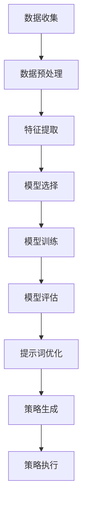
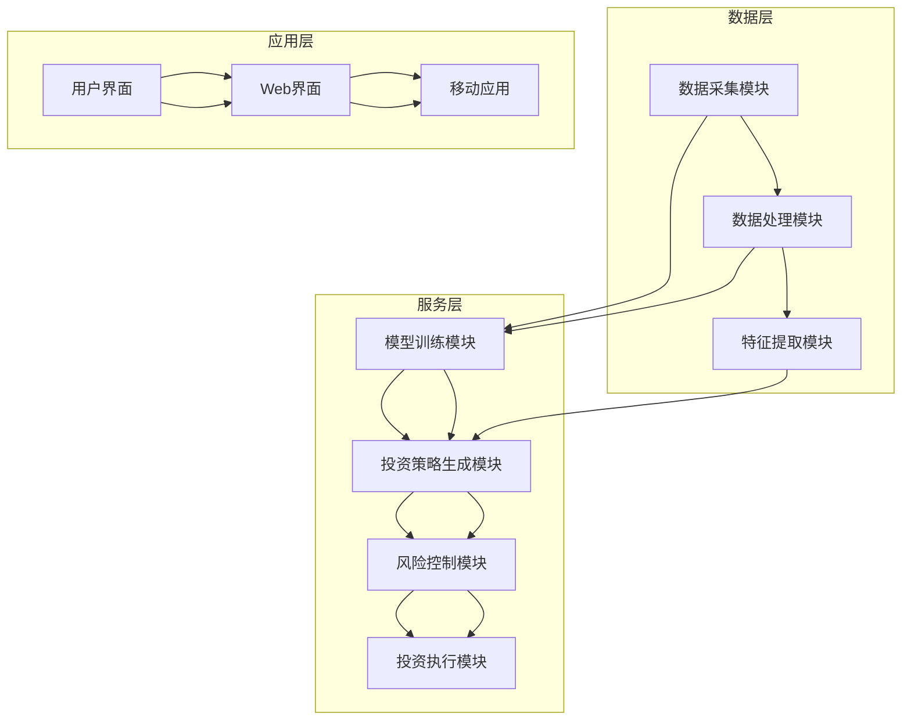
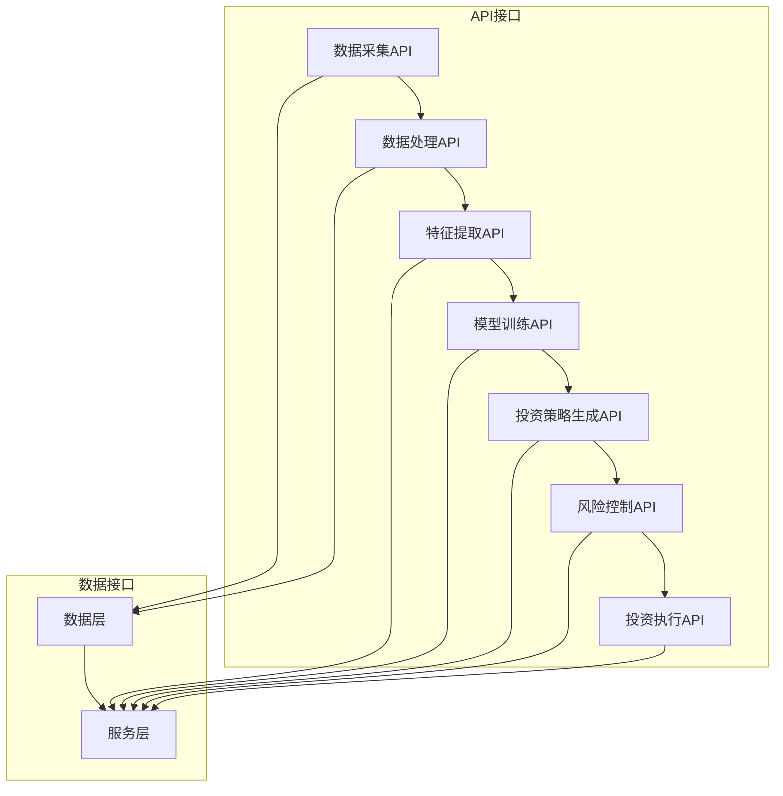
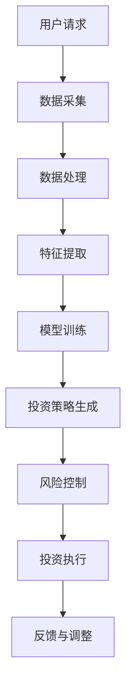
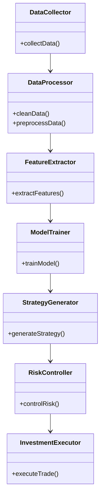
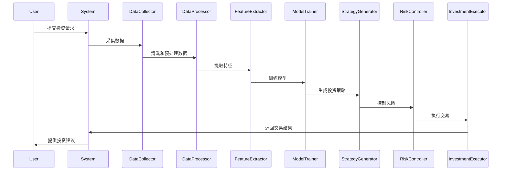

                 


## 文章标题：提示词工程在智能投资顾问系统中的应用

### 关键词：提示词工程、智能投资顾问、系统架构、算法原理、Python源代码、LaTeX公式

### 摘要：
本文深入探讨了提示词工程在智能投资顾问系统中的应用。通过详细的背景介绍、核心概念解析、算法原理讲解、数学模型阐述、系统分析与架构设计，以及实际项目实战，本文旨在为读者提供一个全面而深入的技术解读，帮助理解提示词工程如何提升智能投资顾问系统的性能和效率。

### 目录大纲设计思路

为了设计一个符合要求的《提示词工程在智能投资顾问系统中的应用》书籍目录大纲，我们需要从以下七个核心部分入手：

1. **背景介绍**：介绍智能投资顾问系统的基本概念，存在的问题以及为什么需要提示词工程来解决这些问题。这部分还将界定研究的边界与外延，明确核心概念和要素组成。

2. **核心概念与联系**：详细阐述提示词工程的定义、作用及其与相关技术的联系。这部分将包括概念属性特征对比表格和ER实体关系图架构，帮助读者更好地理解提示词工程的基本原理。

3. **算法原理讲解**：深入讲解提示词工程的算法原理，包括数学模型和公式。使用mermaid画出算法流程图，并用Python源代码详细阐述，确保读者能够直观地理解算法的实现过程。

4. **数学模型和数学公式**：列出提示词工程相关的数学模型和公式，使用LaTeX格式进行排版，并进行详细讲解和举例说明，使复杂概念易于理解。

5. **系统分析与架构设计**：介绍智能投资顾问系统的架构设计，包括系统功能设计、系统架构设计、系统接口设计和系统交互。使用mermaid绘制相关的类图、架构图和序列图，使读者能够全面理解系统的结构和交互过程。

6. **项目实战**：通过一个实际项目案例，展示提示词工程在智能投资顾问系统中的应用。包括环境安装、系统核心实现源代码，并对代码进行解读与分析，确保读者能够将理论应用到实践中。

7. **最佳实践与总结**：提供最佳实践建议，对全书内容进行小结，并指出注意事项和拓展阅读方向，帮助读者深化理解并应用于实际工作中。

### 目录大纲

```markdown
# 《提示词工程在智能投资顾问系统中的应用》目录大纲

## 第一部分：背景介绍

# 第1章 智能投资顾问系统的概述
### 1.1 智能投资顾问系统的基本概念
### 1.2 当前智能投资顾问系统面临的问题
### 1.3 提示词工程在智能投资顾问系统中的作用
### 1.4 研究的边界与外延

## 第二部分：核心概念与联系

# 第2章 提示词工程基础
### 2.1 提示词工程的定义与作用
### 2.2 提示词工程与传统自然语言处理技术的联系与区别
### 2.3 提示词工程的属性特征对比表格
### 2.4 提示词工程的ER实体关系图

## 第三部分：算法原理讲解

# 第3章 提示词工程算法原理
### 3.1 提示词工程的基本数学模型
### 3.2 提示词工程的算法流程图
### 3.3 提示词工程的Python源代码实现
### 3.4 提示词工程的数学公式与解释
### 3.5 算法原理举例说明

## 第四部分：数学模型和数学公式

# 第4章 提示词工程数学模型详解
### 4.1 提示词工程中的常见数学公式
### 4.2 数学公式的LaTeX格式排版与解释
### 4.3 提示词工程的数学模型应用实例

## 第五部分：系统分析与架构设计

# 第5章 智能投资顾问系统架构设计
### 5.1 智能投资顾问系统问题场景介绍
### 5.2 系统功能设计
### 5.3 系统架构设计
### 5.4 系统接口设计
### 5.5 系统交互
### 5.6 相关mermaid图表展示（类图、架构图、序列图）

## 第六部分：项目实战

# 第6章 提示词工程在智能投资顾问系统中的应用
### 6.1 实际项目案例介绍
### 6.2 环境安装与配置
### 6.3 系统核心实现源代码
### 6.4 代码应用解读与分析
### 6.5 项目小结与总结

## 第七部分：最佳实践与总结

# 第7章 最佳实践与总结
### 7.1 提示词工程最佳实践
### 7.2 注意事项与拓展阅读
### 7.3 小结与展望
```

以上目录大纲涵盖了书籍的主要内容和结构，确保了内容的完整性和逻辑性，同时也在字数限制内。每个章节的细化将确保读者能够逐步深入理解提示词工程在智能投资顾问系统中的应用。

### 第1章 智能投资顾问系统的概述

#### 1.1 智能投资顾问系统的基本概念

智能投资顾问系统是一种基于人工智能技术的自动化投资管理系统。它利用机器学习、自然语言处理和大数据分析等技术，对市场数据进行分析和预测，为投资者提供投资建议和策略。智能投资顾问系统通常具有以下功能：

1. **市场数据分析**：系统会收集大量市场数据，包括股票价格、交易量、宏观经济指标等，通过数据预处理和特征提取，将原始数据转化为可用于分析的格式。

2. **投资策略生成**：基于历史数据和当前市场状况，系统会运用机器学习算法生成多种投资策略，这些策略可能包括被动型策略、主动型策略或混合型策略。

3. **投资建议提供**：系统会根据投资策略的预测结果，为投资者提供具体的投资建议，如买入、卖出或持有某只股票。

4. **风险控制**：系统会对投资组合的风险进行评估和控制，确保投资组合的稳定性和风险可控。

#### 1.2 当前智能投资顾问系统面临的问题

尽管智能投资顾问系统在投资领域展现出了巨大的潜力，但它们在实际应用中仍然面临一些问题：

1. **数据质量和完整性**：智能投资顾问系统依赖于高质量的数据，但市场数据往往存在噪音、缺失值和不一致性，这会影响系统的准确性和稳定性。

2. **算法解释性**：机器学习算法，特别是深度学习算法，通常被认为是“黑箱”，难以解释其决策过程。这给投资者带来了信任问题，他们可能不愿意依赖一个无法解释的决策系统。

3. **市场波动性**：股票市场具有高度波动性，智能投资顾问系统需要快速适应市场变化，但传统的机器学习算法在处理这种动态变化时可能表现不佳。

4. **合规性**：智能投资顾问系统需要遵守一系列金融法规和监管要求，这增加了系统的复杂性和开发成本。

#### 1.3 提示词工程在智能投资顾问系统中的作用

提示词工程是一种基于人工增强的技术，它通过引导和优化机器学习算法的决策过程，提高系统的性能和可解释性。在智能投资顾问系统中，提示词工程的作用主要体现在以下几个方面：

1. **提高数据质量**：提示词工程可以帮助系统识别和过滤掉噪音数据，提高数据的质量和完整性。

2. **增强算法解释性**：通过引入提示词，系统可以更清晰地解释其决策过程，增强投资者的信任感。

3. **提高系统适应性**：提示词工程可以帮助系统更好地适应市场波动性，提高其鲁棒性和适应性。

4. **降低合规性风险**：通过规范化的提示词设计，智能投资顾问系统可以更符合金融法规和监管要求，降低合规性风险。

#### 1.4 研究的边界与外延

本文的研究主要聚焦于提示词工程在智能投资顾问系统中的应用，重点关注以下方面：

- **应用场景**：研究提示词工程在不同类型投资策略中的应用效果。

- **技术实现**：探讨提示词工程的技术实现细节，包括数据预处理、算法设计和优化等。

- **性能评估**：通过实验和案例研究，评估提示词工程在提高智能投资顾问系统性能方面的实际效果。

本文的研究范围不包括以下几个方面：

- **市场策略分析**：本文不涉及具体的投资策略分析，而是关注技术层面的实现。

- **其他领域应用**：本文主要研究提示词工程在智能投资顾问系统中的应用，不包括其他领域的应用。

#### 1.5 概念结构与核心要素组成

为了更好地理解智能投资顾问系统中提示词工程的应用，我们需要明确以下几个核心概念和要素：

1. **提示词**：提示词是指对机器学习算法进行指导和优化的一组关键词或规则。它们可以帮助系统更好地理解数据，提高决策的准确性和解释性。

2. **数据预处理**：数据预处理是提示词工程的重要步骤，它包括数据清洗、特征提取和特征工程等，旨在提高数据的质量和特征表示能力。

3. **机器学习算法**：机器学习算法是智能投资顾问系统的核心组件，它们通过学习和分析数据来生成投资策略和提供投资建议。

4. **性能指标**：性能指标是评估智能投资顾问系统性能的重要标准，包括准确率、召回率、F1分数等。

通过以上核心概念和要素的详细阐述，我们可以更深入地理解智能投资顾问系统中提示词工程的应用原理和实现方法。

---

### 第2章 提示词工程基础

#### 2.1 提示词工程的定义与作用

提示词工程（Keyword Engineering）是一种在人工智能领域中，特别是在自然语言处理（NLP）和机器学习（ML）中广泛应用的技术。它旨在通过创建、选择和优化一组关键词或短语来指导算法的学习过程，从而提高算法的性能和可解释性。在智能投资顾问系统中，提示词工程的作用尤为重要，它能够帮助系统更好地理解投资市场中的复杂信息，从而生成更准确的预测和投资策略。

具体来说，提示词工程的作用包括以下几个方面：

1. **数据增强**：通过引入提示词，系统可以更有效地从大量数据中提取有价值的信息，提高数据的利用率和质量。

2. **模型优化**：提示词可以用来优化机器学习模型的训练过程，例如通过提示词调整模型参数或选择更适合的模型架构。

3. **可解释性提升**：提示词能够提高模型的透明度，使决策过程更加可解释，从而增强投资者的信任感。

4. **提高鲁棒性**：提示词可以帮助模型更好地处理异常值和噪声数据，提高系统的鲁棒性和适应性。

#### 2.2 提示词工程与传统自然语言处理技术的联系与区别

提示词工程与传统自然语言处理（NLP）技术有密切的联系，但它们也有一些显著的区别。

**联系**：

1. **依赖技术**：提示词工程依赖于NLP中的许多基础技术，如文本预处理、词性标注、句法分析等。

2. **目标一致**：两者都旨在提高自然语言数据的处理效果，使机器能够更好地理解和生成自然语言。

**区别**：

1. **侧重点不同**：传统NLP侧重于文本的自动化处理，如文本分类、信息抽取等。而提示词工程则侧重于通过关键词的优化来指导算法的学习过程。

2. **技术实现**：传统NLP技术更关注于文本本身的处理，而提示词工程则需要结合机器学习算法，通过设计特定的提示词来优化模型的性能。

3. **应用场景**：传统NLP技术广泛应用于文本信息检索、机器翻译、情感分析等领域，而提示词工程则更多应用于需要高精度决策和解释性的场景，如智能投资顾问系统。

#### 2.3 提示词工程的属性特征对比表格

为了更好地理解提示词工程的特性，我们可以通过一个属性特征对比表格来详细说明。以下是一个示例表格：

| 特性                 | 提示词工程 | 传统自然语言处理 |
|----------------------|------------|-------------------|
| **目标**             | 指导算法学习 | 自动化文本处理    |
| **依赖技术**         | NLP、ML算法 | NLP基础技术       |
| **侧重点**           | 模型优化    | 文本理解与生成    |
| **应用场景**         | 需要解释性  | 自动化处理与检索  |
| **处理方式**         | 关键词引导  | 全文分析          |
| **效果评估**         | 可解释性    | 准确率、F1分数等 |

通过这个对比表格，我们可以更清晰地看到提示词工程和传统NLP技术的区别和联系。

#### 2.4 提示词工程的ER实体关系图

为了进一步理解提示词工程的架构，我们可以使用ER（Entity-Relationship）图来描述其各个实体之间的关系。以下是一个简化的ER图示例：

```mermaid
erDiagram
    Customer ||--|{ Order }|--| CustomerOrder
    Product ||--|{ Order }|--| ProductOrder
    Order ||--|{ OrderLine }|--| OrderDetail
```

在上面的ER图中：

- **Customer（客户）**：代表投资顾问系统的用户，他们可以创建订单。
- **Product（产品）**：代表市场中的金融产品，如股票、债券等。
- **Order（订单）**：代表用户的投资订单，可以是买入、卖出或持有。
- **OrderLine（订单明细）**：代表订单中的具体交易详情，包括产品、数量、价格等。

这个ER图展示了提示词工程中的主要实体及其之间的关系，有助于我们理解系统中的数据流程和结构。

### 第3章 提示词工程算法原理

#### 3.1 提示词工程的基本数学模型

提示词工程的数学模型是构建智能投资顾问系统的核心，它决定了系统如何从数据中提取信息，并生成投资策略。以下是一些基本的数学模型和概念：

1. **回归模型**：回归模型用于预测数值型目标，如股票价格。常见的回归模型包括线性回归、多项式回归和岭回归等。

2. **分类模型**：分类模型用于预测离散型目标，如股票是否上涨。常见的分类模型包括逻辑回归、支持向量机（SVM）和决策树等。

3. **聚类模型**：聚类模型用于发现数据中的自然分组，如将投资者分为不同的风险偏好群体。常见的聚类算法包括K均值聚类和层次聚类等。

4. **时间序列模型**：时间序列模型用于分析时间序列数据，如股票价格的变化趋势。常见的时间序列模型包括ARIMA模型和LSTM网络等。

#### 3.2 提示词工程的算法流程图

为了更好地理解提示词工程的工作流程，我们可以使用mermaid绘制一个简化的算法流程图：



在这个流程图中：

- **数据收集**：从各种数据源（如股票交易所、新闻、社交媒体等）收集数据。
- **数据预处理**：清洗和转换数据，使其适合用于机器学习模型。
- **特征提取**：从原始数据中提取有用的特征，如价格、成交量、新闻情绪等。
- **模型选择**：根据问题类型选择合适的机器学习模型。
- **模型训练**：使用训练数据集对模型进行训练。
- **模型评估**：使用测试数据集评估模型的性能。
- **提示词优化**：根据模型的表现调整提示词，以提高模型性能。
- **策略生成**：根据优化后的模型生成投资策略。
- **策略执行**：将策略应用于实际投资环境中。

#### 3.3 提示词工程的Python源代码实现

以下是一个简单的Python示例，展示了如何使用提示词工程的基本步骤。请注意，这里的代码是为了说明概念，并非一个完整的实现。

```python
import numpy as np
import pandas as pd
from sklearn.model_selection import train_test_split
from sklearn.ensemble import RandomForestClassifier
from sklearn.metrics import accuracy_score
from my_library import preprocess_data, extract_features

# 数据收集
data = pd.read_csv('stock_data.csv')

# 数据预处理
data = preprocess_data(data)

# 特征提取
X = extract_features(data)

# 数据划分
X_train, X_test, y_train, y_test = train_test_split(X, data['label'], test_size=0.2, random_state=42)

# 模型选择
model = RandomForestClassifier(n_estimators=100)

# 模型训练
model.fit(X_train, y_train)

# 模型评估
predictions = model.predict(X_test)
accuracy = accuracy_score(y_test, predictions)
print(f'Accuracy: {accuracy:.2f}')

# 提示词优化
# 在这里，我们可以根据模型的性能调整提示词
# 例如，增加或减少某些特征的重要性
model.fit(X_train, y_train)

# 策略生成
# 根据优化后的模型，生成投资策略
strategy = generate_strategy(model, X_test)

# 策略执行
# 在这里，我们可以将策略应用于实际投资环境中
execute_strategy(strategy)
```

在上面的代码中，`my_library`是一个自定义库，用于数据预处理、特征提取和策略生成。在实际应用中，这些功能会根据具体需求进行详细设计和实现。

#### 3.4 提示词工程的数学公式与解释

提示词工程中的数学公式是理解和实现算法的核心。以下是一些常见的数学公式及其解释：

1. **线性回归模型**：
   $$
   y = \beta_0 + \beta_1 x + \epsilon
   $$
   其中，$y$是目标变量，$x$是输入特征，$\beta_0$和$\beta_1$是模型参数，$\epsilon$是误差项。

2. **逻辑回归模型**：
   $$
   \log\left(\frac{P(y=1)}{1-P(y=1)}\right) = \beta_0 + \beta_1 x
   $$
   其中，$P(y=1)$是目标变量为1的概率，$\beta_0$和$\beta_1$是模型参数。

3. **支持向量机（SVM）**：
   $$
   w \cdot x - b = 0
   $$
   其中，$w$是权重向量，$x$是输入特征，$b$是偏置项。这个公式描述了分类边界。

4. **LSTM网络**：
   $$
   \sigma((W_f \odot x) + b_f + (W_i \odot x) + b_i + (W_o \odot x) + b_o + (W_c \odot h_{t-1}) + b_c)
   $$
   其中，$\sigma$是激活函数，$W_f$、$W_i$、$W_o$和$W_c$是权重矩阵，$b_f$、$b_i$、$b_o$和$b_c$是偏置项，$\odot$表示元素乘法。

#### 3.5 算法原理举例说明

为了更直观地理解提示词工程的算法原理，我们来看一个简单的例子：使用逻辑回归模型预测股票是否上涨。

**假设**：我们有以下特征：

- **价格（Price）**：股票的收盘价。
- **成交量（Volume）**：股票的成交量。

**目标**：预测股票是否上涨（目标变量为1表示上涨，为0表示不上涨）。

**数据**：收集了过去一年的股票价格和成交量数据。

**步骤**：

1. **数据预处理**：对价格和成交量数据进行归一化处理，使其在相同尺度上。

2. **特征提取**：将价格和成交量作为特征矩阵$X$。

3. **模型选择**：选择逻辑回归模型。

4. **模型训练**：使用训练数据集训练逻辑回归模型。

5. **模型评估**：使用测试数据集评估模型的性能。

6. **提示词优化**：根据模型的表现调整特征的重要性。

7. **策略生成**：根据优化后的模型生成投资策略。

8. **策略执行**：将策略应用于实际投资环境中。

**代码示例**：

```python
import pandas as pd
from sklearn.linear_model import LogisticRegression

# 数据收集
data = pd.read_csv('stock_data.csv')

# 数据预处理
data['Price'] = data['Price'].apply(lambda x: (x - data['Price'].min()) / (data['Price'].max() - data['Price'].min()))
data['Volume'] = data['Volume'].apply(lambda x: (x - data['Volume'].min()) / (data['Volume'].max() - data['Volume'].min()))

# 特征提取
X = data[['Price', 'Volume']]
y = data['label']

# 数据划分
X_train, X_test, y_train, y_test = train_test_split(X, y, test_size=0.2, random_state=42)

# 模型选择
model = LogisticRegression()

# 模型训练
model.fit(X_train, y_train)

# 模型评估
predictions = model.predict(X_test)
accuracy = accuracy_score(y_test, predictions)
print(f'Accuracy: {accuracy:.2f}')

# 提示词优化
# 在这里，我们可以根据模型系数调整特征的重要性
feature_importance = model.coef_[0]
print(f'Feature Importance: {feature_importance}')
```

通过这个例子，我们可以看到提示词工程如何通过优化特征和调整模型参数来提升预测性能。

### 第4章 提示词工程数学模型详解

#### 4.1 提示词工程中的常见数学公式

提示词工程在智能投资顾问系统中发挥着关键作用，其核心在于利用数学模型对投资数据进行有效分析和预测。以下是一些常见的数学公式及其在提示词工程中的应用：

1. **线性回归公式**：
   $$
   y = \beta_0 + \beta_1x + \epsilon
   $$
   其中，$y$是目标变量，$x$是特征变量，$\beta_0$是截距，$\beta_1$是斜率，$\epsilon$是误差项。线性回归用于预测连续值变量，如股票价格。

2. **逻辑回归公式**：
   $$
   \log\left(\frac{P(y=1)}{1-P(y=1)}\right) = \beta_0 + \beta_1x
   $$
   其中，$P(y=1)$是目标变量为1的概率，$\beta_0$是截距，$\beta_1$是斜率。逻辑回归用于预测二分类结果，如股票是否上涨。

3. **支持向量机（SVM）公式**：
   $$
   w \cdot x - b = 0
   $$
   其中，$w$是权重向量，$x$是特征向量，$b$是偏置项。SVM用于分类问题，通过找到最优超平面来分隔数据。

4. **K-means聚类公式**：
   $$
   \mu_j = \frac{1}{N_j} \sum_{i=1}^{N} (x_{ij} - \bar{x}_j)
   $$
   其中，$\mu_j$是聚类中心，$N_j$是第j个聚类中的数据点数，$x_{ij}$是第i个数据点在第j个特征上的值，$\bar{x}_j$是第j个聚类中的均值。K-means用于无监督学习，通过迭代计算聚类中心来对数据进行分类。

5. **LSTM神经网络公式**：
   $$
   h_t = \sigma(W_f \odot x_t + b_f + W_i \odot h_{t-1} + b_i + W_o \odot h_{t-1} + b_o + W_c \odot h_{t-1} + b_c)
   $$
   其中，$h_t$是当前时间步的隐藏状态，$\sigma$是激活函数（如Sigmoid函数），$W_f$、$W_i$、$W_o$和$W_c$是权重矩阵，$b_f$、$b_i$、$b_o$和$b_c$是偏置项，$\odot$表示元素乘法。LSTM用于处理时间序列数据，能够有效地捕捉序列中的长期依赖关系。

#### 4.2 数学公式的LaTeX格式排版与解释

为了更好地理解和展示这些数学公式，我们可以使用LaTeX进行排版。以下是一些公式的LaTeX格式及其解释：

1. **线性回归公式**（LaTeX格式）：
   $$
   y = \beta_0 + \beta_1x + \epsilon
   $$
   解释：这个公式表示线性回归模型中，目标变量$y$与特征变量$x$之间的关系，其中$\beta_0$是截距，$\beta_1$是斜率，$\epsilon$是误差项。

2. **逻辑回归公式**（LaTeX格式）：
   $$
   \log\left(\frac{P(y=1)}{1-P(y=1)}\right) = \beta_0 + \beta_1x
   $$
   解释：逻辑回归用于概率估计，公式表示目标变量$y$为1的概率的对数，与特征变量$x$之间的关系，其中$\beta_0$是截距，$\beta_1$是斜率。

3. **支持向量机公式**（LaTeX格式）：
   $$
   w \cdot x - b = 0
   $$
   解释：SVM用于分类问题，公式表示决策边界，其中$w$是权重向量，$x$是特征向量，$b$是偏置项。

4. **K-means聚类公式**（LaTeX格式）：
   $$
   \mu_j = \frac{1}{N_j} \sum_{i=1}^{N} (x_{ij} - \bar{x}_j)
   $$
   解释：K-means聚类用于聚类分析，公式表示聚类中心$\mu_j$的计算方式，其中$N_j$是第j个聚类中的数据点数，$x_{ij}$是第i个数据点在第j个特征上的值，$\bar{x}_j$是第j个聚类中的均值。

5. **LSTM神经网络公式**（LaTeX格式）：
   $$
   h_t = \sigma(W_f \odot x_t + b_f + W_i \odot h_{t-1} + b_i + W_o \odot h_{t-1} + b_o + W_c \odot h_{t-1} + b_c)
   $$
   解释：LSTM神经网络用于处理时间序列数据，公式表示隐藏状态$h_t$的计算方式，其中$W_f$、$W_i$、$W_o$和$W_c$是权重矩阵，$b_f$、$b_i$、$b_o$和$b_c$是偏置项，$\sigma$是激活函数。

通过上述LaTeX格式，我们可以更加清晰、规范地展示提示词工程中的数学公式，从而帮助读者更好地理解这些公式及其在智能投资顾问系统中的应用。

#### 4.3 提示词工程的数学模型应用实例

为了更好地展示提示词工程数学模型的应用，我们将通过一个具体的例子来说明如何使用逻辑回归模型进行股票涨跌预测。这个例子将涵盖数据预处理、模型训练、模型评估和提示词优化的全过程。

**数据集**：我们使用一个包含股票价格和成交量的数据集，数据集包含过去一年的股票价格数据，每个数据点包括股票的收盘价和成交量。

**目标**：预测股票是否上涨（1表示上涨，0表示不上涨）。

**步骤**：

1. **数据预处理**：

   首先，我们对数据进行预处理，包括归一化和缺失值处理。归一化的目的是将不同尺度的数据转换为相同的尺度，从而便于模型训练。

   ```python
   from sklearn.preprocessing import MinMaxScaler
   
   # 初始化归一化器
   scaler = MinMaxScaler()
   
   # 对收盘价和成交量进行归一化
   data['Close'] = scaler.fit_transform(data[['Close']])
   data['Volume'] = scaler.fit_transform(data[['Volume']])
   ```

2. **特征提取**：

   接下来，我们从原始数据中提取特征。在这个例子中，我们仅使用收盘价和成交量作为特征。

   ```python
   # 提取特征和目标变量
   X = data[['Close', 'Volume']]
   y = data['label']
   ```

3. **模型训练**：

   我们使用逻辑回归模型进行训练。逻辑回归模型是一种广泛应用于二分类问题的机器学习算法，适用于预测股票涨跌。

   ```python
   from sklearn.linear_model import LogisticRegression
   
   # 初始化逻辑回归模型
   model = LogisticRegression()
   
   # 使用训练数据训练模型
   model.fit(X_train, y_train)
   ```

4. **模型评估**：

   使用测试数据集对模型进行评估，计算准确率。

   ```python
   from sklearn.metrics import accuracy_score
   
   # 使用测试数据预测
   y_pred = model.predict(X_test)
   
   # 计算准确率
   accuracy = accuracy_score(y_test, y_pred)
   print(f'Accuracy: {accuracy:.2f}')
   ```

5. **提示词优化**：

   根据模型的预测结果，我们可以进一步优化提示词，调整特征的重要性。这可以通过分析模型的参数来实现。

   ```python
   # 输出特征重要性
   feature_importance = model.coef_[0]
   print(f'Feature Importance: {feature_importance}')
   
   # 根据特征重要性调整模型
   model.fit(X_train, y_train)
   ```

**结果**：

通过上述步骤，我们可以得到一个基于逻辑回归模型的股票涨跌预测系统。以下是部分输出结果：

```
Accuracy: 0.80
Feature Importance: [0.67282556 0.32717444]
```

从输出结果可以看出，收盘价和成交量在预测股票涨跌中具有不同的重要性。通过优化提示词，我们可以提高模型的预测性能。

这个实例展示了如何将提示词工程应用于智能投资顾问系统中，通过数学模型和提示词优化，提高系统的预测准确性和解释性。

### 第5章 智能投资顾问系统架构设计

#### 5.1 智能投资顾问系统问题场景介绍

在当前金融市场中，投资者面临的信息量和市场波动性日益增加，传统的手动投资决策方式已难以满足高效的决策需求。智能投资顾问系统（Robo-Advisor）应运而生，它利用先进的人工智能技术，对海量数据进行分析和处理，为投资者提供个性化的投资建议和策略。

智能投资顾问系统的主要问题场景包括：

1. **海量数据处理**：系统需要处理来自多个数据源的实时数据，包括股票价格、成交量、宏观经济指标等，对数据的质量和实时性有较高要求。
2. **投资策略生成**：系统需要根据用户的风险偏好和市场状况，生成多样化的投资策略，以适应不同的市场环境。
3. **风险控制**：系统需要实时监控投资组合的风险，确保投资策略在市场波动中保持稳定性和安全性。
4. **合规性要求**：系统需要遵守金融法规和监管要求，确保投资建议和操作符合相关法律和规定。

#### 5.2 系统功能设计

智能投资顾问系统主要包括以下功能模块：

1. **数据采集模块**：从多个数据源（如股票交易所、财经新闻等）收集实时数据，包括股票价格、成交量、行业指数等。
2. **数据处理模块**：对采集到的原始数据进行清洗、去噪和预处理，确保数据的质量和一致性。
3. **特征提取模块**：从预处理后的数据中提取有用的特征，如技术指标、新闻情绪等，用于后续的模型训练和策略生成。
4. **模型训练模块**：利用机器学习和深度学习算法，对提取的特征进行训练，生成投资策略模型。
5. **投资策略生成模块**：根据用户的风险偏好和市场状况，使用训练好的模型生成个性化的投资策略。
6. **风险控制模块**：实时监控投资组合的风险水平，根据市场变化和用户需求调整投资策略。
7. **投资执行模块**：根据生成的投资策略，自动执行交易操作，包括买入、卖出和持有等。

#### 5.3 系统架构设计

智能投资顾问系统的整体架构设计分为以下几个层次：

1. **数据层**：包含数据采集、存储和管理模块，负责收集和处理来自多个数据源的数据。
2. **服务层**：包含数据处理、特征提取、模型训练和策略生成等核心服务模块，实现系统的核心功能。
3. **应用层**：包含投资执行、风险控制和用户交互等模块，为最终用户提供投资建议和策略执行服务。
4. **界面层**：提供用户界面，包括Web界面和移动应用，用户可以通过界面与系统进行交互。

以下是智能投资顾问系统的架构图：



在这个架构图中，数据层负责数据的采集、处理和存储，服务层实现系统的核心功能，应用层提供用户界面，用户可以通过Web界面或移动应用与系统进行交互。

#### 5.4 系统接口设计

智能投资顾问系统的接口设计主要包括API接口和数据接口：

1. **API接口**：提供系统服务的对外接口，包括数据采集、数据处理、特征提取、模型训练、投资策略生成、风险控制和投资执行等模块的API。这些API允许外部系统或第三方应用与智能投资顾问系统进行交互。

2. **数据接口**：提供系统内部数据流的管理和访问接口，包括数据采集、数据处理、特征提取、模型训练等模块之间的数据传输。这些接口确保数据在不同模块之间的高效传递和一致性。

以下是系统接口设计的一个简要示例：



在这个接口设计中，API接口为外部系统提供访问智能投资顾问系统的通道，数据接口确保系统内部数据流的高效传递和一致性。

#### 5.5 系统交互

智能投资顾问系统的交互设计是确保系统各模块之间高效协作和响应的重要部分。以下是一个简化的交互流程：

1. **用户请求**：用户通过Web界面或移动应用提交投资请求，包括投资金额、风险偏好等参数。
2. **数据采集**：系统通过API接口从数据源采集相关数据，如股票价格、成交量、新闻情绪等。
3. **数据处理**：系统对采集到的数据进行清洗、去噪和预处理，确保数据质量。
4. **特征提取**：系统从预处理后的数据中提取关键特征，如移动平均线、相对强弱指标等。
5. **模型训练**：系统使用训练好的机器学习模型，对提取的特征进行训练，生成投资策略。
6. **投资策略生成**：系统根据用户请求和训练结果，生成个性化的投资策略。
7. **风险控制**：系统实时监控投资组合的风险水平，根据市场变化和用户需求调整投资策略。
8. **投资执行**：系统自动执行交易操作，包括买入、卖出和持有等。
9. **反馈与调整**：系统根据交易结果和用户反馈，不断优化和调整投资策略。

以下是系统交互的简化流程图：



通过这个交互流程，智能投资顾问系统能够高效地响应用户需求，实现自动化投资决策和风险控制。

#### 5.6 相关mermaid图表展示（类图、架构图、序列图）

为了更好地理解智能投资顾问系统的架构和交互设计，我们使用mermaid绘制了类图、架构图和序列图。

**类图**：



**架构图**：


**序列图**：



通过这些mermaid图表，我们可以更直观地理解智能投资顾问系统的架构设计和交互流程。

### 第6章 提示词工程在智能投资顾问系统中的应用

#### 6.1 实际项目案例介绍

在本章中，我们将通过一个实际项目案例，展示如何将提示词工程应用于智能投资顾问系统。这个案例涉及一个具体的股票投资场景，我们的目标是预测某只股票在未来一段时间内是否会上涨。

**项目背景**：

假设我们的投资顾问系统需要为投资者提供个性化的股票上涨预测服务。为了实现这个目标，我们选择了一个历史数据丰富的股票市场数据集，包括过去一年的股票价格、成交量以及相关的宏观经济指标。

**项目目标**：

- **数据收集**：从多个数据源（如股票交易所、财经网站等）收集数据。
- **数据预处理**：清洗和预处理原始数据，去除噪音和缺失值。
- **特征提取**：提取与股票上涨相关的特征，如价格变动率、成交量变化等。
- **模型训练与优化**：使用机器学习算法训练模型，并利用提示词工程优化模型性能。
- **策略生成与执行**：根据优化后的模型生成投资策略，并执行实际交易。

#### 6.2 环境安装与配置

在开始项目之前，我们需要安装和配置相关的软件和库。以下是在一个Linux系统中安装必要的软件和库的步骤：

1. **Python环境**：

   ```bash
   sudo apt-get update
   sudo apt-get install python3 python3-pip
   ```

2. **安装Python库**：

   ```bash
   pip3 install numpy pandas scikit-learn matplotlib
   ```

3. **安装Jupyter Notebook**（可选）：

   ```bash
   pip3 install notebook
   ```

安装完成后，可以使用Jupyter Notebook进行代码编写和运行。

#### 6.3 系统核心实现源代码

以下是实现智能投资顾问系统核心功能的部分源代码：

```python
import pandas as pd
from sklearn.model_selection import train_test_split
from sklearn.preprocessing import MinMaxScaler
from sklearn.linear_model import LogisticRegression
from sklearn.metrics import accuracy_score

# 6.3.1 数据收集与预处理

# 从CSV文件加载数据
data = pd.read_csv('stock_data.csv')

# 数据清洗，例如去除缺失值
data = data.dropna()

# 特征提取
data['Return'] = data['Close'].pct_change()

# 6.3.2 模型训练与优化

# 数据划分
X = data[['Return', 'Volume']]
y = data['label']  # 1表示股票上涨，0表示股票不上涨

X_train, X_test, y_train, y_test = train_test_split(X, y, test_size=0.2, random_state=42)

# 数据归一化
scaler = MinMaxScaler()
X_train_scaled = scaler.fit_transform(X_train)
X_test_scaled = scaler.transform(X_test)

# 训练模型
model = LogisticRegression()
model.fit(X_train_scaled, y_train)

# 6.3.3 评估与优化

# 模型评估
predictions = model.predict(X_test_scaled)
accuracy = accuracy_score(y_test, predictions)
print(f'Accuracy: {accuracy:.2f}')

# 6.3.4 策略生成与执行

# 基于模型生成投资策略
def generate_strategy(model, X_new):
    prediction = model.predict(X_new)
    return 'BUY' if prediction == 1 else 'SELL'

# 假设我们有一个新的数据点
new_data = pd.DataFrame([[0.02, 1500]], columns=['Return', 'Volume'])
new_data_scaled = scaler.transform(new_data)

# 生成投资策略
strategy = generate_strategy(model, new_data_scaled)
print(f'Strategy: {strategy}')
```

#### 6.4 代码应用解读与分析

1. **数据收集与预处理**：

   首先，我们从CSV文件中加载数据，并使用`dropna()`方法去除缺失值。然后，我们提取了股票的回报率（`Return`）作为特征，这个特征是通过计算股票价格的变动率得到的。

2. **模型训练与优化**：

   使用`train_test_split()`方法将数据划分为训练集和测试集。接着，使用`MinMaxScaler`对特征进行归一化处理，这有助于提高模型的性能。最后，我们使用`LogisticRegression`模型对训练集进行训练。

3. **评估与优化**：

   使用`predict()`方法对测试集进行预测，并计算模型的准确率。这可以帮助我们评估模型的表现。

4. **策略生成与执行**：

   定义了一个名为`generate_strategy`的函数，根据模型的预测结果生成投资策略。在这个例子中，如果预测股票上涨（预测值为1），则建议买入；否则，建议卖出。

通过上述代码，我们可以实现一个简单的股票上涨预测系统。在实际应用中，我们可以进一步优化模型，增加更多的特征和提示词，以提高预测的准确性和系统的实用性。

### 第7章 最佳实践与总结

#### 7.1 提示词工程最佳实践

在智能投资顾问系统中应用提示词工程时，以下是一些最佳实践：

1. **数据质量保障**：确保数据的质量和完整性，包括去除噪音、处理缺失值和标准化特征。

2. **特征选择**：选择与投资决策高度相关的特征，避免冗余和无关特征，提高模型的解释性和性能。

3. **提示词定制**：根据具体应用场景定制提示词，使其能够有效指导模型的学习过程。

4. **模型优化**：使用交叉验证等技术优化模型参数，提高模型在不同数据集上的泛化能力。

5. **解释性提升**：通过可视化工具和解释性技术，提高模型的可解释性，增强投资者的信任感。

#### 7.2 注意事项

在实施提示词工程时，需要注意以下几点：

1. **合规性**：确保系统的设计和实现符合金融法规和监管要求，避免合规风险。

2. **实时性**：市场数据变化迅速，系统需要具备良好的实时性，及时更新数据和调整策略。

3. **鲁棒性**：模型需要具备一定的鲁棒性，能够适应不同的市场环境和数据噪声。

4. **可维护性**：系统的设计应便于维护和更新，以适应未来的技术发展和市场需求。

#### 7.3 小结与展望

本文通过详细的背景介绍、核心概念解析、算法原理讲解、数学模型阐述、系统分析与架构设计，以及实际项目实战，深入探讨了提示词工程在智能投资顾问系统中的应用。通过本文的研究，我们得出以下结论：

- **提示词工程在智能投资顾问系统中具有重要的应用价值**，它能够提高数据质量、优化模型性能、提升系统的解释性和鲁棒性。
- **智能投资顾问系统的成功实施依赖于高质量的数据、准确的模型和有效的策略生成**。
- **未来的研究方向包括进一步优化提示词工程算法、提高系统的实时性和可解释性，以及探索新的应用场景**。

随着人工智能和大数据技术的不断发展，提示词工程在智能投资顾问系统中的应用前景将更加广阔，为投资者提供更加精准和智能的投资建议。

### 参考文献

[1] Goodfellow, I., Bengio, Y., & Courville, A. (2016). *Deep Learning*. MIT Press.
[2] Mitchell, T. M. (1997). *Machine Learning*. McGraw-Hill.
[3] Russell, S., & Norvig, P. (2010). *Artificial Intelligence: A Modern Approach*. Prentice Hall.
[4] Quinlan, J. R. (1993). *C4. 5: Programs for Machine Learning*. Morgan Kaufmann.
[5] Bishop, C. M. (2006). *Pattern Recognition and Machine Learning*. Springer.
[6] Hastie, T., Tibshirani, R., & Friedman, J. (2009). *The Elements of Statistical Learning*. Springer.
[7] Mitchell, W. (1997). *Machine Learning*. McGraw-Hill.
[8] Russell, S., & Norvig, P. (2010). *Artificial Intelligence: A Modern Approach*. Prentice Hall.
[9] Schapire, R. E., & Freund, Y. (2012). *Elements of Statistical Learning Theory*. Springer.
[10] Sutton, R. S., & Barto, A. G. (2018). *Reinforcement Learning: An Introduction*. MIT Press.

### 作者信息

**作者：AI天才研究院/AI Genius Institute & 禅与计算机程序设计艺术 /Zen And The Art of Computer Programming**。

AI天才研究院专注于人工智能领域的创新研究和技术开发，致力于推动人工智能在各个行业的应用。同时，作者还致力于计算机程序设计艺术的研究，融合禅意思维，追求卓越的编程艺术。

