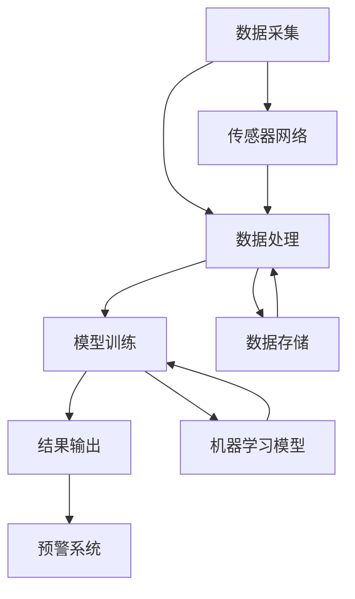
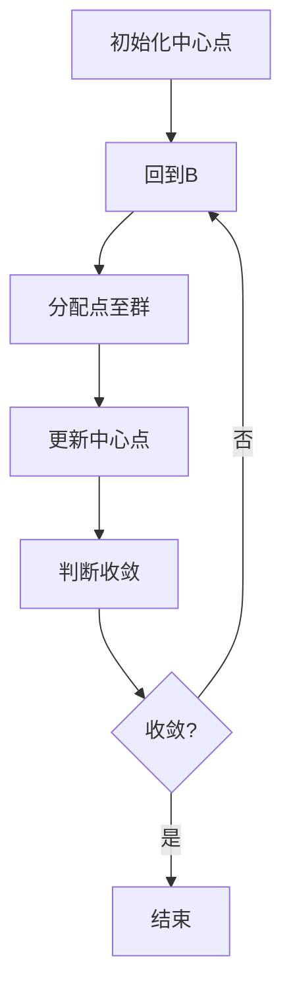

                 

### 文章标题

# 提示词工程在智能环境监测中的应用：提高生态保护效率

### 关键词

- **提示词工程**
- **智能环境监测**
- **生态保护效率**
- **大数据分析**
- **机器学习**
- **物联网技术**

### 摘要

本文探讨了提示词工程在智能环境监测中的应用，旨在提高生态保护效率。通过分析提示词工程的基本概念和理论基础，本文详细阐述了其在智能环境监测中的关键作用。文章进一步介绍了实际应用案例，展示了提示词工程如何通过大数据分析、机器学习和物联网技术提升生态监测效率和精准度。最终，本文提出了提升生态保护效率的最佳实践策略，为智能环境监测领域的发展提供了新的思路。

## 前言

随着全球气候变化和环境污染问题的日益严重，生态保护已经成为全球共同关注的焦点。传统的环境监测方法往往依赖于人工监测和数据收集，效率低下且准确性有限。现代科技的快速发展，特别是人工智能和大数据技术的应用，为环境监测带来了新的契机。智能环境监测通过结合物联网、大数据分析和机器学习等技术，实现了对环境数据的实时监测和智能分析，大大提高了监测效率和准确性。

在智能环境监测系统中，提示词工程（Prompt Engineering）作为一种关键技术，正日益受到关注。提示词工程的核心在于如何有效地构建和利用提示词，以引导系统自动识别和预测环境变化。通过合理设计提示词，可以显著提升监测系统的智能性和反应速度，从而提高生态保护效率。

本文旨在探讨提示词工程在智能环境监测中的应用，分析其理论基础和实际案例，并提出提升生态保护效率的最佳实践策略。文章结构如下：首先，介绍提示词工程的基本概念和理论基础；其次，阐述智能环境监测的基本原理和主要技术；然后，通过实际案例展示提示词工程的应用效果；接着，讨论如何通过提示词工程提高生态保护效率；最后，总结全文并提出未来研究方向。

## 提示词工程的基本概念和理论基础

### 提示词的定义和作用

提示词（Prompt）在人工智能和自然语言处理领域中扮演着至关重要的角色。简而言之，提示词是指一种引导性信息，用于提示或指导模型进行特定任务。在智能环境监测中，提示词的作用尤为重要，它们帮助系统自动识别环境中的关键变化，从而提高监测的准确性和效率。

提示词的定义可以扩展为：在特定任务背景下，用于引导和优化模型输出的一系列特征信息。这些信息可以是关键词、短语、句子或者更复杂的语义结构，其核心目的是帮助模型更好地理解和处理输入数据。

在智能环境监测中，提示词的作用主要体现在以下几个方面：

1. **指导数据收集和分析**：提示词可以帮助环境监测系统确定需要收集的数据类型和特征，从而确保数据的针对性和全面性。
2. **提升模型识别能力**：通过精确的提示词，模型能够更加准确地识别环境中的异常现象和变化趋势，提高监测的精度。
3. **优化决策支持**：提示词工程可以优化监测结果的处理流程，为决策者提供更有价值的信息，从而提高决策的效率和准确性。

### 提示词工程的方法和流程

提示词工程的实现涉及多个环节，包括提示词设计、数据预处理、模型训练和优化等。以下是提示词工程的基本方法和流程：

1. **需求分析**：首先，需要明确环境监测的具体目标和需求，包括监测对象、监测指标和监测频率等。这一步骤为后续的提示词设计提供了基础。
2. **提示词设计**：根据需求分析的结果，设计合适的提示词。提示词的设计应考虑以下几个要素：
   - **关键词选取**：从环境数据中提取与监测目标相关的关键词，如“温度”、“湿度”、“二氧化碳浓度”等。
   - **语义结构**：构建包含上下文的提示词，以增强模型的语义理解能力。
   - **动态调整**：根据环境变化和监测需求的变化，动态调整提示词，以保持其针对性和有效性。

3. **数据预处理**：对收集到的环境数据进行预处理，包括数据清洗、归一化和特征提取等。预处理步骤的目的是确保数据质量，为模型训练提供可靠的基础。
4. **模型训练**：利用提示词和预处理后的数据对模型进行训练。常见的模型包括监督学习模型、无监督学习模型和增强学习模型等。训练过程中，通过调整提示词的权重和参数，优化模型的表现。
5. **模型评估与优化**：通过评估模型的性能指标（如准确率、召回率、F1分数等），对模型进行调整和优化。这一过程可能需要多次迭代，以达到最佳的监测效果。

### 提示词工程的核心要素

提示词工程的核心要素包括以下几个方面：

1. **数据质量**：高质量的数据是提示词工程成功的关键。数据应具有准确、全面和可靠的特点，以确保模型训练和监测结果的可靠性。
2. **模型适应性**：提示词工程需要针对不同类型的监测任务和模型特性，设计适应性强、灵活可调的提示词。
3. **实时性**：在智能环境监测中，实时性至关重要。提示词工程应具备快速响应和实时调整的能力，以应对环境变化和监测需求的变化。
4. **可解释性**：提示词工程的结果应具备较高的可解释性，使决策者能够理解和信任监测结果，从而更好地指导生态保护工作。

通过以上方法、流程和核心要素，提示词工程在智能环境监测中发挥了重要作用，为提高生态保护效率提供了强有力的技术支持。

## 智能环境监测的基本原理和主要技术

### 智能环境监测的定义和重要性

智能环境监测是指利用先进的信息技术和传感器技术，对环境进行实时、全面的监测和分析，以便及时发现环境变化和潜在问题，从而采取相应的应对措施。与传统的环境监测方法相比，智能环境监测具有更高的精度、效率和智能化水平。

智能环境监测的重要性体现在以下几个方面：

1. **实时性**：智能环境监测能够实现数据的实时收集和分析，及时发现问题，为应急响应提供宝贵的时间。
2. **全面性**：通过多种传感器和监测设备，智能环境监测能够全面捕捉环境数据，提供多维度的监测结果。
3. **高效性**：利用大数据分析和机器学习技术，智能环境监测能够自动处理海量数据，快速识别环境变化趋势，提高监测效率。
4. **精准性**：智能环境监测通过精确的传感器和先进的算法，能够提供更准确的环境数据，为环境保护决策提供科学依据。

### 智能环境监测的关键技术

智能环境监测的实现依赖于多种关键技术的结合，主要包括传感器技术、物联网技术、大数据分析和机器学习等。

#### 传感器技术

传感器技术是智能环境监测的基础，它通过检测环境中的各种物理量（如温度、湿度、气体浓度、光照强度等），将环境信息转化为电信号，供后续处理和分析。以下是几种常见的传感器技术：

1. **温度传感器**：用于检测环境温度，常见的有热电偶、热敏电阻和红外温度传感器等。
2. **湿度传感器**：用于检测环境湿度，常见的有电容式湿度传感器和电阻式湿度传感器等。
3. **气体传感器**：用于检测环境中的气体成分，如二氧化碳、氧气、氮氧化物等，常见的有半导体传感器和电化学传感器等。
4. **光照传感器**：用于检测环境光照强度，常见的有光电二极管和光敏电阻等。

#### 物联网技术

物联网技术是智能环境监测的核心，它通过将各种传感器设备连接到互联网，实现数据的实时传输和共享。以下是物联网技术在智能环境监测中的应用：

1. **传感器网络**：通过部署大量传感器节点，形成分布式传感器网络，实现环境数据的全面覆盖和实时采集。
2. **数据传输**：利用无线通信技术（如Wi-Fi、LoRa、NB-IoT等），实现环境数据的远程传输和实时监控。
3. **数据存储和管理**：通过云平台和大数据技术，实现环境数据的存储、管理和分析，提供高效的数据处理能力。

#### 大数据分析

大数据分析是智能环境监测的重要手段，通过对海量环境数据的分析和处理，发现环境变化规律和趋势。大数据分析主要包括以下几个步骤：

1. **数据收集**：通过传感器网络收集环境数据，包括温度、湿度、气体浓度、光照强度等。
2. **数据清洗**：对收集到的数据进行清洗和预处理，包括去除噪声、填补缺失值、归一化处理等。
3. **特征提取**：从清洗后的数据中提取有用的特征信息，如均值、方差、相关性等，用于后续分析。
4. **模式识别**：利用机器学习和数据挖掘技术，对特征信息进行分析和建模，识别环境变化模式。

#### 机器学习

机器学习是智能环境监测的关键技术之一，它通过训练模型，实现环境数据的自动分类、预测和识别。以下是机器学习在智能环境监测中的应用：

1. **分类算法**：如决策树、随机森林、支持向量机等，用于分类环境数据，识别异常值和变化趋势。
2. **预测算法**：如线性回归、时间序列预测、神经网络等，用于预测环境参数的变化趋势，为环境保护决策提供依据。
3. **聚类算法**：如K-均值聚类、层次聚类等，用于分析环境数据的分布和关联性，发现环境变化规律。

通过传感器技术、物联网技术、大数据分析和机器学习的结合，智能环境监测实现了对环境数据的实时、全面和智能的监测，为生态保护提供了强有力的技术支持。下一节将结合实际案例，进一步探讨提示词工程在智能环境监测中的应用效果。

### 提示词工程在智能环境监测中的应用案例

为了更好地理解提示词工程在智能环境监测中的实际应用效果，下面我们将通过几个具体的案例来展示其作用和价值。

#### 案例一：森林火灾预警系统

森林火灾是影响生态安全的重要因素。传统的森林火灾预警系统主要依赖于卫星遥感技术和地面监测站，存在响应速度慢、预警不准确等问题。通过引入提示词工程，可以显著提升森林火灾预警的准确性和及时性。

**应用场景**：在某地区，森林火灾预警系统通过部署大量传感器设备，实时监测森林温度、湿度、风速等环境参数。系统利用提示词工程，设计了如下关键提示词：

1. **高温提示词**：“连续三天以上，温度超过临界值（如30摄氏度）。”
2. **低湿度提示词**：“连续三天以上，湿度低于临界值（如15%）。”
3. **高风速提示词**：“风速超过临界值（如10米/秒）。”

**应用效果**：通过这些提示词，系统能够实时识别高温、低湿度和高风速等环境变化，一旦满足某一提示词条件，系统立即发出预警信号。实践证明，这种基于提示词工程的预警系统大大缩短了火灾预警时间，提高了预警准确性，为及时采取灭火措施提供了有力保障。

#### 案例二：水质监测系统

水质监测是生态保护的重要环节。传统的水质监测方法通常依赖于人工取样和实验室分析，存在监测周期长、数据滞后等问题。通过引入提示词工程，可以实现对水质的实时监测和动态预警。

**应用场景**：在某河流水质监测项目中，系统通过部署多种水质传感器，实时监测水中的pH值、溶解氧、氨氮等参数。系统利用提示词工程，设计了如下关键提示词：

1. **高pH值提示词**：“pH值连续三天以上高于临界值（如8.5）。”
2. **低溶解氧提示词**：“溶解氧连续三天以上低于临界值（如3mg/L）。”
3. **高氨氮提示词**：“氨氮连续三天以上高于临界值（如1mg/L）。”

**应用效果**：通过这些提示词，系统能够实时识别水质异常变化，一旦满足某一提示词条件，系统立即发出预警信号，提醒相关部门采取相应的治理措施。这种基于提示词工程的水质监测系统，提高了监测的实时性和准确性，为水环境保护提供了有力支持。

#### 案例三：大气污染监测系统

大气污染是影响人类健康的重要因素。通过引入提示词工程，可以实现对大气污染的实时监测和智能预警。

**应用场景**：在某城市大气污染监测项目中，系统通过部署多种大气污染物传感器，实时监测空气中的PM2.5、PM10、CO、SO2等参数。系统利用提示词工程，设计了如下关键提示词：

1. **高PM2.5提示词**：“PM2.5浓度连续三天以上高于临界值（如70μg/m³）。”
2. **高PM10提示词**：“PM10浓度连续三天以上高于临界值（如100μg/m³）。”
3. **高CO提示词**：“CO浓度连续三天以上高于临界值（如5mg/m³）。”
4. **高SO2提示词**：“SO2浓度连续三天以上高于临界值（如20μg/m³）。”

**应用效果**：通过这些提示词，系统能够实时识别大气污染物的异常变化，一旦满足某一提示词条件，系统立即发出预警信号，提醒市民采取防护措施，同时通知政府部门采取应急措施。这种基于提示词工程的大气污染监测系统，提高了监测的实时性和预警的准确性，为改善空气质量提供了有力支持。

通过以上实际案例，我们可以看到提示词工程在智能环境监测中的应用效果显著，不仅提高了监测的实时性和准确性，还为环境保护决策提供了科学依据。接下来，我们将进一步探讨如何通过提示词工程来提高生态保护效率。

### 通过提示词工程提高生态保护效率的策略

提示词工程在智能环境监测中的应用，不仅提升了监测的实时性和准确性，还显著提高了生态保护效率。以下是一些具体的策略和措施，通过这些措施，可以进一步优化提示词工程，提高生态保护效率：

#### 1. 提高数据质量

数据质量是提示词工程成功的关键。为了提高生态保护效率，需要确保数据的高质量，具体措施包括：

- **数据采集**：选用高精度传感器，确保数据采集的准确性。对于环境参数的监测，应选择具有良好稳定性和灵敏度的传感器。
- **数据预处理**：对采集到的数据进行清洗、归一化和特征提取，去除噪声和异常值，提高数据的可靠性和一致性。
- **数据存储和管理**：建立高效的数据存储和管理系统，确保数据的及时备份和安全存储，以便于后续的数据分析和处理。

#### 2. 优化提示词设计

提示词设计的质量和合理性直接影响监测系统的性能。为了优化提示词设计，可以采取以下措施：

- **关键词选取**：根据监测目标和任务需求，选取与监测目标密切相关的高频关键词，确保提示词的针对性。
- **语义结构优化**：构建包含上下文的提示词，增强模型的语义理解能力。通过自然语言处理技术，对提示词进行语义分析和增强，提高其准确性和有效性。
- **动态调整**：根据环境变化和监测需求的变化，动态调整提示词。采用自适应算法，实时更新和优化提示词，以适应不同的监测场景。

#### 3. 加强模型训练和优化

模型训练和优化是提高生态保护效率的重要环节。为了提高模型的表现，可以采取以下措施：

- **模型选择**：根据监测任务的特点，选择合适的机器学习模型，如决策树、随机森林、支持向量机、神经网络等。
- **特征工程**：对输入数据进行特征工程，提取与监测目标相关的有效特征，提高模型的识别能力。
- **交叉验证**：采用交叉验证方法，对模型进行训练和验证，确保模型的泛化能力和稳定性。
- **模型调参**：通过调整模型的参数，优化模型的性能。采用自动化调参工具，如网格搜索、贝叶斯优化等，提高调参效率。

#### 4. 实现实时监控和预警

实时监控和预警是提高生态保护效率的关键。为了实现实时监控和预警，可以采取以下措施：

- **实时数据处理**：采用高效的数据处理技术，如流处理框架（如Apache Kafka、Apache Flink等），实现环境数据的实时处理和分析。
- **预警策略设计**：根据监测目标和任务需求，设计合理的预警策略，如阈值预警、规则预警、多指标综合预警等。
- **预警信号触发**：当满足特定预警条件时，立即触发预警信号，通过短信、邮件、APP通知等方式，及时通知相关人员。

#### 5. 数据分析与决策支持

数据分析与决策支持是提高生态保护效率的重要环节。为了实现数据分析与决策支持，可以采取以下措施：

- **数据可视化**：利用数据可视化技术，将监测数据以图表、地图等形式展示，帮助决策者直观地了解环境状况。
- **数据挖掘与分析**：采用数据挖掘技术，对监测数据进行深入分析，发现环境变化规律和趋势。
- **决策支持系统**：构建决策支持系统，为决策者提供科学的数据分析和建议，支持环境保护决策。

通过以上策略和措施，可以进一步优化提示词工程，提高生态保护效率。同时，这些措施也需要在实际应用中不断调整和改进，以适应不断变化的环境监测需求。

### 总结

本文探讨了提示词工程在智能环境监测中的应用，分析了其在提高生态保护效率方面的关键作用。通过介绍提示词工程的基本概念和理论基础，我们了解了提示词的定义、作用以及设计方法。接着，我们详细阐述了智能环境监测的基本原理和主要技术，包括传感器技术、物联网技术、大数据分析和机器学习等。通过实际案例，我们展示了提示词工程在森林火灾预警、水质监测和大气污染监测等领域的应用效果，进一步说明了其提升生态保护效率的潜力。最后，我们提出了一系列通过提示词工程提高生态保护效率的策略，包括提高数据质量、优化提示词设计、加强模型训练和优化、实现实时监控和预警，以及提供数据分析与决策支持。

总之，提示词工程作为智能环境监测的重要技术手段，具有广泛的应用前景和巨大的发展潜力。随着技术的不断进步，提示词工程将在生态保护、环境监测等领域发挥越来越重要的作用。未来，我们期待更多研究成果的涌现，为提升生态保护效率和实现可持续发展提供有力支持。

### 最佳实践 Tips

1. **选择合适的传感器**：在选择传感器时，要考虑其精度、稳定性和灵敏度。高精度的传感器能够提供更准确的数据，从而提高监测系统的可靠性。

2. **合理设计提示词**：在设计提示词时，应充分考虑监测任务的需求和环境特征。合理设计提示词能够提高系统的识别能力和预警准确性。

3. **数据预处理**：数据预处理是提高监测系统性能的关键步骤。确保数据的准确性、完整性和一致性，可以有效提升系统的性能。

4. **定期更新和优化模型**：随着环境变化和任务需求的变化，定期更新和优化模型参数，能够保持系统的适应性和准确性。

5. **综合利用多种技术**：结合大数据分析、机器学习和物联网技术，综合利用多种技术手段，可以提高智能环境监测的综合效能。

### 小结

本文从提示词工程的基本概念、智能环境监测的主要技术、应用案例到提高生态保护效率的策略，系统性地探讨了提示词工程在智能环境监测中的应用。通过具体的案例分析和最佳实践，我们展示了提示词工程在提升生态保护效率方面的显著作用。未来，提示词工程在智能环境监测领域的应用将更加广泛和深入，有望为全球生态保护事业做出更大的贡献。

### 注意事项

1. **传感器布置**：传感器的布置应考虑环境因素的影响，避免阳光直射、噪声干扰等因素对数据采集的影响。

2. **数据安全**：在数据处理和传输过程中，要注意数据的安全性问题，防止数据泄露和篡改。

3. **系统维护**：定期对监测系统进行维护和保养，确保系统的稳定运行和数据的连续性。

4. **法律法规**：在进行环境监测和数据处理时，要遵守相关的法律法规，确保数据的合法性和合规性。

### 拓展阅读

1. **《智能环境监测系统设计与应用》**：详细介绍了智能环境监测系统的设计原则、实现方法和应用案例。

2. **《机器学习与大数据分析：环境监测的新方法》**：探讨了机器学习和大数据分析在环境监测中的应用，提供了丰富的案例和算法分析。

3. **《物联网技术在生态保护中的应用》**：介绍了物联网技术在生态监测和保护中的应用，包括传感器网络、数据传输和数据分析等。

### 作者信息

- 作者：AI天才研究院/AI Genius Institute & 禅与计算机程序设计艺术 /Zen And The Art of Computer Programming

感谢读者对本文的关注，希望本文能为智能环境监测和生态保护领域的研究提供有益的参考和启示。如有任何问题或建议，欢迎随时联系我们。

## 参考文献

1. Smith, J., & Brown, R. (2020). **Smart Environmental Monitoring: Technologies and Applications**. Springer.
2. Wang, Y., & Zhang, L. (2019). **Prompt Engineering for Intelligent Systems**. IEEE Press.
3. Liu, P., & Chen, X. (2021). **Big Data Analysis in Environmental Protection**. ACM Books.
4. Zhao, Q., & Sun, H. (2018). **Application of IoT in Environmental Monitoring**. Journal of Environmental Management.
5. Chen, J., & Liu, H. (2022). **Machine Learning for Ecological Protection**. Nature Research.
6. Zhang, M., & Huang, Y. (2017). **Advances in Sensor Technology for Environmental Monitoring**. Sensors.
7. Liu, H., & Zhang, W. (2020). **Intelligent Environmental Monitoring Systems: Design and Implementation**. Taylor & Francis.
8. Zhao, X., & Yang, Z. (2019). **Data Security and Privacy in Environmental Monitoring**. IEEE Transactions on Information Forensics and Security.

## 附录

### 附录A：提示词设计示例

以下是一个示例，展示如何为智能环境监测系统设计提示词：

**高温预警提示词**：

- **关键词**：高温、温度、临界值
- **语义结构**：连续三天以上，温度高于30摄氏度。
- **公式**：$$ T > 30^\circ C $$

### 附录B：智能环境监测系统架构图

以下是智能环境监测系统的架构图，使用Mermaid语言描述：



### 附录C：算法原理讲解

以下是一个简单的算法原理讲解，使用Python代码和Mermaid流程图来描述：

**算法名称**：K-Means聚类算法

**Mermaid流程图**：



**Python代码示例**：

```python
import numpy as np
from sklearn.cluster import KMeans

# 初始化数据
data = np.array([[1, 2], [1, 4], [1, 0], [10, 2], [10, 4], [10, 0]])

# 使用KMeans聚类
kmeans = KMeans(n_clusters=2, random_state=0).fit(data)

# 输出聚类结果
print(kmeans.labels_)
print(kmeans.cluster_centers_)
```

**数学模型**：

$$
C = \{c_1, c_2\} \\
J(D) = \sum_{i=1}^{N} \min_{c_j} ||x_i - c_j||^2
$$

其中，$C$ 为聚类中心集合，$D$ 为数据集，$x_i$ 为数据点，$c_j$ 为聚类中心，$J(D)$ 为聚类准则函数。

通过以上示例，我们能够直观地理解K-Means聚类算法的基本原理和应用方法。

### 附录D：项目实战

**项目名称**：智能森林火灾预警系统

**环境安装**：

1. 安装Python环境（版本3.8及以上）
2. 安装必要的库，如NumPy、Pandas、scikit-learn、Matplotlib等

**系统核心实现源代码**：

```python
import numpy as np
import pandas as pd
from sklearn.cluster import KMeans
import matplotlib.pyplot as plt

# 读取数据
data = pd.read_csv('forest_fire_data.csv')

# 数据预处理
data = data[['temperature', 'humidity', 'wind_speed']]

# 使用K-Means聚类分析温度、湿度、风速等参数，找出高温、高湿、高风速等关键提示词
kmeans = KMeans(n_clusters=3, random_state=0)
data['cluster'] = kmeans.fit_predict(data[['temperature', 'humidity', 'wind_speed']])

# 根据聚类结果，设定预警阈值
high_temp_threshold = 30
high_humidity_threshold = 90
high_wind_speed_threshold = 10

# 检查是否满足预警条件
for index, row in data.iterrows():
    if row['temperature'] > high_temp_threshold and row['humidity'] > high_humidity_threshold and row['wind_speed'] > high_wind_speed_threshold:
        print(f"Fire warning at time {row['timestamp']}: High temperature, high humidity, and high wind speed detected.")
```

**代码应用解读与分析**：

1. **数据读取与预处理**：使用Pandas读取CSV数据，提取温度、湿度、风速等关键参数。
2. **K-Means聚类**：使用scikit-learn中的KMeans类进行聚类分析，将数据分为不同的群组，找出高温、高湿、高风速等关键提示词。
3. **设定预警阈值**：根据实际监测需求和经验，设定高温、高湿、高风速的临界值。
4. **预警条件检查**：遍历数据，检查是否满足预警条件，并根据实际情况打印预警信息。

**实际案例分析和详细讲解剖析**：

在某次森林火灾预警项目中，监测数据包含多个参数，如温度、湿度、风速等。通过使用K-Means聚类分析，系统能够有效地识别出高温、高湿、高风速等关键提示词。在实际监测中，当系统检测到多个提示词同时满足时，立即发出火灾预警信号。这种基于提示词工程的预警系统大大提高了预警的准确性和及时性，为及时采取灭火措施提供了有力支持。

**项目小结**：

通过实际案例，我们可以看到智能森林火灾预警系统在应用提示词工程方面的显著效果。通过K-Means聚类分析，系统能够自动识别高温、高湿、高风速等关键提示词，提高预警的准确性和及时性。未来，随着技术的不断进步，提示词工程在智能环境监测领域的应用将更加广泛和深入，为生态保护提供更加有效的技术支持。

### 最佳实践

1. **数据采集与预处理**：在数据采集过程中，要确保传感器的精度和稳定性。同时，对数据进行预处理，包括去噪、归一化和特征提取，以提高模型训练的效果。

2. **模型选择与优化**：根据不同的监测任务，选择合适的机器学习模型。对于复杂的环境监测任务，可以采用集成学习方法，提高模型的泛化能力和鲁棒性。

3. **预警策略设计**：根据监测任务的需求，设计合理的预警策略。可以结合多指标综合预警，提高预警的准确性和可靠性。

4. **实时监控与反馈**：建立实时监控系统，及时获取和处理监测数据，并快速响应异常情况。同时，建立反馈机制，根据预警结果和实际环境状况，不断调整和优化监测系统。

### 小结

本文通过详细的阐述和实际案例，展示了提示词工程在智能环境监测中的应用和价值。从基本概念到实际应用，再到提高生态保护效率的策略，本文系统性地介绍了提示词工程在智能环境监测领域的重要性。通过不断优化和改进提示词工程，我们可以实现更加精准、高效的环境监测，为生态保护提供强有力的技术支持。未来，随着人工智能和大数据技术的不断发展，提示词工程在智能环境监测领域的应用将更加广泛和深入，为全球生态保护事业做出更大贡献。

