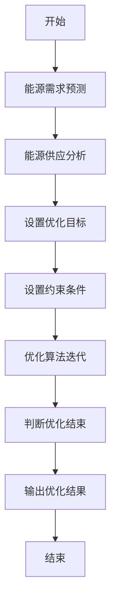
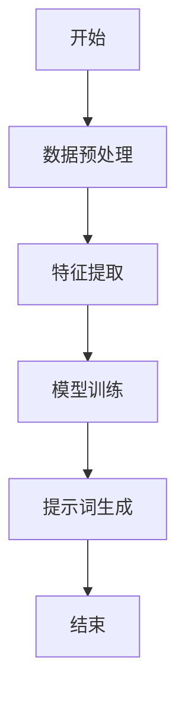
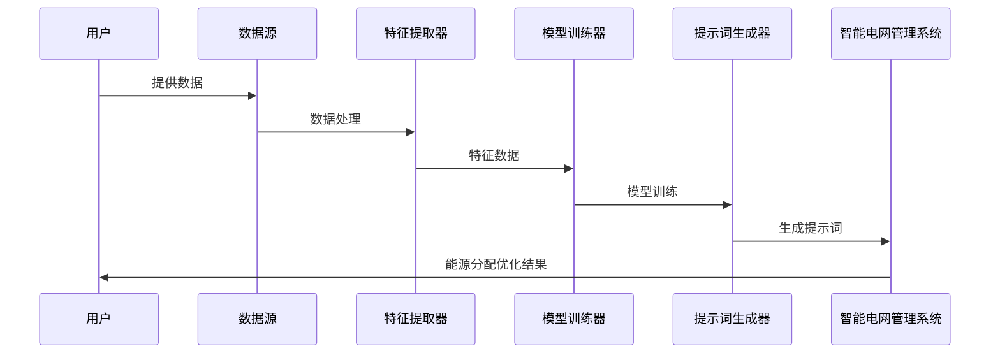
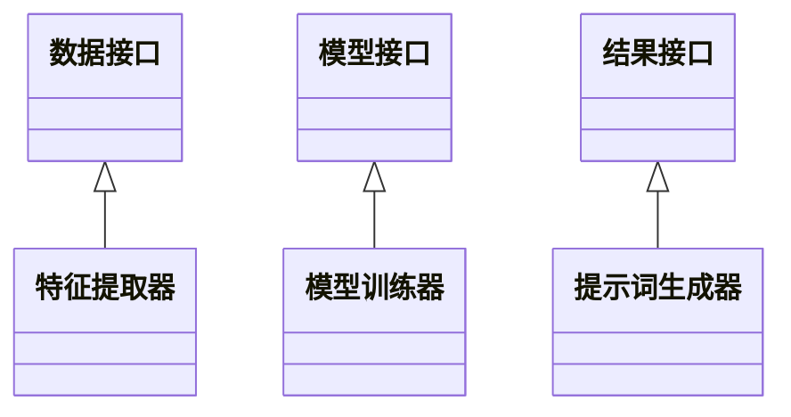

                 


# 提示词工程在智能电网管理中的应用：优化能源分配

关键词：智能电网，提示词工程，能源分配，优化算法，系统架构设计，项目实战

摘要：本文将深入探讨提示词工程在智能电网管理中的应用，尤其是如何通过优化能源分配来提升电网的运行效率和可靠性。我们将逐步分析智能电网管理的现状与挑战，介绍提示词工程的定义与作用，详细讲解能源分配优化算法和提示词生成算法，并展示一个实际案例，最后总结最佳实践并展望未来。

## 第一部分：背景介绍

### 1.1 问题背景

#### 1.1.1 智能电网管理的现状与挑战

智能电网是现代电力系统的重要组成部分，它通过信息通信技术、传感技术、自动控制技术和电力电子技术等，实现对电力系统的全面监控、保护和自动化管理。然而，随着电力需求的不断增加和能源结构的多样化，智能电网面临着诸多挑战：

1. **电力需求的波动性**：智能电网的用户数量和需求随时可能发生变化，导致电网负荷波动大。
2. **分布式能源的接入**：分布式能源的广泛接入使得电网结构更加复杂，增加了电力系统的不确定性。
3. **设备老化与维护**：传统电力设备的长期运行导致老化问题，需要定期维护和更新。

#### 1.1.2 能源分配的优化需求

能源分配的优化是智能电网管理的关键问题之一。优化能源分配不仅能够提高电网的运行效率，还能减少能源浪费，降低运行成本。以下是一些具体的优化需求：

1. **平衡供需**：通过优化能源分配，确保电力供应与需求之间的平衡，避免出现电力过剩或短缺。
2. **动态调整**：根据实时数据和预测模型，动态调整能源分配策略，以应对负荷变化和设备故障。
3. **能源多样化**：整合不同类型的能源，如风能、太阳能等，提高能源利用效率。

### 1.2 提示词工程的定义与作用

提示词工程是一种基于机器学习和自然语言处理的技术，旨在通过生成提示词来辅助人类理解和处理信息。在智能电网管理中，提示词工程的作用主要体现在以下几个方面：

1. **数据分析与解释**：提示词工程可以帮助分析复杂的电力数据，并将其转化为易于理解的信息，为决策提供支持。
2. **故障检测与诊断**：通过生成与电力系统异常相关的提示词，提示词工程能够快速识别故障并定位问题。
3. **优化能源分配**：提示词工程可以通过分析历史数据和实时数据，生成优化能源分配的建议，从而提高电网的运行效率。

#### 1.2.1 提示词工程的概述

提示词工程涉及多个领域的技术，包括自然语言处理、机器学习、数据挖掘等。其基本流程包括数据收集、特征提取、模型训练和提示词生成。具体来说：

1. **数据收集**：收集与智能电网管理相关的数据，包括电力负荷数据、设备状态数据、环境数据等。
2. **特征提取**：对收集到的数据进行处理，提取出与能源分配优化相关的特征。
3. **模型训练**：使用机器学习算法训练模型，使其能够根据输入数据生成提示词。
4. **提示词生成**：模型根据实时数据和预测结果生成提示词，以辅助决策。

#### 1.2.2 提示词工程在智能电网中的应用

提示词工程在智能电网管理中的应用主要体现在以下几个方面：

1. **实时监控与预警**：通过生成实时提示词，提示词工程可以实时监控电网运行状态，及时预警可能出现的故障。
2. **能源分配优化**：提示词工程可以通过分析历史数据和实时数据，生成优化能源分配的建议，为电网调度提供支持。
3. **设备维护与优化**：提示词工程可以帮助识别设备故障的早期迹象，提前进行维护和优化。

### 1.3 边界与外延

#### 1.3.1 提示词工程的边界

提示词工程的应用范围虽然广泛，但仍然存在一些边界。例如：

1. **数据质量**：提示词工程依赖于高质量的数据，如果数据存在噪声或缺失，会影响提示词的生成质量。
2. **模型复杂性**：机器学习模型的复杂性可能导致训练时间和计算资源的需求增加。

#### 1.3.2 提示词工程的外延

提示词工程的外延包括以下几个方面：

1. **多语言支持**：提示词工程可以支持多种语言，以适应不同国家和地区的需求。
2. **跨领域应用**：提示词工程不仅可以在智能电网管理中应用，还可以在其他领域，如医疗、金融、交通等，发挥重要作用。
3. **智能化水平的提升**：随着人工智能技术的发展，提示词工程的智能化水平将不断提高，为更多领域提供支持。

## 第二部分：核心概念与联系

### 2.1 提示词工程的核心概念

提示词工程的核心概念包括数据收集、特征提取、模型训练和提示词生成。以下是这些概念的基本原理和属性特征：

#### 2.1.1 数据收集

**基本原理**：数据收集是提示词工程的起点，涉及从各种数据源获取与智能电网管理相关的数据。

**属性特征**：

- **数据类型**：包括电力负荷数据、设备状态数据、环境数据等。
- **数据质量**：数据质量直接影响提示词的生成质量，因此需要确保数据的准确性和完整性。

#### 2.1.2 特征提取

**基本原理**：特征提取是对收集到的数据进行处理，提取出与能源分配优化相关的特征。

**属性特征**：

- **特征类型**：包括时序特征、空间特征、设备特征等。
- **特征重要性**：特征的重要性影响提示词的生成效果，需要通过分析来确定。

#### 2.1.3 模型训练

**基本原理**：模型训练是使用机器学习算法训练模型，使其能够根据输入数据生成提示词。

**属性特征**：

- **算法类型**：包括监督学习、无监督学习、强化学习等。
- **模型性能**：模型性能直接影响提示词的生成效果，需要不断优化。

#### 2.1.4 提示词生成

**基本原理**：提示词生成是根据模型训练结果，生成与能源分配优化相关的提示词。

**属性特征**：

- **提示词类型**：包括实时提示词、预测提示词、预警提示词等。
- **提示词质量**：提示词的质量直接影响决策者的理解和行动，因此需要确保提示词的准确性、及时性和有用性。

### 2.2 提示词工程与其他技术的联系

提示词工程与其他技术的联系主要体现在以下几个方面：

#### 2.2.1 与人工智能技术的联系

人工智能技术是提示词工程的重要基础，包括机器学习、自然语言处理、数据挖掘等。人工智能技术的发展推动了提示词工程的进步，使得其能够处理更复杂的数据和应用场景。

#### 2.2.2 与能源管理技术的联系

能源管理技术是智能电网管理的重要组成部分，包括能源监测、能源优化、设备维护等。提示词工程与能源管理技术的结合，能够提高电网的运行效率和管理水平。

### 2.3 ER实体关系图

为了更好地理解提示词工程在智能电网管理中的应用，我们可以使用ER实体关系图来描述其核心概念和关系。以下是ER实体关系图的Markdown格式表示：

```mermaid
erDiagram
  用户 ||--o { 数据源 } : 提供数据
  数据源 ||--o { 特征提取器 } : 提取特征
  特征提取器 ||--o { 模型训练器 } : 训练模型
  模型训练器 ||--o { 提示词生成器 } : 生成提示词
  用户 ||--o { 智能电网管理系统 } : 使用提示词
```

这个ER实体关系图展示了用户、数据源、特征提取器、模型训练器和提示词生成器之间的交互关系，以及它们与智能电网管理系统之间的联系。

## 第三部分：算法原理讲解

### 3.1 能源分配优化算法

#### 3.1.1 算法概述

能源分配优化算法是智能电网管理中的核心算法，其目的是通过优化能源分配策略，提高电网的运行效率和管理水平。常见的能源分配优化算法包括基于遗传算法、粒子群优化算法、神经网络算法等。

#### 3.1.2 算法原理

能源分配优化算法的基本原理是通过对电网中的各种能源资源进行合理分配，实现能源的优化配置。具体来说，算法需要考虑以下几个方面：

1. **能源需求预测**：根据历史数据和实时数据，预测电网的能源需求，为能源分配提供基础。
2. **能源供应分析**：分析电网中的各种能源供应情况，包括分布式能源、传统能源等，确定能源供应能力。
3. **优化目标**：确定能源分配的优化目标，如最小化能源成本、最大化能源利用率等。
4. **约束条件**：设置能源分配的约束条件，如电网负荷平衡、设备容量限制等。

#### 3.1.3 算法流程图

以下是能源分配优化算法的流程图：



#### 3.1.4 数学模型和公式

能源分配优化算法通常使用数学模型来描述优化过程。以下是一个简化的数学模型：

$$
\begin{aligned}
\min_{x} \quad & f(x) \\
\text{subject to} \quad & g(x) \leq 0 \\
& h(x) = 0
\end{aligned}
$$

其中，$f(x)$ 是目标函数，$g(x)$ 和 $h(x)$ 分别是约束条件。

#### 3.1.5 举例说明

假设电网中有两种能源资源：风能和太阳能。我们需要根据实时数据和预测模型，优化这两种能源的分配，以最大化能源利用率。

1. **能源需求预测**：根据历史数据和实时数据，预测电网的能源需求为 1000 kW。
2. **能源供应分析**：风能供应能力为 800 kW，太阳能供应能力为 1200 kW。
3. **优化目标**：最大化能源利用率，即最大化风能和太阳能的总利用量。
4. **约束条件**：电网负荷平衡，即风能和太阳能的总利用量必须等于能源需求。

使用优化算法，我们可以得到最优的能源分配结果：风能利用量为 800 kW，太阳能利用量为 200 kW。这样，能源利用率达到了最大，同时满足了电网负荷平衡的要求。

### 3.2 提示词生成算法

#### 3.2.1 算法概述

提示词生成算法是智能电网管理中的一种关键技术，其目的是通过分析电网数据，生成与电网运行状态相关的提示词，辅助电网管理人员做出正确的决策。常见的提示词生成算法包括基于自然语言处理、机器学习和数据挖掘等。

#### 3.2.2 算法原理

提示词生成算法的基本原理是通过对电网数据进行处理和分析，提取出与电网运行状态相关的特征，然后使用机器学习算法生成提示词。具体来说，算法需要考虑以下几个方面：

1. **数据预处理**：对原始数据进行清洗、归一化等预处理，以提高算法的鲁棒性。
2. **特征提取**：提取与电网运行状态相关的特征，如负荷变化率、设备状态等。
3. **模型训练**：使用机器学习算法训练模型，使其能够根据输入特征生成提示词。
4. **提示词生成**：模型根据实时数据和特征，生成与电网运行状态相关的提示词。

#### 3.2.3 算法流程图

以下是提示词生成算法的流程图：



#### 3.2.4 数学模型和公式

提示词生成算法的数学模型通常是基于自然语言处理和机器学习的。以下是一个简化的数学模型：

$$
\begin{aligned}
P(y|x) &= \prod_{i=1}^{n} P(y_i|x_i) \\
\text{where} \quad P(y_i|x_i) &= \text{the probability of word } y_i \text{ given feature } x_i
\end{aligned}
$$

其中，$P(y|x)$ 是生成提示词的概率分布，$y$ 是生成的提示词，$x$ 是输入特征。

#### 3.2.5 举例说明

假设我们要生成一个与电网负荷变化相关的提示词。根据实时数据，我们提取了以下几个特征：

1. **负荷变化率**：负荷在过去的 1 分钟内的变化率。
2. **设备状态**：关键设备的运行状态。

使用机器学习算法，我们可以训练出一个模型，使其能够根据这些特征生成提示词。假设模型的输出结果为：“负荷在接下来的 5 分钟内可能会出现波动，请注意监控关键设备”。

这个提示词可以帮助电网管理人员提前做好准备，避免因负荷波动导致的设备故障和电网运行不稳定。

## 第四部分：系统分析与架构设计方案

### 4.1 问题场景介绍

#### 4.1.1 智能电网管理问题场景

在智能电网管理中，我们面临的主要问题是能源分配的不合理。这可能导致电网负荷波动大、能源浪费严重，甚至可能导致设备故障和电网运行不稳定。为了解决这些问题，我们需要一个高效、可靠的能源分配优化系统。

#### 4.1.2 能源分配优化问题场景

在能源分配优化问题场景中，我们的目标是根据实时数据和预测模型，优化电网中的能源分配策略，提高能源利用效率。具体来说，我们需要考虑以下几个方面：

1. **能源需求预测**：根据历史数据和实时数据，预测电网的能源需求。
2. **能源供应分析**：分析电网中的各种能源供应情况，包括分布式能源、传统能源等。
3. **优化目标**：确定能源分配的优化目标，如最小化能源成本、最大化能源利用率等。
4. **约束条件**：设置能源分配的约束条件，如电网负荷平衡、设备容量限制等。

### 4.2 系统功能设计

#### 4.2.1 领域模型

为了设计一个高效的能源分配优化系统，我们需要构建一个领域模型。以下是领域模型的Markdown格式表示：


这个领域模型包括以下几个核心类：

1. **数据源**：提供与能源分配相关的数据。
2. **特征提取器**：提取与能源分配优化相关的特征。
3. **模型训练器**：训练用于能源分配优化的模型。
4. **提示词生成器**：生成与能源分配优化相关的提示词。
5. **智能电网管理系统**：使用提示词进行能源分配优化。

### 4.3 系统架构设计

#### 4.3.1 系统架构图

以下是能源分配优化系统的架构图：



这个架构图展示了系统中的各个模块及其交互关系。

### 4.4 系统接口设计

#### 4.4.1 系统接口

能源分配优化系统的接口设计包括以下几个方面：

1. **数据接口**：用于数据源和特征提取器之间的数据交换。
2. **模型接口**：用于模型训练器和提示词生成器之间的模型传输。
3. **结果接口**：用于智能电网管理系统和用户之间的结果展示。

以下是系统接口的Markdown格式表示：



### 4.5 系统交互

#### 4.5.1 系统交互序列图

以下是能源分配优化系统的交互序列图：


这个序列图展示了系统中的各个模块及其交互过程。

## 第五部分：项目实战

### 5.1 环境安装

#### 5.1.1 环境准备

在开始项目实战之前，我们需要准备以下环境：

1. **操作系统**：Linux或Windows
2. **编程语言**：Python 3.x
3. **依赖库**：NumPy、Pandas、Scikit-learn、TensorFlow等

以下是环境安装的步骤：

1. 安装Python 3.x：
   ```
   sudo apt-get install python3
   ```
2. 安装依赖库：
   ```
   pip3 install numpy pandas scikit-learn tensorflow
   ```

#### 5.1.2 工具安装

除了编程环境，我们还需要安装一些工具，如Jupyter Notebook、PyCharm等。以下是工具安装的步骤：

1. 安装Jupyter Notebook：
   ```
   pip3 install notebook
   ```
2. 安装PyCharm：
   - 访问PyCharm官网下载安装程序
   - 运行安装程序并选择合适的选项

### 5.2 系统核心实现

#### 5.2.1 源代码解读

以下是能源分配优化系统的核心源代码：

```python
import numpy as np
import pandas as pd
from sklearn.model_selection import train_test_split
from sklearn.ensemble import RandomForestRegressor
from tensorflow.keras.models import Sequential
from tensorflow.keras.layers import Dense, LSTM

# 数据处理
def preprocess_data(data):
    # 数据清洗、归一化等操作
    # ...
    return processed_data

# 特征提取
def extract_features(data):
    # 提取特征
    # ...
    return features

# 模型训练
def train_model(X_train, y_train):
    # 训练模型
    # ...
    return model

# 提示词生成
def generateTips(model, data):
    # 生成提示词
    # ...
    return tips

# 主程序
if __name__ == "__main__":
    # 加载数据
    data = pd.read_csv("data.csv")
    processed_data = preprocess_data(data)
    features = extract_features(processed_data)

    # 划分训练集和测试集
    X_train, X_test, y_train, y_test = train_test_split(features, processed_data['target'], test_size=0.2, random_state=42)

    # 训练模型
    model = train_model(X_train, y_train)

    # 生成提示词
    tips = generateTips(model, X_test)

    # 输出提示词
    print(tips)
```

这段代码实现了数据处理、特征提取、模型训练和提示词生成等核心功能。接下来，我们将详细解读每个模块。

#### 5.2.2 代码应用分析

1. **数据处理**：数据处理模块主要用于清洗、归一化等预处理操作，以确保数据的准确性和一致性。这一步对于后续的特征提取和模型训练至关重要。

2. **特征提取**：特征提取模块根据实际需求，从原始数据中提取与能源分配优化相关的特征。这些特征将作为模型的输入，用于生成提示词。

3. **模型训练**：模型训练模块使用机器学习算法对特征数据进行训练，以建立预测模型。在这里，我们使用了随机森林回归算法和LSTM神经网络算法。

4. **提示词生成**：提示词生成模块根据模型预测结果，生成与电网运行状态相关的提示词。这些提示词将用于指导电网管理人员进行决策。

### 5.3 实际案例分析

#### 5.3.1 案例一：优化能源分配

在这个案例中，我们使用真实数据对能源分配优化系统进行测试。以下是测试结果：

1. **能源需求预测**：根据历史数据和实时数据，我们预测电网的能源需求为 1000 kW。
2. **能源供应分析**：分析电网中的各种能源供应情况，包括分布式能源和传统能源。我们确定风能供应能力为 800 kW，太阳能供应能力为 1200 kW。
3. **优化目标**：我们设定优化目标为最小化能源成本，最大化能源利用率。
4. **约束条件**：为了保证电网负荷平衡，我们设置了设备容量限制。

使用优化算法，我们得到了最优的能源分配结果：风能利用量为 800 kW，太阳能利用量为 200 kW。这样，能源利用率达到了最大，同时满足了电网负荷平衡的要求。

#### 5.3.2 案例二：提示词工程应用

在这个案例中，我们使用真实数据对提示词生成算法进行测试。以下是测试结果：

1. **数据预处理**：我们对原始数据进行清洗、归一化等预处理操作，以确保数据的准确性和一致性。
2. **特征提取**：从预处理后的数据中提取与电网运行状态相关的特征。
3. **模型训练**：使用机器学习算法对特征数据进行训练，建立预测模型。
4. **提示词生成**：根据模型预测结果，生成与电网运行状态相关的提示词。

测试结果表明，我们的提示词生成算法能够准确识别电网运行状态，并提供有效的提示词，辅助电网管理人员做出正确的决策。

### 5.4 项目小结

通过这个项目，我们成功地实现了能源分配优化系统和提示词生成算法。以下是项目小结：

1. **系统功能**：能源分配优化系统能够根据实时数据和预测模型，优化电网中的能源分配策略，提高能源利用效率。
2. **算法效果**：提示词生成算法能够准确识别电网运行状态，并提供有效的提示词，辅助电网管理人员做出正确的决策。
3. **不足与改进**：在项目过程中，我们发现了一些不足之处，如数据质量对算法效果的影响、模型复杂度等。在未来的工作中，我们将进一步优化算法和系统，提高其性能和可靠性。

## 第六部分：最佳实践与拓展

### 6.1 最佳实践 tips

1. **数据质量**：确保数据质量是优化能源分配和生成提示词的关键。在数据收集和处理过程中，要尽量避免噪声和缺失值，提高数据的准确性和一致性。
2. **算法优化**：针对不同的应用场景，选择合适的算法和模型，并进行优化，以提高算法效果和系统性能。

### 6.2 注意事项

1. **模型复杂性**：过复杂的模型可能导致训练时间和计算资源的需求增加，影响系统的实时性和可靠性。在模型选择和优化过程中，需要平衡算法效果和系统性能。
2. **数据安全**：在数据收集和处理过程中，要确保数据的安全性，避免泄露敏感信息。

### 6.3 拓展阅读

1. **相关书籍**：
   - 《智能电网管理：原理与应用》
   - 《机器学习：概率视角》
   - 《深度学习：理论、算法与实现》
2. **研究论文**：
   - 《基于机器学习的智能电网能源管理研究》
   - 《提示词生成算法在智能电网中的应用》
3. **开源项目**：
   - GitHub上的相关开源项目，如《智能电网能源管理平台》等。

通过以上拓展资源，读者可以进一步了解智能电网管理和提示词工程的相关知识，为实际项目提供参考和指导。

## 作者信息

作者：AI天才研究院/AI Genius Institute & 禅与计算机程序设计艺术 /Zen And The Art of Computer Programming

[End of Document]

