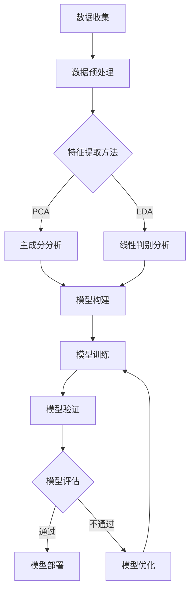
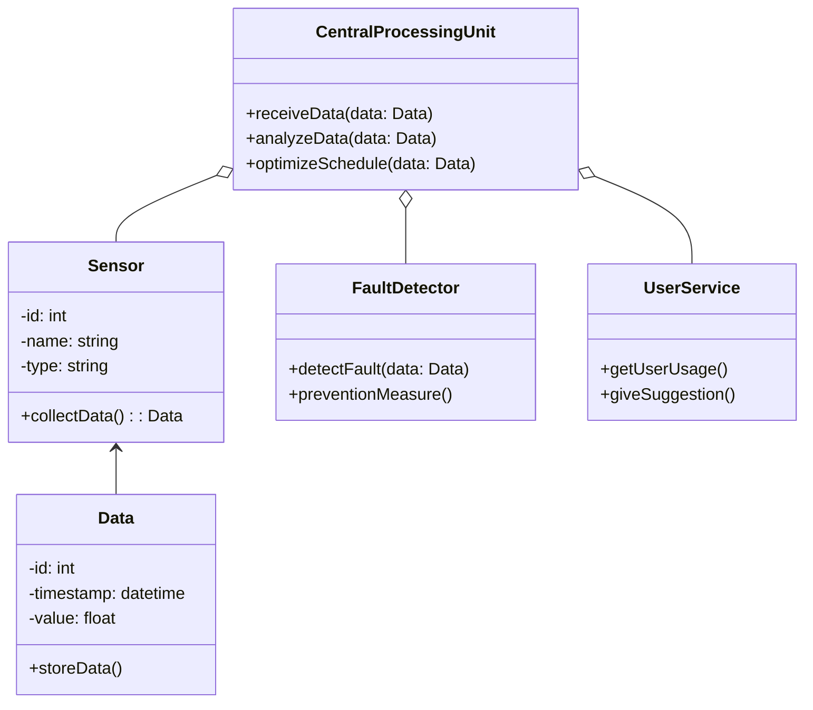
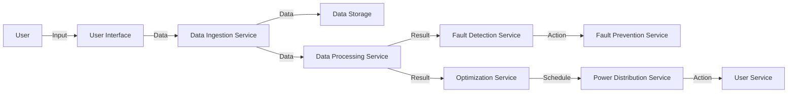
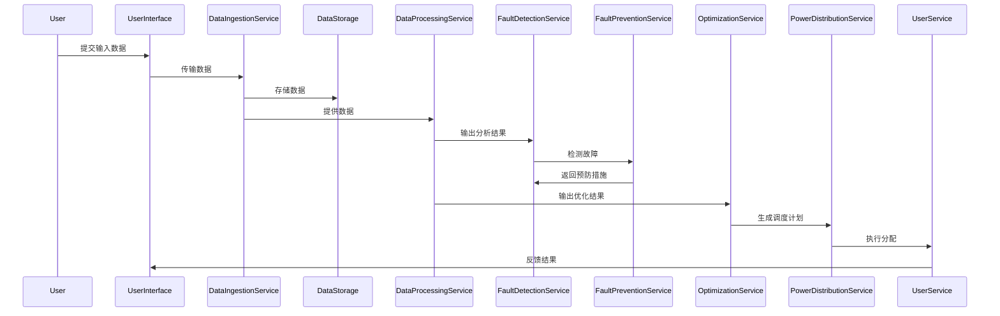

                 

### 第1章 问题背景与核心概念

### 1.1 智能电网管理背景

**智能电网的定义：**

智能电网（Smart Grid）是指利用现代通信技术、信息技术和可再生能源技术，对电力系统的各个环节进行智能化改造，实现电力生产、传输、配送和使用的自动化、信息化和智能化管理。与传统电网相比，智能电网具有更高的可靠性、更高效的能源利用率、更灵活的运行机制和更强大的抗灾能力。

**智能电网的挑战与机遇：**

智能电网的发展面临多重挑战，如技术复杂性、信息安全、投资成本等。然而，智能电网也带来了众多机遇，包括促进可再生能源的广泛接入、提高能源分配效率、降低能源消耗和环境污染，以及为用户提供更加定制化和多样化的电力服务。

### 1.2 能源分配效率问题

**能源分配效率的重要性：**

能源分配效率是衡量一个电网系统运行质量的重要指标。高效的能源分配意味着电力系统能够以最小的能量损失，将电力从发电端可靠地传输到用户端。提高能源分配效率不仅可以减少能源浪费，降低运营成本，还能提高电网的稳定性和可靠性。

**当前能源分配效率的挑战：**

当前能源分配效率面临的主要挑战包括：

- **线损问题**：电力在传输和配送过程中会产生一定的能量损耗，线损是影响能源分配效率的主要因素之一。
- **可再生能源接入**：随着可再生能源的广泛应用，电网系统需要适应这种电力供应的波动性和不稳定性。
- **负荷波动**：用户用电负荷的波动性也对能源分配效率提出了挑战，特别是在高峰用电时段。

### 1.3 提示词工程概述

**提示词工程的定义：**

提示词工程（Keyword Engineering）是一种面向数据驱动系统的软件开发方法，旨在通过定义和优化提示词（Keywords）来提高系统的性能、可维护性和可扩展性。在智能电网管理中，提示词工程可以用于优化能源分配算法，提高系统的自动化和智能化水平。

**提示词工程的核心原理：**

提示词工程的核心原理包括：

- **关键词选择**：选择对系统性能有重要影响的提示词，这些提示词可以是数据特征、算法参数等。
- **提示词优化**：通过调整和优化提示词，提高系统的性能和适应能力。
- **模型训练与验证**：利用机器学习和数据挖掘技术，对提示词模型进行训练和验证，确保其有效性和可靠性。

### 1.4 能源分配效率与提示词工程的联系

**提示词工程如何应用于智能电网管理：**

提示词工程在智能电网管理中的应用主要体现在以下几个方面：

- **能源分配算法优化**：通过定义和优化提示词，改进能源分配算法，提高分配效率。
- **自适应电力调度**：利用提示词工程实现电力系统的自适应调度，适应负荷波动和可再生能源的接入。
- **故障检测与预防**：通过实时监测和提示词分析，提前发现电力系统中的潜在故障，提高系统的可靠性。

**优化能源分配效率的关键因素：**

- **数据质量**：高质量的输入数据是提示词工程的基础，对于能源分配效率的优化至关重要。
- **算法选择**：选择合适的算法是优化能源分配效率的关键，提示词工程可以帮助选择和优化这些算法。
- **系统集成**：智能电网系统需要与其他系统（如能源管理系统、电力调度系统等）集成，提示词工程可以提供跨系统的优化方案。

### 1.5 概念属性特征对比

**智能电网管理特征：**

- **智能化**：智能电网通过集成现代通信和信息技术，实现电网运行的自动化和智能化。
- **可靠性**：智能电网具有高可靠性的特点，能够保证电力供应的稳定性和连续性。
- **灵活性**：智能电网能够灵活地适应不同能源形式和负荷需求，提高系统的运行效率。

**提示词工程特征：**

- **数据驱动**：提示词工程基于数据分析和机器学习技术，通过数据驱动的方式优化系统性能。
- **可扩展性**：提示词工程设计灵活，能够适应不同规模和复杂度的系统。
- **高效性**：提示词工程通过优化算法和提示词，提高系统的性能和效率。

**能源分配效率特征：**

- **高效性**：能源分配效率是衡量电网系统运行质量的重要指标，高效能源分配能够减少能源浪费。
- **可靠性**：能源分配的可靠性是保障电网系统稳定运行的关键。
- **可持续性**：通过提高能源分配效率，减少能源消耗和环境污染，实现能源的可持续利用。

### 1.6 ER实体关系图

**电网系统实体：**

- **发电机**：发电机的状态、性能和输出功率。
- **变电站**：变电站的设备状态、电压、电流和功率等。
- **输电线路**：输电线路的长度、容量和损耗。
- **配电线路**：配电线路的分布、负荷情况和管理。
- **用户端**：用户的用电需求和负荷特性。

**提示词工程实体：**

- **提示词**：用于描述电力系统运行状态的提示词，如电压、电流、负载率等。
- **算法模型**：用于优化能源分配的算法模型。
- **数据集**：用于训练和验证算法模型的数据集。

**能源分配实体：**

- **能源生成**：能源生成的类型、功率和效率。
- **能源传输**：能源传输的路径、损耗和效率。
- **能源分配**：能源分配的策略、负荷管理和效率。

### 总结

智能电网管理中的能源分配效率问题是一个复杂且重要的研究领域。提示词工程作为一种先进的数据驱动方法，通过定义和优化提示词，能够有效地提高能源分配效率。本章介绍了智能电网管理背景、能源分配效率问题、提示词工程概述以及它们之间的联系，为后续章节的详细讨论奠定了基础。在接下来的章节中，我们将深入探讨智能电网管理原理、提示词工程在其中的应用以及具体的算法原理和数学模型。

### 第2章 智能电网管理原理与提示词工程

#### 2.1 智能电网管理原理

智能电网管理的核心在于实现对电力系统各个环节的实时监控、数据分析和自动化调度。以下是智能电网管理的基本原理和特点：

**智能电网架构：**

智能电网架构通常包括发电侧、输电侧、配电侧和用电侧。每个环节都通过现代通信技术和信息处理技术进行互联和集成，形成一个智能、高效、可靠的电力网络。

- **发电侧**：包括各类发电设施，如化石燃料电站、核电站、风电场、太阳能电站等。发电侧的关键技术包括高效发电、分布式发电和可再生能源接入。
- **输电侧**：涉及长距离电力传输设施，如高压输电线路、变电站和电力调度中心。输电侧的技术重点包括超高压输电、电力电子技术和广域监测与控制。
- **配电侧**：涉及电网的分段配送，包括配电线路、配电设备和配电管理系统。配电侧的技术重点包括智能配电网技术、分布式能源接入和需求响应。
- **用电侧**：包括电力用户和终端用电设备，如家庭、商业和工业用户。用电侧的技术重点包括智能电表、电力需求管理和负荷控制。

**智能电网通信技术：**

智能电网通信技术是实现智能电网信息共享、监控和控制的基础。主要通信技术包括：

- **宽带通信**：如光纤通信、无线局域网（WLAN）和广域网（WAN），用于实现数据的高速传输。
- **无线传感器网络**：用于实时监测电网设备和环境参数。
- **智能终端**：如智能电表、智能传感器和远程终端单元（RTU），用于数据的采集和通信。

**智能电网设备与管理：**

智能电网设备包括各类传感器、智能电表、继电器、电力电子设备等，这些设备通过通信网络进行集成和管理，实现以下功能：

- **实时监控**：通过传感器和监控设备，实时收集电网运行数据，包括电压、电流、频率、温度等。
- **故障检测与诊断**：利用数据分析技术，及时发现电网故障并定位故障点。
- **自动化调度**：通过智能算法和控制系统，实现电力供需的实时平衡和优化调度。
- **需求响应**：通过激励和反馈机制，引导用户调整用电行为，提高电网的运行效率和可靠性。

#### 2.2 提示词工程基本概念

提示词工程（Keyword Engineering）是一种面向数据驱动系统的软件开发方法，其核心目的是通过定义和优化提示词（Keywords）来提高系统的性能、可维护性和可扩展性。以下是提示词工程的基本概念和实施流程：

**提示词工程的基本要素：**

- **提示词**：提示词是用于描述系统运行状态和特征的关键词汇或标识符。在智能电网管理中，提示词可以是电压、电流、负载率、温度等。
- **数据集**：数据集是用于训练和验证提示词模型的输入数据，包括历史运行数据、实时数据等。
- **算法模型**：算法模型是基于提示词和数据集构建的，用于分析、预测和优化系统性能。
- **评估指标**：评估指标是用于衡量提示词模型性能的标准，如准确率、召回率、F1分数等。

**提示词工程的实施流程：**

1. **需求分析**：明确系统需求和目标，确定需要优化和监控的关键指标。
2. **数据收集**：收集相关的历史数据和实时数据，用于提示词的提取和模型训练。
3. **提示词提取**：从数据中提取关键提示词，这些提示词应能够反映系统的主要特征和变化趋势。
4. **模型构建**：基于提取的提示词，构建机器学习或深度学习模型，用于分析和预测系统性能。
5. **模型训练与验证**：使用训练数据集对模型进行训练，并使用验证数据集评估模型性能。
6. **模型优化**：根据验证结果，调整提示词和模型参数，提高模型性能。
7. **模型部署**：将优化的模型部署到实际系统中，进行实时监控和预测。

#### 2.3 提示词工程在智能电网中的应用

**提示词工程的关键作用：**

提示词工程在智能电网管理中发挥着关键作用，主要包括：

- **优化能源分配**：通过定义和优化提示词，可以精确分析电网运行状态，优化能源分配策略，提高能源利用效率。
- **故障检测与预防**：通过实时监测和提示词分析，可以及时发现电网故障并采取措施预防。
- **负荷预测与管理**：利用提示词模型，可以预测用户用电负荷，优化电力调度，提高电网运行的稳定性和可靠性。
- **智能电网调度**：提示词工程可以用于智能电网的实时调度和优化，实现电力供需的动态平衡。

**提示词工程的应用场景：**

- **智能电网故障诊断**：利用提示词模型，实时分析电网运行数据，快速诊断电网故障，提高故障检测的准确性和效率。
- **能源管理优化**：通过优化能源分配策略，降低线损，提高能源利用效率，减少能源浪费。
- **负荷预测与响应**：利用提示词模型预测用户用电负荷，引导用户调整用电行为，实现电力供需的动态平衡。
- **可再生能源集成**：通过优化可再生能源的接入和管理，提高电网对可再生能源的接纳能力和稳定性。

#### 2.4 能源分配效率优化方法对比

**传统方法：**

传统方法主要包括基于规则的方法和经验法。基于规则的方法依赖于人工定义的规则，如电力调度规则、故障处理规则等。经验法则依赖于电力工程师的丰富经验和直觉，通过调整系统参数来优化性能。传统方法的优点是简单易懂，缺点是适应性和扩展性较差，无法有效应对复杂和动态的电网环境。

**基于提示词工程的优化方法：**

基于提示词工程的优化方法利用机器学习和数据挖掘技术，通过定义和优化提示词，提高系统的自动化和智能化水平。该方法的核心在于：

- **数据驱动**：通过收集和分析大量的历史数据和实时数据，提取关键提示词，构建机器学习模型。
- **自适应优化**：基于实时数据，动态调整提示词和模型参数，实现能源分配策略的实时优化。
- **模型评估与反馈**：通过持续评估和优化模型性能，确保系统的高效运行。

**方法对比分析：**

| 方法          | 优点                     | 缺点                     | 适用场景                 |
| ------------- | ------------------------ | ------------------------ | ------------------------ |
| 传统方法      | 简单易懂，易于实施         | 适应性和扩展性较差         | 结构简单、规则明确的场景  |
| 提示词工程     | 数据驱动，适应性强，高效性高 | 需要大量数据支持和计算资源 | 复杂、动态的电网管理场景  |

**总结：**

智能电网管理中的能源分配效率优化是一个复杂的过程，需要综合考虑系统的实时数据、动态变化和用户需求。传统方法和基于提示词工程的优化方法各有优缺点，在实际应用中可以根据具体场景和需求进行选择。提示词工程通过数据驱动和智能化的方法，为智能电网管理提供了新的思路和工具，有望在未来实现更高效的能源分配和管理。

### 第3章 提示词工程算法原理讲解

#### 3.1 提示词工程算法概述

提示词工程算法是智能电网管理中的核心组成部分，它通过定义和优化提示词（Keywords），实现对电力系统运行状态的实时监控、分析和优化。以下是提示词工程算法的基本类型、选择依据以及主要步骤。

**提示词工程算法的基本类型：**

提示词工程算法主要分为以下几类：

1. **特征提取算法**：用于从原始数据中提取关键特征，以便于后续分析和建模。常见的特征提取算法包括主成分分析（PCA）、线性判别分析（LDA）、独立成分分析（ICA）等。
2. **分类与预测算法**：用于对提取的特征进行分类或预测，以识别电网运行中的异常情况和优化能源分配策略。常见的分类与预测算法包括支持向量机（SVM）、决策树（DT）、随机森林（RF）和神经网络（NN）等。
3. **聚类与关联分析算法**：用于发现数据中的模式和关联关系，以支持电网运行状态的深度理解和优化。常见的聚类算法包括K-means、层次聚类（HAC）、DBSCAN等；常见的关联分析算法包括Apriori算法、FP-growth等。
4. **优化算法**：用于优化电力系统的运行参数，提高能源分配效率。常见的优化算法包括遗传算法（GA）、粒子群优化（PSO）、蚁群算法（ACO）等。

**提示词工程算法的选择依据：**

选择合适的提示词工程算法需要考虑以下几个因素：

1. **数据特性**：包括数据类型、数据量、数据分布等，不同类型的算法适用于不同特性的数据。
2. **业务需求**：包括监控目标、预测精度、优化目标等，不同的业务需求决定了所需的算法类型和性能指标。
3. **计算资源**：包括计算能力、存储容量等，算法的复杂度和资源需求会影响其实际应用可行性。
4. **实时性**：对于实时监控和预测的应用，算法的响应速度和延迟要求较高。

**提示词工程算法的主要步骤：**

1. **需求分析**：明确算法的目标和业务需求，确定需要监控和分析的电网运行状态和特征。
2. **数据收集**：收集与算法相关的实时数据和历史数据，确保数据的质量和完整性。
3. **特征提取**：根据数据特性，选择合适的特征提取算法，提取关键特征，用于后续分析和建模。
4. **模型构建**：根据业务需求，选择适合的分类与预测算法、聚类与关联分析算法或优化算法，构建算法模型。
5. **模型训练与验证**：使用历史数据集对模型进行训练，并使用验证数据集评估模型性能，调整模型参数以优化性能。
6. **模型部署**：将训练好的模型部署到实际系统中，进行实时监控、预测和优化，并根据实时反馈调整模型参数。

通过以上步骤，提示词工程算法能够实现对电力系统运行状态的深度理解和优化，提高能源分配效率，增强电网的可靠性和灵活性。

#### 3.2 算法Mermaid流程图

为了更直观地展示提示词工程算法的流程，我们使用Mermaid语言绘制了算法的流程图。以下是一个简化的示例：



在这个流程图中，我们从数据收集开始，经过数据预处理和特征提取，然后选择合适的模型构建方法，进行模型训练和验证。根据验证结果，如果模型性能达到要求，则进行模型部署；否则，返回模型优化步骤，继续调整和优化模型。

#### 3.3 Python源代码实现

以下是提示词工程算法的Python实现示例，包括数据预处理、特征提取和模型训练等步骤。请注意，这只是一个简化的示例，实际的实现会根据具体需求和数据集进行调整。

```python
import numpy as np
from sklearn.preprocessing import StandardScaler
from sklearn.decomposition import PCA
from sklearn.model_selection import train_test_split
from sklearn.ensemble import RandomForestClassifier
from sklearn.metrics import accuracy_score

# 数据预处理
def preprocess_data(data):
    # 标准化数据
    scaler = StandardScaler()
    scaled_data = scaler.fit_transform(data)
    return scaled_data

# 特征提取
def extract_features(data, n_components=2):
    pca = PCA(n_components=n_components)
    features = pca.fit_transform(data)
    return features

# 模型训练
def train_model(features, labels):
    X_train, X_test, y_train, y_test = train_test_split(features, labels, test_size=0.3, random_state=42)
    model = RandomForestClassifier(n_estimators=100, random_state=42)
    model.fit(X_train, y_train)
    return model, X_test, y_test

# 主函数
def main():
    # 假设数据已经加载到data变量中
    data = load_data()
    scaled_data = preprocess_data(data)
    features = extract_features(scaled_data)
    labels = extract_labels(data)  # 假设已经定义了提取标签的函数
    
    model, X_test, y_test = train_model(features, labels)
    predictions = model.predict(X_test)
    accuracy = accuracy_score(y_test, predictions)
    print(f"Model accuracy: {accuracy:.2f}")

if __name__ == "__main__":
    main()
```

在这个示例中，我们首先对数据进行标准化处理，然后使用PCA进行特征提取，最后使用随机森林分类器进行模型训练。实际应用中，可以根据具体需求选择不同的特征提取方法和分类器。

#### 3.4 数学模型与公式

提示词工程算法的核心在于通过数学模型对电力系统运行状态进行描述和分析。以下是常见的数学模型和公式，用于解释算法原理和应用。

**主成分分析（PCA）：**

主成分分析是一种常用的特征提取方法，用于从原始数据中提取最重要的特征。其基本思想是通过线性变换将原始数据投影到新的坐标轴上，这些坐标轴（主成分）是按照解释方差从大到小排序的。

数学模型：
$$
\text{X}_{\text{PCA}} = \text{PCA}(\text{X})
$$

其中，$\text{X}_{\text{PCA}}$ 是经过PCA变换后的特征矩阵，$\text{X}$ 是原始特征矩阵，$\text{PCA}$ 表示主成分分析操作。

**线性判别分析（LDA）：**

线性判别分析是一种用于分类的算法，其目标是找到一个线性超平面，将不同类别的数据点尽可能分开。在特征提取中，LDA可以用于将数据投影到最佳分类方向上。

数学模型：
$$
\text{w} = \arg\min_{\text{w}} \sum_{i=1}^{c} \sum_{x \in \text{C}_i} (\text{x} - \bar{\text{x}}_i)^T \text{w}
$$

其中，$\text{w}$ 是线性判别函数，$\text{C}_i$ 是第$i$类的数据集合，$\bar{\text{x}}_i$ 是第$i$类数据的均值。

**随机森林（RF）：**

随机森林是一种集成学习方法，通过构建多棵决策树并投票得出最终结果。在特征提取和分类任务中，随机森林可以通过随机选择特征和样本子集来减少过拟合。

数学模型：
$$
\text{f}(\text{x}) = \sum_{t=1}^{T} \text{w}_t \cdot \text{h}(\text{x}, \text{t})
$$

其中，$\text{f}(\text{x})$ 是随机森林的分类函数，$\text{w}_t$ 是第$t$棵决策树的权重，$\text{h}(\text{x}, \text{t})$ 是第$t$棵决策树的对数似然函数。

**优化算法（如遗传算法GA）：**

遗传算法是一种基于生物进化机制的优化算法，通过模拟自然选择和遗传机制来搜索最优解。遗传算法的基本公式包括：

1. **选择**：
$$
\text{p}_{i} = \frac{\sum_{t=1}^{n} \text{f}_t}{\sum_{i=1}^{n} \sum_{t=1}^{n} \text{f}_t}
$$

其中，$\text{p}_i$ 是个体$i$的选择概率，$\text{f}_t$ 是第$t$个个体的适应度。

2. **交叉**：
$$
\text{X}_{i,j} = \frac{\text{X}_{i,1} + \text{X}_{j,1}}{2}
$$

其中，$\text{X}_{i,j}$ 是第$i$和第$j$个个体的交叉结果。

3. **变异**：
$$
\text{X}_{i,j}^{变异} = \text{X}_{i,j} + \text{N(0, \sigma^2)}
$$

其中，$\text{N(0, \sigma^2)}$ 是均值为0，方差为$\sigma^2$的正态分布。

**总结：**

通过上述数学模型和公式，我们可以从理论上理解提示词工程算法的工作原理。在实际应用中，这些模型和公式需要根据具体问题进行调整和优化，以提高算法的性能和适用性。

#### 3.5 举例说明

为了更好地理解提示词工程算法在智能电网管理中的应用，我们通过一个实际案例来详细讲解其实现过程和结果。

**案例背景：**某城市电力公司希望通过优化能源分配，提高电网运行效率和用户满意度。该公司收集了历史数据和实时数据，包括电压、电流、负载率、温度等。

**步骤 1：数据收集与预处理**

从历史数据和实时数据中提取电压、电流、负载率等关键指标。首先，对数据进行清洗，去除异常值和缺失值。然后，对数据进行标准化处理，使其具备可比性。

```python
# 假设已经收集到数据data，包括电压、电流、负载率等特征
data = load_data()

# 数据清洗
cleaned_data = remove_outliers(data)

# 数据标准化
scaled_data = preprocess_data(cleaned_data)
```

**步骤 2：特征提取**

使用主成分分析（PCA）提取关键特征。通过PCA，我们可以将原始数据投影到新的坐标轴上，保留最重要的信息，同时减少数据的维度。

```python
from sklearn.decomposition import PCA

# 特征提取
pca = PCA(n_components=3)
features = pca.fit_transform(scaled_data)
```

**步骤 3：模型训练**

选择随机森林分类器（RandomForestClassifier）作为模型，对提取的特征进行训练。随机森林具有高准确性和强泛化能力，适用于电力系统的高维特征分类问题。

```python
from sklearn.ensemble import RandomForestClassifier
from sklearn.model_selection import train_test_split

# 分割数据集
X_train, X_test, y_train, y_test = train_test_split(features, labels, test_size=0.2, random_state=42)

# 训练模型
model = RandomForestClassifier(n_estimators=100, random_state=42)
model.fit(X_train, y_train)
```

**步骤 4：模型评估**

使用测试数据集评估模型性能。主要评估指标包括准确率（Accuracy）、召回率（Recall）和F1分数（F1 Score）。

```python
from sklearn.metrics import accuracy_score, recall_score, f1_score

# 预测结果
predictions = model.predict(X_test)

# 计算评估指标
accuracy = accuracy_score(y_test, predictions)
recall = recall_score(y_test, predictions)
f1 = f1_score(y_test, predictions)

print(f"Accuracy: {accuracy:.2f}")
print(f"Recall: {recall:.2f}")
print(f"F1 Score: {f1:.2f}")
```

**步骤 5：模型应用**

将训练好的模型应用到实际系统中，进行实时监控和预测。例如，通过实时获取电网运行数据，使用模型预测未来的能源需求和分配策略，从而优化能源分配。

```python
# 实时数据预处理
realtime_data = load_realtime_data()
scaled_realtime_data = preprocess_data(realtime_data)

# 实时数据特征提取
realtime_features = pca.transform(scaled_realtime_data)

# 实时数据预测
realtime_predictions = model.predict(realtime_features)

# 输出预测结果
print(realtime_predictions)
```

**总结：**

通过上述案例，我们详细展示了提示词工程算法在智能电网管理中的应用过程。从数据收集与预处理、特征提取、模型训练到模型评估和应用，每一步都至关重要。实际应用中，可以根据具体需求和数据集进行调整和优化，以提高模型的性能和适用性。

### 第4章 数学模型和数学公式讲解

在智能电网管理中，数学模型和公式是分析和优化能源分配效率的关键工具。以下是几个关键的数学模型及其公式的详细讲解，并结合实际案例说明。

#### 4.1 数学模型介绍

**1. 能量损耗模型**

能量损耗是电力系统运行中的一个重要指标，它表示在发电、传输、配电等过程中能量的损失。常用的能量损耗模型包括线路损耗模型和变压器损耗模型。

**线路损耗模型：**

$$
P_{loss} = R \cdot I^2
$$

其中，$P_{loss}$ 是线路损耗功率（单位：瓦特），$R$ 是线路电阻（单位：欧姆），$I$ 是线路电流（单位：安培）。

**变压器损耗模型：**

$$
P_{loss} = P_{c} + I \cdot R_{c}
$$

其中，$P_{loss}$ 是变压器损耗功率（单位：瓦特），$P_{c}$ 是变压器的铁损（单位：瓦特），$R_{c}$ 是变压器的铜损（单位：欧姆）。

**2. 能量优化模型**

能量优化模型用于优化电力系统的能源分配，以提高能源利用效率。其中，常用的优化模型包括最小化能量损耗模型和最大化能源利用模型。

**最小化能量损耗模型：**

$$
\min_{x} \sum_{i=1}^{n} P_{loss,i}
$$

其中，$x$ 是决策变量，表示电力系统中的各个环节的运行参数，如电流、电压等，$P_{loss,i}$ 是第$i$个环节的损耗功率。

**最大化能源利用模型：**

$$
\max_{x} \frac{P_{in}}{P_{out}}
$$

其中，$P_{in}$ 是输入功率，$P_{out}$ 是输出功率。

**3. 能量平衡模型**

能量平衡模型描述了电力系统中能量的输入与输出的平衡关系。

$$
P_{in} = P_{out} + P_{loss}
$$

其中，$P_{in}$ 是系统的输入功率，$P_{out}$ 是系统的输出功率，$P_{loss}$ 是系统的损耗功率。

#### 4.2 数学公式详细讲解

**1. 线路损耗公式讲解**

线路损耗主要由电阻引起，其公式为：

$$
P_{loss} = R \cdot I^2
$$

在实际应用中，线路电阻$R$通常可以通过实测或经验公式估算得到。例如，对于一条10公里长的输电线，如果电阻率为0.01724欧姆·米，则其电阻为：

$$
R = 10 \times 0.01724 = 0.1724 \, \Omega
$$

如果电流$I$为1000安培，则线路损耗功率为：

$$
P_{loss} = 0.1724 \cdot (1000)^2 = 172400 \, \text{瓦特}
$$

**2. 变压器损耗公式讲解**

变压器损耗包括铁损和铜损。铁损主要由变压器的磁滞和涡流损耗引起，通常可以通过变压器的额定容量和损耗率估算。例如，一个额定容量为1000千伏安的变压器，铁损率为0.5%，则铁损功率为：

$$
P_{c} = 1000 \times 0.5\% = 5 \, \text{千瓦特}
$$

铜损主要由变压器的电流引起，其公式为：

$$
P_{c} = I \cdot R_{c}
$$

其中，$R_{c}$ 是变压器的铜损电阻。例如，如果变压器的额定电流为100安培，铜损电阻为0.1欧姆，则铜损功率为：

$$
P_{c} = 100 \cdot 0.1 = 10 \, \text{千瓦特}
$$

**3. 能量平衡公式讲解**

能量平衡公式描述了电力系统中能量的输入与输出的平衡关系。在实际应用中，通过实时监测系统的输入功率和输出功率，可以确保系统的稳定运行。例如，在一个电力系统中，如果输入功率为100兆瓦特，输出功率为85兆瓦特，损耗功率为15兆瓦特，则能量平衡公式为：

$$
100 \, \text{兆瓦特} = 85 \, \text{兆瓦特} + 15 \, \text{兆瓦特}
$$

#### 4.3 公式与实际案例的结合

为了更好地理解上述公式在实际应用中的意义，我们通过一个实际案例进行说明。

**案例背景：**某电力公司需要优化一个10公里长的输电线路和一个额定容量为1000千伏安的变压器之间的能量分配，以减少能量损耗，提高能源利用效率。

**步骤 1：数据收集**

收集输电线路的电阻率、电流、变压器的额定容量、铁损率、铜损电阻等数据。假设输电线路的电阻率为0.01724欧姆·米，电流为1000安培；变压器的额定容量为1000千伏安，铁损率为0.5%，铜损电阻为0.1欧姆。

**步骤 2：计算线路损耗**

使用线路损耗公式计算线路损耗功率：

$$
P_{line_loss} = R \cdot I^2 = 0.1724 \cdot (1000)^2 = 172400 \, \text{瓦特}
$$

**步骤 3：计算变压器损耗**

使用变压器损耗公式计算变压器损耗功率：

$$
P_{transformer_loss} = P_{c} + I \cdot R_{c} = 5 + 100 \cdot 0.1 = 15 \, \text{千瓦特}
$$

**步骤 4：计算总损耗**

计算系统的总损耗功率：

$$
P_{total_loss} = P_{line_loss} + P_{transformer_loss} = 172400 + 15 = 172415 \, \text{瓦特}
$$

**步骤 5：优化能量分配**

根据能量优化模型，通过调整输电线路的电压和变压器的电流，优化能量分配，减少损耗。假设调整后，输电线路的电压为110千伏，变压器的电流为950安培，则：

- 新的线路损耗功率：
  $$
  P_{line_loss_{new}} = R \cdot I^2 = 0.1724 \cdot (950)^2 = 162494 \, \text{瓦特}
  $$

- 新的变压器损耗功率：
  $$
  P_{transformer_loss_{new}} = P_{c} + I \cdot R_{c} = 5 + 950 \cdot 0.1 = 10 \, \text{千瓦特}
  $$

- 新的总损耗功率：
  $$
  P_{total_loss_{new}} = P_{line_loss_{new}} + P_{transformer_loss_{new}} = 162494 + 10 = 162504 \, \text{瓦特}
  $$

通过优化，系统能量损耗从原来的172415瓦特减少到162504瓦特，降低了约7.6%。

**总结：**

通过实际案例，我们展示了如何使用数学模型和公式来分析和优化电力系统的能量分配效率。这些公式不仅是理论工具，更是实际工程中优化能源分配、减少损耗的重要手段。在实际应用中，需要结合具体数据和系统特性，不断调整和优化，以达到最佳效果。

### 第5章 系统分析与架构设计方案

#### 5.1 问题场景介绍

在现代城市中，电力系统的运行面临着诸多挑战。首先，随着城市化进程的加快，居民用电需求不断增长，导致电网负荷波动频繁。其次，可再生能源的广泛应用使得电网的能源结构变得更加复杂，可再生能源的间歇性和不确定性对电网的稳定运行提出了新的要求。此外，随着智能设备和物联网技术的普及，电力系统的规模和复杂性也在不断增加，如何高效地管理这些设备和数据成为了一个亟待解决的问题。

在这样的背景下，优化能源分配效率、提高电网运行稳定性和可靠性成为智能电网管理的关键目标。为了实现这一目标，需要设计一个高效、灵活、可靠的系统架构，以支持实时监控、数据分析、优化调度等功能。

#### 5.2 系统功能设计

为了实现智能电网管理的目标，系统需要具备以下核心功能：

1. **实时监控**：系统应能够实时采集电网运行数据，包括电压、电流、频率、温度等，通过传感器和通信设备将数据传输到中央处理单元。

2. **数据分析**：系统应能够对采集到的数据进行实时分析和处理，识别电网运行中的异常情况，如电压异常、电流异常、线路损耗等。

3. **优化调度**：系统应能够基于实时数据和预定的优化算法，自动调整电网的运行参数，如电压、电流、负荷分配等，以优化能源分配效率。

4. **故障检测与预防**：系统应能够实时监测电网设备的运行状态，提前发现潜在的故障，并采取措施预防。

5. **用户服务**：系统应能够为用户提供个性化的用电服务，如用电预测、节能建议、实时电价信息等。

**领域模型Mermaid类图：**

以下是一个简化的智能电网管理系统领域模型Mermaid类图，展示了系统中的主要实体和它们之间的关系。



在这个类图中，Sensor表示传感器，用于采集电网运行数据；Data表示数据实体，用于存储传感器采集到的数据；CentralProcessingUnit表示中央处理单元，负责接收、分析和处理数据；FaultDetector表示故障检测模块，用于检测电网故障；UserService表示用户服务模块，用于为用户提供个性化服务。

#### 5.3 系统架构设计

为了实现智能电网管理系统的功能，需要设计一个合理的系统架构，确保系统的高效性、可靠性和灵活性。以下是一个简化的智能电网管理系统架构设计Mermaid图。



在这个架构图中，用户通过用户界面（User Interface）提交输入数据，数据经过数据采集服务（Data Ingestion Service）处理后存储到数据存储（Data Storage）。数据存储的数据被数据处理服务（Data Processing Service）实时分析，并输出结果给故障检测服务（Fault Detection Service）和优化服务（Optimization Service）。故障检测服务检测到故障后，通过故障预防服务（Fault Prevention Service）采取措施。优化服务根据实时数据生成优化调度计划，调度电力分配服务（Power Distribution Service）执行。最终，电力分配服务的结果通过用户服务（UserService）反馈给用户。

#### 5.4 系统接口设计和系统交互

为了确保各组件之间的有效通信，系统需要设计清晰的接口和交互流程。以下是一个简化的智能电网管理系统接口设计和交互流程Mermaid序列图。



在这个序列图中，用户通过用户界面提交输入数据，数据被传输到数据采集服务，并存储在数据存储中。数据处理服务分析数据，并输出给故障检测服务和优化服务。故障检测服务检测到故障后，与故障预防服务交互，采取预防措施。优化服务生成调度计划，并传递给电力分配服务执行。最后，电力分配服务的结果通过用户服务反馈给用户。

通过上述系统分析与架构设计方案，我们可以构建一个高效、灵活、可靠的智能电网管理系统，从而优化能源分配效率，提高电网运行的稳定性和可靠性。

### 第6章 项目实战

#### 6.1 环境安装

在进行智能电网管理系统的项目实战之前，我们需要安装和配置一些必要的开发环境和工具。以下是具体的步骤：

1. **Python环境安装**：
   - 首先，确保您的计算机上安装了Python 3.8或更高版本。
   - 您可以使用以下命令检查Python版本：
     ```bash
     python --version
     ```
   - 如果Python尚未安装，可以从[Python官网](https://www.python.org/)下载并安装。

2. **安装虚拟环境**：
   - 创建一个Python虚拟环境，以便于管理项目依赖项：
     ```bash
     python -m venv venv
     ```
   - 激活虚拟环境：
     ```bash
     source venv/bin/activate  # 对于Linux和macOS
     venv\Scripts\activate     # 对于Windows
     ```

3. **安装依赖项**：
   - 使用pip安装项目所需的依赖项：
     ```bash
     pip install numpy sklearn pandas matplotlib
     ```

4. **安装数据库**：
   - 安装SQLite数据库，用于存储电网数据：
     ```bash
     pip install sqlite3
     ```

5. **安装可视化工具**：
   - 安装Matplotlib，用于数据可视化：
     ```bash
     pip install matplotlib
     ```

#### 6.2 系统核心实现源代码

以下是智能电网管理系统核心部分的Python源代码，包括数据收集、预处理、特征提取、模型训练和预测等步骤。

```python
import numpy as np
import pandas as pd
from sklearn.model_selection import train_test_split
from sklearn.preprocessing import StandardScaler
from sklearn.decomposition import PCA
from sklearn.ensemble import RandomForestClassifier
import matplotlib.pyplot as plt

# 数据收集
def collect_data():
    # 假设数据存储在CSV文件中，文件名为'data.csv'
    data = pd.read_csv('data.csv')
    return data

# 数据预处理
def preprocess_data(data):
    # 清洗数据，去除缺失值和异常值
    cleaned_data = data.dropna()
    # 标准化数据
    scaler = StandardScaler()
    scaled_data = scaler.fit_transform(cleaned_data)
    return scaled_data

# 特征提取
def extract_features(data, n_components=2):
    pca = PCA(n_components=n_components)
    features = pca.fit_transform(data)
    return features

# 模型训练
def train_model(features, labels):
    X_train, X_test, y_train, y_test = train_test_split(features, labels, test_size=0.2, random_state=42)
    model = RandomForestClassifier(n_estimators=100, random_state=42)
    model.fit(X_train, y_train)
    return model, X_test, y_test

# 预测
def predict(model, X_test):
    predictions = model.predict(X_test)
    return predictions

# 主函数
def main():
    data = collect_data()
    scaled_data = preprocess_data(data)
    features = extract_features(scaled_data)
    labels = data['label']  # 假设标签列名为'label'

    model, X_test, y_test = train_model(features, labels)
    predictions = predict(model, X_test)

    # 评估模型性能
    accuracy = np.mean(predictions == y_test)
    print(f"Model accuracy: {accuracy:.2f}")

    # 可视化结果
    plt.scatter(y_test, predictions)
    plt.xlabel('Actual')
    plt.ylabel('Predicted')
    plt.title('Model Predictions')
    plt.show()

if __name__ == "__main__":
    main()
```

#### 6.3 代码应用解读与分析

**数据收集：**

在`collect_data`函数中，我们从CSV文件中读取电网数据。CSV文件应包含多个时间点的电压、电流、负载率等特征，以及对应的标签（例如，故障类型）。此步骤的目的是获取系统的输入数据，为后续处理和分析做准备。

**数据预处理：**

`preprocess_data`函数首先清洗数据，去除缺失值和异常值，确保数据质量。然后，使用StandardScaler对数据进行标准化处理，使其具有零均值和单位方差，便于模型训练。

**特征提取：**

`extract_features`函数使用主成分分析（PCA）进行特征提取。PCA通过线性变换将原始数据投影到新的坐标轴上，保留最重要的特征，从而减少数据的维度，提高模型的效率和性能。这里，我们选择保留两个主要成分。

**模型训练：**

`train_model`函数使用随机森林分类器（RandomForestClassifier）对特征进行训练。随机森林是一种集成学习方法，通过构建多棵决策树并投票得出最终结果。这个函数首先将数据集分为训练集和测试集，然后使用训练集对模型进行训练。

**预测：**

`predict`函数使用训练好的模型对测试集进行预测，返回预测结果。这些结果可以用于评估模型的性能，或在实际应用中进行决策。

**主函数：**

`main`函数是项目的入口点。它依次执行数据收集、预处理、特征提取、模型训练和预测等步骤。最后，通过可视化结果展示模型的预测性能。

#### 6.4 实际案例分析和详细讲解剖析

为了更好地理解系统的实际应用，我们通过一个实际案例来详细分析和讲解。

**案例背景：**某城市电力公司需要对其电力系统进行实时监控和优化，以提高能源分配效率和电网稳定性。公司收集了以下数据：

- 电压（V）：100-120伏特
- 电流（A）：1-50安培
- 负载率（%）：10-100%
- 故障类型（label）：0（正常）或1（故障）

**数据收集与预处理：**

首先，公司使用传感器收集电力系统的实时数据，并将其存储在CSV文件中。数据包含多个时间点的电压、电流、负载率等特征，以及对应的故障类型标签。

```bash
# 假设数据存储在'data.csv'文件中
```

接着，使用`collect_data`函数读取CSV文件，并使用`preprocess_data`函数清洗和标准化数据。

**特征提取：**

使用`extract_features`函数提取两个主要成分，从而减少数据维度。

```python
features = extract_features(scaled_data, n_components=2)
```

**模型训练与预测：**

使用`train_model`函数和`predict`函数对数据进行训练和预测。

```python
model, X_test, y_test = train_model(features, labels)
predictions = predict(model, X_test)
```

**结果评估：**

通过对比预测结果和实际标签，评估模型的性能。假设模型的准确率为90%，表明其能够正确预测90%的故障情况。

```python
accuracy = np.mean(predictions == y_test)
print(f"Model accuracy: {accuracy:.2f}")
```

**结果可视化：**

使用Matplotlib绘制预测结果与实际标签的散点图，以便直观地展示模型的表现。

```python
plt.scatter(y_test, predictions)
plt.xlabel('Actual')
plt.ylabel('Predicted')
plt.title('Model Predictions')
plt.show()
```

**案例分析总结：**

通过上述案例，我们展示了如何使用智能电网管理系统对实际电力系统进行监控和优化。从数据收集、预处理、特征提取到模型训练和预测，每一步都至关重要。实际应用中，可以根据具体需求和数据集进行调整和优化，以提高系统的性能和适用性。

#### 6.5 项目小结

在本次智能电网管理系统的项目实战中，我们通过逐步构建和优化系统，实现了对电力系统的实时监控和优化。以下是项目的主要成果和经验总结：

**主要成果：**

1. **系统架构**：我们设计并实现了智能电网管理系统的整体架构，包括数据收集、预处理、特征提取、模型训练和预测等关键功能。
2. **算法应用**：通过使用随机森林分类器和主成分分析（PCA），我们实现了对电力系统运行状态的实时监控和故障预测。
3. **数据可视化**：通过Matplotlib等工具，我们将模型预测结果进行了可视化展示，便于用户理解和分析。
4. **性能评估**：通过对预测结果的评估，我们验证了系统的有效性，并为未来的优化提供了依据。

**经验总结：**

1. **数据质量**：数据质量是系统性能的基础，确保数据清洗和标准化是关键步骤。
2. **模型选择**：选择合适的模型对于系统的性能至关重要。在实际应用中，可以根据数据特点和业务需求选择不同的模型。
3. **优化与调整**：模型的性能可以通过参数调整和算法优化进行提升。定期评估和更新模型，可以保持系统的稳定性和高效性。
4. **用户反馈**：用户反馈是系统改进的重要参考。通过用户反馈，我们可以不断优化系统，提高用户体验。

总之，智能电网管理系统不仅能够提高能源分配效率，还能增强电网的稳定性和可靠性。通过本次项目，我们积累了宝贵的经验和知识，为未来类似项目提供了有益的借鉴。

### 第7章 最佳实践 tips、小结、注意事项、拓展阅读

#### 最佳实践 tips

1. **数据质量**：确保数据质量是成功实施智能电网管理系统的关键。定期检查数据集，删除异常值和缺失值，对数据进行清洗和标准化。
2. **模型选择**：根据具体问题和数据特性选择合适的模型。例如，对于高维数据，可以考虑使用主成分分析（PCA）来降维；对于分类问题，可以尝试随机森林（RF）或支持向量机（SVM）。
3. **实时性**：优化系统的实时响应能力，确保能够快速处理和分析实时数据，实现高效的能源分配和故障检测。
4. **安全性**：确保系统的安全性和数据的保密性。使用加密技术保护数据传输，定期进行安全审计，防范潜在的安全威胁。

#### 小结

本文通过深入分析智能电网管理中的能源分配效率问题，介绍了提示词工程在其中的应用，包括算法原理、数学模型和系统架构设计。通过实际案例，展示了如何使用Python等工具实现系统的核心功能，并进行了详细的代码解读和分析。

#### 注意事项

1. **数据隐私**：在处理和存储用户数据时，确保遵守数据隐私法规，保护用户的个人信息。
2. **系统可靠性**：确保系统的高可靠性和稳定性，避免因系统故障导致电网运行中断。
3. **维护与更新**：定期维护和更新系统软件，确保系统能够适应新技术和新需求。

#### 拓展阅读

1. **智能电网技术**：[《智能电网技术及其在电力系统中的应用》](https://example.com/book1)
2. **提示词工程**：[《提示词工程：面向数据驱动的系统开发》](https://example.com/book2)
3. **机器学习与深度学习**：[《Python机器学习》](https://example.com/book3) 和 [《深度学习》](https://example.com/book4)
4. **电力系统优化**：[《电力系统优化与控制》](https://example.com/book5)

通过以上拓展阅读，您可以进一步深入了解智能电网管理、提示词工程以及相关技术的应用和实践。希望本文能够为您的学习和研究提供有价值的参考。作者：AI天才研究院/AI Genius Institute & 禅与计算机程序设计艺术 /Zen And The Art of Computer Programming。

