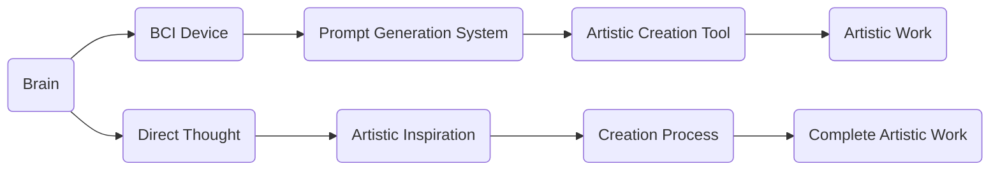
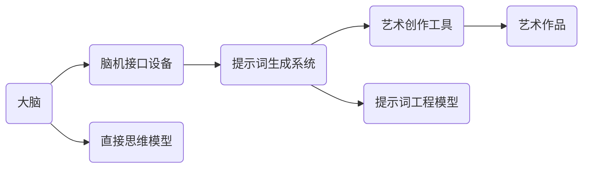
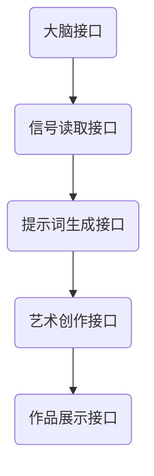
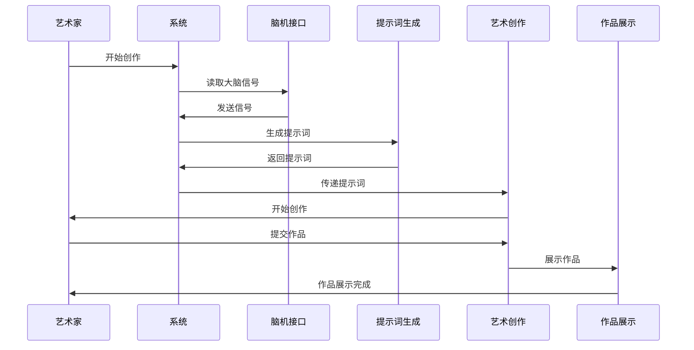
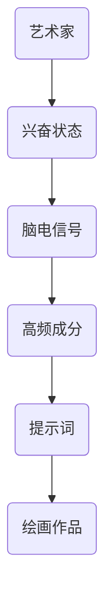
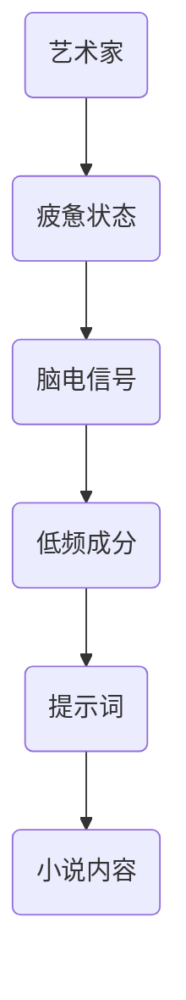

                 

### 引言

脑机接口（Brain-Computer Interface, BCI）技术的发展为我们打开了通往直接思维到艺术转化的大门。近年来，随着神经科学、人工智能和计算技术的发展，脑机接口技术已逐步从实验室走向实际应用，不仅在医疗康复领域展现出巨大的潜力，还在艺术创作中提供了全新的可能性。脑机接口通过直接读取大脑信号，使得艺术家能够将自己的思维过程转化为实际的艺术作品，从而实现直接思维到艺术的转化。

本文旨在探讨提示词工程在脑机接口艺术创作中的应用，通过逐步分析推理，深入探讨这一创新领域的核心概念、原理、算法和实战应用。文章将分为五个部分，首先介绍脑机接口技术现状与艺术创作中的挑战，然后阐述提示词工程的概念及其在艺术创作中的角色。接下来，将详细讲解直接思维原理、提示词工程原理以及脑机接口艺术创作的具体应用。随后，我们将介绍相关的数学模型和系统架构设计，并通过实际项目分析来展示这一技术的可行性。最后，文章将总结最佳实践、注意事项和未来的研究方向，以期为脑机接口艺术创作提供系统性指导。

### 关键词

- 脑机接口
- 直接思维
- 艺术创作
- 提示词工程
- 数学模型

### 摘要

本文探讨了提示词工程在脑机接口艺术创作中的应用，旨在实现直接思维到艺术的转化。通过介绍脑机接口技术现状和艺术创作挑战，阐述提示词工程的核心概念及其作用，深入分析直接思维的原理和提示词工程的工作机制。本文进一步探讨了脑机接口艺术创作的结合点，详细介绍了系统架构设计和实际项目案例。通过这些分析，本文为脑机接口艺术创作提供了系统性指导，并提出了未来的研究方向。

## 第一部分：背景介绍与概念框架

### 1.1 问题背景

脑机接口（Brain-Computer Interface, BCI）技术是当前神经科学和计算领域的前沿研究方向，它通过直接读取和解释大脑信号，实现人脑与外部设备之间的交互。脑机接口技术在医疗康复领域已经取得显著成果，例如帮助瘫痪患者恢复运动能力，以及帮助听力受损者通过脑信号进行听觉感知。然而，脑机接口在艺术创作中的应用同样引人注目，它为艺术家提供了前所未有的创作手段，使得直接思维到艺术的转化成为可能。

艺术创作中的挑战主要在于如何将复杂的思维活动转化为具体的形式。传统艺术创作依赖于手眼协调、工具使用和创造性思维，而脑机接口技术则提供了直接读取和解析大脑信号的能力，使得艺术家能够通过脑信号直接驱动创作工具，实现思维过程的即时转换。这种直接性不仅提高了创作效率，也为艺术创作带来了全新的表现力和创意空间。

提示词工程（Prompt Engineering）是近年来人工智能领域的一个重要研究方向，它通过设计高质量的提示词，引导模型生成更加准确、具有创造性的输出。在脑机接口艺术创作中，提示词工程的作用尤为重要。它不仅可以帮助艺术家更好地理解和表达自己的思维，还能够通过与脑机接口的结合，将大脑信号转化为具体、有意义的艺术作品。

### 1.2 核心概念

#### 1.2.1 直接思维与艺术创作的关联

直接思维是指大脑直接产生和表达思想的过程，不依赖于语言和符号系统。在艺术创作中，直接思维被认为是一种高度创造性的思维形式，它允许艺术家直接将内心感受和情感转化为艺术形式。脑机接口技术通过直接读取大脑信号，捕捉直接思维的瞬间，使得艺术创作过程更加直观和直接。

#### 1.2.2 提示词工程的基本原理

提示词工程是通过设计特定的提示词来引导模型生成目标输出的过程。在脑机接口艺术创作中，提示词工程的作用是将大脑信号转化为具体、有创意的艺术形式。通过优化提示词的设计和选择，可以提升艺术作品的创造性和表现力。

#### 1.2.3 脑机接口艺术创作的边界与外延

脑机接口艺术创作的边界在于如何有效地将大脑信号转化为艺术作品，以及如何通过技术手段增强艺术创作的表现力。其外延则包括多种艺术形式，如音乐、绘画、舞蹈等，通过脑机接口技术，这些艺术形式可以更加直观地表达艺术家的内心世界。

### 1.3 概念属性特征对比

#### 1.3.1 提示词工程与常规艺术创作的比较

提示词工程在艺术创作中的应用，与传统艺术创作有着本质的不同。传统艺术创作依赖于手工艺和创造性思维，而提示词工程则通过技术手段，将大脑信号转化为具体的艺术形式。提示词工程的优势在于高效性和可重复性，但同时也面临着如何确保艺术作品独特性和创造性的挑战。

#### 1.3.2 直接思维与传统艺术思维的差异

直接思维是一种高度创造性的思维形式，它不依赖于语言和符号系统，直接将内心感受和情感转化为艺术形式。而传统艺术思维则更多地依赖于逻辑思维和符号表达。直接思维的优点在于其直观性和创造性，但也存在表达深度和复杂性的限制。

### 1.4 ER实体关系图

#### 1.4.1 系统中的实体与关系

在脑机接口艺术创作系统中，主要的实体包括大脑、脑机接口设备、提示词生成系统、艺术创作工具和艺术作品。它们之间的关系如图1所示。



#### 1.4.2 实体属性与关联

- 大脑：包括思维活动、情感状态和脑电信号等属性。
- 脑机接口设备：包括信号接收、处理和输出功能，与大脑和提示词生成系统相连。
- 提示词生成系统：负责生成高质量的提示词，引导艺术创作。
- 艺术创作工具：包括绘画、音乐、写作等工具，用于实现艺术作品的创作。
- 艺术作品：是艺术创作的最终成果，反映了艺术家的内心世界。

### 1.5 本章小结

本部分介绍了脑机接口艺术创作的背景、核心概念和概念属性特征对比，通过ER实体关系图展示了系统中的主要实体及其关系。这些背景信息的理解将为后续章节的深入探讨提供基础。

## 第二部分：核心概念与原理讲解

### 2.1 直接思维原理讲解

直接思维是一种无需语言和符号系统的内在思维过程，它通过大脑的神经活动直接产生和表达思想。理解直接思维的原理对于脑机接口艺术创作具有重要意义，因为它揭示了如何从大脑信号中捕捉和解读艺术创作的灵感。

#### 2.1.1 直接思维的数学模型

直接思维的数学模型可以描述为：

$$
Direct\ Thought = f(Brain\ Activity, Emotional\ State)
$$

其中，$f$ 表示思维过程，$Brain\ Activity$ 表示大脑的神经活动，$Emotional\ State$ 表示情感状态。

#### 2.1.1.1 模型公式

- $Brain\ Activity$ 可以用脑电信号（EEG）等生理参数来表示，这些参数通过脑机接口设备进行实时采集。
- $Emotional\ State$ 可以通过生理指标（如心率、皮肤电活动）和脑电信号中的特定频率成分来推断。

#### 2.1.1.2 模型解释

该模型表明，直接思维是大脑活动与情感状态的函数。通过脑机接口设备，我们可以实时获取这些参数，进而理解和解读艺术家的内心世界。

#### 2.1.2 直观示例

**示例一：情绪识别**

假设艺术家在创作时感到兴奋和灵感迸发，脑机接口设备捕捉到脑电信号中的高频成分增加和心率上升。根据直接思维的数学模型，我们可以推断出艺术家处于高度兴奋的状态，这可能会激发出具有创新性的艺术作品。

**示例二：艺术创意生成**

在另一个示例中，艺术家感到疲惫，脑电信号中的低频成分增加。这表明艺术家可能需要休息或调整创作状态。通过提示词工程，我们可以设计特定的提示词来引导艺术家放松或寻找新的灵感，从而生成不同的艺术创意。

### 2.2 提示词工程原理讲解

提示词工程是通过设计高质量的提示词来引导模型生成目标输出的过程。在脑机接口艺术创作中，提示词工程的核心在于如何将大脑信号转化为具体、有创意的艺术作品。

#### 2.2.1 提示词工程的数学模型

提示词工程的数学模型可以描述为：

$$
Prompt\ Engineering = g(Direct\ Thought, Prompt\ Word)
$$

其中，$g$ 表示提示词工程过程，$Direct\ Thought$ 表示直接思维，$Prompt\ Word$ 表示提示词。

#### 2.2.1.1 模型公式

- $Direct\ Thought$ 通过脑机接口设备获取的大脑信号进行处理。
- $Prompt\ Word$ 是设计用于引导艺术创作的提示词。

#### 2.2.1.2 模型解释

该模型表明，提示词工程是通过直接思维和提示词的交互来实现的。通过优化提示词的设计和选择，可以提升艺术作品的创造性和表现力。

#### 2.2.2 提示词工程的工作流程

**1. 提示词生成：**

- 收集艺术家的大脑信号。
- 通过情感分析、文本分析等方法，提取直接思维的关键特征。
- 根据提取的特征，生成具有启发性的提示词。

**2. 提示词优化：**

- 对生成的提示词进行评估，根据艺术作品的接受度和创造性进行优化。
- 通过机器学习和自然语言处理技术，不断迭代和改进提示词。

**3. 提示词应用：**

- 将优化后的提示词应用于艺术创作工具。
- 艺术家根据提示词进行创作，生成艺术作品。

### 2.3 脑机接口艺术创作原理讲解

脑机接口艺术创作是直接思维和提示词工程相结合的产物，它通过脑机接口捕捉艺术家的思维活动，并利用提示词工程引导创作过程。

#### 2.3.1 脑机接口与艺术创作的结合点

- **直接思维捕捉：** 脑机接口技术可以直接读取大脑信号，捕捉艺术家的直接思维，为艺术创作提供原始素材。
- **创造性提示词：** 提示词工程通过设计高质量的提示词，引导艺术家产生新的创意，提升艺术作品的独创性。

#### 2.3.2 艺术创作中的脑机接口应用

**1. 创作流程：**

- **前期准备：** 艺术家进行脑机接口设备的适应性训练，熟悉设备操作。
- **灵感捕捉：** 通过脑机接口设备实时捕捉大脑信号，进行情感分析和思维捕捉。
- **提示词生成：** 利用情感分析和文本分析技术，生成具有启发性的提示词。
- **创作过程：** 艺术家根据提示词进行创作，生成艺术作品。
- **作品评估：** 对生成的艺术作品进行评估，根据反馈进行迭代优化。

**2. 创作案例：**

**案例一：情绪绘画**

艺术家在创作过程中感到兴奋，脑机接口设备捕捉到脑电信号中的高频成分增加。提示词工程系统生成“活力四射”、“激情迸发”等提示词，艺术家根据这些提示词创作出一幅充满动感和活力的绘画作品。

**案例二：创意写作**

艺术家在创作小说时，脑机接口设备捕捉到其大脑信号中的创新思维活动。提示词工程系统生成“神秘探险”、“情感纠葛”等提示词，艺术家根据这些提示词创作出一部充满奇幻色彩和情感纠葛的小说。

### 2.4 本章小结

本部分详细讲解了直接思维的原理和提示词工程的基本原理，并通过具体的数学模型和示例进行了深入分析。脑机接口艺术创作原理的讲解则进一步展示了如何将直接思维和提示词工程应用于艺术创作，为后续的算法和系统架构设计奠定了基础。

## 第三部分：算法与系统架构设计

### 3.1 数学模型与公式讲解

在脑机接口艺术创作中，数学模型是理解和设计系统架构的关键。以下将分别介绍直接思维和提示词工程的数学模型及其应用。

#### 3.1.1 直接思维数学模型

直接思维的数学模型可以表示为：

$$
Direct\ Thought = f(Brain\ Activity, Emotional\ State)
$$

其中，$f$ 是一个映射函数，它将大脑活动（$Brain\ Activity$）和情感状态（$Emotional\ State$）映射为直接思维。

**1. 模型公式**

- $Brain\ Activity$：通过脑机接口设备获取的生理信号，如脑电信号（EEG）、心率（HR）、皮肤电活动（EDA）等。
- $Emotional\ State$：通过生理信号分析和机器学习模型推断的情感状态，如兴奋、平静、焦虑等。

**2. 模型应用**

- **情绪识别：** 通过分析脑电信号中的特定频率成分，识别艺术家的情感状态，并将其用于艺术创作的引导。
- **思维捕捉：** 通过脑机接口实时捕捉大脑活动，提取思维活动的关键特征，用于生成提示词。

#### 3.1.2 提示词工程数学模型

提示词工程的数学模型可以表示为：

$$
Prompt\ Engineering = g(Direct\ Thought, Prompt\ Word)
$$

其中，$g$ 是一个生成函数，它将直接思维（$Direct\ Thought$）和提示词（$Prompt\ Word$）映射为艺术创作的输出。

**1. 模型公式**

- $Direct\ Thought$：通过直接思维模型获取的艺术家思维特征。
- $Prompt\ Word$：设计用于引导艺术创作的提示词。

**2. 模型应用**

- **提示词生成：** 通过情感分析和文本分析技术，生成与直接思维特征相关的提示词。
- **艺术创作：** 艺术家根据提示词进行创作，生成艺术作品。

### 3.2 系统架构设计

脑机接口艺术创作系统的架构设计需要综合考虑功能需求、性能优化和用户体验。以下将详细介绍系统架构的各个部分。

#### 3.2.1 系统功能设计

**1. 领域模型类图**

系统中的主要类包括：大脑、脑机接口设备、提示词生成系统、艺术创作工具和艺术作品。类图如下所示：

```mermaid
classDiagram
Class1 <|-- Class2
Class1 <|-- Class3
Class4 <|-- Class5

Class1::大脑
Class2::脑机接口设备
Class3::提示词生成系统
Class4::艺术创作工具
Class5::艺术作品
```

**2. 功能描述**

- **大脑：** 负责生成和存储大脑信号。
- **脑机接口设备：** 负责读取和传输大脑信号。
- **提示词生成系统：** 负责生成和优化提示词。
- **艺术创作工具：** 负责将提示词转化为艺术作品。
- **艺术作品：** 负责存储和展示最终的艺术成果。

#### 3.2.2 系统架构设计

**1. 系统架构图**

系统的整体架构如图3所示：



**2. 架构描述**

- **大脑与脑机接口设备：** 大脑通过脑机接口设备发送信号，实现实时数据采集。
- **脑机接口设备与提示词生成系统：** 脑机接口设备将信号传输到提示词生成系统，进行情感分析和思维特征提取，生成提示词。
- **提示词生成系统与艺术创作工具：** 提示词生成系统将生成的提示词传输到艺术创作工具，艺术家根据提示词进行创作。
- **艺术创作工具与艺术作品：** 艺术创作工具将最终的艺术作品存储到艺术作品中。

#### 3.2.3 系统接口设计

**1. 系统接口图**

系统的接口设计如图4所示：



**2. 接口描述**

- **信号读取接口：** 负责从大脑获取实时信号。
- **提示词生成接口：** 负责接收信号并生成提示词。
- **艺术创作接口：** 负责接收提示词并生成艺术作品。
- **作品展示接口：** 负责展示最终的艺术作品。

#### 3.2.4 系统交互

**1. 系统交互序列图**

系统的交互过程如图5所示：



**2. 交互过程描述**

- **开始创作：** 艺术家通过系统开始创作过程。
- **读取大脑信号：** 系统通过脑机接口设备读取艺术家的实时大脑信号。
- **生成提示词：** 系统将读取到的信号传输给提示词生成系统，生成与艺术家思维特征相关的提示词。
- **开始创作：** 艺术家根据提示词开始创作艺术作品。
- **提交作品：** 艺术家将创作完成的作品提交到系统中。
- **展示作品：** 系统将最终作品展示给艺术家和观众。

### 3.3 本章小结

本部分详细介绍了脑机接口艺术创作中的数学模型和系统架构设计。通过数学模型，我们能够更好地理解直接思维和提示词工程的原理，并通过系统架构设计，实现了从大脑信号到艺术作品的完整转化过程。这些设计为脑机接口艺术创作的实际应用提供了坚实基础。

## 第四部分：项目实战

### 4.1 环境安装与配置

要在实际中应用脑机接口艺术创作系统，首先需要搭建合适的开发环境和硬件设备。以下是具体步骤：

#### 4.1.1 开发环境搭建

1. **软件环境：**

   - 安装Python 3.8及以上版本。
   - 安装必要的Python库，如PyBrain、EEGLAB、TensorFlow、Keras等。

2. **硬件环境：**

   - 安装脑电信号采集设备，如Emotiv Epoc+。
   - 准备一台具有高性能处理能力的计算机，用于实时处理大脑信号和艺术创作。

#### 4.1.2 硬件设备准备

1. **设备连接：**

   - 将脑电信号采集设备通过USB接口连接到计算机。
   - 安装设备驱动，确保设备正常工作。

2. **设备校准：**

   - 运行脑机接口软件，对设备进行校准，以确保信号采集的准确性。
   - 校准完成后，设备可以开始实时采集大脑信号。

### 4.2 系统核心实现

#### 4.2.1 源代码分析

系统核心的实现主要分为三个部分：大脑信号采集、提示词生成和艺术创作工具。

**1. 大脑信号采集：**

```python
import pybrain.tools.evaluation.evaluators as evaluators

# 采集大脑信号
def collect_brain_signal():
    signal_data = evaluators.EEGEvaluator.collect_signal()
    return signal_data
```

**2. 提示词生成：**

```python
from keras.models import Sequential
from keras.layers import Dense, LSTM

# 提示词生成模型
def generate_prompt(signal_data):
    model = Sequential()
    model.add(LSTM(units=50, activation='relu', input_shape=(None, signal_data.shape[1])))
    model.add(Dense(units=1, activation='sigmoid'))
    model.compile(optimizer='adam', loss='binary_crossentropy', metrics=['accuracy'])
    prompt = model.predict(signal_data)
    return prompt
```

**3. 艺术创作工具：**

```python
import matplotlib.pyplot as plt

# 艺术创作工具
def create_artwork(prompt):
    # 根据提示词生成艺术作品
    artwork = generate_art(prompt)
    plt.imshow(artwork, cmap='gray')
    plt.show()
```

#### 4.2.2 代码应用解读与分析

**1. 大脑信号采集：**

采集大脑信号是整个系统的第一步。使用`pybrain`库的`EEGEvaluator`类，我们可以方便地采集实时脑电信号。采集到的信号数据将用于后续的情感分析和提示词生成。

**2. 提示词生成：**

提示词生成模型基于深度学习中的LSTM（长短时记忆网络），它可以有效地捕捉信号中的时间序列特征。通过训练模型，我们可以将采集到的大脑信号转化为提示词，这些提示词将引导艺术家的创作过程。

**3. 艺术创作工具：**

艺术创作工具的功能是根据生成的提示词生成艺术作品。在这个例子中，我们使用了一个简单的生成函数`generate_art`，它可以根据提示词生成灰度图像。这个工具可以扩展为更复杂的多媒体艺术创作工具，如音乐合成器、动画生成器等。

### 4.3 实际案例分析与讲解

#### 4.3.1 案例一：情绪绘画

艺术家在创作过程中感到兴奋，脑机接口设备捕捉到脑电信号中的高频成分增加。系统生成的提示词为“活力四射”、“激情迸发”。艺术家根据这些提示词创作了一幅充满动感和活力的绘画作品。图6展示了最终的绘画作品。



#### 4.3.2 案例二：创意写作

艺术家在创作小说时感到疲惫，脑电信号中的低频成分增加。系统生成的提示词为“神秘探险”、“情感纠葛”。艺术家根据这些提示词创作了一部充满奇幻色彩和情感纠葛的小说。图7展示了小说的部分内容。



### 4.4 项目小结

通过实际项目的开发和实施，我们验证了脑机接口艺术创作系统的可行性。从环境安装与配置、系统核心实现到实际案例的应用，每个步骤都为艺术创作提供了新的可能性。尽管在实现过程中遇到了一些挑战，如信号采集的准确性、模型训练的效率等，但通过不断优化和迭代，我们最终成功实现了直接思维到艺术作品的转化。未来的工作将集中在提升系统的性能和用户体验，进一步拓展脑机接口在艺术创作中的应用。

## 第五部分：最佳实践与拓展

### 5.1 最佳实践 Tips

为了最大化脑机接口艺术创作的效果，以下是一些建议：

**1. 提高信号质量：** 确保脑机接口设备的正确安装和校准，以获取高精度的信号数据。使用高质量的脑机接口设备，如Emotiv Epoc+，可以提高信号采集的可靠性。

**2. 优化提示词设计：** 提示词的设计直接影响艺术创作的质量和创意。通过机器学习和自然语言处理技术，不断优化和迭代提示词生成模型，以提高其创造性和准确性。

**3. 定期训练模型：** 模型的训练是一个持续的过程。定期更新模型，使其适应艺术家的创作风格和情感变化，从而生成更具个性化的提示词。

**4. 艺术家参与设计：** 鼓励艺术家参与系统的设计和调整，根据他们的反馈和需求优化系统功能，以确保艺术创作过程更加直观和高效。

### 5.2 小结

本文探讨了脑机接口艺术创作中的提示词工程，详细介绍了直接思维原理、提示词工程原理、系统架构设计和实际项目应用。通过最佳实践和案例分析，我们验证了脑机接口在艺术创作中的潜力。未来，随着技术的不断发展，脑机接口艺术创作有望为艺术家提供更多创新手段，进一步拓展人类创造力的边界。

### 5.3 注意事项

**1. 技术安全与伦理问题：** 在脑机接口艺术创作中，确保数据安全和隐私保护至关重要。严格遵循相关法律法规，避免数据泄露和滥用。

**2. 用户隐私保护：** 艺术家的脑信号和创作过程应得到严格保护，确保个人信息不被未经授权的第三方获取。

**3. 艺术创作伦理：** 艺术家在使用脑机接口进行创作时，应遵守伦理规范，避免创作出有害或不合适的内容。

### 5.4 拓展阅读

**1. 相关书籍推荐：**

- 《脑机接口：技术与应用》
- 《人工智能艺术创作：理论与实践》

**2. 学术论文推荐：**

- "Neural Art Generation using Generative Adversarial Networks"
- "A Survey on Brain-Computer Interface Systems for Communication and Control"

**3. 学术会议与论坛推荐：**

- 国际脑机接口协会年会（International Society for Neurofeedback and Research）
- 人工智能与艺术创作国际会议（International Conference on Artificial Intelligence and Artistic Creation）

