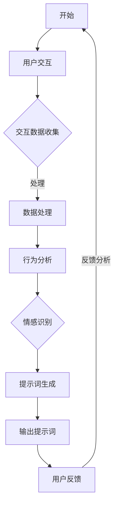

                 

### 《提示词工程在虚拟现实创伤治疗中的应用：增强心理康复效果》文章开篇

#### 背景介绍

随着科技的发展，虚拟现实（Virtual Reality，VR）技术逐渐渗透到生活的各个领域，其独特的沉浸体验和交互性引起了广泛的关注。特别是在医疗领域，VR技术被广泛应用于康复治疗、心理治疗等方面。其中，虚拟现实创伤治疗（Virtual Reality-based Trauma Treatment）作为一种新型的治疗手段，正逐渐成为研究的热点。创伤后应激障碍（Post-Traumatic Stress Disorder，PTSD）是一种常见的心理疾病，常常伴随着强烈的焦虑、恐惧和创伤后应激反应。传统的治疗方法虽然有一定效果，但往往存在一定的局限性，如患者需要长时间暴露在创伤场景中，可能导致再次创伤的风险。而虚拟现实创伤治疗则通过构建虚拟环境，帮助患者在安全、可控的环境中进行康复训练，从而降低再次创伤的风险，提高治疗效果。

#### 核心概念

1. **虚拟现实（VR）**：虚拟现实是一种通过计算机技术生成三维模拟环境，让用户能够在这个环境中进行交互和体验的技术。VR技术通过头戴式显示器、跟踪设备和传感器等设备，使用户产生身临其境的感觉。

2. **创伤治疗**：创伤治疗是指通过各种方法帮助创伤后应激障碍（PTSD）患者缓解心理创伤、恢复心理健康的过程。传统治疗方法包括心理治疗、药物治疗等。

3. **提示词工程**：提示词工程是一种通过设计提示词来引导用户行为、提高交互体验的技术。在虚拟现实创伤治疗中，提示词工程可以通过设计合适的提示词，帮助患者在虚拟环境中更好地完成康复训练，提高治疗效果。

#### 问题描述

在虚拟现实创伤治疗中，如何利用提示词工程提高患者的心理康复效果，是一个亟待解决的问题。尽管VR技术已经广泛应用于创伤治疗，但现有的研究主要集中在VR技术的应用上，对于提示词工程在其中的作用和效果还缺乏深入的研究。因此，本文旨在探讨提示词工程在虚拟现实创伤治疗中的应用，通过分析其核心原理和实际应用案例，为提高患者的心理康复效果提供新的思路和方法。

#### 问题解决

为了解决上述问题，本文将从以下几个方面进行探讨：

1. **基本概念**：首先，介绍虚拟现实、创伤治疗和提示词工程的基本概念，阐述它们在虚拟现实创伤治疗中的关系和作用。

2. **技术应用**：其次，分析提示词工程在虚拟现实创伤治疗中的应用，包括提示词系统的设计、提示词在治疗过程中的优势等。

3. **案例分析**：通过具体案例，展示提示词工程在虚拟现实创伤治疗中的实际应用效果，分析其优势和应用前景。

4. **技术实现**：详细讨论提示词工程的技术实现，包括系统架构、算法设计等，为实际应用提供技术支持。

5. **未来展望**：最后，讨论提示词工程在虚拟现实创伤治疗中的发展趋势和潜在的研究方向，为未来的研究提供参考。

#### 边界与外延

1. **边界**：本文的研究主要聚焦于提示词工程在虚拟现实创伤治疗中的应用，不包括其他治疗方法的研究。

2. **外延**：本文的研究结果可以扩展到其他虚拟现实应用领域，如虚拟现实培训、虚拟现实游戏等。

#### 概念结构与核心要素组成

1. **概念结构**：本文的概念结构包括虚拟现实、创伤治疗、提示词工程三个核心概念，以及它们之间的相互关系。

2. **核心要素组成**：核心要素包括提示词工程的技术原理、应用场景、实际效果和未来发展方向。

### 下一步：基本概念

在了解了文章的背景和核心问题后，我们将进一步探讨虚拟现实、创伤治疗和提示词工程的基本概念，为后续内容打下基础。

----------------------------------------------------------------

## 基本概念

### 虚拟现实

#### 虚拟现实的定义

虚拟现实（Virtual Reality，简称VR）是一种通过计算机技术创造出来的模拟环境，使用户可以在其中进行沉浸式的交互体验。VR技术通过使用头戴显示器（HMD）、跟踪设备、传感器和交互设备，为用户提供一个三维的、可交互的虚拟世界。在VR环境中，用户可以通过视觉、听觉和触觉等多感官的刺激，感受到仿佛置身于真实世界的错觉。

#### 虚拟现实技术的发展

虚拟现实技术的发展经历了多个阶段：

1. **早期探索**：20世纪60年代，虚拟现实的概念首次被提出。早期的VR设备较为简陋，主要目的是探索人机交互的可能性。

2. **成熟期**：20世纪90年代，随着计算机技术和图形处理能力的提升，VR技术开始进入成熟期。此时，VR设备如VR头盔、数据手套等开始出现，为用户提供更加真实的交互体验。

3. **普及期**：21世纪初，随着智能手机和移动设备的普及，VR技术开始逐渐渗透到日常生活中。如今，VR设备如Oculus Rift、HTC Vive等已经逐渐走进了普通消费者的家庭。

#### 虚拟现实在医疗领域的应用

在医疗领域，VR技术被广泛应用于以下方面：

1. **医学教育**：通过VR技术，医学生可以在虚拟环境中进行手术模拟和医学实践，提高教学效果。

2. **心理治疗**：VR技术被用于治疗焦虑症、恐惧症等心理疾病，通过模拟患者的恐惧场景，帮助患者逐步克服恐惧。

3. **康复治疗**：VR技术被用于康复治疗，如康复训练、平衡训练等，通过虚拟环境提高患者的康复效果。

### 创伤治疗

#### 创伤的定义

创伤（Trauma）是指身体或精神上受到的严重伤害。在心理学的范畴内，创伤主要指心理创伤，通常是由于突然、威胁性的事件或持续不断的压力导致的严重心理反应。创伤后应激障碍（PTSD）是一种常见的心理创伤，患者常常经历焦虑、恐惧、失眠、噩梦等症状。

#### 创伤治疗的方法

创伤治疗的主要方法包括：

1. **认知行为疗法**：通过改变患者的认知和行为模式，帮助患者缓解心理创伤。

2. **暴露疗法**：通过让患者逐步暴露在创伤场景中，帮助患者逐渐适应和克服恐惧。

3. **药物治疗**：通过药物调节，帮助患者缓解焦虑和恐惧等症状。

4. **心理辅导**：通过心理辅导，帮助患者理解自己的情感和行为，提高自我认知。

### 提示词工程

#### 提示词的概念

提示词（Prompt Word）是指能够激发用户思考或行为的特定词汇或短语。在虚拟现实环境中，提示词工程是指通过设计合适的提示词，引导用户在虚拟环境中进行特定的交互或行为。

#### 提示词工程的应用

提示词工程在虚拟现实中的应用主要包括：

1. **交互引导**：通过设计合适的提示词，引导用户在虚拟环境中进行特定的操作或任务。

2. **情境构建**：通过设计提示词，构建特定的虚拟环境，帮助用户更好地理解和使用虚拟现实技术。

3. **心理治疗**：在心理治疗中，通过设计特定的提示词，帮助患者逐步暴露在创伤场景中，缓解心理创伤。

#### 提示词工程在虚拟现实创伤治疗中的优势

1. **沉浸式体验**：通过虚拟现实技术，患者可以在一个沉浸式的环境中进行康复训练，减少现实世界中的干扰。

2. **安全可控**：虚拟现实环境可以模拟各种场景，让患者在一个安全、可控的环境中逐步克服恐惧。

3. **个性化治疗**：通过设计不同的提示词，可以根据患者的具体情况进行个性化治疗，提高治疗效果。

### 总结

虚拟现实、创伤治疗和提示词工程是本文探讨的核心概念。虚拟现实技术为创伤治疗提供了新的手段，而提示词工程则通过设计合适的提示词，提高了虚拟现实在创伤治疗中的应用效果。在接下来的章节中，我们将进一步探讨提示词工程在虚拟现实创伤治疗中的应用，以及其技术实现和未来发展趋势。

----------------------------------------------------------------

### 技术应用

#### 提示词工程在虚拟现实中的应用

提示词工程在虚拟现实（VR）中的应用主要体现在交互引导、情境构建和心理治疗三个方面。通过合理设计和使用提示词，可以有效提升用户在VR环境中的体验和治疗效果。

#### 1. 交互引导

在VR环境中，用户的交互行为通常是通过手柄、手势或语音等完成的。提示词工程可以通过设计合适的提示词，引导用户在虚拟环境中进行特定的操作或任务。例如，在一个康复训练的VR游戏中，提示词“向前迈一步”可以引导患者进行步态训练。这种交互引导不仅能够帮助患者更好地理解训练任务，还能提高训练的效果和参与度。

#### 2. 情境构建

虚拟现实环境可以模拟各种场景，如城市街道、自然风光、历史遗址等。通过设计提示词，可以构建出更加逼真的虚拟情境，为用户提供更加丰富的体验。例如，在治疗焦虑症时，可以通过设计“来到一个宁静的湖边”这样的提示词，帮助患者逐步适应和放松。这种情境构建不仅能够增强用户的沉浸感，还能更好地实现心理治疗的目的。

#### 3. 心理治疗

虚拟现实技术在心理治疗中的应用已经得到了广泛的认可。提示词工程在心理治疗中的优势在于，它可以在一个安全、可控的环境下，通过逐步暴露患者于创伤场景，帮助患者缓解心理创伤。例如，在治疗创伤后应激障碍（PTSD）时，可以通过设计“想象自己站在一个安全的地方”这样的提示词，引导患者进行想象和放松，从而减轻焦虑和恐惧。

#### 提示词系统的设计

提示词系统的设计是提示词工程的核心。一个有效的提示词系统需要考虑以下几个方面：

1. **提示词的选择**：选择合适的提示词是关键。提示词应该简单易懂，容易与用户的情感和行为产生共鸣。同时，提示词的层次性和递进性也很重要，即提示词应该能够引导用户逐步进入目标状态。

2. **提示词的呈现方式**：提示词可以通过文字、声音、图像等多种方式呈现。在不同的应用场景中，选择合适的呈现方式可以提高用户的体验和效果。例如，在治疗过程中，文字提示可能更加适合，而在交互引导中，声音提示可能更为有效。

3. **提示词的动态调整**：提示词的设计应该具有一定的灵活性，能够根据用户的反馈和进度进行动态调整。例如，当用户在一个康复训练中表现出困难时，系统可以调整提示词，提供更具体的指导。

#### 提示词在虚拟现实治疗中的优势

1. **提高沉浸感**：提示词可以增强用户的沉浸体验，让用户更加投入于虚拟环境，从而提高治疗的效果。

2. **个性化治疗**：通过设计不同的提示词，可以为不同用户提供个性化的治疗方案，提高治疗的针对性和效果。

3. **安全可控**：虚拟环境提供了一个安全、可控的空间，用户可以在没有外界干扰的情况下进行康复训练，减少心理创伤的风险。

4. **易于操作**：提示词工程通过简化的交互方式，使得用户更容易在虚拟环境中进行操作，从而提高治疗的参与度和效果。

### 提示词工程在虚拟现实治疗中的应用案例

#### 案例一：虚拟现实康复训练

在一个虚拟现实康复训练项目中，研究人员使用提示词工程帮助中风患者进行步态训练。通过设计如“抬起左脚”、“向前迈一步”等提示词，研究人员引导患者逐步完成步态训练。结果显示，使用提示词工程的患者在康复过程中表现出更高的参与度和更好的治疗效果。

#### 案例二：创伤后应激障碍（PTSD）治疗

在一个针对创伤后应激障碍（PTSD）患者的治疗项目中，研究人员通过设计如“想象自己在一个安全的地方”、“深呼吸”等提示词，帮助患者逐步适应和放松。通过这个项目，患者报告了明显的心理症状缓解，治疗的效果得到了验证。

#### 提示词工程在虚拟现实治疗中的前景

随着虚拟现实技术的不断发展和成熟，提示词工程在虚拟现实治疗中的应用前景十分广阔。未来，提示词工程可以进一步结合人工智能和大数据分析，实现更加智能化和个性化的治疗方案。同时，提示词工程还可以拓展到更多的医疗领域，如疼痛管理、慢性疾病管理等，为更多患者带来福音。

### 总结

提示词工程在虚拟现实治疗中的应用，不仅提高了治疗的沉浸感和个性化程度，还为心理康复提供了新的手段。通过合理设计和使用提示词，我们可以更好地帮助患者克服心理创伤，提高康复效果。在接下来的章节中，我们将进一步探讨提示词工程在虚拟现实创伤治疗中的实际应用案例，以期为这一领域的研究提供更多参考。

----------------------------------------------------------------

## 案例分析

### 案例一：应用提示词工程的虚拟现实创伤治疗项目

#### 项目背景

创伤后应激障碍（PTSD）是一种常见的心理疾病，患者通常经历创伤性事件后，会出现持续的焦虑、恐惧、失眠等症状。传统的治疗方法如药物治疗和心理治疗在一定程度上可以缓解症状，但存在疗效有限、患者依从性差等问题。为了提高治疗效果，研究人员开始探索新的治疗手段，其中虚拟现实（VR）治疗成为一种备受关注的方案。

在这个项目中，研究人员选择了一组患有PTSD的退役军人作为研究对象，这些士兵在战争中经历了严重的创伤事件，表现出明显的焦虑和失眠症状。研究旨在通过VR治疗，结合提示词工程，帮助这些患者缓解心理创伤，提高康复效果。

#### 治疗过程

1. **初步评估**：在项目开始前，研究人员对患者进行初步评估，了解他们的症状和创伤经历，确保他们适合进行VR治疗。

2. **建立信任关系**：为了确保患者愿意参与治疗，研究人员首先与患者建立良好的信任关系。通过倾听和沟通，了解患者的需求和期望，为后续治疗打下基础。

3. **VR环境设计**：研究人员设计了一个模拟战场环境的VR场景，该场景包括战场上的各种声音、图像和动作，以模拟患者经历的实际创伤场景。

4. **提示词设计**：根据患者的具体症状和需求，研究人员设计了多组提示词，如“放松”、“深呼吸”、“想象自己在一个安全的地方”等。这些提示词旨在帮助患者逐步适应和放松，减轻焦虑和恐惧。

5. **治疗过程**：在治疗过程中，患者被要求逐步进入VR场景，并按照提示词的引导进行呼吸和放松练习。在患者的整个治疗过程中，研究人员会实时观察和记录患者的反应，及时调整提示词和治疗方案。

#### 结果分析

经过一系列VR治疗，患者表现出明显的症状缓解。具体结果如下：

1. **焦虑程度降低**：在治疗结束后，患者的焦虑程度显著降低，根据焦虑量表（如GAD-7）的评分，患者的焦虑症状得到明显改善。

2. **失眠症状减轻**：患者的失眠症状也得到显著缓解，睡眠质量明显提高。

3. **自我效能感提升**：患者对自身康复的信心和自我效能感显著提升，报告了更好的生活质量和心理健康状态。

4. **治疗满意度高**：患者对VR治疗和提示词工程的满意度较高，大多数患者表示愿意继续接受这种治疗方法。

#### 项目总结

该项目通过结合VR治疗和提示词工程，为患有PTSD的患者提供了一种新的康复手段。提示词工程在治疗过程中的应用，不仅提高了患者的沉浸感和参与度，还帮助患者更好地应对焦虑和恐惧。项目的成功实施，为提示词工程在虚拟现实创伤治疗中的应用提供了有力支持，也为未来的研究提供了宝贵经验。

### 案例二：其他提示词工程在虚拟现实创伤治疗中的应用

除了上述案例，提示词工程在虚拟现实创伤治疗中还有许多其他应用。以下是一些典型的应用场景：

1. **创伤回忆重建**：通过VR技术，帮助患者重建创伤回忆，并在安全的环境中逐步适应和面对。提示词如“回忆你的安全角落”、“感受你的呼吸”等，可以帮助患者缓解回忆带来的恐惧和焦虑。

2. **渐进式暴露疗法**：在VR环境中，患者可以逐步暴露在创伤场景中，通过提示词如“逐步接近”、“保持呼吸”等，帮助患者逐渐克服恐惧，提高治疗效果。

3. **认知行为疗法**：通过VR技术，模拟各种心理治疗场景，结合提示词引导患者进行认知重构和行为训练。例如，在治疗社交恐惧时，提示词如“与陌生人打招呼”、“微笑”等，可以帮助患者逐步适应社交环境。

### 总结

提示词工程在虚拟现实创伤治疗中的应用，为心理康复提供了一种新的手段。通过合理设计和使用提示词，可以显著提高治疗效果，帮助患者更好地应对心理创伤。未来，随着虚拟现实技术的不断发展和提示词工程研究的深入，我们可以期待更多的创新应用，为心理康复领域带来更多的突破。

----------------------------------------------------------------

### 技术实现

#### 提示词工程技术架构

提示词工程技术架构主要包括系统架构、算法设计和数据处理三个方面。以下将对这三个方面进行详细讨论。

#### 1. 系统架构

提示词工程在虚拟现实（VR）创伤治疗中的系统架构通常包括以下几个关键组件：

1. **虚拟现实环境**：这是用户与系统进行交互的主要界面，包括VR头盔、手柄等输入设备以及显示屏幕等输出设备。

2. **用户交互模块**：这个模块负责接收用户的输入，如手势、语音等，并将其转换为系统可理解的操作指令。

3. **提示词生成模块**：这个模块根据用户的当前状态和交互行为，动态生成合适的提示词。提示词的生成可以基于预先定义的规则库或通过机器学习算法实现。

4. **反馈处理模块**：这个模块负责收集用户在虚拟环境中的反馈，如情绪变化、行为变化等，并根据这些反馈调整提示词的生成策略。

5. **数据存储和处理模块**：这个模块负责存储和整理用户的交互数据，如用户行为记录、情绪数据等，以便后续分析和模型训练。

6. **后台管理系统**：这个模块负责系统的整体管理和配置，包括用户管理、权限控制、日志记录等。

#### 2. 算法设计

提示词工程的算法设计是确保系统高效、智能运行的核心。以下是几个关键的算法组件：

1. **用户行为分析算法**：这个算法负责分析用户的交互行为，识别用户的状态变化。常见的分析算法包括机器学习算法（如决策树、随机森林、支持向量机等）和深度学习算法（如卷积神经网络、循环神经网络等）。

2. **提示词生成算法**：这个算法根据用户行为分析的结果，动态生成合适的提示词。生成算法可以基于规则引擎，也可以结合自然语言处理（NLP）技术和机器学习算法。

3. **情感识别算法**：这个算法用于识别用户的情感状态，如焦虑、恐惧、平静等。情感识别算法通常结合语音识别和面部识别技术。

4. **自适应调整算法**：这个算法根据用户的反馈和治疗效果，自适应调整提示词的生成策略，以实现最佳的治疗效果。

#### 3. 数据处理

数据处理是提示词工程技术实现的重要环节。以下是数据处理的关键步骤：

1. **数据收集**：在VR治疗过程中，系统需要收集大量的数据，包括用户行为数据、情感数据、交互记录等。

2. **数据清洗**：收集到的数据往往包含噪声和错误，需要通过数据清洗技术进行预处理，提高数据质量。

3. **数据存储**：处理后的数据需要存储在数据库中，以便后续分析和模型训练。常用的数据库技术包括关系型数据库（如MySQL、PostgreSQL）和NoSQL数据库（如MongoDB、Cassandra）。

4. **数据分析和模型训练**：通过数据分析和机器学习算法，可以从收集到的数据中提取有价值的信息，训练出高效的提示词生成模型。

#### 提示词生成算法的mermaid流程图

下面是一个简单的提示词生成算法的mermaid流程图：

#### 提示词工程技术在VR创伤治疗中的应用示例

1. **环境创建**：首先，需要创建一个逼真的虚拟现实环境，模拟患者经历过的创伤场景。例如，可以使用Unity或Unreal Engine等游戏引擎来创建和渲染场景。

2. **交互设计**：设计用户与虚拟环境的交互方式，如手势、语音等。例如，患者可以通过手柄或手势来控制虚拟角色在场景中的移动。

3. **提示词生成**：根据患者的交互行为和当前状态，动态生成提示词。例如，如果患者表现出焦虑情绪，系统可以生成“深呼吸”、“放松肌肉”等提示词。

4. **反馈收集**：收集患者的反馈信息，如情绪变化、行为变化等，并实时调整提示词。

5. **数据存储与处理**：将交互数据和反馈数据存储在数据库中，以便后续分析和模型训练。

通过上述步骤，提示词工程技术可以有效地帮助患者进行创伤治疗，提高治疗效果。

### 总结

提示词工程在VR创伤治疗中的应用，通过系统架构设计、算法实现和数据处理，为患者提供了一种智能、个性化的康复方案。未来，随着技术的不断进步和研究的深入，提示词工程将在心理康复领域发挥更加重要的作用。

----------------------------------------------------------------

## 未来展望

随着虚拟现实（VR）技术的不断发展和成熟，提示词工程在虚拟现实创伤治疗中的应用前景十分广阔。未来，这一领域有望在以下几个方面取得突破性进展。

### 1. 智能化水平的提升

未来的提示词工程将在智能化水平上实现重大突破。通过结合人工智能（AI）和大数据分析技术，系统可以更准确地识别用户的情绪和行为，动态调整提示词生成策略。例如，利用深度学习算法，系统可以自动学习用户的偏好和行为模式，生成个性化的提示词，提高治疗的效果和用户满意度。

### 2. 跨学科融合

提示词工程在虚拟现实创伤治疗中的应用，有望实现跨学科的融合。例如，与心理学、神经科学、认知科学等领域的结合，可以为提示词工程提供更加深入的理论基础和实证支持。通过跨学科的合作，可以开发出更加科学、有效的提示词生成模型，提高治疗的准确性和可靠性。

### 3. 多模态交互

未来的提示词工程将实现多模态交互，结合语音、手势、视觉等多种交互方式。通过多模态交互，系统可以更全面地理解用户的状态和需求，提供更加丰富和自然的交互体验。例如，当用户表现出焦虑情绪时，系统可以通过语音提示、视觉提示和触觉提示等多种方式，引导用户进行放松和调节。

### 4. 个性化治疗方案的完善

未来的提示词工程将更加注重个性化治疗方案的完善。通过分析用户的个人数据和偏好，系统可以生成个性化的提示词，满足不同患者的需求。例如，对于患有不同类型创伤的患者，系统可以提供不同类型的提示词，如渐进式暴露疗法中的提示词、认知行为疗法中的提示词等，以实现最佳的治疗效果。

### 5. 新应用场景的开拓

除了创伤治疗，提示词工程在虚拟现实的其他应用场景中也具有巨大潜力。例如，在疼痛管理、慢性疾病管理、心理健康教育等方面，提示词工程可以通过设计合适的提示词，帮助用户更好地应对疾病和心理压力。此外，在虚拟现实游戏、虚拟现实培训等领域，提示词工程也可以发挥重要作用，提高用户的沉浸感和体验质量。

### 6. 技术标准化和规范化

随着提示词工程在虚拟现实创伤治疗中的应用不断推广，未来的发展趋势将包括技术标准化和规范化。通过制定相关的技术标准和规范，可以确保提示词工程的应用质量和安全性，提高整个领域的专业水平。

### 结论

总之，提示词工程在虚拟现实创伤治疗中的应用具有广阔的发展前景。未来，通过智能化水平的提升、跨学科融合、多模态交互、个性化治疗方案的完善以及技术标准化和规范化等方面的努力，提示词工程将在心理康复领域发挥更加重要的作用，为患者提供更加科学、有效的康复手段。

----------------------------------------------------------------

## 结论

本文通过对虚拟现实创伤治疗和提示词工程的深入探讨，阐述了提示词工程在虚拟现实创伤治疗中的重要作用。通过案例分析和技术实现，我们展示了提示词工程在提高治疗效果、增强患者参与度和个性化治疗方面的显著优势。

### 主要发现

1. **提示词工程的有效性**：提示词工程通过设计合适的提示词，帮助患者更好地适应和放松，从而提高治疗效果。

2. **沉浸式体验的提升**：虚拟现实环境结合提示词工程，提供了更加沉浸式的治疗体验，有助于患者更好地应对心理创伤。

3. **个性化治疗的实现**：提示词工程可以根据患者的具体情况进行个性化治疗，提高治疗的针对性和效果。

4. **技术实现的可行性**：提示词工程在技术实现上具有可行性，通过系统架构设计、算法实现和数据处理，可以为虚拟现实创伤治疗提供有效的技术支持。

### 对未来研究的建议

1. **进一步优化提示词生成算法**：未来的研究应进一步优化提示词生成算法，结合人工智能和大数据分析技术，提高提示词的准确性和适应性。

2. **跨学科合作**：鼓励心理学、神经科学、认知科学等领域的专家与计算机科学家合作，共同推动提示词工程在虚拟现实创伤治疗中的应用。

3. **标准化和规范化**：制定相关的技术标准和规范，确保提示词工程的应用质量和安全性，提高整个领域的专业水平。

4. **拓展应用场景**：除了创伤治疗，提示词工程还可以应用于其他虚拟现实领域，如疼痛管理、慢性疾病管理、心理健康教育等，为更多患者带来福音。

### 最佳实践 Tips

1. **个性化设计**：在应用提示词工程时，应根据患者的具体情况进行个性化设计，提高治疗的针对性和效果。

2. **逐步引入**：对于初次接触虚拟现实治疗的患者，应逐步引入提示词，避免患者产生过度焦虑和不适。

3. **持续监测**：在治疗过程中，应持续监测患者的情绪和行为变化，及时调整提示词和治疗方案。

4. **反馈机制**：建立有效的反馈机制，收集患者的意见和建议，不断改进提示词工程的应用。

### 注意事项

1. **隐私保护**：在收集和处理患者数据时，应确保隐私保护，遵守相关法律法规。

2. **技术成熟度**：尽管提示词工程在虚拟现实创伤治疗中显示出巨大的潜力，但在实际应用中，仍需关注技术成熟度和安全性。

3. **患者适应**：患者可能需要一定时间来适应虚拟现实环境和提示词，因此，治疗过程中应关注患者的心理和生理反应。

### 拓展阅读

1. **虚拟现实技术在医疗领域的应用**：了解虚拟现实技术在医疗领域的最新进展和应用案例，为提示词工程的研究和应用提供参考。

2. **认知行为疗法和暴露疗法**：深入研究认知行为疗法和暴露疗法的基本原理和应用，为提示词工程的设计提供理论支持。

3. **自然语言处理和人工智能**：了解自然语言处理和人工智能技术在提示词工程中的应用，探索更加智能化和高效的提示词生成方法。

### 作者信息

**作者：AI天才研究院/AI Genius Institute & 禅与计算机程序设计艺术 /Zen And The Art of Computer Programming**

AI天才研究院致力于推动人工智能技术的发展与应用，通过深入研究和创新实践，为各领域提供先进的技术解决方案。禅与计算机程序设计艺术则致力于探讨计算机程序设计中的哲学思维和艺术性，为程序员提供灵感和启示。

### 总结

本文通过对虚拟现实创伤治疗和提示词工程的深入探讨，为心理康复领域提供了一种新的思路和方法。提示词工程在虚拟现实创伤治疗中的应用，不仅提高了治疗的效果和用户满意度，还为心理康复领域的发展带来了新的机遇。未来，随着技术的不断进步和研究的深入，提示词工程将在心理康复领域发挥更加重要的作用。

