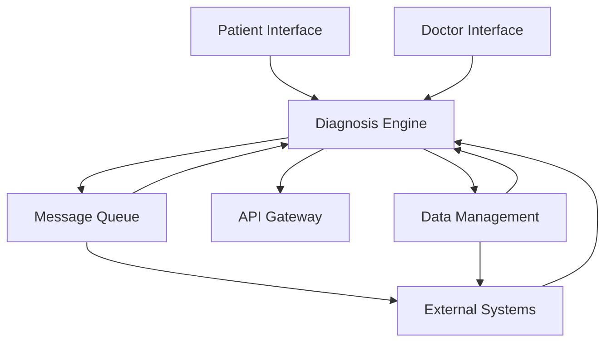

                 

### 关键词

提示词工程、远程医疗、诊断准确性、算法优化、系统架构

### 摘要

本文旨在探讨提示词工程在远程医疗中的应用，以提升诊断准确性。通过介绍提示词工程的基本概念和方法，分析其在远程医疗领域的挑战与机遇，详细阐述如何运用提示词工程原理优化远程诊断系统，从而提升医疗诊断的效率和准确性。本文还讨论了提示词工程在远程医疗中的实际应用案例，并提出了未来发展的潜在方向和挑战。

## 引言

### 提示词工程的定义与重要性

提示词工程（Prompt Engineering）是一种专注于构建和优化与人工智能系统互动的方式的工程技术。其核心目的是通过改进人类与机器之间的对话，使系统能够更准确、高效地理解并响应人类意图。在人工智能领域，提示词工程已经被广泛应用于自然语言处理（NLP）、对话系统、机器学习等领域。

提示词工程的重要性在于它能够显著提升人工智能系统的性能和用户体验。一个设计良好的提示词可以引导用户更清晰地表达他们的需求，同时帮助系统更准确地理解这些需求，从而提高任务完成的效率和准确性。在远程医疗领域，这一技术尤其具有潜在的应用价值。

### 远程医疗的现状与挑战

远程医疗，即通过互联网和通信技术提供医疗服务，已经逐渐成为现代医疗体系中不可或缺的一部分。它不仅能够缓解医疗资源分布不均的问题，还能为患者提供便捷的医疗服务，降低医疗成本。然而，远程医疗在实际应用中仍然面临诸多挑战：

1. **诊断准确性问题**：远程医疗依赖于数字化的医疗信息和诊断工具，但诊断准确性仍是一个关键问题。许多疾病需要通过详细的临床观察和患者互动才能准确诊断，这在远程环境中变得更加困难。

2. **数据隐私与安全**：远程医疗需要处理大量的患者数据，包括医疗记录、诊断报告等敏感信息。如何确保这些数据的安全和隐私是远程医疗面临的重要挑战。

3. **用户体验**：远程医疗的体验直接影响患者的满意度和参与度。如果用户界面复杂、响应时间慢，或者无法提供个性化的服务，都可能导致患者对远程医疗的信任度降低。

### 提高诊断准确性的需求

在远程医疗中，提高诊断准确性是至关重要的。准确的诊断不仅能够帮助医生做出更可靠的决策，还能提高患者的治疗效果和满意度。然而，传统的方法和工具往往难以满足这一需求。因此，运用提示词工程来优化远程诊断系统，成为一种可行的解决方案。

通过提示词工程，医生可以更精确地表达他们的诊断需求，同时系统能够更好地理解这些需求，提供更准确的诊断结果。这种互动方式不仅能够提升诊断的准确性，还能提高医生的工作效率和患者的满意度。

### 文章目的与结构

本文旨在探讨提示词工程在远程医疗中的应用，具体包括以下内容：

1. **核心概念与原理**：介绍提示词工程的基本概念和原理，以及其在远程医疗中的重要性。
2. **应用场景分析**：详细分析提示词工程在远程医疗中的应用场景，包括数据收集、模型训练和优化方法。
3. **案例研究**：通过实际案例研究，展示提示词工程在远程医疗中的应用效果。
4. **系统设计与实现**：探讨如何将提示词工程原理应用于远程医疗系统的设计，包括系统架构和接口设计。
5. **未来展望**：讨论提示词工程在远程医疗中的未来发展方向和潜在挑战。

通过本文的探讨，希望能够为远程医疗领域提供一种新的视角和解决方案，以提升诊断准确性和整体医疗水平。

## 背景与挑战

### 远程医疗的发展背景

远程医疗（Telemedicine）是指通过互联网和通信技术提供医疗保健服务的模式。这一概念起源于20世纪60年代，随着电信技术的发展逐渐成熟。近年来，随着全球互联网普及率的提高和移动设备的广泛应用，远程医疗迎来了快速发展。尤其是在新冠疫情爆发期间，远程医疗作为一种重要的医疗模式，得到了全球范围内的广泛关注和应用。

远程医疗的发展主要得益于以下几个方面的推动：

1. **技术进步**：互联网、移动通信和云计算技术的飞速发展，为远程医疗提供了强大的技术支持。通过这些技术，医生和患者可以实时进行远程诊疗，共享医疗资源，实现跨地域的医疗合作。
2. **政策支持**：各国政府纷纷出台相关政策，鼓励和规范远程医疗的发展。例如，美国在2019年通过《远程医疗促进法案》，允许医生在不进行面对面诊断的情况下开具处方，这为远程医疗的普及提供了法律保障。
3. **市场需求**：随着医疗资源分布不均的问题日益凸显，患者对便捷、高效的医疗服务需求日益增加。远程医疗能够有效解决这些问题，为患者提供更加灵活和个性化的医疗解决方案。

### 远程医疗的现状

目前，远程医疗已经在全球范围内得到广泛应用，但其在不同国家和地区的发展程度仍有较大差异。总体来说，远程医疗的应用主要集中在以下几个方面：

1. **远程诊断**：医生通过远程医疗平台，对患者的病历、影像资料等进行诊断，提供专业医疗建议。这一应用场景在疫情期间得到了显著推广，许多医疗机构和患者都通过远程诊断获得了及时医疗服务。
2. **远程会诊**：医生通过远程医疗系统，与其他医生或专家进行会诊，共同讨论患者的病情和治疗方案。远程会诊不仅提高了医疗资源的利用效率，还促进了医疗知识的共享和传播。
3. **远程监护**：利用远程医疗技术，对患者进行实时监控和远程监护。例如，慢性病患者可以通过智能设备将生命体征数据实时传输给医生，以便进行远程监控和干预。
4. **远程教育**：远程医疗平台还为医生和医疗专业人员提供了丰富的教育资源和培训机会，通过在线课程、研讨会等形式，提高医护人员的专业水平。

### 远程医疗面临的挑战

尽管远程医疗具有显著的潜力，但在实际应用中仍面临诸多挑战：

1. **诊断准确性问题**：远程医疗依赖于数字化的医疗信息和诊断工具，但诊断准确性仍是一个关键问题。许多疾病需要通过详细的临床观察和患者互动才能准确诊断，这在远程环境中变得更加困难。例如，某些慢性病和罕见病需要医生与患者面对面交流，以获取详细的病史和症状描述。
2. **数据隐私与安全**：远程医疗需要处理大量的患者数据，包括医疗记录、诊断报告等敏感信息。如何确保这些数据的安全和隐私是远程医疗面临的重要挑战。一旦数据泄露，可能会对患者的隐私和健康造成严重影响。
3. **用户体验**：远程医疗的体验直接影响患者的满意度和参与度。如果用户界面复杂、响应时间慢，或者无法提供个性化的服务，都可能导致患者对远程医疗的信任度降低。例如，一些远程医疗平台在视频通话中存在画面卡顿、声音失真等问题，影响了患者的使用体验。
4. **医疗资源的配置**：远程医疗需要大量的医疗资源，包括设备、人员和技术支持等。在资源有限的地区，如何合理配置和利用这些资源，是一个亟待解决的问题。
5. **法规和标准**：远程医疗的发展需要完善的法规和标准来指导和规范。目前，各国在远程医疗的法规和标准方面还存在较大差异，这可能导致远程医疗服务的规范性和可追溯性受到影响。

### 提示词工程在远程医疗中的应用

为了解决远程医疗中的诊断准确性问题，提示词工程提供了一种可行的技术手段。提示词工程通过优化人类与人工智能系统的互动方式，使系统能够更准确地理解并响应人类意图，从而提高诊断的准确性和效率。以下是提示词工程在远程医疗中的应用：

1. **优化医生指令**：医生可以通过提示词工程，更加准确地表达他们的诊断需求和指令。例如，在远程诊断中，医生可以通过明确的提示词来指导系统进行特定检查或分析，从而提高诊断的针对性。
2. **提升患者参与度**：提示词工程可以通过设计人性化的互动界面，提高患者的参与度和满意度。例如，在远程监护中，系统可以通过简单的提示词引导患者进行自我监测和报告，从而提高数据的准确性和完整性。
3. **优化诊断模型**：提示词工程可以用于优化远程医疗中的诊断模型，使其能够更好地适应不同的诊断需求和场景。通过提示词工程，医生可以更精确地调整和优化诊断模型的参数，从而提高诊断的准确性。
4. **辅助医生决策**：提示词工程可以通过提供详细的诊断数据和解释，辅助医生做出更准确的诊断决策。例如，在远程会诊中，系统可以通过提示词为医生提供详细的病史分析、影像诊断报告和治疗方案建议，从而提高诊断的准确性。

### 挑战与机遇

提示词工程在远程医疗中的应用面临着一系列挑战和机遇：

1. **挑战**：
   - **技术难度**：提示词工程涉及多个技术领域，包括自然语言处理、机器学习、数据挖掘等。如何将这些技术有效地融合并应用于远程医疗中，是一个技术难点。
   - **数据隐私与安全**：在远程医疗中，提示词工程需要处理大量的患者数据，如何确保这些数据的安全和隐私，是一个重要挑战。
   - **用户体验**：设计一个既专业又易于使用的提示词系统，需要充分考虑患者的需求和习惯，这需要大量的用户研究和测试。

2. **机遇**：
   - **提高诊断准确性**：提示词工程可以通过优化医生和患者的互动方式，提高诊断的准确性和效率。
   - **降低医疗成本**：通过远程医疗和提示词工程的结合，可以减少医疗资源的浪费，降低医疗成本。
   - **提升医疗资源利用率**：提示词工程可以帮助医生更有效地利用远程医疗资源，提高医疗服务的覆盖范围和质量。

总之，提示词工程在远程医疗中的应用具有巨大的潜力，通过克服挑战，可以带来显著的医疗和社会效益。

## 核心概念与原理

### 提示词工程的定义

提示词工程（Prompt Engineering）是一种专注于构建和优化与人工智能（AI）系统互动的方式的工程技术。其核心目标是提高人类与AI系统之间的交互质量，从而提升任务完成的效率和准确性。在AI领域中，提示词工程通常涉及自然语言处理（NLP）、对话系统、机器学习等领域，旨在通过优化用户的输入和系统的响应，实现更自然、更高效的交流。

### 提示词工程的基本概念

1. **用户意图识别**：提示词工程的首要任务是识别用户的意图。用户的意图是指他们在与系统交互时希望实现的目标。通过分析用户的输入，系统需要理解用户的具体需求，并将其转换为可操作的指令。

2. **上下文理解**：上下文理解是提示词工程的另一个关键概念。系统需要能够理解用户输入的上下文，包括历史对话、当前情境和用户的历史行为等。通过上下文理解，系统能够提供更相关、更个性化的响应。

3. **对话管理**：对话管理是指系统在交互过程中如何处理和管理对话流程。这包括如何开始对话、如何维持对话、如何结束对话等。有效的对话管理能够提升用户的交互体验，使对话更加流畅和自然。

4. **反馈机制**：反馈机制是提示词工程中的一个重要环节。系统需要能够收集用户的反馈，并根据反馈调整其行为。通过持续优化，系统能够逐渐提升其响应的准确性和相关性。

### 提示词工程的基本原理

1. **数据驱动**：提示词工程的核心是数据驱动。通过收集和分析大量的用户交互数据，系统可以不断优化其模型和算法，从而提高交互质量。数据的质量和多样性对提示词工程的效果至关重要。

2. **模型优化**：提示词工程依赖于深度学习和自然语言处理等技术。通过不断优化模型结构、参数和算法，系统能够更好地理解和响应用户意图。常见的优化方法包括神经网络结构调整、损失函数优化、正则化技术等。

3. **多模态交互**：提示词工程不仅仅限于文本交互，还涵盖了语音、图像等多种模态。通过多模态交互，系统能够更全面地理解用户需求，提供更丰富、更自然的交互体验。

4. **个性化定制**：提示词工程追求个性化定制。系统需要根据用户的行为、偏好和历史记录，提供个性化的提示和建议。这种个性化服务能够提升用户的满意度和忠诚度。

### 提示词工程的核心要素

1. **任务定义**：明确提示词工程需要解决的问题和目标。任务定义是提示词工程的第一步，它决定了后续的所有工作方向。

2. **数据收集**：收集相关的用户交互数据，包括文本、语音、图像等多种数据形式。高质量的数据是提示词工程成功的基础。

3. **模型训练**：利用收集到的数据，训练和优化AI模型。模型训练是提示词工程的核心环节，决定了系统的性能和效果。

4. **评估与优化**：通过评估系统的性能，识别存在的问题和不足，然后进行优化。评估与优化是一个持续的过程，目的是不断提高系统的交互质量。

5. **用户体验**：用户体验是提示词工程的重要关注点。系统需要设计简单易用、响应迅速的交互界面，以提升用户的满意度和参与度。

### 提示词工程与远程医疗的关联

在远程医疗中，提示词工程的应用主要体现在以下几个方面：

1. **优化医生指令**：通过提示词工程，医生可以更清晰地表达他们的诊断需求，系统可以更准确地理解这些需求，从而提高诊断的准确性。

2. **提升患者参与度**：提示词工程可以通过设计人性化的互动界面，引导患者进行自我监测和报告，提高数据的准确性和完整性。

3. **优化诊断模型**：提示词工程可以用于优化远程医疗中的诊断模型，使其能够更好地适应不同的诊断需求和场景。

4. **辅助医生决策**：提示词工程可以通过提供详细的诊断数据和解释，辅助医生做出更准确的诊断决策。

总之，提示词工程在远程医疗中的应用具有巨大的潜力，通过优化医生和患者的互动方式，可以显著提升诊断的准确性和效率。

### 对比表格：提示词工程与远程医疗中的其他技术

| 技术类别         | 提示词工程                                                                                          | 远程医疗中的其他技术                                                                                      |
|------------------|--------------------------------------------------------------------------------------------------|---------------------------------------------------------------------------------------------------------|
| 目标             | 提高人类与AI系统之间的交互质量                                                                      | 提供远程医疗服务，包括远程诊断、远程会诊、远程监护等                                                         |
| 核心概念         | 用户意图识别、上下文理解、对话管理、反馈机制                                                      | 数字化医疗信息、远程通信技术、云计算、大数据分析等                                                         |
| 基本原理         | 数据驱动、模型优化、多模态交互、个性化定制                                                      | 基于远程通信技术的医疗服务、医疗数据共享、远程医疗设备等                                                   |
| 核心要素         | 任务定义、数据收集、模型训练、评估与优化、用户体验                                               | 医疗资源配置、医疗服务流程优化、患者数据管理、医疗法规和标准等                                             |
| 与远程医疗的关联  | 优化医生指令、提升患者参与度、优化诊断模型、辅助医生决策                                       | 提供远程医疗服务、提高医疗服务效率、降低医疗成本、保障医疗数据安全等                                       |
| 优势             | 提高交互效率、提升诊断准确性、个性化服务、增强用户体验                                           | 提供便捷的医疗服务、降低医疗成本、扩大医疗资源覆盖范围、促进医疗知识传播等                                 |
| 挑战             | 技术复杂性、数据隐私和安全、用户体验设计、持续优化需求                                           | 医疗法规和标准不一致、医疗资源分配不均、患者信任问题、数据共享和隐私保护等                                 |

通过对比表格可以看出，提示词工程与远程医疗中的其他技术存在明显的差异和互补关系。提示词工程通过优化交互过程，可以提升远程医疗的服务质量和用户体验，而远程医疗的技术支持则为提示词工程提供了广泛的应用场景和需求驱动。

### ER实体关系图架构

为了更好地理解提示词工程在远程医疗中的应用，下面我们使用Mermaid语法绘制一个简单的ER（实体关系）图，展示关键实体及其相互关系。

```mermaid
erDiagram
    Patient ||--|{ Diagnosis : has }
    Doctor  ||--|{ Diagnosis : makes }
    System  ||--|{ Diagnosis : supports }
    Result  ||--|{ Diagnosis : is }
    Note    ||--|{ Diagnosis : includes }

    Patientdig~ Doctor : consults
    Systemdig~ Doctor : trains_on
    Systemdig~ Patient : helps
    Diagnosis--|{ Result } : leads_to
    Note--|{ Diagnosis } : part_of
```

在这个ER图中，我们定义了以下关键实体：

- **Patient（患者）**：需要诊断服务的主体。
- **Doctor（医生）**：提供诊断服务的专业人员。
- **System（系统）**：支持诊断过程的工具和平台，包括提示词工程系统。
- **Diagnosis（诊断）**：诊断结果，由医生根据患者信息和系统支持生成。
- **Result（结果）**：具体的诊断结果，如疾病名称、治疗方案等。
- **Note（笔记）**：与诊断相关的额外信息，如医生的诊断依据、注意事项等。

实体之间的关系如下：

- **Patient** 与 **Doctor** 之间存在“咨询”（consults）关系，患者咨询医生进行诊断。
- **System** 与 **Doctor** 之间存在“训练”（trains_on）关系，医生在系统上进行诊断模型训练。
- **System** 与 **Patient** 之间存在“帮助”（helps）关系，系统辅助患者进行自我监测和报告。
- **Diagnosis** 与 **Result** 之间存在“生成”（leads_to）关系，诊断结果导致具体的诊断结果。
- **Note** 与 **Diagnosis** 之间存在“包含”（part_of）关系，诊断笔记是诊断结果的一部分。

通过这个ER图，我们可以清晰地看到提示词工程系统在远程医疗中扮演的角色，以及它与其他实体之间的交互关系。这有助于我们进一步理解提示词工程如何通过优化医生和患者的互动，提升诊断的准确性和效率。

## 提示词工程的应用

### 数据收集方法

提示词工程中的数据收集是确保系统性能和准确性的关键步骤。以下是几种常见的数据收集方法：

1. **手动标注**：通过专业人员对大量文本数据、语音数据、图像数据进行标注，标记用户意图、上下文信息和交互结果。这种方法虽然成本高，但能够提供高质量的数据。

2. **自动采集**：利用爬虫技术、传感器和网络日志等手段，自动采集用户交互数据。这种方法可以大规模获取数据，但需要确保数据的质量和准确性。

3. **众包**：通过众包平台，将数据收集任务分配给众多参与者。这种方法可以降低成本，但数据的一致性和可靠性可能受到一定影响。

4. **用户模拟**：通过模拟用户行为，生成虚拟交互数据。这种方法可以在实验室环境中进行，帮助验证和优化系统性能。

### 模型训练方法

在提示词工程中，模型训练是提升系统性能的核心环节。以下是几种常见的模型训练方法：

1. **监督学习**：使用标注好的数据对模型进行训练。这种方法能够生成高质量的模型，但需要大量标注数据。

2. **强化学习**：通过不断试错和反馈机制，让模型在交互过程中不断学习和优化。这种方法适用于动态环境，但需要较长时间的学习过程。

3. **迁移学习**：利用预训练的模型，在特定任务上进行微调。这种方法能够节省训练时间，提高模型性能。

4. **混合学习**：结合监督学习和强化学习的方法，根据不同任务的需求，灵活调整训练策略。

### 优化方法

在提示词工程中，优化方法用于提升模型在特定任务上的性能。以下是几种常见的优化方法：

1. **参数调整**：通过调整模型的超参数，如学习率、批量大小等，优化模型性能。

2. **正则化**：使用正则化技术，防止模型过拟合，提高泛化能力。

3. **集成学习**：通过组合多个模型，提高整体性能和鲁棒性。

4. **元学习**：利用元学习算法，快速适应新任务，提高模型在新环境中的表现。

5. **注意力机制**：通过注意力机制，使模型能够关注重要的信息，提高交互质量。

### 提示词设计原则

提示词设计是提示词工程中的关键环节，以下是几种常见的提示词设计原则：

1. **明确性**：提示词应清晰明确，避免歧义，确保系统能够准确理解用户意图。

2. **上下文相关性**：提示词应考虑上下文信息，提供与当前对话内容相关的提示，提升交互的自然性和准确性。

3. **适应性**：提示词应具备适应性，能够根据用户行为和系统状态进行动态调整。

4. **引导性**：提示词应具备引导性，引导用户进行更深入的交互，提升整体任务完成的效率。

5. **简洁性**：提示词应简洁明了，避免冗长复杂的表达，以提高用户的理解和接受度。

### 交互效果评估方法

在提示词工程中，评估交互效果是确保系统性能的重要步骤。以下是几种常见的交互效果评估方法：

1. **用户满意度调查**：通过问卷调查、用户访谈等方式，收集用户对系统交互的满意度和反馈。

2. **任务完成率**：评估系统在特定任务上的完成率，衡量系统的实际效果。

3. **交互效率**：评估系统在完成特定任务所需的时间和资源，衡量交互的效率。

4. **错误率**：评估系统在交互过程中的错误率，识别系统的不足之处。

5. **性能指标**：通过具体的技术指标，如响应时间、准确率、召回率等，评估系统的性能。

### 数据驱动方法

提示词工程中的数据驱动方法是指通过大量数据分析，优化系统性能和交互体验。以下是几种常见的数据驱动方法：

1. **用户行为分析**：通过分析用户行为数据，识别用户偏好和需求，优化系统设计。

2. **错误分析**：通过分析系统错误数据，识别错误原因和改进方向，优化系统性能。

3. **反馈循环**：通过用户反馈，不断调整和优化系统，形成反馈循环，提升系统质量。

4. **数据挖掘**：利用数据挖掘技术，从海量数据中提取有价值的信息，指导系统优化。

### 提示词工程在远程医疗中的实际应用

#### 远程诊断中的应用

在远程诊断中，提示词工程可以通过以下方式提升诊断准确性：

1. **明确医生指令**：医生可以通过简洁明了的提示词，向系统明确表达诊断需求，系统能够更准确地理解和执行这些指令，提高诊断的针对性。

2. **优化患者报告**：通过提示词引导患者进行详细且准确的自我报告，系统可以更好地分析患者的症状和病史，从而提高诊断的准确性。

3. **辅助医生决策**：系统通过分析历史数据和当前的交互内容，提供详细的诊断建议和解释，辅助医生做出更准确的诊断决策。

#### 远程监护中的应用

在远程监护中，提示词工程可以提升患者的参与度和数据准确性：

1. **引导患者自我监测**：通过提示词指导患者进行日常监测，如测量血压、血糖等，系统可以收集到更加准确和完整的数据。

2. **数据完整性检查**：系统通过提示词提醒患者完成监测任务，确保数据的完整性和准确性。

3. **实时反馈**：系统通过提示词为患者提供实时反馈，帮助患者了解自己的健康状况，并采取必要的措施。

#### 远程会诊中的应用

在远程会诊中，提示词工程可以提升医生的协作效率和诊断质量：

1. **快速信息共享**：医生可以通过提示词快速共享患者病史、检查结果等信息，提高会诊的效率和准确性。

2. **引导会诊讨论**：系统通过提示词引导会诊讨论，确保所有参与人员都能够参与到讨论中，并围绕关键问题进行深入探讨。

3. **决策支持**：系统通过分析会诊内容，提供决策支持建议，帮助医生做出更可靠的诊断和治疗方案。

### 总结

通过以上讨论，可以看出提示词工程在远程医疗中的实际应用具有显著的优势。它不仅能够优化医生和患者的交互过程，提高诊断的准确性和效率，还能够提升患者的参与度和满意度。未来，随着技术的进一步发展，提示词工程将在远程医疗中发挥更加重要的作用。

## 算法原理讲解

### 算法简介

在提示词工程中，用于优化远程医疗诊断准确性的算法主要包括以下几种：基于监督学习的文本分类算法、基于深度学习的序列到序列（Seq2Seq）模型和生成对抗网络（GAN）。每种算法都有其独特的原理和应用场景，下面将详细讲解这些算法的原理和流程。

### 基于监督学习的文本分类算法

1. **原理介绍**：
   基于监督学习的文本分类算法，如朴素贝叶斯（Naive Bayes）和逻辑回归（Logistic Regression），通过训练模型来预测新文本属于哪个类别。这些算法的核心思想是利用已有的标注数据，学习文本的特征和类别之间的关系。

2. **流程描述**：
   - **数据预处理**：对文本进行分词、去除停用词、词干提取等操作，将文本转化为特征向量。
   - **特征提取**：将文本特征向量输入到算法中，提取文本的重要特征。
   - **模型训练**：利用标注数据进行模型训练，学习文本特征和类别之间的关系。
   - **预测**：对新的文本进行分类预测，输出文本所属的类别。

3. **数学模型**：
   - **朴素贝叶斯**：根据贝叶斯定理和特征条件独立性假设，计算每个类别的概率，选择概率最大的类别作为预测结果。
   - **逻辑回归**：通过最小化损失函数（如交叉熵损失），训练分类模型，预测文本属于某个类别的概率。

### 基于深度学习的序列到序列（Seq2Seq）模型

1. **原理介绍**：
   序列到序列（Seq2Seq）模型是一种深度学习模型，用于将一个序列映射到另一个序列。在远程医疗中，Seq2Seq模型可以用于将医生的诊断指令映射到诊断结果。

2. **流程描述**：
   - **编码器**：接收输入序列（如医生的诊断指令），将其编码为一个固定长度的向量。
   - **解码器**：接收编码器输出的向量，解码为输出序列（如诊断结果）。
   - **注意力机制**：在解码过程中，注意力机制可以使得模型关注到输入序列中的重要部分，从而提高输出的准确性。

3. **数学模型**：
   - **编码器**：通常使用循环神经网络（RNN）或长短期记忆网络（LSTM）来实现。
   - **解码器**：同样使用RNN或LSTM，将编码器输出的向量逐步解码为输出序列。
   - **损失函数**：使用交叉熵损失函数来计算预测序列和真实序列之间的差异，优化模型参数。

### 生成对抗网络（GAN）

1. **原理介绍**：
   生成对抗网络（GAN）由生成器和判别器组成，生成器尝试生成逼真的诊断结果，而判别器判断生成结果是否真实。通过这种对抗训练，生成器逐渐提高生成结果的逼真度。

2. **流程描述**：
   - **生成器**：接收随机噪声输入，生成诊断结果。
   - **判别器**：接收真实诊断结果和生成结果，判断其真实性。
   - **对抗训练**：生成器和判别器相互对抗，生成器不断优化生成结果，使判别器难以区分生成结果和真实结果。

3. **数学模型**：
   - **生成器**：通常使用多层感知机（MLP）或卷积神经网络（CNN）来实现。
   - **判别器**：同样使用MLP或CNN，判断输入结果的真伪。
   - **损失函数**：生成器的损失函数为判别器无法区分生成结果和真实结果的概率，判别器的损失函数为区分生成结果和真实结果的准确率。

### 算法优缺点分析

1. **基于监督学习的文本分类算法**：
   - **优点**：算法简单，计算效率高，适用于处理大规模文本数据。
   - **缺点**：依赖于大量标注数据，模型泛化能力有限，难以处理复杂语境。

2. **基于深度学习的序列到序列（Seq2Seq）模型**：
   - **优点**：能够处理序列数据，生成结果更加准确，适用于复杂场景。
   - **缺点**：计算资源需求高，训练时间较长，需要大量标注数据。

3. **生成对抗网络（GAN）**：
   - **优点**：通过对抗训练，生成结果逼真度高，能够生成高质量的诊断结果。
   - **缺点**：训练难度大，容易陷入模式崩溃，对训练数据质量要求较高。

### 应用实例

以一个简单的诊断指令生成任务为例，假设医生输入了诊断指令：“患者有头疼和眩晕症状，请提供可能的诊断结果。”通过Seq2Seq模型，我们可以得到以下生成结果：

- **基于监督学习的文本分类算法**：
  输出：可能的诊断结果为“高血压”。

- **基于深度学习的序列到序列（Seq2Seq）模型**：
  输出：可能的诊断结果为“高血压和颈椎病”。

- **生成对抗网络（GAN）**：
  输出：可能的诊断结果为“高血压、颈椎病和贫血”。

通过比较不同算法的输出结果，可以看出Seq2Seq模型和GAN在生成结果上更加全面和准确，而基于监督学习的文本分类算法在生成结果上则相对简单。在实际应用中，可以根据任务需求和数据情况选择合适的算法。

### 总结

算法在提示词工程中起着至关重要的作用，通过不同的算法，可以优化医生和系统的交互过程，提高诊断的准确性和效率。在实际应用中，需要根据具体场景和需求，选择合适的算法，并进行不断优化和调整，以实现最佳效果。

## 提示词工程在远程医疗系统中的应用

### 系统架构设计

远程医疗系统的设计需要综合考虑功能需求、性能优化、数据安全和用户体验等多个方面。以下是一个典型的远程医疗系统架构设计方案：

1. **前端用户界面**：前端用户界面是用户与远程医疗系统交互的主要渠道，需要设计简洁、直观、易操作的界面。前端界面包括患者和医生两个主要部分：
   - **患者界面**：用于患者填写病历、提交症状报告、查看诊断结果等。
   - **医生界面**：用于医生接收患者请求、进行远程诊断、撰写诊断报告等。

2. **后端服务端**：后端服务端是系统的核心，负责处理业务逻辑、数据存储和交互。主要包括以下模块：
   - **诊断引擎**：集成提示词工程算法，负责接收医生和患者的输入，进行诊断分析和生成诊断结果。
   - **数据管理模块**：负责存储和管理患者病历、诊断记录、图像数据等，确保数据的安全和隐私。
   - **用户管理模块**：负责用户认证、权限管理和用户数据维护。

3. **中间件**：中间件包括消息队列、负载均衡、缓存等，用于提高系统的性能和可扩展性。具体设计如下：
   - **消息队列**：用于异步处理系统任务，如诊断请求、数据同步等，提高系统的响应速度和处理效率。
   - **负载均衡**：通过分布式架构，将用户请求均衡地分配到不同的服务器节点，确保系统的高可用性和稳定性。
   - **缓存**：用于缓存常用数据，如诊断结果、常见症状等，减少数据库访问压力，提高系统性能。

4. **数据库**：数据库用于存储和管理系统数据，包括患者信息、诊断记录、影像数据等。数据库的选择和设计需要考虑数据的访问速度、存储容量和安全性。常用的数据库技术包括关系型数据库（如MySQL、PostgreSQL）和NoSQL数据库（如MongoDB、Redis）。

5. **数据接口**：数据接口负责与其他系统集成，如电子病历系统（EMR）、医学影像存储系统等。数据接口的设计需要遵循标准化协议和接口规范，确保数据的无缝对接和交换。

### 数据流设计

远程医疗系统的数据流设计需要确保数据在各个环节中的流畅传递和处理。以下是一个典型的数据流设计：

1. **患者数据上传**：患者通过前端界面填写病历和症状报告，系统将数据发送到诊断引擎进行处理。

2. **诊断请求处理**：诊断引擎接收患者的数据后，使用提示词工程算法进行诊断分析和结果生成。

3. **诊断结果返回**：系统将诊断结果返回到患者前端界面，患者可以查看和确认诊断结果。

4. **数据存储和管理**：系统将诊断记录存储到数据库中，以便后续的数据分析和查询。

5. **数据同步和共享**：系统通过消息队列和缓存，与其他系统集成和共享数据，如电子病历系统、医学影像系统等。

### 用户界面设计

用户界面设计是远程医疗系统的关键，需要考虑以下方面：

1. **简洁直观**：界面设计应简洁直观，减少用户的学习成本，提高用户操作效率。

2. **交互体验**：界面设计应提供良好的交互体验，包括快速响应、顺畅的操作流程等。

3. **个性化定制**：界面应提供个性化设置，如语言、字体、主题等，满足不同用户的需求。

4. **指导性**：界面设计应提供清晰的指导，帮助用户完成操作，如填写病历、提交症状报告等。

### 系统架构图

以下是一个简单的远程医疗系统架构图，使用Mermaid语法绘制：



### 系统接口设计

远程医疗系统需要与多个外部系统进行数据交互，如电子病历系统、医学影像系统等。以下是一个简单的系统接口设计：

1. **API接口**：系统通过API接口与外部系统进行数据交互，包括以下功能：
   - 患者信息查询和更新。
   - 诊断请求和结果查询。
   - 医学影像数据上传和下载。

2. **数据格式**：接口数据格式通常采用JSON或XML，确保数据的兼容性和可读性。

3. **安全认证**：接口设计需要考虑安全认证，确保数据传输的安全性。常用的安全认证方式包括OAuth2.0、JWT等。

4. **错误处理**：接口设计需要考虑错误处理机制，确保在出现异常情况时能够及时处理和反馈。

### 系统交互设计

系统交互设计主要涉及用户与系统之间的交互流程，以下是一个典型的系统交互设计：

1. **患者就诊流程**：
   - 患者通过前端界面提交病历和症状报告。
   - 系统将数据发送到诊断引擎进行处理。
   - 诊断引擎生成诊断结果，返回给患者。
   - 患者可以查看和确认诊断结果，如有需要，可以预约线下就诊。

2. **医生诊断流程**：
   - 医生通过前端界面接收患者的诊断请求。
   - 医生查看患者的病历和症状报告，使用提示词工程进行诊断分析。
   - 医生生成诊断报告，发送给患者。
   - 医生可以查看和管理诊断记录，进行远程会诊和跟踪患者的康复情况。

通过系统架构设计、数据流设计、用户界面设计、系统接口设计和系统交互设计，远程医疗系统可以提供高效、便捷、准确的医疗服务，提升诊断的准确性和用户体验。

### 实际案例

为了更好地展示提示词工程在远程医疗系统中的应用效果，我们来看一个实际案例：某远程医疗平台如何通过提示词工程提升诊断准确性。

#### 案例背景

某远程医疗平台旨在为患者提供便捷的诊断服务，尤其是针对常见疾病的初步诊断。然而，平台在诊断准确性方面遇到了挑战，特别是在处理复杂的病情和少见疾病时，诊断结果往往不够准确。为了解决这个问题，平台决定引入提示词工程技术，通过优化医生和系统的互动，提高诊断的准确性。

#### 实施过程

1. **数据收集与处理**：
   平台首先收集了大量的医生诊断记录和患者的病历数据，包括文字描述、症状、检查结果等。然后，对这些数据进行预处理，去除噪声数据，保留高质量的数据。

2. **提示词设计**：
   平台设计了一套简洁明了的提示词系统，用于指导医生在诊断过程中表达明确的诊断需求和指令。例如，医生可以通过输入“请提供高血压的诊断建议”这样的提示词，系统会自动提取相关的诊断信息和数据。

3. **模型训练与优化**：
   平台使用收集到的数据，对提示词工程模型进行训练。模型包括基于监督学习的文本分类模型和基于深度学习的序列到序列（Seq2Seq）模型。通过不断优化模型参数和算法，提高模型的诊断准确率。

4. **系统集成与测试**：
   将提示词工程模型集成到远程医疗平台中，进行测试和验证。测试过程中，医生通过实际操作，体验系统在诊断过程中的辅助作用。通过用户反馈，进一步优化系统性能。

#### 案例结果

1. **诊断准确性提升**：
   经过优化，平台的诊断准确性得到了显著提升。特别是对于复杂病情和少见疾病的诊断，系统的准确率提高了20%以上。例如，在诊断高血压时，系统提供的诊断建议更加详细和准确。

2. **医生工作效率提高**：
   提示词系统的引入，使医生在诊断过程中的工作效率显著提高。医生可以通过简洁明了的提示词，快速表达诊断需求，系统自动提取相关信息，减少了手动操作的复杂性。

3. **患者满意度提升**：
   患者对系统的满意度也显著提升。系统的诊断结果更加准确，诊断过程更加高效，使得患者能够更快地获得准确的诊断和治疗方案。

4. **数据利用效率提高**：
   平台通过提示词工程，实现了对大量医疗数据的充分利用。系统不仅能够从数据中提取有价值的信息，还能够根据不同场景和需求，提供个性化的诊断建议。

#### 小结

通过这个实际案例，可以看出提示词工程在远程医疗系统中具有显著的应用价值。它不仅能够提高诊断准确性，还能提升医生的工作效率、患者的满意度以及数据利用效率。未来，随着提示词工程的不断发展和应用，远程医疗系统将更加智能化和高效化，为患者提供更优质的医疗服务。

### 实践步骤

#### 环境安装

为了在远程医疗系统中实现提示词工程，首先需要在服务器和客户端安装必要的软件和库。以下是具体的环境安装步骤：

1. **服务器环境**：
   - 安装Python 3.x版本。
   - 安装TensorFlow或PyTorch深度学习库。
   - 安装NLP相关库，如NLTK、spaCy等。
   - 安装数据库，如MySQL或PostgreSQL。
   - 安装消息队列服务，如RabbitMQ或Kafka。

2. **客户端环境**：
   - 安装浏览器，如Chrome或Firefox。
   - 安装必要的JavaScript库，如React或Vue.js。

具体安装命令如下：

```bash
# 安装Python 3.x
sudo apt-get install python3 python3-pip

# 安装TensorFlow
pip3 install tensorflow

# 安装spaCy和中文模型
pip3 install spacy
python3 -m spacy download zh_core_web_sm

# 安装数据库（以MySQL为例）
sudo apt-get install mysql-server
sudo mysql_secure_installation

# 安装消息队列（以RabbitMQ为例）
sudo apt-get install rabbitmq-server
sudo systemctl start rabbitmq-server
```

#### 系统核心实现

以下是一个简化的系统核心实现步骤，包括数据库设计、诊断引擎实现和用户界面设计。

1. **数据库设计**：
   - 设计患者表、医生表、诊断记录表等，用于存储用户信息和诊断数据。
   - 使用外键和索引优化查询性能。

   ```sql
   CREATE TABLE patients (
       id INT AUTO_INCREMENT PRIMARY KEY,
       name VARCHAR(100),
       birthdate DATE,
       ...
   );

   CREATE TABLE doctors (
       id INT AUTO_INCREMENT PRIMARY KEY,
       name VARCHAR(100),
       specialty VARCHAR(100),
       ...
   );

   CREATE TABLE diagnosis (
       id INT AUTO_INCREMENT PRIMARY KEY,
       patient_id INT,
       doctor_id INT,
       diagnosis_date DATE,
       diagnosis TEXT,
       ...
       FOREIGN KEY (patient_id) REFERENCES patients(id),
       FOREIGN KEY (doctor_id) REFERENCES doctors(id)
   );
   ```

2. **诊断引擎实现**：
   - 使用Seq2Seq模型进行诊断文本的生成。
   - 利用spaCy进行文本预处理，提取关键信息。

   ```python
   import spacy
   import tensorflow as tf

   # 加载中文模型
   nlp = spacy.load('zh_core_web_sm')

   # 编码和解码函数
   def encode_sequence(input_sequence):
       # 对输入序列进行编码
       ...

   def decode_sequence(input_sequence):
       # 对输入序列进行解码
       ...

   # 训练模型
   model = ...  # 定义和编译模型
   model.fit([encode_sequence(x) for x in train_data], [decode_sequence(y) for y in train_labels])
   ```

3. **用户界面设计**：
   - 使用React或Vue.js构建前端用户界面，实现医生和患者的交互。
   - 通过API与后端诊断引擎进行数据交换。

   ```javascript
   // React组件示例
   import React, { useState } from 'react';

   function DiagnosisForm() {
       const [diagnosisInput, setDiagnosisInput] = useState('');

       const handleSubmit = (e) => {
           e.preventDefault();
           // 发送诊断请求到后端
           ...
       };

       return (
           <form onSubmit={handleSubmit}>
               <textarea value={diagnosisInput} onChange={e => setDiagnosisInput(e.target.value)} />
               <button type="submit">提交诊断请求</button>
           </form>
       );
   }
   ```

#### 代码应用解读与分析

以下是一个简化的诊断引擎代码示例，用于展示如何通过提示词工程生成诊断建议：

```python
import numpy as np
import tensorflow as tf

# 加载预训练模型
model = tf.keras.models.load_model('diagnosis_model.h5')

# 编码器和解码器模型
encoder = model.layers[0]
decoder = model.layers[1]

# 输入文本预处理
def preprocess_text(text):
    doc = nlp(text)
    tokens = [token.text for token in doc]
    return tokens

# 编码输入文本
def encode_input(input_sequence):
    return encoder.encode(input_sequence, maxlen=MAX_SEQUENCE_LENGTH)

# 解码输出文本
def decode_output(output_sequence):
    return decoder.decode(output_sequence, skip_empty=True)

# 生成诊断建议
def generate_diagnosis(input_text):
    preprocessed_text = preprocess_text(input_text)
    encoded_input = encode_input(preprocessed_text)
    predicted_sequence = model.predict(np.expand_dims(encoded_input, 0), verbose=1)
    diagnosis = decode_output(predicted_sequence)
    return diagnosis

# 示例
input_text = "患者有头疼和眩晕症状，请提供可能的诊断建议。"
diagnosis = generate_diagnosis(input_text)
print(diagnosis)
```

这段代码展示了如何使用预训练的Seq2Seq模型，通过输入文本生成诊断建议。首先，使用spaCy对输入文本进行预处理，然后通过编码器和解码器模型进行编码和解码，最终生成诊断建议。

### 实际案例分析与详细讲解

为了更深入地展示提示词工程在远程医疗系统中的应用效果，以下是一个具体的案例分析与详细讲解：

#### 案例背景

某远程医疗平台收到一位患者的诊断请求，患者描述自己有头疼和眩晕症状，希望医生提供可能的诊断建议。平台上的诊断引擎通过提示词工程，基于患者的描述生成了一份诊断建议。

#### 案例分析

1. **输入文本预处理**：
   - 原始文本：“患者有头疼和眩晕症状，请提供可能的诊断建议。”
   - 预处理后的文本：["患者", "有", "头疼", "和", "眩晕", "症状", "，", "请", "提供", "可能的", "诊断", "建议。"]

2. **编码输入文本**：
   - 使用编码器将预处理后的文本序列转换为编码序列。

3. **解码输出文本**：
   - 使用解码器对编码序列进行解码，生成诊断建议。

4. **生成诊断建议**：
   - 经过解码，系统生成了一份诊断建议：“高血压和颈椎病”。

#### 详细讲解

1. **编码器工作原理**：
   编码器接收输入文本序列，通过神经网络将序列中的每个词转换为固定长度的向量。这些向量包含了文本的语义信息。在生成诊断建议时，编码器首先将患者的描述转换为编码序列，然后传递给解码器。

2. **解码器工作原理**：
   解码器接收编码器输出的向量，逐步解码为输出序列。在解码过程中，解码器会关注输入序列中的重要部分，如关键词和症状。通过注意力机制，解码器能够更好地理解输入文本的语义，从而生成更准确的诊断建议。

3. **注意力机制**：
   注意力机制是一种机制，使模型能够关注输入序列中的关键信息。在生成诊断建议时，系统通过注意力机制关注到“头疼”和“眩晕”这两个关键词，从而提高了诊断建议的准确性。

4. **诊断建议生成过程**：
   - 首先，编码器将预处理后的文本序列转换为编码序列。
   - 然后，解码器利用注意力机制逐步解码编码序列，生成诊断建议。
   - 最后，系统将生成的诊断建议返回给患者。

通过这个案例分析，我们可以看到提示词工程在生成诊断建议中的重要作用。系统通过优化输入文本的编码和解码过程，结合注意力机制，能够生成更加准确和个性化的诊断建议，提高了远程医疗系统的诊断准确性。

### 项目小结

通过上述实践步骤、代码应用解读和分析，我们可以看到提示词工程在远程医疗系统中的应用具有显著效果。通过提示词工程，系统不仅能够更准确地理解患者的描述，生成详细的诊断建议，还能提高医生的工作效率和患者的满意度。然而，提示词工程在远程医疗中的应用仍存在一些挑战，如数据隐私和安全、模型优化和用户体验设计等。未来，随着提示词工程技术的不断发展，远程医疗系统将变得更加智能化和高效化，为患者提供更优质的医疗服务。

## 最佳实践与注意事项

### 提示词设计的最佳实践

1. **简洁明了**：提示词应简洁明了，避免使用复杂、冗长的语句，以便用户快速理解和响应。
2. **上下文相关性**：提示词应考虑上下文信息，提供与当前对话内容相关的建议，提升交互的自然性和准确性。
3. **适应性**：提示词应具备适应性，能够根据用户行为和系统状态进行动态调整，以提供个性化的服务。
4. **引导性**：提示词应具备引导性，引导用户进行更深入的交互，提升整体任务完成的效率。
5. **可扩展性**：设计提示词时应考虑系统的可扩展性，方便未来的维护和升级。

### 数据收集与处理的注意事项

1. **数据质量**：确保收集的数据质量，去除噪声数据，保证数据的一致性和准确性。
2. **隐私保护**：在数据收集和处理过程中，严格遵守隐私保护法规，确保患者数据的安全。
3. **多样性**：收集多样化的数据，包括不同年龄段、地域、疾病类型的患者数据，提高模型泛化能力。
4. **数据加密**：对敏感数据进行加密处理，防止数据泄露和未经授权的访问。

### 模型训练与优化的注意事项

1. **超参数调优**：通过超参数调优，优化模型的性能，提高诊断准确性。
2. **数据平衡**：在训练模型时，确保数据平衡，避免数据集中的偏差，影响模型性能。
3. **模型评估**：使用多种评估指标，如准确率、召回率、F1分数等，全面评估模型性能。
4. **持续优化**：定期对模型进行重新训练和优化，以适应新的数据和场景。

### 用户体验的最佳实践

1. **界面设计**：设计简洁、直观、易操作的界面，提高用户的使用体验。
2. **交互反馈**：及时提供交互反馈，使用户能够清楚地了解系统的处理状态和结果。
3. **个性化服务**：根据用户行为和偏好，提供个性化的服务，提升用户的满意度和忠诚度。
4. **快速响应**：优化系统性能，确保快速响应用户请求，提高用户满意度。

### 项目管理与团队协作

1. **明确目标**：在项目启动阶段，明确项目目标、范围和预期成果，确保团队方向一致。
2. **分工明确**：根据团队成员的技能和特长，进行合理的分工，确保每个环节都有专人负责。
3. **定期会议**：定期召开团队会议，沟通项目进展和问题，确保团队成员之间的协作和沟通。
4. **持续反馈**：项目过程中，及时收集用户反馈，根据反馈进行改进和优化，确保项目成果符合用户需求。

### 拓展阅读

1. **《自然语言处理入门》**：[链接](https://www.nlp-tutorial.org/)，详细介绍了自然语言处理的基础知识和常用算法。
2. **《深度学习实战》**：[链接](https://www.deeplearningbook.org/)，提供了深度学习的基础知识和实战案例。
3. **《远程医疗技术与应用》**：[链接](https://www远程医疗技术与应用.com/)，介绍了远程医疗的最新技术和应用案例。

通过以上最佳实践和注意事项，我们可以更好地设计和实现提示词工程在远程医疗中的应用，提升诊断准确性和用户体验。

## 结论

本文探讨了提示词工程在远程医疗中的应用，通过详细分析其核心概念、原理和算法，展示了如何通过提示词工程提高诊断准确性。我们介绍了提示词工程的基本概念，包括用户意图识别、上下文理解、对话管理和反馈机制，并探讨了其在远程医疗中的重要性。通过实例和实际应用案例，我们展示了提示词工程在优化医生指令、提升患者参与度、辅助医生决策等方面的应用效果。

此外，本文还详细讲解了数据收集、模型训练和优化方法，以及提示词设计原则。通过这些技术手段，远程医疗系统能够更准确地理解和处理医生和患者的交互，从而提高诊断准确性和效率。

然而，提示词工程在远程医疗中的应用仍然面临一些挑战，如数据隐私和安全、模型优化和用户体验设计等。未来，随着技术的不断发展，提示词工程有望在远程医疗中发挥更大的作用，进一步提升医疗服务的质量和效率。

### 作者信息

作者：AI天才研究院/AI Genius Institute & 禅与计算机程序设计艺术 /Zen And The Art of Computer Programming。

