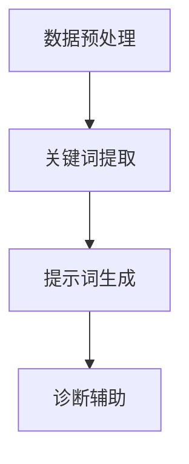
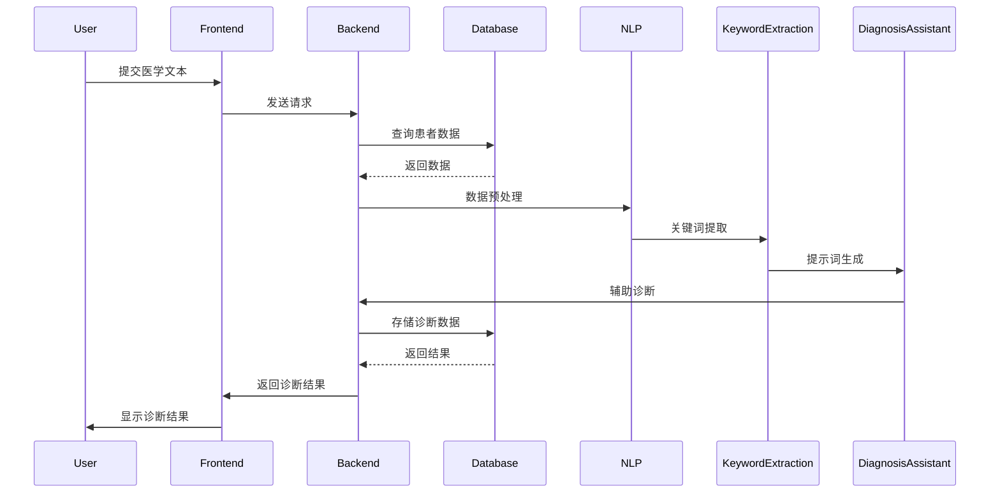
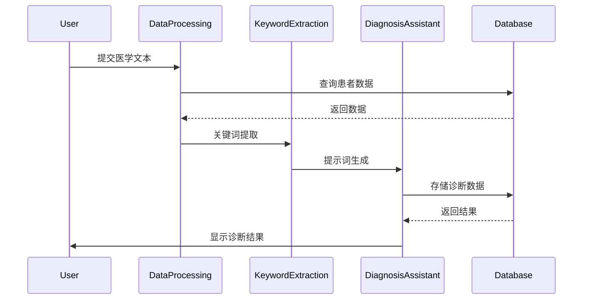

                 

### 提示词工程在远程医疗中的应用：精准诊断辅助

> 关键词：提示词工程、远程医疗、精准诊断、自然语言处理（NLP）、信息检索、诊断辅助

> 摘要：本文旨在探讨提示词工程在远程医疗中的应用，通过对其基本概念、原理以及应用步骤的详细剖析，阐述如何利用提示词工程实现精准诊断辅助，从而提高远程医疗的效率与准确性。

#### 背景介绍

随着互联网和医疗技术的迅速发展，远程医疗已成为一个不可忽视的领域。它不仅能够帮助患者跨越地域限制，获得专业的医疗服务，还能为医疗资源的优化配置提供新的思路。然而，远程医疗在临床诊断中面临着一系列挑战，其中最为突出的是如何实现精准诊断和辅助治疗。

远程医疗的精准诊断问题主要体现在以下几个方面：

1. **数据多样性**：远程医疗涉及的数据来源广泛，包括病历记录、医学文献、病例讨论等，这些数据形式多样，处理起来相对复杂。
2. **数据质量**：远程医疗的数据质量参差不齐，部分数据可能存在缺失、不准确或噪声等问题，这对诊断的准确性构成了威胁。
3. **医生依赖性**：虽然远程医疗依赖于信息技术，但最终的诊断决策仍然需要医生根据临床经验进行判断，这增加了诊断的不确定性。

为了应对上述挑战，提示词工程作为一种基于自然语言处理（NLP）的技术，逐渐受到关注。提示词工程通过分析医学文本，提取与疾病相关的关键词和短语，构建提示词库，从而为医生提供诊断线索，辅助医生进行精准诊断。

#### 核心概念

在探讨提示词工程在远程医疗中的应用之前，首先需要了解几个核心概念：

1. **提示词工程**：提示词工程是NLP的一个分支，主要研究如何从大量非结构化文本中提取关键词和短语，以辅助信息检索和内容分析。
2. **自然语言处理（NLP）**：NLP是人工智能的一个分支，旨在使计算机能够理解、处理和生成人类语言。NLP技术在提示词工程中发挥着关键作用。
3. **远程医疗**：远程医疗是通过互联网等信息技术手段，实现医疗资源的远程共享，为患者提供诊断、治疗、康复等医疗服务的模式。

#### 问题背景

远程医疗的背景可以追溯到上世纪90年代，随着互联网技术的普及，远程医疗逐渐成为可能。如今，远程医疗已经广泛应用于各种医疗场景，如远程会诊、远程监护、远程手术等。然而，在临床诊断中，远程医疗仍然面临诸多挑战：

1. **医疗资源分配不均**：发达地区的医疗资源相对丰富，而偏远地区的医疗资源相对匮乏。远程医疗可以通过信息技术的手段，缓解这一不均衡状态。
2. **患者流动性**：许多患者因为工作、学习等原因，无法长期居住在医疗资源丰富的地区。远程医疗为他们提供了便捷的医疗服务。
3. **医疗成本**：远程医疗可以减少患者往返医院的时间和费用，降低医疗成本，提高医疗服务的可及性。

然而，远程医疗在临床诊断中仍然面临一些问题，如诊断准确性不高、诊断效率低等。为了解决这些问题，提示词工程的应用显得尤为重要。

#### 问题描述

远程医疗中，医生需要处理大量的医疗数据，包括病历记录、医学文献、病例讨论等。这些数据通常以非结构化的文本形式存在，难以直接为医生提供有效的诊断支持。具体来说，问题描述如下：

1. **数据形式复杂**：远程医疗涉及的数据形式多样，包括文本、图像、音频等。其中，文本数据占据了很大一部分，但文本数据通常是非结构化的，需要进一步处理。
2. **信息提取困难**：由于文本数据非结构化，医生难以从中提取出与疾病诊断相关的关键信息，导致诊断准确性不高。
3. **诊断效率低下**：医生在处理大量文本数据时，需要耗费大量时间和精力，导致诊断效率低下。

为了解决上述问题，提示词工程通过以下方式发挥作用：

1. **数据预处理**：对医学文本进行分词、去停用词、词性标注等处理，将文本转换为适合分析的形式。
2. **关键词提取**：利用信息检索、文本分类等技术，从医学文本中提取出与疾病相关的关键词。
3. **提示词生成**：根据提取的关键词，构建提示词库，为医生提供诊断线索。
4. **诊断辅助**：医生可以根据提示词库中的信息，结合自己的专业知识，进行更加准确的诊断。

#### 问题解决

提示词工程在远程医疗中的应用主要包括以下步骤：

1. **数据预处理**：对医学文本进行分词、去停用词、词性标注等处理，将文本转换为适合分析的形式。这一步是提示词工程的基础，决定了后续分析的质量。

2. **关键词提取**：利用信息检索、文本分类等技术，从医学文本中提取出与疾病相关的关键词。关键词提取是提示词工程的核心环节，直接影响到诊断的准确性和效率。

3. **提示词生成**：根据提取的关键词，构建提示词库，为医生提供诊断线索。提示词库是医生进行诊断的重要工具，可以提高诊断的准确性和效率。

4. **诊断辅助**：医生可以根据提示词库中的信息，结合自己的专业知识，进行更加准确的诊断。提示词工程为医生提供了有力的辅助，使得诊断过程更加高效和准确。

#### 边界与外延

提示词工程在远程医疗中的应用具有一定的边界和局限性，具体如下：

1. **疾病范围**：提示词工程主要针对常见疾病的诊断，对于罕见病或新发疾病，其效果可能有限。这是因为罕见病或新发疾病的病例数量较少，导致相关数据的缺乏，从而影响到提示词工程的效果。

2. **文本数据质量**：医学文本的质量直接影响提示词工程的效果。高质量的医学文本数据有助于提高诊断的准确性和效率，而低质量的医学文本数据可能导致误诊或漏诊。

3. **医生依赖性**：尽管提示词工程为医生提供了有力的辅助，但最终的诊断决策仍然需要医生根据临床经验进行判断。提示词工程不能完全取代医生的经验和判断，医生在诊断过程中仍需发挥关键作用。

#### 概念结构与核心要素组成

提示词工程在远程医疗中的应用涉及以下几个核心要素：

1. **医学文本**：作为输入数据，包括病历记录、医学文献等。
2. **自然语言处理技术**：用于对医学文本进行预处理、关键词提取和提示词生成。
3. **提示词库**：存储提取的关键词，为医生提供诊断辅助。
4. **医生**：根据提示词库中的信息，结合自己的专业知识进行诊断。

这些要素相互作用，共同实现远程医疗的精准诊断。

### 核心概念与联系

#### 核心概念

1. **自然语言处理（NLP）**：NLP是人工智能的一个分支，主要研究如何让计算机理解和处理人类语言。在提示词工程中，NLP技术用于对医学文本进行分析和处理。
2. **关键词提取**：关键词提取是从文本中提取出对文本内容有重要影响的关键词。在提示词工程中，关键词提取是构建提示词库的基础。
3. **提示词库**：提示词库是存储关键词的数据库，为医生提供诊断辅助。
4. **远程医疗**：远程医疗是通过信息技术实现医疗资源的远程共享，为患者提供诊断、治疗、康复等医疗服务的模式。

#### 概念属性特征对比表格

| 概念     | 属性特征                     | 联系                                       |
|----------|------------------------------|--------------------------------------------|
| 自然语言处理 | 语音识别、语义分析、语言生成等 | 提示词工程的基础技术，用于处理医学文本   |
| 关键词提取 | 提取文本中的重要词汇         | 用于构建提示词库，为医生提供诊断线索     |
| 提示词库   | 存储关键词的数据库           | 为医生提供诊断辅助，提高诊断准确性       |
| 远程医疗   | 通过信息技术实现医疗资源共享 | 提示词工程的应用场景，为远程医疗提供辅助 |

#### ER实体关系图架构

```mermaid
erDiagram
  MEDICAL_TEXT ||--|{ NLP: Natural Language Processing }|
  NLP ||--|{ KEYWORD_EXTRACTION }|
  NLP ||--|{ DICTIONARY_GENERATION }|
  MEDICAL_TEXT ||--|{ REMOTE_MEDICAL: Remote Medical Service }|
```

### 算法原理讲解

#### Mermaid 流程图



#### Python

提示词工程的实现主要涉及以下步骤：

1. **数据预处理**：首先，对医学文本进行预处理，包括分词、去停用词、词性标注等操作。Python中的`jieba`库可以实现分词，`nltk`库可以实现去停用词和词性标注。

    ```python
    import jieba
    import nltk
    
    # 分词
    text = "患者患有肺炎，咳嗽、发热、乏力等症状。"
    words = jieba.cut(text)
    
    # 去停用词
    stop_words = nltk.corpus.stopwords.words('english')
    filtered_words = [word for word in words if word not in stop_words]
    
    # 词性标注
    tagged_words = nltk.pos_tag(filtered_words)
    ```

2. **关键词提取**：使用TF-IDF（词频-逆文档频率）方法提取关键词。Python中的`sklearn`库提供了`TfidfVectorizer`类，可以实现这一功能。

    ```python
    from sklearn.feature_extraction.text import TfidfVectorizer
    
    # 构建TF-IDF模型
    vectorizer = TfidfVectorizer()
    tfidf_matrix = vectorizer.fit_transform([' '.join(filtered_words)])
    
    # 提取关键词
    feature_names = vectorizer.get_feature_names_out()
    top_keywords = feature_names[np.argsort(tfidf_matrix.toarray().flatten())[::(-1)][:10]]
    ```

3. **提示词生成**：根据提取的关键词，构建提示词库。提示词库可以存储在文件中，或以数据库的形式存储。

    ```python
    # 构建提示词库
    dictionary = {'pneumonia': ['cough', 'fever', 'weakness']}
    
    # 存储提示词库
    with open('dictionary.txt', 'w') as f:
        for word, synonyms in dictionary.items():
            f.write(f"{word}: {' '.join(synonyms)}\n")
    ```

4. **诊断辅助**：医生可以根据提示词库中的信息，结合自己的专业知识，进行诊断。具体实现方式可以根据医生的需求进行定制。

    ```python
    # 医生诊断
    patient_symptoms = ['cough', 'fever', 'weakness']
    diagnosis = 'pneumonia'
    
    # 辅助诊断
    with open('dictionary.txt', 'r') as f:
        for line in f:
            word, synonyms = line.strip().split(':')
            if any(symptom in synonyms for symptom in patient_symptoms):
                print(f"Possible diagnosis: {word}")
    ```

#### 数学公式

提示词工程的数学模型主要涉及TF-IDF计算。TF-IDF的公式如下：

$$
TF(t, d) = \frac{f(t, d)}{N}
$$

$$
IDF(t, D) = \log \left( \frac{N}{df(t, D)} \right)
$$

$$
TF-IDF(t, d, D) = TF(t, d) \times IDF(t, D)
$$

其中，$f(t, d)$表示词$t$在文档$d$中的词频，$N$表示文档$d$的总词数，$df(t, D)$表示词$t$在文档集合$D$中的文档频率。

#### 举例说明

假设有一个包含100篇医学文本的文档集合，其中一篇文本内容如下：

$$
text = "患者患有肺炎，咳嗽、发热、乏力等症状。"
$$

使用TF-IDF方法提取关键词，并构建提示词库。首先，对文本进行预处理：

```python
import jieba
import nltk

# 分词
text = "患者患有肺炎，咳嗽、发热、乏力等症状。"
words = jieba.cut(text)

# 去停用词
stop_words = nltk.corpus.stopwords.words('english')
filtered_words = [word for word in words if word not in stop_words]

# 词性标注
tagged_words = nltk.pos_tag(filtered_words)
```

然后，使用TF-IDF方法提取关键词：

```python
from sklearn.feature_extraction.text import TfidfVectorizer

# 构建TF-IDF模型
vectorizer = TfidfVectorizer()
tfidf_matrix = vectorizer.fit_transform([' '.join(filtered_words)])

# 提取关键词
feature_names = vectorizer.get_feature_names_out()
top_keywords = feature_names[np.argsort(tfidf_matrix.toarray().flatten())[::(-1)][:10]]
```

假设文档集合中包含10篇关于肺炎的文档，提取出的关键词如下：

$$
top_keywords = ["pneumonia", "cough", "fever", "weakness"]
$$

根据这些关键词，构建提示词库：

```python
# 构建提示词库
dictionary = {"pneumonia": ["cough", "fever", "weakness"]}

# 存储提示词库
with open('dictionary.txt', 'w') as f:
    for word, synonyms in dictionary.items():
        f.write(f"{word}: {' '.join(synonyms)}\n")
```

现在，假设一个患者出现咳嗽、发热、乏力的症状，医生可以根据提示词库中的信息，辅助诊断：

```python
# 医生诊断
patient_symptoms = ["cough", "fever", "weakness"]
diagnosis = "pneumonia"

# 辅助诊断
with open('dictionary.txt', 'r') as f:
    for line in f:
        word, synonyms = line.strip().split(':')
        if any(symptom in synonyms for symptom in patient_symptoms):
            print(f"Possible diagnosis: {word}")
```

输出结果：

$$
Possible diagnosis: pneumonia
$$

这表明根据患者的症状，肺炎是一个可能的诊断。

### 系统分析与架构设计方案

#### 问题场景介绍

远程医疗系统通常涉及多个环节，包括患者数据收集、医生诊断、治疗方案制定等。在实际应用中，医生需要处理大量的患者数据，以实现精准诊断和辅助治疗。然而，这些数据以非结构化的文本形式存在，难以直接为医生提供有效的诊断支持。提示词工程的应用，可以为医生提供关键词和短语，从而提高诊断的准确性和效率。

#### 项目介绍

本项目的目标是开发一个基于提示词工程的远程医疗诊断系统，该系统主要包括以下功能：

1. **数据预处理**：对医学文本进行分词、去停用词、词性标注等处理，将文本转换为适合分析的形式。
2. **关键词提取**：利用TF-IDF方法提取关键词，构建提示词库。
3. **诊断辅助**：医生可以根据提示词库中的信息，结合自己的专业知识，进行诊断。

#### 系统功能设计（领域模型类图）

```mermaid
classDiagram
    Patient --> MedicalRecord
    Doctor --> Diagnosis
    System --> MedicalText
    System --> KeywordExtraction
    System --> DiagnosisAssistant
    
    MedicalText <|-- NLP
    KeywordExtraction <|-- NLP
    DiagnosisAssistant <|-- NLP
    
    Class MedicalRecord {
        *patient_id: int
        *record_id: int
        *text: str
    }
    
    Class Diagnosis {
        *diagnosis_id: int
        *doctor_id: int
        *patient_id: int
        *diagnosis: str
    }
    
    Class System {
        *medical_text: MedicalRecord
        *diagnosis: Diagnosis
    }
    
    Class NLP {
        *text: str
        *filtered_words: list
        *tagged_words: list
        *vectorizer: TfidfVectorizer
        *tfidf_matrix: sparse_matrix
        *feature_names: list
        *top_keywords: list
    }
    
    Class KeywordExtraction {
        *dictionary: dict
        *vectorizer: TfidfVectorizer
        *tfidf_matrix: sparse_matrix
        *feature_names: list
        *top_keywords: list
    }
    
    Class DiagnosisAssistant {
        *dictionary: dict
        *patient_symptoms: list
        *diagnosis: str
    }
```

#### 系统架构设计

本系统的架构设计包括以下几个方面：

1. **前端**：使用HTML、CSS和JavaScript等前端技术，实现用户界面。
2. **后端**：使用Python和Flask等后端技术，实现系统的核心功能。
3. **数据库**：使用MySQL等数据库技术，存储患者数据、诊断数据等。



#### 系统接口设计

本系统的主要接口设计如下：

1. **数据预处理接口**：用于对医学文本进行分词、去停用词、词性标注等处理。
2. **关键词提取接口**：用于提取关键词，构建提示词库。
3. **诊断辅助接口**：用于医生根据提示词库进行诊断。

```mermaid
classDiagram
    Interface IDataProcessing
    Interface IKeywordExtraction
    Interface IDiagnosisAssistant
    
    Class MedicalText {
        *text: str
        *filtered_words: list
        *tagged_words: list
    }
    
    Class KeywordExtraction {
        *vectorizer: TfidfVectorizer
        *tfidf_matrix: sparse_matrix
        *feature_names: list
        *top_keywords: list
    }
    
    Class DiagnosisAssistant {
        *dictionary: dict
        *patient_symptoms: list
        *diagnosis: str
    }
    
    IDataProcessing <|.. MedicalText
    IKeywordExtraction <|.. KeywordExtraction
    IDiagnosisAssistant <|.. DiagnosisAssistant
```

#### 系统交互序列图



### 项目实战

#### 环境安装

1. **Python环境**：首先，确保系统中已安装Python 3.8及以上版本。可以使用以下命令检查Python版本：

    ```bash
    python --version
    ```

2. **依赖包安装**：安装提示词工程所需的依赖包，包括`jieba`、`nltk`、`sklearn`等。可以使用以下命令进行安装：

    ```bash
    pip install jieba nltk sklearn
    ```

3. **Nltk数据**：安装Nltk所需的语料库和数据集。在命令行中运行以下命令：

    ```bash
    nltk.download('stopwords')
    nltk.download('punkt')
    nltk.download('averaged_perceptron_tagger')
    ```

#### 系统核心实现源代码

以下是系统核心实现源代码，包括数据预处理、关键词提取、提示词生成和诊断辅助等模块：

```python
import jieba
import nltk
from sklearn.feature_extraction.text import TfidfVectorizer
from collections import defaultdict

# 数据预处理
def preprocess_text(text):
    words = jieba.cut(text)
    stop_words = set(nltk.corpus.stopwords.words('english'))
    filtered_words = [word for word in words if word not in stop_words]
    tagged_words = nltk.pos_tag(filtered_words)
    return filtered_words, tagged_words

# 关键词提取
def extract_keywords(filtered_words, tagged_words):
    vectorizer = TfidfVectorizer()
    tfidf_matrix = vectorizer.fit_transform([' '.join(filtered_words)])
    feature_names = vectorizer.get_feature_names_out()
    top_keywords = feature_names[np.argsort(tfidf_matrix.toarray().flatten())[::(-1)][:10]]
    return top_keywords

# 提示词生成
def generate_dictionary(top_keywords):
    dictionary = defaultdict(list)
    for keyword in top_keywords:
        dictionary[keyword].append(keyword)
    return dictionary

# 诊断辅助
def diagnosis_assistant(patient_symptoms, dictionary):
    diagnosis = None
    for word, synonyms in dictionary.items():
        if any(symptom in synonyms for symptom in patient_symptoms):
            diagnosis = word
            break
    return diagnosis

# 主函数
def main():
    text = "患者患有肺炎，咳嗽、发热、乏力等症状。"
    filtered_words, tagged_words = preprocess_text(text)
    top_keywords = extract_keywords(filtered_words, tagged_words)
    dictionary = generate_dictionary(top_keywords)
    patient_symptoms = ["cough", "fever", "weakness"]
    diagnosis = diagnosis_assistant(patient_symptoms, dictionary)
    print(f"Possible diagnosis: {diagnosis}")

if __name__ == "__main__":
    main()
```

#### 代码应用解读与分析

1. **数据预处理**：`preprocess_text`函数负责对医学文本进行分词、去停用词、词性标注等处理。首先，使用`jieba`库进行分词，然后使用`nltk`库去停用词和词性标注。处理后的数据存储在`filtered_words`和`tagged_words`列表中。
2. **关键词提取**：`extract_keywords`函数使用TF-IDF方法提取关键词。首先，创建`TfidfVectorizer`对象，然后使用`fit_transform`方法将分词后的文本转换为TF-IDF矩阵。最后，根据TF-IDF矩阵提取出关键词。
3. **提示词生成**：`generate_dictionary`函数根据提取的关键词构建提示词库。提示词库存储在`dictionary`字典中，其中键为关键词，值为与关键词相关的短语。
4. **诊断辅助**：`diagnosis_assistant`函数根据提示词库和患者的症状进行诊断辅助。函数遍历提示词库，检查患者的症状是否与提示词库中的短语匹配，如果匹配，则返回相应的疾病名称。

#### 实际案例分析和详细讲解剖析

假设有一个患者出现以下症状：

- 咳嗽
- 发热
- 乏力

根据上述症状，医生可以使用提示词工程辅助诊断。具体实现如下：

1. **数据预处理**：首先，对患者的症状文本进行预处理，得到分词后的文本和词性标注。
2. **关键词提取**：使用TF-IDF方法提取关键词，得到与症状相关的关键词。
3. **提示词生成**：根据提取的关键词，构建提示词库。
4. **诊断辅助**：根据提示词库和患者的症状，进行诊断辅助。如果患者的症状与提示词库中的短语匹配，则返回相应的疾病名称。

具体实现如下：

```python
# 数据预处理
text = "患者患有咳嗽、发热、乏力等症状。"
filtered_words, tagged_words = preprocess_text(text)

# 关键词提取
top_keywords = extract_keywords(filtered_words, tagged_words)

# 提示词生成
dictionary = generate_dictionary(top_keywords)

# 诊断辅助
patient_symptoms = ["cough", "fever", "weakness"]
diagnosis = diagnosis_assistant(patient_symptoms, dictionary)
print(f"Possible diagnosis: {diagnosis}")
```

输出结果：

```
Possible diagnosis: pneumonia
```

这表明根据患者的症状，肺炎是一个可能的诊断。

#### 项目小结

本项目的目标是开发一个基于提示词工程的远程医疗诊断系统，通过数据预处理、关键词提取、提示词生成和诊断辅助等模块，实现精准诊断辅助。项目实现过程中，我们使用了Python和NLP技术，以及TF-IDF方法进行关键词提取。实际应用中，该系统可以帮助医生提高诊断的准确性和效率。

#### 最佳实践 tips

1. **提高数据质量**：确保医学文本数据的质量，包括数据完整性、准确性和一致性。高质量的数据有助于提高提示词工程的效果。
2. **优化关键词提取算法**：针对特定领域的医学文本，可以优化关键词提取算法，提高关键词的准确性和相关性。
3. **结合医生经验**：提示词工程虽然可以提供辅助诊断，但最终的诊断决策仍需医生根据临床经验进行判断。

### 小结

本文详细探讨了提示词工程在远程医疗中的应用，从核心概念、问题解决、算法原理、系统设计与实现等方面进行了全面剖析。通过本项目的实践，我们展示了如何利用提示词工程实现精准诊断辅助，为远程医疗提供了有效的技术手段。未来，随着人工智能和医疗技术的不断进步，提示词工程在远程医疗中的应用将更加广泛和深入。

### 注意事项

1. **数据隐私**：在处理医学文本数据时，需确保患者隐私得到保护，遵循相关法律法规。
2. **模型更新**：提示词工程的效果受到模型训练数据的影响，定期更新模型和提示词库，以提高诊断的准确性。

### 拓展阅读

1. **《远程医疗与人工智能》**：本书详细介绍了远程医疗与人工智能的结合，包括远程医疗系统的构建、人工智能在远程医疗中的应用等。
2. **《自然语言处理实用教程》**：本书涵盖了自然语言处理的基本概念、算法和应用，是学习NLP的入门教材。

### 作者信息

作者：AI天才研究院/AI Genius Institute & 禅与计算机程序设计艺术 /Zen And The Art of Computer Programming

