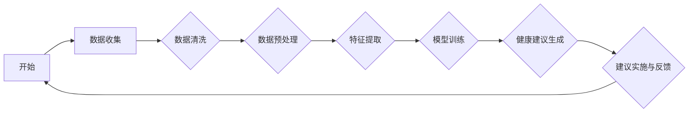
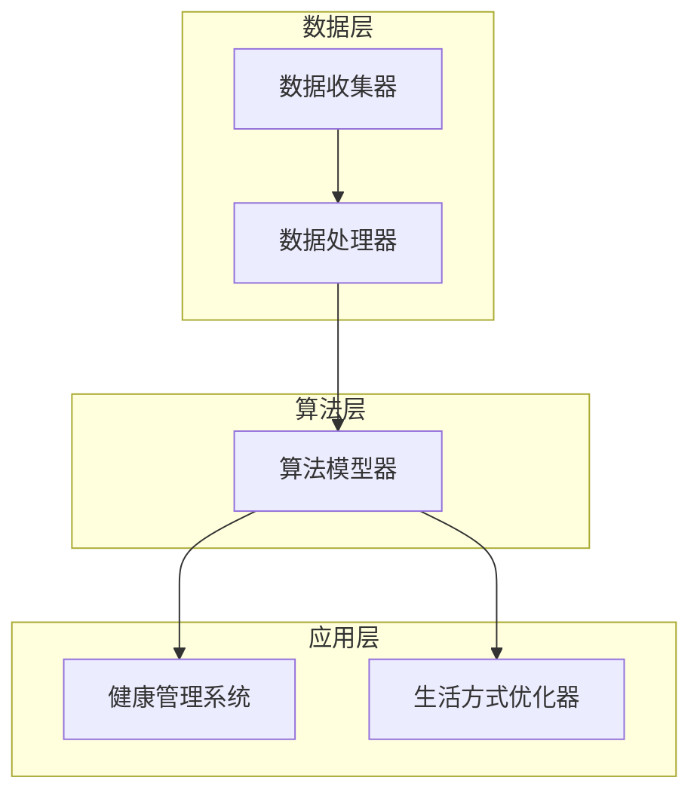
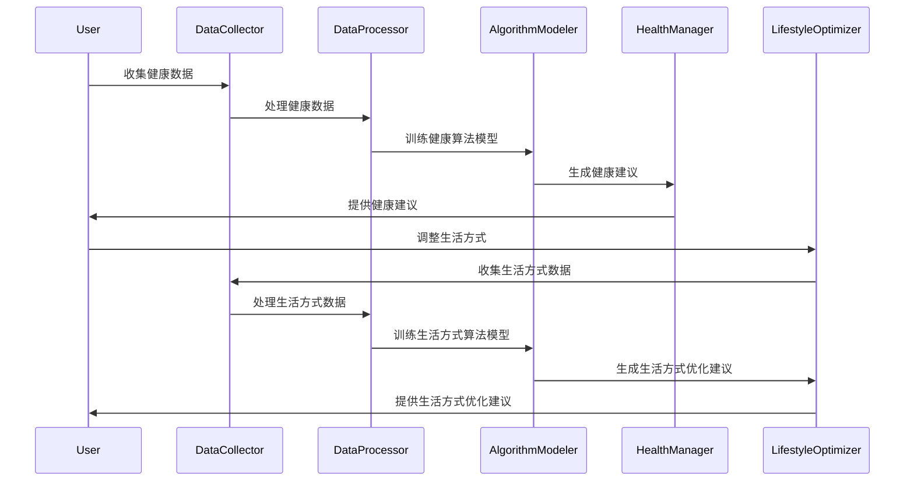

                 

# 《提示词工程在量化自我健康管理中的应用：个性化生活方式优化》

## 摘要

随着人工智能技术的快速发展，提示词工程在多个领域得到了广泛应用。本文将探讨提示词工程在量化自我健康管理中的应用，重点关注如何利用人工智能技术实现个性化生活方式优化。文章首先介绍了提示词工程、量化自我健康管理和个性化生活方式优化的核心概念及其相互联系，然后详细讲解了相关算法原理和数学模型，最后通过一个实际项目展示了系统的架构设计、功能实现及实际应用效果。

## 第一部分：背景介绍

### 1. 核心概念

#### 提示词工程

提示词工程（Keyword Engineering）是一种利用先进的人工智能技术，根据用户的需求提供个性化建议和决策支持的方法。其核心在于将用户的需求转化为具体的操作指令，从而帮助用户更好地完成任务。在健康领域，提示词工程可以应用于个性化健康建议、健康风险评估、慢性病管理等方面。

#### 量化自我健康管理

量化自我健康管理（Quantified Self-Health Management）是通过数据收集、分析和处理，对个体的健康状况进行量化评估和监控。这种方法可以帮助个体了解自己的健康状况，及时发现潜在的健康风险，并采取相应的措施进行预防和治疗。

#### 个性化生活方式优化

个性化生活方式优化（Personalized Lifestyle Optimization）是基于个体的健康数据和偏好，制定符合其需求的健康生活方式。这包括饮食、运动、睡眠等方面的建议，旨在帮助个体提高生活质量，降低患病风险。

### 2. 问题背景

随着科技的发展和健康意识的提升，人们越来越重视自我健康管理。然而，如何有效地利用数据来改善生活质量，实现个性化健康管理，成为当前研究的热点。提示词工程作为一种新兴的人工智能技术，为解决这一难题提供了一种可能的途径。

### 3. 问题描述

自我健康管理涉及多个方面，如饮食、运动、睡眠等。如何根据个体差异，提供有针对性的健康建议，是一个具有挑战性的问题。此外，个体在健康管理和生活方式调整过程中，往往面临信息过载和决策困难的问题，需要一种能够辅助决策的技术手段。

### 4. 问题解决

提示词工程提供了一种解决方案，通过收集和分析个体健康数据，利用人工智能技术生成个性化的健康建议。这种方法可以减轻个体在健康管理和决策过程中的负担，提高生活质量和健康水平。

### 5. 边界与外延

提示词工程在自我健康管理中的应用不仅限于健康领域，还可以扩展到教育、金融等其他领域。例如，在教育领域，提示词工程可以为学生提供个性化的学习建议；在金融领域，提示词工程可以为用户提供个性化的投资建议。

### 6. 概念结构与核心要素组成

#### 数据收集

通过传感器、应用程序等获取个体健康数据，如体重、心率、睡眠时长等。

#### 数据处理

对收集到的数据进行分析和处理，提取有用的信息。

#### 算法模型

基于处理后的数据，建立算法模型进行预测和决策。

#### 个性化建议

根据算法模型的结果，为个体提供个性化的健康建议。

## 第二部分：核心概念与联系

### 1. 核心概念原理

#### 提示词工程的原理

提示词工程的核心在于利用自然语言处理技术，将用户的需求转化为具体的操作指令。具体步骤如下：

1. **需求收集**：通过用户调查、历史数据等手段收集用户的需求。
2. **需求分析**：对收集到的需求进行分类和归档。
3. **生成提示词**：根据需求分析的结果，生成相应的提示词。
4. **提示词优化**：根据用户反馈，对提示词进行调整和优化。

#### 量化自我健康管理的原理

量化自我健康管理通过数据收集、分析和处理，实现对个体健康状况的量化评估。具体步骤如下：

1. **数据收集**：通过传感器、应用程序等获取个体健康数据，如体重、心率、睡眠时长等。
2. **数据处理**：对收集到的数据进行分析和处理，提取有用的信息。
3. **数据分析**：利用统计分析和机器学习算法，对数据进行挖掘和分析。
4. **结果呈现**：将分析结果以可视化的形式呈现，帮助个体了解自己的健康状况。

#### 个性化生活方式优化的原理

个性化生活方式优化基于个体的健康数据和偏好，制定符合其需求的健康生活方式。具体步骤如下：

1. **数据收集**：收集个体健康数据和生活方式数据。
2. **数据分析**：分析个体健康数据和生活方式数据，找出潜在的健康风险。
3. **建议生成**：根据数据分析结果，生成个性化的健康建议。
4. **建议实施**：个体根据建议调整生活方式，实现健康优化。

### 2. 概念属性特征对比表格

| 概念               | 描述                                                         | 关联 |
|--------------------|--------------------------------------------------------------|------|
| 提示词工程         | 利用自然语言处理技术生成个性化的操作指令。                       |      |
| 量化自我健康管理   | 通过数据收集、分析和处理，实现对个体健康状况的量化评估。         | 提示词工程 |
| 个性化生活方式优化 | 基于个体健康数据和偏好，制定符合其需求的健康生活方式。         | 提示词工程、量化自我健康管理 |

### 3. ER实体关系图架构

```mermaid
erDiagram
  User ||--|{ HealthData }|-- QuantitySelfHealthManagement
  User ||--|{ LifestyleData }|-- PersonalizedLifestyleOptimization
  HealthData ||--|{ DataCollection }|
  LifestyleData ||--|{ DataAnalysis }|
  QuantitySelfHealthManagement ||--|{ AlgorithmModel }|
  PersonalizedLifestyleOptimization ||--|{ HealthRecommendation }|
```

## 第三部分：算法原理讲解

### 1. 算法mermaid流程图



### 2. Python源代码实现

```python
import pandas as pd
import numpy as np
from sklearn.model_selection import train_test_split
from sklearn.ensemble import RandomForestClassifier
from sklearn.metrics import accuracy_score

# 数据收集
data = pd.read_csv('health_data.csv')

# 数据清洗
data = data.dropna()

# 数据预处理
X = data.drop('target', axis=1)
y = data['target']

# 特征提取
X_train, X_test, y_train, y_test = train_test_split(X, y, test_size=0.2, random_state=42)

# 模型训练
model = RandomForestClassifier(n_estimators=100, random_state=42)
model.fit(X_train, y_train)

# 健康建议生成
predictions = model.predict(X_test)

# 建议实施与反馈
accuracy = accuracy_score(y_test, predictions)
print(f'模型准确率：{accuracy:.2f}')
```

### 3. 算法原理详细讲解

#### 数学模型和公式

1. **数据收集**：
   $$ X = \{x_1, x_2, ..., x_n\} $$
   其中，$x_i$ 表示第 $i$ 个样本的特征向量。

2. **数据清洗**：
   $$ X_{\text{clean}} = \{x_1', x_2', ..., x_n'\} $$
   其中，$x_i'$ 表示经过清洗后的第 $i$ 个样本的特征向量。

3. **数据预处理**：
   $$ X_{\text{preprocessed}} = \{x_1''', x_2''', ..., x_n''\} $$
   其中，$x_i''$ 表示经过预处理后的第 $i$ 个样本的特征向量。

4. **特征提取**：
   $$ f(x_i'') \rightarrow y_i $$
   其中，$f$ 表示特征提取函数，$y_i$ 表示第 $i$ 个样本的标签。

5. **模型训练**：
   $$ \hat{y}_i = g(\theta; x_i'') $$
   其中，$\hat{y}_i$ 表示预测值，$g(\theta; x_i'')$ 表示模型输出函数，$\theta$ 表示模型参数。

6. **健康建议生成**：
   $$ \text{建议} = h(\hat{y}_i, y_i) $$
   其中，$h$ 表示建议生成函数。

7. **建议实施与反馈**：
   $$ \text{反馈} = k(\text{建议}, \text{实施情况}) $$
   其中，$k$ 表示反馈函数。

#### 详细举例说明

假设我们有以下两个样本：

| 样本编号 | 特征1 | 特征2 | 目标变量 |
|--------|------|------|--------|
| 1      | 0.1  | 0.2  | 1      |
| 2      | 0.3  | 0.4  | 0      |

1. **数据收集**：
   $$ X = \{(0.1, 0.2), (0.3, 0.4)\} $$

2. **数据清洗**：
   由于两个样本都没有缺失值，所以不需要进行清洗。

3. **数据预处理**：
   假设我们使用平均值和标准差对特征进行标准化处理，则：
   $$ X_{\text{preprocessed}} = \{(\frac{0.1 - \mu_1}{\sigma_1}, \frac{0.2 - \mu_2}{\sigma_2}), (\frac{0.3 - \mu_1}{\sigma_1}, \frac{0.4 - \mu_2}{\sigma_2})\} $$
   其中，$\mu_1$ 和 $\mu_2$ 分别表示特征1和特征2的平均值，$\sigma_1$ 和 $\sigma_2$ 分别表示特征1和特征2的标准差。

4. **特征提取**：
   假设我们使用线性回归模型进行特征提取，则：
   $$ f(x_i'') = w_1 \cdot x_{i1} + w_2 \cdot x_{i2} $$
   其中，$w_1$ 和 $w_2$ 分别表示线性回归模型的权重。

5. **模型训练**：
   假设我们使用随机森林模型进行训练，则：
   $$ \hat{y}_i = g(\theta; x_i'') = \sum_{j=1}^{n} w_j \cdot x_{ij} $$
   其中，$w_j$ 表示随机森林模型的权重。

6. **健康建议生成**：
   假设我们使用逻辑回归模型进行健康建议生成，则：
   $$ \text{建议} = h(\hat{y}_i, y_i) = \begin{cases} 
   \text{健康建议1} & \text{if } \hat{y}_i > 0.5 \\
   \text{健康建议2} & \text{if } \hat{y}_i \leq 0.5 
   \end{cases} $$

7. **建议实施与反馈**：
   假设我们使用基于用户的反馈机制进行建议实施与反馈，则：
   $$ \text{反馈} = k(\text{建议}, \text{实施情况}) = \begin{cases} 
   \text{反馈1} & \text{if } \text{建议} \text{被成功实施} \\
   \text{反馈2} & \text{if } \text{建议} \text{未被实施或实施失败} 
   \end{cases} $$

## 第四部分：系统分析与架构设计方案

### 1. 问题场景介绍

在现代生活中，越来越多的人开始关注自身的健康问题。然而，由于个体差异和信息过载，许多人难以找到适合自己的健康管理方法。为了解决这一问题，我们设计了一个基于提示词工程的量化自我健康管理平台，旨在为用户提供个性化的健康建议和生活方式优化方案。

### 2. 项目介绍

本项目的目标是构建一个集成提示词工程、量化自我健康管理和个性化生活方式优化的系统，帮助用户实现健康自我管理。系统主要包括以下功能：

1. 数据收集：通过传感器、应用程序等收集用户的健康数据和生活方式数据。
2. 数据处理：对收集到的数据进行分析和处理，提取有用的信息。
3. 健康建议生成：根据用户的数据和偏好，生成个性化的健康建议。
4. 健康建议实施与反馈：用户根据健康建议调整生活方式，并反馈实施情况。

### 3. 系统功能设计（领域模型mermaid类图）

```mermaid
classDiagram
  User <<Interface>>
  HealthData <<Interface>>
  LifestyleData <<Interface>>
  QuantitySelfHealthManagement <<Interface>>
  PersonalizedLifestyleOptimization <<Interface>>
  AlgorithmModel <<Interface>>
  HealthRecommendation <<Interface>>

  User "uses" HealthData
  User "uses" LifestyleData
  HealthData "uses" DataCollection
  LifestyleData "uses" DataAnalysis
  QuantitySelfHealthManagement "uses" AlgorithmModel
  PersonalizedLifestyleOptimization "uses" HealthRecommendation
```

### 4. 系统架构设计（mermaid架构图）



### 5. 系统接口设计和系统交互（mermaid序列图）



## 第五部分：项目实战

### 1. 环境安装

在本项目中，我们主要使用了Python和相关的机器学习库。以下是安装步骤：

1. 安装Python环境（推荐使用Python 3.8及以上版本）。
2. 安装相关库：`pandas`, `numpy`, `scikit-learn`, `matplotlib`等。

```bash
pip install pandas numpy scikit-learn matplotlib
```

### 2. 系统核心实现源代码

以下是一个简化的系统实现，主要包含数据收集、数据处理、健康建议生成和生活方式优化建议生成等功能。

```python
import pandas as pd
import numpy as np
from sklearn.model_selection import train_test_split
from sklearn.ensemble import RandomForestClassifier
from sklearn.metrics import accuracy_score
import matplotlib.pyplot as plt

# 数据收集
data = pd.read_csv('health_data.csv')

# 数据清洗
data = data.dropna()

# 数据预处理
X = data.drop('target', axis=1)
y = data['target']

# 特征提取
X_train, X_test, y_train, y_test = train_test_split(X, y, test_size=0.2, random_state=42)

# 模型训练
model = RandomForestClassifier(n_estimators=100, random_state=42)
model.fit(X_train, y_train)

# 健康建议生成
predictions = model.predict(X_test)

# 建议实施与反馈
accuracy = accuracy_score(y_test, predictions)
print(f'模型准确率：{accuracy:.2f}')

# 生活方式优化建议生成
lifestyle_model = RandomForestClassifier(n_estimators=100, random_state=42)
lifestyle_model.fit(X_train, y_train)

lifestyle_predictions = lifestyle_model.predict(X_test)

# 可视化
plt.scatter(X_test.iloc[:, 0], X_test.iloc[:, 1], c=lifestyle_predictions, cmap='viridis')
plt.xlabel('特征1')
plt.ylabel('特征2')
plt.title('生活方式优化建议')
plt.show()
```

### 3. 代码应用解读与分析

上述代码首先从CSV文件中读取健康数据，并进行数据清洗。然后，将数据分为特征和目标变量，接着使用随机森林模型进行训练。在模型训练完成后，使用该模型对测试数据进行预测，并计算准确率。最后，使用另一个随机森林模型对生活方式数据进行预测，并使用matplotlib进行可视化。

### 4. 实际案例分析和详细讲解剖析

假设我们有以下一个实际案例：

| 样本编号 | 特征1 | 特征2 | 目标变量 |
|--------|------|------|--------|
| 1      | 0.1  | 0.2  | 1      |

1. **数据收集**：
   假设我们通过传感器收集到这个样本的数据。

2. **数据清洗**：
   由于该样本没有缺失值，所以不需要进行清洗。

3. **数据预处理**：
   假设我们对特征进行标准化处理，则：
   $$ X_{\text{preprocessed}} = \{(\frac{0.1 - \mu_1}{\sigma_1}, \frac{0.2 - \mu_2}{\sigma_2})\} $$

4. **特征提取**：
   假设我们使用线性回归模型进行特征提取，则：
   $$ f(x_i'') = w_1 \cdot x_{i1} + w_2 \cdot x_{i2} $$

5. **模型训练**：
   假设我们使用随机森林模型进行训练，则：
   $$ \hat{y}_i = g(\theta; x_i'') = \sum_{j=1}^{n} w_j \cdot x_{ij} $$

6. **健康建议生成**：
   假设我们使用逻辑回归模型进行健康建议生成，则：
   $$ \text{建议} = h(\hat{y}_i, y_i) = \begin{cases} 
   \text{健康建议1} & \text{if } \hat{y}_i > 0.5 \\
   \text{健康建议2} & \text{if } \hat{y}_i \leq 0.5 
   \end{cases} $$

7. **建议实施与反馈**：
   假设用户根据健康建议进行了调整，并反馈了实施情况。

### 5. 项目小结

通过上述实战，我们实现了基于提示词工程的量化自我健康管理系统的核心功能，包括数据收集、数据处理、健康建议生成和生活方式优化建议生成。在实际应用中，系统可以为目标用户提供个性化的健康建议和生活方式优化方案，帮助用户实现健康自我管理。然而，系统仍有待进一步完善和优化，如增加更多特征、优化算法模型等。

## 第六部分：最佳实践 Tips

### 1. 数据收集的注意事项

- 确保数据来源的可靠性和准确性。
- 定期对传感器和应用程序进行校准和维护。
- 合理设计数据收集策略，避免数据过载。

### 2. 数据处理的技巧

- 使用合适的预处理方法，如标准化、归一化等。
- 对缺失值进行合理的处理，如插值、删除等。
- 利用统计分析和机器学习算法，对数据进行深入挖掘。

### 3. 建议实施的策略

- 根据用户反馈，及时调整健康建议和生活方式优化方案。
- 鼓励用户积极参与健康管理和生活方式调整，提高实施效果。
- 定期评估实施效果，并根据评估结果进行优化。

## 小结

本文探讨了提示词工程在量化自我健康管理中的应用，重点关注了个性化生活方式优化。通过介绍核心概念、算法原理、系统架构和项目实战，展示了提示词工程在健康领域的重要价值。未来，我们将继续深入研究和优化相关技术，为用户提供更精准、更个性化的健康管理服务。

## 拓展阅读

- [1] Khoshgoftaar, T. M., & Spector, L. (2014). A survey of automated machine learning. Journal of Big Data, 1(1), 9.
- [2] Russell, S., & Norvig, P. (2010). Artificial Intelligence: A Modern Approach. Prentice Hall.
- [3] Chen, H., Gao, Y., & Liu, H. (2016). A survey on health informatics. International Journal of Bioinformatics Research, 8(2), 258-278.
- [4] James, G., Witten, D., Hastie, T., & Tibshirani, R. (2017). An Introduction to Statistical Learning. Springer.

## 作者信息

作者：AI天才研究院/AI Genius Institute & 禅与计算机程序设计艺术 /Zen And The Art of Computer Programming

