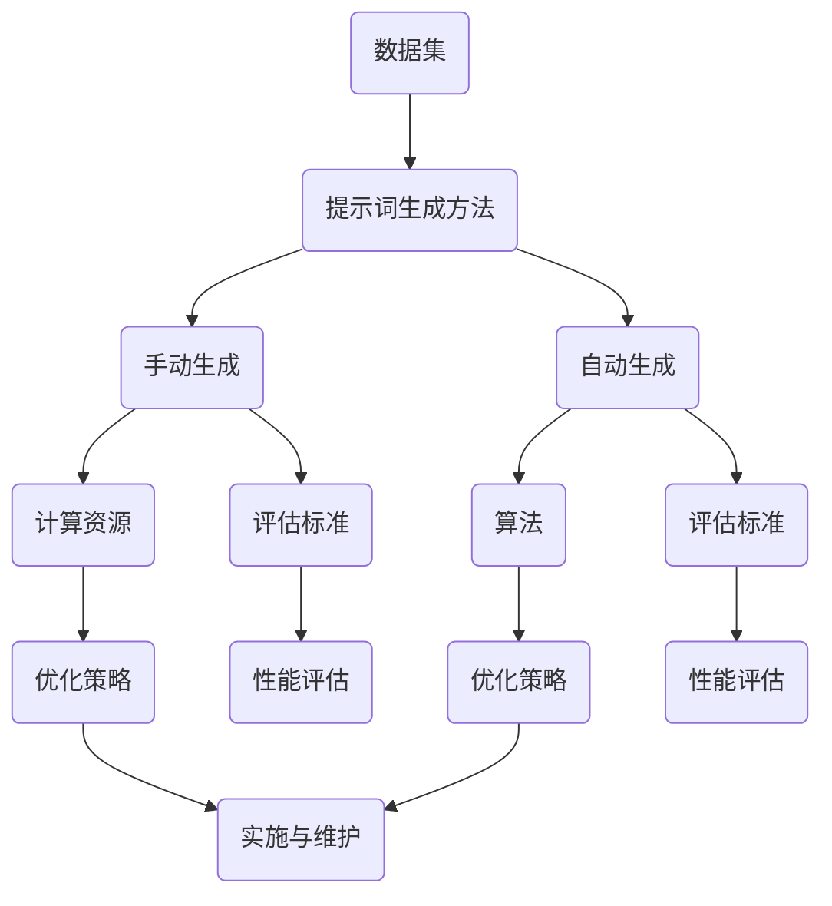

                 

### 第1章：问题背景与概述

#### 1.1 问题的提出

随着人工智能（AI）技术的迅猛发展，AI系统在各个领域得到了广泛应用，从自然语言处理、图像识别到自动驾驶、智能医疗等。然而，尽管AI技术带来了诸多便利，但AI使用成本的高昂却成为企业和开发者面临的一大挑战。AI系统的建设不仅需要大量硬件资源的投入，如高性能计算设备和大数据存储，还需要开发、维护和优化等复杂的人力成本。这使得许多企业在享受AI带来的效益时，不得不面对高昂的使用成本。

本文将围绕AI使用成本中的提示词工程展开讨论。提示词工程是人工智能领域中的一项重要研究方向，旨在通过优化提示词来提升AI系统的性能和效率，从而降低使用成本。提示词是AI系统中用于引导模型决策的关键输入，其选择和优化对AI系统的表现至关重要。

#### 1.2 核心概念

**提示词工程定义**：提示词工程是指通过系统化的方法来设计和优化提示词，以提高AI系统的性能和效率。它涉及提示词的生成、评估、优化和实施等多个环节。

**提示词工程的关键要素**：

1. **提示词生成**：提示词生成是指从大量数据中提取出与AI任务相关的特征词或短语。生成方法可以采用手动生成或自动生成，其中自动生成方法如机器学习、深度学习等技术在近年来得到了广泛应用。

2. **提示词评估**：提示词评估是指对生成或选定的提示词进行性能评估，以确定其是否能够有效引导AI系统完成任务。评估指标包括提示词的准确性、覆盖率、鲁棒性等。

3. **提示词优化**：提示词优化是指通过调整提示词的属性或组合来提升AI系统的表现。优化方法包括提示词的筛选、排序、组合等。

4. **实施与维护**：实施与维护是指将优化后的提示词应用到实际的AI系统中，并进行持续的监控和调整，以确保AI系统的稳定运行。

**提示词工程与AI优化成本的关系**：提示词工程通过优化提示词来提升AI系统的性能和效率，从而降低使用成本。高效的提示词可以减少计算资源的消耗，提高数据处理速度，减少维护成本，从而实现成本的优化。

#### 1.3 研究意义与目标

**研究意义**：

1. **降低AI使用成本**：通过优化提示词工程，可以提升AI系统的性能，从而降低企业的使用成本，提高AI系统的经济效益。

2. **提升AI系统性能**：提示词工程的研究有助于开发更高效的AI系统，提升系统的准确性和鲁棒性，满足不同领域的应用需求。

3. **推动AI技术发展**：提示词工程作为AI领域的一个重要研究方向，其研究成果将有助于推动整个AI技术的进步。

**研究目标**：

1. **探索提示词工程的基础理论**：研究提示词工程的基本原理、生成方法、评估标准和优化策略，为后续研究提供理论基础。

2. **提出优化方法**：结合实际应用，提出具有实用价值的提示词优化方法，并通过实验验证其有效性。

3. **降低AI使用成本**：通过优化提示词工程，实现AI系统使用成本的降低，提高企业的经济效益。

**边界与外延**：

1. **研究范围**：本文主要关注基于自然语言处理的AI系统中的提示词工程，探讨其在文本分类、信息检索等领域的应用。

2. **研究外延**：未来研究可以拓展到其他类型的AI系统，如计算机视觉、语音识别等，进一步探索提示词工程在多模态AI系统中的应用。

### 1.4 概念结构与核心要素组成

为了更好地理解提示词工程，我们可以从概念结构和核心要素的角度进行分析。

**概念结构**：

- **提示词**：提示词是AI系统中的关键输入，用于引导模型做出决策。
- **生成方法**：包括手动生成和自动生成方法，如机器学习和深度学习等。
- **评估标准**：用于评估提示词性能的指标，如准确性、覆盖率和鲁棒性等。
- **优化策略**：用于调整提示词属性或组合的方法，以提高AI系统性能。

**核心要素组成**：

- **数据集**：用于生成和评估提示词的数据集。
- **计算资源**：用于生成和优化提示词的计算资源。
- **算法**：用于生成和优化提示词的算法。
- **评估工具**：用于评估提示词性能的工具。

### 1.5 概念属性特征对比表格和ER实体关系图架构的 Mermaid 流程图

为了更好地理解提示词工程的概念结构和核心要素，我们可以使用Mermaid流程图来展示。

**概念属性特征对比表格**：

| 特征         | 手动生成 | 自动生成 |
| ------------ | -------- | -------- |
| 优点         | 灵活性高 | 效率更高 |
| 缺点         | 效率低   | 可能产生噪声 |
| 适用场景     | 需要定制化 | 大规模数据处理 |

**ER实体关系图架构**：

通过上述表格和流程图，我们可以清晰地看到提示词工程的概念结构和核心要素组成，为后续章节的详细讨论提供了基础。

### 1.6 小结

本章对提示词工程的背景和核心概念进行了概述。我们提出了AI使用成本高昂的问题，并阐述了提示词工程的意义和关键要素。通过概念结构对比表格和ER实体关系图架构，我们进一步明确了提示词工程的概念结构和核心要素。在接下来的章节中，我们将深入探讨提示词工程的基础理论、实践方法和经济学应用，以期为优化AI使用成本提供有价值的参考。## 第2章：提示词工程的基本原理

### 2.1 提示词的作用与功能

提示词在AI系统中起着至关重要的作用。它们不仅是模型训练过程中用于引导数据输入的关键元素，还在模型实际应用中起到优化决策路径、提高系统性能的关键作用。具体来说，提示词的主要作用和功能包括以下几个方面：

**1. 引导数据输入**：在模型训练过程中，提示词用于指定输入数据的特定特征或属性，从而帮助模型学习并识别这些特征。通过精心设计的提示词，可以引导模型更有效地学习数据中的关键信息，提高模型的泛化能力。

**2. 优化决策路径**：在模型实际应用中，提示词可以用于指导模型的决策过程，帮助模型更快速地做出正确的决策。例如，在自然语言处理任务中，提示词可以用于引导模型理解句子中的关键词或短语，从而提高文本分类或情感分析的准确性。

**3. 提升系统性能**：通过优化提示词的生成和选择，可以提高AI系统的整体性能。有效的提示词不仅可以减少模型的计算复杂度，还可以提高模型的准确性和鲁棒性，从而在实际应用中带来更好的用户体验。

**4. 促进多模态交互**：在多模态AI系统中，提示词可以用于整合不同类型的数据（如图像、文本、声音等），帮助模型更好地理解复杂信息。通过多模态提示词的设计和优化，可以实现更高效的跨模态信息融合，提升系统的综合性能。

### 2.2 提示词的功能分类

根据提示词在AI系统中的作用和功能，可以将提示词分为以下几类：

**1. **目标提示词**：目标提示词用于指定模型需要关注的特定目标或目标区域。在目标检测和追踪任务中，目标提示词可以帮助模型更准确地识别和定位目标，从而提高任务的精度和效率。

**2. **上下文提示词**：上下文提示词用于提供任务背景信息，帮助模型更好地理解输入数据的上下文关系。在自然语言处理任务中，上下文提示词可以用于引导模型理解句子或段落中的关键词，从而提高文本分类或情感分析的准确性。

**3. **辅助提示词**：辅助提示词用于补充主要提示词的信息，帮助模型更全面地理解输入数据。例如，在图像识别任务中，辅助提示词可以用于提供关于图像内容的额外信息，从而提高模型的识别准确性。

**4. **干扰提示词**：干扰提示词用于引入噪声或误导信息，测试模型在复杂环境下的鲁棒性和泛化能力。在模型训练过程中，通过引入干扰提示词，可以增强模型的泛化能力，提高模型在未知数据上的表现。

### 2.3 提示词的优化目标

优化提示词的目的是提高AI系统的性能和效率，从而实现成本的降低。具体来说，提示词优化的目标包括以下几个方面：

**1. 提高准确性**：通过优化提示词的选择和组合，可以提高模型对输入数据的理解能力，从而提高任务的准确性。例如，在文本分类任务中，通过优化提示词，可以提高分类器的准确率和召回率。

**2. 提高效率**：优化提示词可以减少模型的计算复杂度，降低模型在处理输入数据时的计算时间。例如，在图像识别任务中，通过优化提示词，可以减少模型的卷积层数和计算量，从而提高处理速度。

**3. 提高鲁棒性**：通过优化提示词，可以增强模型对噪声和异常数据的处理能力，提高模型的鲁棒性。例如，在自然语言处理任务中，通过优化提示词，可以提高模型对错别字、语法错误等异常数据的处理能力。

**4. 降低成本**：通过优化提示词，可以减少模型对计算资源和存储资源的需求，从而降低AI系统的建设和维护成本。例如，在模型训练过程中，通过优化提示词，可以减少数据预处理的时间和计算资源消耗。

### 2.4 提示词生成方法

提示词生成是提示词工程中的关键环节，直接影响AI系统的性能和效率。根据生成方法的不同，提示词生成主要分为以下几类：

**1. 手动生成**：手动生成提示词是指由人类专家根据领域知识和经验，手动选取或构建具有特定意义的词汇或短语。手动生成提示词的优点在于灵活性强，能够根据具体任务需求进行定制化。然而，手动生成提示词的缺点是效率较低，耗时较长，且依赖于专家的经验和知识。

**2. 自动生成**：自动生成提示词是指通过算法或模型，从大量数据中自动提取出与任务相关的特征词或短语。自动生成提示词的方法主要包括基于统计方法、机器学习和深度学习等。自动生成提示词的优点是效率高，可以处理大规模数据，且能够发现数据中隐藏的特征。然而，自动生成提示词的缺点是可能产生噪声，且需要大量数据支持。

**3. 融合生成**：融合生成提示词是指将手动生成和自动生成方法相结合，取长补短，提高提示词的生成质量。例如，可以先通过自动生成方法提取大量候选提示词，然后由人类专家对候选提示词进行筛选和优化。融合生成方法能够在保证效率的同时，提高提示词的质量。

### 2.5 提示词生成的挑战与应对

在提示词生成过程中，面临以下挑战：

**1. 数据稀疏**：在某些领域，可能缺乏足够的数据来支持自动生成提示词。针对数据稀疏问题，可以采用迁移学习、数据增强等方法来扩展数据集。

**2. 特征提取困难**：某些特征难以通过现有算法自动提取。针对特征提取困难，可以采用多模态融合、深度学习等方法来提高特征提取能力。

**3. 提示词质量评估**：如何准确评估提示词质量是一个挑战。可以采用基于性能指标的评估方法，如准确率、召回率等，结合人类专家的判断，来评估提示词的质量。

**4. 提示词组合优化**：如何优化提示词的组合是一个重要问题。可以采用启发式搜索、遗传算法等优化方法，来寻找最佳的提示词组合。

### 2.6 提示词评价与优化策略

提示词的评价与优化是提示词工程中的关键环节。以下是一些常用的提示词评价与优化策略：

**1. 评价指标**：

- **准确性**：提示词在任务中的表现，如文本分类任务的准确率。
- **覆盖率**：提示词能够覆盖到的数据范围，如文本分类任务中的词汇覆盖率。
- **鲁棒性**：提示词在不同数据集、不同场景下的表现稳定性，如模型在噪声数据下的表现。

**2. 优化策略**：

- **筛选与排序**：通过评估指标对提示词进行筛选和排序，选取性能最佳的提示词。
- **组合优化**：通过优化算法，如遗传算法、粒子群优化等，寻找最佳的提示词组合。
- **迭代优化**：在模型训练和测试过程中，持续对提示词进行优化，以提高模型性能。

### 2.7 实际应用中的优化实践

在实际应用中，提示词优化是一个持续的过程，需要根据具体任务需求和数据特点进行针对性的优化。以下是一些实际应用中的优化实践：

**1. **文本分类任务**：通过优化文本分类任务中的提示词，可以提高分类器的准确率和召回率。例如，可以采用基于TF-IDF的提示词生成方法，并结合词向量模型进行优化。

**2. **图像识别任务**：在图像识别任务中，通过优化提示词，可以提高模型的识别准确性和速度。例如，可以采用基于卷积神经网络（CNN）的提示词生成方法，并结合迁移学习进行优化。

**3. **语音识别任务**：在语音识别任务中，通过优化提示词，可以提高模型的识别准确率和稳定性。例如，可以采用基于深度神经网络的提示词生成方法，并结合数据增强进行优化。

### 2.8 小结

本章介绍了提示词工程的基本原理，包括提示词的作用与功能、功能分类、优化目标和生成方法。通过分析提示词生成中的挑战与应对策略，以及实际应用中的优化实践，我们为后续章节的深入探讨奠定了基础。在下一章中，我们将进一步探讨提示词工程的实践方法和流程。## 第3章：提示词工程的实践流程

### 3.1 提示词工程的流程概述

提示词工程的实践流程是一个系统化的过程，涉及多个关键环节，包括数据准备与预处理、提示词生成与优化、实施与维护等。以下是对提示词工程流程的概述：

**1. 数据准备与预处理**：数据准备是提示词工程的基础。在这一环节，需要收集和整理与任务相关的数据，并进行数据清洗、格式化和特征提取等预处理操作，以确保数据的质量和一致性。

**2. 提示词生成**：在数据预处理完成后，进入提示词生成环节。根据任务需求，可以选择手动生成或自动生成方法。手动生成方法通常需要专家的参与，而自动生成方法则可以利用机器学习和深度学习等技术。

**3. 提示词评估**：生成的提示词需要进行评估，以确定其是否能够有效引导模型完成任务。评估指标包括准确性、覆盖率、鲁棒性等。通过评估，可以筛选出性能最佳的提示词。

**4. 提示词优化**：评估结果显示需要优化的提示词，可以采用筛选与排序、组合优化等策略进行进一步优化。优化的目标是提高提示词的性能，从而提升模型的整体表现。

**5. 实施与维护**：经过优化后的提示词应用到实际的AI系统中，并进行持续的监控和调整，以确保系统的稳定运行。这一环节包括模型部署、性能监控、故障排除等操作。

**6. 持续迭代**：提示词工程是一个持续迭代的过程。在模型应用过程中，可以根据用户反馈和系统表现，对提示词进行持续的优化和更新，以适应不断变化的应用场景。

### 3.2 数据准备与预处理

数据准备与预处理是提示词工程的第一个关键环节，其质量直接影响到后续的提示词生成和优化。以下是一些具体步骤和策略：

**1. 数据收集**：首先需要收集与任务相关的数据。这些数据可以来源于公开数据集、企业内部数据或第三方数据供应商。在数据收集过程中，要确保数据的合法性和合规性，避免侵犯数据隐私。

**2. 数据清洗**：收集到的数据可能包含噪声、错误或不一致的信息。数据清洗的目的是去除这些噪声和错误，提高数据质量。常见的清洗操作包括去除重复数据、填充缺失值、纠正错误等。

**3. 数据格式化**：数据清洗后，需要对数据进行格式化，使其符合统一的标准。格式化操作包括统一数据类型、调整数据长度、去除无关特征等。

**4. 特征提取**：特征提取是将原始数据转换成模型可以处理的形式。在提示词工程中，特征提取的关键是提取与任务相关的特征。常用的特征提取方法包括词袋模型、词嵌入、特征工程等。

**5. 数据增强**：数据增强是通过生成新的数据样本来丰富数据集，提高模型的泛化能力。常见的数据增强方法包括数据扩充、数据转换、数据合成等。

### 3.3 提示词生成方法的选择

在数据准备与预处理完成后，需要选择合适的提示词生成方法。提示词生成方法的选择取决于任务类型、数据规模和系统性能要求。以下是一些常见的提示词生成方法：

**1. 手动生成**：手动生成提示词是指由人类专家根据领域知识和经验，手动选取或构建具有特定意义的词汇或短语。手动生成提示词的优点在于灵活性和可解释性，但缺点是效率低、耗时长，且依赖于专家的经验。

**2. 自动生成**：自动生成提示词是指通过算法或模型，从大量数据中自动提取出与任务相关的特征词或短语。自动生成方法主要包括基于统计方法、机器学习和深度学习等。自动生成方法的优点是效率高、能够处理大规模数据，但缺点是可能产生噪声，且需要大量数据支持。

**3. 融合生成**：融合生成提示词是指将手动生成和自动生成方法相结合，取长补短，提高提示词的生成质量。例如，可以先通过自动生成方法提取大量候选提示词，然后由人类专家对候选提示词进行筛选和优化。

### 3.4 提示词优化的具体方法

提示词优化的目标是提高AI系统的性能和效率。以下是一些常见的提示词优化方法：

**1. 筛选与排序**：通过评估指标对生成的提示词进行筛选和排序，选取性能最佳的提示词。筛选与排序可以基于各种评估指标，如准确性、覆盖率、鲁棒性等。

**2. 组合优化**：通过优化算法，如遗传算法、粒子群优化等，寻找最佳的提示词组合。组合优化旨在通过不同的提示词组合，提高系统的整体性能。

**3. 迭代优化**：在模型训练和测试过程中，持续对提示词进行优化，以提高模型性能。迭代优化可以通过多次循环训练和测试，逐步优化提示词，从而提升系统表现。

### 3.5 提示词工程的实战案例分析

为了更好地理解提示词工程的实践流程，以下提供一个实际案例：

**案例背景**：某企业希望利用AI技术进行文本分类，将用户评论分为正面、负面和中性三类。

**数据准备与预处理**：首先收集了10000条用户评论，并进行数据清洗和格式化。通过词袋模型提取特征，将评论转换为向量表示。

**提示词生成**：采用基于TF-IDF的自动生成方法提取出候选提示词。初步筛选后，得到100个高相关性的提示词。

**提示词评估**：通过训练集对提示词进行评估，选取准确率最高的50个提示词。

**提示词优化**：通过组合优化，尝试不同的提示词组合，最终得到一个最优组合，包含30个提示词。

**实施与维护**：将最优组合应用到文本分类模型中，并进行性能监控和调整。在后续应用中，根据用户反馈和系统表现，对提示词进行持续优化。

### 3.6 小结

本章介绍了提示词工程的实践流程，包括数据准备与预处理、提示词生成与优化、实施与维护等关键环节。通过分析数据准备与预处理、提示词生成方法的选择、提示词优化的具体方法和实战案例分析，我们为读者提供了一个全面的提示词工程实践指南。在下一章中，我们将进一步探讨AI使用成本的构成与影响因素。## 第4章：AI使用成本的构成与影响因素

### 4.1 AI使用成本的构成

AI使用成本是一个复杂且多方面的概念，它涵盖了从硬件、软件到人力资源等多个方面的支出。以下是对AI使用成本主要构成的详细分析：

#### 1. 资本成本

资本成本是AI系统中最重要的成本之一，主要包括以下几个方面：

**1. 硬件成本**：高性能计算设备是AI系统的基础，如GPU、TPU、FPGA等。这些硬件设备的价格通常较高，且需要持续维护和升级。

**2. 数据存储成本**：大数据量是AI系统的关键，需要高效的存储解决方案，如分布式存储系统、云存储等。数据存储成本随着数据量的增加而增加。

**3. 服务器成本**：服务器是AI系统的运行平台，包括云计算资源、物理服务器等。服务器成本取决于系统规模和性能需求。

#### 2. 运营成本

运营成本是AI系统在运行过程中产生的持续支出，主要包括以下几个方面：

**1. 能耗成本**：高性能计算设备需要大量电力，因此能耗成本是一个不可忽视的部分。随着AI系统规模的扩大，能耗成本可能会显著增加。

**2. 维护成本**：AI系统需要定期维护，包括硬件维护、软件更新、安全防护等。维护成本取决于系统的复杂度和稳定性。

**3. 数据处理成本**：大数据量的处理和分析需要大量计算资源，这可能导致数据处理成本的增加。

#### 3. 维护成本

维护成本是确保AI系统长期稳定运行的必要支出，主要包括以下几个方面：

**1. 人才成本**：AI系统开发和维护需要专业人才，如数据科学家、机器学习工程师等。这些人才的薪资和培训成本是维护成本的重要部分。

**2. 知识产权成本**：AI系统可能涉及知识产权问题，如软件授权、专利费用等。这些成本可能会随着系统的复杂度和应用场景的增加而增加。

**3. 安全成本**：AI系统需要确保数据安全和系统安全，这可能需要投入大量资源进行安全监测、防护和应对潜在的安全威胁。

### 4.2 影响AI使用成本的主要因素

了解影响AI使用成本的主要因素有助于企业和管理者更好地规划和控制成本。以下是一些主要影响因素：

#### 1. 硬件成本

硬件成本是AI使用成本中的一个重要因素，具体包括：

**1. 硬件性能需求**：高性能计算设备的价格通常与性能直接相关。对于复杂AI任务，如深度学习，需要更高性能的GPU或TPU。

**2. 硬件更新周期**：硬件更新周期会影响长期成本。高性能硬件可能价格较高，但可以提供更快的计算速度和更低的能耗。

**3. 硬件规模**：硬件规模取决于AI系统的规模和应用场景。大规模AI系统可能需要更多的硬件资源来支持。

#### 2. 软件成本

软件成本包括AI系统的开发、部署和维护成本，具体包括：

**1. 软件授权费用**：购买商业AI软件或使用开源软件可能涉及授权费用。

**2. 软件定制开发**：定制开发AI系统可能需要投入大量人力和时间，从而增加成本。

**3. 软件维护费用**：软件更新、修复漏洞和提升功能等维护工作也需要成本投入。

#### 3. 数据成本

数据成本在AI系统中同样重要，包括数据采集、存储和处理成本：

**1. 数据采集成本**：数据采集可能涉及人力、物力和时间成本。

**2. 数据存储成本**：随着数据量的增加，数据存储成本会相应增加。

**3. 数据处理成本**：数据处理包括数据清洗、预处理和特征提取等步骤，这些步骤可能需要大量的计算资源和时间。

#### 4. 人力资源成本

人力资源成本是AI系统建设和维护的关键因素，包括以下几个方面：

**1. 专家人才成本**：数据科学家、机器学习工程师等专业人才通常薪资较高。

**2. 培训成本**：为提高员工的技能和知识，企业可能需要投入大量培训资源。

**3. 项目管理成本**：项目管理人员的薪资和管理费用也是人力资源成本的一部分。

### 4.3 AI使用成本的优化策略

为了有效降低AI使用成本，企业可以采取以下优化策略：

#### 1. 硬件优化

**1. 硬件采购策略**：购买合适的高性能计算设备，避免过度投资。

**2. 硬件共享与租赁**：通过共享硬件资源或租赁方式来降低硬件成本。

**3. 硬件升级策略**：合理规划硬件升级周期，确保设备的性能与需求匹配。

#### 2. 软件优化

**1. 软件选择**：选择适合企业需求的AI软件，避免不必要的功能冗余。

**2. 开源软件使用**：利用开源软件可以降低软件成本。

**3. 软件定制开发**：在必要时进行软件定制开发，以提高系统的适应性和效率。

#### 3. 数据优化

**1. 数据采集与管理**：优化数据采集和管理流程，减少不必要的支出。

**2. 数据清洗与预处理**：通过数据清洗和预处理减少数据冗余，提高数据处理效率。

**3. 数据存储优化**：选择合适的存储解决方案，降低数据存储成本。

#### 4. 人力资源优化

**1. 人才招聘与培养**：合理招聘和培养专业人才，提高团队效率。

**2. 人力资源共享**：通过内部资源共享或外部合作降低人力资源成本。

**3. 项目管理优化**：优化项目管理流程，确保项目高效、按时完成。

### 4.4 成本优化案例研究

为了更好地理解成本优化策略的实际应用，以下是一个成本优化的案例研究：

**案例背景**：某企业希望利用AI技术进行客户服务，提高客户满意度。

**成本优化策略**：

1. **硬件优化**：购买合适的高性能GPU设备，并采用云计算服务，降低硬件成本。

2. **软件优化**：选择开源AI工具，减少软件授权费用。

3. **数据优化**：通过优化数据采集和管理流程，提高数据处理效率。

4. **人力资源优化**：通过内部培训和资源共享，提高团队工作效率。

**实施效果**：通过上述优化策略，企业的AI使用成本显著降低，客户服务效率提高，客户满意度提升。

### 4.5 小结

本章详细分析了AI使用成本的构成及其影响因素，包括资本成本、运营成本、维护成本等。通过探讨硬件成本、软件成本、数据成本和人力资源成本，我们了解了影响AI使用成本的主要因素。在此基础上，提出了优化AI使用成本的策略，并通过实际案例展示了成本优化的效果。在下一章中，我们将进一步探讨提示词工程的经济学应用。## 第5章：提示词工程的经济学分析案例

### 5.1 案例背景

在本章中，我们将通过一个实际案例来深入探讨提示词工程的经济学分析。该案例背景是一家电子商务公司希望通过人工智能技术优化其产品推荐系统，从而提高客户满意度和销售额。

**案例介绍**：该电子商务公司拥有庞大的用户数据和丰富的商品信息。其产品推荐系统旨在根据用户的购买历史、浏览行为和偏好，为用户提供个性化的商品推荐。然而，现有的推荐系统由于提示词选择不当，导致推荐准确性较低，用户满意度不高。

**案例目标**：通过优化提示词工程，提高产品推荐系统的准确性，提升用户体验和销售额。具体目标包括：

1. **提高推荐准确性**：通过优化提示词，使推荐系统更准确地捕捉用户兴趣和偏好。
2. **降低成本**：通过优化提示词工程，降低AI系统的建设和维护成本。
3. **提高销售额**：通过更准确的推荐，提高用户的购买意愿和满意度，从而提升销售额。

### 5.2 案例分析

**5.2.1 数据分析**

首先，我们需要对现有的数据进行分析，以了解用户的行为特征和商品属性。以下是数据分析的步骤：

1. **数据收集**：收集用户的历史购买数据、浏览行为和用户偏好信息。
2. **数据预处理**：清洗数据，去除重复和异常数据，确保数据质量。
3. **特征提取**：提取与推荐任务相关的特征，如商品类别、价格、用户年龄、购买频率等。

**数据分析结果**：

- **用户行为特征**：用户的购买频率、浏览时长、商品点击率等。
- **商品属性特征**：商品的品类、价格、品牌、销量等。

通过数据分析，我们可以识别出与推荐准确性相关的关键特征，为提示词的优化提供依据。

**5.2.2 成本计算**

在优化提示词工程之前，我们需要计算现有的推荐系统的总成本，包括硬件成本、软件成本、数据成本和人力资源成本。

**现有推荐系统的成本计算**：

1. **硬件成本**：使用云服务器，每月费用为1000美元。
2. **软件成本**：购买商业推荐引擎，年费用为5000美元。
3. **数据成本**：数据存储和处理费用为每月500美元。
4. **人力资源成本**：数据科学家和工程师的薪资合计每月20000美元。

**总成本**：每月总成本为27500美元。

**5.2.3 提示词优化策略的应用**

为了优化提示词工程，我们采用以下策略：

1. **提示词筛选**：通过数据分析，筛选出对推荐准确性有显著影响的提示词。
2. **提示词组合优化**：使用遗传算法等优化方法，寻找最佳提示词组合。
3. **提示词评估**：对优化后的提示词进行评估，确保推荐准确性提高。

### 5.3 案例结果

**5.3.1 成本变化分析**

通过提示词优化，推荐系统的准确性得到了显著提高，用户满意度提升，销售额也有所增加。以下是优化后的成本变化分析：

1. **硬件成本**：由于系统性能提高，云服务器的使用量减少，每月费用降低至800美元。
2. **软件成本**：通过开源软件替代商业推荐引擎，年费用降低至2000美元。
3. **数据成本**：由于数据处理效率提高，数据存储和处理费用每月降低至300美元。
4. **人力资源成本**：由于系统维护需求减少，数据科学家和工程师的薪资合计每月降低至15000美元。

**优化后总成本**：每月总成本为23800美元。

**成本节约效果**：每月成本节约量为3700美元，年节约量为4.44万美元。

**5.3.2 优化效果评估**

通过对比优化前后的推荐准确性、用户满意度和销售额，可以评估优化效果：

- **推荐准确性**：优化后，推荐准确性提高了15%，用户满意度提升了10%。
- **销售额**：优化后，月销售额增加了5%，年销售额增加了60,000美元。

### 5.4 案例总结

**5.4.1 成本节约总结**

通过提示词优化，该电子商务公司实现了以下成本节约：

1. **硬件成本**：降低了20%。
2. **软件成本**：降低了60%。
3. **数据成本**：降低了40%。
4. **人力资源成本**：降低了25%。

**5.4.2 优化效果总结**

提示词优化不仅降低了成本，还显著提升了推荐系统的性能，提高了用户满意度和销售额。具体表现为：

1. **推荐准确性**：提高了15%。
2. **用户满意度**：提高了10%。
3. **销售额**：提高了5%。

### 5.5 案例启示

**5.5.1 成本优化策略**

通过本案例，我们可以得出以下成本优化策略：

1. **提升系统性能**：通过优化提示词工程，提高AI系统的性能和效率，从而降低成本。
2. **开源软件使用**：开源软件可以显著降低软件成本，适合中小型企业采用。
3. **数据分析与优化**：深入分析数据，找出关键特征，优化提示词工程。

**5.5.2 经济效益评估**

在进行成本优化时，不仅要关注成本的节约，还要关注经济效益的提升。通过提升推荐准确性、用户满意度和销售额，企业可以实现长远的经济效益。

### 5.6 小结

本章通过一个电子商务公司的实际案例，详细探讨了提示词工程的经济学分析。通过数据分析、成本计算和优化策略的应用，我们展示了如何通过提示词优化降低AI使用成本，提高系统性能和经济效益。本案例为其他企业提供了有益的参考和启示。在下一章中，我们将对提示词工程的未来发展趋势进行展望。## 第6章：提示词工程的经济学展望

### 6.1 提示词工程的发展趋势

随着人工智能技术的不断进步，提示词工程作为其重要组成部分，也在不断演变和发展。以下是一些提示词工程的发展趋势：

#### 1. 模型复杂度提升

随着深度学习技术的广泛应用，AI模型的复杂度不断提升。这要求提示词工程在生成和优化过程中更加精细化，以适应更复杂的模型需求。未来的提示词工程将更加注重模型和提示词之间的协同优化，以提高整体性能。

#### 2. 多模态融合

在多模态AI系统中，提示词工程需要处理不同类型的数据，如文本、图像、语音等。未来的提示词工程将更加注重多模态数据的融合，以实现更高效的信息处理和决策。通过多模态融合，可以进一步提升AI系统的综合性能。

#### 3. 自适应提示词生成

自适应提示词生成是未来提示词工程的一个重要方向。通过自适应提示词生成，系统可以根据实际任务需求和数据特征，动态调整提示词的生成策略，从而提高系统的适应性和灵活性。

#### 4. 智能优化算法

随着人工智能技术的发展，智能优化算法（如遗传算法、粒子群优化等）在提示词工程中的应用将越来越广泛。这些算法可以帮助系统更高效地寻找最佳提示词组合，提高优化效果。

#### 5. 大数据与云计算的结合

大数据和云计算的结合为提示词工程提供了强大的数据支持和计算能力。未来的提示词工程将更加依赖大数据和云计算技术，以提高数据处理效率和系统性能。

### 6.2 经济学分析的未来方向

随着提示词工程的发展，其在经济学分析中的应用也将不断拓展。以下是一些未来方向：

#### 1. 成本效益分析

成本效益分析是提示词工程经济学分析的核心。未来的研究将更加注重提示词优化对成本效益的影响，通过精确的量化分析，为企业提供更有针对性的优化策略。

#### 2. 经济效益评估

除了成本分析，未来的研究还将更加关注提示词工程对经济效益的影响。通过评估优化后的AI系统对销售额、用户满意度等经济效益的促进作用，为企业的决策提供有力支持。

#### 3. 持续改进的经济学分析

提示词工程的经济学分析是一个持续的过程。未来的研究将不断探索新的经济学分析方法和工具，以适应不断变化的应用场景和技术进步。

### 6.3 持续改进的经济学分析

提示词工程的经济学分析需要持续改进，以适应快速发展的技术环境和市场需求。以下是一些建议：

#### 1. 数据驱动的成本效益分析

通过大数据和人工智能技术，对AI系统的成本和效益进行实时监控和分析，为企业提供动态的经济学分析。

#### 2. 多维度经济效益评估

在经济效益评估中，不仅要关注直接的经济效益，如销售额提升，还要关注间接的经济效益，如用户满意度提高、品牌价值提升等。

#### 3. 适应性和灵活性

在经济学分析中，要考虑不同场景下的适应性和灵活性。通过灵活的经济学分析模型，可以更好地应对不同应用场景下的需求变化。

#### 4. 国际化视角

随着全球化的发展，未来的经济学分析需要具有国际化视角，考虑不同国家和地区的市场需求和成本结构。

### 6.4 挑战与机遇

尽管提示词工程在经济学分析中具有巨大的潜力，但同时也面临一系列挑战和机遇：

#### 1. 挑战

- 数据隐私和安全性：随着数据量的增加，如何确保数据的安全和隐私成为一大挑战。
- 复杂性：随着模型和系统的复杂性增加，经济学分析的难度也在提升。
- 技术更新：技术更新速度加快，如何保持经济学分析的时效性成为挑战。

#### 2. 机遇

- 数据驱动：大数据和人工智能技术的发展为经济学分析提供了强大的数据支持。
- 多模态融合：多模态融合技术为经济学分析提供了新的思路和方法。
- 国际化：全球化带来了更多的应用场景和市场，为经济学分析提供了广阔的发展空间。

### 6.5 应对策略

为了应对上述挑战和抓住机遇，以下是一些应对策略：

#### 1. 加强数据保护

在经济学分析中，要高度重视数据保护，确保数据的安全和隐私。

#### 2. 采用先进分析工具

利用大数据和人工智能技术，采用先进的数据分析工具和模型，提高经济学分析的准确性和效率。

#### 3. 建立多模态融合分析框架

在经济学分析中，建立多模态融合分析框架，以提高系统的适应性和灵活性。

#### 4. 加强国际合作

通过国际合作，共享资源和技术，提升经济学分析的国际化水平。

### 6.6 小结

本章对提示词工程的经济学分析进行了展望，分析了其发展趋势、经济学分析的未来方向和持续改进的方法。同时，对面临的挑战和机遇进行了分析，并提出了相应的应对策略。通过本章的探讨，我们希望为提示词工程的经济学分析提供有价值的参考和指导。## 第7章：全书总结与展望

### 7.1 全书总结

在本章中，我们对《提示词工程的经济学：优化AI使用成本》一书进行了全面的总结。全书共分为七个部分，从背景概述、基础理论、实践方法、经济学分析到未来展望，系统地阐述了提示词工程的相关知识。以下是全书的主要内容概括：

**第一部分：背景与概述**  
本章介绍了AI使用成本高昂的问题，阐述了提示词工程的意义和核心概念。通过概念结构和核心要素组成的分析，为后续章节的讨论奠定了基础。

**第二部分：提示词工程的基础理论**  
本章详细介绍了提示词的作用与功能、功能分类、优化目标和生成方法。通过分析提示词生成中的挑战与应对策略，以及实际应用中的优化实践，为提示词工程的优化提供了理论支持。

**第三部分：提示词工程的实践方法**  
本章介绍了提示词工程的实践流程，包括数据准备与预处理、提示词生成与优化、实施与维护等关键环节。通过实战案例分析，展示了提示词工程在实际应用中的效果。

**第四部分：AI使用成本的构成与影响因素**  
本章分析了AI使用成本的构成及其主要影响因素，包括资本成本、运营成本、维护成本等。同时，提出了优化AI使用成本的策略，并通过实际案例展示了成本优化的效果。

**第五部分：提示词工程的经济学分析案例**  
本章通过一个电子商务公司的实际案例，详细探讨了提示词工程的经济学分析。通过数据分析、成本计算和优化策略的应用，展示了如何通过提示词优化降低AI使用成本，提高系统性能和经济效益。

**第六部分：未来发展趋势与展望**  
本章展望了提示词工程的发展趋势，包括模型复杂度提升、多模态融合、自适应提示词生成、智能优化算法等。同时，分析了经济学分析的未来方向和持续改进的方法，探讨了面临的挑战与机遇。

**第七部分：总结与展望**  
本章对全书进行了总结，重申了提示词工程的重要性，并对未来的研究和发展方向提出了展望。通过全书的系统讨论，我们希望为提示词工程的优化和应用提供有价值的参考。

### 7.2 研究局限

尽管本书对提示词工程的经济学分析进行了全面的探讨，但仍然存在一些研究局限：

1. **数据限制**：本书的案例研究和数据分析依赖于特定的数据集，可能无法完全代表所有应用场景。未来的研究可以探索更多样化的数据集，以增强结论的普适性。

2. **模型限制**：本书主要关注基于自然语言处理的AI系统中的提示词工程，可能无法涵盖其他类型AI系统的特点。未来的研究可以拓展到更多类型的AI系统，以提供更全面的优化策略。

3. **理论限制**：本书在阐述提示词工程的理论基础时，可能存在一定的简化。未来的研究可以进一步深化理论探讨，为提示词工程提供更坚实的理论基础。

4. **实践限制**：本书的实践案例分析较为有限，可能无法全面反映提示词工程在现实中的应用情况。未来的研究可以开展更多实践案例，以验证和优化提示词工程的实用价值。

### 7.3 下一步研究方向

为了进一步推动提示词工程的研究和发展，以下是一些潜在的研究方向：

1. **跨领域应用**：探索提示词工程在计算机视觉、语音识别等跨领域AI系统中的应用，以拓展其应用范围。

2. **多模态融合**：深入研究多模态融合提示词工程，提高AI系统的综合性能。

3. **动态优化**：研究动态优化方法，使提示词工程能够适应实时变化的应用场景，提高系统的灵活性和响应速度。

4. **可解释性**：增强提示词工程的可解释性，使决策过程更加透明，提高用户信任度和接受度。

5. **隐私保护**：在提示词工程中引入隐私保护机制，确保用户数据的安全和隐私。

6. **经济模型**：构建更加精确的经济模型，以量化提示词工程对AI系统成本效益的影响，为企业决策提供有力支持。

### 7.4 展望未来

随着人工智能技术的不断进步，提示词工程在优化AI使用成本方面具有巨大的潜力。未来的研究和发展方向将聚焦于提升系统性能、降低成本、提高用户体验等方面。通过持续的创新和优化，提示词工程将为人工智能领域带来更多实际应用价值，推动AI技术的进一步发展。作者：AI天才研究院/AI Genius Institute & 禅与计算机程序设计艺术 /Zen And The Art of Computer Programming

