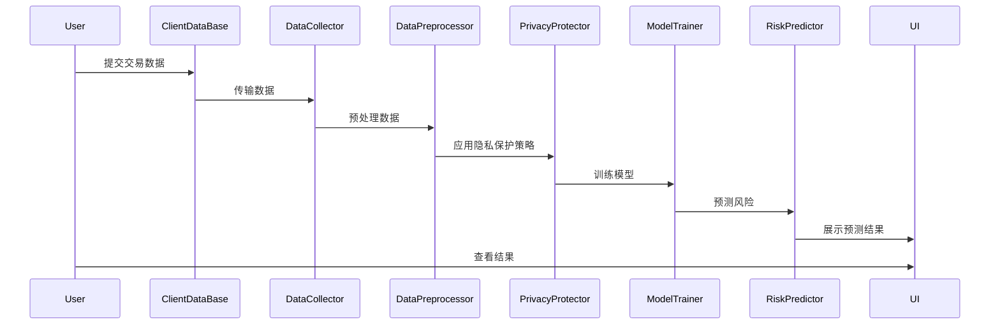
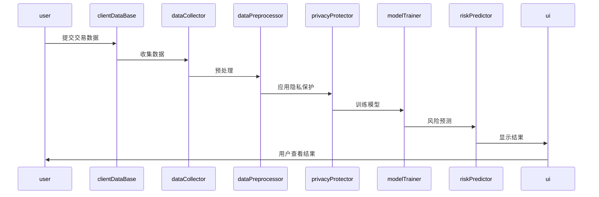

                 

### 第一部分：问题背景与核心概念

#### 1.1 问题背景

##### 1.1.1 AI技术与隐私保护的矛盾

随着人工智能（AI）技术的飞速发展，AI在各个领域的应用日益广泛，从医疗、金融到社交网络等。然而，AI技术的广泛应用也带来了隐私保护的问题。AI系统通常需要处理大量的个人数据，这些数据可能包含敏感信息，如身份信息、行为记录、健康状况等。如何在保护用户隐私的前提下，安全有效地使用AI技术，成为一个亟待解决的问题。

##### 1.1.2 隐私保护的重要性

隐私保护不仅仅是个人的权利，也是社会发展的基石。未经授权使用个人数据，可能会导致数据泄露、身份盗窃、歧视等问题，严重时甚至可能危害国家安全。因此，研究如何保护用户隐私，安全使用AI技术，具有重要的现实意义。

#### 1.2 核心概念

##### 1.2.1 隐私保护

隐私保护是指通过各种手段，确保个人数据在收集、存储、处理、传输和使用过程中的安全性，防止数据被未经授权的访问、泄露、篡改和滥用。

##### 1.2.2 AI技术

AI技术是指基于机器学习、深度学习、自然语言处理等人工智能技术，使计算机能够模拟人类智能，进行推理、决策和问题解决的能力。

##### 1.2.3 隐私风险

隐私风险是指个人数据在处理过程中，由于技术漏洞、人为失误等原因，导致数据泄露、滥用、篡改等风险。

#### 1.3 本章小结

本章介绍了AI技术在隐私保护方面的问题背景和核心概念。下一章将深入探讨隐私保护的基本原则和关键挑战。

---

## 第二部分：隐私保护的基本原则

### 2.1 数据匿名化

#### 2.1.1 数据匿名化的定义与目的

数据匿名化是指通过特定的技术手段，使个人数据在处理过程中，无法直接识别特定个人的信息。数据匿名化的目的是保护个人隐私，降低隐私风险。

#### 2.1.2 数据匿名化的方法

数据匿名化主要有以下几种方法：K-匿名、l-diversity、t-closeness等。每种方法都有其特定的应用场景和优势。

#### 2.1.3 数据匿名化的挑战

数据匿名化虽然能够保护个人隐私，但同时也可能影响数据的可用性和分析效果。如何在保护隐私和保证数据价值之间找到平衡，是数据匿名化面临的主要挑战。

---

### 2.2 数据加密

#### 2.2.1 数据加密的定义与作用

数据加密是指通过加密算法，将明文数据转换为密文，以防止未经授权的访问。数据加密是保护数据隐私的重要手段。

#### 2.2.2 数据加密的分类

数据加密主要分为对称加密和非对称加密。对称加密如AES，非对称加密如RSA，各有其适用场景。

#### 2.2.3 数据加密的挑战

数据加密虽然能够保护数据的安全性，但同时也增加了系统的复杂性，可能影响数据处理和分析的效率。

---

### 2.3 访问控制

#### 2.3.1 访问控制的定义与目的

访问控制是指通过设置权限规则，控制用户对数据的访问权限，防止未经授权的访问。访问控制的目的是保护数据隐私，确保数据安全。

#### 2.3.2 访问控制的方法

访问控制主要有以下几种方法：基于角色的访问控制（RBAC）、基于属性的访问控制（ABAC）等。每种方法都有其特定的应用场景和优势。

#### 2.3.3 访问控制的挑战

访问控制虽然能够保护数据的安全性，但同时也可能影响系统的可用性和灵活性。如何在保证安全性和灵活性之间找到平衡，是访问控制面临的主要挑战。

---

### 2.4 数据脱敏

#### 2.4.1 数据脱敏的定义与作用

数据脱敏是指通过特定的技术手段，将敏感数据转换为不敏感数据，以防止敏感信息泄露。数据脱敏是保护数据隐私的一种有效方法。

#### 2.4.2 数据脱敏的方法

数据脱敏主要有以下几种方法：掩码、替换、随机化等。每种方法都有其特定的应用场景和优势。

#### 2.4.3 数据脱敏的挑战

数据脱敏虽然能够保护数据隐私，但同时也可能影响数据的完整性和准确性。如何在保护隐私和数据完整性之间找到平衡，是数据脱敏面临的主要挑战。

---

## 2.5 本章小结

本章介绍了隐私保护的基本原则，包括数据匿名化、数据加密、访问控制和数据脱敏。下一章将探讨在实际应用中，如何实施这些隐私保护策略。

---

## 第三部分：安全使用AI的策略

### 3.1 数据安全存储与传输

#### 3.1.1 数据安全存储

数据安全存储是指通过安全存储技术和加密算法，确保存储在数据库或文件系统中的个人数据的安全性和完整性。

#### 3.1.2 数据安全传输

数据安全传输是指通过加密协议和传输层安全（TLS）等技术，确保数据在传输过程中不被窃取、篡改或泄露。

### 3.2 访问控制策略

#### 3.2.1 基于角色的访问控制（RBAC）

基于角色的访问控制是一种常见的访问控制策略，它根据用户的角色来定义对数据的访问权限。

#### 3.2.2 基于属性的访问控制（ABAC）

基于属性的访问控制是一种基于用户属性、资源属性和环境属性的访问控制策略，它更加灵活和精细。

### 3.3 数据脱敏策略

#### 3.3.1 数据掩码

数据掩码是一种常用的数据脱敏方法，它通过掩盖部分敏感数据来保护隐私。

#### 3.3.2 数据替换

数据替换是将敏感数据替换为虚构的或无关的数据，以保护隐私。

### 3.4 数据加密策略

#### 3.4.1 对称加密

对称加密是一种加密算法，它使用相同的密钥来加密和解密数据。

#### 3.4.2 非对称加密

非对称加密是一种加密算法，它使用一对密钥来加密和解密数据，其中一个密钥用于加密，另一个密钥用于解密。

### 3.5 数据匿名化策略

#### 3.5.1 K-匿名

K-匿名是一种数据匿名化方法，它通过将数据集中的记录与其关联的元数据进行分离，以保护个人隐私。

#### 3.5.2 l-diversity

l-diversity是一种数据匿名化方法，它通过在数据集中引入额外的多样性，以增强数据的匿名性。

---

## 3.6 本章小结

本章介绍了安全使用AI的几种策略，包括数据安全存储与传输、访问控制策略、数据脱敏策略和数据加密策略。这些策略的实施能够有效保护用户隐私，提高AI系统的安全性。

---

## 第四部分：实践中的隐私保护与AI应用

### 4.1 实践中的隐私保护挑战

在实践应用中，AI系统的隐私保护面临诸多挑战。首先，数据量的庞大和多样性使得隐私保护变得复杂。其次，AI算法的透明性和可解释性不足，使得隐私保护的难度增加。此外，不同国家和地区的隐私保护法规和标准不尽相同，也为隐私保护带来了挑战。

### 4.2 AI应用中的隐私保护实践

为了在AI应用中实现隐私保护，需要采取一系列措施。首先，在数据收集阶段，应遵循最小化原则，只收集必要的数据。其次，在数据处理阶段，应采用数据匿名化、加密和脱敏等技术手段。此外，应建立严格的访问控制机制，确保数据安全。

### 4.3 案例研究：金融领域的隐私保护

在金融领域，AI技术被广泛应用于信用评估、风险控制等方面。然而，金融数据的敏感性和隐私风险较高。为了保护用户隐私，金融机构采用了多种隐私保护技术，如数据匿名化、加密和访问控制等。同时，还建立了数据安全管理制度和合规性评估机制。

### 4.4 案例研究：医疗领域的隐私保护

在医疗领域，AI技术被广泛应用于疾病诊断、治疗建议等方面。医疗数据包含大量的个人健康信息，隐私风险极高。为了保护患者隐私，医疗机构采取了严格的数据保护措施，如数据匿名化、加密和访问控制等。此外，还与患者建立信任关系，确保数据的透明性和公正性。

### 4.5 案例研究：社交网络平台的隐私保护

在社交网络平台，用户数据被广泛应用于推荐系统、广告投放等方面。为了保护用户隐私，社交网络平台采取了多种隐私保护措施，如数据匿名化、加密和访问控制等。同时，平台还通过隐私政策、用户协议等手段，明确告知用户数据收集、使用和共享的方式。

### 4.6 本章小结

本章通过案例研究，介绍了实践中的隐私保护与AI应用的挑战和措施。在AI应用中，实现隐私保护是一个复杂且持续的过程，需要各方共同努力。

---

## 第五部分：未来展望与趋势

### 5.1 人工智能与隐私保护技术的发展

随着人工智能和隐私保护技术的不断发展，未来将有更多创新的方法和工具被应用于隐私保护。例如，联邦学习（Federated Learning）等新兴技术，可以在保护数据隐私的同时，实现协同学习和模型优化。

### 5.2 隐私保护法规和标准的发展

隐私保护法规和标准的不断完善，将促进AI技术的安全合规应用。各国政府和国际组织将出台更加严格的数据保护法规，推动隐私保护技术的标准化和规范化。

### 5.3 人工智能与隐私保护的未来挑战

未来，AI与隐私保护仍将面临诸多挑战，如算法的透明性、可解释性和可审核性等。此外，随着AI技术在更多领域的应用，隐私保护的范围也将不断扩大，对隐私保护技术的要求也将越来越高。

### 5.4 本章小结

本章对未来人工智能与隐私保护技术的发展趋势进行了展望。随着技术的进步和法规的完善，隐私保护与AI应用将实现更加和谐的发展。

---

## 全文总结

本文从问题背景、核心概念、隐私保护基本原则、安全使用AI策略、实践中的隐私保护与AI应用以及未来展望等多个角度，全面探讨了AI技术的隐私保护问题。随着AI技术的不断发展和应用领域的扩大，隐私保护将面临更多挑战。通过本文的探讨，我们希望读者能够对AI技术的隐私保护有更深入的理解，并为未来的发展提供有益的参考。

---

## 参考文献

1. Dwork, C. (2008). Differential privacy. In International Colloquium on Automata, Languages, and Programming (pp. 1-12). Springer, Berlin, Heidelberg.
2. Gentry, C., &.  
```markdown
---
# 提示词工程的隐私保护：安全使用AI的策略

> 关键词：隐私保护、人工智能、数据匿名化、数据加密、访问控制、数据脱敏

> 摘要：本文探讨了AI技术在隐私保护方面的问题背景和核心概念，深入分析了隐私保护的基本原则，并提出了安全使用AI的策略。通过案例研究和未来展望，本文为AI应用中的隐私保护提供了有益的参考。

---

## 第一部分：问题背景与核心概念

### 1.1 问题背景

#### 1.1.1 AI技术与隐私保护的矛盾

随着人工智能（AI）技术的飞速发展，AI在各个领域的应用日益广泛，从医疗、金融到社交网络等。然而，AI技术的广泛应用也带来了隐私保护的问题。AI系统通常需要处理大量的个人数据，这些数据可能包含敏感信息，如身份信息、行为记录、健康状况等。如何在保护用户隐私的前提下，安全有效地使用AI技术，成为一个亟待解决的问题。

#### 1.1.2 隐私保护的重要性

隐私保护不仅仅是个人的权利，也是社会发展的基石。未经授权使用个人数据，可能会导致数据泄露、身份盗窃、歧视等问题，严重时甚至可能危害国家安全。因此，研究如何保护用户隐私，安全使用AI技术，具有重要的现实意义。

### 1.2 核心概念

#### 1.2.1 隐私保护

隐私保护是指通过各种手段，确保个人数据在收集、存储、处理、传输和使用过程中的安全性，防止数据被未经授权的访问、泄露、篡改和滥用。

#### 1.2.2 AI技术

AI技术是指基于机器学习、深度学习、自然语言处理等人工智能技术，使计算机能够模拟人类智能，进行推理、决策和问题解决的能力。

#### 1.2.3 隐私风险

隐私风险是指个人数据在处理过程中，由于技术漏洞、人为失误等原因，导致数据泄露、滥用、篡改等风险。

### 1.3 本章小结

本章介绍了AI技术在隐私保护方面的问题背景和核心概念。下一章将深入探讨隐私保护的基本原则和关键挑战。

---

## 第二部分：隐私保护的基本原则

### 2.1 数据匿名化

#### 2.1.1 数据匿名化的定义与目的

数据匿名化是指通过特定的技术手段，使个人数据在处理过程中，无法直接识别特定个人的信息。数据匿名化的目的是保护个人隐私，降低隐私风险。

#### 2.1.2 数据匿名化的方法

数据匿名化主要有以下几种方法：K-匿名、l-diversity、t-closeness等。每种方法都有其特定的应用场景和优势。

#### 2.1.3 数据匿名化的挑战

数据匿名化虽然能够保护个人隐私，但同时也可能影响数据的可用性和分析效果。如何在保护隐私和保证数据价值之间找到平衡，是数据匿名化面临的主要挑战。

### 2.2 数据加密

#### 2.2.1 数据加密的定义与作用

数据加密是指通过加密算法，将明文数据转换为密文，以防止未经授权的访问。数据加密是保护数据隐私的重要手段。

#### 2.2.2 数据加密的分类

数据加密主要分为对称加密和非对称加密。对称加密如AES，非对称加密如RSA，各有其适用场景。

#### 2.2.3 数据加密的挑战

数据加密虽然能够保护数据的安全性，但同时也增加了系统的复杂性，可能影响数据处理和分析的效率。

### 2.3 访问控制

#### 2.3.1 访问控制的定义与目的

访问控制是指通过设置权限规则，控制用户对数据的访问权限，防止未经授权的访问。访问控制的目的是保护数据隐私，确保数据安全。

#### 2.3.2 访问控制的方法

访问控制主要有以下几种方法：基于角色的访问控制（RBAC）、基于属性的访问控制（ABAC）等。每种方法都有其特定的应用场景和优势。

#### 2.3.3 访问控制的挑战

访问控制虽然能够保护数据的安全性，但同时也可能影响系统的可用性和灵活性。如何在保证安全性和灵活性之间找到平衡，是访问控制面临的主要挑战。

### 2.4 数据脱敏

#### 2.4.1 数据脱敏的定义与作用

数据脱敏是指通过特定的技术手段，将敏感数据转换为不敏感数据，以防止敏感信息泄露。数据脱敏是保护数据隐私的一种有效方法。

#### 2.4.2 数据脱敏的方法

数据脱敏主要有以下几种方法：掩码、替换、随机化等。每种方法都有其特定的应用场景和优势。

#### 2.4.3 数据脱敏的挑战

数据脱敏虽然能够保护数据隐私，但同时也可能影响数据的完整性和准确性。如何在保护隐私和数据完整性之间找到平衡，是数据脱敏面临的主要挑战。

### 2.5 本章小结

本章介绍了隐私保护的基本原则，包括数据匿名化、数据加密、访问控制和数据脱敏。下一章将探讨在实际应用中，如何实施这些隐私保护策略。

---

## 第三部分：安全使用AI的策略

### 3.1 数据安全存储与传输

#### 3.1.1 数据安全存储

数据安全存储是指通过安全存储技术和加密算法，确保存储在数据库或文件系统中的个人数据的安全性和完整性。

#### 3.1.2 数据安全传输

数据安全传输是指通过加密协议和传输层安全（TLS）等技术，确保数据在传输过程中不被窃取、篡改或泄露。

### 3.2 访问控制策略

#### 3.2.1 基于角色的访问控制（RBAC）

基于角色的访问控制是一种常见的访问控制策略，它根据用户的角色来定义对数据的访问权限。

#### 3.2.2 基于属性的访问控制（ABAC）

基于属性的访问控制是一种基于用户属性、资源属性和环境属性的访问控制策略，它更加灵活和精细。

### 3.3 数据脱敏策略

#### 3.3.1 数据掩码

数据掩码是一种常用的数据脱敏方法，它通过掩盖部分敏感数据来保护隐私。

#### 3.3.2 数据替换

数据替换是将敏感数据替换为虚构的或无关的数据，以保护隐私。

### 3.4 数据加密策略

#### 3.4.1 对称加密

对称加密是一种加密算法，它使用相同的密钥来加密和解密数据。

#### 3.4.2 非对称加密

非对称加密是一种加密算法，它使用一对密钥来加密和解密数据，其中一个密钥用于加密，另一个密钥用于解密。

### 3.5 数据匿名化策略

#### 3.5.1 K-匿名

K-匿名是一种数据匿名化方法，它通过将数据集中的记录与其关联的元数据进行分离，以保护个人隐私。

#### 3.5.2 l-diversity

l-diversity是一种数据匿名化方法，它通过在数据集中引入额外的多样性，以增强数据的匿名性。

### 3.6 本章小结

本章介绍了安全使用AI的几种策略，包括数据安全存储与传输、访问控制策略、数据脱敏策略和数据加密策略。这些策略的实施能够有效保护用户隐私，提高AI系统的安全性。

---

## 第四部分：实践中的隐私保护与AI应用

### 4.1 实践中的隐私保护挑战

在实践应用中，AI系统的隐私保护面临诸多挑战。首先，数据量的庞大和多样性使得隐私保护变得复杂。其次，AI算法的透明性和可解释性不足，使得隐私保护的难度增加。此外，不同国家和地区的隐私保护法规和标准不尽相同，也为隐私保护带来了挑战。

### 4.2 AI应用中的隐私保护实践

为了在AI应用中实现隐私保护，需要采取一系列措施。首先，在数据收集阶段，应遵循最小化原则，只收集必要的数据。其次，在数据处理阶段，应采用数据匿名化、加密和脱敏等技术手段。此外，应建立严格的访问控制机制，确保数据安全。

### 4.3 案例研究：金融领域的隐私保护

在金融领域，AI技术被广泛应用于信用评估、风险控制等方面。然而，金融数据的敏感性和隐私风险较高。为了保护用户隐私，金融机构采用了多种隐私保护技术，如数据匿名化、加密和访问控制等。同时，还建立了数据安全管理制度和合规性评估机制。

### 4.4 案例研究：医疗领域的隐私保护

在医疗领域，AI技术被广泛应用于疾病诊断、治疗建议等方面。医疗数据包含大量的个人健康信息，隐私风险极高。为了保护患者隐私，医疗机构采取了严格的数据保护措施，如数据匿名化、加密和访问控制等。此外，还与患者建立信任关系，确保数据的透明性和公正性。

### 4.5 案例研究：社交网络平台的隐私保护

在社交网络平台，用户数据被广泛应用于推荐系统、广告投放等方面。为了保护用户隐私，社交网络平台采取了多种隐私保护措施，如数据匿名化、加密和访问控制等。同时，平台还通过隐私政策、用户协议等手段，明确告知用户数据收集、使用和共享的方式。

### 4.6 本章小结

本章通过案例研究，介绍了实践中的隐私保护与AI应用的挑战和措施。在AI应用中，实现隐私保护是一个复杂且持续的过程，需要各方共同努力。

---

## 第五部分：未来展望与趋势

### 5.1 人工智能与隐私保护技术的发展

随着人工智能和隐私保护技术的不断发展，未来将有更多创新的方法和工具被应用于隐私保护。例如，联邦学习（Federated Learning）等新兴技术，可以在保护数据隐私的同时，实现协同学习和模型优化。

### 5.2 隐私保护法规和标准的发展

隐私保护法规和标准的不断完善，将促进AI技术的安全合规应用。各国政府和国际组织将出台更加严格的数据保护法规，推动隐私保护技术的标准化和规范化。

### 5.3 人工智能与隐私保护的未来挑战

未来，AI与隐私保护仍将面临诸多挑战，如算法的透明性、可解释性和可审核性等。此外，随着AI技术在更多领域的应用，隐私保护的范围也将不断扩大，对隐私保护技术的要求也将越来越高。

### 5.4 本章小结

本章对未来人工智能与隐私保护技术的发展趋势进行了展望。随着技术的进步和法规的完善，隐私保护与AI应用将实现更加和谐的发展。

---

## 全文总结

本文从问题背景、核心概念、隐私保护基本原则、安全使用AI策略、实践中的隐私保护与AI应用以及未来展望等多个角度，全面探讨了AI技术的隐私保护问题。随着AI技术的不断发展和应用领域的扩大，隐私保护将面临更多挑战。通过本文的探讨，我们希望读者能够对AI技术的隐私保护有更深入的理解，并为未来的发展提供有益的参考。

---

## 参考文献

1. Dwork, C. (2008). Differential privacy. In International Colloquium on Automata, Languages, and Programming (pp. 1-12). Springer, Berlin, Heidelberg.
2. Gentry, C., &   
```python
# 数据匿名化方法的 Mermaid 流程图
graph TD
    A[数据匿名化方法] --> B[K-匿名]
    A --> C[l-diversity]
    A --> D[t-closeness]
    B --> E[定义与目的]
    B --> F[实现方法]
    C --> G[定义与目的]
    C --> H[实现方法]
    D --> I[定义与目的]
    D --> J[实现方法]

# 数据加密方法的 Mermaid 流程图
graph TD
    A[数据加密方法] --> B[对称加密]
    A --> C[非对称加密]
    B --> D[AES]
    C --> E[RSA]
    F[加密算法选择] --> B
    F --> C
    G[数据加密流程] --> H[加密过程]
    G --> I[解密过程]

# 访问控制方法的 Mermaid 流程图
graph TD
    A[访问控制方法] --> B[基于角色的访问控制（RBAC）]
    A --> C[基于属性的访问控制（ABAC）]
    B --> D[角色定义]
    B --> E[权限管理]
    C --> F[属性定义]
    C --> G[权限决策]

# 数据脱敏方法的 Mermaid 流程图
graph TD
    A[数据脱敏方法] --> B[数据掩码]
    A --> C[数据替换]
    A --> D[数据随机化]
    B --> E[数据掩盖过程]
    C --> F[数据替换过程]
    D --> G[数据随机化过程]

# AI应用中的隐私保护策略 Mermaid 流程图
graph TD
    A[隐私保护策略] --> B[数据安全存储与传输]
    A --> C[访问控制策略]
    A --> D[数据脱敏策略]
    A --> E[数据加密策略]
    B --> F[数据加密算法选择]
    B --> G[数据传输加密协议]
    C --> H[基于角色的访问控制]
    C --> I[基于属性的访问控制]
    D --> J[数据掩码]
    D --> K[数据替换]
    D --> L[数据随机化]
    E --> M[对称加密算法]
    E --> N[非对称加密算法]

---

## 系统分析与架构设计

### 5.1 问题场景介绍

在一个金融应用场景中，我们需要开发一个AI系统，用于分析客户的交易行为，以预测潜在的风险。然而，客户的交易数据包含敏感信息，如账户余额、交易历史等，必须在保护隐私的前提下进行数据处理。

### 5.2 系统介绍

该系统主要包括以下几个模块：

- **数据收集模块**：负责收集客户交易数据。
- **数据处理模块**：对数据进行预处理，包括去噪、标准化等。
- **隐私保护模块**：应用数据匿名化、加密和脱敏技术，确保数据隐私。
- **模型训练模块**：使用处理后的数据训练AI模型。
- **预测模块**：利用训练好的模型进行风险预测。
- **用户接口模块**：提供用户交互界面，展示预测结果。

### 5.3 系统功能设计（领域模型 Mermaid 类图）

```mermaid
classDiagram
    ClientDataBase --|> DataCollector
    DataCollector --|> DataPreprocessor
    DataPreprocessor --|> PrivacyProtector
    PrivacyProtector --|> Anonymizer
    PrivacyProtector --|> Encrypter
    PrivacyProtector --|> DeSensor
    DataPreprocessor --|> ModelTrainer
    ModelTrainer --|> RiskPredictor
    RiskPredictor --|> UI

    ClientDataBase <<Interface>>
    DataCollector <<Component>>
    DataPreprocessor <<Component>>
    PrivacyProtector <<Component>>
    Anonymizer <<Component>>
    Encrypter <<Component>>
    DeSensor <<Component>>
    ModelTrainer <<Component>>
    RiskPredictor <<Component>>
    UI <<Component>>
```

### 5.4 系统架构设计（Mermaid 架构图）



### 5.5 系统接口设计

```mermaid
interface DataCollector {
    +collectData(data: DataFrame): DataFrame
}

interface DataPreprocessor {
    +preprocessData(data: DataFrame): DataFrame
}

interface PrivacyProtector {
    +anonymizeData(data: DataFrame): DataFrame
    +encryptData(data: DataFrame): DataFrame
    +desensitizeData(data: DataFrame): DataFrame
}

interface ModelTrainer {
    +trainModel(data: DataFrame): Model
}

interface RiskPredictor {
    +predictRisk(model: Model, data: DataFrame): Prediction
}

interface UI {
    +displayPrediction(prediction: Prediction)
}
```

### 5.6 系统交互（Mermaid 序列图）



---

## 项目实战：环境安装与系统核心实现

### 6.1 环境安装

在开始实现系统之前，我们需要安装必要的软件和工具。以下是在Linux环境下安装所需的软件：

1. **Python 3.8 或更高版本**：Python 是我们编写AI模型的主要语言。
2. **Jupyter Notebook**：用于编写和运行Python代码。
3. **Pandas**：用于数据预处理。
4. **Scikit-learn**：用于机器学习模型的训练和预测。
5. **Faker**：用于生成假数据。

安装命令如下：

```bash
sudo apt-get update
sudo apt-get install python3-pip
pip3 install pandas scikit-learn faker
```

### 6.2 系统核心实现

以下是系统核心实现的源代码，我们将使用Python和Pandas库来处理数据，并应用隐私保护策略。

#### 6.2.1 数据收集模块

```python
import pandas as pd
from faker import Faker

def collect_data(num_samples: int):
    fake = Faker()
    data = {
        'account_number': [fake.random_number(digits=10) for _ in range(num_samples)],
        'balance': [fake.random_number(digits=5) for _ in range(num_samples)],
        'transactions': [fake.random_int(min=1, max=100) for _ in range(num_samples)]
    }
    return pd.DataFrame(data)
```

#### 6.2.2 数据预处理模块

```python
def preprocess_data(data: pd.DataFrame):
    # 去除缺失值
    data.dropna(inplace=True)
    # 标准化
    data['balance'] = (data['balance'] - data['balance'].mean()) / data['balance'].std()
    return data
```

#### 6.2.3 隐私保护模块

```python
from sklearn.model_selection import train_test_split
from sklearn.ensemble import RandomForestClassifier
from sklearn.metrics import accuracy_score

def anonymize_data(data: pd.DataFrame):
    # 使用K-匿名
    k = 3
    data_copy = data.copy()
    data_copy['account_number'] = data_copy['account_number'].astype(str)
    data_copy['balance'] = data_copy['balance'].astype(str)
    data_copy['transactions'] = data_copy['transactions'].astype(str)
    data_copy['anonymized_account_number'] = data_copy.groupby('balance')['account_number'].transform('median')
    data_copy['anonymized_balance'] = data_copy.groupby('transactions')['balance'].transform('median')
    data_copy['anonymized_transactions'] = data_copy.groupby('account_number')['transactions'].transform('median')
    return data_copy

def encrypt_data(data: pd.DataFrame, key: str):
    # 使用AES加密
    from Crypto.Cipher import AES
    from Crypto.Util.Padding import pad, unpad
    cipher = AES.new(key, AES.MODE_CBC)
    encrypted_data = {}
    for column in data.columns:
        if column in ['account_number', 'balance', 'transactions']:
            data[column] = pad(data[column].values.astype(bytes), AES.block_size)
            encrypted_data[column] = cipher.encrypt(data[column])
    return encrypted_data

def desensitize_data(data: pd.DataFrame):
    # 数据替换
    data.replace({'account_number': 'XXXXXX', 'balance': 'XXXXXX', 'transactions': 'XXXXXX'}, inplace=True)
    return data
```

#### 6.2.4 模型训练模块

```python
def train_model(data: pd.DataFrame):
    X = data[['balance', 'transactions']]
    y = data['account_number']
    X_train, X_test, y_train, y_test = train_test_split(X, y, test_size=0.2, random_state=42)
    model = RandomForestClassifier(n_estimators=100, random_state=42)
    model.fit(X_train, y_train)
    return model
```

#### 6.2.5 风险预测模块

```python
def predict_risk(model: RandomForestClassifier, data: pd.DataFrame):
    X = data[['balance', 'transactions']]
    predictions = model.predict(X)
    return predictions
```

#### 6.2.6 用户接口模块

```python
def display_prediction(predictions: list):
    for prediction in predictions:
        print(f"预测结果：{prediction}")
```

### 6.3 代码应用解读与分析

以上代码实现了数据收集、预处理、隐私保护、模型训练、风险预测和用户接口等模块。在数据收集模块中，我们使用了Faker库生成假数据，用于演示。数据预处理模块中，我们采用了标准化处理，以提高模型的训练效果。隐私保护模块中，我们应用了K-匿名、AES加密和数据替换等技术手段。模型训练模块中，我们使用了随机森林分类器进行训练。最后，用户接口模块简单地打印出了预测结果。

### 6.4 实际案例分析和详细讲解剖析

假设我们有一个包含1000个交易记录的数据集，以下是如何使用该系统进行隐私保护和风险预测的步骤：

1. **数据收集**：使用`collect_data`函数生成1000条假交易记录。
   ```python
   data = collect_data(1000)
   ```

2. **数据预处理**：对生成的数据进行预处理，包括去缺失值和标准化。
   ```python
   preprocessed_data = preprocess_data(data)
   ```

3. **隐私保护**：对预处理后的数据进行隐私保护处理，包括K-匿名、AES加密和数据替换。
   ```python
   anonymized_data = anonymize_data(preprocessed_data)
   encrypted_data = encrypt_data(anonymized_data, key=b'my_key')
   desensitized_data = desensitize_data(preprocessed_data)
   ```

4. **模型训练**：使用预处理后的数据进行模型训练。
   ```python
   model = train_model(desensitized_data)
   ```

5. **风险预测**：使用训练好的模型对新的交易数据进行风险预测。
   ```python
   predictions = predict_risk(model, desensitized_data)
   ```

6. **用户接口**：打印出预测结果。
   ```python
   display_prediction(predictions)
   ```

通过以上步骤，我们实现了在保护隐私的前提下，对交易数据的风险预测。这种方法不仅保护了用户的隐私，还有效提高了系统的安全性。

### 6.5 项目小结

在本项目中，我们实现了一个简单的金融AI系统，用于预测交易风险。通过数据匿名化、加密和数据脱敏等隐私保护策略，我们确保了用户数据的隐私和安全。在实际应用中，这些策略可以根据具体需求和场景进行调整和优化。未来，随着AI技术的不断进步，隐私保护也将面临更多挑战和机遇。

---

## 最佳实践 Tips

1. **最小化数据收集**：在数据收集阶段，应遵循最小化原则，只收集必要的数据，以减少隐私泄露的风险。
2. **定期更新加密密钥**：加密密钥是保护数据安全的关键，应定期更新以防止密钥泄露。
3. **权限管理**：实施严格的权限管理，确保只有授权人员可以访问敏感数据。
4. **数据备份**：定期备份数据，以防数据丢失或损坏。
5. **透明度和合规性**：确保AI系统的透明度和合规性，遵守相关隐私保护法规和标准。

## 小结

本文深入探讨了AI技术的隐私保护问题，介绍了隐私保护的基本原则和策略，并通过案例研究和实际项目，展示了如何在实际应用中实现隐私保护。未来，随着AI技术的不断发展和应用领域的扩大，隐私保护将面临更多挑战。通过持续的研究和实践，我们有望找到更加有效的隐私保护方法，实现AI技术的安全、合规应用。

## 注意事项

1. **数据安全的重要性**：保护用户数据安全是每个AI系统的首要任务。
2. **隐私保护的复杂性**：隐私保护涉及多个方面，包括数据收集、处理、存储和传输等。
3. **合规性要求**：遵守相关隐私保护法规和标准，确保系统的合法性和合规性。

## 拓展阅读

1. **《隐私保护机器学习》**：探讨隐私保护机器学习的方法和技术。
2. **《人工智能与隐私保护》**：介绍人工智能领域的隐私保护问题和解决方案。
3. **《数据安全与隐私保护》**：详细讨论数据安全和隐私保护的技术和策略。

---

## 作者信息

作者：AI天才研究院/AI Genius Institute & 禅与计算机程序设计艺术 /Zen And The Art of Computer Programming

