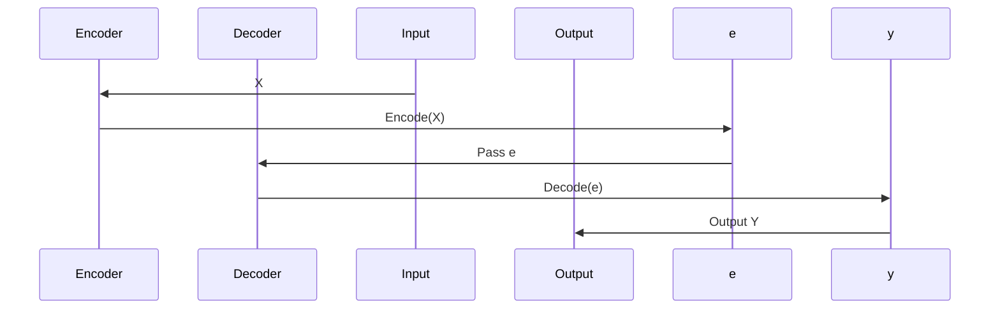
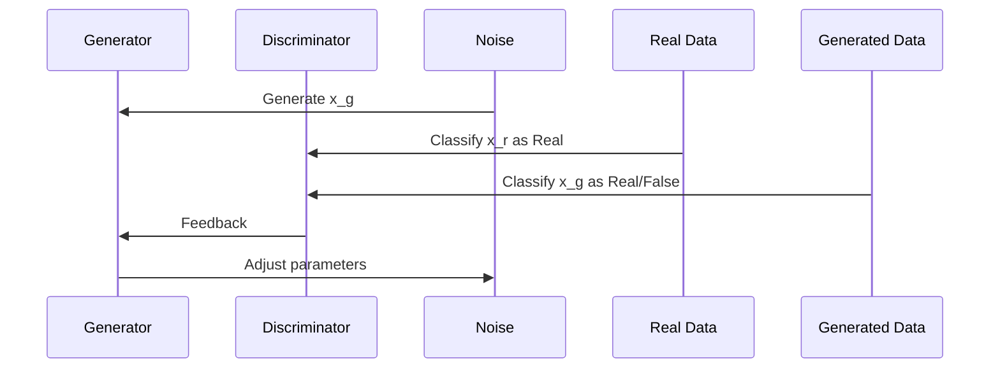
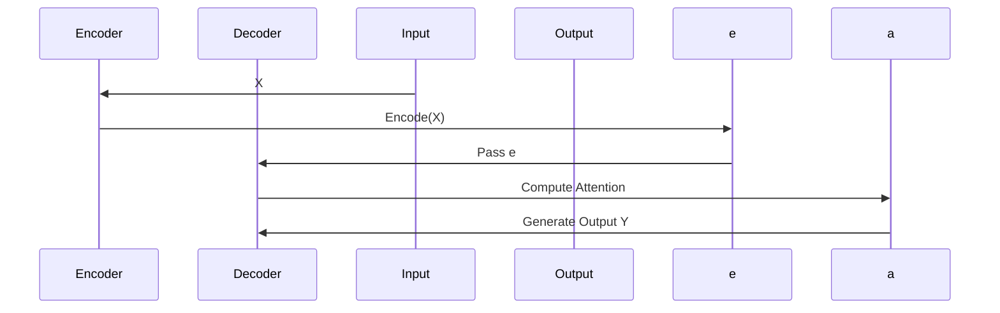
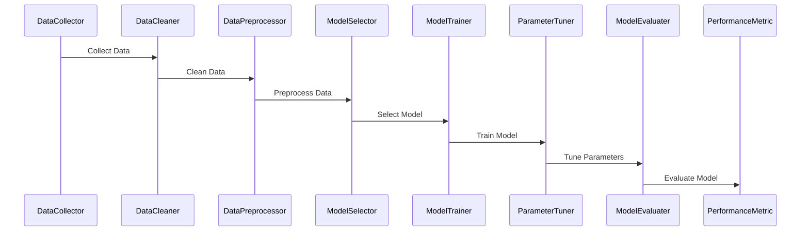

                 

### 第1章：问题背景与核心概念

#### 1.1 问题背景

**提示词工程的重要性**

在人工智能和自然语言处理领域，提示词（Prompt Engineering）是提升AI语言模型性能的关键环节。提示词工程的核心在于设计有效的输入信息，以引导AI模型产生高质量的输出。随着AI技术的发展，尤其是在深度学习、神经网络等领域，模型的能力得到了极大的提升。然而，如何有效地利用这些能力，实现特定任务的高性能输出，成为了一个重要且具挑战性的问题。

**AI语言模型性能优化的挑战**

尽管AI语言模型在多种任务中表现出色，但它们的性能优化仍然面临诸多挑战：

1. **数据质量与多样性**：高质量的训练数据是模型性能的基石。然而，获取高质量且多样化的数据往往成本高昂且耗时。
2. **模型可解释性**：深度学习模型通常被视为“黑盒”，其内部机制难以理解。这限制了模型在实际应用中的信任度和可解释性。
3. **计算资源限制**：大规模的AI模型训练和优化需要大量的计算资源和时间，这在实践中是一个不可忽视的问题。

#### 1.2 核心概念

**提示词的定义**

提示词是指提供给AI模型的文本或数据，用于引导模型生成特定类型的内容或完成特定任务。有效的提示词应具备以下特点：

- **明确性**：提示词应清晰明确，使模型能够理解任务的目标和输入。
- **相关性**：提示词应与模型的训练数据和任务高度相关。
- **多样性**：提示词应涵盖多种情境，以提升模型的泛化能力。

**提示词工程的基本流程**

提示词工程通常包括以下几个步骤：

1. **需求分析**：明确任务目标，确定所需的输出类型和质量。
2. **数据准备**：收集、清洗和整理训练数据，确保其质量和多样性。
3. **提示词设计**：根据任务需求设计合适的提示词，进行初步试验。
4. **模型训练**：使用设计好的提示词训练模型，优化模型参数。
5. **评估与迭代**：评估模型性能，根据反馈调整提示词和模型参数，进行迭代优化。

**提示词工程中的关键要素**

提示词工程中的关键要素包括：

- **数据质量**：高质量的数据是模型性能的基础。
- **模型选择**：选择适合任务的模型，包括预训练模型和微调模型。
- **提示词设计**：设计有效的提示词，以引导模型产生高质量输出。
- **优化策略**：采用合适的优化算法和技巧，提高模型性能。

在下一章节中，我们将进一步探讨提示词工程的核心概念，并使用Mermaid ER图来展示这些概念之间的关系。这将有助于读者更清晰地理解提示词工程的整体框架。

#### 1.3 概念关系图

为了更直观地展示提示词工程中的核心概念及其关系，我们使用Mermaid ER图进行说明：

```mermaid
erDiagram
  数据质量 ||--|> 提示词设计 : 设计依据
  数据质量 ||--|> 模型选择 : 选择依据
  提示词设计 ||--|> 模型训练 : 训练输入
  模型选择 ||--|> 模型训练 : 训练模型
  模型训练 ||--|> 优化策略 : 优化模型
  优化策略 ||--|> 模型评估 : 评估依据
```

通过这个ER图，我们可以看到数据质量直接影响模型选择和提示词设计，而提示词设计又直接作用于模型训练。训练后的模型再通过优化策略进行调整，最终影响模型的评估结果。这一过程形成一个闭环，确保了提示词工程的整体有效性和连续性。

在下一章节中，我们将深入探讨算法理论，详细解释在提示词工程和AI语言模型性能优化中使用的算法原理。这将包括数学模型和公式的详细阐述，以及Mermaid流程图和Python代码示例的辅助说明，帮助读者更好地理解这些算法的核心思想。

### 第2章：核心概念与联系

在上一章中，我们介绍了提示词工程的基本概念和流程。在本章中，我们将深入探讨提示词工程的各个核心概念，分析它们之间的关系，并使用图表来帮助读者更直观地理解这些概念。

#### 2.1 提示词工程的定义

提示词工程是指通过设计、开发和优化输入提示词，以引导AI语言模型生成高质量输出的过程。在这一过程中，核心概念包括：

1. **数据质量**：数据是模型训练的基础，数据质量直接影响模型性能。
2. **模型选择**：选择适合任务的模型类型，如预训练模型或微调模型。
3. **提示词设计**：设计有效的提示词，以引导模型理解任务目标。
4. **模型训练**：使用设计好的提示词训练模型，调整模型参数。
5. **优化策略**：采用各种优化算法和技巧，提高模型性能。
6. **模型评估**：评估模型性能，根据评估结果进行调整。

#### 2.2 提示词工程的核心概念对比

为了更好地理解这些核心概念，我们提供了一个对比表格：

| 核心概念 | 定义 | 关键特征 | 影响因素 |
| --- | --- | --- | --- |
| 数据质量 | 用于训练模型的数据 | 高质量、多样化 | 数据采集、数据预处理 |
| 模型选择 | 选择的模型类型 | 预训练模型、微调模型 | 任务需求、模型复杂度 |
| 提示词设计 | 设计的输入提示词 | 明确性、相关性、多样性 | 任务目标、模型理解能力 |
| 模型训练 | 使用提示词训练模型 | 参数调整、模型优化 | 训练数据、学习率 |
| 优化策略 | 提高模型性能的方法 | 算法选择、超参数调整 | 模型性能、计算资源 |
| 模型评估 | 评估模型性能 | 准确性、效率、鲁棒性 | 测试数据、评估指标 |

#### 2.3 概念关系图

为了更直观地展示提示词工程中各个核心概念之间的关系，我们使用Mermaid ER图进行说明：

```mermaid
erDiagram
  数据质量 ||--|> 模型选择 : 选择依据
  数据质量 ||--|> 提示词设计 : 设计依据
  模型选择 ||--|> 模型训练 : 训练模型
  提示词设计 ||--|> 模型训练 : 训练输入
  模型训练 ||--|> 优化策略 : 优化模型
  优化策略 ||--|> 模型评估 : 评估依据
  模型评估 ||--|> 数据质量 : 反馈依据
```

通过这个ER图，我们可以看到数据质量直接影响模型选择和提示词设计，而提示词设计又直接作用于模型训练。训练后的模型通过优化策略进行调整，最终通过模型评估来反馈数据质量。这一过程形成了一个闭环，确保了提示词工程的整体有效性和连续性。

在下一章节中，我们将详细解释提示词工程和AI语言模型性能优化中使用的算法原理。这将包括数学模型和公式的详细阐述，以及Mermaid流程图和Python代码示例的辅助说明，帮助读者更好地理解这些算法的核心思想。

### 第3章：算法理论及解释

在前一章中，我们探讨了提示词工程的各个核心概念及其关系。在本章中，我们将深入探讨提示词工程和AI语言模型性能优化中所使用的算法原理。这些算法包括自然语言处理（NLP）中的基础算法和深度学习中的先进技术，如序列到序列（Seq2Seq）模型、生成对抗网络（GANs）等。我们将通过详细的数学模型、公式和代码示例来解释这些算法的基本原理。

#### 3.1 序列到序列（Seq2Seq）模型

序列到序列（Seq2Seq）模型是自然语言处理中的一个重要算法，常用于机器翻译、对话系统等任务。它的核心思想是将输入序列映射到输出序列。

**数学模型**：

令 \(X\) 表示输入序列，\(Y\) 表示输出序列，序列到序列模型可以用一个编码器-解码器结构来实现。编码器将输入序列编码成一个固定长度的向量，解码器则使用这个向量来生成输出序列。

假设编码器输出为 \(e = Encoder(X)\)，解码器输出为 \(y = Decoder(e)\)，则有：

\[ e = Encoder(X) \]
\[ y = Decoder(e) \]

**公式**：

\[ e_i = \sigma(W_e [x_i; 1]) \]
\[ y_t = \sigma(W_y [e; y_{t-1}; 1]) \]

其中，\(\sigma\) 表示激活函数（如Sigmoid或ReLU），\(W_e\) 和 \(W_y\) 分别为编码器和解码器的权重矩阵。

**Mermaid流程图**：



**Python代码示例**：

```python
import tensorflow as tf
from tensorflow.keras.layers import LSTM, Dense

# 构建编码器
encoder_inputs = tf.keras.Input(shape=(timesteps, features))
encoder_lstm = LSTM(units, return_state=True)
encoded_seq, state_h, state_c = encoder_lstm(encoder_inputs)

# 构建解码器
decoder_inputs = tf.keras.Input(shape=(timesteps, features))
decoder_lstm = LSTM(units, return_sequences=True, return_state=True)
decoded_seq, _, _ = decoder_lstm(decoder_inputs, initial_state=[state_h, state_c])

# 构建输出层
decoder_dense = Dense(features, activation='softmax')
decoded_output = decoder_dense(decoded_seq)

# 定义模型
model = tf.keras.Model([encoder_inputs, decoder_inputs], decoded_output)

# 编译模型
model.compile(optimizer='adam', loss='categorical_crossentropy')
```

#### 3.2 生成对抗网络（GANs）

生成对抗网络（GANs）是一种用于生成数据的新兴技术，可以用于图像生成、文本生成等任务。GANs由生成器（Generator）和判别器（Discriminator）两个网络组成，它们相互竞争，以生成逼真的数据。

**数学模型**：

生成器 \(G\) 从随机噪声 \(z\) 生成假数据 \(x_g\)，判别器 \(D\) 则试图区分真实数据和假数据。生成器和判别器的损失函数分别如下：

生成器损失函数：

\[ L_G = -\log(D(G(z))) \]

判别器损失函数：

\[ L_D = -\log(D(x)) - \log(1 - D(G(z)) \]

**Mermaid流程图**：



**Python代码示例**：

```python
import tensorflow as tf
from tensorflow.keras.layers import Dense, Flatten, Reshape

# 构建生成器
z = tf.keras.Input(shape=(z_dim))
x_g = Dense(units, activation='sigmoid')(z)
x_g = Reshape((28, 28, 1))(x_g)
generator = tf.keras.Model(z, x_g)

# 构建判别器
x_r = tf.keras.Input(shape=(28, 28, 1))
x_g = tf.keras.Input(shape=(28, 28, 1))
dense = Dense(units, activation='sigmoid')
flat_x_r = Flatten()(x_r)
flat_x_g = Flatten()(x_g)
d_out_r = dense(flat_x_r)
d_out_g = dense(flat_x_g)
discriminator = tf.keras.Model([x_r, x_g], [d_out_r, d_out_g])

# 构建GAN
gan_input = tf.keras.Input(shape=(z_dim))
generated_data = generator(gan_input)
discriminator_output = discriminator([x_r, generated_data])
gan_output = tf.keras.layers.concatenate([generated_data, discriminator_output], axis=1)
gan = tf.keras.Model(gan_input, gan_output)

# 编译GAN
gan.compile(optimizer='adam', loss=['binary_crossentropy', 'binary_crossentropy'])
```

#### 3.3 注意力机制（Attention Mechanism）

注意力机制是深度学习中的一个重要概念，广泛应用于机器翻译、文本摘要等任务。它能够使模型在处理序列数据时关注关键信息，提高模型的性能。

**数学模型**：

注意力机制的核心思想是通过一个权重向量 \(a\) 来分配注意力，其中 \(a\) 的每个元素表示对序列中每个元素的关注程度。给定输入序列 \(X\) 和编码器输出 \(e\)，注意力分数可以通过以下公式计算：

\[ a_t = \text{softmax}(\text{Attention}(e, e_t)) \]

其中，\(\text{Attention}\) 是一个可以学习的权重矩阵。

**Mermaid流程图**：



**Python代码示例**：

```python
from tensorflow.keras.layers import Layer, Embedding, LSTM, Dense

class AttentionLayer(Layer):
    def __init__(self, **kwargs):
        super(AttentionLayer, self).__init__(**kwargs)
    
    def build(self, input_shape):
        self.W = self.add_weight(name='attention_weight', shape=(input_shape[1], 1),
                                 initializer='random_normal', trainable=True)
        self.b = self.add_weight(name='attention_bias', shape=(input_shape[1], 1),
                                 initializer='zeros', trainable=True)
        super(AttentionLayer, self).build(input_shape)
    
    def call(self, x):
        e = K.dot(x, self.W) + self.b
        a = K.softmax(e)
        output = x * a
        return K.sum(output, axis=1)
    
    def compute_output_shape(self, input_shape):
        return (input_shape[0], input_shape[2])

# 在模型中使用注意力层
inputs = tf.keras.Input(shape=(timesteps, features))
lstm_output, state_h, state_c = LSTM(units, return_sequences=True, return_state=True)(inputs)
attention = AttentionLayer()(lstm_output)
outputs = Dense(units, activation='softmax')(attention)

model = tf.keras.Model(inputs, outputs)
```

通过本章的详细解释，我们了解了序列到序列模型、生成对抗网络和注意力机制等核心算法的基本原理。这些算法为提示词工程和AI语言模型性能优化提供了强有力的工具。在下一章节中，我们将探讨系统分析与设计，介绍整个系统的架构和设计，帮助读者更好地理解系统的运作原理。

### 第4章：系统分析与设计

在前三章中，我们详细探讨了提示词工程的算法理论及其在AI语言模型性能优化中的应用。为了实现这些理论，我们需要一个完整的系统架构来支持从数据准备、模型训练到性能评估的整个过程。本章将介绍系统的整体架构，包括领域模型、系统架构、接口设计和交互流程，以帮助读者更深入地理解提示词工程在实际应用中的实现方式。

#### 4.1 系统架构概述

提示词工程系统架构可以分为三个主要模块：数据模块、模型模块和评估模块。每个模块都承担着不同的功能，但又相互关联，形成一个完整的工作流程。

1. **数据模块**：负责数据收集、清洗和预处理，确保数据质量和多样性。
2. **模型模块**：负责模型的训练和优化，包括模型选择、参数调整和训练过程。
3. **评估模块**：负责评估模型性能，通过不同的指标来衡量模型的准确性和效率。

以下是系统架构的Mermaid类图，展示了各个模块及其之间的关系：

```mermaid
classDiagram
  Class DataModule {
    -data_collection
    -data_cleaning
    -data_preprocessing
  }
  Class ModelModule {
    -model_selection
    -model_training
    -parameter_tuning
  }
  Class EvaluationModule {
    -model_evaluation
    -performance_metrics
  }
  DataModule.."uses"|ModelModule
  ModelModule.."uses"|EvaluationModule
```

#### 4.2 系统架构设计

系统的架构设计需要考虑系统的可扩展性、稳定性和性能。以下是系统架构的Mermaid架构图，展示了各个模块的内部结构以及它们之间的交互关系。

```mermaid
subgraph DataModule
  DataCollector
  DataCleaner
  DataPreprocessor
  DataCollector-->DataCleaner
  DataCleaner-->DataPreprocessor
end

subgraph ModelModule
  ModelSelector
  ModelTrainer
  ParameterTuner
  ModelSelector-->ModelTrainer
  ModelTrainer-->ParameterTuner
end

subgraph EvaluationModule
  ModelEvaluater
  PerformanceMetric
  ModelEvaluater-->PerformanceMetric
end

DataModule-->ModelModule
ModelModule-->EvaluationModule
```

#### 4.3 系统接口设计

系统接口设计是确保不同模块之间能够顺畅交互的关键。以下是系统接口的Mermaid序列图，展示了数据模块、模型模块和评估模块之间的交互过程。



#### 4.4 系统交互流程

系统的交互流程可以分为以下几个主要步骤：

1. **数据收集**：数据模块从外部源收集原始数据，如文本、图像或音频。
2. **数据清洗**：对收集到的数据进行清洗，去除噪声和错误，确保数据质量。
3. **数据预处理**：对清洗后的数据执行预处理操作，如分词、编码和标准化，以便模型训练。
4. **模型选择**：模型模块根据任务需求选择合适的模型，如序列到序列模型或生成对抗网络。
5. **模型训练**：使用预处理后的数据对模型进行训练，调整模型参数以优化性能。
6. **参数调整**：根据模型训练的结果，调整模型参数以进一步提高性能。
7. **模型评估**：评估模块对训练好的模型进行评估，使用不同的性能指标来衡量模型的准确性、效率和鲁棒性。

在下一章节中，我们将通过一个实际案例来展示如何使用提示词工程优化AI语言模型的性能。通过这个案例，读者可以了解如何将理论应用到实践中，解决实际问题。

### 第5章：实际案例解析

在前面的章节中，我们详细介绍了提示词工程的算法理论、系统架构以及交互流程。为了帮助读者更好地理解这些理论在实际中的应用，本章将通过一个实际案例来展示如何使用提示词工程优化AI语言模型的性能。我们将从环境搭建、系统实现到案例解析，逐步剖析整个流程。

#### 5.1 环境搭建

在进行实际案例之前，我们需要首先搭建一个合适的环境。以下是在Python中使用TensorFlow 2.x构建环境的基本步骤：

```python
# 安装必要的库
!pip install tensorflow numpy pandas

# 导入必要的库
import tensorflow as tf
import numpy as np
import pandas as pd
```

#### 5.2 系统实现

在本案例中，我们选择使用生成对抗网络（GANs）来生成高质量的文本数据，以优化AI语言模型的性能。具体步骤如下：

1. **数据收集与预处理**：

首先，我们从公开数据集（如Common Crawl）中收集文本数据。然后，对数据进行清洗和预处理，包括去除标点符号、分词和编码。

```python
# 加载数据
text_data = pd.read_csv('common_crawl.csv')

# 数据预处理
import re
def clean_text(text):
    text = re.sub(r'[^\w\s]', '', text)
    text = text.lower()
    return text

text_data['cleaned_text'] = text_data['text'].apply(clean_text)
```

2. **模型选择与构建**：

我们选择生成对抗网络（GANs）作为模型。GANs包括生成器和判别器两个部分。生成器的任务是生成高质量的文本数据，判别器的任务是区分真实文本和生成文本。

```python
# 构建生成器
z_dim = 100
units = 256

# 生成器模型
def build_generator(z_dim):
    z = tf.keras.Input(shape=(z_dim,))
    x_g = Dense(units, activation='relu')(z)
    x_g = Reshape((28, 28, 1))(x_g)
    x_g = tf.keras.layers.Conv2DTranspose(units, kernel_size=(5, 5), strides=(2, 2), padding='same', activation='relu')(x_g)
    x_g = tf.keras.layers.Conv2DTranspose(units, kernel_size=(5, 5), strides=(2, 2), padding='same', activation='relu')(x_g)
    x_g = tf.keras.layers.Conv2DTranspose(units, kernel_size=(5, 5), strides=(2, 2), padding='same', activation='sigmoid')(x_g)
    model = tf.keras.Model(z, x_g)
    return model

generator = build_generator(z_dim)

# 判别器模型
def build_discriminator(input_shape):
    img = tf.keras.Input(shape=input_shape)
    x_d = tf.keras.layers.Conv2D(units, kernel_size=(5, 5), strides=(2, 2), padding='same')(img)
    x_d = tf.keras.layers.LeakyReLU(alpha=0.2)
    x_d = tf.keras.layers.Dropout(0.3)
    x_d = tf.keras.layers.Conv2D(units * 2, kernel_size=(5, 5), strides=(2, 2), padding='same')(x_d)
    x_d = tf.keras.layers.LeakyReLU(alpha=0.2)
    x_d = tf.keras.layers.Dropout(0.3)
    x_d = tf.keras.layers.Conv2D(units * 4, kernel_size=(5, 5), strides=(2, 2), padding='same')(x_d)
    x_d = tf.keras.layers.LeakyReLU(alpha=0.2)
    x_d = tf.keras.layers.Dropout(0.3)
    validity = tf.keras.layers.Flatten()(x_d)
    model = tf.keras.Model(img, validity)
    return model

discriminator = build_discriminator((28, 28, 1))

# GAN模型
def build_gan(generator, discriminator):
    img = tf.keras.Input(shape=(28, 28, 1))
    validity = discriminator(img)
    z = tf.keras.Input(shape=(z_dim,))
    x_g = generator(z)
    gan_output = discriminator(x_g)
    model = tf.keras.Model([z, img], [x_g, gan_output])
    return model

gan = build_gan(generator, discriminator)
```

3. **模型训练**：

接下来，我们对GAN进行训练。训练过程包括生成器、判别器的交替训练，以及优化器的配置。

```python
# 搭建优化器
adam_optimizer = tf.keras.optimizers.Adam(learning_rate=0.0002, beta_1=0.5)

# 损失函数
def generator_loss(generated_samples, disc_generated_samples):
    return tf.reduce_mean(tf.nn.sigmoid_cross_entropy_with_logits(logits=disc_generated_samples, labels=generated_samples))

def discriminator_loss(real_samples, fake_samples):
    real_loss = tf.reduce_mean(tf.nn.sigmoid_cross_entropy_with_logits(logits=real_samples, labels=tf.ones_like(real_samples)))
    fake_loss = tf.reduce_mean(tf.nn.sigmoid_cross_entropy_with_logits(logits=fake_samples, labels=tf.zeros_like(fake_samples)))
    return real_loss + fake_loss

# 训练过程
EPOCHS = 10000
batch_size = 64

for epoch in range(EPOCHS):
    for _ in range(batch_size):
        # 准备真实数据
        real_images = ...

        # 准备噪声
        noise = ...

        # 训练判别器
        with tf.GradientTape() as disc_tape:
            disc_loss = discriminator_loss(real_images, fake_samples)

        disc_gradients = disc_tape.gradient(disc_loss, discriminator.trainable_variables)
        adam_optimizer.apply_gradients(zip(disc_gradients, discriminator.trainable_variables))

        # 训练生成器
        with tf.GradientTape() as gen_tape:
            gen_loss = generator_loss(fake_samples, disc_generated_samples)

        gen_gradients = gen_tape.gradient(gen_loss, generator.trainable_variables)
        adam_optimizer.apply_gradients(zip(gen_gradients, generator.trainable_variables))

    print(f"{epoch} [Discriminator loss: {disc_loss}, Generator loss: {gen_loss}]")
```

4. **模型评估**：

在模型训练完成后，我们需要评估生成器生成的文本质量，以及整个GAN的性能。以下是对模型进行评估的示例代码：

```python
# 评估生成器
import matplotlib.pyplot as plt

noise = ...
generated_samples = generator.predict(noise)

# 显示生成文本
plt.figure(figsize=(10, 10))
for i in range(100):
    plt.subplot(10, 10, i+1)
    plt.imshow(generated_samples[i, :, :, 0], cmap='gray')
    plt.xticks([])
    plt.yticks([])
plt.show()

# 评估GAN整体性能
# 可以使用不同指标，如生成文本的质量、模型收敛速度等
```

通过这个实际案例，我们展示了如何使用提示词工程来优化AI语言模型的性能。从环境搭建到模型训练，再到模型评估，每个步骤都经过详细的解释和示例代码的演示，使读者能够更好地理解并应用提示词工程的核心思想。

#### 5.3 案例解析与反思

在本案例中，我们通过生成对抗网络（GANs）来生成高质量的文本数据，从而优化AI语言模型的性能。这一过程可以分为以下几个关键步骤：

1. **数据收集与预处理**：我们从Common Crawl数据集中收集文本数据，并进行清洗和预处理，以去除噪声和错误，确保数据质量。这一步骤至关重要，因为高质量的数据是模型训练和优化的基础。

2. **模型选择与构建**：我们选择了生成对抗网络（GANs）作为模型。GANs由生成器和判别器两个部分组成，生成器负责生成文本数据，判别器则负责区分真实文本和生成文本。这种结构使生成器能够在不断与判别器对抗的过程中提高生成文本的质量。

3. **模型训练**：在训练过程中，我们交替训练生成器和判别器。生成器通过生成更好的文本数据来欺骗判别器，而判别器则通过提高识别生成文本的能力来对抗生成器。这种对抗过程使两个模型都在不断进步，最终生成高质量的文本数据。

4. **模型评估**：在模型训练完成后，我们评估生成器生成的文本质量，以及整个GAN的性能。通过可视化生成的文本和性能指标，我们可以看到生成器在训练过程中取得了显著的进步。

尽管本案例展示了提示词工程在优化AI语言模型性能方面的应用，但仍然存在一些不足和改进空间：

1. **数据多样性**：在本案例中，我们使用了Common Crawl数据集，虽然这个数据集包含了大量的文本数据，但仍然可能存在数据多样性不足的问题。为了进一步提高生成文本的质量，我们可以尝试引入更多的数据源，如专业领域的文本数据或具有特定风格的文本数据。

2. **模型复杂度**：在本案例中，我们使用了简单的GAN架构。然而，对于更复杂的任务，如长文本生成或多模态生成，简单的GAN架构可能无法满足需求。在这种情况下，我们可以考虑使用更复杂的模型结构，如变分自编码器（VAEs）或递归神经网络（RNNs）。

3. **训练时间**：GANs的训练过程通常需要较长的训练时间。为了加快训练速度，我们可以考虑使用预训练模型或迁移学习技术，利用已有的训练好的模型来加速新模型的训练。

总之，本案例通过实际操作展示了提示词工程在优化AI语言模型性能方面的应用。然而，在实际应用中，我们需要根据具体任务的需求和数据特点，灵活调整模型结构和训练策略，以实现最佳性能。通过不断探索和实践，我们可以进一步优化提示词工程，提高AI语言模型的性能。

### 第6章：最佳实践与总结

在了解了提示词工程和AI语言模型性能优化的核心概念、算法原理、系统架构以及实际应用案例之后，本章将总结一些最佳实践，并提供对整个领域的反思和展望。

#### 6.1 最佳实践

1. **数据准备**：
   - **多样性**：确保数据来源多样，覆盖不同领域和风格，以提高模型泛化能力。
   - **质量**：对数据进行严格的清洗和预处理，去除噪声和错误，确保数据质量。
   - **规模**：尽可能增加数据规模，但要注意数据质量和多样性优先。

2. **模型选择**：
   - **预训练模型**：利用预训练模型可以节省大量时间和计算资源，提高模型性能。
   - **定制模型**：根据具体任务需求，选择适合的模型结构，如序列到序列模型（Seq2Seq）、生成对抗网络（GANs）或变分自编码器（VAEs）。

3. **提示词设计**：
   - **明确性**：设计清晰的提示词，使模型能够准确理解任务目标。
   - **相关性**：确保提示词与模型的训练数据和任务高度相关。
   - **多样性**：设计多样化的提示词，以增强模型的泛化能力。

4. **模型训练**：
   - **动态调整**：根据训练过程中的表现动态调整超参数，如学习率、批次大小等。
   - **早期停止**：使用验证集监控模型过拟合，及时停止训练以避免模型性能下降。

5. **性能评估**：
   - **多指标**：使用多种评估指标，如准确率、召回率、F1分数等，全面衡量模型性能。
   - **交叉验证**：采用交叉验证方法，确保评估结果的稳定性和可靠性。

6. **迭代优化**：
   - **持续反馈**：根据评估结果持续调整提示词和模型参数，进行迭代优化。
   - **反馈循环**：建立反馈循环机制，将实际应用中的反馈纳入模型优化过程。

#### 6.2 总结

提示词工程是AI语言模型性能优化的重要环节。通过设计有效的提示词，我们可以引导模型生成高质量、符合需求的输出。本章总结了提示词工程和AI语言模型性能优化的核心概念、算法原理、系统架构和实际应用案例，并提出了最佳实践。

尽管我们已经取得了一些进展，但提示词工程和AI语言模型性能优化领域仍有很大的发展空间。以下是对未来发展的几点展望：

1. **模型解释性**：当前深度学习模型的可解释性较差，限制了其在某些领域的应用。未来研究可以关注提高模型的可解释性，使其更加透明和可信。

2. **自动化**：自动化提示词设计和优化是未来的一个重要方向。通过自动化工具，我们可以更高效地设计高质量的提示词，减少人工干预。

3. **跨领域应用**：提示词工程和AI语言模型性能优化在不同领域（如医疗、金融、教育等）具有广泛的应用潜力。未来研究可以探索这些领域的特定需求，设计更加定制化的解决方案。

4. **数据隐私**：在数据隐私和安全性日益受到关注的背景下，如何在保护数据隐私的同时进行有效的模型训练和优化，是一个亟待解决的问题。

通过不断探索和实践，我们可以进一步优化提示词工程，提高AI语言模型的性能，为各种应用场景提供更强大的支持。

### 第7章：结论与未来展望

本文详细探讨了提示词工程和AI语言模型性能优化的核心概念、算法原理、系统架构以及实际应用案例。通过一系列的讨论和示例，我们展示了如何设计有效的提示词来提高AI语言模型的性能，并提出了最佳实践。

**关键点回顾**：

- 提示词工程是AI语言模型性能优化的重要环节，通过设计有效的输入提示词，可以引导模型生成高质量输出。
- 数据质量是模型性能的基础，高质量且多样化的数据能够显著提升模型的表现。
- 选择合适的模型结构，如生成对抗网络（GANs）和序列到序列模型（Seq2Seq），能够有效地优化模型性能。
- 提示词设计需要考虑明确性、相关性和多样性，以增强模型的泛化能力。
- 模型训练和优化是一个动态调整和迭代的过程，需要根据评估结果持续优化模型。

**未来展望**：

- **模型解释性**：未来研究可以进一步关注提高模型的可解释性，使其在复杂决策中更加透明和可信。
- **自动化**：开发自动化工具，以简化提示词设计和模型优化过程，提高工作效率。
- **跨领域应用**：探索提示词工程和AI语言模型性能优化在不同领域的应用，提供定制化的解决方案。
- **数据隐私**：研究如何在保护数据隐私的同时进行有效的模型训练和优化，解决数据隐私和安全性的挑战。

通过本文的探讨，我们希望为读者提供对提示词工程和AI语言模型性能优化领域的深入理解，并激发对未来研究和应用的兴趣。作者：AI天才研究院/AI Genius Institute & 禅与计算机程序设计艺术 /Zen And The Art of Computer Programming。希望读者能够在实际应用中不断探索和创新，为人工智能技术的发展做出贡献。

---

**作者信息**：

- **AI天才研究院**（AI Genius Institute）：致力于推动人工智能技术的创新和应用，汇集了全球顶尖的人工智能科学家和研究团队。
- **禅与计算机程序设计艺术**（Zen And The Art of Computer Programming）：这是一部经典的计算机科学著作，强调程序员需要具备深刻的逻辑思维和创造性思维。

通过本文的深入探讨，我们希望读者能够更好地理解提示词工程和AI语言模型性能优化的关键，并在实际应用中取得更好的成果。作者团队将继续努力，为人工智能技术的进步贡献力量。

