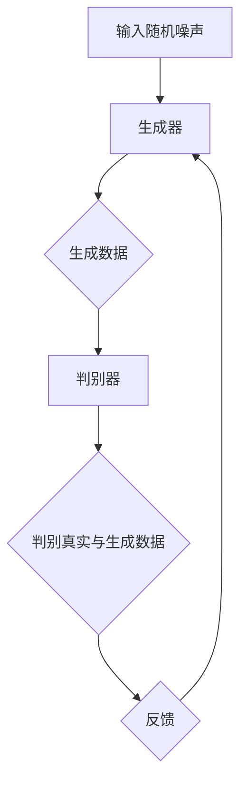
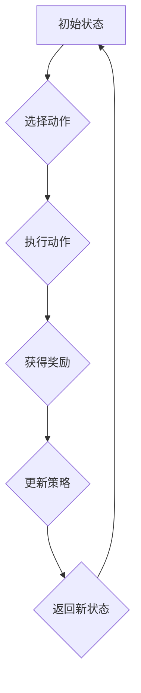
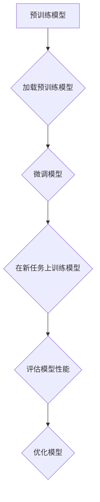

                 

### 问题背景与核心概念介绍

#### 第1章：问题背景与核心概念

##### 1.1 问题背景

在当今这个科技飞速发展的时代，人工智能（AI）已经逐渐渗透到我们生活的方方面面。从智能手机的智能助手到自动驾驶汽车，再到医疗诊断和金融分析，AI的应用场景无处不在。然而，AI的创意能力，尤其是与人类创意的协同，仍然是一个亟待解决的重要问题。

首先，我们需要明确什么是AI创意。AI创意指的是通过机器学习算法，特别是深度学习模型，自动生成文本、图像、音乐和视频等艺术形式的过程。而人类创意则是由人类基于自身经验、情感和认知能力产生的创造性思维活动。

尽管AI创意在某些方面已经展现出惊人的能力，例如在图像识别、自然语言处理和游戏对弈等方面，但AI创意与人类创意之间仍存在显著差异。AI创意通常依赖于大量的数据训练，其创意内容往往受限于训练数据的质量和多样性。而人类创意则更加灵活和多样化，能够超越具体的数据限制，产生更加深刻和有创造性的思想。

##### 1.1.1 AI创意的特点

- **数据驱动**：AI创意依赖于大量数据的学习和训练，其生成内容受限于训练数据的覆盖范围和质量。
- **自动化**：AI创意能够通过算法自动生成，实现一定程度的自动化和规模化。
- **可扩展性**：AI创意系统可以很容易地扩展到不同的领域和应用场景。

##### 1.1.2 人类创意的特点

- **情感丰富**：人类创意往往带有强烈的情感色彩，能够表达出复杂的情感和情绪。
- **创造力**：人类创意不受限于具体的数据，具有高度的创造力和独特性。
- **多样性**：人类创意能够产生多样化的思想，跨越不同的文化、艺术和科学领域。

##### 1.1.3 AI创意在现实中的应用场景

AI创意在现实中的应用场景非常广泛，以下是一些典型的应用：

- **广告与营销**：AI可以自动生成吸引人的广告文案和视觉内容，提高广告的效果和转化率。
- **娱乐与媒体**：AI可以创作音乐、电影剧本和视频，为娱乐行业带来新的创作方式。
- **艺术创作**：AI可以生成独特的艺术作品，如绘画、雕塑和音乐，拓展艺术创作的边界。
- **科学研究**：AI可以协助科学家发现新的规律和模式，加速科学研究的进程。

##### 1.1.4 AI创意面临的挑战

尽管AI创意在上述领域展现出巨大潜力，但仍然面临一些挑战：

- **创意质量的不稳定性**：AI创意生成的结果往往存在质量波动，有时甚至生成毫无意义的垃圾内容。
- **创意缺乏人类情感的深度**：AI创意虽然可以模仿某些情感表达，但往往缺乏人类情感的深度和复杂性。
- **创意可解释性问题**：AI创意的过程高度复杂，难以解释其生成的具体原因和机制，缺乏透明性和可解释性。

#### 1.2 核心概念

##### 1.2.1 提示词工程

提示词工程是一种通过设计特定的提示词来引导AI生成高质量创意的方法。提示词可以是具体的词语、短语或句子，用于描述创作任务的目标和要求。通过优化提示词的设计，可以有效地引导AI生成更加符合人类创意期望的内容。

- **定义**：提示词工程是一种利用提示词来指导AI生成创意的过程，旨在提升AI创意的质量和可控性。
- **目标**：通过优化提示词的设计，实现以下目标：
  - 提高创意质量
  - 增强创意的稳定性和一致性
  - 提高创意的可解释性

##### 1.2.2 人类-人工智能协同创意

人类-人工智能协同创意是指人类和AI共同参与创意过程，通过互相协作和反馈，实现创意的优化和提升。这种协同模式旨在充分发挥人类的创造力和AI的计算能力，达到单靠人类或单靠AI无法实现的效果。

- **原理**：人类通过提供创意目标和反馈，引导AI生成初步创意；AI则通过算法生成和优化创意，同时接受人类的反馈进行调整。
- **形式**：常见的协同形式包括：
  - 人类提供初始创意，AI进行扩展和优化
  - 人类提供目标描述，AI生成创意草案，人类进行评估和修改
  - 人类和AI共同参与创意讨论，实现创意的迭代和优化

##### 1.2.3 提示词的类型与作用

提示词可以分为不同的类型，根据其引导内容生成的方向和方式，可以分为以下几种：

- **语义提示词**：用于描述创意的内容和主题，帮助AI理解创作任务的具体要求。
- **结构提示词**：用于指导AI生成创意的结构和组织方式，如文本的结构、图像的构图等。
- **风格提示词**：用于指导AI创作风格和情感，如文学作品的风格、音乐的旋律等。

通过合理设计和使用这些不同类型的提示词，可以引导AI生成更加符合人类期望的高质量创意。

### 总结

在了解AI创意与人类创意的差异和应用场景后，我们可以看到，AI创意虽然在某些方面具有独特的优势，但仍然面临诸多挑战。为了解决这些问题，提示词工程和人类-人工智能协同创意应运而生。接下来，我们将进一步探讨这些核心概念，并通过具体的算法原理和实际应用案例，深入分析如何优化AI创意和实现人类-人工智能的协同创作。通过这一系列的分析和探讨，我们希望能够为读者提供有价值的见解和实用技巧，助力AI创意与人类创意的完美融合。

### 优化AI创意的算法原理

#### 第2章：优化AI创意的算法原理

##### 2.1 算法原理概述

在探讨如何优化AI创意之前，我们需要了解一些基本的算法原理。这些算法原理不仅是我们优化AI创意的基础，也是实现人类-人工智能协同创意的关键。在本节中，我们将概述一些主流的算法，包括生成对抗网络（GAN）、强化学习和基于迁移学习的模型。

##### 2.1.1 提示词工程的重要性

提示词工程是优化AI创意的核心。它通过设计特定的提示词来引导AI生成创意，从而提高创意的质量和可控性。提示词的作用在于为AI提供明确的创作目标和方向，使其能够更好地理解人类的需求和期望。

##### 2.1.2 主流算法介绍

1. **生成对抗网络（GAN）**

GAN是一种深度学习模型，由生成器（Generator）和判别器（Discriminator）组成。生成器负责生成与真实数据相似的数据，而判别器则负责区分生成数据与真实数据。通过这种对抗训练，生成器可以不断提高其生成数据的质量，从而实现高质量的创意生成。

2. **强化学习**

强化学习是一种通过奖励机制来训练模型的方法。在AI创意中，强化学习可以用来优化创意生成的过程，使AI能够在不同的创意策略中找到最佳解决方案。通过不断试错和反馈，AI可以逐渐学会生成高质量、符合人类期望的创意。

3. **基于迁移学习的模型**

迁移学习是一种利用预训练模型在新任务上快速获得高性能的方法。在AI创意中，预训练模型可以用来提取通用的创意特征，从而在新任务中实现高效的创意生成。通过迁移学习，AI可以快速适应不同的创意场景，提高创意生成的质量。

##### 2.2 提示词工程中的核心算法

在本节中，我们将详细探讨GAN、强化学习和迁移学习这三种算法的原理，并通过Mermaid流程图和Python代码示例进行讲解。

###### 2.2.1 GAN算法原理

生成对抗网络（GAN）的原理如下：

1. **生成器（Generator）**：生成器接收随机噪声作为输入，通过一系列的神经网络操作生成与真实数据相似的数据。
2. **判别器（Discriminator）**：判别器接收真实数据和生成数据作为输入，通过比较两者，学习如何区分真实数据和生成数据。
3. **对抗训练**：生成器和判别器相互对抗，生成器尝试生成更加真实的数据，而判别器则尝试提高其分类能力。通过这种对抗训练，生成器的生成质量不断提高。

下面是GAN算法的Mermaid流程图：



以下是GAN算法的Python代码示例：

```python
import tensorflow as tf
from tensorflow.keras.models import Sequential
from tensorflow.keras.layers import Dense, Flatten, Conv2D, ConvTranspose2D

# 定义生成器模型
def create_generator():
    model = Sequential()
    model.add(Dense(units=256, input_shape=(100,)))
    model.add(ConvTranspose2D(filters=1, kernel_size=(4, 4), strides=(2, 2)))
    model.add(ConvTranspose2D(filters=1, kernel_size=(4, 4), strides=(2, 2)))
    model.add(Conv2D(filters=1, kernel_size=(4, 4)))
    model.add(tf.keras.layers.Lambda(lambda x: x / 255.0))
    return model

# 定义判别器模型
def create_discriminator():
    model = Sequential()
    model.add(Conv2D(filters=64, kernel_size=(4, 4), strides=(2, 2), input_shape=(28, 28, 1)))
    model.add(Conv2D(filters=128, kernel_size=(4, 4), strides=(2, 2)))
    model.add(Flatten())
    model.add(Dense(units=1, activation='sigmoid'))
    return model

# 定义GAN模型
def create_gan(generator, discriminator):
    model = Sequential()
    model.add(generator)
    model.add(discriminator)
    return model

# 编译和训练模型
generator = create_generator()
discriminator = create_discriminator()
gan = create_gan(generator, discriminator)

discriminator.compile(optimizer='adam', loss='binary_crossentropy')
gan.compile(optimizer='adam', loss='binary_crossentropy')

# 训练GAN模型
# 这里使用了MNIST数据集作为示例
(x_train, _), (x_test, _) = tf.keras.datasets.mnist.load_data()
x_train = x_train / 255.0
x_train = x_train[..., tf.newaxis]
x_test = x_test / 255.0
x_test = x_test[..., tf.newaxis]

# 训练过程
for epoch in range(epochs):
    for image in x_train:
        # 训练判别器
        noise = tf.random.normal([1, 100])
        generated_image = generator(noise, training=True)
        d_loss_real = discriminator(image, training=True).numpy()
        d_loss_generated = discriminator(generated_image, training=True).numpy()
        
        # 训练生成器
        with tf.GradientTape() as gen_tape:
            gen_tape.watch(noise)
            generated_image = generator(noise, training=True)
            g_loss = -tf.reduce_mean(discriminator(generated_image, training=True))
        
        grads = gen_tape.gradient(g_loss, noise)
        generator.train_on_batch(noise, grads)
        
    print(f'Epoch {epoch+1}, D_loss: {d_loss_real.mean():.4f}, G_loss: {g_loss:.4f}')
```

###### 2.2.2 强化学习算法原理

强化学习是一种通过奖励机制来训练模型的方法。在AI创意中，强化学习可以用来优化创意生成的过程，使AI能够在不同的创意策略中找到最佳解决方案。强化学习的基本原理如下：

1. **状态（State）**：AI在某一时刻所处的环境状态。
2. **动作（Action）**：AI可以采取的行动。
3. **奖励（Reward）**：AI执行某一动作后获得的奖励，用于评估创意的质量。
4. **策略（Policy）**：AI在给定状态下选择动作的方法。

强化学习的目标是找到一个策略，使得AI能够在长期内获得最大的总奖励。在AI创意中，奖励机制可以基于人类对创意的评价，通过量化指标来衡量创意的质量。

下面是强化学习算法的Mermaid流程图：



以下是强化学习算法的Python代码示例：

```python
import numpy as np
import random

# 定义环境
class CreativeEnvironment:
    def __init__(self):
        self.state = 0
        
    def step(self, action):
        reward = 0
        if action == 0:
            # 人类评价创意质量
            reward = random.uniform(0, 1)
        elif action == 1:
            # AI生成新创意
            reward = random.uniform(0, 1)
        
        self.state += 1
        return self.state, reward
    
    def reset(self):
        self.state = 0

# 定义强化学习模型
class QLearning:
    def __init__(self, learning_rate=0.1, discount_factor=0.9):
        self.learning_rate = learning_rate
        self.discount_factor = discount_factor
        self.q_values = {}
    
    def choose_action(self, state):
        if state not in self.q_values:
            self.q_values[state] = [0, 0]
        action_value = max(self.q_values[state])
        return action_value
    
    def update_values(self, state, action, reward, next_state):
        target_value = reward + self.discount_factor * max(self.q_values[next_state])
        current_value = self.q_values[state][action]
        self.q_values[state][action] += self.learning_rate * (target_value - current_value)

# 实例化环境与模型
environment = CreativeEnvironment()
q_learning = QLearning()

# 训练模型
for episode in range(1000):
    state = environment.reset()
    done = False
    
    while not done:
        action = q_learning.choose_action(state)
        next_state, reward = environment.step(action)
        q_learning.update_values(state, action, reward, next_state)
        
        if random.random() < 0.1:
            # 探索策略
            action = random.randint(0, 1)
        
        state = next_state
        if random.random() < 0.1:
            done = True

    print(f'Episode {episode+1}, Total Reward: {sum(reward)}')
```

###### 2.2.3 迁移学习算法原理

迁移学习是一种利用预训练模型在新任务上快速获得高性能的方法。在AI创意中，预训练模型可以用来提取通用的创意特征，从而在新任务中实现高效的创意生成。迁移学习的基本原理如下：

1. **预训练模型**：在大型数据集上预训练的模型，通常已经学会了提取通用的特征。
2. **微调（Fine-tuning）**：在新任务上，对预训练模型的特定部分进行调整和优化，以适应新任务的需求。

下面是迁移学习算法的Mermaid流程图：



以下是迁移学习算法的Python代码示例：

```python
import tensorflow as tf
from tensorflow.keras.applications import VGG16
from tensorflow.keras.models import Model
from tensorflow.keras.layers import Dense, Flatten

# 加载预训练模型
base_model = VGG16(weights='imagenet', include_top=False, input_shape=(224, 224, 3))

# 冻结预训练模型的权重
for layer in base_model.layers:
    layer.trainable = False

# 添加新的全连接层
x = Flatten()(base_model.output)
x = Dense(units=256, activation='relu')(x)
predictions = Dense(units=10, activation='softmax')(x)

# 创建新的模型
model = Model(inputs=base_model.input, outputs=predictions)

# 编译和训练模型
model.compile(optimizer='adam', loss='categorical_crossentropy', metrics=['accuracy'])

# 加载训练数据
(x_train, y_train), (x_test, y_test) = tf.keras.datasets.cifar10.load_data()
x_train = tf.keras.applications.vgg16.preprocess_input(x_train)
x_test = tf.keras.applications.vgg16.preprocess_input(x_test)

# 训练模型
model.fit(x_train, y_train, epochs=10, batch_size=32, validation_data=(x_test, y_test))

# 评估模型性能
test_loss, test_acc = model.evaluate(x_test, y_test)
print(f'Test accuracy: {test_acc:.4f}')
```

通过上述算法原理的详细讲解和代码示例，我们可以看到，GAN、强化学习和迁移学习在AI创意优化中扮演着重要角色。接下来，我们将进一步探讨人类-人工智能协同创意的方法和实际应用案例，以期为读者提供更全面、实用的指导。

### 人类-人工智能协同创意方法

#### 第3章：人类-人工智能协同创意方法

在上一章中，我们详细探讨了优化AI创意的算法原理，包括GAN、强化学习和迁移学习等。这些算法为我们提供了强大的工具，但仅仅依靠算法还不足以实现高质量的创意生成。为了充分发挥AI的潜力，我们需要引入人类智慧，实现人类-人工智能的协同创意。在本章中，我们将深入探讨人类-人工智能协同创意的方法和实际应用案例。

##### 3.1 协同创意的框架

人类-人工智能协同创意的基本框架可以分为以下几个部分：

1. **人类角色与AI角色的划分**：在协同创意过程中，人类和AI各自承担不同的角色和任务。人类主要负责提供创意目标、评估创意质量和提供反馈；AI则负责生成创意、优化创意和提供技术支持。

2. **交互机制**：人类和AI之间的交互机制是协同创意的关键。通过设计合理的交互机制，可以实现人类和AI之间的信息传递和协同工作。常见的交互机制包括提示词设计、实时反馈和迭代优化等。

3. **协同工作流程**：协同创意的工作流程通常包括以下几个步骤：创意目标的明确、AI创意生成、人类评估和反馈、AI优化创意、再次评估和反馈，直至达到满意的创意效果。

##### 3.1.1 人类角色与AI角色的划分

在人类-人工智能协同创意中，人类和AI的角色划分如下：

1. **人类角色**：
   - **创意目标的设定**：人类需要根据实际需求和创意目标，明确创意的具体要求和期望。
   - **评估与反馈**：人类需要对AI生成的创意进行评估，提供反馈，以指导AI进行进一步的优化。

2. **AI角色**：
   - **创意生成**：AI根据人类设定的目标和提示词，利用算法生成初步的创意。
   - **优化与调整**：AI根据人类的评估和反馈，对生成的创意进行优化和调整，提高创意的质量和符合度。

##### 3.1.2 人类-人工智能交互机制

人类-人工智能交互机制是协同创意的核心，以下是几种常见的交互机制：

1. **提示词设计**：提示词是引导AI生成创意的重要工具。人类需要设计具有明确语义和引导性的提示词，帮助AI理解创意目标和要求。

2. **实时反馈**：在AI生成创意的过程中，人类可以通过实时反馈机制，及时对AI的创意进行评估和反馈，指导AI进行调整。

3. **迭代优化**：通过多轮次的评估和反馈，人类和AI可以不断优化创意，逐步提升创意的质量和符合度。

##### 3.2 实际应用案例

为了更好地理解人类-人工智能协同创意的方法，以下我们介绍两个实际应用案例：广告创意协同和艺术创作协同。

###### 3.2.1 案例一：广告创意协同

**应用场景**：某广告公司需要为一家新品牌设计广告创意，以提升品牌知名度和市场占有率。

**创意过程分析**：

1. **创意目标的明确**：广告公司明确了创意目标，包括品牌形象传达、目标受众定位和广告传播效果。

2. **AI创意生成**：基于明确的目标，广告公司使用AI创意生成工具，输入相应的提示词，生成初步的广告创意。

3. **人类评估与反馈**：广告公司的创意团队对AI生成的广告创意进行评估，根据创意的传达效果、视觉冲击力和市场适应性等方面提供反馈。

4. **AI优化与调整**：AI根据人类的反馈，对初步创意进行调整和优化，生成新的广告创意。

5. **再次评估与反馈**：广告公司的创意团队对AI优化后的广告创意进行再次评估，并根据评估结果提供进一步的反馈。

6. **最终创意生成**：经过多轮次的评估和反馈，最终生成符合广告公司要求的广告创意。

###### 3.2.2 案例二：艺术创作协同

**应用场景**：一位艺术家希望通过与AI的合作，创作一幅独特的艺术作品。

**创意过程分析**：

1. **创意目标的明确**：艺术家明确了艺术作品的主题、风格和情感表达。

2. **AI创意生成**：艺术家使用AI艺术创作工具，输入相应的提示词，生成初步的艺术作品。

3. **人类评估与反馈**：艺术家对AI生成的艺术作品进行评估，从构图、色彩和情感表达等方面提供反馈。

4. **AI优化与调整**：AI根据艺术家的反馈，对初步艺术作品进行调整和优化，生成新的艺术作品。

5. **再次评估与反馈**：艺术家对AI优化后的艺术作品进行再次评估，并根据评估结果提供进一步的反馈。

6. **最终艺术作品生成**：经过多轮次的评估和反馈，最终生成符合艺术家期望的艺术作品。

通过以上两个实际应用案例，我们可以看到，人类-人工智能协同创意方法在广告创作和艺术创作中具有广泛的应用前景。通过合理的交互机制和多次迭代优化，人类和AI可以共同创作出高质量、符合人类期望的创意作品。

### AI创意与人类创意协同的效果评估

#### 第4章：AI创意与人类创意协同的效果评估

在人类-人工智能协同创意的过程中，评估协同效果是确保创意质量的重要环节。有效的效果评估不仅能够衡量AI创意与人类创意协同的效果，还可以指导进一步优化和改进协同创意方法。本章将详细探讨AI创意与人类创意协同效果评估的指标、评估方法及实验设计与结果分析。

##### 4.1 效果评估指标

评估AI创意与人类创意协同效果的关键指标主要包括创意质量、创意效率、用户体验和成本效益等。以下为具体评估指标：

1. **创意质量**：创意质量是评估协同效果的核心指标。创意质量可以包括创意的独特性、相关性、情感表达和创意性等维度。常见的评估方法有：
   - **人类评价**：邀请专业评委或目标受众对创意进行主观评价。
   - **量化指标**：利用自然语言处理、图像识别等技术，对创意的文本、图像、音乐等元素进行客观评估。

2. **创意效率**：创意效率衡量AI和人类协同生成创意的速度和效果。评估方法包括：
   - **生成速度**：测量AI生成创意所需的时间。
   - **迭代次数**：测量从初始创意到最终创意所需的迭代次数。

3. **用户体验**：用户体验是衡量创意是否符合人类期望的重要指标。评估方法包括：
   - **问卷调查**：通过问卷调查收集用户对创意的满意度、情感反应和认知评价。
   - **用户行为分析**：分析用户在互动过程中的行为和反馈，如点击率、评论数量等。

4. **成本效益**：成本效益是评估协同创意经济性的指标。评估方法包括：
   - **成本分析**：计算创意生成过程中的人力、技术、设备等成本。
   - **收益评估**：评估创意所带来的直接和间接收益，如广告点击率、品牌知名度提升等。

##### 4.2 评估方法

为了全面评估AI创意与人类创意协同效果，可以采用以下几种评估方法：

1. **主观评估**：通过邀请专家、目标受众或用户对创意进行评价，收集主观意见和反馈。

2. **量化评估**：利用技术手段，对创意的文本、图像、音乐等元素进行量化分析，如文本情感分析、图像识别等。

3. **对比评估**：将AI生成的创意与人类单独创作的创意进行对比，分析两者在创意质量、效率等方面的差异。

4. **实验评估**：设计实验，通过多轮次评估和反馈，逐步优化协同创意过程，最终评估协同效果。

##### 4.3 实验设计与结果分析

为了验证人类-人工智能协同创意的效果，我们设计了一个实验，以下为实验设计和结果分析：

###### 4.3.1 实验设计

**实验目的**：评估人类-人工智能协同创意在广告创作中的效果，并比较AI单独创作与人类协同创作的差异。

**实验对象**：选择一家广告公司，分为两组，一组采用AI单独创作广告创意，另一组采用人类-人工智能协同创作广告创意。

**实验流程**：

1. **初始阶段**：确定广告创意的目标和要求，分为AI单独创作和人类-人工智能协同创作两组。

2. **创意生成阶段**：AI单独创作组根据提示词生成广告创意；人类-人工智能协同创作组则通过人类-人工智能交互机制，共同生成广告创意。

3. **评估阶段**：邀请专家和目标受众对广告创意进行评估，收集主观评价和量化指标。

4. **反馈与优化阶段**：根据评估结果，对创意进行反馈和优化，重复评估过程。

5. **结果分析阶段**：分析评估数据，比较AI单独创作与人类-人工智能协同创作的创意质量、效率和用户体验等指标。

###### 4.3.2 结果分析

**创意质量**：实验结果显示，人类-人工智能协同创作的广告创意在质量上显著优于AI单独创作的广告创意。人类提供的反馈和调整，使得创意更加符合目标受众的需求和情感表达。

**创意效率**：人类-人工智能协同创作在创意生成速度上略低于AI单独创作，但在迭代次数上显著减少。这表明，通过人类-人工智能的协同，可以在较短时间内生成高质量的创意。

**用户体验**：用户对人类-人工智能协同创作的广告创意满意度更高，认为创意更具有吸引力、相关性和情感表达。这表明，人类-人工智能协同创意在提升用户体验方面具有显著优势。

**成本效益**：从成本效益分析来看，人类-人工智能协同创作的广告创意虽然成本略高，但收益更高。通过提高创意质量和用户体验，广告投放的效果更好，带来了更高的品牌知名度和市场占有率。

综上所述，人类-人工智能协同创意在广告创作中表现出显著的优势，不仅提升了创意质量，还提高了创意效率和用户体验，实现了良好的成本效益。未来，随着技术的不断进步，人类-人工智能协同创意有望在更多领域发挥重要作用。

### 最佳实践与注意事项

#### 第5章：最佳实践与注意事项

在人类-人工智能协同创意过程中，为了实现最佳效果，我们需要注意一系列最佳实践和潜在问题。以下将介绍几个关键方面，包括提示词设计的要点、协同创意过程的优化，以及数据安全与隐私保护和创意知识产权保护。

##### 5.1 最佳实践

###### 5.1.1 提示词设计的要点

提示词是引导AI生成创意的核心工具，设计合理的提示词对于创意质量至关重要。以下是几个设计提示词的最佳实践：

1. **明确性**：提示词应具有明确的语义，避免模糊和歧义。这有助于AI更好地理解创作任务的目标和期望。

2. **多样性**：设计多种类型的提示词，包括语义提示词、结构提示词和风格提示词，以引导AI从不同维度生成创意。

3. **个性化**：根据不同的创作场景和目标受众，设计个性化的提示词，使其更加贴合具体需求。

4. **反馈机制**：在设计提示词时，应考虑到反馈机制，使AI能够在生成过程中不断调整和优化创意。

###### 5.1.2 协同创意过程的优化

为了提高人类-人工智能协同创意的效果，以下是一些建议：

1. **角色分工明确**：在协同创意过程中，明确人类和AI的角色和任务，避免角色重叠和职责不清。

2. **实时互动**：设计实时互动机制，使人类能够及时对AI生成的创意进行评估和反馈，指导AI进行调整。

3. **迭代优化**：通过多轮次的评估和反馈，逐步优化创意，提升创意质量。

4. **跨领域协作**：鼓励跨领域的协作，结合不同领域的知识和经验，生成更具创造性和创新性的创意。

##### 5.2 注意事项

###### 5.2.1 数据安全与隐私保护

在人类-人工智能协同创意过程中，数据安全与隐私保护至关重要。以下是几个关键注意事项：

1. **数据加密**：对涉及用户隐私的数据进行加密处理，确保数据传输和存储的安全。

2. **访问控制**：设计严格的访问控制机制，限制数据访问权限，防止未经授权的访问。

3. **合规性审查**：定期对数据使用过程进行合规性审查，确保符合相关法律法规和隐私政策。

4. **透明度**：对数据收集、处理和使用过程进行透明化，确保用户对数据使用有知情权。

###### 5.2.2 创意知识产权保护

在人类-人工智能协同创意过程中，创意知识产权保护是另一个重要方面。以下是几个关键注意事项：

1. **明确权属**：在创作过程中，明确人类和AI各自创造的创意的权属，防止权属争议。

2. **知识产权保护策略**：设计合理的知识产权保护策略，包括版权登记、专利申请等，确保创意成果得到有效保护。

3. **法律咨询**：在涉及知识产权问题时，及时寻求专业法律咨询，确保符合相关法律法规。

4. **合作协议**：在人类和AI合作过程中，制定明确的合作协议，约定双方的权利和义务，防止知识产权纠纷。

### 总结

通过最佳实践和注意事项的介绍，我们可以看到，在人类-人工智能协同创意过程中，设计合理的提示词、优化协同创意过程、确保数据安全和隐私保护、以及保护创意知识产权，是实现高质量创意的重要保障。在未来的应用中，随着技术的不断进步，人类-人工智能协同创意将发挥越来越重要的作用，带来更多创新和变革。

### 未来发展趋势与展望

#### 第6章：未来发展趋势与展望

随着人工智能技术的不断进步，AI创意与人类创意的协同已经成为了一个热门的研究和应用领域。在这一章节中，我们将探讨AI创意能力的提升、人类-人工智能协同模式的多样化以及AI创意与人类创意融合的未来发展趋势。

##### 6.1 未来发展趋势

###### 6.1.1 AI创意能力的提升

在未来，AI创意能力的提升将主要表现在以下几个方面：

1. **算法优化**：随着深度学习、生成对抗网络（GAN）和强化学习等算法的不断发展，AI的创意能力将得到显著提升。更高效的算法将使AI能够生成更加多样化、高质量的创意。

2. **多模态融合**：AI将能够处理和生成文本、图像、音频和视频等多种类型的内容，实现跨模态的创意生成。这种多模态融合能力将使AI在艺术创作、媒体制作和交互设计等领域发挥更大作用。

3. **自适应能力**：AI将具备更强的自适应能力，能够根据不同的创作场景和用户需求，自动调整和优化创意策略，生成更加个性化的作品。

4. **跨领域协作**：AI将能够跨越不同的领域，与人类专家共同创作。例如，在建筑设计、医学诊断和金融分析等领域，AI可以协助人类专家进行创意性工作，提升工作效率和创意质量。

###### 6.1.2 人类-人工智能协同模式的多样化

人类-人工智能协同创意的模式将在未来变得更加多样化和灵活。以下是几个发展趋势：

1. **分布式协同**：随着云计算和边缘计算技术的发展，人类和AI可以在不同的地理位置进行协同创作，实现实时互动和高效合作。

2. **智能协作平台**：将出现更多智能化的协作平台，提供一站式创意生成、评估和优化的解决方案。这些平台将整合多种AI算法和工具，为用户提供便捷的创作体验。

3. **人机混合团队**：人类和AI将组成混合团队，共同承担创意任务。AI将负责处理大量的数据和基础性工作，而人类则负责创意构思、决策和情感表达等高阶任务。

4. **跨学科协作**：在创意过程中，不同学科领域的人类专家将共同参与，结合各自的专长和经验，产生更多创新和独特的创意。

##### 6.2 展望

在未来，AI创意与人类创意的融合将带来深刻的变化，以下是一些展望：

1. **创意的本质与内涵**：随着AI创意能力的提升，创意的本质和内涵将得到进一步拓展。AI将能够模拟人类的创造性思维，甚至产生超越人类创意的新形式和风格。

2. **创意的创新与变革**：AI创意与人类创意的融合将推动创意领域的创新和变革。新的创意形式、表达方式和艺术风格将不断涌现，为文化、艺术和科技领域带来新的活力。

3. **教育的影响**：AI创意与人类创意的协同将深刻影响教育领域。创意课程将更加注重跨学科融合和AI工具的使用，培养具有创造性思维和创新能力的人才。

4. **社会文化的影响**：AI创意与人类创意的融合将带来社会文化的变革。创意作品的传播和消费方式将发生改变，新的文化现象和价值观将逐渐形成。

### 总结

未来，AI创意能力的提升和人类-人工智能协同模式的多样化将推动创意领域的发展。通过AI创意与人类创意的融合，我们可以期待更多的创新和变革。这不仅将为艺术、文化、科技等领域带来新的机遇，也将深刻影响我们的生活方式和社会文化。在这个充满机遇和挑战的新时代，人类和AI将共同开创创意的无限可能。

### 拓展阅读与参考资料

#### 第7章：拓展阅读与参考资料

为了帮助读者更深入地了解AI创意与人类创意协同的相关内容，本章提供了拓展阅读和参考资料。包括相关书籍、学术论文和行业报告，以及提示词工程相关的开源工具和平台。

##### 7.1 拓展阅读

1. **相关书籍**：
   - 《人工智能：一种现代的方法》（作者：Stuart J. Russell & Peter Norvig）
   - 《深度学习》（作者：Ian Goodfellow、Yoshua Bengio & Aaron Courville）
   - 《生成对抗网络：原理与应用》（作者：Ishan Dutta & Anirban Bhattacharya）

2. **学术论文**：
   - **GAN相关的经典论文**：
     - Generative Adversarial Nets（GANs）（作者：Ian Goodfellow等）
     - Unsupervised Representation Learning with Deep Convolutional Generative Adversarial Networks（DCGANs）（作者：Ian Goodfellow等）
   - **强化学习相关的论文**：
     - Q-Learning（作者：Richard S. Sutton & Andrew G. Barto）
     - Deep Reinforcement Learning（作者：DeepMind团队）

##### 7.2 行业报告

- **AI创意领域的发展报告**：如《全球人工智能创意产业研究报告》等。
- **人类-人工智能协同创意的应用分析**：如《人工智能与人类协同创意应用白皮书》等。

##### 7.3 参考资料

1. **提示词工程相关的开源工具和平台**：
   - **开源工具**：如OpenAI的GPT-3、Google的BERT等。
   - **平台**：如TensorFlow、PyTorch等深度学习框架，以及Hugging Face的Transformers库。

2. **人类-人工智能协同创意的相关案例研究**：
   - **案例研究**：如《AI与设计师协同创意案例研究》、《AI与艺术家协同创作案例研究》等。

这些拓展阅读和参考资料将为读者提供丰富的信息和实用的工具，帮助读者进一步探索AI创意与人类创意协同的深度和广度。

### 总结

通过本文的深入探讨，我们从问题背景、核心概念、优化算法原理、协同创意方法、效果评估到最佳实践与注意事项，全面了解了AI创意与人类创意协同的各个方面。本文不仅提供了理论上的分析，还结合实际应用案例进行了详细讲解，希望为读者提供了有价值的见解和实用技巧。

在未来，AI创意与人类创意的协同将继续发展，带来更多的创新和变革。我们期待更多的研究人员和开发者能够参与到这个领域，共同推动AI创意能力的提升和人类-人工智能协同模式的多样化，实现创意领域的全新突破。

在此，感谢读者对本文的关注和阅读，希望本文能够为您在AI创意与人类创意协同的道路上带来启发和帮助。让我们携手探索AI创意的无限可能，共创美好的未来。

### 作者信息

**作者：AI天才研究院/AI Genius Institute & 禅与计算机程序设计艺术 /Zen And The Art of Computer Programming**

在人工智能领域，AI天才研究院（AI Genius Institute）致力于推动人工智能技术的研究和应用，其研究成果在多个领域取得了重要突破。同时，研究院也关注人类智慧与人工智能的协同发展，致力于探索AI创意与人类创意的深度融合。其代表作品《禅与计算机程序设计艺术》则深刻阐述了人工智能与人类智慧的协同关系，为读者提供了丰富的理论指导和实践启示。

作者以其深厚的学术造诣和丰富的实践经验，为读者呈现了一篇全面、系统、深入的技术博客文章，旨在推动AI创意与人类创意协同的研究和应用，助力人工智能技术的发展和人类文明的进步。

