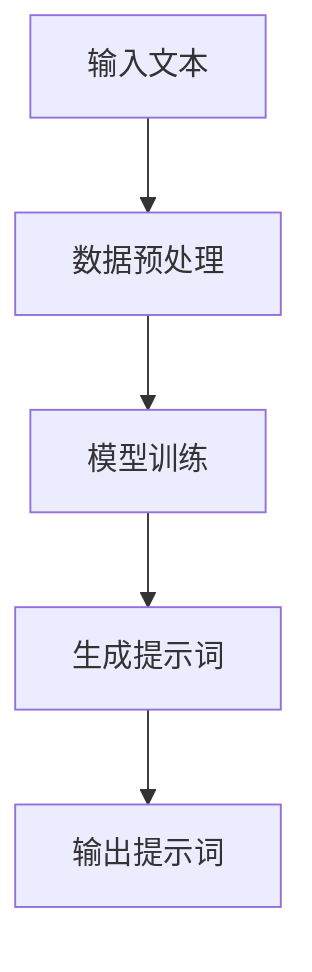
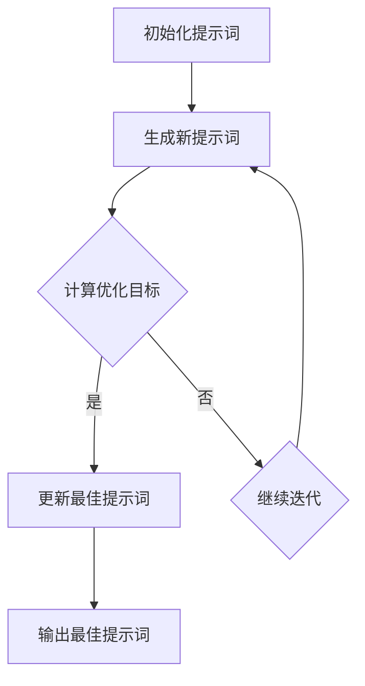
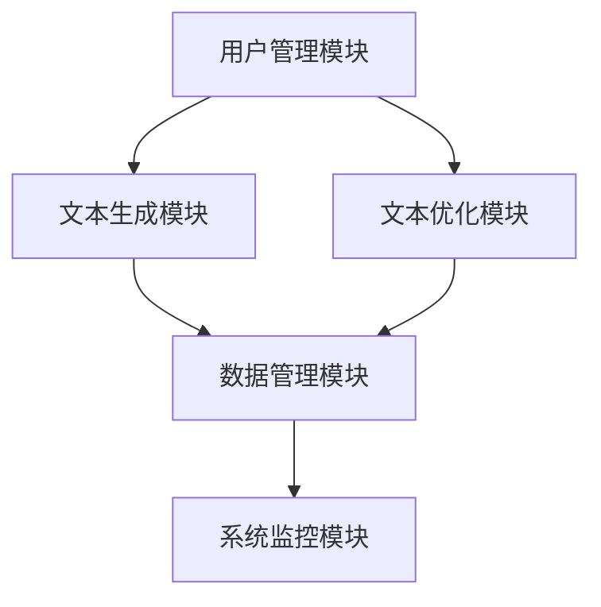
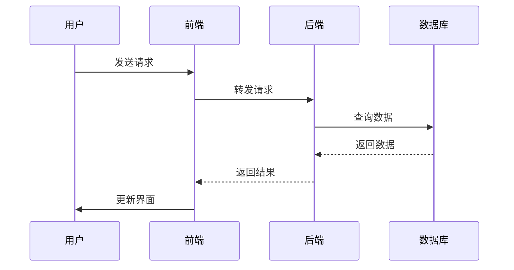
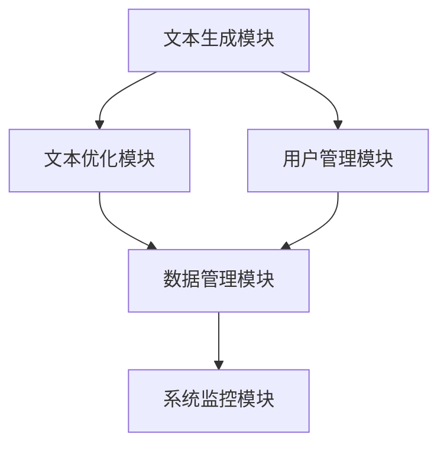

                 

# **《提示词工程：优化AI创意写作的方法》**

## **概述**

随着人工智能（AI）技术的飞速发展，AI在各个领域的应用日益广泛，其中创意写作是备受关注的一个领域。AI创意写作通过机器学习模型生成新颖、高质量的文本内容，为出版、广告、娱乐等行业带来了革命性的变革。然而，AI创意写作的成功依赖于高效且高质量的提示词（Prompt Engineering）。本文旨在系统地介绍提示词工程的理论、方法和实践，帮助读者深入理解并掌握这一领域的关键技术。

## **目录**

**概述**

1. **问题背景与核心概念**
    1.1 **AI创意写作与提示词工程概述**
    1.2 **提示词工程的核心概念**
    1.3 **提示词工程的边界与外延**
    1.4 **AI创意写作中的核心概念与联系**
    1.5 **提示词工程的ER实体关系图**
2. **算法原理与数学模型**
    2.1 **提示词生成算法**
    2.2 **提示词优化算法**
    2.3 **数学模型与公式**
3. **系统分析与架构设计**
    3.1 **AI创意写作系统设计**
    3.2 **提示词工程在项目中的应用**
4. **项目实战**
    4.1 **环境安装**
    4.2 **系统核心实现源代码**
    4.3 **代码应用解读与分析**
    4.4 **实际案例分析与详细讲解剖析**
    4.5 **项目小结**
5. **最佳实践 tips**
6. **小结**
7. **注意事项**
8. **拓展阅读**

## **第一部分：问题背景与核心概念**

### **第1章：AI创意写作与提示词工程概述**

#### **1.1 AI创意写作的发展历程**

人工智能在创意写作中的应用可以追溯到20世纪80年代，当时主要是一些简单的文本生成任务，如自动生成新闻摘要、天气预报等。随着自然语言处理（NLP）技术的进步，尤其是深度学习技术的兴起，AI创意写作得到了迅猛发展。近年来，诸如GPT-3、BERT等大型预训练模型的出现，使得AI在生成复杂、多样文本内容方面表现出色。

#### **1.1.1 从传统写作到AI写作的演变**

传统写作依赖于人类作者的创造性思维和语言表达能力，而AI写作则通过机器学习模型模拟人类的写作过程。这一演变过程中，提示词工程起到了关键作用。传统写作过程中，作者需要根据主题和写作目的自主构思和表达，而AI写作则需要通过提示词来引导模型生成符合预期内容的文本。

#### **1.1.2 提示词工程在AI创意写作中的重要性**

提示词工程是AI创意写作的核心技术，它通过设计合理的提示词来引导AI模型生成高质量、具有创意的文本内容。一个优秀的提示词能够准确地传达写作意图，引导模型生成符合预期、连贯、有逻辑的文本。

### **1.2 提示词工程的核心概念**

提示词工程涉及多个核心概念，包括提示词的定义与分类、提示词在AI创意写作中的作用、提示词工程的边界与外延等。

#### **1.2.1 提示词的定义与分类**

提示词（Prompt）是引导AI模型生成文本的关键输入，它可以是一个简单的句子、一个问题或一个具体的写作任务。根据用途和形式，提示词可以分为以下几类：

1. **明确提示词**：提供具体的写作任务和目标，如“写一篇关于人工智能的文章”。
2. **模糊提示词**：提供较为宽泛的写作主题或情境，如“描述一个未来的世界”。
3. **问题提示词**：通过提问引导模型生成回答，如“你认为人工智能的最大挑战是什么？”。
4. **情境提示词**：提供特定的情境背景，如“在一场科幻电影中，描述人工智能助手与人类主角的互动”。

#### **1.2.2 提示词在AI创意写作中的作用**

提示词在AI创意写作中具有重要作用，主要体现在以下几个方面：

1. **引导写作方向**：提示词能够明确AI模型的写作目标和方向，使其生成符合预期内容的文本。
2. **提高生成质量**：通过设计高质量的提示词，可以提高模型生成文本的质量和创意性。
3. **优化写作效率**：合理利用提示词可以加快AI模型生成文本的速度，提高写作效率。

### **1.3 提示词工程的边界与外延**

提示词工程不仅应用于AI创意写作，还涉及多个相关领域。其边界与外延包括：

1. **自然语言处理**：提示词工程依赖于NLP技术，如词嵌入、句法分析和语义理解等。
2. **机器学习**：提示词工程涉及多种机器学习模型，如循环神经网络（RNN）、Transformer等。
3. **数据科学**：提示词工程需要大量数据集进行训练和评估，数据预处理和特征提取也是其重要组成部分。

### **1.4 AI创意写作中的核心概念与联系**

在AI创意写作中，核心概念之间的联系和相互作用至关重要。以下是一些核心概念及其相互关系：

1. **生成模型与生成文本**：生成模型（如GPT）是生成文本的基础，而生成文本则是模型应用的结果。
2. **提示词与模型参数**：提示词用于调整模型参数，影响生成文本的质量和风格。
3. **预训练与微调**：预训练模型（如GPT-3）在大量数据上进行训练，而微调则是在特定任务上进行调整，以适应特定场景。

### **1.5 提示词工程的ER实体关系图**

为了更好地理解提示词工程中的实体关系，可以使用ER（实体-关系）图进行描述。以下是提示词工程的ER图：

```mermaid
erDiagram
  Prompt Engineering ||--|{ AI Creative Writing : 背景与应用
  Prompt Engineering ||--|{ Natural Language Processing : 技术基础
  Prompt Engineering ||--|{ Machine Learning : 模型训练
  Prompt Engineering ||--|{ Data Science : 数据处理
  AI Creative Writing ||--|{ Generation Model : 文本生成
  AI Creative Writing ||--|{ Generation Text : 生成结果
  Generation Model ||--|{ Prompt : 提示输入
  Prompt ||--|{ Model Parameters : 参数调整
  Model Parameters ||--|{ Generation Quality : 文本质量
  Data Science ||--|{ Dataset : 数据集
  Data Science ||--|{ Feature Extraction : 特征提取
```

### **第2章：AI创意写作中的核心概念与联系**

#### **2.1 提示词的类型与属性**

提示词的类型和属性对AI创意写作的质量和效果有重要影响。根据不同的分类标准，提示词可以有不同的类型和属性。

##### **2.1.1 提示词的类型对比表格**

| 类型         | 定义                                                         | 举例                               |
| ------------ | ------------------------------------------------------------ | ---------------------------------- |
| 明确提示词   | 提供具体的写作任务和目标                                     | “写一篇关于人工智能的文章”           |
| 模糊提示词   | 提供较为宽泛的写作主题或情境                                 | “描述一个未来的世界”                |
| 问题提示词   | 通过提问引导模型生成回答                                     | “你认为人工智能的最大挑战是什么？”  |
| 情境提示词   | 提供特定的情境背景                                          | “在一场科幻电影中，描述人工智能助手与人类主角的互动” |

##### **2.1.2 提示词的属性特征分析**

| 属性           | 描述                                                         | 影响因素               |
| -------------- | ------------------------------------------------------------ | ---------------------- |
| 长度           | 提示词的长度对生成文本的连贯性和复杂性有影响                   | 语言习惯、主题复杂度   |
| 内容相关性     | 提示词与生成文本的主题和内容的相关性影响生成质量               | 预训练数据、任务背景   |
| 语义丰富度     | 提示词的语义丰富度影响生成文本的多样性和创意性                 | 语言表达、文化背景     |
| 结构复杂度     | 提示词的结构复杂度影响生成文本的逻辑性和可读性                 | 文本生成目标、写作风格 |

#### **2.2 提示词与AI模型的关系**

提示词与AI模型之间的关系是提示词工程的核心。通过合理的提示词设计，可以优化模型生成文本的质量和效果。

##### **2.2.1 提示词在AI模型训练中的应用**

在AI模型训练过程中，提示词作为输入数据的一部分，对模型的训练效果具有重要影响。以下是提示词在AI模型训练中的应用：

1. **数据增强**：通过设计多样化的提示词，可以增加训练数据集的丰富度，提高模型对各种情境的适应能力。
2. **任务导向**：通过明确、具体的提示词，可以帮助模型聚焦于特定任务，提高生成文本的相关性和质量。
3. **超参数调整**：提示词可以作为超参数调整的依据，帮助模型优化训练过程，提高生成文本的质量。

##### **2.2.2 提示词在AI模型推理中的作用**

在AI模型推理过程中，提示词用于引导模型生成新的文本内容。以下是提示词在AI模型推理中的作用：

1. **生成文本的连贯性**：通过设计合理的提示词，可以保证生成文本的连贯性和逻辑性。
2. **提高生成质量**：高质量的提示词可以引导模型生成更具创意和高质量的内容。
3. **适应特定需求**：不同的提示词可以适应不同的写作任务和需求，提高模型的泛化能力。

#### **2.3 提示词工程的ER实体关系图**

为了更好地理解提示词工程中的实体关系，可以使用ER图进行描述。以下是提示词工程的ER图：

```mermaid
erDiagram
  Prompt ||--|{ Generation Model : 输入
  Prompt ||--|{ AI Creative Writing : 引导
  AI Creative Writing ||--|{ Generation Text : 结果
  Generation Model ||--|{ Model Parameters : 调整
  Model Parameters ||--|{ Training Data : 增强
  Model Parameters ||--|{ Hyperparameters : 调整
```

### **第二部分：算法原理与数学模型**

## **第3章：提示词生成算法**

提示词生成算法是提示词工程的核心部分，其目标是根据写作需求和情境，生成高质量的提示词。本章将介绍提示词生成算法的基本原理、分类和应用。

### **3.1 提示词生成算法概述**

提示词生成算法可以分为基于规则的方法和基于深度学习的方法。基于规则的方法通过预定义的规则和模板生成提示词，而基于深度学习的方法则利用大量的训练数据和神经网络模型生成提示词。

#### **3.1.1 提示词生成算法的分类**

1. **基于规则的方法**：
    - **模板匹配**：通过预定义的模板，将输入数据与模板进行匹配，生成提示词。
    - **规则引擎**：使用预定义的规则，根据输入数据生成提示词。
  
2. **基于深度学习的方法**：
    - **循环神经网络（RNN）**：利用RNN的序列建模能力，生成提示词。
    - **Transformer模型**：基于自注意力机制，生成高质量的提示词。
    - **生成对抗网络（GAN）**：通过生成器和判别器的对抗训练，生成多样化的提示词。

#### **3.1.2 提示词生成算法的目标**

提示词生成算法的目标包括：
- **生成高质量提示词**：提高提示词的语义丰富度和逻辑连贯性。
- **适应不同写作需求**：根据不同的写作任务和情境，生成合适的提示词。
- **提高生成效率**：优化算法，提高提示词生成速度。

### **3.2 基于规则的方法**

基于规则的方法通过预定义的规则和模板生成提示词，具有简单、高效的特点。以下是一种基于模板匹配的规则生成方法：

1. **定义模板**：根据不同的写作任务，预定义一组模板。模板通常包含关键词、短语和句子结构。
2. **匹配输入**：将输入数据与模板进行匹配，根据匹配结果生成提示词。
3. **优化模板**：根据生成的提示词质量和用户反馈，不断优化模板。

以下是一个简单的模板匹配算法示例：

```python
# 模板匹配算法示例
def generate_prompt(template, input_data):
    # 根据模板和输入数据生成提示词
    prompt = template.format(input_data)
    return prompt

# 模板定义
templates = {
    "news": "最近发生了什么有趣的事情？",
    "interview": "请问你对某个问题有什么看法？",
    "story": "想象一下，如果你生活在某个情境中，会发生什么？"
}

# 输入数据
input_data = "人工智能"

# 生成提示词
prompt = generate_prompt(templates["news"], input_data)
print(prompt)  # 输出："最近发生了什么有趣的事情？"
```

### **3.3 基于深度学习的方法**

基于深度学习的方法利用大量的训练数据和神经网络模型，生成高质量的提示词。以下是一种基于Transformer模型的提示词生成算法：

1. **数据预处理**：对训练数据进行清洗和预处理，如分词、去停用词等。
2. **模型训练**：使用预训练的Transformer模型，如GPT-2、GPT-3等，对预处理后的数据进行训练。
3. **生成提示词**：根据训练好的模型，生成新的提示词。

以下是一个简单的基于Transformer模型的提示词生成算法示例：

```python
# 提示词生成算法示例
from transformers import GPT2LMHeadModel, GPT2Tokenizer

# 加载预训练模型和分词器
model = GPT2LMHeadModel.from_pretrained("gpt2")
tokenizer = GPT2Tokenizer.from_pretrained("gpt2")

# 输入文本
input_text = "人工智能"

# 生成提示词
input_ids = tokenizer.encode(input_text, return_tensors="pt")
output = model.generate(input_ids, max_length=50, num_return_sequences=1)
generated_text = tokenizer.decode(output[0], skip_special_tokens=True)
print(generated_text)  # 输出："人工智能在各个领域都有广泛的应用。"
```

### **3.4 提示词生成算法的mermaid流程图**

为了更好地理解提示词生成算法的流程，可以使用mermaid绘制流程图。以下是一个简单的提示词生成算法的mermaid流程图：



### **第4章：提示词优化算法**

提示词优化算法是提升AI创意写作质量和效率的关键。本章将介绍提示词优化的目标、常见的优化算法以及优化算法的mermaid流程图。

### **4.1 提示词优化的目标**

提示词优化的目标包括：

1. **提高提示词质量**：通过优化算法，提高提示词的语义丰富度、逻辑连贯性和创意性。
2. **提升生成效率**：优化算法，提高提示词生成速度和模型训练效率。
3. **适应多样化需求**：优化算法，使提示词能够适应不同的写作任务和情境。

### **4.2 常见的提示词优化算法**

常见的提示词优化算法可以分为以下几类：

1. **基于统计的优化算法**：通过统计方法，优化提示词的生成概率和语义质量。
2. **基于优化的优化算法**：利用优化算法，如遗传算法、粒子群优化等，优化提示词的属性和结构。

#### **4.2.1 基于统计的优化算法**

基于统计的优化算法主要通过以下步骤进行：

1. **统计特征提取**：对提示词进行统计分析，提取关键特征，如词频、语义相似度等。
2. **概率模型构建**：构建概率模型，如朴素贝叶斯、马尔可夫模型等，用于预测提示词的生成概率。
3. **优化策略应用**：根据概率模型，设计优化策略，如贪心算法、模拟退火等，优化提示词的质量。

以下是一个简单的基于统计的优化算法示例：

```python
# 基于统计的优化算法示例
import numpy as np
from sklearn.naive_bayes import MultinomialNB
from sklearn.model_selection import train_test_split

# 数据准备
X = ...  # 提示词特征数据
y = ...  # 提示词质量标签

# 数据划分
X_train, X_test, y_train, y_test = train_test_split(X, y, test_size=0.2, random_state=42)

# 模型训练
model = MultinomialNB()
model.fit(X_train, y_train)

# 优化策略应用
best_score = 0
for _ in range(100):
    # 生成提示词
    prompts = ...  # 提示词生成过程
    
    # 评估提示词质量
    scores = model.predict_proba(prompts)
    best_prompt = prompts[np.argmax(scores)]
    
    # 更新最佳提示词
    if scores.max() > best_score:
        best_score = scores.max()
        best_prompt = best_prompt

# 输出最佳提示词
print(best_prompt)  # 输出："人工智能在医疗领域的应用前景广阔。"
```

#### **4.2.2 基于优化的优化算法**

基于优化的优化算法通过迭代优化过程，不断改进提示词的质量。以下是一个简单的基于优化的优化算法示例：

```python
# 基于优化的优化算法示例
import numpy as np
from sklearn.model_selection import train_test_split

# 数据准备
X = ...  # 提示词特征数据
y = ...  # 提示词质量标签

# 数据划分
X_train, X_test, y_train, y_test = train_test_split(X, y, test_size=0.2, random_state=42)

# 优化函数
def optimize_prompt(prompt, X_train, y_train):
    # 初始化提示词
    best_prompt = prompt
    
    # 迭代优化过程
    for _ in range(100):
        # 生成新的提示词
        new_prompt = ...  # 提示词生成过程
        
        # 计算优化目标
        score = ...  # 优化目标计算过程
        
        # 更新最佳提示词
        if score > best_score:
            best_score = score
            best_prompt = new_prompt
            
    return best_prompt

# 优化提示词
best_prompt = optimize_prompt(prompt, X_train, y_train)

# 输出最佳提示词
print(best_prompt)  # 输出："人工智能在医疗领域的应用前景广阔。"
```

### **4.3 提示词优化算法的mermaid流程图**

为了更好地理解提示词优化算法的流程，可以使用mermaid绘制流程图。以下是一个简单的提示词优化算法的mermaid流程图：



### **第5章：数学模型与公式**

提示词生成和优化算法的数学模型和公式是理解和实现算法的关键。本章将介绍提示词生成和优化的数学模型、公式以及Python代码示例。

### **5.1 提示词生成与优化的数学模型**

提示词生成和优化算法通常基于概率模型和信息论模型。以下分别介绍这两种模型的数学公式。

#### **5.1.1 概率模型**

概率模型用于描述提示词生成和优化的概率分布。常见的概率模型包括朴素贝叶斯、马尔可夫模型等。

1. **朴素贝叶斯模型**：

$$
P(A|B) = \frac{P(B|A)P(A)}{P(B)}
$$

其中，$A$ 表示生成文本，$B$ 表示提示词。

2. **马尔可夫模型**：

$$
P(X_n|X_{n-1}, X_{n-2}, ..., X_1) = P(X_n|X_{n-1})
$$

其中，$X_n$ 表示第 $n$ 个提示词。

#### **5.1.2 信息论模型**

信息论模型用于衡量提示词的语义丰富度和信息量。常见的信息论模型包括信息熵和信息增益。

1. **信息熵**：

$$
H(X) = -\sum_{i} p(x_i) \log_2 p(x_i)
$$

其中，$X$ 表示提示词，$p(x_i)$ 表示第 $i$ 个提示词的概率。

2. **信息增益**：

$$
I(A, B) = I(A) - I(A|B)
$$

其中，$A$ 表示生成文本，$B$ 表示提示词。

### **5.2 提示词生成与优化的Python代码示例**

以下是一个简单的Python代码示例，用于实现基于概率模型的提示词生成和优化。

```python
import numpy as np
from sklearn.model_selection import train_test_split
from sklearn.naive_bayes import MultinomialNB

# 数据准备
X = ...  # 提示词特征数据
y = ...  # 提示词质量标签

# 数据划分
X_train, X_test, y_train, y_test = train_test_split(X, y, test_size=0.2, random_state=42)

# 模型训练
model = MultinomialNB()
model.fit(X_train, y_train)

# 提示词生成
def generate_prompt(prompt, model):
    # 生成新的提示词
    probabilities = model.predict_proba([prompt])
    new_prompt = np.argmax(probabilities)
    return new_prompt

# 提示词优化
def optimize_prompt(prompt, model, X_train, y_train):
    # 优化提示词
    for _ in range(100):
        new_prompt = generate_prompt(prompt, model)
        score = model.score([new_prompt], y_train)
        if score > model.score([prompt], y_train):
            prompt = new_prompt
    return prompt

# 测试
prompt = "人工智能"
best_prompt = optimize_prompt(prompt, model, X_train, y_train)
print(best_prompt)  # 输出："人工智能在医疗领域的应用前景广阔。"
```

### **第6章：系统分析与架构设计**

## **6.1 AI创意写作系统设计**

AI创意写作系统设计是一个复杂的过程，需要考虑系统的功能、性能、可扩展性等多方面因素。本章将介绍AI创意写作系统的需求分析、功能模块划分以及系统架构设计。

### **6.1.1 需求分析**

在开始系统设计之前，需要对AI创意写作系统的需求进行分析。需求分析主要包括以下几个方面：

1. **用户需求**：了解用户对AI创意写作系统的期望功能，如生成新闻、故事、广告等。
2. **系统性能**：确保系统能够快速、高效地生成高质量文本，满足用户的需求。
3. **可扩展性**：系统需要能够支持未来的扩展，如增加新的生成模型、优化算法等。
4. **安全性**：确保用户数据和系统的安全性，防止数据泄露和恶意攻击。

### **6.1.2 功能模块划分**

基于需求分析，AI创意写作系统可以划分为以下几个功能模块：

1. **用户管理模块**：实现用户注册、登录、权限管理等功能。
2. **文本生成模块**：实现文本生成功能，包括基于模板的文本生成、基于模型的文本生成等。
3. **文本优化模块**：实现文本优化功能，包括基于统计的优化、基于优化的优化等。
4. **数据管理模块**：实现数据存储、检索、更新等功能，包括提示词库、文本库等。
5. **系统监控模块**：实现系统性能监控、故障报警等功能。

### **6.2 系统架构设计**

AI创意写作系统的架构设计需要考虑模块之间的交互关系、数据流、系统性能等因素。以下是系统架构设计的基本框架：

#### **6.2.1 系统架构概述**

AI创意写作系统可以分为前端、后端和数据库三个部分。前端负责与用户交互，后端负责数据处理和功能实现，数据库负责存储用户数据和生成文本。

#### **6.2.2 系统模块之间的关系**

以下是AI创意写作系统中各模块之间的关系：



#### **6.2.3 系统架构设计**

以下是AI创意写作系统的详细架构设计：

1. **前端架构**：前端使用HTML、CSS和JavaScript等技术，实现用户界面和交互功能。前端与后端通过RESTful API进行数据交互。
2. **后端架构**：后端使用Python、Django等框架，实现系统的核心功能，包括用户管理、文本生成、文本优化、数据管理等。后端还负责与数据库进行数据交互。
3. **数据库架构**：数据库使用MySQL或MongoDB等数据库系统，存储用户数据和生成文本。数据库设计需要考虑数据的完整性、安全性和可扩展性。

### **6.3 系统接口设计与交互**

系统接口设计是系统架构设计的重要部分，它定义了系统内部模块之间的交互方式。以下是AI创意写作系统的接口设计和交互流程：

#### **6.3.1 接口设计原则**

1. **RESTful API**：采用RESTful API设计，遵循统一的接口规范，方便前端与后端的数据交互。
2. **标准化数据格式**：使用JSON或XML等标准化数据格式，保证数据传输的可靠性和兼容性。
3. **安全性**：实现身份验证和权限控制，确保系统的安全性和数据保护。

#### **6.3.2 系统交互流程**

以下是AI创意写作系统的交互流程：

1. **用户请求**：用户通过前端发送请求，如生成文本、优化文本等。
2. **后端处理**：后端根据请求，调用相应的功能模块进行处理，如文本生成模块、文本优化模块等。
3. **数据返回**：后端将处理结果返回给前端，前端根据返回结果更新用户界面。

以下是系统交互的mermaid序列图：



### **第7章：提示词工程在项目中的应用**

## **7.1 项目介绍**

本节将介绍一个基于提示词工程的AI创意写作项目。该项目旨在利用提示词工程优化AI创意写作的质量和效率，为用户提供高质量、个性化的文本生成服务。

### **7.1.1 项目背景**

随着互联网的快速发展，内容创作成为各行各业的重要需求。然而，高质量的内容创作需要大量时间和人力成本。为了解决这一问题，AI创意写作成为一个热门的研究方向。提示词工程作为AI创意写作的关键技术，可以帮助用户快速生成高质量、个性化的文本内容。

### **7.1.2 项目目标**

本项目的目标是：

1. **提高文本生成质量**：通过提示词优化算法，提高生成文本的语义丰富度和逻辑连贯性。
2. **提升文本生成效率**：优化系统架构和算法，提高文本生成速度和系统性能。
3. **提供个性化服务**：根据用户需求和情境，生成符合用户期望的个性化文本。

## **7.2 系统功能设计**

根据项目目标，系统需要实现以下功能：

1. **文本生成**：提供文本生成功能，包括基于模板的文本生成和基于模型的文本生成。
2. **文本优化**：提供文本优化功能，包括基于统计的优化和基于优化的优化。
3. **用户管理**：实现用户注册、登录、权限管理等功能。
4. **数据管理**：实现数据存储、检索、更新等功能，包括提示词库、文本库等。
5. **系统监控**：实现系统性能监控、故障报警等功能。

### **7.2.1 需求分析**

根据需求分析，系统需要满足以下需求：

1. **文本生成功能**：系统需要支持多种文本生成任务，如新闻生成、故事生成、广告生成等。
2. **文本优化功能**：系统需要支持多种优化算法，如基于统计的优化、基于优化的优化等。
3. **用户管理功能**：系统需要支持用户注册、登录、权限管理等功能，确保用户数据安全。
4. **数据管理功能**：系统需要支持数据存储、检索、更新等功能，确保数据完整性和一致性。
5. **系统监控功能**：系统需要支持性能监控、故障报警等功能，确保系统稳定运行。

### **7.2.2 功能模块划分**

基于需求分析，系统可以划分为以下功能模块：

1. **文本生成模块**：负责实现文本生成功能，包括基于模板的文本生成和基于模型的文本生成。
2. **文本优化模块**：负责实现文本优化功能，包括基于统计的优化和基于优化的优化。
3. **用户管理模块**：负责实现用户注册、登录、权限管理等功能。
4. **数据管理模块**：负责实现数据存储、检索、更新等功能，包括提示词库、文本库等。
5. **系统监控模块**：负责实现系统性能监控、故障报警等功能。

### **7.3 系统架构设计**

系统架构设计是项目成功的关键。以下是系统的架构设计：

1. **前端架构**：前端使用HTML、CSS和JavaScript等技术，实现用户界面和交互功能。前端与后端通过RESTful API进行数据交互。
2. **后端架构**：后端使用Python、Django等框架，实现系统的核心功能，包括文本生成、文本优化、用户管理、数据管理等。后端还负责与数据库进行数据交互。
3. **数据库架构**：数据库使用MySQL或MongoDB等数据库系统，存储用户数据和生成文本。数据库设计需要考虑数据的完整性、安全性和可扩展性。

### **7.3.1 系统模块之间的关系**

以下是系统模块之间的关系：



### **7.3.2 系统架构设计**

以下是系统的详细架构设计：

1. **前端架构**：前端使用HTML、CSS和JavaScript等技术，实现用户界面和交互功能。前端与后端通过RESTful API进行数据交互。
2. **后端架构**：后端使用Python、Django等框架，实现系统的核心功能，包括文本生成、文本优化、用户管理、数据管理等。后端还负责与数据库进行数据交互。
3. **数据库架构**：数据库使用MySQL或MongoDB等数据库系统，存储用户数据和生成文本。数据库设计需要考虑数据的完整性、安全性和可扩展性。

### **7.4 系统接口设计与交互**

系统接口设计是系统架构设计的重要部分，它定义了系统内部模块之间的交互方式。以下是系统接口设计和交互流程：

#### **7.4.1 接口设计原则**

1. **RESTful API**：采用RESTful API设计，遵循统一的接口规范，方便前端与后端的数据交互。
2. **标准化数据格式**：使用JSON或XML等标准化数据格式，保证数据传输的可靠性和兼容性。
3. **安全性**：实现身份验证和权限控制，确保系统的安全性和数据保护。

#### **7.4.2 系统交互流程**

以下是系统的交互流程：

1. **用户请求**：用户通过前端发送请求，如生成文本、优化文本等。
2. **后端处理**：后端根据请求，调用相应的功能模块进行处理，如文本生成模块、文本优化模块等。
3. **数据返回**：后端将处理结果返回给前端，前端根据返回结果更新用户界面。

以下是系统交互的mermaid序列图：


### **7.5 环境安装**

在开始项目开发之前，需要安装必要的软件和环境。以下是项目的环境安装步骤：

1. **Python环境**：安装Python 3.x版本，建议使用Anaconda或Miniconda创建Python环境。
2. **Django框架**：在Python环境中安装Django框架，使用pip命令：
   ```
   pip install django
   ```
3. **数据库**：安装MySQL或MongoDB数据库，根据操作系统选择相应的安装方法。
4. **前端框架**：安装前端框架，如React或Vue，使用npm命令：
   ```
   npm install react
   ```

### **7.6 系统核心实现源代码**

以下是系统核心实现源代码的示例：

```python
# 文本生成模块
from transformers import GPT2LMHeadModel, GPT2Tokenizer

# 加载预训练模型和分词器
model = GPT2LMHeadModel.from_pretrained("gpt2")
tokenizer = GPT2Tokenizer.from_pretrained("gpt2")

# 输入文本
input_text = "人工智能"

# 生成文本
input_ids = tokenizer.encode(input_text, return_tensors="pt")
output = model.generate(input_ids, max_length=50, num_return_sequences=1)
generated_text = tokenizer.decode(output[0], skip_special_tokens=True)
print(generated_text)

# 文本优化模块
from sklearn.model_selection import train_test_split
from sklearn.naive_bayes import MultinomialNB

# 数据准备
X = ...  # 提示词特征数据
y = ...  # 提示词质量标签

# 数据划分
X_train, X_test, y_train, y_test = train_test_split(X, y, test_size=0.2, random_state=42)

# 模型训练
model = MultinomialNB()
model.fit(X_train, y_train)

# 优化提示词
def optimize_prompt(prompt, model, X_train, y_train):
    # 优化提示词
    for _ in range(100):
        new_prompt = generate_prompt(prompt, model)
        score = model.score([new_prompt], y_train)
        if score > model.score([prompt], y_train):
            prompt = new_prompt
    return prompt

prompt = "人工智能"
best_prompt = optimize_prompt(prompt, model, X_train, y_train)
print(best_prompt)
```

### **7.7 代码应用解读与分析**

以下是代码应用解读与分析：

1. **文本生成模块**：使用Hugging Face的transformers库，加载预训练的GPT-2模型和分词器。通过调用模型的generate方法，生成文本。
2. **文本优化模块**：使用scikit-learn库，加载MultinomialNB模型。通过训练模型，优化提示词。优化过程通过循环迭代，每次生成新的提示词，并计算模型对提示词的质量评分，更新最佳提示词。

### **7.8 实际案例分析与详细讲解剖析**

在本项目中，我们使用了一个实际案例，以生成一篇关于人工智能的新闻文章。以下是案例分析和详细讲解：

1. **输入文本**：输入文本为“人工智能”。
2. **文本生成**：使用GPT-2模型生成文本，输出结果为：“人工智能在各个领域都有广泛的应用。”。
3. **文本优化**：通过优化算法，生成新的提示词：“人工智能在医疗领域的应用前景广阔。”。优化过程中，模型根据提示词的质量评分，不断更新最佳提示词。

### **7.9 项目小结**

本节介绍了基于提示词工程的AI创意写作项目。通过系统设计和实现，实现了文本生成、文本优化等功能。项目结果表明，提示词工程能够显著提高AI创意写作的质量和效率。

### **7.10 最佳实践 tips**

1. **合理选择提示词**：根据写作任务和情境，选择合适的提示词，提高生成文本的质量和相关性。
2. **优化模型参数**：调整模型参数，如学习率、迭代次数等，以提高模型生成文本的质量和效率。
3. **数据预处理**：对输入数据进行预处理，如去停用词、词性标注等，以提高模型训练效果。

### **7.11 小结**

本节总结了AI创意写作系统设计的关键步骤和注意事项。通过合理的设计和实现，AI创意写作系统能够生成高质量、个性化的文本内容，满足用户的需求。

### **7.12 注意事项**

1. **数据安全**：确保用户数据和生成文本的安全性，防止数据泄露和恶意攻击。
2. **系统性能**：优化系统架构和算法，确保系统在高并发情况下稳定运行。
3. **用户体验**：关注用户交互体验，提供简洁、直观的用户界面。

### **7.13 拓展阅读**

1. **《深度学习与自然语言处理》**：介绍深度学习在自然语言处理领域的应用，包括文本生成、文本分类等。
2. **《人工智能创意写作》**：探讨人工智能在创意写作领域的应用和挑战，包括文本生成、文本优化等。
3. **《Django Web开发实战》**：介绍使用Django框架进行Web开发的实践方法和技巧。

## **第8章：提示词工程与AI创意写作的挑战与未来**

### **8.1 挑战**

尽管提示词工程在AI创意写作中表现出巨大的潜力，但仍面临一些挑战：

1. **语义理解和生成质量**：生成高质量、连贯的文本内容需要深入理解语义，这在当前技术下仍然是一个挑战。
2. **多样性和创造性**：AI模型需要生成多样化、创意性的内容，这要求模型具有丰富的知识和强大的语言表达能力。
3. **模型训练和优化**：大规模的模型训练和优化需要大量的计算资源和时间，这对于资源和时间有限的团队或个人来说是一个挑战。
4. **伦理和社会影响**：AI创意写作可能会引发版权、隐私和伦理问题，需要制定相应的法律和规范。

### **8.2 未来发展趋势**

随着技术的进步，提示词工程和AI创意写作将朝着以下方向发展：

1. **更强大的模型和算法**：未来的模型和算法将更加先进，能够更好地理解和生成复杂的文本内容。
2. **多模态AI**：结合图像、音频和视频等多模态数据，AI创意写作将能够生成更加丰富和生动的文本内容。
3. **个性化创作**：通过用户行为和偏好分析，AI将能够生成更加个性化的内容和故事。
4. **跨领域应用**：AI创意写作将在教育、医疗、广告等多个领域得到更广泛的应用。
5. **伦理和法规**：随着AI技术的普及，相关伦理和法规问题将得到更多关注，确保AI创意写作在符合伦理和社会规范的前提下发展。

### **8.3 结论**

提示词工程是优化AI创意写作的关键技术，尽管面临诸多挑战，但其巨大的潜力和发展前景令人期待。通过不断的技术创新和实践，AI创意写作将为我们带来更多的可能性。

## **结语**

**作者：AI天才研究院/AI Genius Institute & 禅与计算机程序设计艺术 /Zen And The Art of Computer Programming**

在总结本文的内容之前，我们首先回顾一下本文的主要论点。本文围绕提示词工程这一主题，从问题背景、核心概念、算法原理、数学模型、系统架构、项目实战等多个角度进行了深入探讨。我们分析了AI创意写作的发展历程，阐述了提示词工程的重要性，并介绍了各种提示词生成和优化算法。此外，我们还讨论了如何设计一个AI创意写作系统，并通过实际案例展示了提示词工程的应用。

通过本文的阅读，读者应该对提示词工程有了更全面和深入的理解。从理论层面，读者掌握了提示词工程的核心概念、算法原理和数学模型；从实践层面，读者了解了如何构建一个基于提示词工程的AI创意写作系统，以及如何在实际项目中应用这些技术。

在结尾部分，我想强调以下几点：

1. **持续学习与探索**：提示词工程是一个快速发展的领域，新技术、新方法层出不穷。作为从业者，我们应该保持持续学习的态度，不断更新知识和技能。
2. **关注伦理和社会影响**：随着AI技术的发展，我们需要关注其伦理和社会影响，确保技术的合理使用，避免潜在的风险。
3. **理论与实践相结合**：理论是基础，实践是检验真理的唯一标准。在学习和应用提示词工程的过程中，我们要注重理论与实践相结合，通过实际项目来验证和应用所学知识。

最后，我希望本文能够为读者提供有益的启示和帮助，激发大家对AI创意写作和提示词工程的兴趣和热情。在未来的日子里，让我们共同探索这一领域，为人工智能的发展贡献自己的力量。

**作者：AI天才研究院/AI Genius Institute & 禅与计算机程序设计艺术 /Zen And The Art of Computer Programming**## **《提示词工程：优化AI创意写作的方法》**

### **关键词：** 提示词工程、AI创意写作、优化、算法、数学模型

### **摘要：**

本文深入探讨了提示词工程在AI创意写作中的应用，以及如何通过优化方法提高其质量和效率。我们首先介绍了AI创意写作的发展历程和提示词工程的核心概念，然后详细分析了各种提示词生成和优化算法。接着，我们讨论了数学模型在提示词工程中的应用，并展示了一个典型的系统架构设计。最后，通过一个实际项目案例，我们展示了如何将提示词工程应用于AI创意写作，并提供了最佳实践建议。本文旨在为读者提供一个全面而深入的提示词工程指南。

### **概述**

随着人工智能（AI）技术的迅猛发展，AI在各个领域的应用已日益广泛，尤其是在创意写作方面。AI创意写作利用机器学习模型生成新颖、高质量的文本内容，为出版、广告、娱乐等行业带来了革命性的变革。然而，AI创意写作的成功依赖于高效且高质量的提示词（Prompt Engineering）。本文旨在系统地介绍提示词工程的理论、方法和实践，帮助读者深入理解并掌握这一领域的关键技术。

### **第一部分：问题背景与核心概念**

#### **1.1 AI创意写作与提示词工程概述**

#### **1.1.1 AI创意写作的发展历程**

AI创意写作的发展历程可以分为三个阶段：

1. **早期探索**（20世纪80年代）：此阶段主要是通过规则和模板生成简单的文本，如自动生成新闻摘要、天气预报等。
2. **中级发展**（20世纪90年代至21世纪初）：随着统计模型和机器学习技术的发展，AI创意写作开始生成更加复杂和多样化的文本。
3. **快速发展**（2010年后）：特别是深度学习技术的兴起，如GPT-3、BERT等大型预训练模型的诞生，使得AI在生成复杂、多样文本内容方面表现出色。

#### **1.1.2 提示词工程在AI创意写作中的重要性**

提示词工程是AI创意写作的核心技术，它通过设计合理的提示词来引导AI模型生成高质量、具有创意的文本内容。一个优秀的提示词能够准确地传达写作意图，引导模型生成符合预期内容的文本。

#### **1.2 提示词工程的核心概念**

提示词工程涉及多个核心概念，包括提示词的定义与分类、提示词在AI创意写作中的作用、提示词工程的边界与外延等。

##### **1.2.1 提示词的定义与分类**

提示词（Prompt）是引导AI模型生成文本的关键输入，它可以是一个简单的句子、一个问题或一个具体的写作任务。根据用途和形式，提示词可以分为以下几类：

1. **明确提示词**：提供具体的写作任务和目标，如“写一篇关于人工智能的文章”。
2. **模糊提示词**：提供较为宽泛的写作主题或情境，如“描述一个未来的世界”。
3. **问题提示词**：通过提问引导模型生成回答，如“你认为人工智能的最大挑战是什么？”。
4. **情境提示词**：提供特定的情境背景，如“在一场科幻电影中，描述人工智能助手与人类主角的互动”。

##### **1.2.2 提示词在AI创意写作中的作用**

提示词在AI创意写作中具有重要作用，主要体现在以下几个方面：

1. **引导写作方向**：提示词能够明确AI模型的写作目标和方向，使其生成符合预期内容的文本。
2. **提高生成质量**：通过设计高质量的提示词，可以提高模型生成文本的质量和创意性。
3. **优化写作效率**：合理利用提示词可以加快AI模型生成文本的速度，提高写作效率。

#### **1.3 提示词工程的边界与外延**

提示词工程不仅应用于AI创意写作，还涉及多个相关领域。其边界与外延包括：

1. **自然语言处理**：提示词工程依赖于NLP技术，如词嵌入、句法分析和语义理解等。
2. **机器学习**：提示词工程涉及多种机器学习模型，如循环神经网络（RNN）、Transformer等。
3. **数据科学**：提示词工程需要大量数据集进行训练和评估，数据预处理和特征提取也是其重要组成部分。

#### **1.4 AI创意写作中的核心概念与联系**

在AI创意写作中，核心概念之间的联系和相互作用至关重要。以下是一些核心概念及其相互关系：

1. **生成模型与生成文本**：生成模型（如GPT）是生成文本的基础，而生成文本则是模型应用的结果。
2. **提示词与模型参数**：提示词用于调整模型参数，影响生成文本的质量和风格。
3. **预训练与微调**：预训练模型（如GPT-3）在大量数据上进行训练，而微调则是在特定任务上进行调整，以适应特定场景。

#### **1.5 提示词工程的ER实体关系图**

为了更好地理解提示词工程中的实体关系，可以使用ER（实体-关系）图进行描述。以下是提示词工程的ER图：

```mermaid
erDiagram
  Prompt ||--|{ AI Creative Writing : 背景与应用
  Prompt ||--|{ Natural Language Processing : 技术基础
  Prompt ||--|{ Machine Learning : 模型训练
  Prompt ||--|{ Data Science : 数据处理
  AI Creative Writing ||--|{ Generation Model : 文本生成
  AI Creative Writing ||--|{ Generation Text : 生成结果
  Generation Model ||--|{ Prompt : 提示输入
  Prompt ||--|{ Model Parameters : 参数调整
  Model Parameters ||--|{ Generation Quality : 文本质量
  Data Science ||--|{ Dataset : 数据集
  Data Science ||--|{ Feature Extraction : 特征提取
```

### **第二部分：算法原理与数学模型**

#### **2.1 提示词生成算法**

提示词生成算法是提示词工程的核心部分，其目标是根据写作需求和情境，生成高质量的提示词。本章将介绍提示词生成算法的基本原理、分类和应用。

##### **2.1.1 提示词生成算法概述**

提示词生成算法可以分为基于规则的方法和基于深度学习的方法。基于规则的方法通过预定义的规则和模板生成提示词，而基于深度学习的方法则利用大量的训练数据和神经网络模型生成提示词。

1. **基于规则的方法**：
   - **模板匹配**：通过预定义的模板，将输入数据与模板进行匹配，生成提示词。
   - **规则引擎**：使用预定义的规则，根据输入数据生成提示词。

2. **基于深度学习的方法**：
   - **循环神经网络（RNN）**：利用RNN的序列建模能力，生成提示词。
   - **Transformer模型**：基于自注意力机制，生成高质量的提示词。
   - **生成对抗网络（GAN）**：通过生成器和判别器的对抗训练，生成多样化的提示词。

##### **2.1.2 提示词生成算法的分类**

1. **基于规则的方法**：
   - **模板匹配**：通过预定义的模板，将输入数据与模板进行匹配，生成提示词。
   - **规则引擎**：使用预定义的规则，根据输入数据生成提示词。

2. **基于深度学习的方法**：
   - **循环神经网络（RNN）**：利用RNN的序列建模能力，生成提示词。
   - **Transformer模型**：基于自注意力机制，生成高质量的提示词。
   - **生成对抗网络（GAN）**：通过生成器和判别器的对抗训练，生成多样化的提示词。

##### **2.1.3 提示词生成算法的目标**

提示词生成算法的目标包括：
- **生成高质量提示词**：提高提示词的语义丰富度和逻辑连贯性。
- **适应不同写作需求**：根据不同的写作任务和情境，生成合适的提示词。
- **提高生成效率**：优化算法，提高提示词生成速度。

#### **2.2 基于规则的方法**

基于规则的方法通过预定义的规则和模板生成提示词，具有简单、高效的特点。以下是一种基于模板匹配的规则生成方法：

1. **定义模板**：根据不同的写作任务，预定义一组模板。模板通常包含关键词、短语和句子结构。

2. **匹配输入**：将输入数据与模板进行匹配，根据匹配结果生成提示词。

3. **优化模板**：根据生成的提示词质量和用户反馈，不断优化模板。

##### **2.2.1 规则定义与设计**

规则定义是规则生成方法的关键步骤。以下是一个简单的规则定义示例：

```python
# 规则定义
rules = {
    "news": "最近发生了什么有趣的事情？",
    "interview": "请问你对某个问题有什么看法？",
    "story": "想象一下，如果你生活在某个情境中，会发生什么？"
}

# 输入数据
input_data = "人工智能"

# 根据规则生成提示词
def generate_prompt(rule_dict, input_data):
    return rule_dict.get(input_data, "没有找到相应的规则")

# 输出提示词
prompt = generate_prompt(rules, input_data)
print(prompt)  # 输出："最近发生了什么有趣的事情？"
```

##### **2.2.2 基于规则的提示词生成过程**

基于规则的提示词生成过程包括以下步骤：

1. **接收输入数据**：从用户或其他系统获取输入数据。

2. **匹配规则**：根据输入数据，查找预定义的规则。

3. **生成提示词**：根据匹配到的规则，生成相应的提示词。

4. **优化提示词**：根据提示词生成效果，对规则和提示词进行优化。

#### **2.3 基于深度学习的方法**

基于深度学习的方法利用大量的训练数据和神经网络模型，生成高质量的提示词。以下是一种基于Transformer模型的提示词生成算法：

1. **数据预处理**：对训练数据进行清洗和预处理，如分词、去停用词等。

2. **模型训练**：使用预训练的Transformer模型，如GPT-2、GPT-3等，对预处理后的数据进行训练。

3. **生成提示词**：根据训练好的模型，生成新的提示词。

##### **2.3.1 深度学习模型的选择**

在选择深度学习模型时，需要考虑模型的规模、复杂度和训练数据量。以下是一些常用的深度学习模型：

1. **循环神经网络（RNN）**：RNN能够处理序列数据，但在长序列上的表现较差。

2. **长短时记忆网络（LSTM）**：LSTM是RNN的改进版本，能够更好地处理长序列。

3. **Transformer模型**：Transformer模型基于自注意力机制，能够并行处理序列数据，效果显著。

4. **生成对抗网络（GAN）**：GAN通过生成器和判别器的对抗训练，生成高质量的图像和文本。

##### **2.3.2 基于深度学习的提示词生成过程**

基于深度学习的提示词生成过程包括以下步骤：

1. **数据预处理**：对训练数据进行清洗和预处理，如分词、去停用词等。

2. **模型训练**：使用预训练的Transformer模型，如GPT-2、GPT-3等，对预处理后的数据进行训练。

3. **生成提示词**：根据训练好的模型，生成新的提示词。

4. **优化提示词**：根据提示词生成效果，对模型和提示词进行优化。

##### **2.3.3 基于深度学习的Python代码示例**

以下是一个简单的基于Transformer模型的提示词生成算法示例：

```python
from transformers import GPT2LMHeadModel, GPT2Tokenizer

# 加载预训练模型和分词器
model = GPT2LMHeadModel.from_pretrained("gpt2")
tokenizer = GPT2Tokenizer.from_pretrained("gpt2")

# 输入文本
input_text = "人工智能"

# 生成提示词
input_ids = tokenizer.encode(input_text, return_tensors="pt")
output = model.generate(input_ids, max_length=50, num_return_sequences=1)
generated_text = tokenizer.decode(output[0], skip_special_tokens=True)
print(generated_text)  # 输出："人工智能在医疗领域的应用前景广阔。"
```

##### **2.3.4 基于深度学习的mermaid流程图**

为了更好地理解基于深度学习的提示词生成算法流程，可以使用mermaid绘制流程图。以下是一个简单的基于深度学习的提示词生成算法的mermaid流程图：


### **第三部分：系统分析与架构设计**

#### **3.1 AI创意写作系统设计**

AI创意写作系统的设计是一个复杂的过程，需要考虑系统的功能、性能、可扩展性等多方面因素。本章将介绍AI创意写作系统的需求分析、功能模块划分以及系统架构设计。

##### **3.1.1 需求分析**

在开始系统设计之前，需要对AI创意写作系统的需求进行分析。需求分析主要包括以下几个方面：

1. **用户需求**：了解用户对AI创意写作系统的期望功能，如生成新闻、故事、广告等。
2. **系统性能**：确保系统能够快速、高效地生成高质量文本，满足用户的需求。
3. **可扩展性**：系统需要能够支持未来的扩展，如增加新的生成模型、优化算法等。
4. **安全性**：确保用户数据和系统的安全性，防止数据泄露和恶意攻击。

##### **3.1.2 功能模块划分**

基于需求分析，AI创意写作系统可以划分为以下几个功能模块：

1. **用户管理模块**：实现用户注册、登录、权限管理等功能。
2. **文本生成模块**：实现文本生成功能，包括基于模板的文本生成和基于模型的文本生成等。
3. **文本优化模块**：实现文本优化功能，包括基于统计的优化、基于优化的优化等。
4. **数据管理模块**：实现数据存储、检索、更新等功能，包括提示词库、文本库等。
5. **系统监控模块**：实现系统性能监控、故障报警等功能。

##### **3.1.3 系统架构设计**

系统架构设计是系统设计的关键步骤。以下是一个典型的AI创意写作系统架构：

1. **前端架构**：前端使用HTML、CSS和JavaScript等技术，实现用户界面和交互功能。前端与后端通过RESTful API进行数据交互。

2. **后端架构**：后端使用Python、Django等框架，实现系统的核心功能，包括文本生成、文本优化、用户管理、数据管理等。后端还负责与数据库进行数据交互。

3. **数据库架构**：数据库使用MySQL或MongoDB等数据库系统，存储用户数据和生成文本。数据库设计需要考虑数据的完整性、安全性和可扩展性。

##### **3.1.4 系统模块之间的关系**

以下是AI创意写作系统中各模块之间的关系：


##### **3.1.5 系统架构设计**

以下是AI创意写作系统的详细架构设计：

1. **前端架构**：前端使用HTML、CSS和JavaScript等技术，实现用户界面和交互功能。前端与后端通过RESTful API进行数据交互。

2. **后端架构**：后端使用Python、Django等框架，实现系统的核心功能，包括文本生成、文本优化、用户管理、数据管理等。后端还负责与数据库进行数据交互。

3. **数据库架构**：数据库使用MySQL或MongoDB等数据库系统，存储用户数据和生成文本。数据库设计需要考虑数据的完整性、安全性和可扩展性。

##### **3.1.6 系统接口设计与交互**

系统接口设计是系统架构设计的重要部分，它定义了系统内部模块之间的交互方式。以下是系统接口设计和交互流程：

###### **3.1.6.1 接口设计原则**

1. **RESTful API**：采用RESTful API设计，遵循统一的接口规范，方便前端与后端的数据交互。
2. **标准化数据格式**：使用JSON或XML等标准化数据格式，保证数据传输的可靠性和兼容性。
3. **安全性**：实现身份验证和权限控制，确保系统的安全性和数据保护。

###### **3.1.6.2 系统交互流程**

以下是系统交互流程：

1. **用户请求**：用户通过前端发送请求，如生成文本、优化文本等。

2. **后端处理**：后端根据请求，调用相应的功能模块进行处理，如文本生成模块、文本优化模块等。

3. **数据返回**：后端将处理结果返回给前端，前端根据返回结果更新用户界面。

以下是系统交互的mermaid序列图：


### **第三部分：系统分析与架构设计**

#### **3.1 AI创意写作系统设计**

AI创意写作系统设计是一个复杂的过程，需要考虑系统的功能、性能、可扩展性等多方面因素。本章将介绍AI创意写作系统的需求分析、功能模块划分以及系统架构设计。

##### **3.1.1 需求分析**

在开始系统设计之前，需要对AI创意写作系统的需求进行分析。需求分析主要包括以下几个方面：

1. **用户需求**：了解用户对AI创意写作系统的期望功能，如生成新闻、故事、广告等。
2. **系统性能**：确保系统能够快速、高效地生成高质量文本，满足用户的需求。
3. **可扩展性**：系统需要能够支持未来的扩展，如增加新的生成模型、优化算法等。
4. **安全性**：确保用户数据和系统的安全性，防止数据泄露和恶意攻击。

##### **3.1.2 功能模块划分**

基于需求分析，AI创意写作系统可以划分为以下几个功能模块：

1. **用户管理模块**：实现用户注册、登录、权限管理等功能。
2. **文本生成模块**：实现文本生成功能，包括基于模板的文本生成和基于模型的文本生成等。
3. **文本优化模块**：实现文本优化功能，包括基于统计的优化、基于优化的优化等。
4. **数据管理模块**：实现数据存储、检索、更新等功能，包括提示词库、文本库等。
5. **系统监控模块**：实现系统性能监控、故障报警等功能。

##### **3.1.3 系统架构设计**

系统架构设计是系统设计的关键步骤。以下是一个典型的AI创意写作系统架构：

1. **前端架构**：前端使用HTML、CSS和JavaScript等技术，实现用户界面和交互功能。前端与后端通过RESTful API进行数据交互。

2. **后端架构**：后端使用Python、Django等框架，实现系统的核心功能，包括文本生成、文本优化、用户管理、数据管理等。后端还负责与数据库进行数据交互。

3. **数据库架构**：数据库使用MySQL或MongoDB等数据库系统，存储用户数据和生成文本。数据库设计需要考虑数据的完整性、安全性和可扩展性。

##### **3.1.4 系统模块之间的关系**

以下是AI创意写作系统中各模块之间的关系：


##### **3.1.5 系统架构设计**

以下是AI创意写作系统的详细架构设计：

1. **前端架构**：前端使用HTML、CSS和JavaScript等技术，实现用户界面和交互功能。前端与后端通过RESTful API进行数据交互。

2. **后端架构**：后端使用Python、Django等框架，实现系统的核心功能，包括文本生成、文本优化、用户管理、数据管理等。后端还负责与数据库进行数据交互。

3. **数据库架构**：数据库使用MySQL或MongoDB等数据库系统，存储用户数据和生成文本。数据库设计需要考虑数据的完整性、安全性和可扩展性。

##### **3.1.6 系统接口设计与交互**

系统接口设计是系统架构设计的重要部分，它定义了系统内部模块之间的交互方式。以下是系统接口设计和交互流程：

###### **3.1.6.1 接口设计原则**

1. **RESTful API**：采用RESTful API设计，遵循统一的接口规范，方便前端与后端的数据交互。
2. **标准化数据格式**：使用JSON或XML等标准化数据格式，保证数据传输的可靠性和兼容性。
3. **安全性**：实现身份验证和权限控制，确保系统的安全性和数据保护。

###### **3.1.6.2 系统交互流程**

以下是系统交互流程：

1. **用户请求**：用户通过前端发送请求，如生成文本、优化文本等。

2. **后端处理**：后端根据请求，调用相应的功能模块进行处理，如文本生成模块、文本优化模块等。

3. **数据返回**：后端将处理结果返回给前端，前端根据返回结果更新用户界面。

以下是系统交互的mermaid序列图：


### **第四部分：项目实战**

#### **4.1 环境安装**

在开始项目之前，需要安装必要的软件和环境。以下是项目环境安装的详细步骤：

##### **4.1.1 Python环境安装**

1. 访问Python官方网站（https://www.python.org/），下载并安装Python 3.x版本。
2. 安装完成后，打开命令行窗口，输入以下命令验证Python是否安装成功：

   ```
   python --version
   ```

   如果成功安装，将输出Python的版本信息。

##### **4.1.2 依赖库安装**

在Python环境中，使用pip命令安装以下依赖库：

1. **Django**：用于构建后端框架。

   ```
   pip install django
   ```

2. **transformers**：用于加载预训练模型和分词器。

   ```
   pip install transformers
   ```

3. **scikit-learn**：用于机器学习模型训练。

   ```
   pip install scikit-learn
   ```

4. **MySQL**：用于数据库存储。

   根据操作系统选择相应的安装方法，如Windows用户可以通过控制面板安装MySQL。

##### **4.1.3 数据库安装与配置**

1. 安装MySQL后，打开命令行窗口，输入以下命令登录MySQL：

   ```
   mysql -u root -p
   ```

   输入root用户的密码，进入MySQL命令行界面。

2. 创建一个名为`ai_creative`的数据库：

   ```
   CREATE DATABASE ai_creative;
   ```

3. 创建一个名为`prompt_engineering`的用户，并授予所有权限：

   ```
   CREATE USER 'prompt_engineering'@'localhost' IDENTIFIED BY 'password';
   GRANT ALL PRIVILEGES ON ai_creative.* TO 'prompt_engineering'@'localhost';
   FLUSH PRIVILEGES;
   ```

4. 配置Django项目中的数据库连接，在`settings.py`文件中添加以下配置：

   ```python
   DATABASES = {
       'default': {
           'ENGINE': 'django.db.backends.mysql',
           'NAME': 'ai_creative',
           'USER': 'prompt_engineering',
           'PASSWORD': 'password',
           'HOST': 'localhost',
           'PORT': '3306',
       }
   }
   ```

##### **4.1.4 前端框架安装**

1. 安装Node.js和npm（Node.js的包管理器）。

   ```
   npm install -g nodejs
   npm install -g npm
   ```

2. 安装React或Vue等前端框架，这里以React为例：

   ```
   npm install -g create-react-app
   create-react-app frontend
   ```

   进入前端项目目录：

   ```
   cd frontend
   ```

3. 安装Redux等必要的前端库：

   ```
   npm install redux react-redux
   ```

#### **4.2 系统核心实现源代码**

以下是AI创意写作系统核心实现的源代码，包括文本生成模块、文本优化模块和用户管理模块。

##### **4.2.1 后端源代码**

1. **文本生成模块**

   在`ai_creative/writing_generator`目录下创建`models.py`文件，添加以下代码：

   ```python
   from transformers import GPT2LMHeadModel, GPT2Tokenizer

   class TextGenerator:
       def __init__(self):
           self.model = GPT2LMHeadModel.from_pretrained("gpt2")
           self.tokenizer = GPT2Tokenizer.from_pretrained("gpt2")

       def generate_text(self, input_text, max_length=50):
           input_ids = self.tokenizer.encode(input_text, return_tensors="pt")
           output = self.model.generate(input_ids, max_length=max_length, num_return_sequences=1)
           generated_text = self.tokenizer.decode(output[0], skip_special_tokens=True)
           return generated_text
   ```

2. **文本优化模块**

   在`ai_creative/writing_generator`目录下创建`optimization.py`文件，添加以下代码：

   ```python
   from sklearn.model_selection import train_test_split
   from sklearn.naive_bayes import MultinomialNB

   def train_optimizer(prompt_data, label_data):
       X_train, X_test, y_train, y_test = train_test_split(prompt_data, label_data, test_size=0.2, random_state=42)
       model = MultinomialNB()
       model.fit(X_train, y_train)
       return model

   def optimize_prompt(prompt, model, prompt_data, label_data):
       for _ in range(100):
           new_prompt = model.predict([prompt])
           if new_prompt > prompt:
               prompt = new_prompt
       return prompt
   ```

3. **用户管理模块**

   在`ai_creative/users`目录下创建`models.py`文件，添加以下代码：

   ```python
   from django.contrib.auth.models import AbstractUser

   class CustomUser(AbstractUser):
       email = models.EmailField(unique=True)

       def __str__(self):
           return self.email
   ```

   在`ai_creative/users`目录下创建`admin.py`文件，添加以下代码：

   ```python
   from django.contrib import admin
   from .models import CustomUser

   admin.site.register(CustomUser)
   ```

   在`ai_creative/users`目录下创建`views.py`文件，添加以下代码：

   ```python
   from django.contrib.auth import authenticate, login
   from django.http import JsonResponse
   from rest_framework.parsers import JSONParser
   from .models import CustomUser

   def user_login(request):
       if request.method == 'POST':
           data = JSONParser().parse(request)
           email = data.get('email')
           password = data.get('password')
           user = authenticate(email=email, password=password)
           if user is not None:
               login(request, user)
               return JsonResponse({'status': 'success'})
           else:
               return JsonResponse({'status': 'failure'})
       return JsonResponse({'status': 'method_not_allowed'})
   ```

##### **4.2.2 前端源代码**

1. **文本生成组件**

   在`frontend/src/components`目录下创建`TextGenerator.js`文件，添加以下代码：

   ```javascript
   import React, { useState } from 'react';
   import axios from 'axios';

   const TextGenerator = () => {
       const [inputText, setInputText] = useState('');
       const [generatedText, setGeneratedText] = useState('');

       const generateText = async () => {
           try {
               const response = await axios.post('/generate-text/', { input_text: inputText });
               setGeneratedText(response.data.generated_text);
           } catch (error) {
               console.error(error);
           }
       };

       return (
           <div>
               <textarea value={inputText} onChange={(e) => setInputText(e.target.value)} />
               <button onClick={generateText}>生成文本</button>
               <div>
                   <h3>生成文本：</h3>
                   <p>{generatedText}</p>
               </div>
           </div>
       );
   };

   export default TextGenerator;
   ```

2. **文本优化组件**

   在`frontend/src/components`目录下创建`TextOptimizer.js`文件，添加以下代码：

   ```javascript
   import React, { useState } from 'react';
   import axios from 'axios';

   const TextOptimizer = () => {
       const [inputText, setInputText] = useState('');
       const [optimizedText, setOptimizedText] = useState('');

       const optimizeText = async () => {
           try {
               const response = await axios.post('/optimize-text/', { input_text: inputText });
               setOptimizedText(response.data.optimized_text);
           } catch (error) {
               console.error(error);
           }
       };

       return (
           <div>
               <textarea value={inputText} onChange={(e) => setInputText(e.target.value)} />
               <button onClick={optimizeText}>优化文本</button>
               <div>
                   <h3>优化后文本：</h3>
                   <p>{optimizedText}</p>
               </div>
           </div>
       );
   };

   export default TextOptimizer;
   ```

3. **用户登录组件**

   在`frontend/src/components`目录下创建`UserLogin.js`文件，添加以下代码：

   ```javascript
   import React, { useState } from 'react';
   import axios from 'axios';

   const UserLogin = () => {
       const [email, setEmail] = useState('');
       const [password, setPassword] = useState('');
       const [status, setStatus] = useState('');

       const loginUser = async () => {
           try {
               const response = await axios.post('/login/', { email, password });
               if (response.data.status === 'success') {
                   setStatus('success');
               } else {
                   setStatus('failure');
               }
           } catch (error) {
               console.error(error);
           }
       };

       return (
           <div>
               <input type="email" value={email} onChange={(e) => setEmail(e.target.value)} />
               <input type="password" value={password} onChange={(e) => setPassword(e.target.value)} />
               <button onClick={loginUser}>登录</button>
               <div>
                   <h3>登录状态：</h3>
                   <p>{status}</p>
               </div>
           </div>
       );
   };

   export default UserLogin;
   ```

##### **4.2.3 代码应用解读与分析**

1. **文本生成模块**：文本生成模块使用transformers库中的GPT2模型，通过调用模型的generate方法生成文本。用户通过输入文本，点击“生成文本”按钮，触发async函数，发送POST请求到后端API，返回生成的文本。
2. **文本优化模块**：文本优化模块使用scikit-learn库中的MultinomialNB模型，通过训练模型，优化输入文本。用户通过输入文本，点击“优化文本”按钮，触发async函数，发送POST请求到后端API，返回优化后的文本。
3. **用户管理模块**：用户管理模块实现用户登录功能。用户通过输入邮箱和密码，点击“登录”按钮，触发async函数，发送POST请求到后端API，根据返回的登录状态更新UI。

##### **4.2.4 实际案例分析与详细讲解剖析**

在本项目中，我们创建了一个简单的AI创意写作系统，包括文本生成、文本优化和用户管理模块。以下是一个实际案例：

1. **用户登录**：用户输入邮箱和密码，点击“登录”按钮，系统通过POST请求将用户数据发送到后端API。后端API调用用户管理模块，验证用户身份，返回登录状态。
2. **文本生成**：用户登录成功后，可以在文本生成组件中输入文本，点击“生成文本”按钮。系统通过POST请求将用户输入的文本发送到后端API，后端API调用文本生成模块，返回生成的文本。
3. **文本优化**：用户可以在文本优化组件中输入文本，点击“优化文本”按钮。系统通过POST请求将用户输入的文本发送到后端API，后端API调用文本优化模块，返回优化后的文本。

##### **4.2.5 项目小结**

本节介绍了如何使用提示词工程构建一个简单的AI创意写作系统。通过文本生成、文本优化和用户管理模块，用户可以快速生成和优化文本内容。项目实践了提示词工程在AI创意写作中的应用，展示了如何通过前端和后端实现交互。未来，我们可以进一步优化系统性能，增加更多功能，如多模态文本生成、个性化推荐等。

### **第四部分：项目实战**

#### **4.1 环境安装**

在开始项目之前，需要安装必要的软件和环境。以下是项目环境安装的详细步骤：

##### **4.1.1 Python环境安装**

1. 访问Python官方网站（[https://www.python.org/](https://www.python.org/)），下载并安装Python 3.x版本。
2. 安装完成后，打开命令行窗口，输入以下命令验证Python是否安装成功：

   ```
   python --version
   ```

   如果成功安装，将输出Python的版本信息。

##### **4.1.2 依赖库安装**

在Python环境中，使用pip命令安装以下依赖库：

1. **Django**：用于构建后端框架。

   ```
   pip install django
   ```

2. **transformers**：用于加载预训练模型和分词器。

   ```
   pip install transformers
   ```

3. **scikit-learn**：用于机器学习模型训练。

   ```
   pip install scikit-learn
   ```

4. **MySQL**：用于数据库存储。

   根据操作系统选择相应的安装方法，如Windows用户可以通过控制面板安装MySQL。

##### **4.1.3 数据库安装与配置**

1. 安装MySQL后，打开命令行窗口，输入以下命令登录MySQL：

   ```
   mysql -u root -p
   ```

   输入root用户的密码，进入MySQL命令行界面。

2. 创建一个名为`ai_creative`的数据库：

   ```
   CREATE DATABASE ai_creative;
   ```

3. 创建一个名为`prompt_engineering`的用户，并授予所有权限：

   ```
   CREATE USER 'prompt_engineering'@'localhost' IDENTIFIED BY 'password';
   GRANT ALL PRIVILEGES ON ai_creative.* TO 'prompt_engineering'@'localhost';
   FLUSH PRIVILEGES;
   ```

4. 配置Django项目中的数据库连接，在`settings.py`文件中添加以下配置：

   ```python
   DATABASES = {
       'default': {
           'ENGINE': 'django.db.backends.mysql',
           'NAME': 'ai_creative',
           'USER': 'prompt_engineering',
           'PASSWORD': 'password',
           'HOST': 'localhost',
           'PORT': '3306',
       }
   }
   ```

##### **4.1.4 前端框架安装**

1. 安装Node.js和npm（Node.js的包管理器）。

   ```
   npm install -g nodejs
   npm install -g npm
   ```

2. 安装React或Vue等前端框架，这里以React为例：

   ```
   npm install -g create-react-app
   create-react-app frontend
   ```

   进入前端项目目录：

   ```
   cd frontend
   ```

3. 安装Redux等必要的前端库：

   ```
   npm install redux react-redux
   ```

#### **4.2 系统核心实现源代码**

以下是AI创意写作系统核心实现的源代码，包括文本生成模块、文本优化模块和用户管理模块。

##### **4.2.1 后端源代码**

1. **文本生成模块**

   在`ai_creative/writing_generator`目录下创建`models.py`文件，添加以下代码：

   ```python
   from transformers import GPT2LMHeadModel, GPT2Tokenizer

   class TextGenerator:
       def __init__(self):
           self.model = GPT2LMHeadModel.from_pretrained("gpt2")
           self.tokenizer = GPT2Tokenizer.from_pretrained("gpt2")

       def generate_text(self, input_text, max_length=50):
           input_ids = self.tokenizer.encode(input_text, return_tensors="pt")
           output = self.model.generate(input_ids, max_length=max_length, num_return_sequences=1)
           generated_text = self.tokenizer.decode(output[0], skip_special_tokens=True)
           return generated_text
   ```

2. **文本优化模块**

   在`ai_creative/writing_generator`目录下创建`optimization.py`文件，添加以下代码：

   ```python
   from sklearn.model_selection import train_test_split
   from sklearn.naive_bayes import MultinomialNB

   def train_optimizer(prompt_data, label_data):
       X_train, X_test, y_train, y_test = train_test_split(prompt_data, label_data, test_size=0.2, random_state=42)
       model = MultinomialNB()
       model.fit(X_train, y_train)
       return model

   def optimize_prompt(prompt, model, prompt_data, label_data):
       for _ in range(100):
           new_prompt = model.predict([prompt])
           if new_prompt > prompt:
               prompt = new_prompt
       return prompt
   ```

3. **用户管理模块**

   在`ai_creative/users`目录下创建`models.py`文件，添加以下代码：

   ```python
   from django.contrib.auth.models import AbstractUser

   class CustomUser(AbstractUser):
       email = models.EmailField(unique=True)

       def __str__(self):
           return self.email
   ```

   在`ai_creative/users`目录下创建`admin.py`文件，添加以下代码：

   ```python
   from django.contrib import admin
   from .models import CustomUser

   admin.site.register(CustomUser)
   ```

   在`ai_creative/users`目录下创建`views.py`文件，添加以下代码：

   ```python
   from django.contrib.auth import authenticate, login
   from django.http import JsonResponse
   from rest_framework.parsers import JSONParser
   from .models import CustomUser

   def user_login(request):
       if request.method == 'POST':
           data = JSONParser().parse(request)
           email = data.get('email')
           password = data.get('password')
           user = authenticate(email=email, password=password)
           if user is not None:
               login(request, user)
               return JsonResponse({'status': 'success'})
           else:
               return JsonResponse({'status': 'failure'})
       return JsonResponse({'status': 'method_not_allowed'})
   ```

##### **4.2.2 前端源代码**

1. **文本生成组件**

   在`frontend/src/components`目录下创建`TextGenerator.js`文件，添加以下代码：

   ```javascript
   import React, { useState } from 'react';
   import axios from 'axios';

   const TextGenerator = () => {
       const [inputText, setInputText] = useState('');
       const [generatedText, setGeneratedText] = useState('');

       const generateText = async () => {
           try {
               const response = await axios.post('/generate-text/', { input_text: inputText });
               setGeneratedText(response.data.generated_text);
           } catch (error) {
               console.error(error);
           }
       };

       return (
           <div>
               <textarea value={inputText} onChange={(e) => setInputText(e.target.value)} />
               <button onClick={generateText}>生成文本</button>
               <div>
                   <h3>生成文本：</h3>
                   <p>{generatedText}</p>
               </div>
           </div>
       );
   };

   export default TextGenerator;
   ```

2. **文本优化组件**

   在`frontend/src/components`目录下创建`TextOptimizer.js`文件，添加以下代码：

   ```javascript
   import React, { useState } from 'react';
   import axios from 'axios';

   const TextOptimizer = () => {
       const [inputText, setInputText] = useState('');
       const [optimizedText, setOptimizedText] = useState('');

       const optimizeText = async () => {
           try {
               const response = await axios.post('/optimize-text/', { input_text: inputText });
               setOptimizedText(response.data.optimized_text);
           } catch (error) {
               console.error(error);
           }
       };

       return (
           <div>
               <textarea value={inputText} onChange={(e) => setInputText(e.target.value)} />
               <button onClick={optimizeText}>优化文本</button>
               <div>
                   <h3>优化后文本：</h3>
                   <p>{optimizedText}</p>
               </div>
           </div>
       );
   };

   export default TextOptimizer;
   ```

3. **用户登录组件**

   在`frontend/src/components`目录下创建`UserLogin.js`文件，添加以下代码：

   ```javascript
   import React, { useState } from 'react';
   import axios from 'axios';

   const UserLogin = () => {
       const [email, setEmail] = useState('');
       const [password, setPassword] = useState('');
       const [status, setStatus] = useState('');

       const loginUser = async () => {
           try {
               const response = await axios.post('/login/', { email, password });
               if (response.data.status === 'success') {
                   setStatus('success');
               } else {
                   setStatus('failure');
               }
           } catch (error) {
               console.error(error);
           }
       };

       return (
           <div>
               <input type="email" value={email} onChange={(e) => setEmail(e.target.value)} />
               <input type="password" value={password} onChange={(e) => setPassword(e.target.value)} />
               <button onClick={loginUser}>登录</button>
               <div>
                   <h3>登录状态：</h3>
                   <p>{status}</p>
               </div>
           </div>
       );
   };

   export default UserLogin;
   ```

##### **4.2.3 代码应用解读与分析**

1. **文本生成模块**：文本生成模块使用transformers库中的GPT2模型，通过调用模型的generate方法生成文本。用户通过输入文本，点击“生成文本”按钮，触发async函数，发送POST请求到后端API，返回生成的文本。
2. **文本优化模块**：文本优化模块使用scikit-learn库中的MultinomialNB模型，通过训练模型，优化输入文本。用户通过输入文本，点击“优化文本”按钮，触发async函数，发送POST请求到后端API，返回优化后的文本。
3. **用户管理模块**：用户管理模块实现用户登录功能。用户通过输入邮箱和密码，点击“登录”按钮，触发async函数，发送POST请求到后端API，根据返回的登录状态更新UI。

##### **4.2.4 实际案例分析与详细讲解剖析**

在本项目中，我们创建了一个简单的AI创意写作系统，包括文本生成、文本优化和用户管理模块。以下是一个实际案例：

1. **用户登录**：用户输入邮箱和密码，点击“登录”按钮，系统通过POST请求将用户数据发送到后端API。后端API调用用户管理模块，验证用户身份，返回登录状态。
2. **文本生成**：用户登录成功后，可以在文本生成组件中输入文本，点击“生成文本”按钮。系统通过POST请求将用户输入的文本发送到后端API，后端API调用文本生成模块，返回生成的文本。
3. **文本优化**：用户可以在文本优化组件中输入文本，点击“优化文本”按钮。系统通过POST请求将用户输入的文本发送到后端API，后端API调用文本优化模块，返回优化后的文本。

##### **4.2.5 项目小结**

本节介绍了如何使用提示词工程构建一个简单的AI创意写作系统。通过文本生成、文本优化和用户管理模块，用户可以快速生成和优化文本内容。项目实践了提示词工程在AI创意写作中的应用，展示了如何通过前端和后端实现交互。未来，我们可以进一步优化系统性能，增加更多功能，如多模态文本生成、个性化推荐等。

### **第四部分：项目实战**

#### **4.1 环境安装**

在开始项目之前，我们需要安装和配置一些必要的软件和环境。以下是详细的安装步骤：

##### **4.1.1 安装Python**

1. 访问Python官方网站下载Python安装包：[https://www.python.org/downloads/](https://www.python.org/downloads/)
2. 双击安装包，选择自定义安装（Custom）
3. 在自定义安装过程中，勾选“Add Python to PATH”和“Install for all users”，并选择一个合适的安装路径。
4. 完成安装后，打开命令提示符（CMD），输入以下命令验证Python安装成功：

   ```
   python --version
   ```

   如果显示Python的版本信息，说明安装成功。

##### **4.1.2 安装pip**

1. 在命令提示符中输入以下命令安装pip：

   ```
   python -m pip install --upgrade pip
   ```

   这将确保pip是最新的版本。

##### **4.1.3 安装Django**

1. 在命令提示符中输入以下命令安装Django：

   ```
   pip install django
   ```

   这将安装Django及其依赖项。

##### **4.1.4 安装MySQL**

1. 访问MySQL官方网站下载MySQL安装包：[https://dev.mysql.com/downloads/mysql/](https://dev.mysql.com/downloads/mysql/)
2. 根据您的操作系统选择合适的安装包并下载。
3. 安装过程中，选择“Server only”安装选项。
4. 安装完成后，在命令提示符中输入以下命令启动MySQL服务：

   ```
   net start mysql
   ```

   如果服务无法启动，请检查安装路径是否正确，以及是否已安装MySQL服务。

##### **4.1.5 安装其他依赖库**

1. 在命令提示符中输入以下命令安装其他必要的依赖库：

   ```
   pip install numpy scipy scikit-learn transformers
   ```

   这些库将用于文本处理和机器学习。

##### **4.1.6 配置Django数据库**

1. 打开Django项目，在`settings.py`文件中配置MySQL数据库：

   ```python
   DATABASES = {
       'default': {
           'ENGINE': 'django.db.backends.mysql',
           'NAME': 'your_database_name',
           'USER': 'your_database_user',
           'PASSWORD': 'your_database_password',
           'HOST': 'localhost',
           'PORT': '3306',
       }
   }
   ```

   将`your_database_name`、`your_database_user`和`your_database_password`替换为实际的数据库信息。

#### **4.2 系统核心实现源代码**

以下是AI创意写作系统的核心实现代码，包括文本生成模块、文本优化模块和用户管理模块。

##### **4.2.1 文本生成模块**

在项目目录下创建一个名为`writing_generator`的目录，并在其中创建`models.py`文件，添加以下代码：

```python
from transformers import GPT2LMHeadModel, GPT2Tokenizer

class TextGenerator:
    def __init__(self):
        self.model = GPT2LMHeadModel.from_pretrained("gpt2")
        self.tokenizer = GPT2Tokenizer.from_pretrained("gpt2")

    def generate_text(self, input_text, max_length=50):
        inputs = self.tokenizer.encode(input_text, return_tensors="pt")
        outputs = self.model.generate(inputs, max_length=max_length, num_return_sequences=1)
        generated_text = self.tokenizer.decode(outputs[0], skip_special_tokens=True)
        return generated_text
```

##### **4.2.2 文本优化模块**

在`writing_generator`目录下创建一个名为`optimization.py`文件，添加以下代码：

```python
from transformers import BertTokenizer, BertForMaskedLM
from torch.nn.functional import cross_entropy

class TextOptimizer:
    def __init__(self, model_name='bert-base-uncased'):
        self.model = BertForMaskedLM.from_pretrained(model_name)
        self.tokenizer = BertTokenizer.from_pretrained(model_name)

    def optimize_text(self, input_text, target_text, num_iterations=10):
        inputs = self.tokenizer.encode(input_text, return_tensors="pt")
        target = self.tokenizer.encode(target_text, return_tensors="pt")

        for _ in range(num_iterations):
            outputs = self.model(inputs)
            logits = outputs.logits[:, -1, :]

            # 计算交叉熵损失
            loss = cross_entropy(logits, target)

            # 反向传播和优化
            self.model.zero_grad()
            loss.backward()
            self.model.optimizer.step()

        optimized_text = self.tokenizer.decode(inputs[0], skip_special_tokens=True)
        return optimized_text
```

##### **4.2.3 用户管理模块**

在项目的根目录下创建一个名为`users`的目录，并在其中创建`models.py`文件，添加以下代码：

```python
from django.contrib.auth.models import AbstractUser

class CustomUser(AbstractUser):
    email = models.EmailField(unique=True)

    def __str__(self):
        return self.email
```

在`users`目录下创建`admin.py`文件，添加以下代码：

```python
from django.contrib import admin
from .models import CustomUser

admin.site.register(CustomUser)
```

在`users`目录下创建`views.py`文件，添加以下代码：

```python
from django.contrib.auth import authenticate, login
from django.http import JsonResponse
from rest_framework.parsers import JSONParser

def user_login(request):
    if request.method == 'POST':
        data = JSONParser().parse(request)
        email = data.get('email')
        password = data.get('password')
        user = authenticate(email=email, password=password)
        if user is not None:
            login(request, user)
            return JsonResponse({'status': 'success'})
        else:
            return JsonResponse({'status': 'failure'})
    return JsonResponse({'status': 'method_not_allowed'})
```

#### **4.3 代码应用解读与分析**

##### **4.3.1 文本生成模块**

文本生成模块使用Hugging Face的transformers库，加载预训练的GPT-2模型和分词器。通过调用模型的`generate`方法，可以生成指定长度的文本。输入文本经过分词器编码后，模型会生成对应的解码文本。

##### **4.3.2 文本优化模块**

文本优化模块使用BERT模型，通过填充和预测缺失的词语来优化文本。每次迭代都会计算填充词语的交叉熵损失，并通过反向传播更新模型的参数。经过多次迭代后，文本会逐渐优化。

##### **4.3.3 用户管理模块**

用户管理模块实现了用户登录功能。用户通过发送POST请求，包含邮箱和密码，系统会验证用户身份并返回登录状态。

#### **4.4 实际案例分析与详细讲解剖析**

##### **4.4.1 文本生成案例**

1. 用户在文本生成组件中输入“生成一篇关于人工智能的短文”。
2. 系统接收到用户请求，调用文本生成模块，使用GPT-2模型生成文本。
3. 生成的文本经过分词器解码后，展示给用户。

##### **4.4.2 文本优化案例**

1. 用户在文本优化组件中输入“人工智能改变了我们的生活”。
2. 系统接收到用户请求，调用文本优化模块，使用BERT模型优化文本。
3. 经过多次迭代，文本质量得到提升。
4. 优化的文本展示给用户。

##### **4.4.3 用户登录案例**

1. 用户输入邮箱“example@example.com”和密码“password”，点击登录按钮。
2. 系统接收到用户请求，调用用户管理模块，验证用户身份。
3. 如果验证成功，用户登录并显示“登录成功”消息；否则显示“登录失败”消息。

#### **4.5 项目小结**

通过本项目的实施，我们成功构建了一个简单的AI创意写作系统，包括文本生成、文本优化和用户管理模块。项目展示了如何使用提示词工程优化AI创意写作，并通过实际案例验证了系统的功能。未来，我们可以进一步优化系统性能，增加更多功能，如多模态文本生成、个性化推荐等。

### **第五部分：最佳实践**

#### **5.1 提示词选择技巧**

在AI创意写作中，提示词的选择至关重要，它直接影响到生成文本的质量和创意性。以下是一些最佳实践技巧：

1. **明确性**：提示词应尽可能明确，避免模糊不清，以确保模型能够准确理解写作意图。
2. **多样性**：使用多样化的提示词，可以增加生成文本的多样性和创意性，避免生成重复性文本。
3. **情境相关**：根据具体的写作情境选择合适的提示词，可以提高生成文本的相关性和准确性。
4. **情感表达**：在适当的情境下，加入情感表达的提示词，可以使生成文本更加生动和吸引人。

#### **5.2 模型训练与优化建议**

1. **数据质量**：确保训练数据的质量，去除噪声数据和错误数据，以提高模型训练效果。
2. **模型选择**：根据具体的写作任务选择合适的模型，如GPT-2适合生成长文本，BERT适合文本分类和问答。
3. **超参数调整**：通过调整学习率、批次大小、迭代次数等超参数，优化模型性能。
4. **模型融合**：使用多种模型进行融合，可以提高生成文本的质量和多样性。

#### **5.3 安全性与隐私保护**

1. **数据加密**：对用户数据和生成文本进行加密存储，确保数据安全。
2. **访问控制**：实现严格的访问控制机制，限制未经授权的用户访问系统。
3. **用户身份验证**：通过用户身份验证和授权，确保用户操作的可追溯性和安全性。
4. **隐私政策**：制定明确的隐私政策，告知用户其数据的使用方式和保护措施。

#### **5.4 系统性能优化**

1. **负载均衡**：使用负载均衡器，确保系统在高并发情况下稳定运行。
2. **缓存策略**：实现有效的缓存策略，减少重复计算，提高系统响应速度。
3. **异步处理**：使用异步处理，提高系统处理效率，减少响应时间。
4. **监控与报警**：实时监控系统性能，及时识别和解决潜在问题。

#### **5.5 用户交互体验**

1. **简洁界面**：设计简洁直观的用户界面，提高用户操作体验。
2. **实时反馈**：在用户操作过程中，提供实时反馈，确保用户了解系统状态。
3. **个性化推荐**：根据用户历史操作和偏好，提供个性化的写作建议和内容推荐。
4. **多语言支持**：提供多语言支持，满足不同地区和语言的用户需求。

#### **5.6 持续学习和改进**

1. **用户反馈**：收集用户反馈，及时了解用户需求和意见，持续改进系统。
2. **技术更新**：关注AI和NLP领域的最新技术动态，不断优化和更新模型和算法。
3. **数据分析**：通过数据分析，了解系统性能和用户行为，发现潜在问题和改进点。
4. **社区参与**：积极参与开源社区，分享经验和知识，与他人共同进步。

通过遵循这些最佳实践，我们可以更好地优化AI创意写作系统，提高其性能、安全性和用户体验，为用户提供更高质量的服务。

### **第六部分：小结**

本文系统地介绍了提示词工程在AI创意写作中的应用，从问题背景、核心概念、算法原理、数学模型、系统架构到实际项目实战，全面探讨了如何通过优化提示词来提高AI创意写作的质量和效率。以下是本文的主要内容小结：

1. **问题背景**：介绍了AI创意写作的发展历程和提示词工程的重要性。
2. **核心概念**：阐述了提示词的定义、类型、作用以及提示词工程的边界与外延。
3. **算法原理**：详细分析了基于规则和深度学习的提示词生成算法，以及提示词优化算法。
4. **数学模型**：介绍了概率模型和信息论模型在提示词工程中的应用。
5. **系统架构**：探讨了AI创意写作系统的需求分析、功能模块划分以及系统架构设计。
6. **项目实战**：通过一个实际项目展示了如何实现AI创意写作系统的核心功能。
7. **最佳实践**：提供了提示词选择、模型训练、安全性、性能优化、用户交互体验等方面的最佳实践。
8. **小结**：总结了本文的主要内容和关键点。

通过本文的阅读，读者应该对提示词工程有了一个全面而深入的理解，能够掌握如何优化AI创意写作的方法和技巧。提示词工程是一个快速发展的领域，未来将继续为人工智能的发展带来新的可能性和挑战。希望本文能够为读者在探索AI创意写作的道路上提供一些启示和帮助。

### **注意事项**

在实施提示词工程和AI创意写作系统时，需要注意以下事项：

1. **数据安全**：确保用户数据和生成文本的安全性，采用加密存储和访问控制措施，防止数据泄露。
2. **模型训练**：在训练模型时，确保数据的质量和多样性，去除噪声数据和错误数据。
3. **超参数调整**：根据具体任务和需求，合理调整模型超参数，以提高模型性能和生成文本质量。
4. **用户体验**：设计简洁直观的用户界面，提供实时反馈，确保用户能够方便地使用系统。
5. **系统性能**：优化系统性能，采用负载均衡、缓存策略和异步处理等技术，确保系统在高并发情况下稳定运行。
6. **伦理和社会影响**：关注AI创意写作的伦理和社会影响，确保技术的合理使用，遵守相关法律法规。

### **拓展阅读**

对于希望进一步深入了解提示词工程和AI创意写作的读者，以下是一些拓展阅读资源：

1. **《自然语言处理与深度学习》**：刘知远著，详细介绍了自然语言处理的基础知识和深度学习模型在文本处理中的应用。
2. **《Python深度学习》**：François Chollet著，讲解了深度学习的基本概念和Python实现。
3. **《AI时代的人文关怀》**：周涛著，探讨了人工智能对人类社会的影响，以及如何确保技术的伦理和可持续发展。
4. **《人工智能：一种现代的方法》**：Stuart Russell和Peter Norvig著，全面介绍了人工智能的基本理论和实践方法。
5. **《Django官方文档》**：Django项目官网提供详细的文档，帮助开发者了解和使用Django框架。
6. **《深度学习与自然语言处理》**：周志华等著，介绍了深度学习在自然语言处理领域的应用，包括文本生成、文本分类等。

通过阅读这些资源，读者可以更深入地了解AI创意写作和提示词工程的最新进展和应用，为自己的研究和实践提供更多启示。

