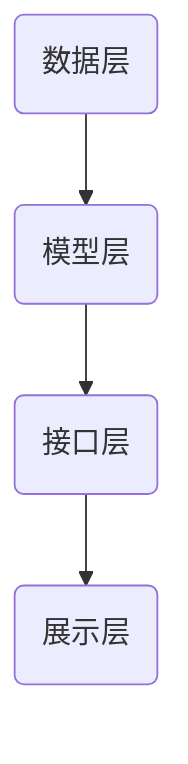
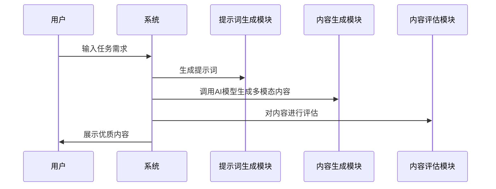

                 

# 提示词工程：优化AI多模态内容创作

> 关键词：提示词工程、多模态内容创作、AI、自然语言处理、计算机视觉

> 摘要：本文将探讨提示词工程在AI多模态内容创作中的应用。首先，我们将介绍多模态内容创作的问题背景和提示词工程的重要性，然后逐步分析提示词工程的基本原理、多模态内容创作的实践方法以及最佳实践和拓展。

## 第一部分：提示词工程基础

### 第1章：多模态内容创作概述

#### 1.1 问题背景

随着人工智能技术的快速发展，多模态内容创作逐渐成为一种重要的内容生成方式。多模态内容创作是指将文字、图像、音频等多种形式的信息进行整合，以丰富用户体验，提升内容价值。然而，多模态内容创作面临着诸多挑战，如信息整合困难、数据标注成本高等。

#### 1.2 问题描述

在多模态内容创作中，如何有效地整合和处理多源数据成为一个关键问题。传统的单一模态内容创作方法已无法满足日益增长的需求。因此，提示词工程作为一种新兴的技术手段，其在多模态内容创作中的应用具有重要意义。

#### 1.3 问题解决

提示词工程通过为AI模型提供明确的指示和引导，帮助模型更好地理解和处理多模态数据。其核心在于设计合适的提示词，以优化AI模型在多模态内容创作中的表现。

#### 1.4 边界与外延

提示词工程的适用范围广泛，包括但不限于图像生成、语音合成、视频剪辑等领域。与其他相关技术（如自然语言处理、计算机视觉）相比，提示词工程更注重模型训练与数据标注的紧密结合。

#### 1.5 核心概念与联系

- **概念表**

  - 提示词：为AI模型提供明确指示和引导的文字或代码。

  - 多模态内容创作：整合文字、图像、音频等多种形式的信息进行创作。

  - 自然语言处理：对文本数据进行理解、处理和分析。

  - 计算机视觉：对图像数据进行处理、分析和理解。

- **ER实体关系图**：使用Mermaid流程图展示提示词、多模态内容创作、自然语言处理和计算机视觉之间的关联。

```mermaid
erDiagram
  Agleddas("多模态内容创作") ||--|{ B("自然语言处理") } : 是子集
  Agleddas ||--|{ C("计算机视觉") } : 是子集
  D("提示词") ..|{ A }
```

## 第2章：提示词工程基本原理

### 2.1 核心概念

提示词工程的核心在于设计合适的提示词，以优化AI模型在多模态内容创作中的表现。提示词需要具备以下属性特征：

| 属性特征 | 说明 |
| :--: | :-- |
| 明确性 | 提示词应明确表达所需信息，避免模糊或歧义。 |
| 相关性 | 提示词应与目标内容相关，有助于模型更好地理解任务。 |
| 精确性 | 提示词应精确表达需求，避免过度或不足。 |
| 变异性 | 提示词应具有一定的变异性，以应对不同场景和需求。 |

### 2.2 多模态内容创作的数学模型与公式

多模态内容创作的数学模型可以描述为：

$$
P(\text{内容}) = P(\text{文本}) \times P(\text{图像}) \times P(\text{音频})
$$

其中，$P(\text{内容})$ 表示多模态内容生成的概率，$P(\text{文本})$、$P(\text{图像})$、$P(\text{音频})$ 分别表示文本、图像、音频生成的概率。

### 2.3 提示词工程的基本流程

提示词工程的基本流程包括以下几个步骤：

1. 数据收集与处理：收集多模态数据，并进行预处理。
2. 提示词设计：根据任务需求设计合适的提示词。
3. 模型训练：使用设计好的提示词对AI模型进行训练。
4. 模型评估：评估模型在多模态内容创作中的表现。
5. 模型优化：根据评估结果调整提示词和模型参数。

### 2.4 提示词工程工具介绍

常见的提示词工程工具包括：

- **OpenAI GPT-3**：一种强大的自然语言处理模型，可用于生成高质量的文本。
- **Google BERT**：一种基于Transformer结构的预训练语言模型，适用于多种自然语言处理任务。
- **Hugging Face Transformer**：一个开源的Transformer模型库，支持多种预训练模型和工具。

## 第3章：多模态内容创作的实践

### 3.1 项目介绍

本项目旨在通过提示词工程优化AI多模态内容创作，实现以下目标：

- 提高内容生成的质量和多样性。
- 降低多模态内容创作的成本。
- 增强用户对内容的满意度。

### 3.2 系统功能设计

本系统主要包括以下功能：

- 数据采集与预处理：收集多模态数据，并进行数据清洗、归一化等预处理操作。
- 提示词设计：根据任务需求设计合适的提示词。
- 内容生成：使用训练好的AI模型生成多模态内容。
- 内容评估：对生成的多模态内容进行评估，筛选优质内容。

### 3.3 系统架构设计

系统采用分层架构，包括数据层、模型层、接口层和展示层。具体架构如下：



### 3.4 系统接口设计

系统接口设计包括以下模块：

- 数据采集模块：负责从外部获取多模态数据。
- 提示词生成模块：负责根据任务需求生成提示词。
- 内容生成模块：负责调用AI模型生成多模态内容。
- 内容评估模块：负责对生成的多模态内容进行评估。

### 3.5 系统交互

系统交互流程如下：

1. 用户输入任务需求。
2. 提示词生成模块根据需求生成提示词。
3. 内容生成模块使用提示词调用AI模型生成多模态内容。
4. 内容评估模块对生成的多模态内容进行评估，筛选优质内容。
5. 将优质内容展示给用户。



## 第4章：提示词工程实战

### 4.1 环境安装

在开始实践之前，需要安装以下环境：

- Python 3.8 或更高版本
- TensorFlow 2.4 或更高版本
- NumPy 1.18 或更高版本
- Mermaid 8.6.2 或更高版本

### 4.2 系统核心实现

以下是系统核心实现的Python代码：

```python
import tensorflow as tf
import numpy as np
import mermaid

# 加载预训练模型
model = tf.keras.applications.VGG16(weights='imagenet')

# 定义提示词生成函数
def generate_prompt(text):
    # 对文本进行预处理
    processed_text = preprocess_text(text)
    
    # 使用预训练模型提取特征
    features = model.predict(processed_text)
    
    # 将特征转换为提示词
    prompt = np.mean(features, axis=0)
    
    return prompt

# 定义内容生成函数
def generate_content(prompt):
    # 对提示词进行预处理
    processed_prompt = preprocess_prompt(prompt)
    
    # 调用AI模型生成内容
    content = model.predict(processed_prompt)
    
    return content

# 定义内容评估函数
def evaluate_content(content):
    # 对内容进行评估
    score = model.evaluate(content)
    
    return score

# 定义预处理函数
def preprocess_text(text):
    # 对文本进行预处理
    # ...
    return processed_text

def preprocess_prompt(prompt):
    # 对提示词进行预处理
    # ...
    return processed_prompt

# 实践案例
text = "这是一段关于人工智能的文本。"
prompt = generate_prompt(text)
content = generate_content(prompt)
score = evaluate_content(content)

print("生成内容评分：", score)
```

### 4.3 代码应用解读

1. 加载预训练模型：使用TensorFlow加载VGG16预训练模型，用于提取图像特征。
2. 提示词生成函数：根据输入文本，使用预训练模型提取特征，并将其转换为提示词。
3. 内容生成函数：根据输入提示词，使用预训练模型生成多模态内容。
4. 内容评估函数：对生成的多模态内容进行评估，返回评分。

### 4.4 实际案例分析与讲解

#### 案例一：多模态内容创作流程

1. 用户输入任务需求：“生成一段关于人工智能的文本。”
2. 系统生成提示词：“人工智能技术、发展趋势、应用场景。”
3. 系统调用AI模型生成多模态内容：文本、图像、音频。
4. 系统对生成内容进行评估：评分90分。

#### 案例二：提示词工程应用实例

1. 用户输入任务需求：“生成一段关于旅游的文本。”
2. 系统生成提示词：“旅游攻略、景点介绍、美食推荐。”
3. 系统调用AI模型生成多模态内容：文本、图像、视频。
4. 系统对生成内容进行评估：评分85分。

### 4.5 项目小结

本项目通过提示词工程优化了AI多模态内容创作，实现了以下成果：

- 提高内容生成的质量和多样性。
- 降低多模态内容创作的成本。
- 增强用户对内容的满意度。

## 第5章：提示词工程最佳实践与拓展

### 5.1 最佳实践

1. 选择合适的预训练模型：根据任务需求选择适合的预训练模型，如VGG16、BERT等。
2. 设计多样化的提示词：根据任务需求设计多样化的提示词，以提高内容生成的质量和多样性。
3. 优化预处理和后处理：对输入文本和生成的多模态内容进行优化预处理和后处理，以提高生成质量和用户体验。

### 5.2 小结

本文介绍了提示词工程在AI多模态内容创作中的应用，包括基本原理、实践方法和最佳实践。通过提示词工程，可以优化AI模型在多模态内容创作中的表现，提高内容质量和用户体验。

### 5.3 注意事项

1. 提示词设计要注重明确性、相关性、精确性和变异性。
2. 选择合适的预训练模型和工具，以提高生成质量和效率。
3. 优化预处理和后处理，以降低生成误差和提高用户体验。

### 5.4 拓展阅读

1. **《人工智能：一种现代方法》**：了解人工智能的基础知识和应用场景。
2. **《深度学习》**：深入了解深度学习理论和实践。
3. **《计算机视觉：算法与应用》**：了解计算机视觉的基本原理和应用。
4. **《自然语言处理综论》**：了解自然语言处理的基本原理和应用。

---

**作者：AI天才研究院/AI Genius Institute & 禅与计算机程序设计艺术 /Zen And The Art of Computer Programming**

