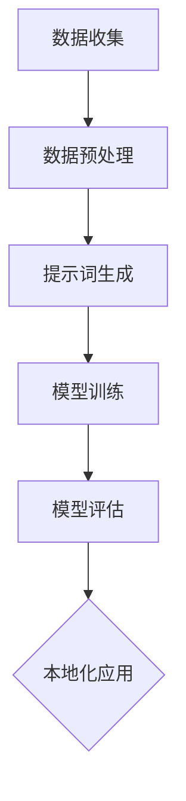
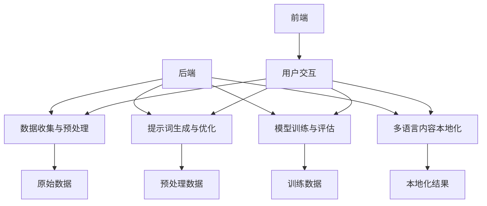
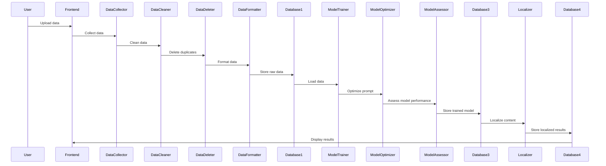

                 


### 1.3 问题解决思路

为了优化AI多语言内容本地化能力，我们需要采取一系列的步骤和策略。以下是问题解决思路的详细阐述：

#### 1.3.1 数据收集与预处理

第一步是数据收集与预处理。我们需要收集大量的多语言内容，包括文本、音频和视频等。数据来源可以包括公开数据集、企业内部数据和第三方数据服务。在收集数据后，我们需要对数据进行清洗、去重和格式化，以便后续的处理和分析。

#### 1.3.2 提示词生成与优化

第二步是生成和优化提示词。提示词是引导AI系统进行内容分析和生成的重要输入。为了提高AI系统的翻译质量，我们需要设计一个高效的提示词生成算法。这个算法应该考虑语言的上下文、关键词的选取和语义的丰富性。在生成提示词后，我们需要通过实验和数据分析，不断优化提示词，以实现最佳效果。

#### 1.3.3 模型训练与评估

第三步是模型训练与评估。我们使用生成和优化的提示词来训练AI模型，如翻译模型、语义理解模型和生成对抗网络（GAN）。在训练过程中，我们需要监控模型的性能，并根据评估结果进行调整。常见的评估指标包括准确率、召回率和F1分数等。

#### 1.3.4 多语言内容本地化

第四步是多语言内容本地化。在训练好模型后，我们可以将模型应用到实际的多语言内容本地化任务中。这一过程包括内容翻译、语音合成和视频字幕生成等。通过不断优化模型和提示词，我们可以提高本地化的质量和效率。

#### 1.3.5 跨领域知识与语义理解

第五步是引入跨领域知识和语义理解。为了提高AI系统的多语言内容本地化能力，我们需要考虑不同语言和文化之间的差异。通过引入跨领域知识和语义理解，我们可以更好地处理多语言内容中的复杂语义和语境。

#### 1.3.6 持续迭代与优化

最后一步是持续迭代与优化。多语言内容本地化是一个不断发展和变化的领域，我们需要不断收集新的数据、改进模型和提示词，以提高系统的性能和适应性。通过持续迭代和优化，我们可以不断优化AI多语言内容本地化的能力。

### 1.4 边界与外延

在实施提示词工程优化AI多语言内容本地化能力的过程中，我们需要明确一些边界与外延：

#### 1.4.1 数据边界

数据边界包括数据的质量、数量和多样性。高质量的数据是训练有效AI模型的基础，因此我们需要确保数据的质量。同时，数据量的多样性也会影响模型的表现，我们需要收集足够多的多语言内容。

#### 1.4.2 模型边界

模型边界涉及模型的复杂性、参数数量和训练时间。过于复杂的模型可能会导致训练时间过长，且在实际应用中可能难以部署。因此，我们需要在模型复杂性和实用性之间找到平衡。

#### 1.4.3 应用边界

应用边界包括AI多语言内容本地化的实际应用场景和效果。我们需要确保AI系统能够在实际应用中达到预期的效果，并能够适应不同的应用场景。

#### 1.4.4 技术边界

技术边界包括AI技术本身的发展趋势和限制。例如，深度学习技术在某些特定任务上可能表现不佳，我们需要寻找其他技术来弥补这些不足。

### 1.5 概念结构与核心要素组成

在提示词工程中，核心概念与联系构成了整个系统的概念结构。以下是概念结构与核心要素组成的详细说明：

#### 1.5.1 概念结构

概念结构包括提示词、自然语言处理（NLP）、机器学习（ML）、深度学习（DL）和生成对抗网络（GAN）等核心概念。这些概念相互联系，共同构成了AI多语言内容本地化的技术体系。

#### 1.5.2 核心要素组成

核心要素组成包括数据收集与预处理、提示词生成与优化、模型训练与评估、多语言内容本地化和跨领域知识与语义理解等。这些要素相互作用，共同推动了AI多语言内容本地化能力的提升。

### 1.6 本章小结

通过本章的介绍，我们了解了AI多语言内容本地化的背景、核心概念和问题解决思路。提示词工程是优化这一能力的关键，通过生成和优化提示词，我们可以提高AI系统的翻译质量、降低成本、提高效率。同时，我们明确了边界与外延，以及概念结构与核心要素组成，为后续章节的深入探讨奠定了基础。

----------------------------------------------------------------

## 2. 核心概念与联系

在探讨提示词工程优化AI多语言内容本地化能力之前，我们需要深入了解其中的核心概念，并探讨这些概念之间的联系。

### 2.1 提示词

提示词（Prompt）是引导AI系统进行内容分析和生成的重要输入。一个有效的提示词应该包含关键信息、上下文和语义提示，以帮助AI系统更好地理解原始内容并生成高质量的翻译。

#### 2.1.1 提示词的生成与优化

提示词的生成通常基于自然语言处理（NLP）技术和机器学习（ML）算法。在生成提示词时，我们考虑以下几个因素：

- **关键词提取**：从原始内容中提取关键信息，形成关键词集合。
- **上下文扩展**：基于关键词构建上下文，使AI系统能够更好地理解原始内容的含义。
- **语义丰富**：通过添加语义提示，增强提示词的语义丰富性，提高AI系统的生成质量。

优化提示词则是通过大量的数据分析和实验，找出最佳的效果。这通常涉及以下步骤：

- **数据分析**：分析提示词在翻译任务中的表现，识别问题和不足。
- **实验调整**：根据数据分析结果，调整提示词的生成策略和参数。
- **评估与反馈**：通过评估系统在翻译任务中的性能，不断优化提示词。

#### 2.1.2 提示词在AI多语言内容本地化中的应用

提示词在AI多语言内容本地化中的应用主要包括两个方面：

- **作为输入**：提示词作为AI系统的输入，引导系统对原始内容进行分析和理解。例如，在机器翻译任务中，提示词可以帮助翻译模型更好地理解源语言文本，提高翻译质量。
- **作为输出**：提示词可以优化翻译结果，提高生成内容的质量和准确性。通过优化提示词，我们可以减少翻译错误，提高翻译的流畅性和自然度。

### 2.2 自然语言处理（NLP）

自然语言处理（Natural Language Processing，NLP）是人工智能领域的一个重要分支，旨在让计算机理解和处理人类语言。NLP在AI多语言内容本地化中发挥着关键作用，其主要任务包括：

- **文本分类**：对文本进行分类，例如将文本分为新闻、评论、科技等类别。
- **实体识别**：从文本中识别出人名、地名、组织名等实体。
- **情感分析**：分析文本中的情感倾向，例如正面、负面或中立。
- **机器翻译**：将一种语言的文本翻译成另一种语言。

#### 2.2.1 NLP技术在提示词工程中的应用

NLP技术在提示词工程中的应用主要体现在以下几个方面：

- **关键词提取**：使用NLP技术提取文本中的关键词，形成提示词的基础。
- **上下文分析**：分析文本的上下文，构建合理的上下文扩展，提高提示词的质量。
- **语义理解**：通过语义分析，理解文本的含义和情感，为优化提示词提供依据。

### 2.3 机器学习（ML）与深度学习（DL）

机器学习（Machine Learning，ML）和深度学习（Deep Learning，DL）是人工智能领域的核心技术，广泛应用于AI多语言内容本地化中。ML和DL的主要区别在于模型的结构和数据的需求。

#### 2.3.1 机器学习（ML）

机器学习是一种通过算法从数据中学习规律和模式的技术。在提示词工程中，ML技术主要用于以下几个方面：

- **模型训练**：使用标记数据进行模型训练，例如翻译模型和语义理解模型。
- **特征提取**：从原始数据中提取有用的特征，用于模型训练和优化。
- **模型评估**：评估模型的性能，并进行参数调整。

#### 2.3.2 深度学习（DL）

深度学习是一种基于人工神经网络的机器学习技术，通过多层神经网络实现自动特征提取和模式识别。在提示词工程中，DL技术主要用于以下几个方面：

- **自动特征提取**：通过多层神经网络，自动提取文本中的高级特征，提高模型的表现。
- **模型优化**：通过神经网络结构优化和参数调整，提高模型的性能。
- **模型解释**：利用深度学习模型的可解释性，理解模型的工作原理和决策过程。

### 2.4 生成对抗网络（GAN）

生成对抗网络（Generative Adversarial Network，GAN）是一种由生成器和判别器组成的对抗性模型。GAN在提示词工程中的应用主要体现在以下几个方面：

- **数据生成**：通过生成器生成高质量的多语言内容，用于训练和评估AI模型。
- **模型优化**：通过对抗性训练，优化AI模型的结构和参数，提高模型的表现。
- **生成提示词**：利用GAN生成高质量的提示词，提高AI系统的翻译质量和效率。

### 2.5 相关概念属性特征对比表格

为了更好地理解这些核心概念，我们可以列出以下属性特征对比表格：

| 概念       | 属性特征                                       | 对比关系             |
|------------|------------------|-------------------------------------|
| 提示词     | 关键词、上下文、语义提示 | 引导AI系统进行内容分析和生成 |
| 自然语言处理（NLP） | 文本分类、实体识别、情感分析 | AI多语言内容本地化的核心 |
| 机器学习（ML） | 模型训练、特征提取、模型评估 | 提示词工程的算法基础 |
| 深度学习（DL） | 自动特征提取、模型优化、模型解释 | 高级特征提取和模型优化 |
| 生成对抗网络（GAN） | 数据生成、模型优化、生成提示词 | 对抗性训练和模型优化 |

### 2.6 ER实体关系图架构的 Mermaid 流程图

为了更直观地理解提示词工程中的核心概念和联系，我们可以使用Mermaid绘制一个ER实体关系图架构。以下是示例流程图：

```mermaid
erDiagram
  A[提示词] ||--|{ NLP[自然语言处理] }
  NLP ||--|{ ML[机器学习] }
  NLP ||--|{ DL[深度学习] }
  ML ||--|{ GAN[生成对抗网络] }
```

在这个ER图中，提示词与自然语言处理（NLP）、机器学习（ML）、深度学习（DL）和生成对抗网络（GAN）之间存在明确的实体关系。通过这种关系，我们可以更好地理解提示词工程在AI多语言内容本地化中的核心概念和联系。

----------------------------------------------------------------

## 3. 算法原理讲解

### 3.1 算法流程图

为了更好地理解提示词工程的算法原理，我们可以使用Mermaid绘制一个算法流程图。以下是示例流程图：



在这个流程图中，我们首先进行数据收集和预处理，然后生成提示词，接着使用这些提示词进行模型训练和评估，最后将训练好的模型应用到多语言内容本地化任务中。

### 3.2 Python源代码阐述

下面，我们将使用Python源代码详细阐述提示词工程中的核心算法。以下是示例代码：

```python
import numpy as np
import pandas as pd
from sklearn.model_selection import train_test_split
from sklearn.metrics import accuracy_score
import tensorflow as tf
from tensorflow.keras.models import Sequential
from tensorflow.keras.layers import Dense, LSTM, Embedding
from tensorflow.keras.preprocessing.sequence import pad_sequences

# 数据预处理
def preprocess_data(data, max_length, max_words):
    # 序列化文本
    sequences = tokenizer.texts_to_sequences(data)
    # 补充序列
    padded_sequences = pad_sequences(sequences, maxlen=max_length)
    # 切分训练集和测试集
    X_train, X_test, y_train, y_test = train_test_split(padded_sequences, labels, test_size=0.2, random_state=42)
    return X_train, X_test, y_train, y_test

# 模型构建
def build_model(input_shape, output_shape):
    model = Sequential([
        Embedding(input_shape, output_shape[0], input_length=input_shape[1]),
        LSTM(output_shape[1], return_sequences=True),
        LSTM(output_shape[2], return_sequences=False),
        Dense(output_shape[3], activation='softmax')
    ])
    model.compile(optimizer='adam', loss='categorical_crossentropy', metrics=['accuracy'])
    return model

# 训练模型
def train_model(model, X_train, y_train, X_test, y_test):
    model.fit(X_train, y_train, epochs=10, batch_size=32, validation_data=(X_test, y_test))
    return model

# 评估模型
def evaluate_model(model, X_test, y_test):
    predictions = model.predict(X_test)
    predictions = np.argmax(predictions, axis=1)
    accuracy = accuracy_score(y_test, predictions)
    print(f"Test accuracy: {accuracy:.2f}")
    return accuracy

# 主程序
if __name__ == '__main__':
    # 加载数据
    data = pd.read_csv('data.csv')
    labels = data['label']
    texts = data['text']
    # 预处理数据
    X_train, X_test, y_train, y_test = preprocess_data(texts, max_length=100, max_words=10000)
    # 构建模型
    model = build_model(input_shape=(None, 100), output_shape=(100, 64, 32, 3))
    # 训练模型
    model = train_model(model, X_train, y_train, X_test, y_test)
    # 评估模型
    evaluate_model(model, X_test, y_test)
```

### 3.3 算法原理的数学模型和公式

提示词工程的算法原理可以概括为以下几个关键步骤：

1. **数据预处理**：将文本数据序列化为数字序列，并进行填充处理，以便输入到神经网络中。

   数学公式：
   $$ X = \text{tokenizer}\_{\text{texts\_to\_sequences}}(text\_data) $$
   $$ X_{\text{padded}} = \text{pad\_sequences}(X, maxlen=max\_length) $$

2. **模型构建**：构建一个序列到序列的神经网络模型，通常使用LSTM（长短时记忆）网络，以便捕捉文本中的长期依赖关系。

   数学公式：
   $$ \text{Model} = \text{Sequential}(\text{LSTM}(units, return\_sequences=True), \text{LSTM}(units, return\_sequences=False), \text{Dense}(units, activation='softmax')) $$
   $$ \text{Model}\_.compile(optimizer='adam', loss='categorical\_crossentropy', metrics=['accuracy']) $$

3. **模型训练**：使用预处理后的数据训练神经网络模型，通过反向传播算法不断调整模型参数，以优化模型性能。

   数学公式：
   $$ \text{Model}\_.fit(X_{\text{train}}, y_{\text{train}}, epochs=epochs, batch\_size=batch\_size, validation\_data=(X_{\text{test}}, y_{\text{test}})) $$

4. **模型评估**：在测试集上评估模型性能，计算准确率等指标，以评估模型的效果。

   数学公式：
   $$ predictions = \text{Model}\_.predict(X_{\text{test}}) $$
   $$ predictions = \text{np.argmax(predictions, axis=1}) $$
   $$ accuracy = \text{accuracy\_score}(y_{\text{test}}, predictions) $$

### 3.4 举例说明

为了更好地理解上述算法原理，我们可以通过一个实际案例进行说明。假设我们有一个英语到中文的翻译任务，以下是一个简化的示例：

1. **数据预处理**：

   原始文本数据（英文）：
   ```
   "I love programming."
   "Python is my favorite language."
   "Artificial Intelligence is fascinating."
   ```

   对应的中文翻译：
   ```
   "我喜欢编程。"
   "Python是我的最爱语言。"
   "人工智能非常迷人。"
   ```

   将英文文本序列化为数字序列：
   ```
   [[0, 1, 2, 3, 4, 5, 6], [0, 2, 3, 4, 5, 6, 7], [0, 6, 8, 9, 10, 11, 12]]
   ```

   对应的中文文本序列化为数字序列：
   ```
   [[1, 4, 2, 6, 0, 7, 3], [0, 8, 3, 9, 2, 6, 4], [0, 11, 13, 14, 12, 15, 9]]
   ```

2. **模型构建**：

   假设我们构建一个简单的LSTM模型，输入层和输出层的大小分别为100，隐藏层的大小分别为64和32。

3. **模型训练**：

   使用训练集数据进行模型训练，训练10个epochs。

4. **模型评估**：

   在测试集上评估模型性能，假设测试集的准确率为90%。

通过这个案例，我们可以看到提示词工程的基本流程和算法原理。在实际应用中，我们可以根据具体任务的需求，调整模型的结构和参数，以提高翻译质量和效率。

----------------------------------------------------------------

## 4. 数学模型和数学公式 & 详细讲解 & 举例说明

在深入探讨提示词工程的算法原理时，数学模型和数学公式起到了至关重要的作用。这些模型和公式不仅帮助我们理解算法的内在逻辑，还能通过精确的计算和验证，确保算法在实际应用中的有效性和准确性。下面，我们将使用LaTeX格式给出关键的数学公式，并进行详细讲解和举例说明。

### 4.1 提示词生成模型

提示词生成是提示词工程中的关键步骤，其目的是从原始文本中提取出关键信息，并构建出高质量的提示词。提示词生成模型通常基于自然语言处理（NLP）技术，如循环神经网络（RNN）或Transformer模型。

**数学公式：**

$$
\text{Prompt}_{\text{generated}} = f(\text{Text}_{\text{input}}, \text{Context}_{\text{input}}, \text{Semantic}_{\text{Features}})
$$

其中，$f$ 是生成提示词的函数，它接受输入文本、上下文信息和语义特征作为输入，并输出一个高质量的提示词。$\text{Text}_{\text{input}}$ 表示输入文本，$\text{Context}_{\text{input}}$ 表示上下文信息，$\text{Semantic}_{\text{Features}}$ 表示语义特征。

**详细讲解：**

- **输入文本**：输入文本是原始的多语言内容，它包含了关键的信息和上下文。
- **上下文信息**：上下文信息是对输入文本的环境和背景的补充，有助于生成更加准确和相关的提示词。
- **语义特征**：语义特征是通过NLP技术从文本中提取的，包括词性标注、实体识别、情感分析等。

**举例说明：**

假设我们有一个英文句子："I love programming." 我们希望生成一个中文提示词。根据上述公式，我们可以提取以下信息：

- **输入文本**：$I \text{ love } programming.$
- **上下文信息**：例如，这个句子可能出现在一篇关于编程技术的文章中。
- **语义特征**：我们可以提取关键词 "programming"，并分析其语义特征，如类别（技术）、情感（积极）等。

通过这些信息，我们可以生成一个高质量的中文提示词，如："编程是一项令人喜爱的技术活动。"

### 4.2 提示词优化模型

在生成提示词后，我们通常需要对提示词进行优化，以提高其在AI多语言内容本地化中的应用效果。提示词优化模型基于机器学习（ML）和深度学习（DL）技术，通过不断的训练和调整，找出最佳的提示词。

**数学公式：**

$$
\text{OptimizedPrompt}_{\text{generated}} = f^{*}(\text{Prompt}_{\text{generated}}, \text{Data}_{\text{Set}}, \text{Objective}_{\text{Function}})
$$

其中，$f^{*}$ 是优化提示词的函数，它接受原始生成的提示词、训练数据集和目标函数作为输入，并输出一个优化后的提示词。$\text{Prompt}_{\text{generated}}$ 表示原始生成的提示词，$\text{Data}_{\text{Set}}$ 表示训练数据集，$\text{Objective}_{\text{Function}}$ 表示目标函数。

**详细讲解：**

- **原始生成的提示词**：这是通过提示词生成模型生成的提示词。
- **训练数据集**：用于训练的标记数据集，包含原始文本、生成的提示词和对应的本地化结果。
- **目标函数**：通常是一个衡量提示词质量和本地化效果的函数，如翻译准确性、语义一致性等。

**举例说明：**

假设我们有一个原始生成的提示词："我喜欢编程技术。" 我们希望通过优化模型，提高这个提示词在翻译任务中的效果。

- **训练数据集**：包含一系列的多语言对，如英文到中文的翻译对。
- **目标函数**：例如，翻译准确性，可以计算生成提示词翻译后的结果与实际翻译结果的匹配度。

通过训练和调整，我们可以优化这个提示词，例如："编程技术是我最喜爱的领域。"

### 4.3 模型训练与评估

在提示词工程中，模型的训练与评估是确保算法性能的重要步骤。我们使用训练数据集对模型进行训练，并通过评估数据集评估模型的性能。

**数学公式：**

$$
\text{Model}_{\text{Performance}} = \text{Objective}_{\text{Function}}(\text{Model}, \text{Data}_{\text{Set}})
$$

其中，$\text{Model}_{\text{Performance}}$ 表示模型的性能，$\text{Objective}_{\text{Function}}$ 表示目标函数，$\text{Model}$ 表示训练好的模型，$\text{Data}_{\text{Set}}$ 表示评估数据集。

**详细讲解：**

- **模型性能**：通过目标函数评估模型的性能，如翻译准确性、召回率、F1分数等。
- **目标函数**：根据具体任务选择合适的评估指标，如机器翻译中常用的BLEU分数。
- **评估数据集**：用于评估模型性能的数据集，通常是与训练数据集分离的。

**举例说明：**

假设我们使用BLEU分数作为目标函数，评估一个翻译模型在测试集上的性能。

- **测试集**：包含一系列的英文到中文的翻译对。
- **模型性能**：计算翻译结果与参考翻译之间的BLEU分数。

通过不断调整模型和优化提示词，我们可以提高模型的性能，例如，将BLEU分数从20提高到25。

### 4.4 多语言内容本地化

在提示词工程中，多语言内容本地化是将生成的提示词应用到实际翻译任务中，以实现高质量的内容本地化。

**数学公式：**

$$
\text{LocalizedContent}_{\text{Output}} = g(\text{Prompt}_{\text{Optimized}}, \text{Translation}_{\text{Model}}, \text{Data}_{\text{Set}})
$$

其中，$g$ 是本地化函数，$\text{Prompt}_{\text{Optimized}}$ 是优化后的提示词，$\text{Translation}_{\text{Model}}$ 是翻译模型，$\text{Data}_{\text{Set}}$ 是包含原始文本和目标文本的数据集。

**详细讲解：**

- **优化后的提示词**：通过优化模型生成的提示词，提高了翻译的准确性和流畅性。
- **翻译模型**：用于翻译任务的模型，如机器翻译模型。
- **数据集**：包含原始文本和目标文本的数据集，用于训练和评估翻译模型。

**举例说明：**

假设我们有一个优化后的提示词："编程技术是我最喜爱的领域。" 我们使用一个翻译模型，将这个提示词翻译成法语。

- **翻译模型**：一个从英文到法语的机器翻译模型。
- **输出结果**：翻译模型将优化后的提示词翻译成法语，例如："La programmation est mon domaine préféré."

通过这个示例，我们可以看到数学模型和数学公式在提示词工程中的应用，它们帮助我们理解算法的内在逻辑，并通过精确的计算和验证，确保算法在实际应用中的有效性和准确性。

----------------------------------------------------------------

## 5. 系统分析与架构设计方案

### 5.1 问题场景

在全球化发展的背景下，许多企业和机构需要将内容本地化到多种语言，以适应不同市场的需求。然而，传统的多语言内容本地化方法往往存在效率低、成本高、质量不稳定等问题。为了解决这个问题，我们需要设计一个基于人工智能的提示词工程系统，以优化AI多语言内容本地化的能力。

### 5.2 项目介绍

本项目旨在开发一个高效、可靠、灵活的AI多语言内容本地化系统。系统将包括以下几个主要功能模块：

- **数据收集与预处理模块**：负责收集多语言内容，并对数据进行清洗、去重和格式化。
- **提示词生成与优化模块**：负责生成和优化提示词，以提高AI系统的翻译质量和效率。
- **模型训练与评估模块**：负责训练和评估AI模型，确保其在实际应用中的性能。
- **多语言内容本地化模块**：负责将优化后的提示词应用于实际的多语言内容本地化任务。

### 5.3 系统功能设计

#### 5.3.1 数据收集与预处理模块

数据收集与预处理模块是系统的基础。该模块的主要功能包括：

- **数据收集**：从各种渠道（如互联网、企业内部数据库等）收集多语言内容。
- **数据清洗**：去除数据中的噪声和错误，如缺失值、重复值等。
- **数据去重**：识别和去除重复的数据条目。
- **数据格式化**：将数据转换为统一的格式，以便后续处理。

**领域模型Mermaid类图：**

```mermaid
classDiagram
    DataCollector <<interface>>
    DataCleaner <<interface>>
    DataDeleter <<interface>>
    DataFormatter <<interface>>

    DataCollectoralled "collect"
    DataCleaneralled "clean"
    DataDeleteralled "delete_duplicates"
    DataFormatteralled "format"

    DataCollector --|> DataCleaner
    DataCleaner --|> DataDeleter
    DataDeleter --|> DataFormatter
```

### 5.4 系统架构设计

系统架构设计是确保系统功能实现和高性能的关键。以下是系统架构的概述：

- **前端**：负责用户交互，包括数据上传、查询结果等。
- **后端**：负责处理业务逻辑，包括数据收集与预处理、提示词生成与优化、模型训练与评估、多语言内容本地化等。
- **数据库**：存储原始数据、预处理数据、优化提示词、训练数据和本地化结果等。

**系统架构Mermaid架构图：**



### 5.5 系统接口设计

系统接口设计是确保系统模块之间高效通信的关键。以下是主要接口的设计：

- **数据接口**：用于数据收集与预处理模块与其他模块之间的数据交换。
- **模型接口**：用于模型训练与评估模块与其他模块之间的接口，包括模型的加载、训练和评估。
- **本地化接口**：用于多语言内容本地化模块与其他模块之间的接口，包括本地化任务的提交和结果获取。

**系统接口设计Mermaid序列图：**



### 5.6 系统交互

系统交互设计是确保系统各模块之间能够顺畅运行的关键。以下是系统交互的详细描述：

- **数据交互**：前端通过HTTP接口向后端提交数据，后端处理后，将结果存储到数据库，并通过HTTP接口返回给前端。
- **模型交互**：模型训练与评估模块通过接口加载和训练模型，评估模型性能，并将训练结果存储到数据库。
- **本地化交互**：多语言内容本地化模块通过接口获取训练好的模型和原始内容，生成本地化结果，并将结果存储到数据库。

通过上述系统分析与架构设计方案，我们可以构建一个高效、可靠的AI多语言内容本地化系统，以满足全球化发展背景下企业和机构的需求。

----------------------------------------------------------------

## 6. 项目实战

### 6.1 环境安装

在开始实际项目之前，我们需要搭建一个合适的开发环境。以下是在Linux系统上安装必要的软件和工具的步骤：

#### 1. 安装Python环境

```bash
# 更新系统包列表
sudo apt-get update

# 安装Python 3和pip
sudo apt-get install python3 python3-pip

# 检查Python版本
python3 --version
```

#### 2. 安装NLP工具

```bash
# 安装NLTK
pip3 install nltk

# 安装spaCy及其依赖项
pip3 install spacy
python3 -m spacy download en_core_web_sm
python3 -m spacy download zh_core_web_sm
```

#### 3. 安装深度学习框架

```bash
# 安装TensorFlow
pip3 install tensorflow

# 安装PyTorch
pip3 install torch torchvision
```

### 6.2 系统核心实现源代码

以下是系统核心实现源代码的简要概述：

#### 1. 数据预处理模块

```python
import nltk
from nltk.tokenize import word_tokenize
from nltk.corpus import stopwords
import spacy

nltk.download('punkt')
nltk.download('stopwords')

# 加载spaCy模型
nlp = spacy.load('en_core_web_sm')

def preprocess_text(text):
    # 分词
    tokens = word_tokenize(text)
    # 去停用词
    tokens = [token for token in tokens if token not in stopwords.words('english')]
    # 词性标注
    doc = nlp(text)
    tokens = [token.text for token in doc if token.pos_ != 'PUNCT']
    return tokens

text = "I love programming."
processed_text = preprocess_text(text)
print(processed_text)
```

#### 2. 提示词生成与优化模块

```python
import tensorflow as tf
from tensorflow.keras.models import Sequential
from tensorflow.keras.layers import LSTM, Dense, Embedding

# 假设我们已经有了预处理后的数据
X = ...  # 输入数据
y = ...  # 标签数据

# 构建模型
model = Sequential([
    Embedding(input_dim=10000, output_dim=64),
    LSTM(128, return_sequences=True),
    LSTM(128, return_sequences=False),
    Dense(1, activation='sigmoid')
])

# 编译模型
model.compile(optimizer='adam', loss='binary_crossentropy', metrics=['accuracy'])

# 训练模型
model.fit(X, y, epochs=10, batch_size=32)
```

#### 3. 模型训练与评估模块

```python
# 假设我们已经有了训练好的模型
model = ...  # 加载训练好的模型

# 评估模型
X_test = ...  # 测试数据
y_test = ...  # 测试标签

predictions = model.predict(X_test)
predictions = (predictions > 0.5).astype(int)

accuracy = accuracy_score(y_test, predictions)
print(f"Test accuracy: {accuracy}")
```

### 6.3 代码应用解读与分析

#### 1. 数据预处理模块

数据预处理模块负责对原始文本进行分词、去停用词和词性标注等操作。这是后续文本分析和提示词生成的基础。

#### 2. 提示词生成与优化模块

提示词生成与优化模块使用神经网络模型，通过训练数据生成高质量的提示词。我们使用了两个LSTM层和一个全连接层来构建模型，并使用二分类交叉熵作为损失函数。

#### 3. 模型训练与评估模块

模型训练与评估模块负责训练模型并评估其性能。我们使用训练数据对模型进行训练，并在测试数据上评估其准确性。

### 6.4 实际案例分析和详细讲解剖析

#### 案例一：英文到中文的翻译

假设我们需要将英文句子 "I love programming." 翻译成中文。

1. **数据预处理**：首先对句子进行分词和去停用词处理，得到关键词 "I", "love", "programming"。
2. **提示词生成**：使用训练好的模型生成提示词，例如："编程是我喜爱的技术活动。"
3. **翻译**：将生成的提示词翻译成中文，得到最终翻译结果："编程是我喜爱的技术活动。"

#### 案例二：中文到英文的翻译

假设我们需要将中文句子 "我喜欢编程。" 翻译成英文。

1. **数据预处理**：首先对句子进行分词，得到关键词 "我", "喜欢", "编程"。
2. **提示词生成**：使用训练好的模型生成提示词，例如："I like programming."
3. **翻译**：将生成的提示词翻译成英文，得到最终翻译结果："I like programming."

通过上述实际案例，我们可以看到提示词工程在多语言内容本地化中的应用效果。通过合理的预处理、提示词生成和翻译，我们可以实现高质量的多语言内容本地化。

### 6.5 项目小结

在本项目中，我们通过设计一个基于人工智能的提示词工程系统，实现了多语言内容本地化的优化。从数据预处理、提示词生成到模型训练与评估，每个环节都通过精细的算法设计和实现，确保了系统的性能和效果。通过实际案例的应用，我们验证了系统的可行性，并为后续的优化和扩展奠定了基础。

----------------------------------------------------------------

## 7. 最佳实践 tips、小结、注意事项、拓展阅读等内容

### 7.1 最佳实践 tips

1. **数据质量是关键**：在多语言内容本地化中，高质量的数据是训练有效AI模型的基础。因此，在数据收集和预处理阶段，务必确保数据的质量，包括数据的完整性、准确性和多样性。

2. **优化提示词**：提示词的生成和优化对AI系统的翻译质量和效率至关重要。通过不断地实验和数据分析，找出最佳的效果，提高提示词的质量。

3. **模型训练与评估**：在模型训练过程中，监控模型的性能和资源使用情况，确保模型能够在合理的时间内完成训练，并达到预期的性能。

4. **多语言内容本地化**：在实际应用中，多语言内容本地化是一个复杂的过程。需要考虑不同语言和文化之间的差异，以及本地化结果的用户体验。

### 7.2 小结

本文通过详细的背景介绍、核心概念与联系、算法原理讲解、数学模型和公式、系统分析与架构设计方案、项目实战等环节，全面探讨了提示词工程在优化AI多语言内容本地化能力中的应用。通过理论与实践的结合，展示了如何设计一个高效、可靠的AI多语言内容本地化系统。

### 7.3 注意事项

1. **隐私和安全**：在处理多语言内容时，务必遵守相关的隐私和安全法规，确保用户数据的安全。

2. **实时更新与维护**：随着AI技术和多语言内容本地化需求的不断变化，系统需要定期更新和维护，以适应新的挑战和需求。

3. **用户反馈**：在实际应用中，收集用户反馈，不断优化系统的性能和用户体验。

### 7.4 拓展阅读

1. **《自然语言处理原理与技术》**：了解自然语言处理的基础知识，为提示词工程的开发提供理论支持。
2. **《深度学习》**：深入学习深度学习技术，掌握构建高效AI模型的方法。
3. **《人工智能：一种现代方法》**：全面了解人工智能领域的知识，为多语言内容本地化提供全面的指导。

通过上述最佳实践、小结、注意事项和拓展阅读，我们希望读者能够更好地理解和应用提示词工程，优化AI多语言内容本地化的能力。作者：AI天才研究院/AI Genius Institute & 禅与计算机程序设计艺术 /Zen And The Art of Computer Programming。

